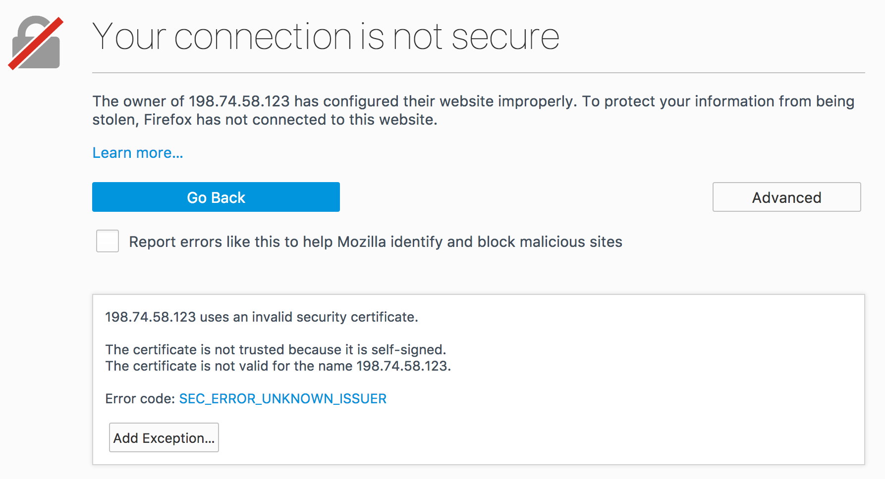
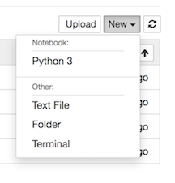

---
author:
    name: Sam Foo
    email: docs@linode.com
description: 'This guide shows you how to install and access a Jupyter notebook on a Linode remotely and securely through an Apache reverse proxy.'
keywords: ["Apache2", "Jupyter notebook", "SSL", "websocket"]
license: '[CC BY-ND 4.0](http://creativecommons.org/licenses/by-nd/4.0/)'
published: 2017-08-22
modified: 2017-08-22
modified_by:
    name: Sam Foo
title: 'Install a Jupyter Notebook Server on a Linode Behind an Apache Reverse Proxy'
external_resources:
 - '[Jupyter Notebook Documentation](https://jupyter-notebook.readthedocs.io/en/stable/)'
 - '[Anaconda Documentation](https://docs.continuum.io/)'
 - '[Certbot](https://certbot.eff.org/)'
---

Jupyter Notebook is an interactive, enhanced shell that can be run within a web browser. Notebook is popular among data scientists, and supports inline rendering of figures, exporting to a variety of formats, and LaTeX for mathematical notation. This guide aims to configure on a Linode a public Jupyter Notebook server that will facilitate remote access to your computation needs using Apache as a reverse proxy.

## Before You Begin

Because this guide is written for Linodes running Ubuntu 16.04, you should:

1.  Familiarize yourself with our [Getting Started](/docs/getting-started/) guide and log into your server via SSH.
2.  Have [Apache 2.4.18 or higher](https://help.ubuntu.com/lts/serverguide/httpd.html) installed.

## Install Anaconda Package Manager

Anaconda is a package manager with built-in support for virtual environments. It comes with each installation of Jupyter Notebook and is recommended by Jupyter's official documentation.

1.  SSH into your Linode and install the latest version of Anaconda. The example below downloads the version of Anaconda with Python 3.6 (but Python 2.7 is also available):

        wget https://repo.continuum.io/archive/Anaconda3-4.4.0-Linux-x86_64.sh

2.  Run the installation script:

        bash ~/Anaconda3-4.4.0-Linux-x86_64.sh

3.  Follow the prompts in the terminal, accept the terms, and allow the installer create a PATH in `.bashrc`.

4.  Reload the new `.bashrc` changes with:

        exec bash

## Create a Self-Signed Certificate

The official documentation recommends generating a self-signed SSL certificate to prevent sending unencrypted passwords in the Notebook from the browser. This is especially important because Jupyter Notebooks can run bash scripts. If you have a domain name, consider using [Certbot](https://certbot.eff.org/#ubuntuxenial-apache) rather than a self-signed certificate.

1.  Create a self-signed certificate valid for 365 days:

        openssl req -x509 -nodes -days 365 -newkey rsa:1024 -keyout mykey.key -out mycert.pem

    This command will create a `mykey.key` and `mycert.pem`.

2.  Restrict the files to only be read by the owner:

        chmod 400 mykey.key
        chmod 400 mycert.pem

## Configure Jupyter Notebook

1.  Generate a new configuration file. This will create a `~/.jupyter` directory:

        jupyter notebook --generate-config

2.  Create a password for the notebook:

        jupyter notebook password

3.  Copy the password from the newly created `jupyter_notebook_config.json` file.

4.  Uncomment the following lines in the configuration file:

    
c.NotebookApp.allow_origin = '*'
c.NotebookApp.base_url = '/jupyter'
c.NotebookApp.certfile = '/absolute/path/to/mycert.pem'
c.NotebookApp.ip = 'localhost'
c.NotebookApp.keyfile = '/absolute/path/to/mykey.key'
c.NotebookApp.open_browser = False
c.NotebookApp.password = 'paste_hashed_password_here'
c.NotebookApp.trust_xheaders = True



## Configure Apache Reverse Proxy

1.  Install Apache 2.4:

        sudo apt install apache2

2.  Enable a2enmod:

        sudo a2enmod

    A prompt will appear with a list of mods for Apache:

        Your choices are: access_compat actions alias allowmethods asis auth_basic auth_digest auth_form authn_anon authn_core authn_dbd authn_dbm authn_file authn_socache authnz_fcgi authnz_ldap authz_core authz_dbd authz_dbm authz_groupfile authz_host authz_owner authz_user autoindex buffer cache cache_disk cache_socache cgi cgid charset_lite data dav dav_fs dav_lock dbd deflate dialup dir dump_io echo env expires ext_filter file_cache filter headers heartbeat heartmonitor ident include info lbmethod_bybusyness lbmethod_byrequests lbmethod_bytraffic lbmethod_heartbeat ldap log_debug log_forensic lua macro mime mime_magic mpm_event mpm_prefork mpm_worker negotiation proxy proxy_ajp proxy_balancer proxy_connect proxy_express proxy_fcgi proxy_fdpass proxy_ftp proxy_html proxy_http proxy_scgi proxy_wstunnel ratelimit reflector remoteip reqtimeout request rewrite sed session session_cookie session_crypto session_dbd setenvif slotmem_plain slotmem_shm socache_dbm socache_memcache socache_shmcb speling ssl status substitute suexec unique_id userdir usertrack vhost_alias xml2enc

        Which module(s) do you want to enable (wildcards ok)?

3.  Enable `mod_proxy`, `mod_proxy_http`, `mod_proxy_wstunnel`, `mod_ssl`, and `mod_headers`:

        proxy proxy_http proxy_https proxy_wstunnel ssl headers

4.  Navigate to the `/etc/apache2/sites-available` directory. Copy the default configuration file then add directives on virtualhost:

        sudo cp 000-default.conf jupyter.conf

5.  Comment out `DocumentRoot` to allow `https://your-domain-name/` to redirect as `https://your-domain-name/jupyter`. The `<Location>` directive connects the websocket in order to allow the default kernel to run:

    
<VirtualHost *:443>
    ServerAdmin webmaster@localhost
#   DocumentRoot /var/www/html

    ErrorLog ${APACHE_LOG_DIR}.error.log
    CustomLog ${APACHE_LOG_DIR}/access.log combined

    SSLCertificateFile /absolute/path/to/mycert.pem
    SSLCertificateKeyFile /absolute/path/to/mykey.key
    SSLProxyEngine On
    SSLProxyVerify none
    SSLProxyCheckPeerCN off
    SSLProxyCheckPeerName off
    SSLProxyCheckPeerExpire off

    ServerName localhost
    ProxyPreserveHost On
    ProxyRequests Off
    LogLevel debug

    ProxyPass /jupyter https://localhost:8888/jupyter
    ProxyPassReverse /jupyter https://localhost:8888/jupyter
    RequestHeader set Origin "https://localhost:8888"
    Redirect permanent / https://your-domain-name/jupyter

    <Location "/jupyter/api/kernels">
        ProxyPass wss://localhost:8888/jupyter/api/kernels
        ProxyPassReverse wss://localhost:8888/jupyter/api/kernels
    </Location>

</VirtualHost>



    
The `/jupyter` url path can have any name as long as it matches the base url path defined in the Jupyter notebook configuration file.


6.  Enable the newly created configuration:

        sudo a2ensite jupyter.conf

7.  Restart the Apache server:

        sudo service apache2 restart

8.  Start the Jupyter Notebook:

        jupyter notebook

## Run Jupyter Notebook

1.  On your local machine, navigate to `https://your-domain-name/` where `your-domain-name` is the IP address of your Linode or your selected domain name. If using a self-signed certificate, your browser might require that you confirm a security exception:

    

2.  If Apache is configured properly, Jupyter prompts you to log in:

    

3.  Create a new notebook using a Python kernel:

    

4.  The Notebook is ready to run Python code or additional kernels added in the future:

    

Note this setup is for a single-user only; simultaneous users on the same Notebook may cause unpredictable results. For a multi-user server, consider using [JupyterHub](https://github.com/jupyterhub/jupyterhub) instead.
