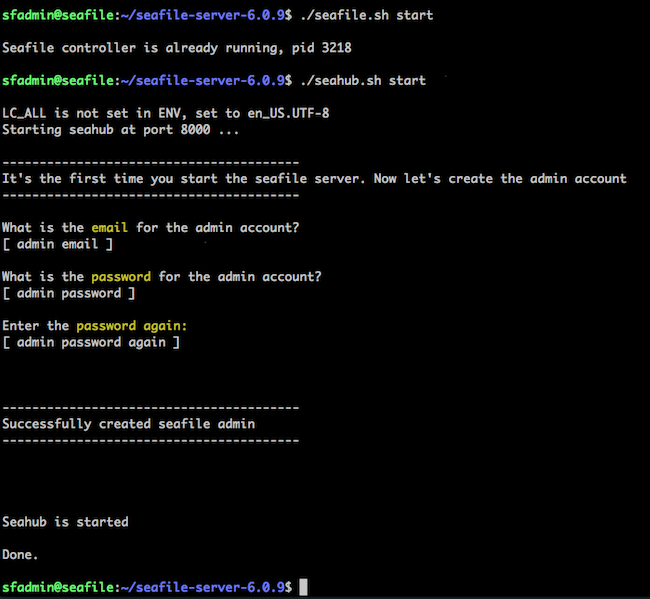
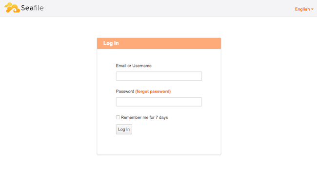

---
author:
  name: Linode
  email: docs@linode.com
description: 'Seafile is an open-source cross-platform file hosting tool with server applications compatible with Linux, Windows, and OS X.'
keywords: ["Seafile", " nginx", " Ubuntu 18.04", " file server", " media", " sharing"]
license: '[CC BY-ND 4.0](https://creativecommons.org/licenses/by-nd/4.0)'
modified: 2018-08-28
modified_by:
  name: Andrew Lescher
published: 2017-05-23
title: Install Seafile with NGINX on Ubuntu 18.04
external_resources:
 - '[Seafile Server Manual](https://manual.seafile.com/)'
---

Seafile is a cross-platform file hosting tool with server applications for Linux and Windows, and GUI clients for Android, iOS, Linux, OS X and Windows. It supports file versioning and snapshots, two-factor authentication, WebDAV, and can be paired with NGINX or Apache to enable connections over HTTPS.

Seafile has [two editions](https://www.seafile.com/en/product/private_server/): a free and open source Community Edition and a paid Professional edition. While the Professional edition is free for up to 3 users, this guide will use Seafile Community Edition with NGINX serving an HTTPS connection, and MySQL on the backend. This application stack could also benefit from large amounts of disk space, so consider using our [Block Storage](/docs/platform/how-to-use-block-storage-with-your-linode/) service with this setup.

## Prepare Ubuntu


This guide is written for a non-root user. Commands that require elevated privileges are prefixed with `sudo`. If you’re not familiar with the `sudo` command, see the [Linux Users and Groups](/docs/tools-reference/linux-users-and-groups/) guide.


1. This guide assumes you have a basic server setup. Before moving forward, check to see that you have completed the objectives outlined in the [Getting Started](/docs/getting-started/) and [Securing Your Server](/docs/security/securing-your-server/) guides. If not, it should be done before proceeding.

2.  Update the system:

<<<<<<< HEAD
```
sudo apt update && apt upgrade -y
```
=======
    ```
    apt update && apt upgrade
    ```
>>>>>>> 5a7dd868745c04e7353d0a8a79f87f1458e52108

## Install and Configure MariaDB 10.0

<<<<<<< HEAD
Seafile stores synced data in MySQL server. MariaDB 10 will be used in this installation, but other MySQL variants and versions should work. If you have a variant already installed, check the [Seafile Manual](https://manual.seafile.com/) and confirm it can be used with Seafile.

1. Install required packages.

```
sudo apt install software-properties-common -y
```
=======
    ```
    adduser sfadmin
    adduser sfadmin sudo
    ```

3.  Log out of your Linode's root user account and log back in as *sfadmin*:

    ```
    exit
    ssh sfadmin@<your_linode's_ip>
    ```
>>>>>>> 5a7dd868745c04e7353d0a8a79f87f1458e52108

2. Fetch the MariaDB repository GPG key.

<<<<<<< HEAD
```
sudo apt-key adv --recv-keys --keyserver hkp://keyserver.ubuntu.com:80 0xF1656F24C74CD1D8
```

3. Add the MariaDB Server repository.

```
sudo add-apt-repository 'deb [arch=amd64] http://mirror.zol.co.zw/mariadb/repo/10.3/ubuntu bionic main'
```

4. Install MariaDB Server.

You will be prompted several times to set a password for the MySQL root user during installation. Leave the password input blank and press `Enter` to skip this step, as it will be addressed in the next step.

```
apt install mariadb-server mariadb-client -y
```

5. Run the *mysql_secure_installation* script. Set a root password for the MySQL root user and answer `Y` to all following questions.

```
sudo mysql_secure_installation
=======
    ```
    sudo ufw allow ssh
    sudo ufw allow http
    sudo ufw allow https
    sudo ufw enable
    ```

    Then check the status of your rules and list them numerically:

    ```
    sudo ufw status numbered
    ```

    The output should be:

    

Status: active

To                         Action      From
--                         ------      ----
[ 1] 22                         ALLOW IN    Anywhere
[ 2] 80                         ALLOW IN    Anywhere
[ 3] 443                        ALLOW IN    Anywhere
[ 4] 22 (v6)                    ALLOW IN    Anywhere (v6)
[ 5] 80 (v6)                    ALLOW IN    Anywhere (v6)
[ 6] 443 (v6)                   ALLOW IN    Anywhere (v6)



    
If you don't want UFW allowing SSH on port 22 for both IPv4 and IPv6, you can delete it. For example, you can delete the rule to allow SSH over IPv6 with `sudo ufw delete 4`.


6.  Set the Linode's hostname. We'll call it *seafile* as an example:

    ```
    sudo hostnamectl set-hostname seafile
    ```

7. Add the new hostname to `/etc/hosts`. The second line in the file should look like this if you selected "seafile" as the hostname:

    
>>>>>>> 5a7dd868745c04e7353d0a8a79f87f1458e52108

Set root password? [Y/n] Y
Remove anonymous users? [Y/n] Y
Disallow root login remotely? [Y/n] Y
Remove test database and access to it? [Y/n] Y
Reload privilege tables now? [Y/n] Y
```

## Install and Configure NGINX With Letsencrypt

The configuration setup below works in tandem with Letsencrypt to provide SSL protection to your Seafile installation.

1.  Install NGINX from Ubuntu's repository

<<<<<<< HEAD
```
sudo apt install nginx -y
sudo systemctl start nginx
sudo systemctl enable nginx
```

2. Install LetsEncrypt
=======
    ```
    sudo dpkg-reconfigure tzdata
    ```

## Install and Configure MySQL

1.  During Installation, you will be asked to assign a password for the root MySQL user. Be sure to install the package `mysql-server-5.7`, not `mysql-server`. This is because an upstream issue causes problems starting the MySQL service if you install by using the `mysql-server` package.

    ```
    sudo apt install mysql-server-5.7
    ```
>>>>>>> 5a7dd868745c04e7353d0a8a79f87f1458e52108

Press `Enter` to accept the prompt in the first command.

<<<<<<< HEAD
```
sudo add-apt-repository ppa:certbot/certbot
sudo apt install python-certbot-nginx -y
```
=======
    ```
    sudo mysql_secure_installation
    ```
>>>>>>> 5a7dd868745c04e7353d0a8a79f87f1458e52108

3. Issue a new SSL certificate to you seafile site. Supply your own input in the **bolded** options inside the command below.

<<<<<<< HEAD
Select your Seafile site in the options given to issue the certificate.

```
certbot --nginx --rsa-key-size 4096 --agree-tos --no-eff-email --email **your-email-address**
```
=======
If you don't already have an SSL/TLS certificate, you can create one. This certificate will be self-signed, and will cause web browsers to protest about a non-private connection. You should verify the SHA256 fingerprint of the certificate in the browser versus that on the server, and add a permanent exception to the browser to trust this certificate.

1.  Change to the location where we'll store the certificate files and create the server's certificate with key:

    ```
    cd /etc/ssl
    sudo openssl genrsa -out privkey.pem 4096
    sudo openssl req -new -x509 -key privkey.pem -out cacert.pem
    ```
>>>>>>> 5a7dd868745c04e7353d0a8a79f87f1458e52108

4. Create a config file for Certbot at `/etc/nginx/snippets/certbot.conf`


location /.well-known {
    alias /var/www/html/.well-known;
}


<<<<<<< HEAD
5.  Create the site configuration file. The only lines you need to change below are `server_name`, `ssl_certificate`, and `ssl_certificate_key`. For more HTTPS configuration options, see our guide on [TLS Best Practices with NGINX](/docs/web-servers/nginx/nginx-ssl-and-tls-deployment-best-practices/).
=======
    ```
    sudo apt install nginx
    ```
>>>>>>> 5a7dd868745c04e7353d0a8a79f87f1458e52108



server {
    listen 80;
    server_name seafile.com;
    rewrite ^ https://$http_host$request_uri? permanent;
    proxy_set_header X-Forwarded-For $remote_addr;
    server_tokens off;
}

server {
    listen 443 ssl http2;
    server_name seafile.com;

    ssl on;
    ssl_certificate /etc/letsencrypt/keys/seafile/cert.pem;
    ssl_certificate_key /etc/letsencrypt/keys/privkey.pem;

    # secure settings (A+ at SSL Labs ssltest at time of writing)
    # see https://wiki.mozilla.org/Security/Server_Side_TLS#Nginx
    ssl_protocols TLSv1 TLSv1.1 TLSv1.2;
    ssl_ciphers 'ECDHE-ECDSA-AES256-GCM-SHA384:ECDHE-ECDSA-AES128-GCM-SHA256:ECDHE-RSA-AES256-GCM-SHA384:ECDHE-RSA-AES128-GCM-SHA256:ECDHE-ECDSA-AES256-SHA384:ECDHE-ECDSA-AES128-SHA256:ECDHE-RSA-AES256-SHA384:ECDHE-RSA-AES128-SHA256:ECDHE-RSA-AES256-SHA:ECDHE-ECDSA-AES256-SHA:ECDHE-RSA-AES128-SHA:ECDHE-ECDSA-AES128-SHA:DHE-RSA-AES256-GCM-SHA384:DHE-RSA-AES256-SHA256:DHE-RSA-AES256-SHA:DHE-RSA-CAMELLIA256-SHA:DHE-RSA-AES128-GCM-SHA256:DHE-RSA-AES128-SHA256:DHE-RSA-AES128-SHA:DHE-RSA-SEED-SHA:DHE-RSA-CAMELLIA128-SHA:HIGH:!aNULL:!eNULL:!LOW:!3DES:!MD5:!EXP:!PSK:!SRP:!DSS';
    ssl_prefer_server_ciphers on;

    proxy_set_header X-Forwarded-For $remote_addr;

    add_header Strict-Transport-Security "max-age=31536000; includeSubDomains";
    server_tokens off;

    location / {
        proxy_pass         http://127.0.0.1:8000;
        proxy_set_header   Host $host;
        proxy_set_header   X-Real-IP $remote_addr;
        proxy_set_header   X-Forwarded-For $proxy_add_x_forwarded_for;
        proxy_set_header   X-Forwarded-Host $server_name;
        proxy_set_header   X-Forwarded-Proto https;

        access_log      /var/log/nginx/seahub.access.log;
        error_log       /var/log/nginx/seahub.error.log;

        proxy_read_timeout  1200s;

        client_max_body_size 0;
    }

    location /seafhttp {
        rewrite ^/seafhttp(.\*)$ $1 break;
        proxy_pass http://127.0.0.1:8082;
        client_max_body_size 0;
        proxy_set_header   X-Forwarded-For $proxy_add_x_forwarded_for;

        proxy_connect_timeout  36000s;
        proxy_read_timeout  36000s;
        proxy_send_timeout  36000s;

        send_timeout  36000s;
    }

    location /media {
        root /opt/installed/seafile-server-6.2.5/seahub;
    }
  }
    include snippets/certbot.conf;
}




If you plan on uploading large files (greater or equal to 4GB), you may want to turn off the Nginx buffer feature, as it has issues handling large files with Seafile. Add the following to the *nginx.conf* file in the `/seafhttp` location section.

  
  ...

  location /seafhttp {
        ... ...
        proxy_request_buffering off;
  }

  ...
  



6. Modify the `ccnet.conf` file.

Change the value of **SERVICE_URL** to your seafile web address.


[General]
USER_NAME = seafile-server
ID = 42d62cf1269308d4a39acfa6733936e5fac71e62
NAME = seafile-server
SERVICE_URL = https://your-seafile-server.com

. . .


7. Modify the `seahub_settings.py` file.

Add the **FILE_SERVER_ROOT** line at the end of the file. Replace the value with your personal seafile address.


# -*- coding: utf-8 -*-
SECRET_KEY = "akcc%gmq8m^_h_-gmbq+ebm20#s_7o-c3s476illvxr2ber4lj"

DATABASES = {
    'default': {
        'ENGINE': 'django.db.backends.mysql',
        'NAME': 'seahub-db',
        'USER': 'seafile',
        'PASSWORD': 'seafile',
        'HOST': '127.0.0.1',
        'PORT': '3306'
    }
}

FILE_SERVER_ROOT = 'https://your-seafile-address.com/seafhttp'


3.  Disable the default site configuration and enable the one you just created:

    ```
    sudo rm /etc/nginx/sites-enabled/default
    sudo ln -s /etc/nginx/sites-available/seafile.conf /etc/nginx/sites-enabled/seafile.conf
    ```

4.  Run the NGINX configuration test and restart the web server. If the test fails, it will give you a brief description of what's wrong so you can troubleshoot the problem.

    ```
    sudo nginx -t
    sudo systemctl restart nginx
    ```

## Configure and Install Seafile

The [Seafile manual](https://manual.seafile.com/deploy/using_mysql.html) advises to use a particular directory structure to ease upgrades. We'll do the same here, but instead of using the example `haiwen` directory found in the Seafile manual, we'll install everything in the `opt` directory.

<<<<<<< HEAD
1. Download the Seafile CE 64 bit Linux server file. Version *6.2.5* is the latest as of this guide's publication. Find the latest version at https://www.seafile.com/en/download/ and replace the version below if needed.

```
wget --directory-prefix=/opt https://download.seadrive.org/seafile-server_6.2.5_x86-64.tar.gz
```

3.  Extract the tarball and move it when finished:

```
tar -xzvf seafile-server*.tar.gz
mkdir installed && mv seafile-server-6.2.5 installed
```

4.  Install dependency packages for Seafile:

```
sudo apt install python2.7 libpython2.7 python-setuptools python-pil python-ldap python-urllib3 ffmpeg python-pip python-mysqldb python-memcache python-requests -y
```

5.  Run the installation script:

```
cd /opt/installed/seafile-server-6.2.5
./setup-seafile-mysql.sh
```

In the first prompt, choose `1` to have the script build the databases for you. You'll be prompted to answer several other questions and choose settings during the installation process. For those that recommend a default, use that. Otherwise, provide any inputs the script may ask for.

6. If you have a firewall in place, port 8082 and 8000 must be opened. The Iptables method is shown below.

```
iptables -A INPUT -p tcp -i eth0 -m multiport --dports 8000,8082 -j ACCEPT
iptables-save
```

2.  Download the Seafile CE 64 bit Linux server. You'll need to get the exact link from [seafile.com](https://www.seafile.com/en/download/). Once you have the URL, use `wget` to download it to the **/opt** directory. An example is show below using the latest Seafile server package available as of this guide's publication date.

```
wget --directory-prefix=/opt https://download.seadrive.org/seafile-server_6.2.5_x86-64.tar.gz
```

3.  Extract the tarball and move it when finished:

```
tar -xzvf seafile-server*.tar.gz
mkdir installed && mv seafile-server*.tar.gz installed
```

4.  Install dependency packages for Seafile:

```
sudo apt install python2.7 libpython2.7 python-setuptools python-pil python-ldap python-mysqldb python-memcache python-urllib3
```

5.  Run the installation script:

```
cd seafile-server-* && sudo ./setup-seafile-mysql.sh
```

You'll be prompted to answer several questions and choose settings during the installation process. Answer the questions
with the default value when provided with one.

6. Start the Seafile and Seahub servers.

```
./seafile.sh start
./seahub.sh start
```

The `seahub.sh` script will set up an admin user account used to log into Seafile. You'll be asked for a login email and to create a password.
[](seafile-firststart.png)

7. Seafile should now be accessible from a web browser using both your Linode's IP address or the `server_name` you set earlier in NGINX's `seafile.conf` file.

[](seafile-login.png)

## Automatically Start Seafile on Sever Bootup

The `seafile.sh` and `seahub.sh` scripts don't automatically run if your Linode were to reboot.

1.  Create the systemd unit files:



[Unit]
Description=Seafile Server
After=network.target mysql.service

[Service]
Type=oneshot
ExecStart=/opt/installed/seafile-server-6.2.5/seafile.sh start
ExecStop=/opt/installed/seafile-server-6.2.5/seafile.sh stop
RemainAfterExit=yes

[Install]
WantedBy=multi-user.target





[Unit]
Description=Seahub Server
After=network.target mysql.service

[Service]
Type=oneshot
ExecStart=/opt/installed/seafile-server-6.2.5/seahub.sh start
ExecStop=/opt/installed/seafile-server-6.2.5/seahub.sh stop
RemainAfterExit=yes

[Install]
WantedBy=multi-user.target



2.  Then enable the services to automate the startup of both daemons during server boot.

```
sudo systemctl daemon-reload
sudo systemctl start seafile
sudo systemctl start seahub
sudo systemctl enable seafile
sudo systemctl enable seahub
```

You can verify they've started successfully with the following commands.

```
sudo systemctl -l status seafile
sudo systemctl -l status seahub
```

3.  Confirm the startup scripts are working by rebooting your Linode. After bootup, both the Seafile and Seahub services should be active when running the status commands in the previous step. You should also still be able to access Seafile with a web browser.


## Updating Seafile

There are various ways to update Seafile depending on if you are upgrading from one milestone to another (version 5 to 6), or upgrading between point releases (5.1.0 to 5.1.1). See the [Seafile Manual](https://manual.seafile.com/deploy/upgrade.html) for upgrade instructions that best suit your needs.

# Where To Go From here

Upon installation of Seafile, studying the [Seafile Manual](https://manual.seafile.com/) for additional improvements available for your specific setup is the best way to improve your installation. For those taking advantage of SSL encryption, generating a DH Param key will immediately improve the security of your site, and can be done by following the instructions in the [Seafile Manual](https://manual.seafile.com/deploy/https_with_nginx.html) starting at the *Generate DH Params* section.
