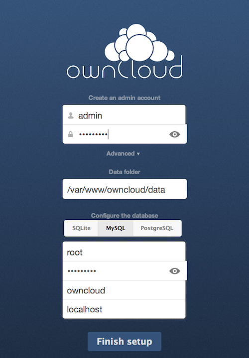
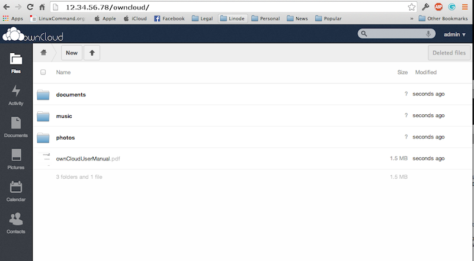

---
author:
    name: Alex Fornuto
    email: afornuto@linode.com
description: 'Installing and Configuring ownCloud on Debian 7.4'
keywords: ["ownCloud", "Debian", "MySQL", "cloud storage"]
license: '[CC BY-ND 4.0](https://creativecommons.org/licenses/by-nd/4.0)'
modified: 2017-06-21
modified_by:
    name: Alex Fornuto
published: 2014-06-10
title: 'Installing and Configuring ownCloud on Debian 7.4'
relations:
    platform:
        key: how-to-install-owncloud
        keywords:
            - distribution: Debian 7
---

ownCloud is an open source platform that allows easy access to files from multiple locations and platforms. It's compatible with most major operating systems and mobile devices. With ownCloud you can store files on your Linode and then access them wherever you go.

Installing ownCloud on your Linode is very simple. The steps outlined below will get you up and running with a drag and drop GUI interface. An ownCloud server could benefit from large amounts of disk space, so consider using our [Block Storage](/docs/platform/how-to-use-block-storage-with-your-linode/) service with this setup.

## Installation Prerequisites

Before you can use your Linode with ownCloud you will need to have a working LAMP (Linux, Apache, MySQL, and PHP) stack. For more information on how to create a LAMP stack on your Linode consult our [LAMP Guides](/docs/websites/lamp/).

This guide is written for a non-root user. Commands that require elevated privileges are prefixed with `sudo`. If you're not familiar with the `sudo` command, you can check our [Users and Groups](/docs/tools-reference/linux-users-and-groups/) guide.

## Installing ownCloud

1.  To obtain the most recent and stable application release, add the ownCloud repository to the apt source list. Begin by creating the new list file:

        sudo touch /etc/apt/sources.list.d/owncloud.list

2.  Enter the following path into the file:

        deb http://download.opensuse.org/repositories/isv:/ownCloud:/community/Debian_7.0/ /

3.  Download the key associated with ownCloud:

        wget http://download.opensuse.org/repositories/isv:ownCloud:community/Debian_7.0/Release.key

4.  Add the key so apt may validate the files:

        sudo apt-key add - < Release.key

5.  Update your package lists:

        sudo apt-get update

6.  Install ownCloud:

        sudo apt-get install owncloud

7.  Enable HTTPS:

        sudo a2enmod ssl

8.  To use the certificate and key generated by the ssl-cert package, use the command:

        sudo a2ensite default-ssl

9.  Restart the Apache service:

        sudo service apache2 reload

## Configure MySQL

Since the LAMP stack utilizes MySQL, ownCloud can be configured to use this database instead of SQLite. However, you will need to create a database for ownCloud to use.

1.  Login to MySQL:

        mysql -u root -p

2.  Create a MySQL database:

        CREATE DATABASE owncloud;

    For this example owncloud is the name of the database. You can use whatever name you choose.

3.  Assign privileges to the newly created database:

        GRANT ALL ON owncloud.* to 'owncloud'@'localhost' IDENTIFIED BY 'password';

    Remember that `password` is a variable, so you may make it what you choose.

4.  Exit MySQL with either:

        exit

    Or:

        quit

## Configure ownCloud

1.  Connect to ownCloud in a browser using the Linode's IP address:

        12.34.56.78/owncloud

    

2.  Create an ownCloud account by entering a user name and password.
3.  Click on **Advanced**, select MySQL and enter the following information:

    -   User name
    -   Password
    -   Database Name
    -   Localhost

    

4.  Click on the **Finish Setup** button.

    

## More Information

You may wish to consult the following resources for additional information on this topic. While these are provided in the hope that they will be useful, please note that we cannot vouch for the accuracy or timeliness of externally hosted materials.

 - [ownCloud Administrator's Manual](http://doc.owncloud.org/server/6.0/admin_manual/installation/installation_source.html)
 - [Install Packages](http://software.opensuse.org/download.html?project=isv:ownCloud:community&package=owncloud)
