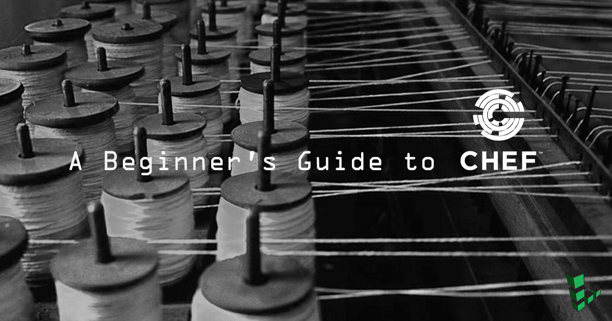

---
author:
  name: Elle Krout
  email: ekrout@linode.com
description: 'A look into Chef''s primary components, features, and configurations for the new Chef user'
keywords: ["chef", "automation", "chefdk", "chef server", "chef development kit", "cookbooks", "beginners", "server automation", "configuration management"]
license: '[CC BY-ND 4.0](https://creativecommons.org/licenses/by-nd/4.0)'
aliases: ['applications/chef/beginners-guide-chef/']
modified: 2019-01-11
modified_by:
  name: Linode
published: 2015-06-10
title: A Beginner's Guide to Chef
external_resources:
 - '[Chef](http://www.chef.io)'
 - '[Setting Up a Chef Server, Workstation, and Node on Ubuntu 18.04](/docs/applications/configuration-management/install-a-chef-server-workstation-on-ubuntu-18-04/)'
 - '[Creating Your First Chef Cookbook](/docs/applications/configuration-management/creating-your-first-chef-cookbook/)'

---

*Chef* is a declarative configuration management and automation platform used to translate infrastructure into code. This methodology enables organizations or individuals to generate a process with better testing, efficient and predictable deployments, centralized versioning, and reproducible environments across all your servers.

Chef works with three core components, the Chef server, workstations, and nodes:

- **Chef server:** As the center of operations, the Chef server stores, manages, and provides configuration data to all other Chef components.
- **Workstations:** Workstations are personal computers or virtual servers where all configuration code is created, tested, and changed. There can be as many workstations as needed, whether this be one per person or otherwise.
- **Nodes:** Nodes are the servers that are managed by Chef -- these are the machines that changes are being pushed to, generally a fleet of multiple machines that require the benefits of automation. Chef can manage nodes that are virtual servers, containers, network devices, and storage devices. A Chef client is installed on every node that is under management by Chef.

These three components communicate in a mostly linear fashion, with any changes being pushed from workstations to the Chef server, and then pulled from the server to the nodes and implemented on each node via their Chef client. In turn, information about the node passes to the server to determine which files are different from the current settings and need to be updated.

If you wish to further explore Chef please see the guides [Setting Up a Chef Server, Workstation, and Node on Ubuntu 18.04](/docs/applications/configuration-management/install-a-chef-server-workstation-on-ubuntu-18-04/) and [Creating Your First Chef Cookbook](/docs/applications/configuration-management/creating-your-first-chef-cookbook/).

## The Chef Server

The Chef server provides a communication pathway between the workstations where your infrastructure is coded, and the nodes where the configurations are deployed by the Chef client. All configuration files, cookbooks, metadata, and other information are created on workstations and stored on the Chef server. The Chef server also keeps information regarding the state of all nodes at the time of the last [chef-client](#chef-client) run. A workstation communicates with the Chef server using [*Knife*](/docs/applications/configuration-management/beginners-guide-chef/#knife) and Chef command line tools, while nodes communicate with the Chef server using the [Chef client](/docs/applications/configuration-management/beginners-guide-chef/#chef-client).

Any changes made to your infrastructure code must pass through the Chef server in order to be applied to nodes. Prior to accepting or pushing changes, the Chef server authenticates all communication via its REST API using public key encryption.

### Components of a Chef Server
The Chef Server itself is made up of several components that help it to efficiently communicate with workstations and nodes. Each Chef server has an NGINX front-end load balancer to route all requests to the Chef server API. PostgreSQL is used to store data. An Apache Solr instance, wrapped by chef-solr, is used for indexing and search. A web interface, known as Chef manage, is available for common Chef server management tasks. All these components contribute to the Chef server's ability to handle requests for several thousands of nodes and make Chef server a resource heavy application. For this reason, a Chef server's minimum system requirements are a Linode plan of at minimum 8 GB of RAM and 4 CPU cores. For more specifications, see the [Chef System Requirements](https://docs.chef.io/chef_system_requirements.html) documentation page.

### Bookshelf

To store cookbooks and related files and templates, the Chef server uses a *Bookshelf* that operates as a versioned repository (generally located at `/var/opt/opscode/bookshelf`; full root access is needed). When a cookbook is uploaded to the Chef server, the new version of the cookbook is compared to the one already stored; if there are changes, a new version is stored. The Chef server only stores one copy of a file or template, meaning if resources are shared between cookbooks and cookbook versions, they will not be stored multiple times.

## Workstations

Workstations are where users create, test, and maintain cookbooks and policies that will be pushed to the Chef server and pulled by nodes. The workstation functionality is available by downloading the [Chef Workstation package](https://downloads.chef.io/chef-workstation/), which was formerly known as ChefDK. The Chef Workstation provides chef and knife command line tools, the testing tools Test Kitchen, ChefSpec, Cookstyle, and Foodcritic, and [InSpec](https://www.chef.io/inspec/) a tool that allows you to write automated tests for compliance, security and policy requirements. Additionally, the dependency manager for Chef cookbooks, *Berkshelf*, is installed.

The Chef Workstation package can be installed on virtual servers or on personal computers. Workstations are set to interact with a single Chef server, and most work will be done in the `chef-repo` directory located on the workstation.

Cookbooks created on workstations can be used privately by one organization, or uploaded to the [Chef Supermarket](https://supermarket.chef.io/) for others to use. Similarly, workstations can be used to download cookbooks created by other Chef users and found in the Supermarket.

For a deeper dive into the various tools provided by the Chef Workstation package, see Chef's [official documentation](https://docs.chef.io/about_chefdk.html).

### chef-repo

The `chef-repo` directory is the area of the workstation where cookbooks are authored and maintained and any supporting resources like roles, data bags, and environments are stored. The `chef-repo` should be version-controlled with a remote version control system, like Git. Chef is able to communicate with the server from the `chef-repo` and push any changes via the use of `knife` commands.

You can easily generate a Chef repository using the following command: `chef generate repo repo-name`.

### Knife

The Knife command line tool is the primary way that a workstation communicates the contents of its `chef-repo` directory with a Chef server. It also provides an interface for you to manage nodes, cookbooks, roles, environments, and databags.

- A Knife command executed from your workstation uses the following format:

        knife subcommand [ARGUMENT] (options)

- For example, to view the details of a Chef user, execute the following command:

        knife user show USER_NAME

Knife allows for a variety of other useful operations to be executed on the Chef server and nodes. View Chef's [Knife](https://docs.chef.io/knife.html) documentation for a full list of all available commands.

The Knife command line tool is configured with the `knife.rb` file:


log_level                :info
log_location             STDOUT
node_name                'username'
client_key               '~/chef-repo/.chef/username.pem'
validation_client_name   'shortname-validator'
validation_key           '~/chef-repo/.chef/shortname.pem'
chef_server_url          'https://123.45.67.89/organizations/shortname'
syntax_check_cache_path  '~/chef-repo/.chef/syntax_check_cache'
cookbook_path [ '~/chef-repo/cookbooks' ]



The default `knife.rb` file is defined with the following properties:

-	**log_level:** The amount of logging that will be stored in the log file. The default value, `:info`, notes that any informational messages will be logged. Other values include `:debug:`, `:warn`, `:error`, and `:fatal`.
-	**log_location:** The location of the log file. The default value, `STOUT` is for *standard output logging*. If set to another value standard output logging will still be performed.
-	**node_name:**	The username of the person using the workstation. This user will need a valid authorization key located on the workstation.
-	**client_key:** The location of the user's authorization key.
-	**validation_client_name:** The name for the server validation key that will determine whether a node is registered with the Chef server. These values must match during a chef-client run.
-	**validation_key:** The path to your organization's validation key.
-	**chef_server_url:** The URL of the Chef server, with `shortname` being the defined shortname of your organization. This can also be an IP address. `/organizations/shortname` must be included in the URL.
-	**syntax_check_cache_path:** The location in which `knife` stores information about files that have been checked for appropriate Ruby syntax.
-	**cookbook_path:** The path to the cookbook directory.

### Test Kitchen

Test Kitchen provides you with a development environment on your workstation to create, test, and iterate on your cookbooks before distributing its contents to your production nodes. You can use the Kitchen command line tool to run integration tests against different platforms allowing you to test for the variety of nodes running on your production infrastructure. Refer to the [Kitchen CI](https://kitchen.ci/docs/getting-started/introduction/) documentation for information on getting started with Test Kitchen.

## Nodes

A *node* is any machine that is managed by a Chef server. Chef can manage nodes that are virtual servers, containers, network devices, and storage devices. Each node must have a corresponding Chef client installed in order to execute the steps needed to bring the node into the required stated defined by a cookbook.

Nodes are validated through the `validator.pem` and `client.pem` certificates that are created on the node when it is bootstrapped. All nodes must be bootstrapped over SSH as either the root user or a user with elevated privileges.

Nodes are kept up-to-date through the use of the chef-client, which runs a convergence between the node and the Chef server. What cookbooks and roles the node will take on depends on the run list and environment set for the node in question.

### chef-client

The chef-client checks the current configuration of the node against the recipes and policies stored on the Chef server and brings the node up to date. The process begins with the chef-client checking the node's [run list](#run-lists), loading the required cookbooks, then checking and syncing the cookbooks with the current configuration of the node.

The chef-client must be run with elevated privileges in order to properly configure the node, and should be run periodically to ensure that the server is always up to date -- often this is achieved through a cron job or by setting up the chef-client to run as a service.

### Run Lists

Run lists define which [recipes](/docs/applications/configuration-management/beginners-guide-chef/#recipes) a node will use. The run list is an ordered list of all [*roles*](http://docs.chef.io/server_manage_roles.html) and recipes that the chef-client needs to pull from the Chef server to run on a node. Roles are used to define patterns and attributes across nodes.

### Ohai

Ohai collects information regarding nodes for the Chef client. It is required to be present on every node, and is installed as part of the bootstrap process.

The information gathered includes network and memory usage, CPU data, kernel data, hostnames, FQDNs, and other automatic attributes that helps the Chef client determine the state of the node prior to applying that nodes run list.

## Environments

Chef environments exist to mimic real-life workflow, allowing for nodes to be organized into different "groups" that define the role the node plays in the fleet. This allows for users to combine environments and versioned cookbooks to have different attributes for different nodes. For example, if testing a shopping cart, you may not want to test any changes on the live website, but instead, with a "development" set of nodes.

Environments are defined in `chef-repo/environments` and saved as Ruby or JSON files.

As a Ruby file:


name "environmentname"
description "environment_description"
cookbook_versions  "cookbook" => "cookbook_version"
default_attributes "node" => { "attribute" => [ "value", "value", "etc." ] }
override_attributes "node" => { "attribute" => [ "value", "value", "etc." ] }



As a JSON:


{
  "name": "environmentname",
  "description": "a description of the environment",
  "cookbook_versions": {

  },
  "json_class": "Chef::Environment",
  "chef_type": "environment",
  "default_attributes": {

  },
  "override_attributes": {

  }



All nodes are automatically set to the "default" environment upon bootstrap. To change this, the environment should be defined in the `client.rb` file found in `/etc/chef` on the nodes.

## Cookbooks

Cookbooks are the basis for managing the configurations on any node. Cookbooks contain values and information about the *desired state* of a node and then the Chef server and Chef client ensure that the defined state is achieved.

Cookbooks are comprised of recipes, metadata,  attributes, resources, templates, libraries, and anything else that assists in creating a functioning system, with attributes and recipes being the two core parts of a cookbook. Components of a cookbook should be modular, keeping recipes small and related.

Cookbooks should be version controlled. Versions can help when using different Chef environments and allow you to distribute and collaborate on cookbooks with other team members.

### Recipes

A Chef cookbook is comprised of recipes that a nodes desired state. Recipes are written in Ruby and contain information about everything that needs to be run, changed, or created on a node. Recipes work as a collection of *resources* that determine the configuration or policy of a node, with resources being a configuration element of the recipe. For a node to run a recipe, it must be on that node's run list.

The example recipe is part of Chef's [Vim cookbook](https://github.com/chef-cookbooks/vim). It is in charge of installing the required Vim package based on a node's Linux distribution:


...

vim_base_pkgs = value_for_platform_family(
  %w(debian arch) => ['vim'],
  %w(rhel fedora) => ['vim-minimal', 'vim-enhanced'],
  'default' => ['vim']
)

package vim_base_pkgs

package node['vim']['extra_packages'] unless node['vim']['extra_packages'].empty?


### Attributes

Attributes define specific values about a node and its configuration and are used by the Chef client to apply those attributes to nodes via its attribute list. The chef client can receive attributes from nodes, attribute files, recipes, environments, and roles. Often attributes are used in conjunction with templates and recipes to define settings. To learn more about attributes, refer to [Chef's documentation](https://docs.chef.io/attributes.html).

### Files

These are static files that can be uploaded to nodes. Files can be configuration and set-up files, scripts, website files. For example, you may have a recipe that uses an `index.php` file. You can use a `cookbook_file` resource block within a recipe to create the file on a node. All static files should be stored in a cookbook's `files` directory.

### Libraries

Although Chef comes with a number of libraries built in, additional libraries can be defined. Libraries allow you to write Ruby code to be included in a cookbook. Libraries are a convenient way to include helper code for your existing recipes. Libraries provide a powerful way to extend the resources created by your recipes.

### Resources

Resources are written in Ruby and defined in recipe files. Resources must contain a type, a name, one or more properties, and one or more actions. Resources are the key components that make up any single recipe. To learn Chef's, visit [Chef's official documentation](https://docs.chef.io/resource.html).

### Templates

Templates are embedded Ruby files (`.erb`) that are used to dynamically create static text files. To use a template within a cookbook, you must declare a template resource in a recipe and include a corresponding `.erb` template file in a `template` subdirectory. Your template resource can contain variables that will then be used by the template to dynamically provide those values based on a nodes particular context.
