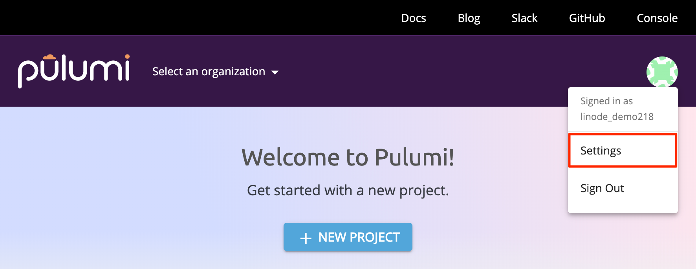

---
author:
    name: Linode
    email: docs@linode.com
description: 'Basic instructions to set install Pulumi and create a configured Nodebalancer through code.'
keywords: ["pulumi", "configuration management", "javascript", "python"]
license: '[CC BY-ND 4.0](https://creativecommons.org/licenses/by-nd/4.0)'
modified: 2019-01-15
modified_by:
    name: Linode
published: 2019-01-15
title: Getting Started with Pulumi
external_resources:
- '[Pulumi Documentation](https://pulumi.io/reference/)'
- '[Pulumi API reference](https://pulumi.io/reference/pkg/)'
- '[Why Pulumi](https://www.pulumi.com/why-pulumi/)'

---

**Pulumi** is a multi-language, multi-cloud, and fully extensible development platform. By using Pulumi for your chosen programming language, you can begin using code that can manage your account similarly to our [API](https://developers.linode.com/api/v4/) or [CLI](https://www.linode.com/docs/platform/api/using-the-linode-cli/). Though this guide will focus on `Javascript`, Pulumi is also compatible with `Go`, `Python`, and `Typescript`.

In this guide you will learn how to:

* Install and set up Pulumi on Debian9
* Create a Linode using Pulumi and Javascript
* Create a configured Nodebalancer with a working NGINX server pre-installed using Pulumi and Javascript

##  Before You Begin

1. If you haven't yet, [create a Linode API token](https://www.linode.com/docs/platform/api/getting-started-with-the-linode-api/#create-an-api-token).

1. Create a free Pulumi account by following the prompts [here](https://app.pulumi.com/signup).

1. Create a new Debian9 Linode configured following our [Getting Started](https://www.linode.com/docs/getting-started/) and [Securing Your Server](https://www.linode.com/docs/security/securing-your-server/) guide.

1. Install Pulumi on your Linode using their installation script:

        curl -fsSL https://get.pulumi.com | sh

1. Restart your shell session or add `/home/username/.pulumi/bin` to your `$PATH`. Replace `username` with the name of your limited user:

        PATH=$PATH:/home/username/.pulumi/bin

    You can also make the change persist on a reboot by appending it to your `~/.profile` file:

        echo "PATH=$PATH:/home/darude/.pulumi/bin" >> ~/.profile

1. Install `node.js` and `npm`:

        sudo apt-get install curl software-properties-common
        curl -sL https://deb.nodesource.com/setup_12.x | sudo bash -
        sudo apt-get install -y nodejs

## Generate a Pulumi Access Token

Once you have an account, you will need to create an *Access Token* to use later.

1. Log into your Pulumi account, and click on the icon to the top right of the page, then click on "settings".

    

1. Click on "Access Tokens" on the sidebar to the left of the page.

    

1. Select "New Access Token" towards the top right of the following page and follow the prompts to create your new token. Make sure you save this in a secure location similar to your API token.

## Default Configuration

Now that you have everything you need to begin using Pulumi, you can create a new Pulumi project. Pulumi requires an empty directory for each new project, so first you'll need create one and make it your working directory:

    cd ~/ && mkdir pulumi && cd pulumi

Now that you're inside of your new empty working directory, create a new project:

    pulumi new

From here, you'll see several prompts. Below is a guide to following them:

1. Enter your Pulumi Token if prompted. If you've already entered it at any point following the installation of Pulumi, you will not be prompted again and can skip this step.
1. Use the arrow keys to highlight the `linode-javascript` option.
1. Enter a project name of your choice.
1. Enter a project description.
1. Enter a stack name of your choice.
1. Enter your Linode API token.

Once the installation is successful, you will see a `Your new project is ready to go!` message. The default configuration will give you everything you need to get started. Enter the `ls` command to ensure that the default configuration files are present. You should see the following output:


root@localhost:~/pulumi# ls
index.js      package.json	 Pulumi.pulumi.yaml
node_modules  package-lock.json  Pulumi.yaml


These six files will determine the behavior of Pulumi when we call it in a later step with the `pulumi up` command. The contents were defined according to our responses to each prompt after entering `pulumi new`. Though we won't go into too much detail regarding the specifics of these files, it's important to understand that the `index.js` file will contain the javascript Pulumi will run while the `package.json` file will define the dependencies we can use and the file path Pulumi will be reading our code from.

### Create a Linode using Pulumi

Let's take a look at the contents of our `index.js` file to see what would happen if we were to enter `pulumi up` now:


"use strict";
const pulumi = require("@pulumi/pulumi");
const linode = require("@pulumi/linode");

// Create a Linode resource (Linode Instance)
const instance = new linode.Instance("my-instance", {
    type: "g6-nanode-1",
    region: "us-east",
    image: "linode/ubuntu18.04",
});

// Export the Instance label of the instance
exports.instanceLabel = instance.label;


The file requires two javascript modules unique to Pulumi which will include Pulumi's SDK package and Pulumi's Linode package for deploying Linode resources. [Pulumi's API Reference Documentation](https://pulumi.io/reference/pkg/nodejs/pulumi/linode/) serves as a reference for the javascript you'll see here, and includes a library of several additional options that enable you to create configurations more specific to whatever your use case may be.

In this case, your file is only creating a single Nanode instance in the Newark Datacenter running Ubuntu18.04.

Test your code to make sure it's successfully able to create resources under your account. You can do this with the following command:

    pulumi up



This will create a new billable resource on your account.



From here, you will be prompted to confirm the resource creation. Type `yes`, hit `enter`, and you will be able to see your resources being created. Once the process is completed, the Linode Label of your new Linode will be displayed.

If you check your account manually through the [Cloud Manager](https://cloud.linode.com/), you can confirm that this Linode has been successfully created.

Since this Linode was only created as a test, you can safely delete it by entering the following command on your Linode:

    pulumi destroy

Follow the prompts, and you'll be able to see the resources being removed, similarly to how we could see them being created. After a few moments, the resources will be successfully removed.


Many pulumi commands will be logged on your Pulumi account. You can see this by logging in your account at [Pulumi's Application Page](https://app.pulumi.com/) after logging in.


## Create a Configured NodeBalancer

To better demonstrate the power of Pulumi code, we'll create a new `index.js` file which will define everything we need to create a functioning Nodebalancer pre-configured with two Linodes which come with nginx pre-installed.

To begin, replace the contents of your `index.js` file with the following:



const pulumi = require("@pulumi/pulumi");
const linode = require("@pulumi/linode");

//Create two new Linodes using a stackscript to configure them internally.
//In this case, we're only using one to install NGINX as a webserver.

const linode1 = new linode.Instance("linode1", {
        label: "PulumiNode1",
        region: "us-east",
        image: "linode/debian9",
        privateIp: true,
        stackscriptData: {
                hostname: "pulumi",
            },
        stackscriptId: 514388,
        type:"g6-nanode-1",
});

const linode2 = new linode.Instance("linode2", {
        label: "PulumiNode2",
        region: "us-east",
        image: "linode/debian9",
        privateIp: true,
        stackscriptData: {
            hostname: "pulumi",
            },
        stackscriptId: 514388,
        type:"g6-nanode-1",
});

//Create and configure your Nodebalancer

const balnce = new linode.NodeBalancer("balancer", {
        clientConnThrottle: 20,
        label: "mynodebalancer",
        region: "us-east",
});

const balnconfig = new linode.NodeBalancerConfig("balancer_config", {
        algorithm: "source",
        check: "http",
        checkAttempts: 3,
        checkTimeout: 30,
        checkInterval: 40,
        checkPath: "/",
        nodebalancerId: balnce.id,
        port: 8088,
        protocol: "http",
        stickiness: "http_cookie",
});

// Allocate your Linodes to the Nodebalancer

const balnode1 = new linode.NodeBalancerNode("balancernode1", {
        address: pulumi.concat(linode1.privateIpAddress, ":80"),
        configId: balnconfig.id,
        label: "BalancerNode1",
        nodebalancerId: balnce.id,
        weight: 50,
});

const balnode2 = new linode.NodeBalancerNode("balancernode2", {
        address: pulumi.concat(linode2.privateIpAddress, ":80"),
        configId: balnconfig.id,
        label: "BalancerNode2",
        nodebalancerId: balnce.id,
        weight: 50,
});

//Output your Nodebalancers Public IPV4 address and the port we configured to access it from in code
exports.nodebalancerip = balnce.ipv4;
exports.nodebalancerport = balnconfig.port;



In our `index.js` file we've created and configured two Linodes using a pre-configured [Stackscript](https://www.linode.com/docs/platform/stackscripts/) which installs an NGINX server. Pulumi's Linode Module allows for the creation of entirely [New Stackscripts](https://pulumi.io/reference/pkg/nodejs/pulumi/linode/#StackScript) directly in code, which can help you to automate your deployments even further.

If you're interested in seeing how this stackscript works, you can view it [Here](https://cloud.linode.com/stackscripts/514388)


Now that you've successfully prepared your javascript code, let's bring up our configuration:

    pulumi up

As before, select "yes" when prompted and wait for a few moments as your resources are created, configured, and brought online. Once the process is completed, you'll see your Nodebalancer's IP address and the port you configured earlier displayed as part of the output. Enter this IP address and port into your web browser, and you will see a default nginx page confirming the installation was successful.


If you are not able to see the default nginx page right away, you should wait a few additional moments. NodeBalancers can sometimes require a little extra time to fully apply a new configuration.


Once you're finished with your Nodebalancer, you can remove and delete everything you added with `pulumi up` by entering `pulumi destroy` as before.

## Next Steps

Pulumi is a powerful tool with a vast number of possibile configurations that can be applied. From here you can:

* Look at Pulumi's [Examples](https://github.com/pulumi/examples) for more ideas regarding the things you can do with Pulumi.

* Try using Pulimi with different code like [Python](https://pulumi.io/reference/python/) or [Typescript](https://pulumi.io/reference/javascript/#typescript)

* Import Node.Js tools like [Express](https://expressjs.com/) for even more elasticity with your code.

*  Use Pulimi for [Serverless Computing](https://www.pulumi.com/serverless/)