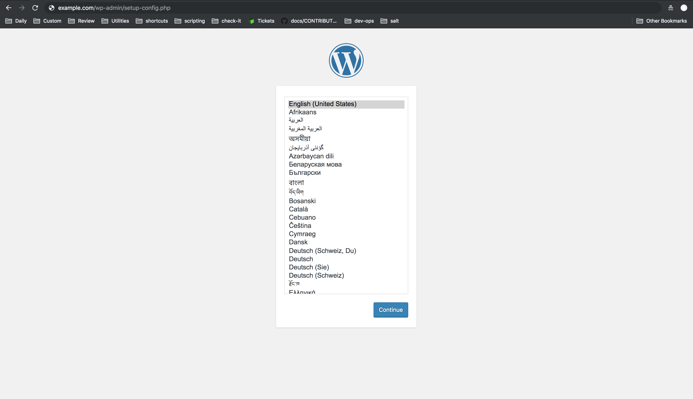

---
author:
  name: Linode Community
  email: docs@linode.com
description: 'In this guide you will learn how to use a Community StackScript to deploy WordPress on a Linode using Terraform..'
keywords: ['terraform','stackscripts','wordpress','orchestration']
license: '[CC BY-ND 4.0](https://creativecommons.org/licenses/by-nd/4.0)'
published: 2018-11-21
modified: 2018-11-21
modified_by:
  name: Linode
title: "Deploy a WordPress Site using Terraform"
contributor:
  name: Linode
external_resources:
- '[Terraform Linode Provider](https://www.terraform.io/docs/providers/linode/index.html)'
- '[Terraform Input Variables](https://www.terraform.io/intro/getting-started/variables.html)'
---

Linode's Terraform provider supports [StackScripts](/docs/platform/stackscripts/). StackScripts allow you to automate the deployment of custom systems on top of the available default Linux distribution images or any saved custom images. You can create your own StackScripts, use a StackScript created by Linode or use a Community StackScript.

In this guide you will learn how to use a Community StackScript to deploy WordPress on a Linode using Terraform.

## Before You Begin

1. Install Terraform on your local computer using the steps found in the Install Terraform section of the [Use Terraform to Provision Linode Environments](https://linode.com/docs/applications/configuration-management/how-to-build-your-infrastructure-using-terraform-and-linode/#install-terraform) guide.

1. Terraform requires an API access token. Follow the [Getting Started with the Linode API](/docs/platform/api/getting-started-with-the-linode-api-new-manager/#get-an-access-token) guide to obtain a token.

1. Browse the existing [StackScripts Library](https://www.linode.com/stackscripts/) to familiarize yourself with common tasks you can complete with existing StackScripts.

## Use Terraform and StackScripts to Install WordPress

### Create the Terraform Configuration File

After completing the steps found in the **Install Terraform** section of the [Use Terraform to Provision Linode Environments](https://linode.com/docs/applications/configuration-management/how-to-build-your-infrastructure-using-terraform-and-linode/#install-terraform) guide, you can begin creating the resources needed to deploy WordPress on a Linode using Terraform.

1. Ensure you are in the `terraform` directory.

        cd ~/terraform

1. Using your preferred editor, create a Terraform configuration file named `main.tf` to hold your resource definitions:

      
provider "linode" {
    token = "${var.token}"
}

resource "linode_sshkey" "main_key" {
    label = "foo"
    ssh_key = "${chomp(file("~/.ssh/id_rsa.pub"))}"
}

resource "random_string" "password" {
    length  = 32
    special = true
}

resource "linode_instance" "linode_id" {
    image = "${var.image}"
    label = "${var.label}"
    region = "${var.region}"
    type = "${var.type}"
    authorized_keys = [ "${linode_sshkey.main_key.ssh_key}" ]
    root_pass = "${random_string.password.result}"
    stackscript_id = "${var.stackscript_id}"
    stackscript_data = "${var.stackscript_data}"
}

resource "linode_domain" "madreypadre" {
    domain = "${var.domain}"
    soa_email = "${var.soa_email}"
    type = "master"
 }

resource "linode_domain_record" "madreypadre" {
     domain_id = "${linode_domain.madreypadre.id}"
     name = "www"
     record_type = "${var.a_record}"
     target = "${linode_instance.linode_id.ipv4[0]}"

resource "linode_domain_record" "root_madreypadre" {
     domain_id = "${linode_domain.madreypadre.id}"
     name = ""
     record_type = "${var.a_record}"
     target = "${linode_instance.linode_id.ipv4[0]}"
}
      

      The Terraform configuration file uses [interpolation syntax](https://www.terraform.io/docs/configuration/interpolation.html) to reference variables that provide values for each argument. The variables and their values will be created in separate files later on in this guide. Using separate files for variable declaration and assignment parameterizes your configurations. This allows you to avoid hard-coding values so that you can reuse, share and version control your Terraform configuration files.

      Let's take a closer look at each block in the configuration file.

      
provider "linode" {
    token = "${var.token}"
}
      

      The first stanza declares Linode as the provider that will manage the lifecycle of any resources declared throughout the configuration file. The Linode provider requires your Linode APIv4 token for authentication.

      
resource "linode_sshkey" "main_key" {
    label = "foo"
    ssh_key = "${chomp(file("~/.ssh/id_rsa.pub"))}"
}
      

      This resource configures an SSH Key that will be used later in the configuration file to access your Linode instance. `ssh_key = "${chomp(file("~/.ssh/id_rsa.pub"))}"` uses Terraform's built-in function `file()` to provide a local file path to the public ssh key's location. If you do not already have SSH keys, follow the steps in the **Create an Authentication Key-pair** section of the [Securing Your Server Guide](https://linode.com/docs/security/securing-your-server/#create-an-authentication-key-pair). The `chomp()` built-in function removes trailing new lines from the ssh key.

      
resource "random_string" "password" {
    length  = 32
    special = true
}
      

      The `random_string` resource can be used to create a random string of 32 characters. The `linode_instance` resource will use it to create a root user password.

      
resource "linode_instance" "linode_id" {
    image = "${var.image}"
    label = "${var.label}"
    region = "${var.region}"
    type = "${var.type}"
    authorized_keys = [ "${linode_sshkey.main_key.ssh_key}" ]
    root_pass = "${random_string.password.result}"
    stackscript_id = "${var.stackscript_id}"
    stackscript_data = "${var.stackscript_data}"
}
      

      The `linode_instance` resource creates a Linode with the declared configurations.

      - The `authorized_keys` argument uses the ssh public key provided by the `linode_sshkey` resource in the previous stanza. This argument expects a value of type `list`, so the value must be wrapped in brackets.

      - `root_pass` uses the `random_string` resource to generate a random string value that is used as the password for the Linode's root user. The `random_string` resource will be declared with all other variables later in this guide.

      - To use an existing Linode StackScript you must use the `stackscript_id` argument and provide a valid ID as a value. Every StackScript is assigned a unique ID upon creation. This guide uses the [WordPress on Ubuntu 16.04](https://www.linode.com/stackscripts/view/81736) StackScript provided by Linode user [hmorris](https://www.linode.com/stackscripts/profile/hmorris). These values will be provided later on in this guide.

      - StackScripts support user defined data. This means a StackScript can use the `UDF` tag to create a variable whose value must be provided by the user of the script. This allows users to customize the behavior of a StackScript on a per-deployment basis. Any required `UDF` variable can be defined using the `stackscript_data` argument.

      
resource "linode_domain" "madreypadre" {
    domain = "${var.domain}"
    soa_email = "${var.soa_email}"
    type = "master"
 }

resource "linode_domain_record" "madreypadre" {
     domain_id = "${linode_domain.madreypadre.id}"
     name = "www"
     record_type = "${var.a_record}"
     target = "${linode_instance.linode_id.ipv4[0]}"

resource "linode_domain_record" "root_madreypadre" {
     domain_id = "${linode_domain.madreypadre.id}"
     name = ""
     record_type = "${var.a_record}"
     target = "${linode_instance.linode_id.ipv4[0]}"
}
      

      The StackScript will be responsible for installing WordPress on your Linode, along with all other requirements, like installing and configuring the Apache Web Server, configuring the Virtual Hosts file, and installing MySQL. However, in order to complete your WordPress site's configuration, you need to create a domain and corresponding domain records for your site. The `linode_domain` and `linode_domain_record` resources handle these configurations. If you are not familiar with the Domain Name System (DNS), review the [DNS Records: An introduction](/docs/networking/dns/dns-records-an-introduction/) guide. Note the following information:

      - Each `linode_domain_record` uses interpolation syntax to retrieve the corresponding `linode_domain` resource's id to provide the value for its `domain_id`.

      - The `target` argument pulls the IP address from the Linode instance. Each `linode_instance` resource exposes several attributes, including each Linode's `ipv4` address. This value is utilized to create domain records that correspond to the Linode instance that will be created with this configuration file.

### Create the Input Variable Configuration File

You will now create the input variable configuration file, which is the next step in ensuring that your Terraform configurations are parameterized. This file will define all the variables that were used in the `main.tf` file in the previous section.

1. In the `terraform` directory, create a file named `variables.tf`:

    
variable "token" {
  description = "Linode API Personal Access Token"
}

variable "image" {
  description = "Image to use for Linode instance"
  default = "linode/ubuntu16.04lts"
}

variable "label" {
  description = "The Linode's label is for display purposes only."
  default = "default-linode"
}

variable "region" {
  description = "The region where your Linode will be located."
  default = "us-east"
}

variable "type" {
  description = "Your Linode's plan type."
  default = "g6-standard-1"
}

variable "root_pass" {
  description = "Your Linode's root user's password."
}

variable "stackscript_id" {
  description = "Stackscript ID"
}

variable "stackscript_data" {
  description = "Map of required StackScript UDF data."
  type = "map"
}

variable "domain" {
  description = "The domain this domain represents."
}

variable "soa_email" {
  description = "Start of Authority email address. This is required for master Domains."
}

variable "a_record" {
  description = "The type of Record this is in the DNS system. For example, A records associate a domain name with an IPv4 address."
  default = "A"
}
    

- It is recommended to include a `description` for each input variable to help document your configuration's usage. This will make it easier for anyone else to use this Terraform configuration.

- Every variable can contain a `default` value. The `default` value is only used if no other value is provided. For example, if you have a favorite Linux distribution, you may want to provide it as your `image` variable's `default` value. In this case, `linode/ubuntu16.04lts` is set as the default value since the StackScript that is used was created for the Ubuntu 16.04 LTS distribution.

- You can declare a `type` for each variable. If no type is provided, the variable will default to `type = "string"`.

- Notice that the `stackscript_data` variable is of `type = "map"`. This will allow you to provide values for as many `UDF` variables as your StackScript requires.

    Now that you have defined all required input variables, in the next section, you will provide values for each variable.

### Create the Variable Values Files

Terraform allows you to assign variables in many ways, for example, you can assign a variable value via the command line when running `terraform apply`. However, in order to persist variable values, you can create files to hold all your values. Terraform will automatically load any file named `terraform.tfvars` and use its contents to populate variables. However, you should separate out any sensitive values, like passwords and tokens, into their own file and keep this sensitive file out of version control. In this section, you will create two variable value files, one will hold secret variable values and the second will hold all non-sensitive values.

1. Create a file named `terraform.tfvars` in your `terraform` directory to hold all non-sensitive values:

    
token = "my-linode-api4-token"
label = "wp-linode"
stackscript_id = "81736"
stackscript_data = {
  ssuser = "username"
  hostname = "wordpress"
  website = "example.com"
  dbuser = "username"
}
domain = "example.com"
soa_email = "user@email.com"
    

1. Create a file name `secrets.tfvars` in your `terraform` directory to hold any sensitive values:

    
stackscript_data = {
  sspassword = "my-secure-password"
  db_password = "my-secure-password"
  dbuser_password = "my-secure-password"
}
    

- Any values declared in the `terraform.tfvars` and `secrets.tfvars` files can be replaced with your own values. It is helpful to reference [Terraform's Linode Provider](https://www.terraform.io/docs/providers/linode/) documentation and the [Linode APIv4 documentation](https://developers.linode.com/api/v4) for assistance in determining appropriate values for Linode resources.

- Ensure you replace the following values in the `.tfvars` files:

    - `token` should be replaced with your own Linode account's APIv4 token.
    - `ssuser` should be the desired username for your Linode's limited user account that will be created by the StackScript.
    - `sspassword`, `db_password`, and `dbuser_password` should be replaced with secure passwords of your own.
    - `domain` should be replaced with your WordPress site's domain address.
    - `soa_email` should be the email address you would like to use for your Start of Authority email address.

    
  There are several other options available for secrets management with Terraform. For more information on this, see the Secrets Management with Terraform guide.
    

## Initialize, Plan and Apply the Terraform Configuration

Whenever a new Provider is used in a Terraform configuration, it must be first initialized. The initialization process downloads and installs the provider's plugin and performs any other steps needed for its use. It is useful to view your configuration's execution plan before finally, applying the configuration to build your desired infrastructure. In this section, you will complete all these steps.

1. Initialize the Linode Provider. Ensure you are in the `terraform` directory before running this command:

        terraform init

    You will see a message that confirms that the provider plugins have been successfully initialized.

1. Run the Terraform plan command:

        terraform plan

    Terraform plan won’t take any action or make any changes on your Linode account. Instead, an analysis is done to determine which actions (i.e. Linode instance creations, deletions, or modifications) are required to achieve the state described in your configuration.

1. You are now ready to create the infrastructure defined in your `main.tf` configuration file:

        terraform apply \
        -var-file="secrets.tfvars" \
        -var-file="terraform.tfvars"

    Since you are using multiple variable value files, you must call each file individually using the `var-file` argument. You will be prompted to confirm the `apply` action. Type *yes* and hit **enter**. Terraform will begin to create the resources you've defined throughout this guide. This process will take a couple of minutes to complete. Once the infrastructure has been successfully built you will see a similar output:

    
    Apply complete! Resources: 6 added, 0 changed, 0 destroyed.
    

1. Navigate to your WordPress site's domain and verify that the site loads:

    

    Complete the remaining WordPress configuration steps provided by the prompts.