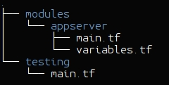

---
author:
  name: Linode Community
  email: docs@linode.com
description: 'Use Terraform to deploy Linodes containing pre-configured application environments such as Docker or from a manual configuration.'
og_description: 'Use Terraform to deploy Linodes containing pre-configured application environments such as Docker or from a manual configuration.'
keywords: ["Linode", "terraform", "plugin", "infrastructure", "IaC", "Infrastructure as Code"]
license: '[CC BY-ND 4.0](https://creativecommons.org/licenses/by-nd/4.0)'
published: 2017-11-06
modified: 2018-03-13
aliases: ['platform/how-to-build-your-infrastructure-using-terraform-and-linode/']
modified_by:
  name: Linode
title: 'Use Terraform to Provision Linode Environments'
contributor:
  name: Damaso Sanoja
---

Infrastructure as code (IaC) is software that gives developers the ability to build, manage, and provision computing environments with a high-level [configuration syntax](https://www.terraform.io/docs/configuration/syntax.html). Some benefits include the ability to enforce DevOps best practices, process automation, and the opportunity to use version control systems for greater visibility and collaboration within a team.

[Terraform](https://www.terraform.io) stands out from other IaC solutions because it's an orchestration tool, which means it's designed specifically for bare-metal server and virtual machines. The commands in this guide should be run from a client machine running Ubuntu 16.04.


The configurations and commands used in this guide will result in multiple Linodes being added to your account. Be sure to monitor your account closely in the Linode Manager to avoid unwanted charges.


## Before You Begin

-  You will need root access to the system and a standard user account with sudo privileges.

-  Create an API key for your Linode account. Be sure to take a screen capture of the API key when it's displayed, it will only appear once. See our [API Key](/docs/platform/api/api-key/) guide if you need help.

-  You will need [Git](https://git-scm.com/) installed on your system.

## Configure Client Machine

### Install Terraform

 1.  Download the following from [Terraform's website](https://www.terraform.io/downloads.html):

     - The 64-bit Linux `.zip` archive.
     - The SHA256 checksums file.
     - The checksum signature file.

2.  Import the HashiCorp Security [GPG key](https://www.hashicorp.com/security.html):

        gpg --keyserver keyserver.ubuntu.com --recv 348FFC4C

    The output should show that the key was imported:

    
        gpg: requesting key 348FFC4C from hkp server keyserver.ubuntu.com
        gpg: /root/.gnupg/trustdb.gpg: trustdb created
        gpg: key 348FFC4C: public key "HashiCorp Security <security@hashicorp.com>" imported
        gpg: no ultimately trusted keys found
        gpg: Total number processed: 1
        gpg:               imported: 1  (RSA: 1)
    

3.  Verify the checksum file's GPG signature:

        gpg --verify terraform*.sig terraform*SHA256SUMS

    The output should say the signature is good:
    
        gpg: Signature made Wed 31 Jan 2018 08:53:21 PM UTC using RSA key ID 348FFC4C
        gpg: Good signature from "HashiCorp Security <security@hashicorp.com>"
        gpg: WARNING: This key is not certified with a trusted signature!
        gpg:          There is no indication that the signature belongs to the owner.
        Primary key fingerprint: 91A6 E7F8 5D05 C656 30BE  F189 5185 2D87 348F FC4C


4.  Verify that the fingerprint matches what's on [HashiCorp's security page](https://www.hashicorp.com/security.html).

5.  Verify the `.zip` archive's checksum:

        sha256sum -c terraform*SHA256SUMS 2>&1 | grep OK

    The output should show the file's name as given in the `terraform*SHA256SUMS` file:

        terraform_0.11.3_linux_amd64.zip: OK

### Install Golang

1.  Download and extract Go from the project's [downloads page](https://golang.org/dl/). Terraform requires version 1.9:

        wget -c https://storage.googleapis.com/golang/go1.9.linux-amd64.tar.gz
        sudo tar -C /usr/local -xzf go*.linux-amd64.tar.gz

2.  Create separate directories for project executables and source code:

        mkdir -p ~/go_projects/{bin,src,pkg}

3.  Add Go-specific `PATH` locations to your user's environment. Add these lines to the bottom of your user's `~/.profile` file:

    
export PATH=$PATH:/usr/local/go/bin
export PATH=$PATH:$HOME/go_projects/bin
export GOPATH="$HOME/go_projects"
export GOBIN="$GOPATH/bin"

    
You can change the variables to any location that suits you, as long as it is included it in the `PATH` variable.


4.  Reload your user's environment profile:

        source ~/.profile

### Build a Linode Plugin for Terraform

1.  Download the Terraform repository:

        go get github.com/hashicorp/terraform

2.  Download the custom `terraform-provider-linode` repository:

        go get github.com/LinodeContent/terraform-provider-linode

3.  Source code is stored in Go's `src` directory by default. Change directories to the location of the Terraform Linode plugin and build the package. Dependencies will be handled automatically by `godeps` that's already in the plugin folder.

        cd ~/go_projects/src/github.com/LinodeContent/terraform-provider-linode/bin/terraform-provider-linode
        go build -o terraform-provider-linode

4.  Move the newly created binary and the Terraform configuration file to `~/go_projects/bin`:

        mv ~/go_projects/src/github.com/LinodeContent/terraform-provider-linode/bin/terraform-provider-linode/terraform-provider-linode ~/go_projects/bin
        mv ~/go_projects/src/github.com/LinodeContent/terraform-provider-linode/linode-template.tf ~/go_projects/bin

At this point, you have all the binaries needed. If the rest of your clients use the same operating system, then you can distribute these files among them. There is no need for each client to install `Go` or build the same package.

### Prepare the Terraform Plugin

1.  Download the Terraform repository:

        go get github.com/hashicorp/terraform

2.  Get the Linode plugin for Terraform:

        wget https://github.com/linode/docs-scripts/raw/master/hosted_scripts/terraform-linode-plugin/terraform-provider-linode

3.  Move the plugin to `~go_projects/bin`:

        mv terraform-provider-linode ~/go_projects/bin/
        chmod 750 ~/go_projects/bin/terraform-provider-linode

### Configure the Linode Provider

Terraform can understand two types of configuration files: JSON and HashiCorp Configuration Language (HCL). This guide [used the HCL format](#install-terraform), designated by the extension `.tf`.

1.  Open `linode-template.tf` in a text editor and add the snippet displayed below. Fill in your Linode API key, public SSH key, and desired root password where indicated:

    
provider "linode" {
  key = "your-linode-API-key-here"
}

resource "linode_linode" "terraform-example" {
        image = "Ubuntu 16.04 LTS"
        kernel = "Grub 2"
        name = "linode-example"
        group = "terraform-test"
        region = "Atlanta, GA, USA"
        size = 1024
        ssh_key = "your-ssh-id_rsa.pub-here"
        root_password = "your-server-password-here"
}


    See [Terraform's documentation](https://www.terraform.io/docs/configuration/syntax.html) for specific information regarding configuration syntax.

2.  Navigate to `~/go_projects/bin` and initialize the Terraform configuration:

        cd ~/go_projects/bin
        terraform init

    Terraform will confirm successful initialization:
    
        Terraform has been successfully initialized!


3.  If an error occurs, run the command again in debug mode:

        TF_LOG=debug terraform init

##  Use Terraform to Deploy a Linode

### Single Server Basic Linode

1.  Check your Terraform plan:

        terraform plan

    You will see:

        Refreshing Terraform state in-memory prior to plan...
        The refreshed state will be used to calculate this plan, but will not be
        persisted to local or remote state storage.

        ------------------------------------------------------------------------

        An execution plan has been generated and is shown below.
        Resource actions are indicated with the following symbols:
          + create

        Terraform will perform the following actions:

          + linode_linode.your-terraform-name-here
              id:                              <computed>
              disk_expansion:                  "false"
              group:                           "your-linode-group-name-here"
              helper_distro:                   "true"
              image:                           "Ubuntu 16.04 LTS"
              ip_address:                      <computed>
              kernel:                          "Grub 2"
              manage_private_ip_automatically: "true"
              name:                            "TFtest"
              plan_storage:                    <computed>
              plan_storage_utilized:           <computed>
              private_ip_address:              <computed>
              region:                          "Atlanta, GA, USA"
              root_password:                   "wAZ9SvTofwDbrGO2FWgoI3BZFy0bvqxnQnNF1qn9pIQ="
              size:                            "1024"
              ssh_key:                         "QLWOVauEwNxWGbj2ErWF9vFYIXsxW/2duL/og8gtV84="
              status:                          <computed>
              swap_size:                       "512"

        Plan: 1 to add, 0 to change, 0 to destroy.

        ------------------------------------------------------------------------

        Note: You didn't specify an "-out" parameter to save this plan, so Terraform
        can't guarantee that exactly these actions will be performed if
        "terraform apply" is subsequently run.


    If you need to fix any issues, activate debug mode:

        TF_LOG=debug terraform plan

    The `terraform plan` command won't take any action or make any changes on your Linode account. Terraform uses a declarative approach in which your configuration file specifies the desired end-state of the infrastructure. When you run `terraform plan`, an analysis is done to determine which actions are required to achieve this state.

2.  If there are no errors, start the deployment:

        terraform apply

    You'll be asked to confirm the action, enter `yes` and press **Enter**:

    
        An execution plan has been generated and is shown below.
        Resource actions are indicated with the following symbols:
          + create

        Terraform will perform the following actions:

          + linode_linode.your-terraform-name-here
              id:                              <computed>
              disk_expansion:                  "false"
              group:                           "your-linode-group-name-here"
              helper_distro:                   "true"
              image:                           "Ubuntu 16.04 LTS"
              ip_address:                      <computed>
              kernel:                          "Grub 2"
              manage_private_ip_automatically: "true"
              name:                            "your-linode-name-here"
              plan_storage:                    <computed>
              plan_storage_utilized:           <computed>
              private_ip_address:              <computed>
              region:                          "Atlanta, GA, USA"
              root_password:                   "wAZ9SvTofwDbrGO2FWgoI3BZFy0bvqxnQnNF1qn9pIQ="
              size:                            "1024"
              ssh_key:                         "QLWOVauEwNxWGbj2ErWF9vFYIXsxW/2duL/og8gtV84="
              status:                          <computed>
              swap_size:                       "512"

        Plan: 1 to add, 0 to change, 0 to destroy.

        Do you want to perform these actions?
          Terraform will perform the actions described above.
          Only 'yes' will be accepted to approve.

          Enter a value:


3.  Return to the Linode Manager. You should see the `linode-test` Linode has been added to your account.

### Two-Server Configuration

Now that you have the `linode-example` Linode created using Terraform, imagine you need to implement a web and database server deployment.

It's important to remember that:

* Terraform loads all files with the ".tf" extension present in the working directory into memory. As a result, all files are concatenated (in memory) and you don't need to define the provider in this file, since it was declared in `linode-template.tf`.

* Resources can't be duplicated, so you need to assign a unique name for each one.

* In this example the same SSH key and root password are being used. You should change these values in production environments.

* A new parameter `swap_size` is used to override the default value of 512Mb. You can check all available options for `terraform-provider-linode` in the plugin GitHub repository [readme.md](https://github.com/LinodeContent/terraform-provider-linode).

1.  From the `linode-template.tf` create another file called `linode-www.tf` (don't delete `linode-template.tf`):

    
resource "linode_linode" "terraform-www" {
  image = "CentOS 7"
  kernel = "Grub 2"
  name = "www"
  group = "web"
  region = "Dallas, TX, USA"
  size = 2048
  swap_size = 1024
  ssh_key = "your-ssh-id_rsa.pub-here"
  root_password = "your-server-password-here"
}


2.  Check your plan for errors:

        terraform plan

3.  Apply all changes:

        terraform apply

4.  Check the Linode Manager to ensure that the `www` Linode was added to the `web` display group on your account.

### Adjust Deployment

Imagine you want to change the first server name and tag to something more relevant, and also increase the size to match the newly created Linode.

1.  Modify the `linode-template.tf`

    
provider "linode" {
  key = "your-linode-API-key-here"
}

resource "linode_linode" "terraform-example" {
        image = "Ubuntu 16.04 LTS"
        kernel = "Grub 2"
        name = "database"
        group = "web"
        region = "Atlanta, GA, USA"
        size = 2048
        swap_size = 1024
        ssh_key = "your-ssh-id_rsa.pub-here"
        root_password = "your-server-password-here"
}



2.  Check your plan:

        terraform plan

3.  Apply your changes:

        terraform apply

    
Changing the size of your Linode will force your server to be powered off and migrated to a different host in the same data center. The associated disk migration will take approximately 1 minute for every 3-5 gigabytes of data. For more information about resizing read the [Resizing a Linode](/docs/platform/disk-images/resizing-a-linode/) guide.


4.  Return to the Linode Manager to verify the changes.

### Advanced Configuration Example

Up to this point, the procedure for adding a new node to your infrastructure was to create a new file and run the `terraform apply` command. But what happens when your planned infrastructure has dozens of servers? In this example, you will use a very simplistic version of a Terraform configuration file that uses variables.

1.  For the purpose of this example you will need to delete previous nodes:

        terraform plan -destroy

    That returns:

    
        Refreshing Terraform state in-memory prior to plan...
        The refreshed state will be used to calculate this plan, but will not be
        persisted to local or remote state storage.

        linode_linode.your-terraform-name-here: Refreshing state... (ID: 6630470)

        ------------------------------------------------------------------------

        An execution plan has been generated and is shown below.
        Resource actions are indicated with the following symbols:
          - destroy

        Terraform will perform the following actions:

          - linode_linode.TFtest

        Plan: 0 to add, 0 to change, 1 to destroy.

        ------------------------------------------------------------------------

        Note: You didn't specify an "-out" parameter to save this plan, so Terraform
        can't guarantee that exactly these actions will be performed if
        "terraform apply" is subsequently run.


2.  Similar to `terraform plan`, the above command checks your infrastructure before doing any change. To perform the deletion, run:

        terraform destroy

    That will return:

    
        linode_linode.your-terraform-name-here: Refreshing state... (ID: 6630470)

        An execution plan has been generated and is shown below.
        Resource actions are indicated with the following symbols:
          - destroy

        Terraform will perform the following actions:

          - linode_linode.TFtest

        Plan: 0 to add, 0 to change, 1 to destroy.

        Do you really want to destroy?
          Terraform will destroy all your managed infrastructure, as shown above.
          There is no undo. Only 'yes' will be accepted to confirm.

          Enter a value: yes

        linode_linode.your-terraform-name-here: Destroying... (ID: 6630470)
        linode_linode.your-terraform-name-here: Destruction complete after 0s

        Destroy complete! Resources: 1 destroyed.


3.  Verify the deletion in the Linode Manager.

4.  Delete (or move to a different location) all Terraform files.

        rm *.tf*

5.  Create a new file to define variables. You can use any name but for this example we'll use `variables.tf`:

    
variable "linode_key" {}
variable "ssh_key" {}
variable "root_password" {}
variable "region" {
  default = "Atlanta, GA, USA"
}


6.  Create the file `terraform.tfvars` to store your variables. **You can't change this filename** after creating it:

    
linode_key = "your-linode-API-key-here"
ssh_key = "your-ssh-id_rsa.pub-here"
root_password ="your-root-password-here"


7.  Create a new configuration file called `linode-mod-template.tf`:

    
# Linode Provider definition

provider "linode" {
  key = "${var.linode_key}"
}

# Example Web Server

resource "linode_linode" "www-01" {
        image = "CentOS 7"
        kernel = "Latest 64 bit"
        name = "www"
        group = "web"
        region = "Dallas, TX, USA"
        size = 2048
        swap_size = 1024
        ssh_key = "${var.ssh_key}"
        root_password = "${var.root_password}"
}

# Example Database Server

resource "linode_linode" "db-01" {
        image = "Ubuntu 16.04 LTS"
        kernel = "Latest 64 bit"
        name = "database"
        group = "web"
        region = "${var.region}"
        size = 2048
        swap_size = 1024
        ssh_key = "${var.ssh_key}"
        root_password = "${var.root_password}"
}



8.  Check your new deployment for errors:

        terraform plan

9.  Apply all changes:

        terraform apply

    The end result is the same as before. The use of variables gives Terraform great flexibility, not only to store repetitive data (as keys) but also to assign default values to any field.

## Manage your Infrastructure with Terraform

### Terraform Modules

The idea behind any code-driven solution is to avoid repetitive blocks. Terraform uses a concept called *modules* to group common server requirements and configurations. Think of modules as similar to *functions* in programming languages.

Take a look at the following file structure:

There is a directory called `modules` containing the reusable code blocks (in this case `appserver`) and a `testing` directory containing the specific configuration to implement. It's a minimal layout but enough to highlight benefits.

#### Basic Module Structure

The module structure is flexible, so you can use as many Terraform files as needed to describe your infrastructure. This example contains just one main configuration file describing the reusable code:


# Application Server

resource "linode_linode" "appserver" {
        image = "Ubuntu 16.04 LTS"
        kernel = "Latest 64 bit"
        name = "${var.appserver_name}"
        group = "web"
        region = "${var.region}"
        size = 2048
        swap_size = 1024
        ssh_key = "${var.ssh_key}"
        root_password = "${var.root_password}"
}

# Database Server

resource "linode_linode" "dbserver" {
        image = "CentOS 7"
        kernel = "Latest 64 bit"
        name = "${var.dbserver_name}"
        group = "web"
        region = "${var.region}"
        size = "${var.db_size}"
        swap_size = 1024
        ssh_key = "${var.ssh_key}"
        root_password = "${var.root_password}"
}


The configuration above reproduces the previous examples using variables. The next file contains variable definitions:


variable "appserver_name" {
    description = "The name for the Application Server"
    default = "default-app"
}

variable "dbserver_name" {
    description = "The name for the Database Server"
    default = "default-db"
}

variable "db_size" {
    description = "The size (plan) for your Database Linode"
    default = "1024"
}

variable "region" {
    description = "The default Linode region to deploy the infrastructure"
    default = "default-region"
}

variable "ssh_key" {
    description = "The Public id_rsa.pub key used for secure SSH connections"
    default = "default-ssh-key"
}

variable "root_password" {
    description = "The default root password for the Linode server"
    default = "default-root-pwd"
}




Assign a default value for each variable. That value will be used if you don't override it when you call the module.


Create a `main.tf` configuration file that uses the module you just created:


# Newark Testing Environment Infrastructure

provider "linode" {
  key = "your-linode-API-key-here"
}

module "appserver" {
  source = "/your/absolute/path/to/modules/appserver"

# Variables Specific to this Deployment

region = "Newark, NJ, USA"
ssh_key = "your-ssh-id_rsa"
root_password ="your-root-password-here"

# Variables Specific to Servers

appserver_name = "NJ-app"
dbserver_name = "NJ-db"
db_size = "8192"

}


To use a module, call it by name with the command `module` and indicate the absolute path where it is saved. Then you can assign values to each field defined by a variable. The final result will be the same as if you pasted in all of the reusable code in the main configuration file.

    cd ~/go_projects/bin/testing/
    terraform init
    terraform planned
    terraform apply

The possibilities of modules are endless. You can use several modules at once, you can mix the use of modules with traditional `resource` definitions, or you can even call modules from remote sources. For more information read the Terraform [modules documentation](https://www.terraform.io/docs/modules/index.html).

## Server Configuration

Terraform offers many ways to set up and provision your Linode, using:

* Custom scripts, which can be included on configuration file itself or called from a local or remote file.
* Specialized software tools integrated with Terraform like Chef or Puppet.
* Container-based solutions like Docker or Kubernetes.
* Terraform plugin-based solutions.

There are also plenty of [provisioners](https://www.terraform.io/docs/provisioners/index.html), [providers](https://github.com/terraform-providers), and even [modules](https://registry.terraform.io) available.
