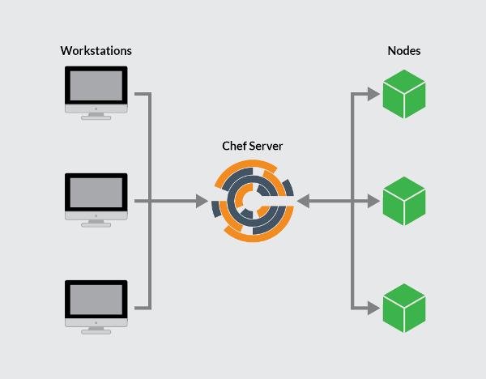

---
author:
  name: Linode
  email: docs@linode.com
description: 'Instructions on how to configure a Chef server and virtual workstation and how to bootstrap a client node on Ubuntu 18.04'
keywords: ["chef", "chef installation", "configuration change management", "server automation", "chef server", "chef workstation", "chef-client", "knife.rb", "version control"]
license: '[CC BY-ND 4.0](https://creativecommons.org/licenses/by-nd/4.0)'
published: 2018-07-19
modified: 2018-07-19
modified_by:
  name: Linode
title: 'Install a Chef Server Workstation on Ubuntu 18.04'
---
[Chef](http://www.chef.io) is an automation platform that "turns infrastructure into code," allowing users to manage and deploy resources across multiple servers, or *nodes*. Chef allows users to create and download recipes (stored in cookbooks) to automate content and policies on these nodes.

Chef is comprised of a Chef server, one or more workstations, and a number of nodes that are managed by the chef-client installed on each node.

This guide will show users how to create and configure a Chef server, a virtual workstation, and how to bootstrap a node to run the chef-client, all on individual Linodes.


This guide is written for a non-root user. Commands that require elevated privileges are prefixed with `sudo`. If you're not familiar with the `sudo` command, you can check our [Users and Groups](/docs/tools-reference/linux-users-and-groups/) guide.


## Prerequisites

-	One 4GB Linode to host the Chef server, running Ubuntu 18.04
-	Two Linodes of any size to host a workstation and a node, each running Ubuntu 18.04
-	Each Linode should be configured by following the [Getting Started](/docs/getting-started/) guide; also consider following the [Securing Your Sever](/docs/security/securing-your-server/) guide
-	Each Linode needs to be configured to have a valid FQDN
-	Ensure that all servers are up-to-date:

        sudo apt-get update && sudo apt-get upgrade

## The Chef Server

The Chef server is the hub of interaction between all workstations and nodes using Chef. Changes made through workstations are uploaded to the Chef server, which is then accessed by the chef-client and used to configure each individual node.

### Install the Chef Server

1.	[Download](https://downloads.chef.io/chef-server/#ubuntu) the latest Chef server core (12.17.54 at the time of writing):

        wget https://packages.chef.io/files/current/chef-server/12.17.54+20180531095715/ubuntu/18.04/chef-server-core_12.17.54+20180531095715-1_amd64.deb

1.	Install the server:

        sudo dpkg -i chef-server-core_*.deb

1.	Remove the download file:

        rm chef-server-core_*.deb

1.	The Chef server includes a command-line utility named `chef-server-ctl`. Run the `chef-server-ctl` command to start the Chef server services:

        sudo chef-server-ctl reconfigure

### Create a User and Organization

1. In order to link workstations and nodes to the Chef server, an administrator and an organization need to be created with associated RSA private keys. From the home directory, create a `.chef` directory to store the keys:

        mkdir .chef

1. Create a user. Change `USER_NAME` with the desired name, `FIRST_NAME` and `LAST_NAME` to your first and last name, `EMAIL` with your email, `PASSWORD` to a secure password and `USER_NAME.pem` to your username followed by `.pem`:

        sudo chef-server-ctl user-create USER_NAME FIRST_NAME LAST_NAME EMAIL 'PASSWORD' --filename ~/.chef/USER_NAME.pem

1. Create an organization and add the user created above to the admins and billing admins security groups. Replace `ORG_NAME` with a short identifier for the organization, `ORG_FULL_NAME` with the organizations' complete name, `USER_NAME` with the username created in the step above and `ORG_NAME.pem` with organization's short identifier followed by `.pem`:

        sudo chef-server-ctl org-create ORG_NAME "ORG_FULL_NAME" --association_user USER_NAME --filename ~/.chef/ORG_NAME.pem

      With the Chef server installed and the needed RSA keys generated, you can move on to configuring your workstation, where all major work will be performed for your Chef's nodes.

## Workstations

Your Chef workstation will be where you create and configure any recipes, cookbooks, attributes, and other changes made to your Chef configurations. Although this can be a local machine of any OS, there is some benefit to keeping a remote server as your workstation since it can be accessed from anywhere.

### Setting Up a Workstation

1.	[Download](https://downloads.chef.io/chef-dk/ubuntu/) the latest Chef Development Kit (3.1.0 at time of writing):

        wget https://packages.chef.io/files/stable/chefdk/3.1.0/ubuntu/18.04/chefdk_3.1.0-1_amd64.deb

1.	Install ChefDK:

        sudo dpkg -i chefdk_*.deb

1.	Remove the install file:

        rm chefdk_*.deb

1.	Generate the chef-repo and move into the newly-created directory:

        chef generate app chef-repo
        cd chef-repo

1.	The `.chef` directory is used to store the `knife.rb`, `ORGANIZATION-validator.pem`, and `USER.pem` files. Make the `.chef` directory to later store these files:

        mkdir .chef

### Add the RSA Private Keys

1.	The RSA private keys generated when setting up the Chef server will now need to be placed on the workstation. The process behind this will vary depending on if you are using SSH key pair authentication to log into your Linodes.

    - If you are **not** using key pair authentication, then copy the file directly off of the Chef Server. Replace `user` with your username on the server, and `123.45.67.89` with the URL or IP of your Chef Server:

            scp user@123.45.67.89:~/.chef/*.pem ~/chef-repo/.chef/

    - If you **are** using key pair authentication, then from your **local terminal** copy the .pem files from your server to your workstation using the `scp` command. Replace `user` with the appropriate username, and `123.45.67.89` with the URL or IP for your Chef Server and `987.65.43.21` with the URL or IP for your workstation:

            scp -3 user@123.45.67.89:~/.chef/*.pem user@987.65.43.21:~/chef-repo/.chef/

1.	Confirm that the files have been copied successfully by listing the contents of the `.chef` directory:

        ls ~/chef-repo/.chef

    Your `.pem` files should be listed.

### Add Version Control

The workstation is used to add and edit cookbooks and other configuration files. It is beneficial to implement some form of version control. The ChefDK adds the git component to your workstation and initializes a git repository in the directory used to generate the chef repo.  Configure git to add your username and email and add and commit any new files generated in the steps above.

1.	Configure Git by adding your username and email, replacing the needed values:

        git config --global user.name yourname
        git config --global user.email user@email.com

1.	Add the `.chef` directory to the `.gitignore` file:

        echo ".chef" > .gitignore

1.  Add and commit all existing files:

        git add .
        git commit -m "initial commit"

1.	Make sure the directory is clean:

        git status

    It should output:

    
        On branch master
        nothing to commit, working directory clean
    

### Generate knife.rb

1.	Create a knife configuration file by navigating to your `~/chef-repo/.chef` folder and creating a file named `knife.rb` in your chosen text editor.

2.	Copy the following configuration into the `knife.rb` file:

    
current_dir = File.dirname(__FILE__)
log_level                :info
log_location             STDOUT
node_name                'node_name'
client_key               "USER.pem"
validation_client_name   'ORG_NAME-validator'
validation_key           "ORGANIZATION-validator.pem"
chef_server_url          'https://example.com/organizations/ORG_NAME'
cache_type               'BasicFile'
cache_options( :path => "#{ENV['HOME']}/.chef/checksums" )
cookbook_path            ["#{current_dir}/../cookbooks"]



3.  Change the following:

     - The value for `node_name` should be the username that was created on the chef server.
     - Change `USER.pem` under `client_key` to reflect your `.pem` file for your **user**.
     - The `validation_client_name` should be your organization's `ORG_NAME` followed by `-validator`.
     - `ORGANIZATION-validator.pem` in the `validation_key` path should be set to the `ORG_NAME` followed by `-validator.pem`.
     - Finally the `chef_server_url` needs to contain the IP address or FQDN of your Chef server, with your `ORG_NAME`.

3.	Move to the `chef-repo` directory and copy the needed SSL certificates from the server:

        cd ..
        knife ssl fetch
  
  The SSL certificates are generated during the installation of the Chef server.  These certificates are self-signed, which means there isn’t a signing certificate authority (CA) to verify. The Chef server's hostname and FQDN should be the same so that the workstation can fetch and verify the SSL certificates. You can verify the Chef server's hostname and FQDN by running `hostname` and `hostname -f`, respectively.  Consult the [Chef documentation](https://docs.chef.io/server_security.html#regenerate-certificates) for details on regenerating SSL certificates.
  

4.	Confirm that `knife.rb` is set up correctly by running the client list:

        knife client list

    This command should output the validator name.

With both the server and a workstation configured, it is possible to bootstrap your first node.

## Bootstrap a Node

Bootstrapping a client node installs the chef-client and validates the node, allowing it to read from the Chef server and make any needed configuration changes picked up by the chef-client in the future.

1. From your *workstation*, navigating to your `~/chef-repo/.chef` directory.\:

        cd ~/chef-repo/.chef

1.	Bootstrap the client node either by using the client node's root user, or a user with elevated privileges:

    - As the node's root user, changing `password` to your root password and `nodename` to the desired name for your client node. You can leave this off it you would like the name to default to your node's hostname:

            knife bootstrap 123.45.67.89 -x root -P password --node-name nodename

    - As a user with sudo privileges, change `username` to a node user, `password` to the user's password and `nodename` to the desired name for the client node. You can leave this off it you would like the name to default to your node's hostname:

            knife bootstrap 123.45.67.89 -x username -P password --sudo --node-name nodename

    - As a user with key-pair authentication, change `username` to a node user, and `nodename` to the desired name for the client node. You can leave this off it you would like the name to default to your client node's hostname:

            knife bootstrap 123.45.67.89 --ssh-user username --sudo --identity-file ~/.ssh/id_rsa.pub --node-name hostname

2.	Confirm that the node has been bootstrapped by listing the client nodes:

        knife client list

    Your new client node should be included in the list.

## Download a Cookbook (Optional)

When using Chef you will want the chef-client to periodically run on your nodes and pull in any changes pushed to the Chef server. You will also want the `validation.pem` file that is uploaded to your node upon bootstrap to be deleted for security purposes. While these things can be done manually, it is often easier and more efficient to set it up as a cookbook.

This section is optional, but provides instructions on downloading a cookbook to your workstation, pushing it to a server, and includes the skeleton of a basic cookbook to expand and experiment with.

1. From your *workstation*, navigating to your `~/chef-repo/.chef` directory:

        cd ~/chef-repo/.chef

1.	Download the cookbook and dependencies:

        knife cookbook site install cron-delvalidate

2.	Open the `default.rb` file to examine the default cookbook recipe:

    
#
# Cookbook Name:: cron-delvalidate
# Recipe:: Chef-Client Cron & Delete Validation.pem
#
#

cron "clientrun" do
  minute '0'
  hour '*/1'
  command "/usr/bin/chef-client"
  action :create
end

file "/etc/chef/validation.pem" do
  action :delete
end



    The resource `cron "clientrun" do` defines the cron action. It is set to run the chef-client action (`/usr/bin/chef-client`) every hour (`*/1` with the `*/` defining that it's every hour and not 1AM daily). The `action` code denotes that Chef is *creating* a new cronjob.

    `file "/etc/chef/validation.pem" do` calls to the `validation.pem` file. The `action` defines that the file should be removed (`:delete`).

    These are two very basic sets of code in Ruby, and provide an example of the code structure that will be used when creating Chef cookbooks. These examples can be edited and expanded as needed.

3.	Add the recipe to your node's run list, replacing `nodename` with your node's name:

        knife node run_list add nodename 'recipe[cron-delvalidate::default]'

4.	Push the cookbook to the Chef server:

        knife cookbook upload cron-delvalidate

    This command is also used when updating cookbooks.

5.	Switch to your *bootstrapped* node(s) and run the initial chef-client command:

        chef-client

    If running the node as a non-root user, append the above command with `sudo`.

    The recipes in the run list will be pulled from the server and run. In this instance, it will be the `cron-delvalidate` recipe. This recipe ensures that any cookbooks made, pushed to the Chef Server, and added to the node's run list will be pulled down to bootstrapped nodes once an hour. This automated step eliminates connecting to the node in the future to pull down changes.
