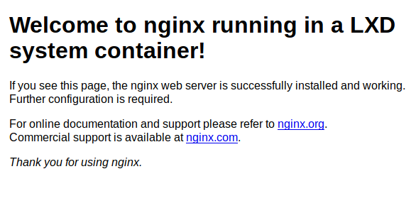

---
author:
  name: Linode
  email: docs@linode.com
description: 'LXD is a container hypervisor that manages Linux Containers. Compared to other uses of Linux Containers, LXD manages system containers which each work just like typical servers. This guide shows how to setup a reverse proxy in LXD 3 so that it is possible to host many websites in LXD system containers.'
keywords: ["container", "lxd", "lxc", "apache", "nginx", "reverse proxy", "virtual machine", "virtualization"]
license: '[CC BY-ND 4.0](https://creativecommons.org/licenses/by-nd/4.0)'
published: 2019-05-01
modified: 2019-05-01
title: "A Beginner's Guide to LXD: Setting Up a Reverse Proxy to Host Many Websites in Containers"
contributor:
  name: Simos Xenitellis
  link: https://blog.simos.info/
external_resources:
  - '[LXD Introduction](https://linuxcontainers.org/lxd/)'
  - '[LXD support community](https://discuss.linuxcontainers.org/)'
  - '[Try LXD Online](https://linuxcontainers.org/lxd/try-it/)'
  - '[NGINX Reverse Proxy Settings](https://docs.nginx.com/nginx/admin-guide/web-server/reverse-proxy/)'
  - '[Proxy Protocol](https://www.haproxy.com/blog/haproxy/proxy-protocol/)'
  - '[TLS Termination Proxy](https://en.wikipedia.org/wiki/TLS_termination_proxy)'
---

## Introduction

[LXD](https://linuxcontainers.org/lxd/) (pronounced "Lex-Dee") is a system container manager build on top of LXC (Linux Containers) and is supported by Canonical. The goal of LXD is to provide an experience similar to a virtual machine but through containerization rather than hardware virtualization. Compared to Docker for delivering applications, LXD offers nearly full operating-system functionality with additional features such as snapshots, live migrations, and storage management.

This guide covers how to install and configure a reverse proxy in a container. With the reverse proxy you can create Web servers running in individual containers and have them all exposed to the Internet. When a user visits your server with their Web browser, the reverse proxy handles the connection and identifies which Web server the connection is for.
In addition, you get SSL/TLS support through Let's Encrypt certificates with automated certificate renewal.
Without a reverse proxy it would not be possible to host more than one secure website on a single server. 

We are using _nginx_ as the reverse proxy software and show instructions on how to setup so that it can serve both _nginx_ and _apache2_ Web servers.  We are creating two websites in order to demonstrate the differences between _nginx_ and _apache2_.

We also perform the necessary configuration in each Web server container so that the Web server software is able to get the real source IP address of the visitors. That step is required and common in a reverse-proxy setup, because otherwise the Web servers would see all connections as if they are originating from the reverse proxy. 


For simplicity, the term *container* is used throughout this guide to describe the LXD system containers.


## Before You Begin

1.  Complete the [A Beginner's Guide to LXD: Setting Up an Apache Webserver In a Container](/docs/applications/containers/beginners-guide-to-lxd/) guide. At the end, the guide instructs to create a container called `web` with the Apache Web server for testing purposes. Remove this container by running

        lxc stop web
        lxc delete web

2. In this tutorial, we will be using the hostnames `apache1.example.com` and `nginx.example.com` for the two websites that we will be creating. Create two hostnames using domains that you own and set them to the IP address of the server that you have just created in Step 1. 

## Creating the containers

In this section, we create two containers, `apache1` and `nginx1`, one with the _Apache Web server_ and another with the _nginx Web server_ respectively. For your additional websites, you can create new containers with your favorite Web server software.

In addition, we create the `proxy` container for the reverse proxy. In subsequent sections, we perform the configuration in each container.

        lxc launch ubuntu:18.04 apache1
        lxc launch ubuntu:18.04 nginx1
        lxc launch ubuntu:18.04 proxy

Let's list the created containers. There are three containers, all in the _RUNNING_ state, and each has their own private IP address. Note down the IP addresses (both IPv4 and IPv6) for the `proxy` as we will need it when we configure the container with the Apache Web server. 

        lxc list

    
+---------+---------+---------------------+-----------------------------------------------+------------+-----------+
|  NAME   |  STATE  |        IPV4         |                     IPV6                      |    TYPE    | SNAPSHOTS |
+---------+---------+---------------------+-----------------------------------------------+------------+-----------+
| apache1 | RUNNING | 10.10.10.204 (eth0) | fd42:67a4:b462:6ae2:216:3eff:fe01:1a4e (eth0) | PERSISTENT |           |
+---------+---------+---------------------+-----------------------------------------------+------------+-----------+
| nginx1  | RUNNING | 10.10.10.251 (eth0) | fd42:67a4:b462:6ae2:216:3eff:febd:67e3 (eth0) | PERSISTENT |           |
+---------+---------+---------------------+-----------------------------------------------+------------+-----------+
| proxy   | RUNNING | 10.10.10.28 (eth0)  | fd42:67a4:b462:6ae2:216:3eff:fe00:252e (eth0) | PERSISTENT |           |
+---------+---------+---------------------+-----------------------------------------------+------------+-----------+


We have created the containers. In the following sections, we setup the Web server software in the `apache1` and `nginx1` containers. Then, we setup the `proxy` container so that the Web servers are accessible from the Internet. 

## Configuring the Apache Web server container
 
When using a reverse proxy in front of a Web server, the Web server does not know the IP addresses of visitors. The Web server only sees the IP address of the reverse proxy instead. Each Web server software has a way to identify the real remote IP address of a visitor and in the case of the Apache Web server, this is performed with the Remote IP Apache module. For the module to work, the reverse proxy is configured accordingly to pass the information regarding the remote IP addresses.

1.  Get a shell in the `apache1` container.

        lxc exec apache1 -- sudo --user ubuntu --login

2.  Update the package list in the `apache1` container.

        sudo apt update

3.  Install the package _apache2_ in the container.

        sudo apt install -y apache2 

4. Create the file `/etc/apache2/conf-available/remoteip.conf`. You can use the `nano` text editor, by running the command `sudo nano /etc/apache2/conf-available/remoteip.conf`. Then, add the following content. Note that these are the IP addresses of the `proxy` container shown earlier, for both IPv4 and IPv6.

        RemoteIPHeader X-Real-IP
        RemoteIPTrustedProxy 10.10.10.28 fd42:67a4:b462:6ae2:216:3eff:fe00:252e

    
Instead of specifying the IP addresses, we could have used the hostname, `proxy.lxd`. However, the RemoteIP Apache module is peculiar when using the hostname and will use only one of the two IP addresses (either IPv4 or IPv6), which means that the Apache Web server will not know the real soure IP address for some connections. By listing explicitly both IPv4 and IPv6 addresses, we are certain that RemoteIP will accept successfully the source IP information from all connections of the reverse proxy.


5. Enable the new `remoteip.conf` configuration.

        sudo a2enconf remoteip

    
Enabling conf remoteip.
To activate the new configuration, you need to run:
  systemctl reload apache2



6. Enable the `remoteip` Apache module.

        sudo a2enmod remoteip

    
Enabling module remoteip.
To activate the new configuration, you need to run:
  systemctl restart apache2



7. Restart the Apache Web server. 

        sudo systemctl reload apache2

8. Exit back to the host.

        exit

We have created and configured the Apache Web server. The server is not accessible yet from the Internet. It will become accessible as soon as we configure the `proxy` container in a following section.

### Creating the nginx Web server container

When using a reverse proxy in front of a Web server, the Web server does not know the IP addresses of visitors. The Web server only sees the IP address of the reverse proxy instead. Each Web server software has a way to identify the real remote IP address of a visitor and in the case of the nginx Web server, this is performed with the Real IP module. For the module to work, the reverse proxy is configured accordingly to pass the information regarding the remote IP addresses.

1.  Get a shell in the `nginx1` container.

        lxc exec nginx1 -- sudo --user ubuntu --login

2.  Update the package list in the `nginx1` container.

        sudo apt update

3.  Install _nginx_ in the container.

        sudo apt install -y nginx 

4. Create the file `/etc/nginx/conf.d/real-ip.conf`. You can use the `nano` text editor, by running the command `sudo nano /etc/nginx/conf.d/real-ip.conf`. Then, add the following content.

        real_ip_header    X-Real-IP;
        set_real_ip_from  proxy.lxd;

    
We have specified the hostname of the reverse proxy, `proxy.lxd`. Each LXD container gets automatically a hostname, which is the name of the container plus the suffix `.lxd`. By specifying the `set_real_ip_from` field with `proxy.lxd`, we are instructing the nginx Web server to accept the real IP address information for each connection, as long as that connection originates from `proxy.lxd`. The real IP address information will be found in the HTTP header `X-Real-IP` in each connection. 


5. Restart the nginx Web server. 

        sudo systemctl reload nginx

6. Exit back to the host. 

        exit

We have created and configured the nginx Web server. The server is not accessible yet from the Internet. It will become accessible as soon as we configure the `proxy` container in the next section.

## Setting up the reverse proxy

In this section you will configure the container `proxy`. You will install _nginx_ and setup it up as a reverse proxy, and add the appropriate LXD _proxy device_ in order to expose both ports 80 and 443 of the reverse proxy to the Internet.

1. Add LXD **proxy devices** to redirect connections from the internet to ports 80 (HTTP) and 443 (HTTPS) on the server to the respective ports at the `proxy` container.

        lxc config device add proxy myport80 proxy listen=tcp:0.0.0.0:80 connect=tcp:127.0.0.1:80 proxy_protocol=true
        lxc config device add proxy myport443 proxy listen=tcp:0.0.0.0:443 connect=tcp:127.0.0.1:443 proxy_protocol=true

    
Device myport80 added to proxy
Device myport443 added to proxy


    
The `lxc config device add` command takes as arguments: 

* `proxy`, the name of the container,
* `myport80`, a name for this proxy device. 
* `proxy`, the type of the LXD device (LXD _proxy_ device),
* `listen=tcp:0.0.0.0:80`, the proxy device will listen on the host (default) on port 80, protocol TCP, on all interfaces. 
* `connect=tcp:127.0.0.1:80`, the proxy device will connect to the container on port 80, protocol TCP, on the loopback interface. In previous versions of LXD you could have specified `localhost` here. However, in LXD 3.13 or newer, you can only specify IP addresses. 
* `proxy_protocol=true`, we request to enable the PROXY protocol so that the reverse proxy will get the originating IP address from the proxy device. 


    
If you want to remove a proxy device, you can use `lxc config device remove`. If you have a proxy device called _myproxydevice_, you would remove it by running `lxc config device remove mycontainer myproxydevice`.


2.  Get a shell in the `proxy` container.

        lxc exec proxy -- sudo --user ubuntu --login

3.  Update the package list.

        sudo apt update

4.  Install _nginx_ in the container.

        sudo apt install -y nginx 

5.  Logout from the container. 

        logout

### Setting up the Apache Web server in the reverse proxy

The reverse proxy container is running and the `nginx` package has been installed. To work as a reverse proxy, we add the appropriate website configuration so that `nginx` can identify (with `server_name` below) the appropriate hostname, and then pass (with `proxy_pass` below) the connection to the appropriate LXD container. 

1.  Get a shell in the `proxy` container.

        lxc exec proxy -- sudo --user ubuntu --login

2.  Add a file into `/etc/nginx/sites-available/` for the configuration of your first website. If we assume your website is `apache1.example.com`, then run `sudo nano /etc/nginx/sites-available/apache1.example.com` to open up a text editor to add the configuration. Add the following configuration content. Note that in your case you only need to edit the two fields, `server_name` (for the hostname of the website) and the `proxy_pass` (for the hostname of the container with the Website server).

        server {
                listen 80 proxy_protocol;
                listen [::]:80 proxy_protocol;
        
                server_name apache1.example.com;

                location / {
                        proxy_set_header Host $host;
                        proxy_set_header X-Real-IP $remote_addr;
                        proxy_pass http://apache1.lxd;
                }

                real_ip_header proxy_protocol;
                set_real_ip_from 127.0.0.1;
        }

3.  Enable the website.

        sudo ln -s /etc/nginx/sites-available/apache1.example.com /etc/nginx/sites-enabled/

4.  Restart the nginx reverse proxy. By restarting the service, nginx will read and apply the new site instructions that you have just added into `/etc/nginx/sites-enabled`.

        sudo systemctl reload nginx

5.  Exit from the proxy container and return back to the host.

        logout

6.  From your local computer, visit the URL of your website with your Web browser. You should see the default Apache page:

    

    
We have modified the default HTML file of the _Apache 2_ server by adding some text that shows the server is running in a LXD container. The file is `/var/www/html/index.html` in the `apache1` container.


    
If you look at the Apache2 access.log file (default file `/var/log/apache2/access.log`), you will notice that it still shows the private IP address of the `proxy` container instead of the real IP address. This issue is specific to the Apache2 Web server and has to do with the way that the server prints the logs. Other software that you install on the Web server will be able to use the real IP. To fix though the Apache2 logs, see the section _Troubleshooting_.


###  Setting up the nginx Web server in the reverse proxy

The reverse proxy container is running and the `nginx` package has been installed. To work as a reverse proxy, we add the appropriate website configuration so that `nginx` can identify (with `server_name` below) the appropriate hostname, and then pass (with `proxy_pass` below) the connection to the appropriate LXD container with the actual Web server software.

1.  Get a shell in the `proxy` container.

        lxc exec proxy -- sudo --user ubuntu --login

2.  Add a file into `/etc/nginx/sites-available/` for the configuration of your first website. If we assume your website is `nginx1.example.com`, then run `sudo nano /etc/nginx/sites-available/nginx1.example.com` to create the configuration.. Add the following configuration content. Note that you only need to edit the two fields, `server_name` (for the hostname of the website) and the `proxy_pass` (for the hostname of the container with the Website server).

        server {
                listen 80 proxy_protocol;
                listen [::]:80 proxy_protocol;
        
                server_name nginx1.example.com;

                location / {
                        proxy_set_header Host $host;
                        proxy_set_header X-Real-IP $remote_addr;
                        proxy_pass http://nginx1.lxd;
                }

                real_ip_header proxy_protocol;
                set_real_ip_from 127.0.0.1;
        }

3.  Enable the website.

        sudo ln -s /etc/nginx/sites-available/nginx1.example.com /etc/nginx/sites-enabled/

4.  Restart the nginx reverse proxy service.

        sudo systemctl reload nginx

5.  Exit from the proxy container and return back to the host.

        logout

6.  From your local computer, visit the URL of your website with your Web browser. You should see the following default nginx page.

    

    
We have modified the default HTML file of the _nginx_ server by adding some text that shows the server is running in a LXD container. The file is `/var/www/html/index.nginx-debian.html` in the `nginx1` container.


### Adding support for https with Let's Encrypt

1.  Get a shell in the `proxy` container.

        lxc exec proxy -- sudo --user ubuntu --login

2.  Add the repository `ppa:certbot/certbot` by running the following command. After the command you can view a typical output from running this command.

        sudo add-apt-repository ppa:certbot/certbot

    
      This is the PPA for packages prepared by Debian Let's Encrypt Team and backported for Ubuntu(s).
      More info: https://launchpad.net/~certbot/+archive/ubuntu/certbot
     Press [ENTER] to continue or Ctrl-c to cancel adding it.
     
     Get:1 http://security.ubuntu.com/ubuntu bionic-security InRelease [88.7 kB]
     ...
     Fetched 3360 kB in 2s (2018 kB/s)
     Reading package lists... Done


3.  Install the following packages to add support to creating Let's Encrypt certificates and autoconfiguring the nginx reverse proxy to use these certificates. These two packages are pulled from the repository that we have just added.

        sudo apt-get install certbot python-certbot-nginx

    
We are now configuring the reverse proxy to act also as a _TLS Termination Proxy_. Any https configuration is only found in the `proxy` container. By doing so, we do not need to perform any tasks inside the Web server containers relating to certificates and Let's Encrypt. 


4.  Run `certbot` as root with the `--nginx` parameter in order to perform the autoconfiguration of Let's Encrypt for the first website. You will be asked to supply a valid email address to be used to send you urgent renewal and security notices. You will then be asked to accept the Terms of Service and subsequently whether you want to let the Electronic Frontier Foundation to keep in touch with you. Next, you are asked which website you are activating HTTPS for. Finally, you are asked whether you want to setup a facility that automatically redirects HTTP connections to HTTPS connections. 

        sudo certbot --nginx

    
Saving debug log to /var/log/letsencrypt/letsencrypt.log
Plugins selected: Authenticator nginx, Installer nginx
Enter email address (used for urgent renewal and security notices) (Enter 'c' to
cancel): myemail@example.com

- - - - - - - - - - - - - - - - - - - - - - - - - - - - - - - - - - - - - - - -
Please read the Terms of Service at
https://letsencrypt.org/documents/LE-SA-v1.2-November-15-2017.pdf. You must
agree in order to register with the ACME server at
https://acme-v02.api.letsencrypt.org/directory
- - - - - - - - - - - - - - - - - - - - - - - - - - - - - - - - - - - - - - - -
(A)gree/(C)ancel: A

- - - - - - - - - - - - - - - - - - - - - - - - - - - - - - - - - - - - - - - -
Would you be willing to share your email address with the Electronic Frontier
Foundation, a founding partner of the Let's Encrypt project and the non-profit
organization that develops Certbot? We'd like to send you email about our work
encrypting the web, EFF news, campaigns, and ways to support digital freedom.
- - - - - - - - - - - - - - - - - - - - - - - - - - - - - - - - - - - - - - - -
(Y)es/(N)o: N

Which names would you like to activate HTTPS for?
- - - - - - - - - - - - - - - - - - - - - - - - - - - - - - - - - - - - - - - -
1: apache1.example.com
2: nginx1.example.com
- - - - - - - - - - - - - - - - - - - - - - - - - - - - - - - - - - - - - - - -
Select the appropriate numbers separated by commas and/or spaces, or leave input
blank to select all options shown (Enter 'c' to cancel): 1
Obtaining a new certificate
Performing the following challenges:
http-01 challenge for apache1.example.com
Waiting for verification...
Cleaning up challenges
Deploying Certificate to VirtualHost /etc/nginx/sites-enabled/apache1.example.com

Please choose whether or not to redirect HTTP traffic to HTTPS, removing HTTP access.
- - - - - - - - - - - - - - - - - - - - - - - - - - - - - - - - - - - - - - - -
1: No redirect - Make no further changes to the webserver configuration.
2: Redirect - Make all requests redirect to secure HTTPS access. Choose this for
new sites, or if you're confident your site works on HTTPS. You can undo this
change by editing your web server's configuration.
- - - - - - - - - - - - - - - - - - - - - - - - - - - - - - - - - - - - - - - -
Select the appropriate number [1-2] then [enter] (press 'c' to cancel): 2
Redirecting all traffic on port 80 to ssl in /etc/nginx/sites-enabled/apache1.example.com

- - - - - - - - - - - - - - - - - - - - - - - - - - - - - - - - - - - - - - - -
Congratulations! You have successfully enabled https://apache1.example.com

You should test your configuration at:
https://www.ssllabs.com/ssltest/analyze.html?d=apache1.example.com
- - - - - - - - - - - - - - - - - - - - - - - - - - - - - - - - - - - - - - - -

IMPORTANT NOTES:
 - Congratulations! Your certificate and chain have been saved at:
   /etc/letsencrypt/live/apache1.example.com/fullchain.pem
   Your key file has been saved at:
   /etc/letsencrypt/live/apache1.example.com/privkey.pem
   Your cert will expire on 2019-10-07. To obtain a new or tweaked
   version of this certificate in the future, simply run certbot again
   with the "certonly" option. To non-interactively renew *all* of
   your certificates, run "certbot renew"
 - Your account credentials have been saved in your Certbot
   configuration directory at /etc/letsencrypt. You should make a
   secure backup of this folder now. This configuration directory will
   also contain certificates and private keys obtained by Certbot so
   making regular backups of this folder is ideal.
 - If you like Certbot, please consider supporting our work by:

   Donating to ISRG / Let's Encrypt:   https://letsencrypt.org/donate
   Donating to EFF:                    https://eff.org/donate-le


4.  Run `certbot` as root with the `--nginx` parameter in order to perform the autoconfiguration of Let's Encrypt for the second website. This is the second time we run `certbot`, therefore we are asked directly to select the website to configure. 

        sudo certbot --nginx

    
Saving debug log to /var/log/letsencrypt/letsencrypt.log
Plugins selected: Authenticator nginx, Installer nginx

Which names would you like to activate HTTPS for?
- - - - - - - - - - - - - - - - - - - - - - - - - - - - - - - - - - - - - - - -
1: apache1.example.com
2: nginx1.example.com
- - - - - - - - - - - - - - - - - - - - - - - - - - - - - - - - - - - - - - - -
Select the appropriate numbers separated by commas and/or spaces, or leave input
blank to select all options shown (Enter 'c' to cancel): 2
Obtaining a new certificate
Performing the following challenges:
http-01 challenge for nginx1.example.com
Waiting for verification...
Cleaning up challenges
Deploying Certificate to VirtualHost /etc/nginx/sites-enabled/nginx1.example.com

Please choose whether or not to redirect HTTP traffic to HTTPS, removing HTTP access.
- - - - - - - - - - - - - - - - - - - - - - - - - - - - - - - - - - - - - - - -
1: No redirect - Make no further changes to the webserver configuration.
2: Redirect - Make all requests redirect to secure HTTPS access. Choose this for
new sites, or if you're confident your site works on HTTPS. You can undo this
change by editing your web server's configuration.
- - - - - - - - - - - - - - - - - - - - - - - - - - - - - - - - - - - - - - - -
Select the appropriate number [1-2] then [enter] (press 'c' to cancel): 2
Redirecting all traffic on port 80 to ssl in /etc/nginx/sites-enabled/nginx1.example.com

- - - - - - - - - - - - - - - - - - - - - - - - - - - - - - - - - - - - - - - -
Congratulations! You have successfully enabled https://nginx1.example.com

You should test your configuration at:
https://www.ssllabs.com/ssltest/analyze.html?d=nginx1.example.com
- - - - - - - - - - - - - - - - - - - - - - - - - - - - - - - - - - - - - - - -

IMPORTANT NOTES:
 - Congratulations! Your certificate and chain have been saved at:
   /etc/letsencrypt/live/nginx1.example.com/fullchain.pem
   Your key file has been saved at:
   /etc/letsencrypt/live/nginx1.example.com/privkey.pem
   Your cert will expire on 2019-10-07. To obtain a new or tweaked
   version of this certificate in the future, simply run certbot again
   with the "certonly" option. To non-interactively renew *all* of
   your certificates, run "certbot renew"
 - If you like Certbot, please consider supporting our work by:

   Donating to ISRG / Let's Encrypt:   https://letsencrypt.org/donate
   Donating to EFF:                    https://eff.org/donate-le


5.  After you have added all websites, perform a dry run in order to test the renewal of the certificates. Note in the dry run that all your websites are updating successfully. By doing so, you can be confident that the automated facility will be able to update the certificates for you without further effort from you.

        sudo certbot renew --dry-run

    
Saving debug log to /var/log/letsencrypt/letsencrypt.log

- - - - - - - - - - - - - - - - - - - - - - - - - - - - - - - - - - - - - - - -
Processing /etc/letsencrypt/renewal/apache1.example.com.conf
- - - - - - - - - - - - - - - - - - - - - - - - - - - - - - - - - - - - - - - -
Cert not due for renewal, but simulating renewal for dry run
Plugins selected: Authenticator nginx, Installer nginx
Renewing an existing certificate
Performing the following challenges:
http-01 challenge for apache1.example.com
Waiting for verification...
Cleaning up challenges

- - - - - - - - - - - - - - - - - - - - - - - - - - - - - - - - - - - - - - - -
new certificate deployed with reload of nginx server; fullchain is
/etc/letsencrypt/live/apache1.example.com/fullchain.pem
- - - - - - - - - - - - - - - - - - - - - - - - - - - - - - - - - - - - - - - -

- - - - - - - - - - - - - - - - - - - - - - - - - - - - - - - - - - - - - - - -
Processing /etc/letsencrypt/renewal/nginx1.example.com.conf
- - - - - - - - - - - - - - - - - - - - - - - - - - - - - - - - - - - - - - - -
Cert not due for renewal, but simulating renewal for dry run
Plugins selected: Authenticator nginx, Installer nginx
Renewing an existing certificate
Performing the following challenges:
http-01 challenge for nginx1.example.com
Waiting for verification...
Cleaning up challenges

- - - - - - - - - - - - - - - - - - - - - - - - - - - - - - - - - - - - - - - -
new certificate deployed with reload of nginx server; fullchain is
/etc/letsencrypt/live/nginx1.example.com/fullchain.pem
- - - - - - - - - - - - - - - - - - - - - - - - - - - - - - - - - - - - - - - -

- - - - - - - - - - - - - - - - - - - - - - - - - - - - - - - - - - - - - - - -
** DRY RUN: simulating 'certbot renew' close to cert expiry
**          (The test certificates below have not been saved.)

Congratulations, all renewals succeeded. The following certs have been renewed:
  /etc/letsencrypt/live/apache1.example.com/fullchain.pem (success)
  /etc/letsencrypt/live/nginx1.example.com/fullchain.pem (success)
** DRY RUN: simulating 'certbot renew' close to cert expiry
**          (The test certificates above have not been saved.)
- - - - - - - - - - - - - - - - - - - - - - - - - - - - - - - - - - - - - - - -

IMPORTANT NOTES:
 - Your account credentials have been saved in your Certbot
   configuration directory at /etc/letsencrypt. You should make a
   secure backup of this folder now. This configuration directory will
   also contain certificates and private keys obtained by Certbot so
   making regular backups of this folder is ideal.


    
The `certbot` package adds a _systemd timer_ in order to activate the automated renewal of Let's Encrypt certificates. You can view the details of this timer by running `systemctl list-timers`. 


6. The `certbot` tool edits and changes the nginx configuration files of our websites. In doing so, currently `certbot` does not obey our initial `listen` directive (`listen 80 proxy_protocol;`) and does not add the `proxy_protocol` parameter to the newly added `listen 443 ssl;` lines. We need to edit the configuration files for each website and append `proxy_protocol` to each `listen 443 ssl;` line. Finally, restart `nginx`.

        sudo nano /etc/nginx/sites-enabled/apache1.example.com
        sudo nano /etc/nginx/sites-enabled/nginx1.example.com 
        sudo systemctl restart nginx

    
listen 443 ssl proxy_protocol; # managed by Certbot
listen [::]:443 ssl proxy_protocol; # managed by Certbot


    
Each website configuration file has two pairs of `listen` directives, for HTTP and HTTPS respectively. The first is the original pair for HTTP we have added in a previous section. The second pair is the one added by `certbot` for HTTPS. These are pairs because they they cover both IPv4 and IPv6. The notation `[::]` refers to IPv6. When adding the parameter `proxy_protocol`, add it before the `;` on each line as shown above.


## Troubleshooting

### Browser error "SSL_ERROR_RX_RECORD_TOO_LONG"

You have configured _Certbot_ and created the appropriate Let's Encrypt configuration for each website. But when you access the website from your browser, you get the following error. 

    
Secure Connection Failed

An error occurred during a connection to apache1.example.com. SSL received a record that exceeded the maximum permissible length. Error code: SSL_ERROR_RX_RECORD_TOO_LONG

    The page you are trying to view cannot be shown because the authenticity of the received data could not be verified.
    Please contact the website owners to inform them of this problem.


This error is caused when _nginx_ reverse proxy in the `proxy` container does not have the `proxy_protocol` parameter in the `listen 443` directives. Without the parameter, the reverse proxy does not consume the _PROXY protocol_ information before it performs the HTTPS work. Mistakenly, it passes the _PROXY protocol_ information to the HTTPS module, hence the _record too long_ error. 

Follow the instructions in the previous section and add `proxy_protocol` to all `listen 443` directives. Finally, restart `nginx`.

### Error "Unable to connect" or "This site can’t be reached"

When you attempt to connect to the website from your local computer and you get the error _Unable to connect_ or _This site can't be reached_, then it is likely that the proxy devices have not been configured. Run the following command on the host to verify whether LXD is listening and is able to accept connections to ports 80 (_http_) and 443 (_https_).

        sudo ss -ltp '( sport = :http || sport = :https )'


The _ss_ command is similar to _netstat_ and _lsof_. It shows information about network connections. In this case, we use it to verify whether there is a service on ports 80 and 443, and which service it is. 
* `-l`, to display the listening sockets,
* `-t`, to display only TCP sockets,
* `-p`, to show which processes use those sockets,
* `( sport = :http || sport = :https )`, to show only ports 80 and 443 (_http_ and _https_ respectively). 


In the following we can verify that both ports 80 and 443 (_http_ and _https_ respectively) are in the _LISTEN_ state. In the last column we verify that the process which is listening, is `lxd` itself.

    
State     Recv-Q  Send-Q   Local Address:Port   Peer Address:Port
LISTEN    0       128                  *:http              *:*       users:(("lxd",pid=1301,fd=7),("lxd",pid=1301,fd=5))
LISTEN    0       128                  *:https             *:*       users:(("lxd",pid=1349,fd=7),("lxd",pid=1349,fd=5))


If you get a process other than `lxd`, then you need to stop that service and restart the `proxy` container. By restarting the `proxy` container, LXD will apply again the proxy devices. 

### The Apache access.log still shows the IP address of the proxy container

You have set up the `apache1` container and you have verified that it is accessible from the Internet. You check the logs at `/var/log/apache2/access.log` and you notice that it still shows the private IP address of the `proxy` container, either the IPv4 or the IPv6 private IP addresses (_10.x.x.x_ and ). What went wrong?

The default log formats for the printing of the access logs in Apache only print the IP address of the host of the last hop (i.e. the proxy server). This is the **%h** format specifier as shown below.

    
LogFormat "%v:%p %h %l %u %t \"%r\" %>s %O \"%{Referer}i\" \"%{User-Agent}i\"" vhost_combined
LogFormat "%h %l %u %t \"%r\" %>s %O \"%{Referer}i\" \"%{User-Agent}i\"" combined
LogFormat "%h %l %u %t \"%r\" %>s %O" common


The **%h** must be manually replaced with the **%a** format specifier, which prints the value as returned by the RemoteIP Apache module. 

    
LogFormat "%v:%p %a %l %u %t \"%r\" %>s %O \"%{Referer}i\" \"%{User-Agent}i\"" vhost_combined
LogFormat "%a %l %u %t \"%r\" %>s %O \"%{Referer}i\" \"%{User-Agent}i\"" combined
LogFormat "%a %l %u %t \"%r\" %>s %O" common


Run the following command in the `apache1` container to edit the configuration file `httpd.conf` and perform the change from `%h` to `%a`.

        sudo nano /etc/apache2/apache2.conf

Then, reload the Apache Web server service. 

        sudo systemctl reload apache2

## Next Steps

You have setup a reverse proxy to host many websites on the same server and have installed each website in a separate container. You can install static websites in the containers or dynamic websites. For dynamic websites you may need additional configuration; check the respective documentation for the setup using a reverse proxy. In addition, you may also use nginx as a reverse proxy for non-HTTP/S services. 
