---
author:
  name: Tyler Langlois
  email: ty@tjll.net
description: "Learn how to install components of the Elastic Stack like Elasticsearch and Kibana on Kubernetes."
keywords:
  [
    "elastic",
    "elasticsearch",
    "kibana",
    "filebeat",
    "metricbeat",
    "kubernetes",
    "k8s",
    "elk",
    "helm",
  ]
license: "[CC BY-ND 4.0](https://creativecommons.org/licenses/by-nd/4.0)"
published: 2019-08-01
modified_by:
  name: Linode
title: "How to Deploy the Elastic Stack on Kubernetes"
external_resources:
  - "[Elastic Documentation](https://www.elastic.co/guide/index.html)"
---

## What is the Elastic Stack?

[The Elastic Stack](https://www.elastic.co/elk-stack) is a collection of open source projects from Elastic that help collect and visualize a wide variety of data sources. Elasticsearch can store and aggregate data such as log files, container metrics, and more. The products in the stack include: Elasticsearch, Logstash, Kibana, and now Beats.

In this guide:

- You will [configure and deploy](/docs/applications/containers/how-to-deploy-the-elastic-stack-on-kubernetes/#configure-helm) a number of [Helm](https://helm.sh) [charts](/docs/applications/containers/how-to-deploy-the-elastic-stack-on-kubernetes/#install-charts) in a [Kubernetes](https://kubernetes.io/) cluster in order to set up components of the Elastic Stack.
- [Configure and run Kibana](/docs/applications/containers/how-to-deploy-the-elastic-stack-on-kubernetes/#configure-kibana) in the web browser.
- [Install Metricbeat](/docs/applications/containers/how-to-deploy-the-elastic-stack-on-kubernetes/#metricbeat) and deploy dashboards to Kibana to explore Kubernetes cluster data.

At the end of this guide, you will have a deployment installed and configured that you can further use for application logs or monitoring Kubernetes itself.


This guide's example instructions will create the following billable resources on your Linode account: four (4) Linodes and three (3) Block Storage volumes. If you do not want to keep using the example cluster that you create, be sure to delete the cluster Linodes and volumes when you have finished the guide.

If you remove the resources afterward, you will only be billed for the hour(s) that the resources were present on your account. Consult the [Billing and Payments](/docs/platform/billing-and-support/billing-and-payments/) guide for detailed information about how hourly billing works and for a table of plan pricing.


## Before You Begin


This guide uses Kubernetes services which are private by default. Local listeners are opened which allow you to access the services on your local browser, however, web servers and NodeBalancers are out scope for this guide. Due to this, you should complete the steps of this guide from your local computer or from a computer that you will give you access the web browser. If you wish to be able to access these services from a public domain, please see our guide on [Getting Started with NodeBalancers](/docs/platform/nodebalancer/getting-started-with-nodebalancers/).


1.  [Install the Kubernetes CLI](https://kubernetes.io/docs/tasks/tools/install-kubectl/) (`kubectl`) on your computer, if it is not already.

1.  Follow the [How to Deploy Kubernetes on Linode with the k8s-alpha CLI](/docs/applications/containers/how-to-deploy-kubernetes-on-linode-with-k8s-alpha-cli/) guide to set up a Kubernetes cluster. This guide will use a three node + master node cluster. You can use the following Linode k8s-alpha CLI command to create your cluster:

        linode-cli k8s-alpha create example-cluster --node-type g6-standard-2 --nodes 3 --master-type g6-standard-2 --region us-east --ssh-public-key ~/.ssh/id_rsa.pub

    - You should use this guide instead of manual installation via a method such as `kubeadmin`, as the k8s-alpha tool will setup support for persistent volume claims.

    - Node sizes are important when configuring Elasticsearch, and this guide assumes 4GB Linode instances.

    - This guide also assumes that your cluster has [role-based access control (RBAC)](https://kubernetes.io/docs/reference/access-authn-authz/rbac/) enabled. This feature became available in Kubernetes 1.6. It is enabled on clusters created via the `k8s-alpha` Linode CLI.

1.  You should also make sure that your Kubernetes CLI is using the right cluster context. Run the `get-contexts` subcommand to check:

        kubectl config get-contexts

1.  Set up Helm in your Kubernetes cluster by following the [How to Install Apps on Kubernetes with Helm
    ](/docs/applications/containers/how-to-install-apps-on-kubernetes-with-helm/) guide and stop following the steps in this guide upon reaching the [Use Helm Charts to Install Apps](/docs/applications/containers/how-to-install-apps-on-kubernetes-with-helm/#use-helm-charts-to-install-apps) section.

## Configure Helm

After following the prerequisites for this guide, you should have a Kubernetes cluster with Helm installed and configured.

1.  Add the `elastic` chart repository to your local installation of Helm:

        helm repo add elastic https://helm.elastic.co

1.  Fetch the updated list of charts from all configured chart repositories:

        helm repo update

1.  Search for the official `elasticsearch` chart to confirm Helm has been configured correctly. Note that this chart released by Elastic differs from the chart bundled with the default installation of Helm.

        helm search elasticsearch --version 7

    This command should return results similar to the following. Note that your exact version numbers may be different.

        NAME                    CHART VERSION   APP VERSION     DESCRIPTION
        elastic/elasticsearch   7.3.2           7.3.2           Official Elastic helm chart for Elasticsearch

Your Helm environment is now prepared to install official Elasticsearch charts into your kubernetes cluster.

## Install Charts

### Install Elasticsearch

Before installing the chart, ensure that resources are set appropriately. By default, the `elasticsearch` chart allocates 1G of memory to the JVM heap and sets Kubernetes resource requests and limits to 2G. Using a Linode 4GB instance is compatible with these defaults, but if you are using a different instance type, you will need to provide different values to the chart at install time in order to ensure that running pods are within the resource constraints of the node sizes you have chosen.

1.  Install the `elasticsearch` chart. This command will wait to complete until all pods are started and ready:

        helm install --name elasticsearch --wait --timeout=600 elastic/elasticsearch

1.  A three-node Elasticsearch cluster is now configured and available locally to the Kubernetes cluster. To confirm this, first port-forward a local port to the Elasticsearch service. You should leave this command running in a terminal window or tab in in the background for the remainder of this tutorial.

        kubectl port-forward svc/elasticsearch-master 9200:9200

1.  In another terminal window, send a request to this port:

        curl http://localhost:9200/

1.  You should see a response similar to the following:

        {
          "name" : "elasticsearch-master-0",
          "cluster_name" : "elasticsearch",
          "cluster_uuid" : "o66WYOm5To2znbZ0kOkDUw",
          "version" : {
            "number" : "7.3.2",
            "build_flavor" : "default",
            "build_type" : "docker",
            "build_hash" : "1c1faf1",
            "build_date" : "2019-09-06T14:40:30.409026Z",
            "build_snapshot" : false,
            "lucene_version" : "8.1.0",
            "minimum_wire_compatibility_version" : "6.8.0",
            "minimum_index_compatibility_version" : "6.0.0-beta1"
          },
          "tagline" : "You Know, for Search"
        }

Note that your specific version numbers and dates may be different in this json response. Elasticsearch is operational, but not receiving or serving any data.

### Install Filebeat

In order to start processing data, deploy the `filebeat` chart to your Kubernetes cluster. This will collect all pod logs and store them in Elasticsearch, after which they can be searched and used in visualizations within Kibana.

1.  Deploy the `filebeat` chart. No custom `values.yaml` file should be necessary:

        helm install --name filebeat --wait --timeout=600 elastic/filebeat

1.  Confirm that Filebeat has started to index documents into Elasticsearch by sending a request to the locally-forwarded Elasticsearch service port:

        curl http://localhost:9200/_cat/indices

    At least one `filebeat` index should be present, and output should be similar to the following:

    
        green open filebeat-7.3.12-2019.09.30-000001 peGIaeQRQq-bfeSG3s0RWA 1 1 9886 0 5.7mb 2.8mb
    

### Install Kibana

Kibana will provide a frontend to Elasticsearch and the data collected by Filebeat.

1.  Deploy the `kibana` chart:

        helm install --name kibana --wait --timeout=600 elastic/kibana

1.  Port-forward the `kibana-kibana` service in order to access Kibana locally. Leave this command running in the background as well for the remainder of this tutorial.

        kubectl port-forward svc/kibana-kibana 5601:5601

## Configure Kibana

Before visualizing pod logs, Kibana must be configured with an index pattern for Filebeat's indices.

1.  With the previous `port-forward` command running in another terminal window, open your browser and navigate to http://localhost:5601

1.  A page similar to the following should render in your browser.

    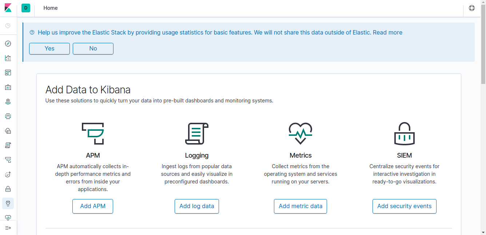

1.  To begin configuring index patterns, scroll down until the **Index Patterns** button appears, and click it.

    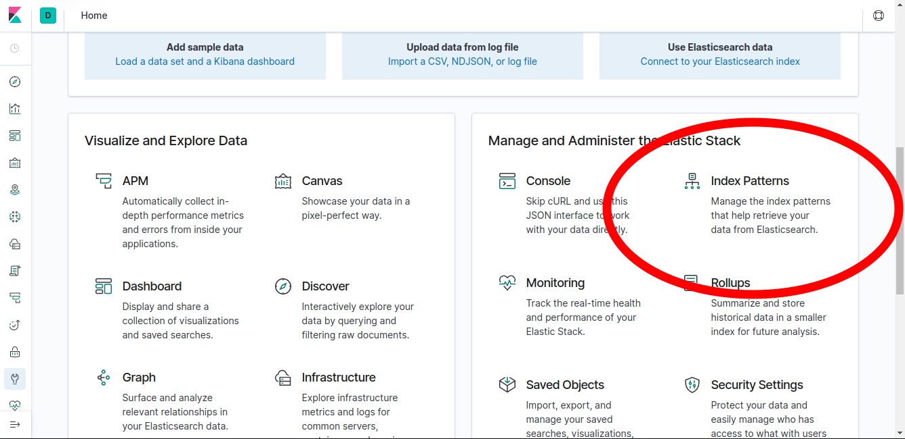

1.  The Index Patterns page should be displayed. Click the **Create index pattern** button to begin.

    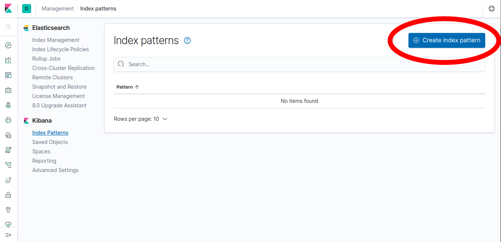

1.  From this page, enter "filebeat-\*" into the **Index pattern** text box, then click the **Next step** button.

    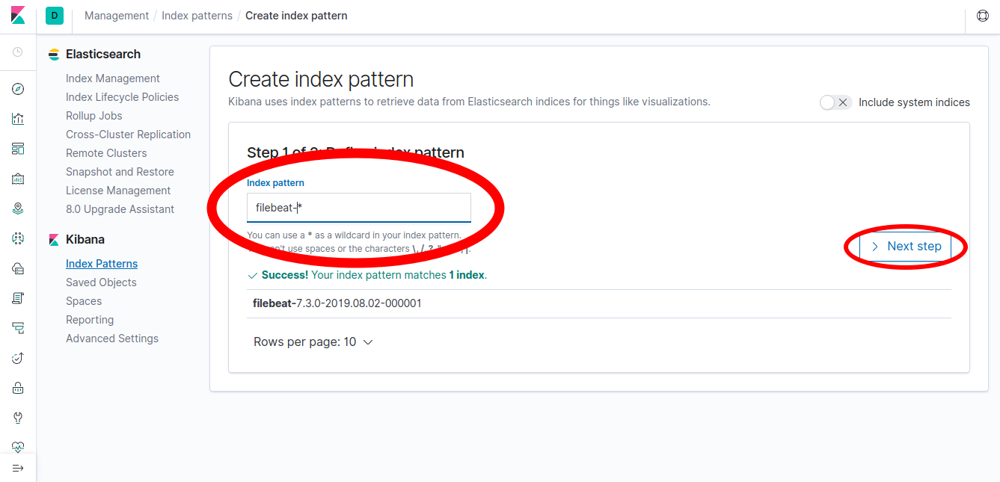

1.  In the following page, select `@timestamp` from the **Time Filter field name** dropdown menu, then click the **Create index pattern** button.

    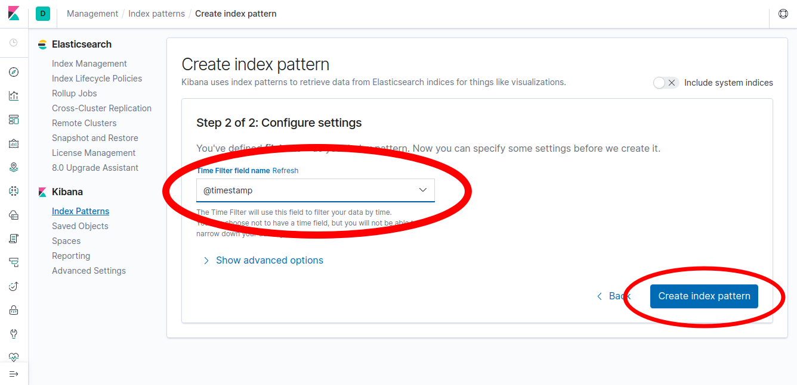

1.  A page with the index pattern details will then be shown. Click the **Discover** compass icon from the sidebar to view incoming logs.

    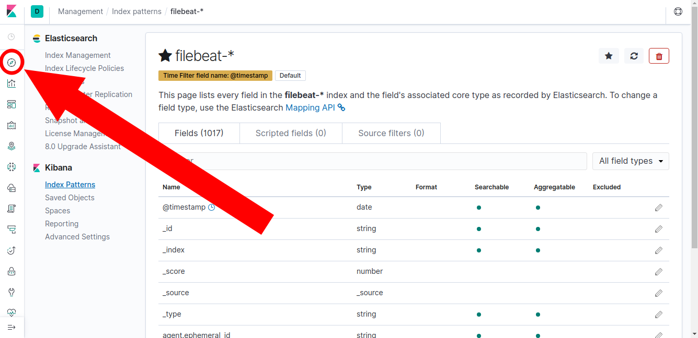

1.  The Discover page provides a realtime view of logs as they are ingested by Elasticsearch from your Kubernetes cluster. The histogram provides a view of log volume over time, which by default, spans the last 15 minutes. The sidebar on the left side of the user interface displays various fields parsed from json fields sent by Filebeat to Elasticsearch.

1.  Use the **Filters** box to search only for logs arriving from Kibana pods by filtering for `kubernetes.container.name : "kibana"`. Click the **Update** button to apply the search filter.

     
When searching in the filters box, field names and values are auto-populated.


     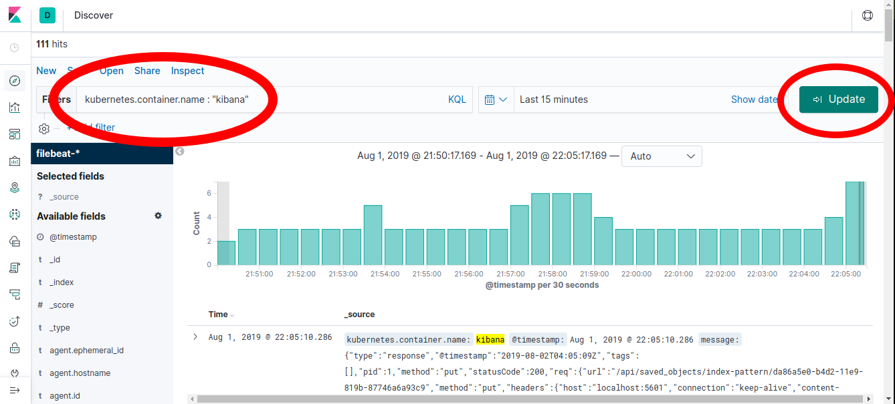

1.  In order to expand a log event, click the arrow next to an event in the user interface.

    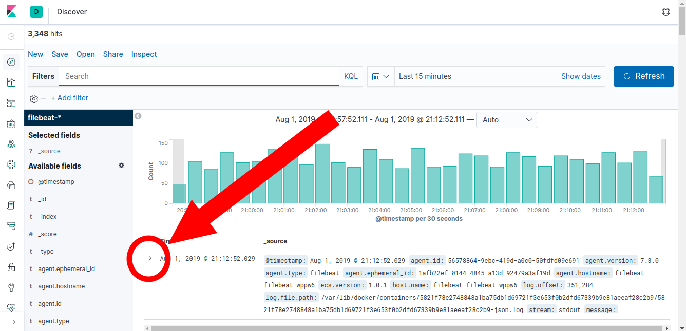

1.  Scroll down to view the entire log document in Kibana. Observe the fields provided by Filebeat, including the `message` field, which contains standard out and standard error messages from the container, as well as the kubernetes node and pod name in fields prefixed with `kubernetes`.

    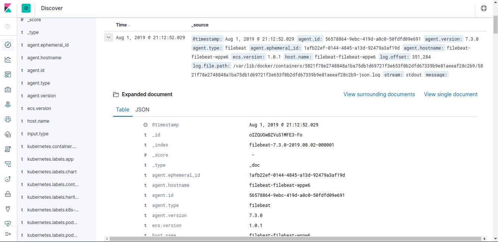

1.  Look closely at the `message` field in the log representation and note that the text field is formatted as json. While the terms in this field can be searched with free text search terms in Kibana, parsing this field will generally yield better results. The following section explains how to configure Filebeat and Kibana to achieve this.

## Update Stack Configuration

At this point, the Elastic stack is functional and provides an interface to visualize and create dashboards for your logs from Kubernetes. This section will explain how to further configure the various components of the stack for greater visibility into your Kubernetes environment.

1.  Create a values file for Filebeat. This configuration will add the ability to provide [autodiscover hints](https://www.elastic.co/guide/en/beats/filebeat/master/configuration-autodiscover-hints.html). Instead of changing the Filebeat configuration each time parsing differences are encountered, autodiscover hints permit fragments of Filebeat configuration to be defined at the pod level dynamically so that applications can instruct Filebeat as to how their logs should be parsed.

    

---

filebeatConfig:
filebeat.yml: |
filebeat.autodiscover:
providers:
  - type: kubernetes
hints.enabled: true
output.elasticsearch:
hosts: '\${ELASTICSEARCH_HOSTS:elasticsearch-master:9200}'


1.  Upgrade the `filebeat` deployment to use this new configuration file:

        helm upgrade --values filebeat-values.yml --wait --timeout=600 filebeat elastic/filebeat

1.  Once this command completes, Filebeat's `DaemonSet` will have successfully updated all running pods.

1.  Next, create a Kibana values file to append annotations to the Kibana `Deployment` that will indicate that Filebeat should parse certain fields as json values. This configuration file will instruct Filebeat to parse the `message` field as json and store the parsed object underneath the `kibana` field.

    

---

podAnnotations:
co.elastic.logs/processors.decode_json_fields.fields: message
co.elastic.logs/processors.decode_json_fields.target: kibana


1.  Upgrade the Kibana Helm release in your Kubernetes cluster, passing this file as an argument for the Chart values.

        helm upgrade --values kibana-values.yml --wait --timeout=600 kibana elastic/kibana

1.  Note, triggering a rolling pod update of Kibana will cause the previous `port-forward` to lose track of running pods. Terminate the previous Kibana `port-forward` command in the background terminal with `Ctrl-C` and start the command again:

        kubectl port-forward svc/kibana-kibana 5601:5601

1.  Open a browser window to http://localhost:5601 and navigate to the same *Index Patterns* page again:

    

1.  From the *Index Patterns* page, select the `filebeat-*` index pattern.

    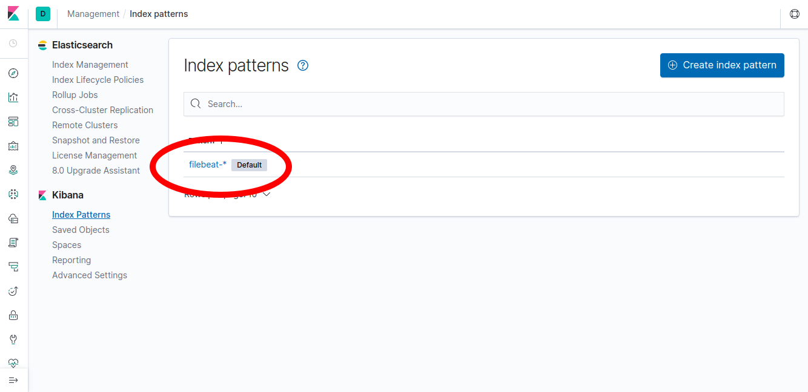

1.  From the index pattern page for `filebeat-*`, select the **Refresh field list** button.

    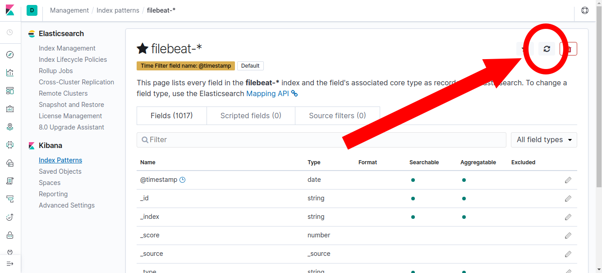

1.  Confirm this action by selecting the **Refresh** button in the pop-up dialog.

    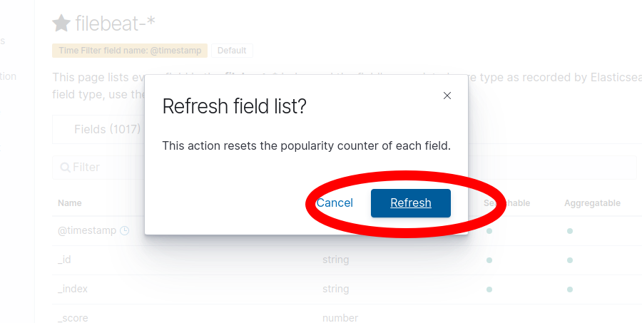

1.  Navigate to the "Discover" page.

    

1.  Filter for `kibana` containers again, scroll down, and expand a log document. Note that various fields have been parsed into the `kibana` field, such as `kibana.req.method`, indicating which HTTP verb was issued for a request for Kibana.

    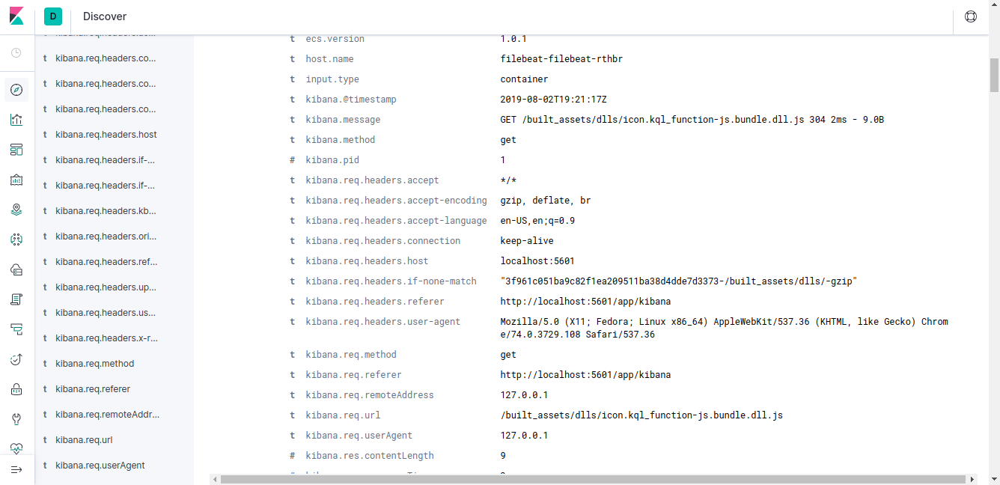

## Metricbeat

In addition to collecting logs with Filebeat, Metricbeat can collect pod and node metrics in order to visualize information such as resource utilization.

### Install Metricbeat

1.  Deploy the `metricbeat` chart.

        helm install --name metricbeat --wait --timeout=600 elastic/metricbeat

1.  Confirm that Metricbeat has started to index documents into Elasticsearch by sending a request to the locally-forwarded Elasticsearch service port:

        curl http://localhost:9200/_cat/indices

1.  At least one `metricbeat` index should be present, similar to the following:

        green open metricbeat-7.3.2-2019.09.30-000001 N75uVk_hTpmVbDKZE0oeIw 1 1   455  0   1.1mb 567.9kb

### Load Dashboards

Metricbeat can install default Dashboards into Kibana to provide out-of-the-box visualizations for data collected by Kubernetes.

Before following these steps, ensure that the `port-forward` command to expose Kibana over port `5601` locally is still running.

Run the following commands on your local machine. This will communicate with Kibana over `127.0.0.1:5601` to import default Dashboards that will be populated by data from Metricbeat.


Your commands should use the same version of Metricbeat deployed to your Kubernetes cluster. You can find this version by issuing the following command:

    helm get values --all metricbeat | grep imageTag


#### For Linux

1.  Get the Metricbeat package.

        wget https://artifacts.elastic.co/downloads/beats/metricbeat/metricbeat-7.3.2-linux-x86_64.tar.gz

1.  Unzip the package.

        tar xvzf metricbeat-7.3.2-linux-x86_64.tar.gz

1.  Navigate to the directory.

        cd metricbeat-7.3.2-linux-x86_64

1.  Setup the dashboards.

        ./metricbeat setup --dashboards

#### For MacOS

1.  Get the Metricbeat package.

        wget https://artifacts.elastic.co/downloads/beats/metricbeat/metricbeat-7.3.2-darwin-x86_64.tar.gz

1.  Unzip the package.

        tar xvzf metricbeat-7.3.2-darwin-x86_64.tar.gz

1.  Navigate to the directory.

        cd metricbeat-7.3.2-darwin-x86_64

1.  Setup the dashboards.

        ./metricbeat setup --dashboards

#### Explore Dashboards

1.  Open a browser window to http://localhost:5601 and click the **Dashboards** icon on the left sidebar.

    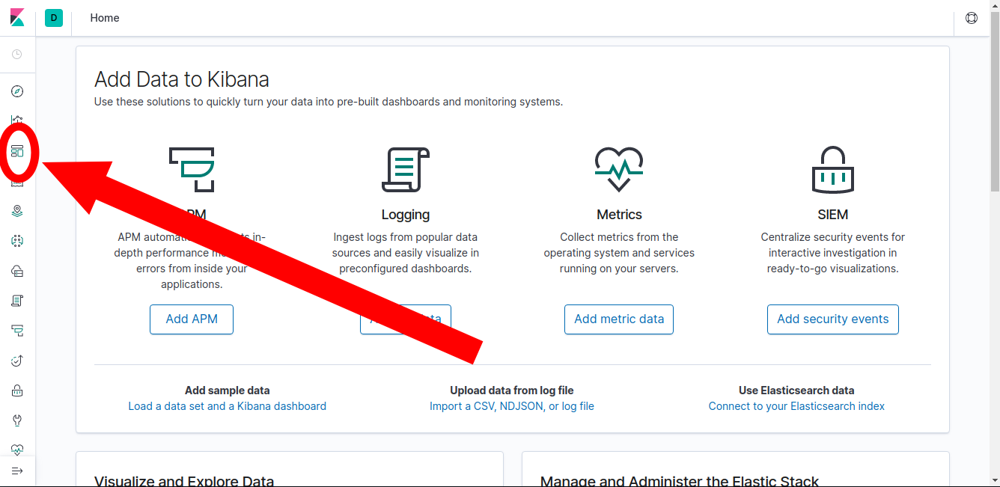

1.  In the search box, enter "kubernetes" and press `Enter`. Select the **[Metricbeat Kubernetes] Overview ECS** dashboard.

    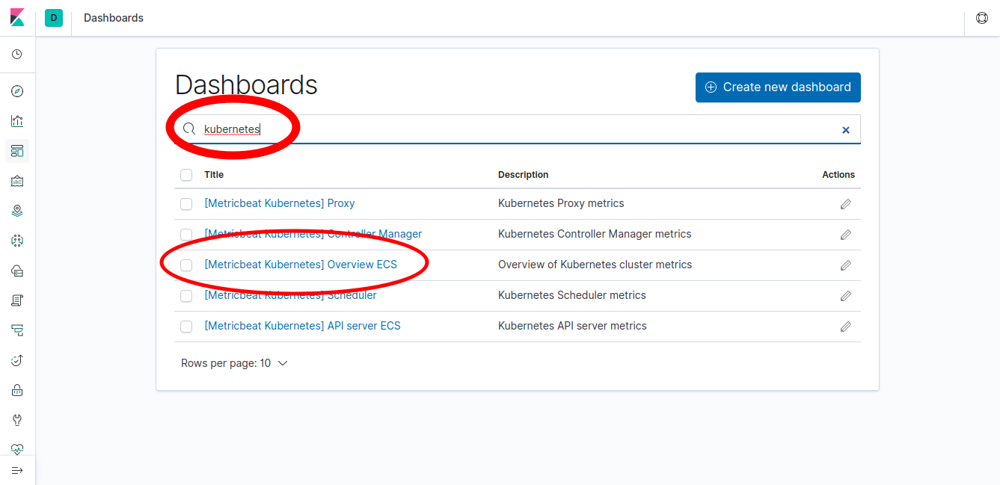

1.  The following dashboard displays several types of metrics about your Kubernetes cluster.

    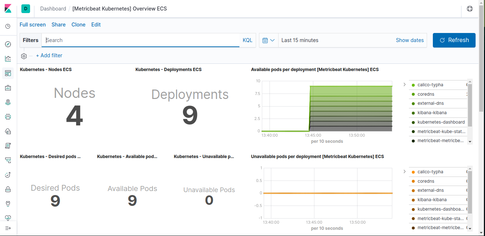

1.  You can explore the various visualizations on this page in order to view metrics about *pods*, *nodes*, and the overall health of the Kubernetes cluster.

## Next Steps

From this point onward, any additional workloads started in Kubernetes will be processed by Filebeat and Metricbeat in order to collect logs and metrics for later introspection within Kibana. As Kubernetes nodes are added or removed, the Filebeat and Metricbeat `DaemonSets` will automatically scale out pods to monitor nodes as they join the Kubernetes cluster.
