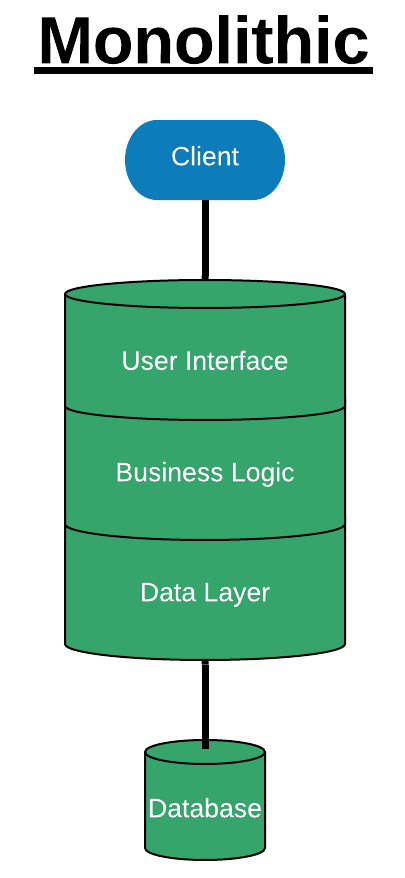
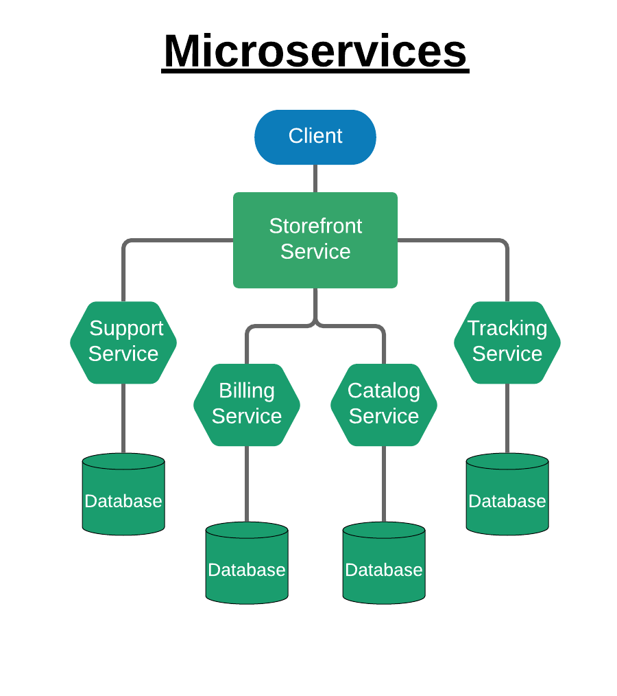
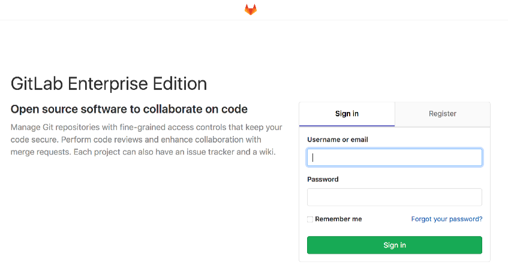

---
author:
  name: Linode
  email: docs@linode.com
description: 'Introduction to Microservices With Kubernetes and Gitlab'
keywords: ['kubernetes','k8s', 'Gitlab', 'Git', 'definitions']
license: '[CC BY-ND 4.0](https://creativecommons.org/licenses/by-nd/4.0)'
published: 2019-08-21
modified_by:
  name: Linode
title: "Introduction to Microservices With Kubernetes and Gitlab"
contributor:
  name: Linode
external_resources:
- '[Gitlab](https://about.gitlab.com/https://about.gitlab.com/)'
- '[Kubernetes](https://kubernetes.io/)'
- '[Helm](https://helm.sh/)'
- '[Troubleshooting Gitlab](https://docs.gitlab.com/charts/troubleshooting/index.html)'

---
This guide is the first part of a three-part series on using microservices with Kubernetes and Gitlab. Parts two and three will give a high level overview of what microservice applications on Kubernetes are doing under the hood.

In this guide you will:

 - Learn [what are microservices](/docs/applications/containers/introduction-to-microservices-with-kubernetes-and-gitlab/#what-are-microservices).
 - Learn the [advantages](/docs/applications/containers/introduction-to-microservices-with-kubernetes-and-gitlab/#advantages) and [disadvantages](/docs/applications/containers/introduction-to-microservices-with-kubernetes-and-gitlab/#disadvantages) of a microservices architecture over the more traditional Monolithic application.
 - [Deploy](/docs/applications/containers/introduction-to-microservices-with-kubernetes-and-gitlab/#deploying-gitlab-as-a-microservices-application) [Gitlab](https://about.gitlab.com/) as a microservices application in [Kubernetes](https://kubernetes.io/).

## Before You Begin

- This guide will have you set up an example Gitlab application.

- You will need a domain name with `minio`, `gitlab`,  and `registry` subdomains reserved.

- Make sure you are familiar with basic Kubernetes concepts. Our [Beginner's Guide to Kubernetes](/docs/applications/containers/kubernetes/beginners-guide-to-kubernetes/) outlines the essentials.

## What Are Microservices?

The term *Microservices Application Architecture* is used to describe a method of building large-scale applications through a number of smaller, interlocking, loosely bound services and components. Every one of these services are referred to as a **microservice** since they are a smaller modular service that together build a larger application.

Consider the architecture of a large online shop or retailer. Previously, the most common option for a large scale application would be to use a *Monolithic Application Architecture*, or a large Multitier architecture, which deploys an entire application as a single tier or unit. Below is a diagram portraying the Monolithic version of this architecture for the online shop:

 The *Microservices Application Architecture* is in contrast to the more traditional *Monolithic Application Architecture* that deploys the entire application as a single tier or unit. Below is a diagram portraying the same application for our online shop using our microservices application architecture:

We can see that the microservices application segments the same application for our online shop by dividing it between several different microservices.

While the microservices architecture is a more modern solution than Monolithic architecture, it is important to note that this does not necessarily make it the ideal solution for every use case. The benefits are best seen in very large applications.  It can be difficult to initially set up or transfer existing architecture to a microservices architecture since, for example, microservices add extra layers of complexity to a configuration (usually requiring containers to communicate through an internal API). When considering whether or not to use a Microservice architecture for your use case, it's important to keep in mind a number of factors.

Below are common advantages and disadvantages of a microservice application on Kubernetes in comparison to a Monolithic approach:

### Advantages

-   Each service has the potential to be scaled and claim resources independently. This means that the overall resources your application requires can potentially be significantly reduced, with each component given an independent lifecycle.
-   Having multiple independent services means that if one breaks, it is not as likely to bring down your entire application. This will usually increase your application's overall fault tolerance. When relying on third parties, it can help to mitigate potential issues that may be outside of your direct control.
- Independent services are often easier to understand as smaller pieces than a large overarching monolithic app.  Developers in microservices architecture can work on a specific service or services without being as dependent on the configuration of the application as a whole; this often saves development time for large scale applications and allows developers to choose a language of their choice for any given component.

### Disadvantages

- Nearly all of the benefits of a microservices application increase in tandem with the size of the application as a whole. If the application itself is small, the added complexity of a microservices application may come with little additional benefit.
- Migrating from a different form of architecture to a microservices architecture can be time-consuming and difficult, and potentially not justifiable as a short-term solution for legacy applications.
- Each instance of a service must be configured and monitored independently.
- Microservice applications often implement newer technology that may not be well understood by team members.

## Why Microservices on Kubernetes?

[Kubernetes](https://kubernetes.io/) is a powerful modern container orchestration tool that brings a number of additional advantages to a microservices application. Since microservices are best run in containers, Kubernetes handles much of the creation of and communication between your hardware and the microservices that reside within. Kubernetes can automatically recreate microservices when a failure is detected, and automatically scale your infrastructure to meet any demands on your application and it's individual corresponding microservices. Kubernetes also has the added benefit of supporting the replication of your microservices applications, making your application highly available as a whole, or even just in it's most necessary parts.

The architecture of a Kubernetes microservices application will also include the addition of replication for individual services within [pods](/docs/applications/containers/kubernetes/beginners-guide-to-kubernetes-part-3-objects/#pods).

## Deploying Gitlab as a Microservices Application

Now that we have a basic understanding of microservices applications and how they work, let's deploy a microservices application that we can use to further comprehend these concepts in more depth.


The Helm chart used in this guide will create a NodeBalancer and five Block Storage volumes (90 GB total) on your account, which, if applied, will be reflected on any future bills for the hours they are active.

If you remove the resources afterward, you will only be billed for the hour(s) that the resources were present on your account. Consult the [Billing and Payments](http://localhost:1313/docs/platform/billing-and-support/billing-and-payments/) guide for detailed information about how hourly billing works and for a table of plan pricing.


- You will need to have a Kubernetes Cluster pre-deployed. We recommend creating a master on our [4GB plan](https://www.linode.com/pricing), and two workers on our [2GB plan](https://www.linode.com/pricing). You can do this easily using our [k8s Alpha CLI](https://www.linode.com/docs/applications/containers/kubernetes/how-to-deploy-kubernetes-on-linode-with-k8s-alpha-cli/) to streamline the deployment. The following syntax will create these resources for you:

        linode-cli k8s-alpha create kentucky --node-type g6-standard-1 --nodes 2 --master-type g6-standard-2 --region us-east --ssh-public-key $HOME/.ssh/id_rsa.pub

- You must have a domain that you own and control with an [A record](https://www.linode.com/docs/networking/dns/dns-records-an-introduction/#a-and-aaaa) pointing towards one of your worker nodes.
- [Helm](https://helm.sh/) must be installed on your cluster. You can follow the steps in the installation section of our [Installing Apps with Helm](https://www.linode.com/docs/applications/containers/kubernetes/how-to-install-apps-on-kubernetes-with-helm/) guide to complete this.


If you'd like to see the Monolithic version of the Gitlab application, follow our guide for [Deploying Gitlab as a One-Click Application](/docs/platform/one-click/deploy-gitlab-with-one-click-apps/)



### Installing Gitlab with Helm

1. To deploy Gitlab as a microservices application, we'll be using a Helm chart. You can read more about this chart on [Gitlab's Charts page](https://docs.gitlab.com/charts/).

1. The Gitlab repo needs to be added:

        helm repo add gitlab https://charts.gitlab.io/

1. Before proceeding, make sure to update Helm to ensure that you have a full list of available charts and updates.

        helm repo update

1. Enter the following command on your control node to begin the installation process. Replace `mydomain.com` with your domain name, the IP address affiliated with your domain following `externalIP`, and `myemail@website.com` with an email address you'd like to use to generate a free SSL certificate using [Let's Encrypt](https://letsencrypt.org/).

        helm upgrade --install gitlab gitlab/gitlab   --timeout 600 --set global.hosts.domain=mydomain.com --set global.hosts.externalIP=203.0.113.0 --set certmanager-issuer.email=myemail@website.com

1. This will begin the installation process, which we can watch and monitor using kubectl:

        kubectl get pods

    
If you are concerned about the status of any running services, check their logs using the following syntax:

    kubectl logs <servicename>


1. You will see output similar to the following:

    
NAME                                                   READY   STATUS            RESTARTS   AGE
cm-acme-http-solver-c5cxz                              1/1     Running           0          108s
cm-acme-http-solver-mgwrl                              1/1     Running           0          78s
cm-acme-http-solver-rblc6                              1/1     Running           0          108s
gitlab-certmanager-788c6859c6-cd9sn                    1/1     Running           0          119s
gitlab-gitaly-0                                        0/1     PodInitializing   0          119s
gitlab-gitlab-monitor-56cc7f984c-c28n6                 1/1     Running           0          119s
gitlab-gitlab-runner-dd97f84b-hmwhx                    1/1     Running           0          119s
gitlab-gitlab-shell-5bb9fcc4d-5qrfj                    1/1     Running           0          119s
gitlab-gitlab-shell-5bb9fcc4d-qc2w9                    1/1     Running           0          104s
gitlab-issuer.1-8m8p6                                  0/1     Completed         0          119s
gitlab-migrations.1-7npbx                              0/1     PodInitializing   0          119s
gitlab-minio-c64f9694b-pskvl                           1/1     Running           0          119s
gitlab-minio-create-buckets.1-qjclq                    1/1     Running           0          119s
gitlab-nginx-ingress-controller-5846ccbf4-5m9kx        1/1     Running           0          118s
gitlab-nginx-ingress-controller-5846ccbf4-6pl5g        1/1     Running           0          118s
gitlab-nginx-ingress-controller-5846ccbf4-7d4sv        1/1     Running           0          118s
gitlab-nginx-ingress-default-backend-7f87d67c8-9b6x9   1/1     Running           0          118s
gitlab-nginx-ingress-default-backend-7f87d67c8-c7vqd   1/1     Running           0          118s
gitlab-postgresql-cb4c58788-jhjkz                      2/2     Running           0          118s
gitlab-prometheus-server-66f6d79d66-rrdtp              0/2     PodInitializing   0          117s
gitlab-redis-6cc5f876db-hd44h                          0/2     PodInitializing   0          117s
gitlab-registry-7f95847fb4-2x5bp                       1/1     Running           0          117s
gitlab-registry-7f95847fb4-7cpg6                       1/1     Running           0          117s
gitlab-sidekiq-all-in-1-74655c6c75-vcwp6               0/1     Init:2/3          0          119s
gitlab-task-runner-68775bf44d-q27lh                    1/1     Running           0          119s
gitlab-unicorn-694748c5c9-mb8kf                        0/2     Init:2/3          0          103s
gitlab-unicorn-694748c5c9-w47tl                        0/2     Init:2/3          0          119s


    The Helm chart will create a [NodeBalancer](/docs/platform/nodebalancer/getting-started-with-nodebalancers/), which will be used to add an additional layer of high availability to our application.

1. Domain propagation will take a few minutes to successfully resolve to your new IP address following this change, and the `gitlab-runner` microservice may crash since it relies on this resolution. You'll want to periodically check this service to make sure it hasn't failed. See the [Troubleshooting section](/docs/applications/containers/introduction-to-microservices-with-kubernetes-and-gitlab/#troubleshooting) for tips on how to resolve Pods in statuses other than `Running`.

        kubectl get pods | grep gitlab-runner

1. Navigate to the [NodeBalancer](https://cloud.linode.com/nodebalancers) section of the Cloud Manager and find the IP address of this new resource. The label of the NodeBalancer will be a randomly generated 32 character string, with your worker nodes pre-configured as backend Linodes.

1. If you have a domain set-up to point to one of your worker nodes as instructed above, you should see A records made automatically for each of the subdomains as your containers come up. They should point to your NodeBalancer. If not, you can create them manually.

  -  minio.example.com
  -  gitlab.example.com
  -  registry.example.com

1. Finally, once all services have initialized, you can navigate to `gitlab.example.com` using the domain name that you configured earlier, and after a few moments, you'll see a login screen for your new microservices application.

## Troubleshooting

### Gitlab Runner in CrashLoopbackOff Status

If Gitlab Runner is in the `CrashLoopbackOff` status, it has most likely timed out before your domains have resolved. You will need to delete the Pod once domain propagation is complete in order for the service to restart and confirm your domain is working. You can do this by replacing the randomly generated string following `gitlab-gitlab-runner-` with the string that appeared in the previous command:

    kubectl delete pods gitlab-gitlab-runner-dd97f84b-zplq9

### Pods Stuck in Initialization Status

Other Pods, such as Sidekiq, Unicorn, or other Rails-based containers may be stuck in initialization status. This is usually due to them waiting on the dependencies container.

1. Check the logs of the given Pod. If you see something like the following, it's an indication that the migrations have not been completed:

    
Checking database connection and schema version
WARNING: This version of GitLab depends on gitlab-shell 8.7.1, ...
Database Schema
Current version: 0
Codebase version: 20190301182457


1. Find the migrations job:

        kubectl get job -lapp=migrations

1. Find the Pod run by the Job:

        kubectl get pod -ljob-name=job-name

1. Look at the `STATUS` column. If it's `Completed` then the job should pass checks and the container should start shortly. If it's `Running` check the logs and address any errors:

        kubectl logs pod-name

### UPGRADE FAILED: "$name" has no deployed releases

If you get this error when trying to deploy the Helm chart after you failed to deploy it once before, you should first purge the failed installation:

    helm delete --purge deploymentname

##Join Our Community

[Find answers, ask questions, and help others.](https://www.linode.com/community/questions/)