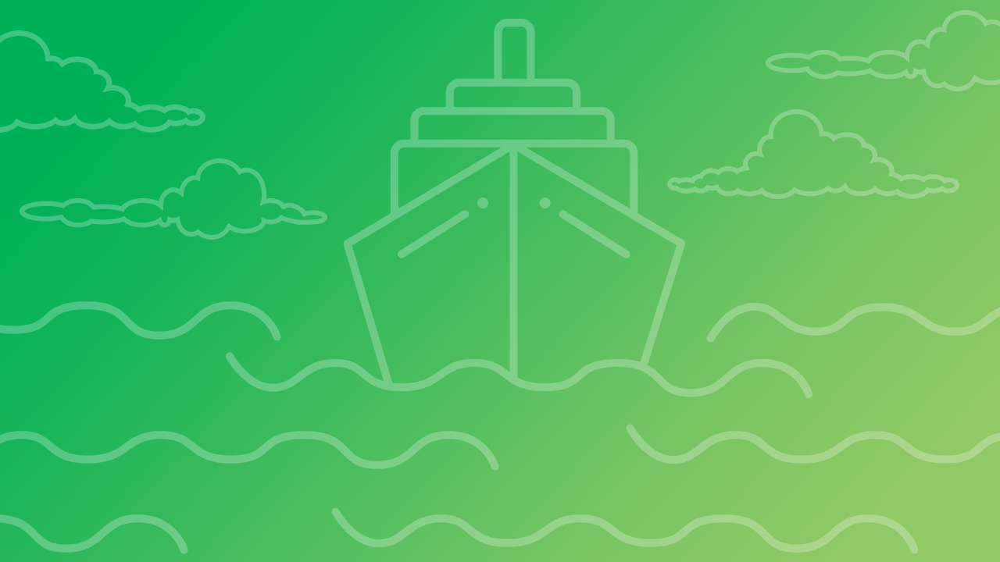

---
author:
  name: Andy Stevens
  email: docs@linode.com
description: 'An introduction to Kubernetes concepts and components.'
keywords: ['kubernetes','k8s','beginner','architecture']
license: '[CC BY-ND 4.0](https://creativecommons.org/licenses/by-nd/4.0)'
published: 2019-07-29
modified_by:
  name: Linode
title: "A Beginner's Guide to Kubernetes"
aliases: ['applications/containers/beginners-guide-to-kubernetes/']
contributor:
  name: Linode
concentrations: ["Kubernetes"]
external_resources:
- '[Kubernetes API Documentation](https://kubernetes.io/docs/reference/generated/kubernetes-api/v1.13/)'
- '[Kubernetes Concepts Documentation](https://kubernetes.io/docs/concepts/)'
---

*Kubernetes*, often referred to as *k8s*, is an open source container orchestration system that helps deploy and manage containerized applications. Developed by Google starting in 2014 and written in the [Go](http://golang.org) language, Kubernetes is quickly becoming the standard way to architect horizontally-scalable applications.

This guide is the parent to the five-part series of Beginner's Guides to Kubernetes:

 - [Beginner's Guide to Kubernetes, Part 1: Introduction](/docs/applications/containers/kubernetes/beginners-guide-to-kubernetes-part-1-introduction/)

 - [Beginner's Guide to Kubernetes, Part 2: Master, Nodes, and the Control Plane](/docs/applications/containers/kubernetes/beginners-guide-to-kubernetes-part-2-master-nodes-control-plane/)

 - [Beginner's Guide to Kubernetes, Part 3: Objects](/docs/applications/containers/kubernetes/beginners-guide-to-kubernetes-part-3-objects/)

 - [Beginner's Guide to Kubernetes, Part 4: Controllers](/docs/applications/containers/kubernetes/beginners-guide-to-kubernetes-part-4-controllers/)

 - [Beginner's Guide to Kubernetes, Part 5: Conclusion](/docs/applications/containers/kubernetes/beginners-guide-to-kubernetes-part-5-conclusion/)