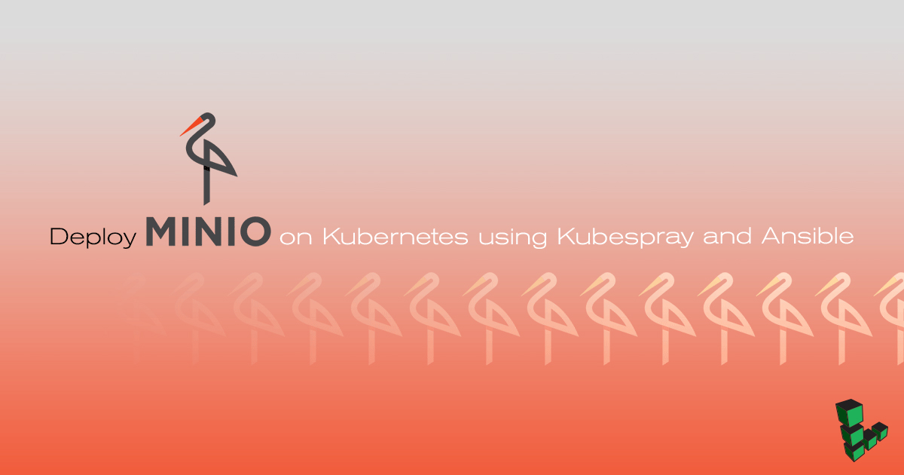
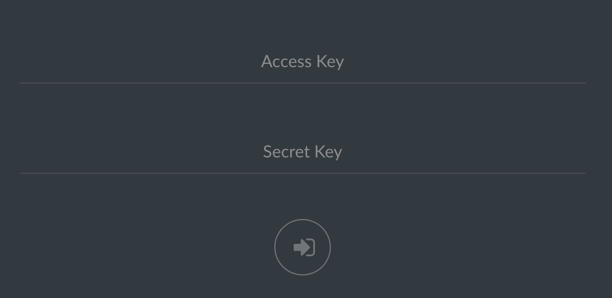
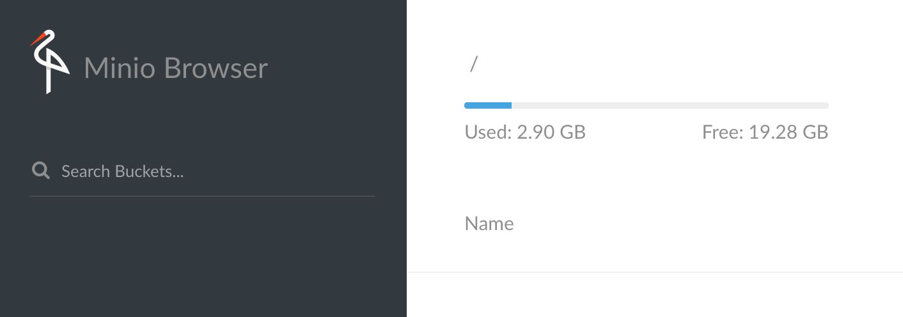

---
author:
  name: Sam Foo
  email: docs@linode.com
description: 'Minio is an open source S3 compatible object store that can be installed on a Kubernetes cluster. Learn how to use a combination of Kubespray and Ansible to provision a cluster and deploy Minio as a private cloud storage.'
og_description: 'Minio is an open source S3 compatible object store that can be installed on a Kubernetes cluster. Learn how to use a combination of Kubespray and Ansible to provision a cluster and deploy Minio as a private cloud storage.'
keywords: ['ansible', 'kubernetes', 'cluster', 's3', 'aws']
license: '[CC BY-ND 4.0](https://creativecommons.org/licenses/by-nd/4.0)'
published: 2018-02-23
modified_by:
  name: Linode
title: 'Deploy Minio on Kubernetes using Kubespray and Ansible'
aliases: ['applications/containers/deploy-minio-on-kubernetes-using-kubespray-and-ansible/']
concentrations: ["Kubernetes"]
external_resources:
- '[Kubernetes](https://kubernetes.io/docs/concepts/overview/what-is-kubernetes/)'
- '[Minio](https://www.minio.io/)'
- '[Kubespray](https://github.com/kubernetes-incubator/kubespray)'
---

## What is Minio?

Minio is an open source, S3 compatible object store that can be hosted on a Linode. Deployment on a Kubernetes cluster is supported in both standalone and distributed modes. This guide uses [Kubespray](https://github.com/kubernetes-incubator/kubespray) to deploy a Kubernetes cluster on three servers running Ubuntu 16.04. Kubespray comes packaged with Ansible playbooks that simplify setup on the cluster. Minio is then installed in standalone mode on the cluster to demonstrate how to create a service.

## Before You Begin

1.  For demonstration purposes, this guide installs `etcd` and the Kubernetes master on the same node. High availability clusters will require a different configuration, which is beyond the scope of this guide.

2.  Each Linode to be used in the cluster should have a user with sudo privileges.

3.  A cluster can be simulated locally using [Minikube](https://github.com/kubernetes/minikube) to get comfortable with Kubernetes clusters.

4.  The IP addresses of each node in the cluster and their roles will be represented as `kubernetes-master-ip`, `etcd-ip`, and `slave-ip`


If you do not want to install Ansible and other software locally, consider using another Linode as a jumpbox that will be used to connect with the master node.


## Install Ansible

1.  Update if needed.

        sudo apt-get update
        sudo apt-get install software-properties-common

2.  Add the Ansible PPA; press enter when prompted.

        sudo apt-add-repository ppa:ansible/ansible

    
 Ansible is a simple IT automation platform that makes your applications and systems easier to deploy. Avoid writing scripts or custom code to deploy and update your applications— automate in a language that approaches plain English, using SSH, with no agents to install on remote systems.

http://ansible.com/
 More info: https://launchpad.net/~ansible/+archive/ubuntu/ansible
Press [ENTER] to continue or ctrl-c to cancel adding it

gpg: keyring `/tmp/tmp81pkp_0b/secring.gpg' created
gpg: keyring `/tmp/tmp81pkp_0b/pubring.gpg' created
gpg: requesting key 7BB9C367 from hkp server keyserver.ubuntu.com
gpg: /tmp/tmp81pkp_0b/trustdb.gpg: trustdb created
gpg: key 7BB9C367: public key "Launchpad PPA for Ansible, Inc." imported
gpg: Total number processed: 1
gpg:               imported: 1  (RSA: 1)
OK


3.  Update again then install Ansible.

        sudo apt-get update
        sudo apt-get install ansible

### Additional Installation
Kubespray exists as a Git repository and requires `python-netaddr` for network address manipulation.

1.  Install Git:

        sudo apt install git

2.  Install `python-netaddr`:

        sudo apt install python-netaddr

## Modify Kubespray Configurations
Kubespray comes with several configuration options not shown in this guide. Refer to the [documentation](https://kubespray.io/documents/) for more information on topics such as networking with Flannel, Helm installation, and large scale deployments.

1.  Clone the Kubespray repository from Github then navigate into the repository.

        git clone https://github.com/kubernetes-incubator/kubespray.git
        cd kubespray

2.  Check out a tag for the desired version of Kubespray. This guide is written for version 2.4.0.

        git checkout -b tag/v.2.4.0

3.  Modify `~/kubespray/ansible.cfg` to run Ansible playbooks on hosts as a given user. Replace `username` with your Unix account username in `remote_user=username` under `[defaults]`.

    
[ssh_connection]
pipelining=True
ssh_args = -o ControlMaster=auto -o ControlPersist=30m -o ConnectionAttempts=100 -o UserKnownHostsFile=/dev/null
#control_path = ~/.ssh/ansible-%%r@%%h:%%p
[defaults]
host_key_checking=False
gathering = smart
fact_caching = jsonfile
fact_caching_connection = /tmp
stdout_callback = skippy
library = ./library
callback_whitelist = profile_tasks
roles_path = roles:$VIRTUAL_ENV/usr/local/share/kubespray/roles:$VIRTUAL_ENV/usr/local/share/ansible/roles:/usr/share/kubespray/roles
deprecation_warnings=False
remote_user=username


4.  Copy the example inventory directory and rename it:

        cp -r inventory/sample inventory/minio

5.  Use Kubespray's inventory generator to build an inventory of hosts for Ansible. Declare the list of IP addresses for each Linode.

        declare -a IPS=(kubernetes-master-ip etcd-ip slave-ip)
        CONFIG_FILE=inventory/minio/hosts.ini python3 contrib/inventory_builder/inventory.py ${IPS[@]}

    
Do not use hostnames when declaring `$IPS`. Only IP addresses are supported by the inventory generator at this time.


6.  Example configuration for the cluster in this guide.

    
[all]
node1    ansible_host=kubernetes-master-ip ip=kubernetes-master-ip
node2    ansible_host=etcd-ip ip=etcd-ip
node3    ansible_host=slave-ip ip=slave-ip

[kube-master]
node1

[kube-node]
node2
node3

[etcd]
node1

[k8s-cluster:children]
kube-node
kube-master

[calico-rr]

[vault]
node1
node2
node3


7.  Uncomment the line `docker_dns_servers_strict: false` in `~/kubernetes/inventory/minio/group_vars/all.yml`

## Prepare Hosts for Ansible
Before Ansible can properly run Kubespray's playbooks, the hosts must have a passwordless sudo user enabled, and swap disabled for Kubernetes. Make sure the specified user exists on each Linode prior to starting these steps. This section shows how to copy SSH keys to each Linode and modify the sudoers file over SSH.

1.  Create a private key if you **do not** have one:

        ssh-keygen -b 4096

2.  Copy your SSH key to each IP listed in the inventory using the `$IPS` variable declared earlier and replace `username` with the username for each of the hosts.

        for IP in ${IPS[@]}; do ssh-copy-id username@$IP; done

### Create Passwordless Sudo on Nodes

Below is a loop that adds the line `username ALL=(ALL:ALL) NOPASSWD: ALL` to the last line of the sudoers file. You will be prompted for the password for each server.

    for IP in ${IPS[@]}; do ssh -t username@$IP "echo 'username ALL=(ALL:ALL) NOPASSWD: ALL' | sudo EDITOR='tee -a' visudo"; done

### Disable swap

Add this snippet below at the end of `~/kubespray/roles/bootstrap-os/tasks/main.yml` to disable swap using Ansible.


- name: Remove swapfile from /etc/fstab
  mount:
    name: swap
    fstype: swap
    state: absent

- name: Disable swap
  command: swapoff -a


## Run Ansible Playbook

Before running the Ansible playbook, make sure firewalls are turned off to avoid unexpected errors.

Run the `cluster.yml` Ansible playbook. If your private key is named differently or located elsewhere, add `--private-key=/path/to/id_rsa` to the end.

    ansible-playbook -i inventory/minio/hosts.ini cluster.yml -b -v


This could take up to 20 minutes.


### Add or Remove Nodes

1.  Navigate into `~/kubespray/inventory/minio/hosts.ini` and add the IP address of the new node.

2.  Run ssh-copy-id to copy your SSH key to the new node:

        ssh-copy-id username@new-node-ip

3.  Run the `scale.yml` Ansible playbook:

        ansible-playbook -i inventory/minio/hosts.ini scale.yml -b -v

4.  SSH into the Kubernetes master node to list all the available nodes:

        kubectl get nodes

5.  To remove a node, simply turn off the server and clean up on the master node with:

        kubectl delete node <ip-of-node>

## Minio on Kubernetes

The commands in this section should be executed from the `kubernetes-master` Linode.

### Create a Persistent Volume

Persistent Volumes(PV) are an abstraction in Kubernetes that represents a unit of storage provisioned in the cluster. A `PersistentVolumeClaim`(PVC) will allow a pod to consume the storage set aside by a PV. This section creates a PV of 15Gi ([gibibytes](https://en.wikipedia.org/wiki/Binary_prefix)) then allow Minio to claim 10Gi of space.

1.  On the Kubernetes master node, create a file called `minio-volume.yaml` with the following YAML below. Replace `username` on the `hostPath` with the appropriate path.

    
kind: PersistentVolume
apiVersion: v1
metadata:
  name: minio-pv-volume
  labels:
    type: local
spec:
  storageClassName: manual
  capacity:
    storage: 15Gi
  accessModes:
    - ReadWriteOnce
  hostPath:
    path: "/home/username"


2.  Create the PV:

        kubectl create -f minio-volume.yaml

3.  Create a PVC with `minio-pvc.yaml`:

    
apiVersion: v1
kind: PersistentVolumeClaim
metadata:
  name: minio-pv-claim
  labels:
    app: minio-storage-claim
spec:
  storageClassName: manual
  accessModes:
    - ReadWriteOnce
  resources:
    requests:
      storage: 10Gi


4.  Create the PVC:

        kubectl create -f minio-pvc.yaml

### Create a Deployment

1.  Create a Deployment configuration in `minio-deployment.yaml` and substitute `username` on the last line. The access and secret key are in the YAML file.

    
apiVersion: apps/v1 #  for k8s versions before 1.9.0 use apps/v1beta2  and before 1.8.0 use extensions/v1beta1
kind: Deployment
metadata:
  # This name uniquely identifies the Deployment
  name: minio-deployment
spec:
  selector:
    matchLabels:
      app: minio
  strategy:
    type: Recreate
  template:
    metadata:
      labels:
        # Label is used as selector in the service.
        app: minio
    spec:
      # Refer to the PVC created earlier
      volumes:
      - name: storage
        persistentVolumeClaim:
          # Name of the PVC created earlier
          claimName: minio-pv-claim
      containers:
      - name: minio
        # Pulls the default Minio image from Docker Hub
        image: minio/minio:latest
        args:
        - server
        - /storage
        env:
        # Minio access key and secret key
        - name: MINIO_ACCESS_KEY
          value: "minio"
        - name: MINIO_SECRET_KEY
          value: "minio123"
        ports:
        - containerPort: 9000
          hostPort: 9000
        # Mount the volume into the pod
        volumeMounts:
        - name: storage # must match the volume name, above
          mountPath: "/home/username"


2.  Create the Deployment.

        kubectl create -f minio-deployment.yaml

### Create a Service

1.  Create a file for the service called `minio-service.yaml`

    
apiVersion: v1
kind: Service
metadata:
  name: minio-service
spec:
  type: LoadBalancer
  ports:
    - port: 9000
      targetPort: 9000
      protocol: TCP
  selector:
    app: minio


2.  Deploy the Minio service:

        kubectl create -f minio-service.yaml

3.  See a list of running services. Under the column `PORT(S)`, you can see that the Minio service is running internally on port 9000, with 30593 exposed externally by the LoadBalancer.

        kubectl get services

    
NAME            TYPE           CLUSTER-IP      EXTERNAL-IP   PORT(S)          AGE
kubernetes      ClusterIP      10.233.0.1      <none>        443/TCP          1d
minio-service   LoadBalancer   10.233.28.163   <pending>     9000:30593/TCP   20m


4.  In a browser, navigate to the public IP address of any of the Linodes in the cluster, at the exposed port (30593 in the example above):

    

5.  Minio has similar functionality to S3: file uploads, creating buckets, and storing other data.

    
