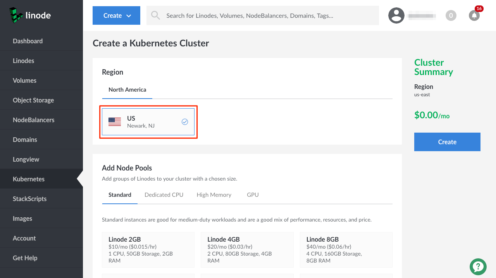

---
author:
  name: Linode Community
  email: docs@linode.com
description: 'How to Support a Static Site with Linode Kubernetes Engine.'
keywords: ['static','site','generator','ss','ssg','lke','kubernetes']
license: '[CC BY-ND 4.0](https://creativecommons.org/licenses/by-nd/4.0)'
published: 2019-08-02
modified: 2019-08-02
modified_by:
  name: Linode
title: "How to Support a Static Site with Linode Kubernetes Engine"
contributor:
  name: Linode
external_resources:
- '[Install and Set Up kubectl](https://kubernetes.io/docs/tasks/tools/install-kubectl/)'
---

Linode Kubernetes Engine (LKE) allows you to easily create, scale, and manage Kubernetes clusters to meet your application's demands, reducing the often complicated cluster set-up process to just a few clicks. Linode manages your Kubernetes master Node, and you select how many Linodes you want to add as worker Nodes to your cluster.

## Scope of this Guide

This guide will show you how to:

- Create a cluster using Linode Kubernetes Engine.
- Connect to a LKE cluster with the `kubectl` command line tool.
- Create a site with Hugo, a static site generator (SSG).
- Containerize the static site using Docker.
- Deploy the container to your LKE cluster.


Following the instructions in this guide will create billable resources on your account in the form of Linodes and NodeBalancers. You will be billed an hourly rate for the time that these resources exist on your account. If you do not wish to continue the use of these resources after you finished the following instructions, be sure to follow the tear-down section at the end of this guide.


## Before You Begin

You should have a working knowledge of Kubernetes' key concepts, including master and worker Nodes, Pods, Deployments, and Services. For more information on Kubernetes, see our [Beginner's Guide to Kubernetes](/docs/applications/containers/beginners-guide-to-kubernetes/).

### Install kubectl

You should have `kubectl` installed on your local workstation. `kubectl` is the command line interface for Kubernetes, and allows you to remotely connect to your Kubernetes cluster to perform tasks. If you don't have `kubectl` installed, follow the below instructions to install it via a package manager.

-  On **Ubuntu** or **Debian**:

        sudo apt-get update && sudo apt-get install -y apt-transport-https
        curl -s https://packages.cloud.google.com/apt/doc/apt-key.gpg | sudo apt-key add -
        echo "deb https://apt.kubernetes.io/ kubernetes-xenial main" | sudo tee -a /etc/apt/sources.list.d/kubernetes.list
        sudo apt-get update
        sudo apt-get install -y kubectl

-  On **CentOS**, **RedHat**, or **Fedora**:

        cat <<EOF > /etc/yum.repos.d/kubernetes.repo
        [kubernetes]
        name=Kubernetes
        baseurl=https://packages.cloud.google.com/yum/repos/kubernetes-el7-x86_64
        enabled=1
        gpgcheck=1
        repo_gpgcheck=1
        gpgkey=https://packages.cloud.google.com/yum/doc/yum-key.gpg https://packages.cloud.google.com/yum/doc/rpm-package-key.gpg
        EOF
        yum install -y kubectl

-  On **macOS**, use [Homebrew](https://brew.sh/):

        brew install kubernetes-cli

-  On **Windows**, use [Chocolatey](https://chocolatey.org/):

        choco install kubernetes-cli

For additional installation instructions, like how to install `kubectl` via `cURL`, visit the [official installation instructions](https://kubernetes.io/docs/tasks/tools/install-kubectl/).

Once you have `kubectl` installed, check its version number by issuing the `version` command:

    kubectl version

You should see output similar to the following:


Client Version: version.Info{Major:"1", Minor:"13", GitVersion:"v1.13.4", GitCommit:"c27b913fddd1a6c480c229191a087698aa92f0b1", GitTreeState:"clean", BuildDate:"2019-03-01T23:34:27Z", GoVersion:"go1.12", Compiler:"gc", Platform:"darwin/amd64"}


Note the `GitVersion`, you will use it to select an appropriate Kubernetes version for your LKE cluster.

### Install Git

To perform some of the commands in this guide you will need to have Git installed on your workstation. Git is a version control system that allows you to save your codebase in various states to ease development and deployment. Follow our How to [Install Git on Linux, Mac or Windows](https://linode.com/docs/development/version-control/how-to-install-git-on-linux-mac-and-windows/) guide for instructions on how to install Git.

### Install Docker



### Sign up for a DockerHub Account

You will use [DockerHub](https://hub.docker.com/) to store your Docker image. If you don't already have a DockerHub account, create one now.

### Install Hugo

A *static site generator* (SSG) is usually a command line tool that takes text files written in a markup language like [Markdown](https://daringfireball.net/projects/markdown/), applys a stylized template to their content, and produces valid HTML, CSS, and JavaScript files. Static sites are prized for their simplicity and speed, as they do not generally have to interact with a database. The Linode documentation website, and this guide, employ Hugo, a powerful and fast SSG written in the Go programming language, but you can choose one that best suits your needs by reading our [How to Choose a Static Site Generator guide](/docs/websites/static-sites/how-to-choose-static-site-generator/). The steps in this guide are generally the same across SSGs: install a static site generator, create some content in a text file, and then generate your site's HTML through a build process.

To download and install Hugo, you can use a package manager.

- For **Debian** and **Ubuntu**:

        sudo apt-get install hugo

- For **Red Hat**, **Fedora**, and **CentOS**:

        sudo dnf install hugo

- For **macOS**, use [Homebrew](https://brew.sh):

        brew install hugo

- For **Windows**, use [Chocolatey](https://chocolatey.org/):

        choco install hugo

For more information on downloading Hugo, you can visit the official [Hugo website](https://gohugo.io/getting-started/installing/).

## Create a Cluster with LKE

1.  In your browser, navigate to the [Linode Cloud Manager](https://cloud.linode.com)

2.  In the left-hand navigation, click on **Kubernetes**.

    

3.  Click on **Create a Cluster**. You will be see the *Create a Kubernetes Cluster* menu.

4.  Under *Region*, select a region for your cluster.

    

5.  The next section is labeled *Add Node Pools*. A Node Pool is a predefined number of worker Nodes of the same plan type that make up the cluster. A cluster must have at least one Node Pool and one Node in that Pool.

    

    Under the Linode types, select the type of Linodes you would like to add to your pool. This guide suggests that you employ 2GB Linodes. Select the number of Linodes you'd like in your pool. This guide suggests you begin with one worker Node.

    When you are done adding Nodes and Node Pools, click the **Add Node Pool** button.

6.  Supply a cluster label in the **Cluster Label** field.

7.  Select a version of Kubernetes from the **Kubernetes** drop-down list. This version should be equal or less than the version of `kubectl` you downloaded. For instance, For instance, if `kubectl` is version `1.15.1`, you can choose a Kubernetes version of `1.13` or `1.14`.

8.  Add any optional tags to the cluster. Tags are used to organize Linode resources and do not impact the performance of the cluster.

9.  Click **Create**.

    

## Connect to your Cluster with kubectl

LKE provides Kubernetes configuration files for each cluster. These files are used to set the *[context](https://kubernetes.io/docs/concepts/configuration/organize-cluster-access-kubeconfig/#context)* of `kubectl`. Contexts give `kubectl` instructions for which Kubernetes cluster it should interact with. Follow the below instructions to download the configuration file for your cluster and set it as the context for `kubectl`.

1.  On the *Kubernets Clusters* page, click on the meatball menu (three dots) to the right of the cluster you just created, and select **Download kubeconfig**. This will prompt a download for a file named `kubeconfig.yaml`.

    

2.  Open a terminal window and execute the following command, being sure to supply the proper path to your `kubeconfig.yaml` file:

        kubectl config --kubeconfig=kubeconfig.yaml use-context kubernetes-admin@kubernetes

    This will set the context to your LKE cluster for the life of the terminal session.

If you are not using Windows, and want to persist the context, follow the next set of instructions.

1.  Navigate to the `$HOME/.kube` directory:

        cd $HOME/.kube

1.  Create a directory called `/configs`. You will use this directory to store your `kubeconfig.yaml` files.

        mkdir configs

3.  Copy your `kubeconfig.yaml` file to the `$HOME/.kube/configs` directory. You can give this file a different name to help distinguish it from other `kubeconfig.yaml` files. In the example below the file has been renamed `static-site.yaml`:

        cp ~/Downloads/kubeconfig.yaml $HOME/.kube/configs/static-site.yaml

4.  Open up your bash profile (`~/.bash_profile`) in the text editor of your choice and add your configuration file to the $KUBECONFIG PATH variable:

        export KUBECONFIG:$KUBECONFIG:$HOME/.kube/config:$HOME/.kube/configs/static-site.yaml

5.  Close your terminal window and open a new window to receive the changes to the `$KUBECONFIG` variable.

6.  Use the `config get-contexts` command to view the available cluster contexts:

        kubectl config get-contexts

    You should see output similar to the following:

    
CURRENT&nbsp;&nbsp;NAME&nbsp;&nbsp;&nbsp;&nbsp;&nbsp;&nbsp;&nbsp;&nbsp;&nbsp;&nbsp;&nbsp;&nbsp;&nbsp;&nbsp;&nbsp;&nbsp;&nbsp;&nbsp;&nbsp;&nbsp;&nbsp;&nbsp;&nbsp;&nbsp;&nbsp;CLUSTER&nbsp;&nbsp;&nbsp;&nbsp;&nbsp;AUTHINFO&nbsp;&nbsp;&nbsp;&nbsp;&nbsp;&nbsp;&nbsp;&nbsp;&nbsp;&nbsp;NAMESPACE
*&nbsp;&nbsp;&nbsp;&nbsp;&nbsp;&nbsp;&nbsp;&nbsp;kubernetes-admin@kubernetes&nbsp;&nbsp;kubernetes&nbsp;&nbsp;kubernetes-admin


1.  If your context is not already selected, (denoted by an asterisk in the "current" column), switch to this context using the `config use-context` command, supplying the full name of the cluster (including the authorized user and the cluster):

        kubectl config use-context kubernetes-admin@kubernetes

    You should see output like the following:

    
Switched to context "kubernetes-admin@kubernetes".


You are now ready to interact with your cluster using `kubectl`. You can test the ability to interact with the cluster by retrieving a list of Pods in the `kube-system` namespace:

    kubectl get pods -n kube-system

You should see output like the following:


NAME&nbsp;&nbsp;&nbsp;&nbsp;&nbsp;&nbsp;&nbsp;&nbsp;&nbsp;&nbsp;&nbsp;&nbsp;&nbsp;&nbsp;&nbsp;&nbsp;&nbsp;&nbsp;&nbsp;&nbsp;&nbsp;&nbsp;READY&nbsp;&nbsp;&nbsp;STATUS&nbsp;&nbsp;&nbsp;RESTARTS&nbsp;&nbsp;&nbsp;AGE
calico-node-sjsd9&nbsp;&nbsp;&nbsp;&nbsp;&nbsp;&nbsp;&nbsp;&nbsp;&nbsp;1/1&nbsp;&nbsp;&nbsp;&nbsp;&nbsp;Running&nbsp;&nbsp;0&nbsp;&nbsp;&nbsp;&nbsp;&nbsp;&nbsp;&nbsp;&nbsp;&nbsp;&nbsp;20h
coredns-86c58d9df4-2m62k&nbsp;&nbsp;0/1&nbsp;&nbsp;&nbsp;&nbsp;&nbsp;Pending&nbsp;&nbsp;0&nbsp;&nbsp;&nbsp;&nbsp;&nbsp;&nbsp;&nbsp;&nbsp;&nbsp;&nbsp;20h
coredns-86c58d9df4-gzspx&nbsp;&nbsp;0/1&nbsp;&nbsp;&nbsp;&nbsp;&nbsp;Pending&nbsp;&nbsp;0&nbsp;&nbsp;&nbsp;&nbsp;&nbsp;&nbsp;&nbsp;&nbsp;&nbsp;&nbsp;20h
csi-linode-controller-0&nbsp;&nbsp;&nbsp;0/3&nbsp;&nbsp;&nbsp;&nbsp;&nbsp;Pending&nbsp;&nbsp;0&nbsp;&nbsp;&nbsp;&nbsp;&nbsp;&nbsp;&nbsp;&nbsp;&nbsp;&nbsp;20h
kube-proxy-gh458&nbsp;&nbsp;&nbsp;&nbsp;&nbsp;&nbsp;&nbsp;&nbsp;&nbsp;&nbsp;1/1&nbsp;&nbsp;&nbsp;&nbsp;&nbsp;Running&nbsp;&nbsp;0&nbsp;&nbsp;&nbsp;&nbsp;&nbsp;&nbsp;&nbsp;&nbsp;&nbsp;&nbsp;20h


## Create a Static Site Using Hugo

In this section you will create a static site using Hugo.

1.  Use Hugo to scaffold a new site. This command will create a new directory with the name you provide, and inside that directory it will create the default Hugo directory structure and configuration files:

        hugo new site lke-example

2.  Move into the new directory:

        cd lke-example

3. Initialize the directory as a Git repository. This will allow you to track changes to your website and save it in version control.

        git init

4.  Hugo allows for custom themes. For the sake of this example, you will install the [Ananke theme](https://github.com/budparr/gohugo-theme-ananke) as a [Git submodule](https://git-scm.com/book/en/v2/Git-Tools-Submodules). Git submodules allow you to include one Git repository within another, each maintaining their own version history. To view a collection of Hugo themes, visit the [Hugo theme collection](https://themes.gohugo.io/).

        git submodule add https://github.com/budparr/gohugo-theme-ananke.git themes/ananke

5.  In the text editor of your choice, open the `config.toml` file and add the following line to the end:

        theme = "ananke"

    This line instructs Hugo to search for a folder named `ananke` in the `themes` directory and applies the templating it finds to the static site.

6.  Add an example first post to your Hugo site:

        hugo new posts/first_post.md

    This will create a Markdown file in the `content/posts/` directory with the name `first_post.md`. You will see output like the following:

    
/Users/linode/k8s/lke/lke-example/content/posts/first_post_again.md created


1.  Open the `first_post.md` file in the text editor of your choosing. You will see a few lines of *[front matter](https://gohugo.io/content-management/front-matter/)*, a format Hugo uses for extensible metadata, at the top of the file:

    
---
title: "First_post"
date: 2019-07-29T14:22:04-04:00
draft: false
---


    Change the `title` to a more desirable value, and change `draft` to `false`. Then, add some example [Markdown text](https://github.com/adam-p/markdown-here/wiki/Markdown-Cheatsheet) to the bottom of the file, like the example below:

    
---
title: "First Post About LKE Clusters"
date: 2019-07-29T14:22:04-04:00
draft: false
---

## LKE Clusters

Linode Kubernetes Engine (LKE) clusters are:

- Fast
- Affordable
- Scalable


1.  You can preview your changes by starting the local Hugo server.

        hugo server

    You should see output like the following:

    
&nbsp;&nbsp;&nbsp;&nbsp;&nbsp;&nbsp;&nbsp;&nbsp;&nbsp;&nbsp;&nbsp;&nbsp;&nbsp;&nbsp;&nbsp;&nbsp;&nbsp;&nbsp;&nbsp;| EN
+------------------+----+
  Pages&nbsp;&nbsp;&nbsp;&nbsp;&nbsp;&nbsp;&nbsp;&nbsp;&nbsp;&nbsp;&nbsp;&nbsp;&nbsp;&nbsp;|  8
  Paginator pages&nbsp;&nbsp;&nbsp;&nbsp;|  0
  Non-page files&nbsp;&nbsp;&nbsp;&nbsp;&nbsp;|  0
  Static files&nbsp;&nbsp;&nbsp;&nbsp;&nbsp;&nbsp;&nbsp;|  3
  Processed images&nbsp;&nbsp;&nbsp;|  0
  Aliases&nbsp;&nbsp;&nbsp;&nbsp;&nbsp;&nbsp;&nbsp;&nbsp;&nbsp;&nbsp;&nbsp;&nbsp;|  0
  Sitemaps&nbsp;&nbsp;&nbsp;&nbsp;&nbsp;&nbsp;&nbsp;&nbsp;&nbsp;&nbsp;&nbsp;|  1
  Cleaned&nbsp;&nbsp;&nbsp;&nbsp;&nbsp;&nbsp;&nbsp;&nbsp;&nbsp;&nbsp;&nbsp;&nbsp;|  0

Total in 6 ms
Watching for changes in /Users/linode/k8s/lke/lke-example/{content,data,layouts,static,themes}
Watching for config changes in /Users/linode/k8s/lke/lke-example/config.toml
Serving pages from memory
Running in Fast Render Mode. For full rebuilds on change: hugo server --disableFastRender
Web Server is available at http://localhost:1313/ (bind address 127.0.0.1)
Press Ctrl+C to stop


    Visit the URL that Hugo is running on. In the above example, the URL is `http://localhost:1313`. This server automatically updates whenever you make a change to a file in the Hugo site directory.

1.  When you are satisfied with your static site, you can generate the HTML, CSS, and JavaScript for your site by *building* the site:

        hugo -v

    Hugo creates the site's files in the `public/` directory. View the files by listing them:

        ls public

1.  Since with the source files you can build the site at any time, it's common practice to keep built files out of a Git repository to keep the size of the repository to a minimum. You can instruct Git to ignore certain files within a repository by adding them to a `.gitignore` file. Add the `public/` directory to your `.gitignore` file to exclude these files from the repository:

        echo 'public/' >> .gitignore

1.  Add and commit the source files to the Git repository:

        git add .
        git commit -m "Initial commit. Includes all of the source files, configuration, and first post."

You are now ready to create a Docker image from the static site you've just created.

## Create a Docker Image and Container

In this section you will create a Docker container for your static site, which you will then run on your LKE cluster, and test its functionality.

1.  Create a file named `Dockerfile` and open it in the text editor of your choosing. This file instructs Docker on how to create the container:

        nano Dockerfile

1.  Add the following contents to the `Dockerfile`. Each command has accompanying comments that describe their function:

    
# Install the latest Debain operating system.
FROM debian:latest as HUGO

# Install Hugo.
RUN apt-get update -y
RUN apt-get install hugo -y

# Copy the contents of the current working directory to the
# static-site directory.
COPY . /static-site

# Command Hugo to build the static site from the source files,
# setting the destination to the public directory.
RUN hugo -v --source=/static-site --destination=/static-site/public

# Install NGINX, remove the default NGINX index.html file, and
# copy the built static site files to the NGINX html directory.
FROM nginx:stable-alpine
RUN mv /usr/share/nginx/html/index.html /usr/share/nginx/html/old-index.html
COPY --from=HUGO /static-site/public/ /usr/share/nginx/html/

# Instruct the container to listen for requests on port 80.
EXPOSE 80


    Save the Dockerfile and return to the command prompt.

1.  Create a file named `.dockerignore`, and add the following lines. This file, similar to the `.gitignore` file you created in the previous section, allows you to ignore certain files within the working directory that you would like to leave out of the container. Because you want the container to be the smallest size possible, the `.dockerignore` file will include the `public/` folder and some hidden folders that Git creates.

    
public/
.git/
.gitmodules/
.gitignore


1.  You are now ready to create a Docker image. If you haven't already created a DockerHub account, sign up for one now.

1.  Run the Docker `build` command. Replace `mydockerhubusername` with your DockerHub username. In the example below, the container image is named `lke-example` and has been given a version tag of `v1`. Feel free to change these values. The period at the end of the command tells Docker to use the current directory as its build context.

        docker build -t mydockerhubusername/lke-example:v1 .

    Docker will download the required Debian and NGINX images, as well as install Hugo into the image. Once complete, you should see output similar to the following:

    
Successfully built 320ae416c940
Successfully tagged mydockerhubusername/lke-example:v1


1.  You can view the image by listing all local images:

        docker images

    
REPOSITORY&nbsp;&nbsp;&nbsp;&nbsp;&nbsp;&nbsp;&nbsp;&nbsp;&nbsp;&nbsp;&nbsp;&nbsp;&nbsp;&nbsp;&nbsp;&nbsp;&nbsp;&nbsp;&nbsp;&nbsp;&nbsp;&nbsp;&nbsp;TAG&nbsp;&nbsp;&nbsp;IMAGE ID&nbsp;&nbsp;&nbsp;&nbsp;&nbsp;&nbsp;&nbsp;CREATED&nbsp;&nbsp;&nbsp;&nbsp;&nbsp;&nbsp;&nbsp;&nbsp;&nbsp;&nbsp;&nbsp;&nbsp;&nbsp;SIZE
mydockerhubusername/lke-example&nbsp;&nbsp;v1&nbsp;&nbsp;&nbsp;&nbsp;320ae416c940&nbsp;&nbsp;&nbsp;About an hour ago&nbsp;&nbsp;&nbsp;20.8MB


1.  You can test your new image by creating a container with it locally. To do so, enter the following `run` command:

        docker run -p 8080:80 -d mydockerhubusername/lke-example:v1

    The `-p` flag instructs Docker to forward port `8080` on localhost to port `80` on the container. The `-d` flag instructs Docker to run in detached mode so that you are returned to the command prompt once the container initializes. Once the container has started, open your browser and navigate to `localhost:8080`. You should see your static site.

2.  You can stop the running container by finding the ID of the container and issuing the `stop` command. To find the ID of the container, use the `ps` command:

        docker ps

    You should see a list of actively running containers, similar to the following:

    
b4a7b959a6c7        mydockerhubusername/lke-example:v1         "nginx -g 'daemon of…"   5 hours ago         Up 5 hours          0.0.0.0:8080->80/tcp        romantic_mahavira


    Note the random string of numbers and letters next to the image name. In the above example, the string is `b4a7b959a6c7`. Issue the `stop` command, supplying the string of numbers and letters:

        docker stop b4a7b959a6c7

1.  Now that you have a working container image, you can push that image to DockerHub. First, log in to DockerHub

        docker login

1.  Next, push the image, with version tag, to DockerHub, using the `push` command:

        docker push mydockerhubusername/lke-example:v1

    You can now view your image on DockerHub as a *repository*. To view all of your repositories, navigate to the [DockerHub repository listing page](https://cloud.docker.com/repository/list).

1.  Lastly, add the `Dockerfile` and `.dockerignore` file to your Git repository:

        git add .
        git commit -m "Add Dockerfile and .dockerignore."

You are now ready to deploy the container to your LKE cluster.

## Deploying the Container to LKE

In this section you will create a Deployment from the container you created in the previous section, and a Service to load balance the deployment.

1.  Begin by navigating to a location outside of your static site directory. You will not need your static site directory for the remainder of this guide.

        cd ..

2.  Create a new directory to house your LKE manifests, and move into that directory.

        mkdir manifests && cd manifests

### Create a Deployment

1.  In the text editor of your choice, create a new [YAML](https://yaml.org/) manifest file for your Deployment. In the following example the file is named  `static-site-deployment.yaml`. Below is an example Deployment manifest file:

    
apiVersion: apps/v1
kind: Deployment
metadata:
  name: static-site-deployment
  labels:
    app: static-site
spec:
  replicas: 3
  selector:
    matchLabels:
      app: static-site
  template:
    metadata:
      labels:
        app: static-site
    spec:
      containers:
      - name: static-site
        image: mydockerhubusername/lke-example:v1
        imagePullPolicy: Always
        ports:
        - containerPort: 80


    - In this example the number of replica Pods is set to `3`. This value can be changed to meet the needs of your website.
    - The `spec.containers.image` field should be changed to match the name of the container image you pushed to DockerHub. Be sure to include the proper version tag at the end of the container name.
    - `imagePullPolicy: Always` ensures that each time a Pod is created, the most recent version of the container image will be pulled from DockerHub.

1.  Once you have a Deployment manifest, you can apply the deployment to the LKE cluster with `kubectl`. Be sure to change `static-site-deployment.yaml` to the name of your static site Deployment manifest:

        kubectl apply -f static-site-deployment.yaml

    You can check on the progress of your Deployment by listing the available pods:

        kubectl get pods

    You should see output like the following if your Deployment was successful:

    
NAME&nbsp;&nbsp;&nbsp;&nbsp;&nbsp;&nbsp;&nbsp;&nbsp;&nbsp;&nbsp;&nbsp;&nbsp;&nbsp;&nbsp;&nbsp;&nbsp;&nbsp;&nbsp;&nbsp;&nbsp;&nbsp;&nbsp;&nbsp;&nbsp;&nbsp;&nbsp;&nbsp;&nbsp;&nbsp;&nbsp;&nbsp;&nbsp;&nbsp;&nbsp;&nbsp;&nbsp;READY&nbsp;&nbsp;&nbsp;STATUS&nbsp;&nbsp;&nbsp;RESTARTS&nbsp;&nbsp;&nbsp;AGE
static-site-deployment-cdb88b5bb-7pbjc&nbsp;&nbsp;1/1&nbsp;&nbsp;&nbsp;&nbsp;&nbsp;Running&nbsp;&nbsp;0&nbsp;&nbsp;&nbsp;&nbsp;&nbsp;&nbsp;&nbsp;&nbsp;&nbsp;&nbsp;1h
static-site-deployment-cdb88b5bb-gx9h5&nbsp;&nbsp;1/1&nbsp;&nbsp;&nbsp;&nbsp;&nbsp;Running&nbsp;&nbsp;0&nbsp;&nbsp;&nbsp;&nbsp;&nbsp;&nbsp;&nbsp;&nbsp;&nbsp;&nbsp;1h
static-site-deployment-cdb88b5bb-lzdvh&nbsp;&nbsp;1/1&nbsp;&nbsp;&nbsp;&nbsp;&nbsp;Running&nbsp;&nbsp;0&nbsp;&nbsp;&nbsp;&nbsp;&nbsp;&nbsp;&nbsp;&nbsp;&nbsp;&nbsp;1h


### Create a Service

1.  Create a Service manifest file to provide load balancing for the deployment. Load balancing ensures that traffic is balanced efficiently across multiple backend Nodes, improving site performance and ensuring that your static site will be accessible should a Node go down. This will trigger the creation of a Linode [NodeBalancer](https://www.linode.com/docs/platform/nodebalancer/getting-started-with-nodebalancers/). The NodeBalancer creation is controlled through the Linode Cloud Controller Manager (CCM). The CCM provides a number of settings, called `annotations`, that allow you to control the functionality of the NodeBalancer. To learn more about the CCM, read our Deploying NodeBalancers with the Linode CCM guide.

    In the following example the Service manifest is named `static-site-service.yaml`.

    
apiVersion: v1
kind: Service
metadata:
  name: static-site-service
  annotations:
    service.beta.kubernetes.io/linode-loadbalancer-throttle: "4"
  labels:
    app: static-site
spec:
  type: LoadBalancer
  ports:
  - name: http
    port: 80
    protocol: TCP
    targetPort: 80
  selector:
    app: static-site
  sessionAffinity: None


1.  Once you've created your Service manifest file, you can apply it to the LKE cluster. Be sure to change `static-site-service.yaml` to the name of your static site Service manifest.

        kubectl apply -f static-site-service.yaml

1.  You can check on the status of your Service by listing the services currently running on your server:

        kubectl get services

    You should see output similar to the following:

    
NAME&nbsp;&nbsp;&nbsp;&nbsp;&nbsp;&nbsp;&nbsp;&nbsp;&nbsp;&nbsp;&nbsp;&nbsp;&nbsp;&nbsp;&nbsp;&nbsp;&nbsp;TYPE&nbsp;&nbsp;&nbsp;&nbsp;&nbsp;&nbsp;&nbsp;&nbsp;&nbsp;&nbsp;CLUSTER-IP&nbsp;&nbsp;&nbsp;&nbsp;&nbsp;EXTERNAL-IP&nbsp;&nbsp;&nbsp;&nbsp;&nbsp;&nbsp;PORT(S)&nbsp;&nbsp;&nbsp;&nbsp;&nbsp;&nbsp;&nbsp;&nbsp;AGE
kubernetes&nbsp;&nbsp;&nbsp;&nbsp;&nbsp;&nbsp;&nbsp;&nbsp;&nbsp;&nbsp;&nbsp;ClusterIP&nbsp;&nbsp;&nbsp;&nbsp;&nbsp;10.128.0.1&nbsp;&nbsp;&nbsp;&nbsp;&nbsp;&lt;none&gt;&nbsp;&nbsp;&nbsp;&nbsp;&nbsp;&nbsp;&nbsp;&nbsp;&nbsp;&nbsp;&nbsp;443/TCP&nbsp;&nbsp;&nbsp;&nbsp;&nbsp;&nbsp;&nbsp;&nbsp;20h
static-site-service&nbsp;&nbsp;LoadBalancer&nbsp;&nbsp;10.128.99.240&nbsp;&nbsp;192.0.2.1&nbsp;&nbsp;&nbsp;&nbsp;&nbsp;&nbsp;&nbsp;&nbsp;80:32648/TCP&nbsp;&nbsp;&nbsp;100m


    Note the external IP address of the Service you created. This is the IP address of the NodeBalancer, and you can use it to view your static site. In the above example, the IP address is `192.0.2.1`. Navigate to the external IP address in the browser of your choice to view your static site.

## Tear Down your LKE Cluster and NodeBalancer.

To remove the NodeBalancer you created, all you need to do is delete the underlying Service:

    kubctl delete service static-site-service

You can also use the manifest file you created to delete the Service:

    kubectl delete -f static-site-service.yaml

To remove the LKE Cluster and the associated Nodes from your account, navigate to the [Linode Cloud Manager](https://cloud.linode.com).

1.  In the lefthand navigation menu, click on **Kubernetes**.

2.  Click on the meatball icon (three dots) next to the cluster you would like to delete, and select **Delete**.

3.  You will be prompted to enter the name of the cluster to confirm the action. Enter the cluster name and click **Delete**.

Lastly, remove the line you added to your bash profile to remove the LKE cluster from your available contexts.