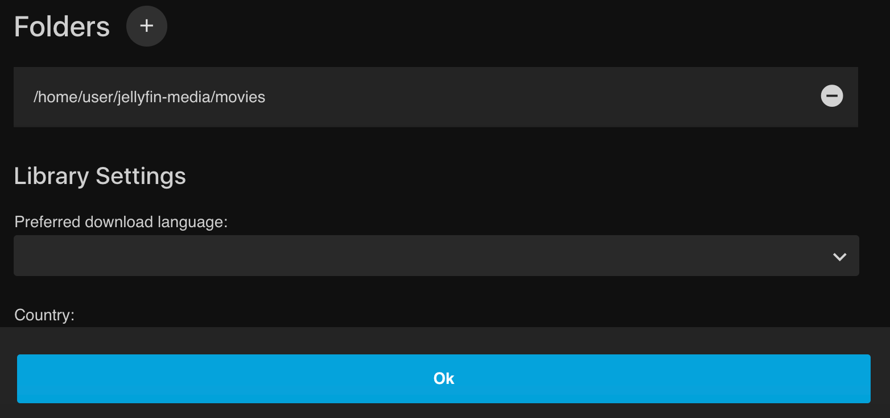
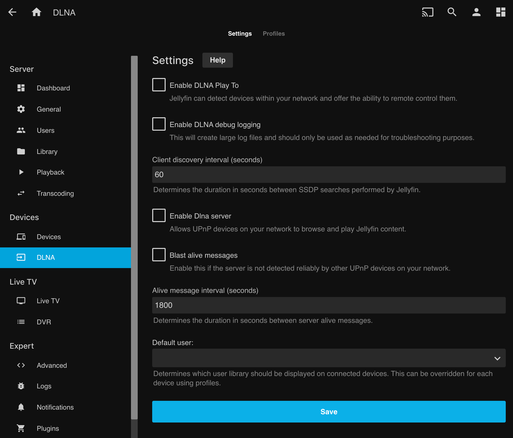
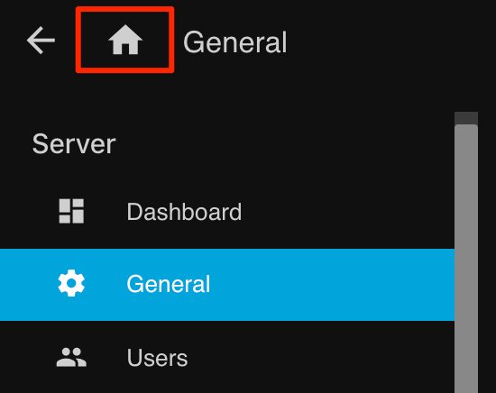

---
author:
  name: The Linux Gamer
description: 'Jellyfin is a Free Software Media System that puts you in control of managing and streaming your media, this guide walks you through installing it on a Linode'
keywords: ["Jellyfin", "Media Server", "PLEX"]
license: '[CC BY-ND 4.0](https://creativecommons.org/licenses/by-nd/4.0)'
modified: 2019-08-07
modified_by:
  name: Linode
published: 2019-08-07
title: How to Install Jellyfin on Linux
---
Jellyfin is an open source media library management and streaming platform, similar to [Plex](https://www.plex.tv/). This document will guide you through the process of installing and configuring **Jellyfin** on your Linode running Ubuntu 18.04.

> **Note** This guide is written for a non-root user. Commands that require elevated privileges are prefixed with `sudo`. If you’re not familiar with the `sudo` command, see the [Users and Groups](https://www.linode.com/docs/tools-reference/linux-users-and-groups/) guide.

## Before you Begin

1. If you have not set up your Linode yet, check out our [Getting Started](https://www.linode.com/docs/getting-started/) guide and complete the steps for setting your Linode’s hostname and timezone.

2. Follow that up with our [Securing Your Server](https://www.linode.com/docs/security/securing-your-server/) guide to create a standard user account with `sudo` privileges.

3. Run the following command to upgrade your packages:

```
sudo apt-get update && sudo apt-get upgrade
```

## Install Jellyfin

1. Install and enable HTTPS transport for APT:

```
sudo apt install apt-transport-https
```

2. Next, enable the Universe repository for all of the `ffmpeg` dependencies:

```
sudo add-apt-repository universe
```

3. Import the GPG signing keys from the Jellyfin team:

```
wget -O - https://repo.jellyfin.org/ubuntu/jellyfin_team.gpg.key | sudo apt-key add -
```

4. Create a new file located at `/etc/apt/sources.list.d/jellyfin.list`

5. Add the Jellyfin `apt` repo to your Linode.

```
echo "deb [arch=$( dpkg --print-architecture )] https://repo.jellyfin.org/ubuntu $( lsb_release -c -s ) main" | sudo tee /etc/apt/sources.list.d/jellyfin.list
```

> Current supported releases are `xenial`, `bionic`, `cosmic`, and `disco`. Since we're using Ubuntu 18.04, you'll want to use `bionic`.

6. Finally, update your packages and install Jellyfin

```
sudo apt update && sudo apt install jellyfin
```

## Configure Jellyfin

Now that Jellyfin's successfully installed, it needs to be configured and pointed to our media.

### Initial Setup

1. Setting up Jellyfin is done through the web interface. Before you can access the web interface, we recommend disconnecting from SSH and creating a secure tunnel via SSH from your local host to your Linode.

```
ssh user@192.0.2.1 -L 8888:localhost:8096
```

> Substitute `user` with the `sudo user` on your Linode, and `192.0.2.1` with your Linode's IP address.

2. Open your browser and navigate to `http://localhost:8888/`. You should now see the Jellyfin first-time configuration screen. Start by selecting your preferred language!


3. Create your user account and password:


4. Now you'll create the directories to store your media on your Linode. Let's say we wanted to have music and movies on our server. We would create a directory to store them by using the following command:

```
cd ~/
sudo mkdir -p jellyfin-media/music && sudo mkdir jellyfin-media/movies
```

1. Now that your account is created, we can add your media. Click on the `Add Media Library` button to begin this process.


> Each kind of content type provides a  different set of options for you to configure, such as where you would like your metadata retrieved from, etc.

2. Content in Jellyfin is organized into Libraries. Libraries can have multiple directories from which they aggregate their media. You can specify directories using the Folders plus `(+)` button. Click on this button now to add the folder you created earlier.


3. In the **Folders**  field, enter the full path to your folder (`/home/username/jellyfin-media/movies`) then hit "Ok."



4. You can add as many libraries as you'd like both now and [later through your dashboard](#add-and-organize-media)
    Click the blue `next` button to proceed to the next sections.

1. Select your preferred metadata Language, then click on the `next` button.

1. Disable port mapping by unchecking the "Enable automatic port mapping" option as this feature can pose a security risk in a cloud environment. Port Mapping is generally enabled in a local environment behind a home router, where you may want your jellyfin server to be able to seamlessly connect to other devices.

1. Once this step is completed and you proceed further. Your setup will be complete and you'll be required to sign in as the user with the password you designated earlier.


### Disable Unneeded Features (Recommended)

[DLNA](https://en.wikipedia.org/wiki/Digital_Living_Network_Alliance) is a protocol that incorporates [Universal Plug and Play](https://en.wikipedia.org/wiki/Universal_Plug_and_Play) (or UPnP) standards for digital media sharing across devices. As port `1900` will be openly available and any DLNA device or application can have full unrestricted access to your content, we recommend disabling DLNA if you won’t be using it.

 Click the "hamburger" menu in the top left corner of Jellyfin, choose "Dashboard," and on the left side of the screen choose "DLNA," then disable and save your DLNA settings.



### Add and Organize Media

- You can add as many libraries as you'd like through the "Dashboard" under "Libraries" at any time.

    

- Media can be added to individual folders from inside your Linode using various [file transfer tools](https://www.linode.com/docs/tools-reference/file-transfer/) and [download methods](https://www.linode.com/docs/tools-reference/tools/download-resources-from-the-command-line-with-wget/). Once files in a folder are added to your Jellyfin server, they can be accessed from your "Home Menu" accessed by clicking on the Home icon at top left of the page after selecting the hamburger menu.

     

## Create a Reverse Proxy for Jellyfin

Jellyfin primarily works as a web frontend for your media. That means you'll generally want to proxy the default Jellyfin websocket to requests. Jellyfin supports a [large number of server software solutions](https://jellyfin.readthedocs.io/en/latest/administrator-docs/reverse-proxy/) for this purpose, though for our example we'll be using [Apache](http://httpd.apache.org/).

1. Install Apache by entering the following command:

        sudo apt install apache2

1. Enable proxy settings for Apache by entering the following commands:

        sudo a2enmod proxy
        sudo a2enmod proxy_http

1. Open a new virtual host file to contain your configuration with. Replace "example.com" in this example with the domain name you'll be using:

        sudo nano /etc/apache2/sites-available/jellyfin.example.com.conf


Though we're using nano in this example, feel free to use a text editor of your choice.


1. Use the following Apache virtual host configuration to create your reverse proxy. Replace `jellyfin.example.com` with your domain/subdomain.


<VirtualHost *:80>
    ServerName jellyfin.example.com
    ErrorLog /var/log/apache2/jellyfin-error.log
    CustomLog /var/log/apache2/jellyfin-access.log combined

    ProxyPreserveHost On

    ProxyPass "/embywebsocket" "ws://127.0.0.1:8096/embywebsocket"
        ProxyPassReverse "/embywebsocket" "ws://127.0.0.1:8096/embywebsocket"

    ProxyPass "/" "http://127.0.0.1:8096/"
        ProxyPassReverse "/" "http://127.0.0.1:8096/"
</VirtualHost>


1. Enable your new website:

        sudo a2ensite jellyfin.example.com.conf

1. Restart Apache to fully enable your settings:

        sudo systemctl restart apache2

You may also want to [set up SSL encryption for this virtual host](https://www.linode.com/docs/quick-answers/websites/secure-http-traffic-certbot/). For more information regarding this configuration, see Jellyfin's [reverse proxy documentation](https://jellyfin.readthedocs.io/en/latest/administrator-docs/reverse-proxy/#apache)
