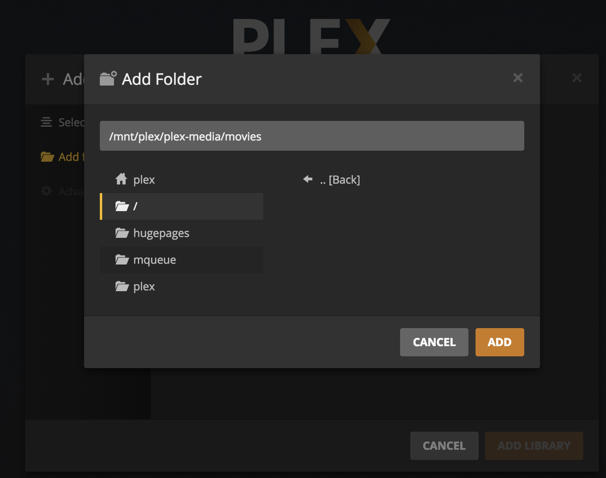

---
author:
  name: Linode
  email: docs@linode.com
description: 'Install Plex Media Server on Ubuntu 18.04 with Salt masterless.'
keywords: ['plex','media','server','ubuntu 18.04','ubuntu','salt','saltstack']
license: '[CC BY-ND 4.0](https://creativecommons.org/licenses/by-nd/4.0)'
published: 2018-11-01
modified: 2018-11-01
modified_by:
  name: Linode
title: "Install Plex Media Server on Ubuntu 18.04 with Salt Masterless"
contributor:
  name: Linode
external_resources:
  - '[Salt Masterless Walkthough](https://docs.saltstack.com/en/latest/topics/tutorials/quickstart.html)'
  - '[Salt Fileserver Backend Walthrough](https://docs.saltstack.com/en/latest/topics/tutorials/gitfs.html)'
  - '[Plex Media Server Quick State](https://support.plex.tv/articles/200264746-quick-start-step-by-step-guides/)'
---

Plex is a media server that allows you to stream video and audio content you own to many different types of devices. In this guide you will use a masterless Salt minion to set up a Plex server, and then you will learn how to connect to that server to stream content to your devices.

## Before You Begin

1.  Familiarize yourself with our [Getting Started](/docs/getting-started/) guide and complete the steps for setting your Linode's hostname and timezone.

2.  Update your system:

        sudo apt-get update && sudo apt-get upgrade

3.  Plex requires an account to use their service. Visit the [Plex website](https://www.plex.tv/) to sign up for an account if you do not already have one.

## Prepare the Salt Minion

1.  On your Linode, create the `/srv/salt` and `/srv/pillar` directories. These are where the Salt state files and Pillar files will be housed.

        mkdir /srv/salt && mkdir /srv/pillar

1.  Install `salt-minion` via the Salt boostrap script:

        curl -L https://bootstrap.saltstack.com -o bootstrap_salt.sh
        sudo sh bootstrap_salt.sh

1.  The Salt minion will use a Salt formula to set up Plex. In order to use this Salt formula you will need GitPython installed. Install GitPython:

        sudo apt-get install python-git

## Modify the Salt Minion Configuration

1.  Because the Salt minion is running in masterless mode, you will need to modify the minion configuration file (`/etc/salt/minion`) to instruct Salt to look for state files locally. Open the minion configuration file in a text editor, uncomment the line `#file_client: remote`, and set it to `local`:

    
...

# Set the file client. The client defaults to looking on the master server for
# files, but can be directed to look at the local file directory setting
# defined below by setting it to "local". Setting a local file_client runs the
# minion in masterless mode.
file_client: local

...


1.  There are some configuration values that do not normally exist in `/etc/salt/minion` that you will need to add in order to run your minion in masterless mode. Copy the following lines into the end of `/etc/salt/minion`:

    
...

fileserver_backend:
  - roots
  - gitfs

gitfs_remotes:
  - https://github.com/saltstack-formulas/plex-formula.git

gitfs_provider: gitpython


    The `fileserver_backend` block instructs the Salt minion to look for Salt configuration files in two places. First, it tells Salt to look for Salt state files in our minion's document `roots` (`/srv/salt`). Secondly, it instructs Salt to use the Git Fileserver (gitfs) to look for Salt configuration files in any git remote repositories that have been named in the `gitfs_remotes` section. The address for the Plex Salt formula's git repository is included in the `gitfs_remotes` section.

    
It is best practice to create a fork of the Plex formula's git repository on GitHub and put your fork's git repository address in the `gitfs_remotes` section. This will ensure that any further changes to the upstream Plex formula that might break your current configuration can be reviewed and handled accordingly, before applying them.


    Lastly, GitPython is specified as the `gitfs_provider`.

## Create the Salt State Tree

1.  Create a Salt state top file at `/srv/salt/top.sls` and copy in the following configuration:

    
base:
  '*':
    - plex
    - directory


    This file tells Salt to look for state files in the plex folder of the Plex formula's git repository, and for a state file named `directory.sls`, which we will create in the next step.

1.  Create the `directory.sls` file in `/srv/salt`:

    
/home/plex:
  file.directory

/home/plex/plex-media:
  file.directory

/home/plex/plex-media/movies:
  file.directory

/home/plex/plex-media/television:
  file.directory


    The folders that are created during this step are for organizational purposes, and will house your media. The location is up to you. If at you wish to add more directories, perhaps one for your music media, you can do so here.

1.  Go to the [Plex Media Server download page](https://www.plex.tv/media-server-downloads/#plex-media-server) and note the most recent version of their Linux distribution. At the time of writing, the most recent version is `1.13.9.5456-ecd600442`. Create the `plex.sls` Pillar file in `/srv/pillar`, changing the version number as necessary:

    
plex:
  version: 1.13.9.5456-ecd600442


1.  Create the Salt Pillar top file in `/srv/pillar`:

    
base:
  '*':
    - plex


    This file will instruct Salt to look for the `plex.sls` Pillar file you created in the previous step.

1.  Apply your Salt state locally using `salt-call`:

        salt-call --local state.apply

    You should see a list of the changes Salt applied to your system. You have successfully installed Plex using Salt.

## Setup Plex

### Initial Configuration

1.  To connect to Plex's web UI you'll need to create an SSH tunnel. Run the following command, replacing `<your_ip_address>` with your Plex server's IP address.:

        ssh root@<your_ip_address> -L 8888:localhost:32400

2.  In a browser, navigate to `http://localhost:8888/web/`.

3.  Sign in with your Plex username and password.

4.  Name your media server. This example uses the name `linode-plex`. Be sure to check the box that reads **Allow me to access my media outside my home** and then click **Next**.

    

### Organize Your Media

1.  Click on the `Add Library` button:

    

2.  Select *Movies* and click **Next**:

    

3.  Click **Browse for Media Folder** and select the appropriate folder at `/home/plex/plex-media/movies`. Then click **Add**:

    

4.  Repeat the process to add your 'Television' folder.

5.  When you are done adding libraries, click **Next**.

6.  Click on **Get Plex Apps** to download the appropriate Plex client for your device. Then click **Done**.

    

7.  In the future you can add more libraries by hovering over the menu and clicking the plus sign (+) next to 'Libraries'.

    

### Disable DLNA (Recommended)

[DLNA](https://en.wikipedia.org/wiki/Digital_Living_Network_Alliance) is a protocol that incorporates [Universal Plug and Play](https://en.wikipedia.org/wiki/Universal_Plug_and_Play) (or UPnP) standards for digital media sharing across devices. If you do not wish to make use of it, it’s recommended that you disable this feature, as it is openly connectable on port `1900`. From the Plex web interface, click the wrench icon in the upper right corner, and navigate to the **DLNA** section under *Settings*. Uncheck 'Enable the DLNA server', and click **Save Changes**:

## Connect to Your Plex Server

1. Visit the [Plex Apps](https://www.plex.tv/media-server-downloads/#plex-app) download page or the app store on your device to download Plex Media Player if you have not already done so.

1.  Open your Plex app. The example provided here will use the Plex Media Player for MacOS.

1.  Sign in to Plex.

1.  On the left there's a dropdown menu where you can select your server by the name you chose. Select your server.

    

2.  You are now able to stream your content with Plex.

    