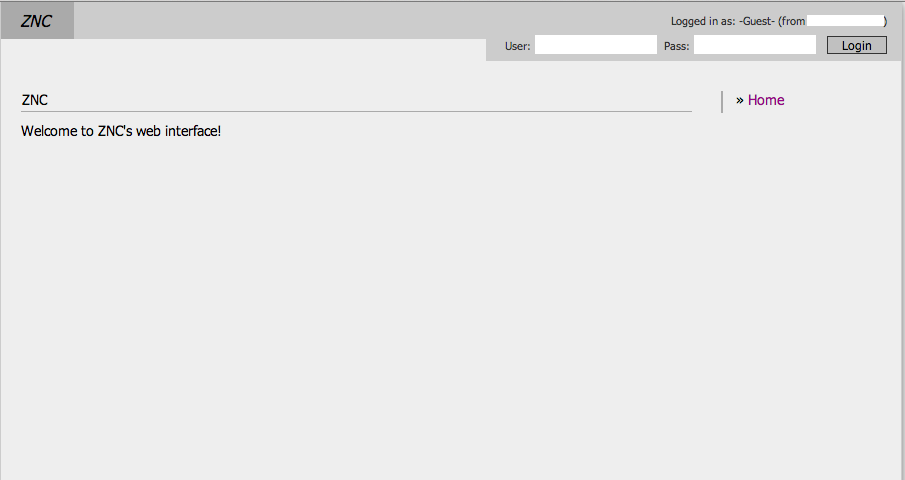
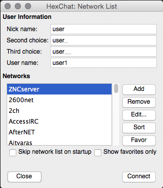
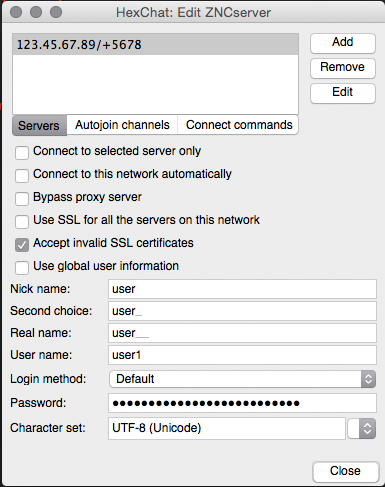
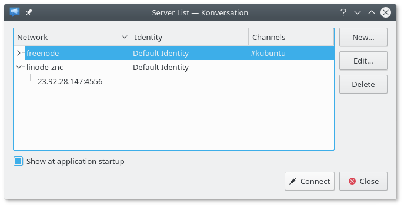
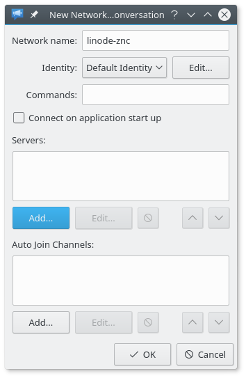
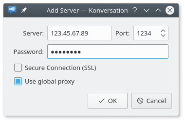

---
author:
    name: Alex Fornuto
    email: docs@linode.com
description: 'Install the ZNC bouncer on Debian to retain an IRC connection.'
keywords: ["install znc", "irc bouncer", "znc on debian", "configure znc", "znc"]
tags: ["debian"]
license: '[CC BY-ND 4.0](https://creativecommons.org/licenses/by-nd/4.0)'
modified: 2015-06-04
modified_by:
    name: 'Elle Krout'
published: 2014-08-21
title: 'Install ZNC from Source on Debian'
---

ZNC is an IRC bouncer. It's designed to run on a server that remains connected to an IRC network and buffer messages. With ZNC, a local IRC client can connect and disconnect without losing a chat session or missing any messages. In this guide, ZNC will be installed from source and then configured.


This guide is written for a non-root user. Commands that require elevated privileges are prefixed with `sudo`. If you're not familiar with the `sudo` command, check our [Users and Groups](/docs/tools-reference/linux-users-and-groups/) guide.


## Before You Begin

1.  Make sure the system is up to date:

        sudo apt-get update && sudo apt-get upgrade -y

2.  Install the `build-essential` and `checkinstall` packages:

        sudo apt-get install build-essential checkinstall

3.  If you want to use SSL encryption to connect to the web interface (recommended), install `libssl-dev`:

        sudo apt-get install libssl-dev

## Install ZNC

1.  Download the latest version of ZNC (1.6.0 at the time of writing):

        wget http://znc.in/releases/znc-1.6.0.tar.gz

2.  Expand the archive file:

        tar -xvf znc-1.*.tar.gz

3.  Move into the ZNC directory:

        cd znc-1.6.0

4.  Run the `configure` script to make sure the Linode has all the needed prerequisites:

        ./configure

    If not, you will need to install any missing packages prior to continuing.

5.  Install ZNC:

        make
        sudo checkinstall --fstrans=0 make install

    
The program `checkinstall` creates a `.deb` package which you can use to reinstall this version of ZNC in the future. It has its own set of options to review. If you prefer, you can instead run `sudo make install` to install ZNC as is.


## Configure ZNC

1.  Begin the configuration process:

        znc --makeconf

2.  This will launch an interactive script asking you for input on a variety of parameters. Below is an example output of the `makeconf` script with standard options selected. To match your needs, you can use or change the provided input at your discretion. If you're not sure, use the default option. Many of these options can be adjusted later through the web interface.

    
Make sure to change the `username` variable.


        [ .. ] Checking for list of available modules...
        [ >> ] ok
        [ ** ] Building new config
        [ ** ]
        [ ** ] First let's start with some global settings...
        [ ** ]
        [ ?? ] What port would you like ZNC to listen on? (1025 to 65535): 5678
        [ ?? ] Would you like ZNC to listen using SSL? (yes/no) [no]: yes
        [ ?? ] Would you like ZNC to listen using both IPv4 and IPv6? (yes/no) [yes]:
        [ .. ] Verifying the listener...
        [ >> ] ok
        [ ** ]
        [ ** ] -- Global Modules --
        [ ** ]
        [ ** ] +-----------+----------------------------------------------------------+
        [ ** ] | Name      | Description                                              |
        [ ** ] +-----------+----------------------------------------------------------+
        [ ** ] | partyline | Internal channels and queries for users connected to znc |
        [ ** ] | webadmin  | Web based administration module                          |
        [ ** ] +-----------+----------------------------------------------------------+
        [ ** ] And 9 other (uncommon) modules. You can enable those later.
        [ ** ]
        [ ?? ] Load global module <partyline>? (yes/no) [no]:
        [ ?? ] Load global module <webadmin>? (yes/no) [no]: yes
        [ ** ]
        [ ** ] Now we need to set up a user...
        [ ** ]
        [ ?? ] Username (AlphaNumeric): user
        [ ?? ] Enter Password:
        [ ?? ] Confirm Password:
        [ ?? ] Would you like this user to be an admin? (yes/no) [yes]:
        [ ?? ] Nick [user]: user
        [ ?? ] Alt Nick [user_]:
        [ ?? ] Ident [user]:
        [ ?? ] Real Name [Got ZNC?]:
        [ ?? ] Bind Host (optional):
        [ ** ] Enabled user modules [chansaver, controlpanel]
        [ ** ]
        [ ?? ] Set up a network? (yes/no) [yes]:
        [ ** ]
        [ ** ] -- Network settings --
        [ ** ]
        [ ?? ] Name [freenode]:
        [ ?? ] Server host [chat.freenode.net]:
        [ ?? ] Server uses SSL? (yes/no) [yes]:
        [ ?? ] Server port (1 to 65535) [6697]:
        [ ?? ] Server password (probably empty):
        [ ?? ] Initial channels:
        [ ** ] Enabled network modules [simple_away]
        [ ** ]
        [ .. ] Writing config [/home/elle/.znc/configs/znc.conf]...
        [ >> ] ok
        [ ** ]
        [ ** ] To connect to this ZNC you need to connect to it as your IRC server
        [ ** ] using the port that you supplied.  You have to supply your login info
        [ ** ] as the IRC server password like this: user/network:pass.
        [ ** ]
        [ ** ] Try something like this in your IRC client...
        [ ** ] /server <znc_server_ip> +5678 user:<pass>
        [ ** ]
        [ ** ] To manage settings, users and networks, point your web browser to
        [ ** ] https://<znc_server_ip>:5678/
        [ ** ]
        [ ?? ] Launch ZNC now? (yes/no) [yes]:
        [ .. ] Opening config [/home/elle/.znc/configs/znc.conf]...
        [ >> ] ok
        [ .. ] Loading global module [webadmin]...
        [ >> ] [/usr/local/lib/znc/webadmin.so]
        [ .. ] Binding to port [+5678]...
        [ >> ] ok
        [ ** ] Loading user [user]
        [ ** ] Loading network [freenode]
        [ .. ] Loading network module [simple_away]...
        [ >> ] [/usr/local/lib/znc/simple_away.so]
        [ .. ] Adding server [chat.freenode.net +6697 ]...
        [ >> ] ok
        [ .. ] Loading user module [chansaver]...
        [ >> ] ok
        [ .. ] Loading user module [controlpanel]...
        [ >> ] ok
        [ .. ] Forking into the background...
        [ >> ] [pid: 27369]
        [ ** ] ZNC - 1.6.0 - http://znc.in

    Once you've completed the configuration and launched ZNC, you can access the web interface by going to your Linode's IP address in your web browser. Be sure to specify the port you defined during the configuration script and prefix it with `https://` .

    
If the [Firewall portion](/docs/security/securing-your-server#configure-a-firewall) of the [Securing Your Server](/docs/securing-your-server/) guide has been completed, add a line to `/etc/iptables.firewall.rules` allowing traffic to your IRC port.


    

## Connect to The Client

### HexChat ###

You can use any preferred GUI or CLI client to connect to ZNC. For the example below, we'll be using [HexChat](https://hexchat.github.io/index.html).

1.  Open HexChat, add your desired nicknames, and then create a new network. In this example, the network is called **ZNCserver**:

    

2.  With **ZNCserver** selected, click `Edit...`.

3.  Add your server's IP address and port to the list. If not using a signed certificate, select *Accept invalid SSL certificated*. Input your password:

    

    Close the window when done.

3.  Press **Connect**. You should be connected to your ZNC server and from there to any networks and channels you've configured to autojoin.

### Konversation ###

1. Open Konversation, click 'New...'

    

2. Enter a name for the new network. For this example the network is **linode-znc**. Then click 'Add...' to open the dialog to add the server.

    

3. Now enter your network details such as IP Address, Port number, and password.

    

## SSL Encryption with a Signed Certificate (Optional)

If you would like to use a signed certificate to encrypt your connection to ZNC, you can do so by adding your key and certificate to the `znc.pem` file:

    cat domain.key domain.crt > znc.pem
