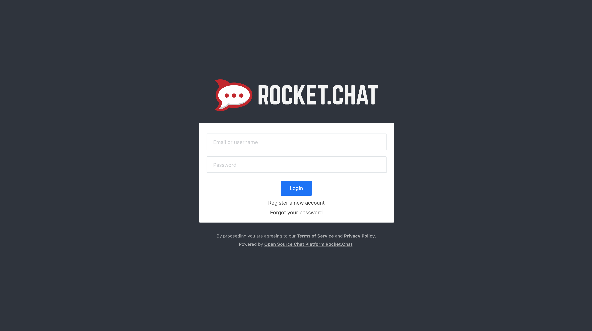

---
author:
  name: Linode
  email: docs@linode.com
description: 'Installation and basic usage guide for Rocket.Chat, a lightweight XMPP server on Ubuntu 12.04 (Lucid).'
keywords: ["rocket.chat", "slack", "chat"]
license: '[CC BY-ND 4.0](https://creativecommons.org/licenses/by-nd/4.0)'
aliases: ['communications/xmpp/prosody/ubuntu-12-04-precise-pangolin/']
modified: 2018-06-19
modified_by:
  name: Linode
published: 2018-06-19
title: 'Installing Rocket.Chat on Ubuntu 16.04'
external_resources:
 - '[Deploying Rocket.Chat on Ubuntu](https://rocket.chat/docs/installation/manual-installation/ubuntu/)'
 - '[NGINX Reverse Proxy – NGINX](https://docs.nginx.com/nginx/admin-guide/web-server/reverse-proxy/)'
 - '[Configuring SSL Reversae Proxy](https://rocket.chat/docs/installation/manual-installation/configuring-ssl-reverse-proxy/)'
 - '[Configuring HTTPS Servers](http://nginx.org/en/docs/http/configuring_https_servers.html)'
---

**Rocket.Chat** is the open-source chat software alternative to Slack that ships with the feature rich components users have come to expect for team productivity. You can chat with your team members, make video and audio calls with screen sharing, create channels and private groups, upload files and much more. With Rocket.Chat's source code hosted on github, you can develop new features and contribute back to the project.

This guide will provide the steps to deploy Rocket.Chat on a Linode running Ubuntu 16.04 LTS and use NGINX as a reverse proxy with SSL.

## Before You Begin

1. Familiarize yourself with our [Getting Started](/docs/getting-started/) guide and complete the steps for setting your Linode’s hostname and timezone.

1. This guide will use sudo wherever possible. Complete the sections of our [Securing Your Server](/docs/security/securing-your-server/) to create a standard user account, harden SSH access and remove unnecessary network services.

1. Complete the [Add DNS Records] (/docs/websites/set-up-web-server-host-website/#add-dns-records) steps to register a domain name that will point to your Rocket.Chat server instance.

1. Ensure your system is up to date:

        sudo apt-get update && sudo apt-get upgrade

## Installing Rocket.Chat

The quickest way to install Rocket.Chat is to use its Snap.  Snaps are containerised software packages that run on all major Linux systems. Snapd is the service that runs and manages snaps. Snapd is installed by default on Ubunt 16.04 LTS.

1. Install Rocket.Chat

        sudo snap install rocketchat-server

    When you install the Rocket.chat server the service will automatically start. To check if Rocket.Chat is actually running:

        sudo service snap.rocketchat-server.rocketchat-server status

    Visit the [Rocket.Chat snaps](https://rocket.chat/docs/installation/manual-installation/ubuntu/snaps/) documentation to view a list of other useful commands.

## Install and Configure NGINX to use Reverse Proxy and SSL
A reverse proxy is a server that sits between internal applications and external clients, forwarding client requests to the appropriate server. While many common applications are able to function as servers on their own, NGINX has a number of advanced load balancing, security, and acceleration features that most specialized applications lack. Using NGINX as a reverse proxy enables you to add these features to any application.  We will use NGINX as a reverse proxy for Rocket.Chat.



**Setup NGINX Reverse Proxy**

1. Create a configuraiton file for Rocket.Chat. In this example the file has been named `rocketchat.conf`:

        touch etc/nginx/conf.d/rocketchat.conf

1. Disable the default *Welcome to NGINX* page:

        sudo mv /etc/nginx/conf.d/default.conf /etc/nginx/conf.d/default.conf.disabled

1. You will edit `rocketchat.conf` to contain the necessary values to point to your domain name and to add the reverse proxy. Ensure you replace `example.com` with your domain name:

    
server {
    listen 80;

    server_name example.com;

    location / {
        proxy_pass http://localhost:3000/;
    }
}


1. Test the configuration:

        sudo nginx -t

1.  If no errors are reported, reload the new configuration:

        sudo nginx -s reload

## Generate SSL certificates using Certbot

1. Generate SSL certificates for your Linode by using the official [Certbot Documentation](https://certbot.eff.org/) site. Be sure to select `NGINX` as the Software and `Ubuntu 16.04 (Xenial)` as the System. The Certbot documentation commands will be run on your Linode.  Follow the prompts to choose which domains will be covered by the new certificate.

    During the prompts you will be asked for:

    * An email address
    * Agreement to Certbot's terms of service
    * Which domains to use HTTPS for (it detects the list using server_name lines in your Nginx config)
    * Whether to redirect HTTP to HTTPS (recommended) or not

1. Configure the `rocketchat.conf` file for SSL.

    Update the listening socket to `443`, add the `ssl` parameter and the location of the SSL server certificate and private key.  Ensure you replace example.com with your domain name:

    
server {
    listen       443 ssl;
    server_name  example.com;

    error_log /var/log/nginx/rocketchat.access.log;

    ssl_certificate /etc/letsencrypt/live/example.com/fullchain.pem;
    ssl_certificate_key /etc/letsencrypt/live/example.com/privkey.pem;
    ssl_protocols TLSv1 TLSv1.1 TLSv1.2;

    location / {
        proxy_pass http://localhost:3000/;
    }
}


1. Add two new server blocks for domain redirection to the top of the `rocketchat.conf` file. The first block will redirect `http` to `https`, the second will redirect `https:\\www.example.com` to `https:\\example.com`.  The third block will remain unchanged and is the block that will actually handle requests.

    
server {
    server_name www.docteamdemosite.club docteamdemosite.club;
    return 301 https://docteamdemosite.club$request_uri;
}

server {
    listen 443 ssl;
    ssl_certificate /etc/letsencrypt/live/docteamdemosite.club/fullchain.pem;
    ssl_certificate_key /etc/letsencrypt/live/docteamdemosite.club/privkey.pem;
    server_name www.docteamdemosite.club;
    return 301 https://docteamdemosite.club$request_uri;
}


1. Test the configuration:

        sudo nginx -t

1.  If no errors are reported, reload the new configuration:

        sudo nginx -s reload

1.  In a browser, navigate to your domain address. Follow the Rocket.Chat setup wizard steps.

