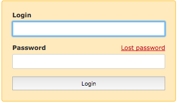
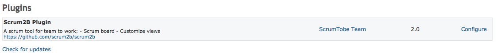

---
author:
  name: Linode
  email: docs@linode.com
description: 'This guide shows how to install and set up Redmine, a free and open-source project management web application, written using Ruby on Rails, that is cross-platform and cross-database.'
og_description: 'This guide shows how to install and set up Redmine, a free and open-source project management web application, written using Ruby on Rails, that is cross-platform and cross-database.'
keywords: ["nginx", "ubuntu", "redmine"]
license: '[CC BY-ND 4.0](https://creativecommons.org/licenses/by-nd/4.0)'
published: 2017-09-14
modified: 2018-08-16
modified_by:
  name: Andrew Lescher
title: 'How to Install and Configure Redmine on Ubuntu 18.04'
external_resources:
- '[Redmine Official Docs](https://www.redmine.org/guide/)'
- '[Redmine Users Guide](https://www.redmine.org/projects/redmine/wiki/Getting_Started)'
- "[Andrew Hosch's Guide on Redmine](http://www.untrustedconnection.com/2016/04/redmine-passenger-and-nginx-on-ubuntu.html)"
---


## What is Redmine?

Redmine is a project management web app that allows users to manage projects flexibly while offering robust tracking tools and an extensive library of plug-ins. This free and open source solution offers an alternative to paid project management tools and includes support for wikis, forums, calendars, and data visualization tools.

This guide will show you how to install and set up Redmine on Ubuntu 18.04 through the Passenger application server connected to NGINX.

### Before You Begin


The steps in this guide require root privileges. Be sure to run the steps below as `root` or with the `sudo` prefix. For more information on privileges, see our [Users and Groups](/docs/tools-reference/linux-users-and-groups) guide.


## Prepare Environment And Install Dependencies

1. Update & upgrade the system packages.

```
sudo apt udate && sudo apt upgrade -y
```

2. Install Redmine dependencies.

```
sudo apt install mysql-server libmysqlclient-dev git-core subversion imagemagick libmagickwand-dev libcurl4-openssl-dev -y
```

### Configure MySQL

MySQL needs to be configured so that Redmine can store data. You can log in to the root account of your database using the password that you set when you installed `mysql-server`.

1. If this is the first instance of MySQL installed on your machine, run the *mysql_secure_installation* script to perform all necessary configuration tasks. Follow the prompts for creating a MySQL root user password based on your security preferences and hit the **y + Enter** keys for the remaining prompts.

```
sudo mysql_secure_installation
```

2. Configure the Redmine database.

Log into MySQL with the root user and supply the password you set in the previous step when prompted.

```
mysql -u root -p
```

3.  After logging in, create a new database and database user. Enter a strong password resembling the example given below, and copy/paste it to your local machine for later recall.


CREATE DATABASE redmine;
CREATE USER 'redmine'@'localhost' IDENTIFIED BY 'de17f550d35b897fc742f3dd3c5755df';
GRANT ALL PRIVILEGES ON redmine.* TO 'redmine'@'localhost';
FLUSH PRIVILEGES;
quit;


### Install Ruby

Redmine requires Ruby to run. Use the Ruby Version Manager (RVM) to install Ruby 2.5.1.

1. Retrieve the latest version of RVM using a downloadable installation script.

Import the project keys.

```
sudo apt install gnupg2
gpg2 --keyserver hkp://keys.gnupg.net --recv-keys 409B6B1796C275462A1703113804BB82D39DC0E3 7D2BAF1CF37B13E2069D6956105BD0E739499BDB
```

Navigate to the `/tmp` folder to download the RVM script.

```
cd /tmp
```

Use the `curl` command to retrieve the RVM installation script. Pipe the script into bash to take advantage of the interactive shell option.

```
curl -sSL https://get.rvm.io -o rvm.sh
cat /tmp/rvm.sh | bash -s stable --rails
```

2. Users of RVM must be in the `rvm` group. Create this group, add a user, log out, and log back in by replacing **your_username** with your limited-account username.

```
sudo groupadd rvm
sudo usermod -aG rvm username
exit
su your_username
```

Source the RVM scripts from the installation directory, found in your `/home/username` folder. Replace *username* with your limited-account username.

```
source /home/username/.rvm/scripts/rvm
```

3. For users wanting to install a specific version of Ruby, the following command will list available instances.

```
rvm list known
```

4. To install the latest available version of Ruby (version 2.5.1 as of this publication date), the following command should be issued.

```
rvm install ruby
```

### Install Passenger and NGINX

[Passenger](https://github.com/phusion/passenger) is an application server that runs your web application then communicates with the web server. The project has well-written [documentation](https://www.phusionpassenger.com/library/install/nginx/install/oss/bionic/) on installing Passenger and NGINX on Ubuntu 18.04 with an apt repository.

1.  Install the Passenger PGP key and HTTPS support for the package manager:

```
sudo apt-key adv --keyserver hkp://keyserver.ubuntu.com:80 --recv-keys 561F9B9CAC40B2F7
sudo apt install apt-transport-https ca-certificates -y
```

2.  Add the Passenger APT repository:

```
sudo sh -c 'echo deb https://oss-binaries.phusionpassenger.com/apt/passenger bionic main > /etc/apt/sources.list.d/passenger.list'
sudo apt update -y
```

3.  Install Passenger and NGINX

```
sudo apt install -y libnginx-mod-http-passenger nginx-extras passenger
```

4. Enable the Passenger NGINX module and restart NGINX.

```
if [ ! -f /etc/nginx/modules-enabled/50-mod-http-passenger.conf ]; then sudo ln -s /usr/share/nginx/modules-available/mod-http-passenger.load /etc/nginx/modules-enabled/50-mod-http-passenger.conf ; fi
sudo systemctl restart nginx
sudo ls /etc/nginx/conf.d/mod-http-passenger.conf
```

If the output of the final command does not read `/etc/nginx/conf.d/mod-http-passenger.conf`, you must create the file and then set the configuration options manually via the following command:

 Due to restrictive directory permissions, you must switch to the root user account in order to perform the following command. 

```
echo -ne 'passenger_root /usr/lib/ruby/vendor_ruby/phusion_passenger/locations.ini;\npassenger_ruby /usr/bin/passenger_free_ruby;' >> /etc/nginx/conf.d/mod-http-passenger.conf
```

5. Restart NGINX one final time.

```
sudo systemctl restart nginx
```

### Configure NGINX

Passenger has now installed NGINX with Passenger compiled in. You have to configure NGINX to make sure it uses Passenger correctly:

1. Edit your NGINX config file in any text editor and merge the following text into the **http** section.



##
# Phusion Passenger config
##
# Uncomment it if you installed passenger or passenger-enterprise
##

include /etc/nginx/passenger.conf;

##
# Virtual Host Configs
##

include /etc/nginx/conf.d/*.conf;




2.  Copy the default nginx site configuration file. The working configuration file in this guide will be `/etc/nginx/sites-available/default`:

```
cp /etc/nginx/sites-available/default /etc/nginx/sites-available/default.orig
```

3.  Change the `root` directory for the website, and add additional Passenger configurations. To do this, add these lines to the `server{}` block of the file:



root /data/redmine/redmine/public;
passenger_enabled on;
client_max_body_size 10m;




4.  In the same file, comment out the `#location` section:



#location / {
# First attempt to serve request as file, then
# as directory, then fall back to displaying a 404.
    #try_files $uri $uri/ =404;
#}




5.  Change the permissions for `/var/www`:

```
sudo mkdir /var/www
sudo chown -R www-data /var/www
```

6.  Restart `nginx`:

```
sudo systemctl restart nginx
```

7.  Validate the installation of Passenger and NGINX:

```
sudo /usr/bin/passenger-config validate-install
```

Press `Enter` when the first option is selected:

    
 If the menu doesn't display correctly, press '!'

‣ ⬢  Passenger itself
  ⬡  Apache

  -------------------------------------------------------------------------

* Checking whether this Passenger install is in PATH... ✓
* Checking whether there are no other Passenger installations... ✓
Everything looks good. :-()



8.  Finally, check if NGINX has started the Passenger core process:

```
sudo /usr/sbin/passenger-memory-stats
```

If Passenger was installed with NGINX correctly, your output should resemble:


    
--------- NGINX processes ----------
PID   PPID  VMSize    Private  Name
------------------------------------
6399  1     174.9 MB  0.6 MB   nginx: master process /usr/sbin/nginx -g daemon on; master_process on;
6404  6399  174.9 MB  0.7 MB   nginx: worker process
### Processes: 2
### Total private dirty RSS: 1.23 MB


---- Passenger processes -----
PID   VMSize    Private  Name
------------------------------
6379  441.3 MB  1.2 MB   Passenger watchdog
6382  660.4 MB  2.9 MB   Passenger core
6388  449.5 MB  1.4 MB   Passenger ust-router
### Processes: 3


### Install Redmine

1. Create a `redmine` user and add the new user to the `sudo` group:

```
sudo adduser --system --shell /bin/bash --gecos 'Redmine Administrator' --group --home /data/redmine redmine; sudo usermod -aG rvm redmine
sudo adduser redmine sudo
```

2.  Log in as the `redmine` user.

Set redmine's user password, then login as `redmine`.

```
sudo passwd redmine
su redmine
cd
```

3.  Download the latest Redmine tarball as the new user. Extract it in the `/opt` directory and rename the directory to `redmine` for convenience. As of this publication, the latest version of Redmine is 3.4.6.

```
cd /opt
wget https://www.redmine.org/releases/redmine-3.4.6.tar.gz
tar -zxvf redmine-3.4.6.tar.gz
mv redmine-3.4.6 redmine
```

4. Add the database information created earlier to Redmine's config file. Only complete the section marked "Production," as you will not be using the development or test environments. Recall the database password for the redmine user you pasted elsewhere for later retrieval and copy/paste it into the *YAML* config file.

```
cd redmine
cp -pR config/database.yml.example config/database.yml
vim config/database.yml
```

5. In the `redmine` directory, install the Ruby dependencies:

```
sudo gem install bundler
sudo bundle install --without development test
```

6. After the installation finishes, you need to use Rake to start the server:

```
bundle exec rake generate_secret_token
RAILS_ENV=production bundle exec rake db:migrate
RAILS_ENV=production bundle exec rake redmine:load_default_data
```

7. Restart NGINX, and navigate to your server's IP address and you will be greeted by the Redmine application:

```
sudo systemctl restart nginx
```



## Redmine

The default login and password for Redmine are:

```
Login: admin
Password: admin
```

After logging in for the first time, you will be prompted to change your credentials. Replace them with something secure.

#### Install a Plug-in

Redmine is built to be used with plug-ins. Plug-ins are installed to `redmine/plugins`. This section will demonstrate installing a plug-in by installing [scrum2b](https://github.com/scrum2b/scrum2b), a plug-in for managing a Scrum/Agile workflow.

If not installed, install git or download the plug-in directly through the Github website:

```
sudo apt install git
```

1. Move to `redmine/plugins` and clone the plug-in.

```
cd plugins
git clone https://github.com/scrum2b/scrum2b
```

2. Use Bundle to install the plug-in, then restart NGINX.

```
bundle install
sudo systemctl restart nginx
```

3. Navigate to Redmine in your browser. Log in, click **admin** then click **plugins**.



## Next Steps
You now have a working Redmine setup on your Linode. If you plan on using it in production, explore plug-ins that will be useful for your team. Take a look at some of the guides below to customize Redmine for your team.
