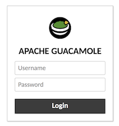

---
author:
  name: Sam Foo
  email: sfoo@linode.com
description: 'Use Apache Guacamole, a clientless HTML5 web application, to access your virtual cloud desktop right from a browser. This guide will show how to install Apache Guacamole through Docker on your Linode.'
og_description: 'Use Apache Guacamole, a clientless HTML5 web application, to access your virtual cloud desktop right from a browser. This guide will show how to install Apache Guacamole through Docker on your Linode.'
keywords: ["remote desktop", "Apache Guacamole", "TeamViewer", "VNC", "Chrome OS", "xfce", "unity"]
license: '[CC BY-ND 4.0](https://creativecommons.org/licenses/by-nd/4.0)'
modified: 2017-12-08
modified_by:
  name: Sam Foo
published: 2017-11-17
title: 'Virtual Cloud Desktop Using Apache Guacamole'
external_resources:
 - '[Apache Guacamole](https://guacamole.incubator.apache.org/)'
 - '[Apache Tomcat](https://tomcat.apache.org/)'
---

Apache Guacamole is an HTML5 application useful for accessing a remote desktop through RDP, VNC, and other protocols. You can create a virtual cloud desktop where applications can be accessed through a web browser. This guide will cover the installation of Apache Guacamole through Docker, then access a remote desktop environment hosted on a Linode.

## Install Docker
The installation method presented here will install the latest version of Docker. Consult the official documentation to install a specific version or if Docker EE is needed.



## Initialize Guacamole Authentication with MySQL
MySQL will be used in this guide, but PostgreSQL and MariaDB are supported alternatives.

1.  Pull Docker images for guacamole-server, guacamole-client, and MySQL.

        docker pull guacamole/guacamole
        docker pull guacamole/guacd
        docker pull mysql/mysql-server

2.  Create a database initialization script to create a table for authentication:

        docker run --rm guacamole/guacamole /opt/guacamole/bin/initdb.sh --mysql > initdb.sql

3.  Generate a one-time password for MySQL root. View the generated password in the logs:

        docker run --name example-mysql -e MYSQL_RANDOM_ROOT_PASSWORD=yes -e MYSQL_ONETIME_PASSWORD=yes -d mysql/mysql-server
        docker logs example-mysql

    Docker logs should print the password in the terminal.

        [Entrypoint] Database initialized
        [Entrypoint] GENERATED ROOT PASSWORD: <password>

4.  Rename and move `initdb.sql` into the MySQL container.

        docker cp initdb.sql example-mysql:/guac_db.sql

5.  Open a bash shell within the MySQL Docker container.

        docker exec -it example-mysql bash

6.  Log in using the one-time password. No commands will be accepted until a new password is defined for `root`. Create a new database and user as shown below:

        bash-4.2# mysql -u root -p
        Enter password:
        Welcome to the MySQL monitor.  Commands end with ; or \g.
        Your MySQL connection id is 11
        Server version: 5.7.20

        Copyright (c) 2000, 2017, Oracle and/or its affiliates. All rights reserved.

        Oracle is a registered trademark of Oracle Corporation and/or its
        affiliates. Other names may be trademarks of their respective
        owners.

        Type 'help;' or '\h' for help. Type '\c' to clear the current input statement.

        mysql> ALTER USER 'root'@'localhost' IDENTIFIED BY 'new_root_password';
        Query OK, 0 rows affected (0.00 sec)

        mysql> CREATE DATABASE guacamole_db;
        Query OK, 1 row affected (0.00 sec)

        mysql> CREATE USER 'guacamole_user'@'%' IDENTIFIED BY 'guacamole_user_password';
        Query OK, 0 rows affected (0.00 sec)

        mysql> GRANT SELECT,INSERT,UPDATE,DELETE ON guacamole_db.* TO 'guacamole_user'@'%';
        Query OK, 0 rows affected (0.00 sec)

        mysql> FLUSH PRIVILEGES;
        Query OK, 0 rows affected (0.00 sec)

        mysql> quit
        Bye

7.  While in the bash shell, create tables from the initialization script for the new database.

        cat guac_db.sql | mysql -u root -p guacamole_db

    Verify successful addition of tables. If there are no tables in `guacamole_db`, ensure the previous steps are completed properly.

        mysql> USE guacamole_db;
        Reading table information for completion of table and column names
        You can turn off this feature to get a quicker startup with -A

        Database changed
        mysql> SHOW TABLES;
        +---------------------------------------+
        | Tables_in_guacamole_db                |
        +---------------------------------------+
        | guacamole_connection                  |
        | guacamole_connection_group            |
        | guacamole_connection_group_permission |
        | guacamole_connection_history          |
        | guacamole_connection_parameter        |
        | guacamole_connection_permission       |
        | guacamole_sharing_profile             |
        | guacamole_sharing_profile_parameter   |
        | guacamole_sharing_profile_permission  |
        | guacamole_system_permission           |
        | guacamole_user                        |
        | guacamole_user_password_history       |
        | guacamole_user_permission             |
        +---------------------------------------+
        13 rows in set (0.00 sec)

    Leave the bash shell.

        exit

## Guacamole in Browser

1.  Start guacd in Docker:

        docker run --name example-guacd -d guacamole/guacd

2.  Link containers so Guacamole can verify credentials stored in the MySQL database:

        docker run --name example-guacamole --link example-guacd:guacd --link example-mysql:mysql -e MYSQL_DATABASE='guacamole_db' -e MYSQL_USER='guacamole_user' -e MYSQL_PASSWORD='guacamole_user_password' -d -p 127.0.0.1:8080:8080 guacamole/guacamole

    
To see all running and non-running Docker containers:

    docker ps -a


3.  If `example-guacamole`, `example-guacd`, and `example-mysql` are all running, navigate to `localhost:8080/guacamole/`. The default login credentials are `guacadmin` and password `guacadmin`. This should be changed as soon as possible.

    

## VNC Server on a Linode

Before sharing a remote desktop, a desktop environment and VNC server must be installed on a Linode. This guide will use Xfce because it is lightweight and doesn't excessively consume system resources.

1.  Install Xfce on the Linode.

        sudo apt install xfce4 xfce4-goodies

    Alternately Unity if there are less constraints on system resources:

        sudo apt install --no-install-recommends ubuntu-desktop gnome-panel gnome-settings-daemon metacity nautilus gnome-terminal

2.  Install VNC server. Starting VNC server will prompt the user for a password.

        sudo apt install tightvncserver
        vncserver

    This will prompt for a password in addition to a view-only option. The maximum password length is 8 characters. For setups requiring more security, deploying Guacamole as a [reverse proxy with SSL encryption is highly recommended](https://guacamole.incubator.apache.org/doc/gug/proxying-guacamole.html).

        You will require a password to access your desktops.

        Password:
        Verify:
        Would you like to enter a view-only password (y/n)?

3.  Ensure to start the desktop environment the end of `.vnc/xstartup` otherwise only a gray screen will be displayed.

        echo 'startxfce4 &' | tee -a .vnc/xstartup

    Alternate Unity configuration example:

    
#!/bin/sh

xrdb $HOME/.Xresources
xsetroot -solid grey
#x-terminal-emulator -geometry 80x24+10+10 -ls -title "$VNCDESKTOP Desktop" &
#x-window-manager &
# Fix to make GNOME work
export XKL_XMODMAP_DISABLE=1
/etc/X11/Xsession

gnome-panel &
gnome-settings-daemon &
metacity &
nautilus &


## New Connection in Guacamole

VNC, RDP, SSH, and Telnet are supported. This section of the guide will show how to navigate the browser interface and add a new connection.

1.  Before connecting to the VNC server, create an SSH tunnel replacing `user` and `example.com` with the Linode's user and public IP.

        ssh -L 5901:localhost:5901 -N -f -l user example.com

2.  In the Guacamole dashboard, click the top right drop down menu and select *Settings*. Under *Connections*, press the *New Connection* button.

    

3.  Under **Edit Connection**, choose a name. Under **Parameters**, the hostname is the public IP of the Linode. The port is 5900 plus the display number - in this case, port 5901. Enter the 8 character password.

    

    The [official documentation](https://guacamole.incubator.apache.org/doc/gug/configuring-guacamole.html#vnc) has detailed descriptions of all parameter names.

    
If you have multiple displays running on the same Linode, increment the port number for each display: 5902, 5903, etc. If your remote displays are hosted on different Linodes, each display should still use port 5901.


4.  From the top right drop down menu, click *Home*. The new connection is now available.

    **CTRL** + **ALT** + **SHIFT** - Opens menu for clipboard, keyboard/mouse settings, and the navigation menu.

    

5.  Press back on the browser to return to the *Home* menu.

6.  Additional connections can be made, and simultaneous connections can be made in new browser tabs.

    

This guide aimed to streamline the installation process through Docker and demonstrate remote desktop with Apache Guacamole as quickly as possible. There are many features such as screen recording, two factor authentication with Duo, file transfer via SFTP, and much more. As an Apache Incubator project, expect to see further developments in the near future.

