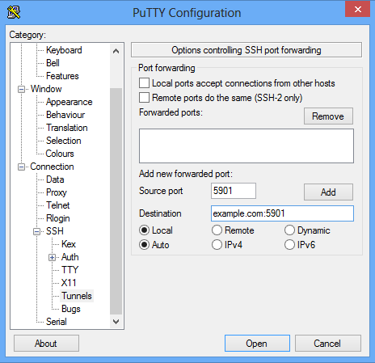
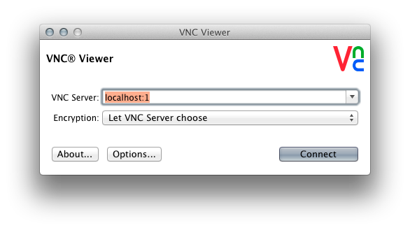
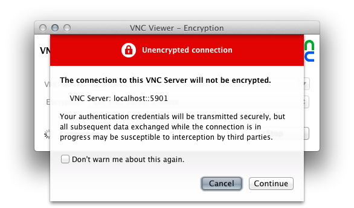
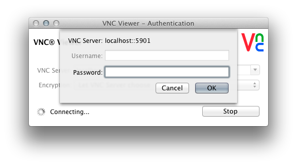
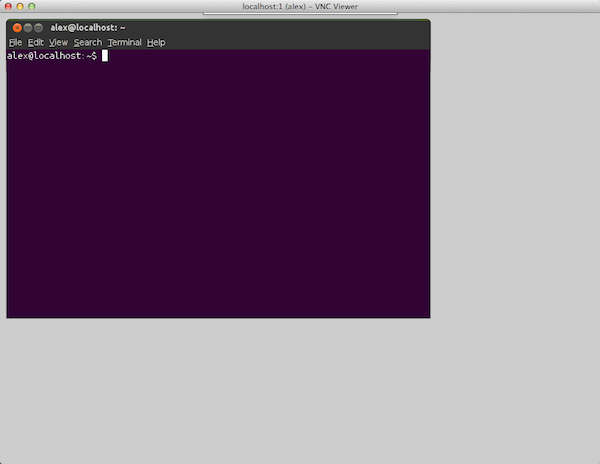
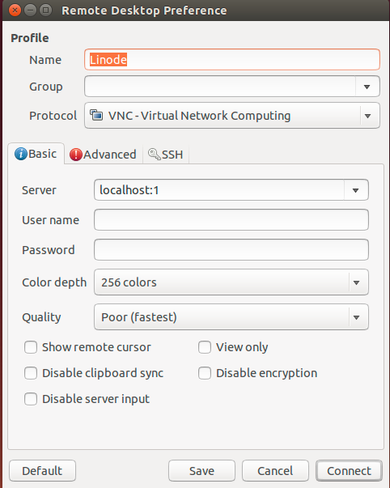
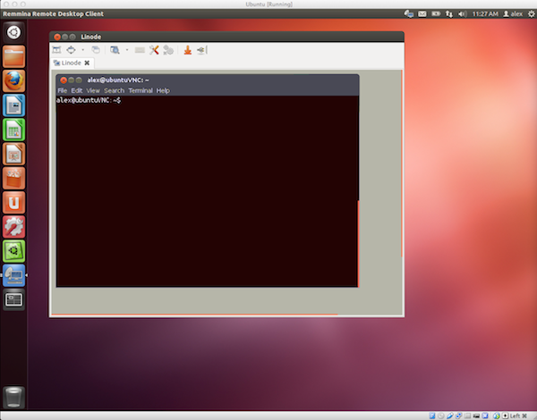
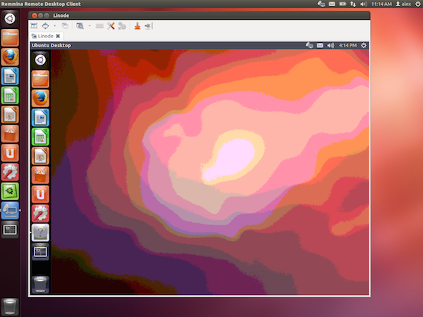

This guide details how to install a graphic desktop environment on your Linode running Ubuntu 12.04 and connect to it from your local computer using VNC.

## Installing a Desktop and VNC on your Linode

1.  Before you begin it's good practice to make sure your system is up to date:

        sudo apt-get update
        sudo apt-get upgrade

2.  Ubuntu has several desktop environments available in its repositories. The following command installs the default desktop, [Unity](https://unity.ubuntu.com/):

        sudo apt-get install ubuntu-desktop

3.  Next install the VNC server:

        sudo apt-get install vnc4server

## Secure your VNC connection

The default VNC connection is unencrypted. In order to secure your passwords and data, you will need to tunnel the traffic through an SSH connection to a local port.

### Mac OS X and Linux

1.  From your desktop, connect to your Linode with the following command.  Be sure to replace user@example.com with your username and your Linode's hostname or IP address:

        ssh -L 5901:127.0.0.1:5901 user@example.com

2.  Launch the VNC server manually to test your connection. You will need to specify a password to use:

        vncserver :1

3.  Initiate your connection as per the steps listed in the following section.

### Windows

1.  Open [PuTTY](/docs/networking/ssh/ssh-connections-using-putty-on-windows/) and navigate under the `SSH` menu to `Tunnels`. Add a new forwarded port as shown below, replacing example.com with your Linode's IP address or hostname:

    

2.  Return to the 'Session' screen. Enter your Linode's hostname or IP address and a title for your session.  Click save to save your settings for future use, and then click open to initiate your SSH tunnel.

3.  Launch the VNC server manually to test your connection. You will need to specify a password to use:

        vncserver :1

4.  Initiate your connection as per the steps listed in the following section.

## Connecting to VNC From your Desktop

### Mac OS X and Windows

While there are many options for OS X and Windows, this guide will use [RealVNC Viewer](http://www.realvnc.com/download/viewer/).

1.  After installing and opening the viewer, connect to the localhost through your VNC client :

    

2.  You will be warned that the connection is unencrypted, however if you have followed the steps above for securing your VNC connection, your session will be securely tunneled to your Linode. To proceed, press **Continue**.

    

3. You will be prompted to enter the password you specified when first launching the VNC Server. See [Secure your VNC Connection](#secure-your-vnc-connection) if you have not yet started a VNC server on your Linode.

    

4.  After connecting you will be greeted with a terminal emulator window.

    

In the next section we will configure your Linode to launch a full desktop.

### Linux

There are a variety of VNC clients available for Ubuntu desktops. You can find the list [here](https://help.ubuntu.com/community/VNC/Clients). For this guide, we'll be using Remmina, which is installed by default.

1.  Open Remmina.

    

2.  Click the button to `Create a new remote desktop profile`. Name your profile, specify the VNC protocol, and enter localhost :1 in the server field. Be sure to include the`:1` in the `Server` section. In the password section fill in the password you specified in [Secure your VNC connection](#secure-your-vnc-connection):

    

3.  Press **Connect**.

    

In the next section we will configure your Linode to launch a full desktop.

## Configuring VNC for a Full Desktop

In the next few steps we'll configure VNC to launch the full Gnome desktop.

1.  Once you've successfully connected, exit the connection. Close the VNC server:

        vncserver -kill :1

2.  In your preferred text editor, open the xstartup file in your home folder under the `.vnc` directory:

    
#!/bin/sh

# Uncomment the following two lines for normal desktop:
# unset SESSION_MANAGER
# exec /etc/X11/xinit/xinitrc

[ -x /etc/vnc/xstartup ] && exec /etc/vnc/xstartup
[ -r $HOME/.Xresources ] && xrdb $HOME/.Xresources
xsetroot -solid grey
vncconfig -iconic &
x-terminal-emulator -geometry 80x24+10+10 -ls -title "$VNCDESKTOP Desktop" &
x-window-manager &



3.  Edit the last line of the file, replacing it with the following:

        gnome-session &

4.  Save and exit the file. Begin another VNC session:

        vncserver :1

    You should now see the full Ubuntu Desktop:

    

## Starting VNC Server on Boot

Below we've outlined optional steps to ensure that the VNC server starts automatically after reboot.

1.  Open your crontab. If you've never edited it before, you may be prompted to choose a text editor:

        crontab -e
        no crontab for user - using an empty one

        Select an editor.  To change later, run 'select-editor'.
          1. /bin/ed
          2. /bin/nano        <---- easiest
          3. /usr/bin/vim.basic
          4. /usr/bin/vim.tiny

        Choose 1-4 [2]:

2.  Add `@reboot         /usr/bin/vncserver :1` to the bottom of the file. Your crontab should look like this:

    
# Edit this file to introduce tasks to be run by cron.
#
# Each task to run has to be defined through a single line
# indicating with different fields when the task will be run
# and what command to run for the task
#
# To define the time you can provide concrete values for
# minute (m), hour (h), day of month (dom), month (mon),
# and day of week (dow) or use '*' in these fields (for 'any').
#
# Notice that tasks will be started based on the cron's system
# daemon's notion of time and timezones.
#
# Output of the crontab jobs (including errors) is sent through
# email to the user the crontab file belongs to (unless redirected).
#
# For example, you can run a backup of all your user accounts
# at 5 a.m every week with:
# 0 5 * * 1 tar -zcf /var/backups/home.tgz /home/
#
# For more information see the manual pages of crontab(5) and cron(8)
#
# m h dom mon dow command

@reboot /usr/bin/vncserver :1



3.  Save and exit the file. Test by rebooting your Linode and attempting to connect to the VNC server.
