---
author:
  name: Linode
  email: docs@linode.com
contributor:
  name: Tyler Langlois
  link: https://tjll.net
description: 'This guide will demonstrate how to use Elasticsearch, Logstash, and Kibana to collect and visualize web server logs.'
og_description: 'The Elastic Stack - Elasticsearch, Logstash, & Kibana - provides a free, open-source solution to search, collect, and analyze data. This guide shows how to install all three components to explore Apache web server logs in Kibana.'
external_resources:
 - '[Elastic Documentation](https://www.elastic.co/guide/index.html)'
keywords: ["apache debian 9", "linux web server", "elasticsearch", "logstash", "kibana", "elk stack", "elastic stack"]
license: '[CC BY-ND 4.0](https://creativecommons.org/licenses/by-nd/4.0)'
published: 2020-10-10
modified: 2020-10-10
modified_by:
  name: Linode
title: 'Visualize Apache Web Server Logs Using the Elastic Stack on Debian 9'
dedicated_cpu_link: true
tags: ["debian","analytics","database","monitoring"]
---

## What is the Elastic Stack?

The [Elastic](https://www.elastic.co/) stack, which includes Elasticsearch, Logstash, and Kibana, is a troika of tools that provides a free and open-source solution that searches, collects and analyzes data from any source and in any format and visualizes it in real time.

This guide will explain how to install all three components and use them to explore Apache web server logs in Kibana, the browser-based component that visualizes data.

This guide will walk through the installation and set up of version 7 of the Elastic stack, which is the latest at time of this writing.


This guide is written for a non-root user. Commands that require elevated privileges are prefixed with `sudo`. If you're not familiar with the `sudo` command, you can check our [Users and Groups](/docs/tools-reference/linux-users-and-groups/) guide.



Due to the resources required to run the multiple services on a single Linode in this guide, we recommend using at least a 2G (or `g6-standard-1`) sized Linode instance.


## Before You Begin

1.  Familiarize yourself with our [Getting Started](/docs/getting-started/) guide and complete the steps for setting your Linode's hostname and timezone.

2.  This guide will use `sudo` wherever possible. Complete the sections of our [Securing Your Server](/docs/security/securing-your-server/) to create a standard user account, harden SSH access and remove unnecessary network services.

3.  Follow the steps in our [Apache Web Server on Debian 8 (Jessie)](/docs/web-servers/apache/apache-web-server-debian-8/) guide to set up and configure Apache on your server.

4.  Update your system:

        sudo apt-get update && sudo apt-get upgrade

## Install Java

The Elasticsearch package is bundled with its own version of a Java runtime, but Logstash requires Java to be present on the system.

1.  Install the default version of Java available on Debian 9:

        sudo apt-get install default-jre-headless

## Install Elastic APT Repository

The Elastic package repositories contain all of the necessary packages for this tutorial, so install it first before proceeding with the individual services.

1.  Install the official Elastic APT package signing key:

        wget -qO - https://artifacts.elastic.co/GPG-KEY-elasticsearch | sudo apt-key add -

2.  Install the `apt-transport-https` package, which is required to retrieve deb packages served over HTTPS on Debian 9:

        sudo apt-get install apt-transport-https

3.  Add the APT repository information to your server's list of sources:

        echo "deb https://artifacts.elastic.co/packages/7.x/apt stable main" | sudo tee -a /etc/apt/sources.list.d/elastic-7.x.list

4.  Refresh the list of available packages:

        sudo apt-get update

## Install Elastic Stack

Before configuring and loading log data, install each piece of the stack, individually.

### Elasticsearch

1.  Install the `elasticsearch` package:

         sudo apt-get install elasticsearch

2.  Set the JVM heap size to approximately half of your server's available memory. For example, on a Linode instance with 2GB of memory, ensure that the `Xms` and `Xmx` values in the `/etc/elasticsearch/jvm.options` file are set to the following, and leave the other values in this file unchanged. The default `jvm.options` may already be set to these values.

    
-Xms1g
-Xmx1g



3.  Start and enable the `elasticsearch` service:

         sudo systemctl enable elasticsearch
         sudo systemctl start elasticsearch

3.  Wait a few moments for the service to start, then confirm that the Elasticsearch API is available:

         curl localhost:9200

    Elasticsearch may take some time to start up. If you need to determine whether the service has started successfully or not, you can use the `systemctl status elasticsearch` command to see the most recent logs. The Elasticsearch REST API should return a JSON response similar to the following:

         {
           "name" : "tutorial",
           "cluster_name" : "elasticsearch",
           "cluster_uuid" : "A3Cs-l1_QdqekfHW1fiboQ",
           "version" : {
             "number" : "7.9.2",
             "build_flavor" : "default",
             "build_type" : "deb",
             "build_hash" : "d34da0ea4a966c4e49417f2da2f244e3e97b4e6e",
             "build_date" : "2020-09-23T00:45:33.626720Z",
             "build_snapshot" : false,
             "lucene_version" : "8.6.2",
             "minimum_wire_compatibility_version" : "6.8.0",
             "minimum_index_compatibility_version" : "6.0.0-beta1"
           },
           "tagline" : "You Know, for Search"
         }

### Logstash

Install the `logstash` package:

     sudo apt-get install logstash

### Kibana

Install the `kibana` package:

     sudo apt-get install kibana

## Configure Elastic Stack

### Elasticsearch

By default, Elasticsearch will create five shards and one replica for every index that's created. When deploying to production, these are reasonable settings to use. In this tutorial, only one server is used in the Elasticsearch setup, so multiple shards and replicas are unnecessary. Changing these defaults can avoid unnecessary overhead.

1.  Create a temporary JSON file with an *index template* that instructs Elasticsearch to set the number of shards to one and number of replicas to zero for all matching index names (in this case, a wildcard `*`):

    
{
  "index_patterns": ["*"],
  "template": {
    "settings": {
      "index": {
        "number_of_shards": 1,
        "number_of_replicas": 0
      }
    }
  }
}



2.  Use `curl` to create an index template with these settings that'll be applied to all indices created hereafter:

        curl -XPUT -H'Content-type: application/json' http://localhost:9200/_index_template/defaults -d @template.json

3.  Elasticsearch should return:

        {"acknowledged":true}

### Logstash

In order to collect Apache access logs, Logstash must be configured to watch any necessary files and then process them, eventually sending them to Elasticsearch. This configuration file assumes that a site has been set up according to the previously mentioned [Apache Web Server on Debian 8 (Jessie)](/docs/web-servers/apache/apache-web-server-debian-8/) guide to find the correct log path.

1.  Set the JVM heap size to approximately one quarter of your server's available memory. For example, if your server has 2GB of RAM, change the `Xms` and `Xmx` values in the `/etc/logstash/jvm.options` file to the following, and leave the other values in this file unchanged:

    
-Xms512m
-Xmx512m



2.  Create the following Logstash configuration:

    
input {
  file {
    path => '/var/www/*/logs/access.log'
  }
}

filter {
  grok {
    match => { "message" => "%{COMBINEDAPACHELOG}" }
  }
}

output {
  elasticsearch { }
}



3.  Start and enable `logstash`:

        sudo systemctl enable logstash
        sudo systemctl start logstash

### Kibana

1.  Enable and start the Kibana service:

        sudo systemctl enable kibana
        sudo systemctl start kibana

2.  In order for Kibana to find log entries to configure an *index pattern*, logs must first be sent to Elasticsearch. With the three daemons started, log files should be collected with Logstash and stored in Elasticsearch. To generate logs, issue several requests to Apache:

        for i in `seq 1 5` ; do curl localhost ; sleep 0.2 ; done

3.  By default Kibana will bind to the a local address `127.0.0.1` which only permits connections that originate from localhost. This is recommended in order to avoid exposing the dashboard to the public internet, but in order to access Kibana's web interface in a browser, the `ssh` command can forward the port. Run the following command in a local terminal (on your local computer, not your Linode) and leave the command running for the duration of the tutorial. Press `Ctrl-C` to end the port forward at the conclusion of this tutorial.

        ssh -N -L 5601:localhost:5601 <your Linode's IP address>

4.  Next, open Kibana in your browser at [http://localhost:5601](http://localhost:5601). The landing page should look similar to the following. Click on "Explore on my own" to begin configuring Kibana.

    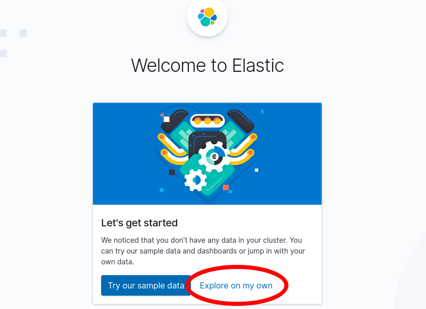

    
The first time that Kibana starts, the daemon will perform several optimization steps that may delay startup time. If the web page is not available immediately, wait a few minutes or check the logs with the command `sudo journalctl -u kibana`.


5.  From the next page, click on "Connect to your Elasticsearch index" under "Use Elasticsearch data" to configure an index pattern in Kibana.

    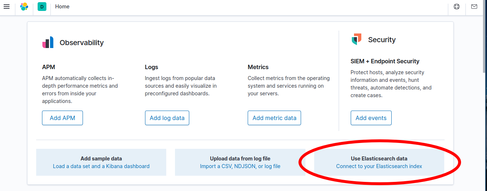

6.  Close the information sidebar on the Index Pattern configuration page.

    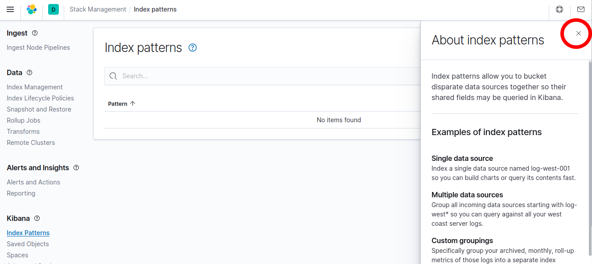

7.  At the upper right of the interface, select the "Create index pattern" button.

    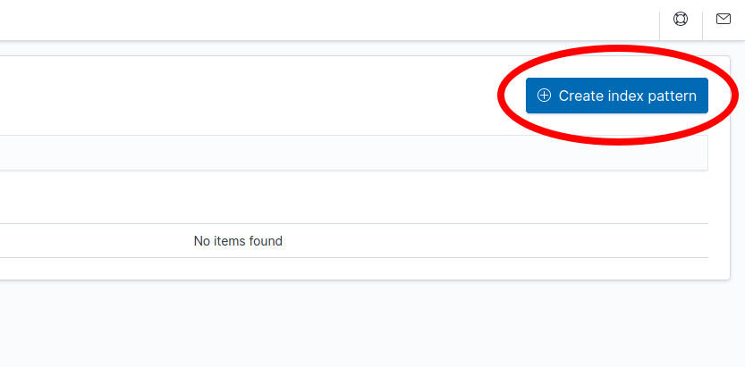

8.  On the "Create index pattern" page, enter the text `logstash*` into the "Index pattern name" field. Click "Next step" to continue.

    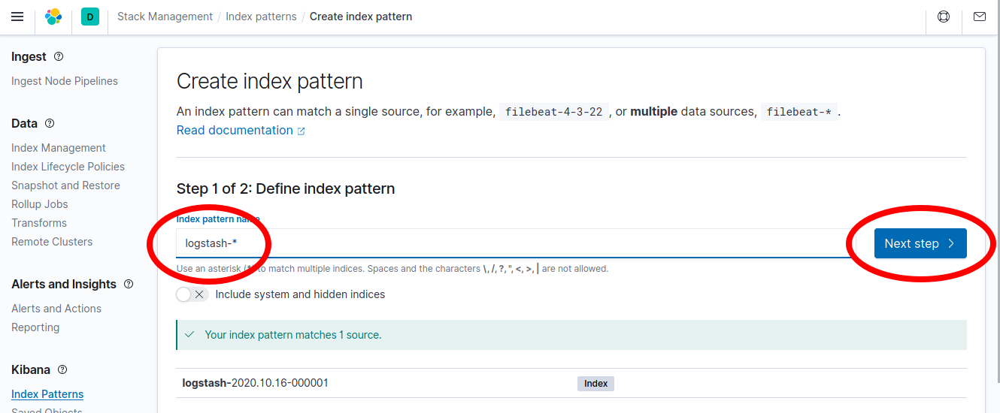

9.  From the "Time field" drop down menu, select `@timestamp` as the time field. This corresponds with the parsed time from web server logs. Click the "Create index pattern" button to continue.

    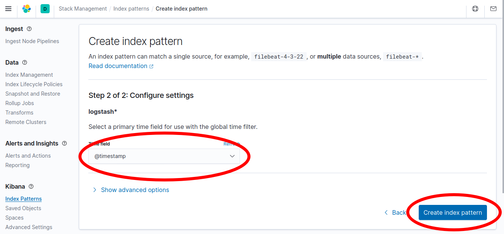

    Kibana will now be able to display logs stored in indices that match the `logstash*` wildcard pattern.

    
Throughout this section, logs will be retrieved based upon a time window in the upper right corner of the Kibana interface (such as "Last 15 Minutes"). If at any point, log entries no longer are shown in the Kibana interface, click this timespan and choose a wider range, such as "Last Hour" or "Last 1 Hour" or "Last 4 Hours," to see as many logs as possible.


## View Logs

After the previously executed `curl` commands created entries in the Apache access logs, Logstash will have indexed them in Elasticsearch. These are now visible in Kibana.

From the left menu, select the hamburger icon to expand the available menu options.

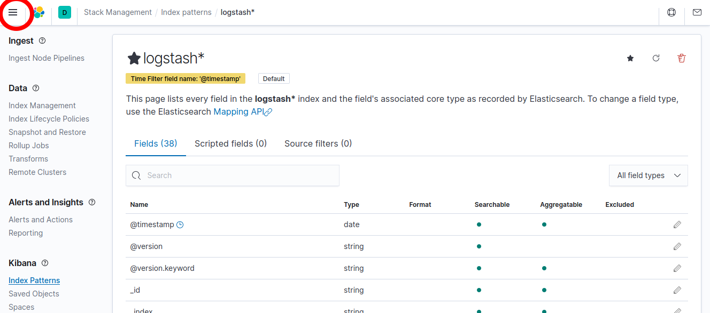

Select the "Discover" menu item.

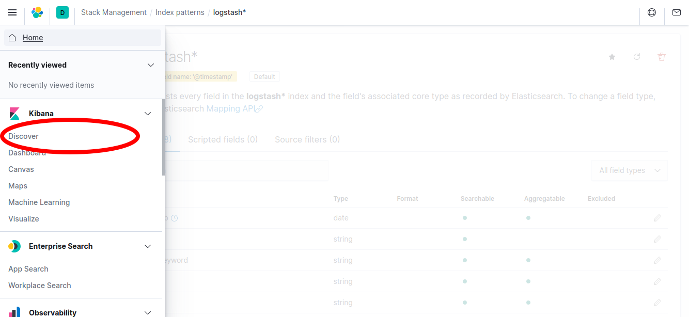

The Discover interface should show a timeline of log events:

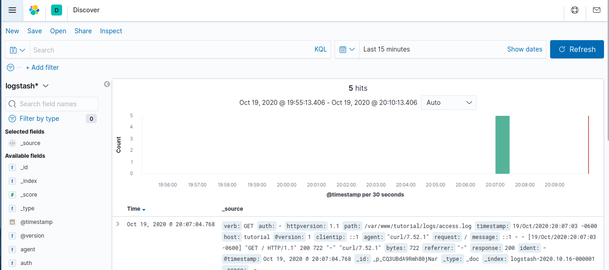

Over time, and as other requests are made to the web server via `curl` or a browser, additional logs can be seen and searched from Kibana. The Discover tab is a good way to familiarize yourself with the structure of the indexed logs and determine what to search and analyze.

In order to view the details of a log entry, click the drop-down arrow to see individual document fields:

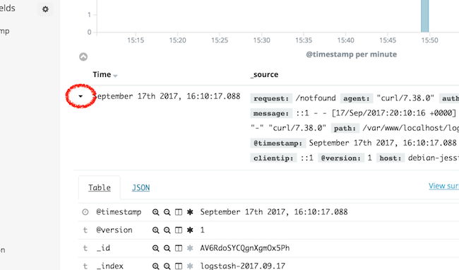

Fields represent the values parsed from the Apache logs, such as `agent`, which represents the `User-Agent` header, and `bytes`, which indicates the size of the web server response.

### Analyze Logs

Before continuing, generate a couple of dummy 404 log events in your web server logs to demonstrate how to search and analyze logs within Kibana:

    for i in `seq 1 2` ; do curl localhost/notfound-$i ; sleep 0.2 ; done

#### Search Data

The top search bar within the Kibana interface allows you to search for queries following the [Kibana Query Language](https://www.elastic.co/guide/en/kibana/current/kuery-query.html) to find results.

For example, to find the 404 error requests you generated from among 200 OK requests, enter the following in the search box:

    response:404

Then, click the "Update" button.

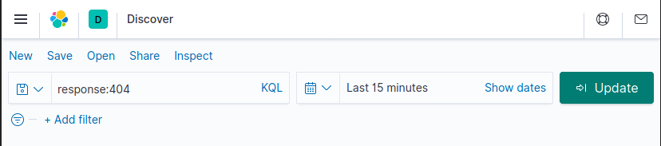

The user interface will now only return logs that contain the "404" code in their response field.

#### Analyze Data

Kibana supports many types of Elasticsearch queries to gain insight into indexed data. For example, consider the traffic that resulted in a "404 - not found" response code. Using [aggregations](https://www.elastic.co/guide/en/elasticsearch/reference/current/search-aggregations.html), useful summaries of data can be extracted and displayed natively in Kibana.

To create one of these visualizations, begin by selecting the "Visualize" tab from the sidebar (you may need to expand the menu using the hamburger icon in the upper left-hand corner of the interface):

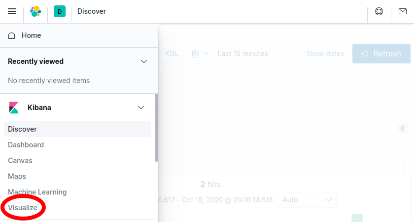

Then, select the "Create new visualization" button:

Select "Pie" to create a new pie chart. Note that you may need to scroll down to find the "Pie" visualization:

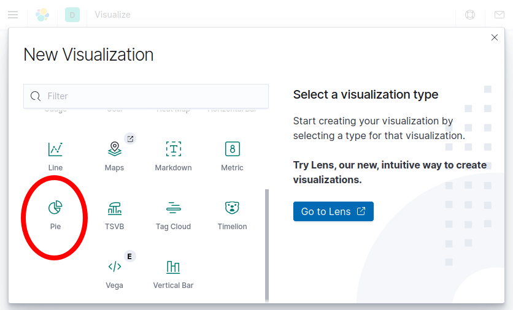

Then select the `logstash-*` index pattern to determine from where the data for the pie chart will come:

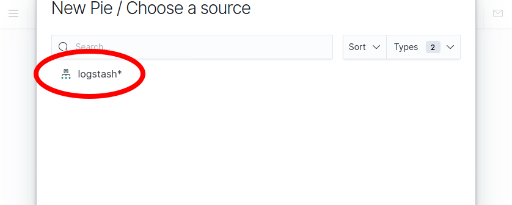

At this point, a pie chart should appear in the interface ready to be configured. Follow these steps to configure the visualization in the user interface pane that appears to the left of the pie chart:

- Select "+ Add" under the "Buckets" card in the sidebar.
- Select "Split Slices" to create more than one slice in the visualization.
- From the "Aggregation" drop-down menu, select "Terms" to indicate that unique terms of a field will be the basis for each slice of the pie chart.
- From the "Field" drop-down menu, select `response.keyword`. This indicates that the `response` field will determine the size of the pie chart slices.
- Finally, click the "Update" button to update the pie chart and complete the visualization.


You may need to view a longer time span in order to see results that include HTTP logs for both 200 and 404 responses and different portions of the pie chart. This may be done by clicking the calendar icon next to the search bar and selecting a longer time period such as "Last 1 hour".


Observe that only a portion of requests have returned a 404 response code (remember to change the aforementioned time span if your curl requests occurred earlier than you are currently viewing). This approach of collecting summarized statistics about the values of fields within your logs can be similarly applied to other fields, such as the http verb (GET, POST, etc.), or can even create summaries of numerical data, such as the total amount of bytes transferred over a given time period.

If you wish to save this visualization for use later use, click the "Save" button near the top of the browser window to name the visualization and save it permanently to Elasticsearch.

## Further Reading

Although this tutorial has provided an overview of each piece of the Elastic stack, more reading is available to learn additional ways to process and view data, such as additional Logstash filters to enrich log data, or other Kibana visualizations to present data in new and useful ways.

Comprehensive documentation for each piece of the stack is available from the Elastic web site:

- The [Elasticsearch reference](https://www.elastic.co/guide/en/elasticsearch/reference/current/index.html) contains additional information regarding how to operate Elasticsearch, including clustering, managing indices, and more.
- The [Logstash documentation](https://www.elastic.co/guide/en/logstash/current/index.html) contains useful information on additional plug-ins that can further process raw data, such as geolocating IP addresses, parsing user-agent strings, and other plug-ins.
- [Kibana's documentation pages](https://www.elastic.co/guide/en/kibana/current/index.html) provide additional information regarding how to create useful visualizations and dashboards.
