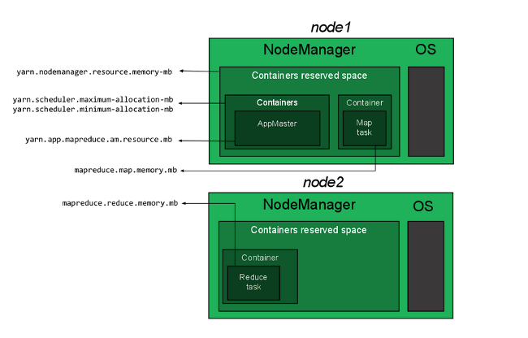
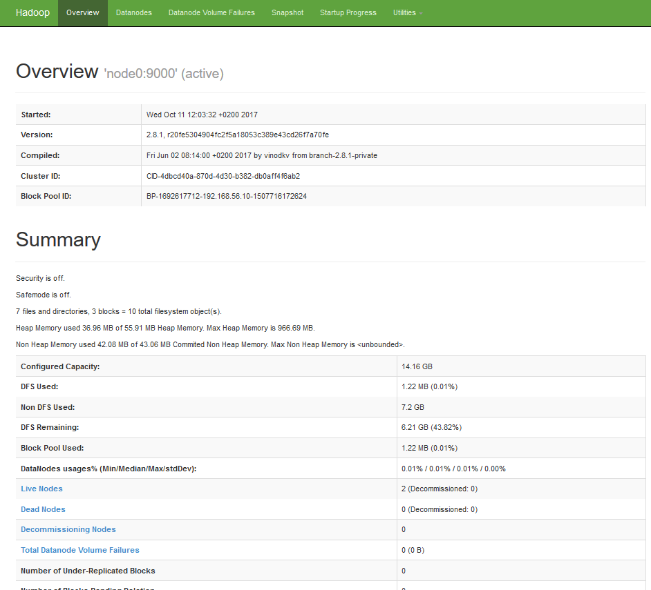
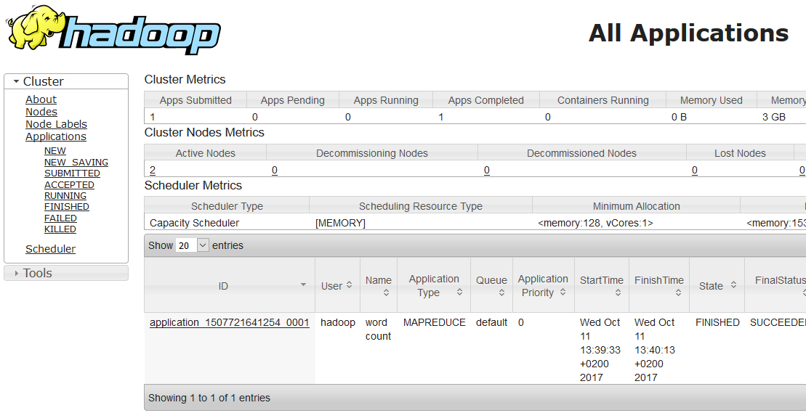

---
author:
  name: Florent Houbart
  email: docs@Linode.com
description: 'This Linode guide will show you how to install and set up a 3-node Hadoop cluster.'
keywords: ["Hadoop", " YARN", " HDFS"]
license: '[CC BY-ND 4.0](https://creativecommons.org/licenses/by-nd/4.0)'
published: 2017-10-13
modified: 2017-10-16
modified_by:
  name: Linode
title: 'How to Install and Set Up a 3-Node Hadoop Cluster'
contributor:
  name: Florent Houbart
external_resources:
- '[YARN Command Reference](https://hadoop.apache.org/docs/current/hadoop-yarn/hadoop-yarn-site/YarnCommands.html)'
- '[HDFS Shell Documentation](https://hadoop.apache.org/docs/current/hadoop-project-dist/hadoop-common/FileSystemShell.html)'
- '[core-site.xml properties](https://hadoop.apache.org/docs/current/hadoop-project-dist/hadoop-common/core-default.xml)'
- '[hdfs-site.xml properties](https://hadoop.apache.org/docs/current/hadoop-project-dist/hadoop-hdfs/hdfs-default.xml)'
- '[mapred-site.xml properties](https://hadoop.apache.org/docs/current/hadoop-mapreduce-client/hadoop-mapreduce-client-core/mapred-default.xml)'
- '[core-site.xml properties](https://hadoop.apache.org/docs/current/hadoop-yarn/hadoop-yarn-common/yarn-default.xml)'
tags: ["database"]
---

## What is Hadoop?

Hadoop is an open-source Apache project that allows creation of parallel processing applications on large data sets, distributed across networked nodes. It is composed of the **Hadoop Distributed File System (HDFS™)** that handles scalability and redundancy of data across nodes, and **Hadoop YARN**, a framework for job scheduling that executes data processing tasks on all nodes.

## Before You Begin

1.  Follow the [Getting Started](/docs/getting-started/) guide to create three (3) Linodes. They'll be referred to throughout this guide as **node-master**, **node1**, and **node2**. It is recommended that you set the hostname of each Linode to match this naming convention.

    Run the steps in this guide from the **node-master** unless otherwise specified.

1.  [Add a Private IP Address](/docs/platform/manager/remote-access/#adding-private-ip-addresses) to each Linode so that your Cluster can communicate with an additional layer of security.

1.  Follow the [Securing Your Server](/docs/security/securing-your-server/) guide to harden each of the three servers. Create a normal user for the Hadoop installation, and a user called `hadoop` for the Hadoop daemons. Do **not** create SSH keys for `hadoop` users. SSH keys will be addressed in a later section.

1. Install the JDK using the appropriate guide for your distribution, [Debian](/docs/development/java/install-java-on-debian/), [CentOS](/docs/development/java/install-java-on-centos/) or [Ubuntu](/docs/development/java/install-java-on-ubuntu-16-04/), or install the latest JDK from Oracle.

1.  The steps below use example IPs for each node. Adjust each example according to your configuration:

    -  **node-master**: 192.0.2.1
    -  **node1**: 192.0.2.2
    -  **node2**: 192.0.2.3

      
This guide is written for a non-root user. Commands that require elevated privileges are prefixed with `sudo`. If you’re not familiar with the `sudo` command, see the [Users and Groups](/docs/tools-reference/linux-users-and-groups) guide. All  commands in this guide are run with the *hadoop* user if not specified otherwise.


## Architecture of a Hadoop Cluster

Before configuring the master and worker nodes, it's important to understand the different components of a Hadoop cluster.

A **master node** maintains knowledge about the distributed file system, like the `inode` table on an `ext3` filesystem, and schedules resources allocation. **node-master** will handle this role in this guide, and host two daemons:

*   The **NameNode** manages the distributed file system and knows where stored data blocks inside the cluster are.
*   The **ResourceManager** manages the YARN jobs and takes care of scheduling and executing processes on worker nodes.

**Worker nodes** store the actual data and provide processing power to run the jobs. They'll be **node1** and **node2**, and will host two daemons:

*   The **DataNode** manages the physical data stored on the node; it's named, `NameNode`.
*   The **NodeManager** manages execution of tasks on the node.

## Configure the System

### Create Host File on Each Node

For each node to communicate with each other by name, edit the `/etc/hosts` file to add the private IP addresses of the three servers. Don't forget to replace the sample IP with your IP:


192.0.2.1    node-master
192.0.2.2    node1
192.0.2.3    node2



### Distribute Authentication Key-pairs for the Hadoop User

The master node will use an SSH connection to connect to other nodes with key-pair authentication. This will allow the master node to actively manage the cluster.

1.  Login to **node-master** as the `hadoop` user, and generate an SSH key:

        ssh-keygen -b 4096

     When generating this key, leave the password field blank so your Hadoop user can communicate unprompted.

1.  View the **node-master** public key and copy it to your clipboard to use with each of your worker nodes.

        less /home/hadoop/.ssh/id_rsa.pub

1.  In each Linode, make a new file `master.pub` in the `/home/hadoop/.ssh` directory. Paste your public key into this file and save your changes.

1.  Copy your key file into the authorized key store.

        cat ~/.ssh/master.pub >> ~/.ssh/authorized_keys

### Download and Unpack Hadoop Binaries

Log into **node-master** as the `hadoop` user, download the Hadoop tarball from [Hadoop project page](https://hadoop.apache.org/), and unzip it:

    cd
    wget http://apache.cs.utah.edu/hadoop/common/current/hadoop-3.1.2.tar.gz
    tar -xzf hadoop-3.1.2.tar.gz
    mv hadoop-3.1.2 hadoop

### Set Environment Variables

1.  Add Hadoop binaries to your PATH. Edit `/home/hadoop/.profile` and add the following line:

    
PATH=/home/hadoop/hadoop/bin:/home/hadoop/hadoop/sbin:$PATH


1.  Add Hadoop to your PATH for the shell. Edit `.bashrc` and add the following lines:

    
export HADOOP_HOME=/home/hadoop/hadoop
export PATH=${PATH}:${HADOOP_HOME}/bin:${HADOOP_HOME}/sbin


## Configure the Master Node

Configuration will be performed on **node-master** and replicated to other nodes.

### Set JAVA_HOME

1.  Find your Java installation path. This is known as `JAVA_HOME`. If you installed open-jdk from your package manager, you can find the path with the command:

        update-alternatives --display java

    Take the value of the *current link* and remove the trailing `/bin/java`. For example on Debian, the link is `/usr/lib/jvm/java-8-openjdk-amd64/jre/bin/java`, so `JAVA_HOME` should be `/usr/lib/jvm/java-8-openjdk-amd64/jre`.

    If you installed java from Oracle, `JAVA_HOME` is the path where you unzipped the java archive.

2.  Edit `~/hadoop/etc/hadoop/hadoop-env.sh` and replace this line:

        export JAVA_HOME=${JAVA_HOME}

    with your actual java installation path. On a Debian 9 Linode with open-jdk-8 this will be as follows:

    
export JAVA_HOME=/usr/lib/jvm/java-8-openjdk-amd64/jre



### Set NameNode Location

Update your `~/hadoop/etc/hadoop/core-site.xml` file to set the NameNode location to **node-master** on port `9000`:


<?xml version="1.0" encoding="UTF-8"?>
<?xml-stylesheet type="text/xsl" href="configuration.xsl"?>
    <configuration>
        <property>
            <name>fs.default.name</name>
            <value>hdfs://node-master:9000</value>
        </property>
    </configuration>



### Set path for HDFS

Edit `hdfs-site.conf` to resemble the following configuration:


<configuration>
    <property>
            <name>dfs.namenode.name.dir</name>
            <value>/home/hadoop/data/nameNode</value>
    </property>

    <property>
            <name>dfs.datanode.data.dir</name>
            <value>/home/hadoop/data/dataNode</value>
    </property>

    <property>
            <name>dfs.replication</name>
            <value>1</value>
    </property>
</configuration>



The last property, `dfs.replication`, indicates how many times data is replicated in the cluster. You can set `2` to have all the data duplicated on the two nodes. Don't enter a value higher than the actual number of worker nodes.

### Set YARN as Job Scheduler

Edit the `mapred-site.xml` file, setting YARN as the default framework for MapReduce operations:


<configuration>
    <property>
            <name>mapreduce.framework.name</name>
            <value>yarn</value>
    </property>
    <property>
            <name>yarn.app.mapreduce.am.env</name>
            <value>HADOOP_MAPRED_HOME=$HADOOP_HOME</value>
    </property>
    <property>
            <name>mapreduce.map.env</name>
            <value>HADOOP_MAPRED_HOME=$HADOOP_HOME</value>
    </property>
    <property>
            <name>mapreduce.reduce.env</name>
            <value>HADOOP_MAPRED_HOME=$HADOOP_HOME</value>
    </property>
</configuration>



### Configure YARN

Edit `yarn-site.xml`, which contains the configuration options for YARN. In the `value` field for the `yarn.resourcemanager.hostname`, replace `203.0.113.0` with the public IP address of **node-master**:


<configuration>
    <property>
            <name>yarn.acl.enable</name>
            <value>0</value>
    </property>

    <property>
            <name>yarn.resourcemanager.hostname</name>
            <value>203.0.113.0</value>
    </property>

    <property>
            <name>yarn.nodemanager.aux-services</name>
            <value>mapreduce_shuffle</value>
    </property>
</configuration>



### Configure Workers

The file `workers` is used by startup scripts to start required daemons on all nodes. Edit `~/hadoop/etc/hadoop/workers` to include both of the nodes:


node1
node2



## Configure Memory Allocation

Memory allocation can be tricky on low RAM nodes because default values are not suitable for nodes with less than 8GB of RAM. This section will highlight how memory allocation works for MapReduce jobs, and provide a sample configuration for 2GB RAM nodes.

### The Memory Allocation Properties

A YARN job is executed with two kind of resources:

-  An *Application Master* (AM) is responsible for monitoring the application and coordinating distributed executors in the cluster.
- Some executors that are created by the AM actually run the job. For a MapReduce jobs, they'll perform map or reduce operation, in parallel.

Both are run in *containers* on worker nodes. Each worker node runs a *NodeManager* daemon that's responsible for container creation on the node. The whole cluster is managed by a *ResourceManager* that schedules container allocation on all the worker-nodes, depending on capacity requirements and current charge.

Four types of resource allocations need to be configured properly for the cluster to work. These are:

1. How much memory can be allocated for YARN containers on a single node. This limit should be higher than all the others; otherwise, container allocation will be rejected and applications will fail. However, it should not be the entire amount of RAM on the node.

    This value is configured in `yarn-site.xml` with `yarn.nodemanager.resource.memory-mb`.

2. How much memory a single container can consume and the minimum memory allocation allowed. A container will never be bigger than the maximum, or else allocation will fail and will always be allocated as a multiple of the minimum amount of RAM.

    Those values are configured in `yarn-site.xml` with `yarn.scheduler.maximum-allocation-mb` and `yarn.scheduler.minimum-allocation-mb`.

3. How much memory will be allocated to the ApplicationMaster. This is a constant value that should fit in the container maximum size.

    This is configured in `mapred-site.xml` with `yarn.app.mapreduce.am.resource.mb`.

4. How much memory will be allocated to each map or reduce operation. This should be less than the maximum size.

    This is configured in `mapred-site.xml` with properties `mapreduce.map.memory.mb` and `mapreduce.reduce.memory.mb`.

The relationship between all those properties can be seen in the following figure:

### Sample Configuration for 2GB Nodes

For 2GB nodes, a working configuration may be:

| Property | Value |
| ---------------- |:-------------:|
| yarn.nodemanager.resource.memory-mb     | 1536          |
| yarn.scheduler.maximum-allocation-mb| 1536 |
| yarn.scheduler.minimum-allocation-mb| 128 |
| yarn.app.mapreduce.am.resource.mb| 512 |
| mapreduce.map.memory.mb| 256 |
| mapreduce.reduce.memory.mb| 256 |

1.  Edit `/home/hadoop/hadoop/etc/hadoop/yarn-site.xml` and add the following lines:

    
<property>
        <name>yarn.nodemanager.resource.memory-mb</name>
        <value>1536</value>
</property>

<property>
        <name>yarn.scheduler.maximum-allocation-mb</name>
        <value>1536</value>
</property>

<property>
        <name>yarn.scheduler.minimum-allocation-mb</name>
        <value>128</value>
</property>

<property>
        <name>yarn.nodemanager.vmem-check-enabled</name>
        <value>false</value>
</property>



    The last property disables virtual-memory checking which can prevent containers from being allocated properly with JDK8 if enabled.

2.  Edit `/home/hadoop/hadoop/etc/hadoop/mapred-site.xml` and add the following lines:

    
<property>
        <name>yarn.app.mapreduce.am.resource.mb</name>
        <value>512</value>
</property>

<property>
        <name>mapreduce.map.memory.mb</name>
        <value>256</value>
</property>

<property>
        <name>mapreduce.reduce.memory.mb</name>
        <value>256</value>
</property>



## Duplicate Config Files on Each Node

1.  Copy the Hadoop binaries to worker nodes:

        cd /home/hadoop/
        scp hadoop-*.tar.gz node1:/home/hadoop
        scp hadoop-*.tar.gz node2:/home/hadoop

2.  Connect to **node1** via SSH. A password isn't required, thanks to the SSH keys copied above:

        ssh node1

3.  Unzip the binaries, rename the directory, and exit **node1** to get back on the node-master:

        tar -xzf hadoop-3.1.2.tar.gz
        mv hadoop-3.1.2 hadoop
        exit

4.  Repeat steps 2 and 3 for **node2**.

5.  Copy the Hadoop configuration files to the worker nodes:

        for node in node1 node2; do
            scp ~/hadoop/etc/hadoop/* $node:/home/hadoop/hadoop/etc/hadoop/;
        done

## Format HDFS

HDFS needs to be formatted like any classical file system. On **node-master**, run the following command:

    hdfs namenode -format

Your Hadoop installation is now configured and ready to run.

## Run and monitor HDFS

This section will walk through starting HDFS on NameNode and DataNodes, and monitoring that everything is properly working and interacting with HDFS data.

### Start and Stop HDFS

1.  Start the HDFS by running the following script from **node-master**:

        start-dfs.sh

    This will start **NameNode** and **SecondaryNameNode** on node-master, and **DataNode** on **node1** and **node2**, according to the configuration in the `workers` config file.

2.  Check that every process is running with the `jps` command on each node. On **node-master**, you should see the following (the PID number will be different):

        21922 Jps
        21603 NameNode
        21787 SecondaryNameNode

    And on **node1** and **node2** you should see the following:

        19728 DataNode
        19819 Jps

3.  To stop HDFS on master and worker nodes, run the following command from **node-master**:

        stop-dfs.sh

### Monitor your HDFS Cluster

1.  You can get useful information about running your HDFS cluster with the `hdfs dfsadmin` command. Try for example:

        hdfs dfsadmin -report

    This will print information (e.g., capacity and usage) for all running DataNodes. To get the description of all available commands, type:

        hdfs dfsadmin -help

2.  You can also automatically use the friendlier web user interface. Point your browser to http://node-master-IP:9870, where node-master-IP is the IP address of your node-master, and you'll get a user-friendly monitoring console.

### Put and Get Data to HDFS

Writing and reading to HDFS is done with command `hdfs dfs`. First, manually create your home directory. All other commands will use a path relative to this default home directory:

    hdfs dfs -mkdir -p /user/hadoop

Let's use some textbooks from the [Gutenberg project](https://www.gutenberg.org/) as an example.

1.  Create a *books* directory in HDFS. The following command will create it in the home directory, `/user/hadoop/books`:

        hdfs dfs -mkdir books

2.  Grab a few books from the Gutenberg project:

        cd /home/hadoop
        wget -O alice.txt https://www.gutenberg.org/files/11/11-0.txt
        wget -O holmes.txt https://www.gutenberg.org/files/1661/1661-0.txt
        wget -O frankenstein.txt https://www.gutenberg.org/files/84/84-0.txt

3.  Put the three books through HDFS, in the `books`directory:

        hdfs dfs -put alice.txt holmes.txt frankenstein.txt books

4.  List the contents of the `book` directory:

        hdfs dfs -ls books

5.  Move one of the books to the local filesystem:

        hdfs dfs -get books/alice.txt

6.  You can also directly print the books from HDFS:

        hdfs dfs -cat books/alice.txt

There are many commands to manage your HDFS. For a complete list, you can look at the [Apache HDFS shell documentation](https://hadoop.apache.org/docs/current/hadoop-project-dist/hadoop-common/FileSystemShell.html), or print help with:

    hdfs dfs -help

## Run YARN

HDFS is a distributed storage system, and doesn't provide any services for running and scheduling tasks in the cluster. This is the role of the YARN framework. The following section is about starting, monitoring, and submitting jobs to YARN.

### Start and Stop YARN

1.  Start YARN with the script:

        start-yarn.sh

2.  Check that everything is running with the `jps` command. In addition to the previous HDFS daemon, you should see a **ResourceManager** on **node-master**, and a **NodeManager** on **node1** and **node2**.

3.  To stop YARN, run the following command on **node-master**:

        stop-yarn.sh

### Monitor YARN

1.  The `yarn` command provides utilities to manage your YARN cluster. You can also print a report of running nodes with the command:

        yarn node -list

    Similarly, you can get a list of running applications with command:

        yarn application -list

    To get all available parameters of the `yarn` command, see [Apache YARN documentation](https://hadoop.apache.org/docs/current/hadoop-yarn/hadoop-yarn-site/YarnCommands.html).

2.  As with HDFS, YARN provides a friendlier web UI, started by default on port `8088` of the Resource Manager. Point your browser to http://node-master-IP:8088, where node-master-IP is the IP address of your node-master, and browse the UI:

    

### Submit MapReduce Jobs to YARN

YARN jobs are packaged into `jar` files and submitted to YARN for execution with the command `yarn jar`. The Hadoop installation package provides sample applications that can be run to test your cluster. You'll use them to run a word count on the three books previously uploaded to HDFS.

1.  Submit a job with the sample `jar` to YARN. On **node-master**, run:

        yarn jar ~/hadoop/share/hadoop/mapreduce/hadoop-mapreduce-examples-3.1.2.jar wordcount "books/*" output

    The last argument is where the output of the job will be saved - in HDFS.

2.  After the job is finished, you can get the result by querying HDFS with `hdfs dfs -ls output`. In case of a success, the output will resemble:

        Found 2 items
        -rw-r--r--   2 hadoop supergroup          0 2019-05-31 17:21 output/_SUCCESS
        -rw-r--r--   2 hadoop supergroup     789726 2019-05-31 17:21 output/part-r-00000

3.  Print the result with:

        hdfs dfs -cat output/part-r-00000 | less

## Next Steps

Now that you have a YARN cluster up and running, you can:

- Learn how to code your own YARN jobs with [Apache documentation](https://hadoop.apache.org/docs/stable/hadoop-yarn/hadoop-yarn-site/WritingYarnApplications.html).
- Install Spark on top on your YARN cluster with [Linode Spark guide](/docs/databases/hadoop/install-configure-run-spark-on-top-of-hadoop-yarn-cluster/).
