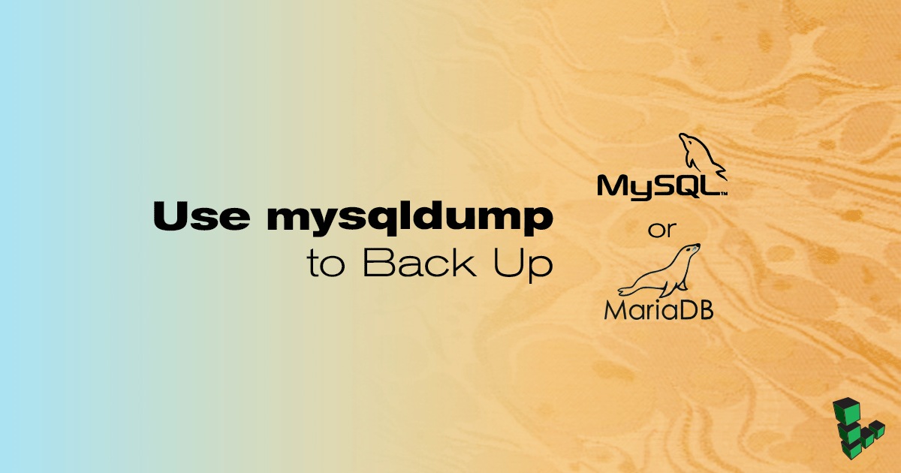

---
author:
  name: Linode
  email: docs@linode.com
description: 'Use mysqldump to back up MySQL databases, tables, or entire database management systems.'
keywords: ["mysql", "mariadb", "backup", "back up", "mysqldump"]
license: '[CC BY-ND 4.0](https://creativecommons.org/licenses/by-nd/4.0)'
aliases: ['databases/mysql/backup-options/','security/backups/back-up-your-mysql-databases/','databases/mysql/back-up-your-mysql-databases/']
published: 2018-01-30
modified: 2018-01-30
modified_by:
  name: Linode
title: 'Use mysqldump to Back Up MySQL or MariaDB'
external_resources:
 - '[MySQL Database Backup Methods page](http://dev.mysql.com/doc/refman/5.1/en/backup-methods.html)'
 - '[mysqldump - A Database Backup Program, MySQL Reference Manual](https://dev.mysql.com/doc/refman/5.7/en/mysqldump.html)'
---

[MySQL](http://www.mysql.com/) and [MariaDB](https://mariadb.com/) include the [mysqldump](https://dev.mysql.com/doc/refman/5.7/en/mysqldump.html) utility to simplify the process to create a backup of a database or system of databases. Using `mysqldump` creates a *logical backup*. **You can only use this tool if your database process is accessible and running.**

If your database isn't accessible for any reason, you can instead create a [*physical backup*](/docs/databases/mysql/create-physical-backups-of-your-mariadb-or-mysql-databases/), which is a copy of the filesystem structure which contains your data.

The instructions in this guide apply to both MySQL and MariaDB. For simplification, the name MySQL will be used to apply to either.

## Before You Begin

-  You will need a working MySQL or MariaDB installation, and a database user to run the backup. For help with installation, see the [Linode MySQL documentation](/docs/databases/mysql/).

-  You will need root access to the system, or a user account with `sudo` privileges.

## Back up a Database

The `mysqldump` command’s general syntax is:

    mysqldump -u [username] -p [databaseName] > [filename]-$(date +%F).sql

* `mysqldump` prompts for a password before it starts the backup process.
* Depending on the size of the database, it could take a while to complete.
* The database backup will be created in the directory the command is run.
* `-$(date +%F)` adds a timestamp to the filename.

Example use cases include:

* Create a backup of an entire Database Management System (DBMS):

        mysqldump --all-databases --single-transaction --quick --lock-tables=false > full-backup-$(date +%F).sql -u root -p

* Back up a specific database. Replace `db1` with the name of the database you want to back up:

        mysqldump -u username -p db1 --single-transaction --quick --lock-tables=false > db1-backup-$(date +%F).sql

* Back up a single table from any database. In the example below, `table1` is exported from the database `db1`:

        mysqldump -u username -p --single-transaction --quick --lock-tables=false db1 table1 > db1-table1-$(date +%F).sql

Here's a breakdown of the `mysqldump` command options used above:

-  `--single-transaction`: Issue a BEGIN SQL statement before dumping data from the server.
-  `--quick`: Enforce dumping tables row by row. This provides added safety for systems with little RAM and/or large databases where storing tables in memory could become problematic.
-  `--lock-tables=false`: Do not lock tables for the backup session.

## Automate Backups with cron

Entries can be added to `/etc/crontab` to regularly schedule database backups.

1.  Create a file to hold the login credentials of the MySQL root user which will be performing the backup. Note that the system user whose home directory this file is stored in can be unrelated to any MySQL users.

    
[client]
user = root
password = MySQL root user's password


2.  Restrict permissions of the credentials file:

        chmod 600 /home/example_user/.mylogin.cnf

3. Create the cron job file. Below is an example cron job to back up the entire database management system every day at 1am:

    
0 1 * * * /usr/bin/mysqldump --defaults-extra-file=/home/example_user/.my.cnf -u root --single-transaction --quick --lock-tables=false --all-databases > full-backup-$(date +\%F).sql


    For more information on cron, see the [cron(8)](https://linux.die.net/man/8/cron) and [cron(5)](https://linux.die.net/man/5/crontab) manual pages.

## Restore a Backup

The restoration command's general syntax is:

    mysql -u [username] -p [databaseName] < [filename].sql

* Restore an entire DBMS backup. You will be prompted for the MySQL root user's password:\
  **This will overwrite all current data in the MySQL database system**

        mysql -u root -p < full-backup.sql

* Restore a single database dump. An empty or old destination database must already exist to import the data into, and the MySQL user you're running the command as must have write access to that database:

        mysql -u [username] -p db1 < db1-backup.sql

* Restore a single table, you must have a destination database ready to receive the data:

        mysql -u dbadmin -p db1 < db1-table1.sql
