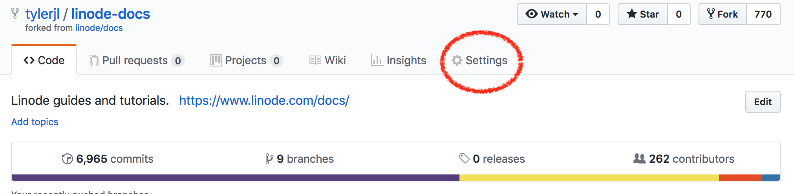
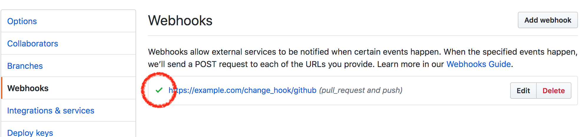
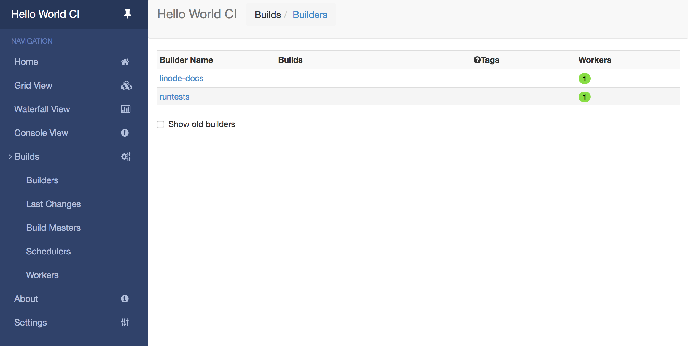

---
author:
  name: Tyler Langlois
  email: ty@tjll.net
description: 'This tutorial will explain how to install, configure, and use Buildbot as a continuous integration platform, as well as how to write configuration for custom testing builds.'
og_description: 'Deploy self-hosted continuous integration using Buildbot.'
keywords: ["buildbot", "testing", "python", "continuous integration", "ci", "build", "qa"]
license: '[CC BY-ND 4.0](https://creativecommons.org/licenses/by-nd/4.0)'
modified: 2018-08-26
modified_by:
  name: Linode
published: 2018-08-26
title: How to Use Buildbot for Software Testing on Ubuntu 18.04
external_resources:
- '[Buildbot Tutorial](http://docs.buildbot.net/current/tutorial/)'
- '[Buildbot Documentation](http://docs.buildbot.net/current/index.html)'
---

[Buildbot](https://buildbot.net/) is an open source, modern system for testing software projects.

In this guide, you will set up your own self-hosted Buildbot server you can use to serve as a continuous integration platform to test code. Much like some hosted solutions like Travis CI, Buildbot can act as a automated testing platform to watch for code changes, test a project, and send notifications regarding build failures.

## Before you Begin

1.  Familiarize yourself with Linode's [Getting Started](/docs/getting-started/) guide and complete the steps for deploying and setting up a Linode running Ubuntu 18.04, including setting the hostname and timezone.

1.  This guide uses `sudo` wherever possible. Complete the sections of our [Securing Your Server](/docs/security/securing-your-server/) guide to create a standard user account, harden SSH access and remove unnecessary network services.

1.  Complete the [Add DNS Records](/docs/websites/set-up-web-server-host-website/#add-dns-records) steps to register a domain name that will point to your Linode instance hosting Buildbot.

    
Replace each instance of example.com in this guide with your Buildbot site's domain name.


1.  Ensure your system is up to date:

        sudo apt update && sudo apt upgrade

1.  Your Buildbot site will serve its content over HTTPS, so you will need to obtain an SSL/TLS certificate. Use [Certbot](https://certbot.eff.org/) to request and download a free certificate from [Let's Encrypt](https://letsencrypt.org/):

        sudo apt install software-properties-common
        sudo add-apt-repository ppa:certbot/certbot
        sudo apt update
        sudo apt install certbot
        sudo certbot certonly --standalone -d example.com

    These commands will download a certificate to `/etc/letsencrypt/live/example.com/` on your Linode.

## Install Buildbot

Buildbot is a [Python](https://www.python.org/) application, so this guide will set up a standalone Python environment using a [virtualenv](https://virtualenv.pypa.io/en/stable/) in order to simplify installation. Once the virtualenv is set up, Buildbot will be run via the independent `python` executable in the virtualenv.

### Setup Python virtualenvs

1.  Install the necessary prerequisite packages to acquire virtualenv and build tools:

        sudo apt-get install -y build-essential python3-dev python3-venv

1.  Two Python processes will run for Buildbot: once for the master, which coordinates running builds, and another for a worker, which will execute builds. Although you can create the Buildbot worker on a separate host to scale out a deployment of Buildbot, this guide will setup both the master and worker on the same host.

1.  First, create a dedicated directory for the Buildbot master and install a virtualenv into the directory:

        mkdir -p buildbot-master
        python3 -m venv buildbot-master/venv

1.  Now do the same for a dedicated worker directory:

        mkdir -p buildbot-worker
        python3 -m venv buildbot-worker/venv

### Install Buildbot Master

With the Python virtualenvs set up, continue to first set up the Buildbot master.

1.  First, activate the Buildbot master virtualenv. This will set up the shell environment to use the local Python virtualenv.

        cd buildbot-master
        source venv/bin/activate

1.  Install the `buildbot[bundle]` Python package:

        pip install 'buildbot[bundle]'

1.  The `buildbot` executable is now available in the virtualenv and ready to use. First, set up a new master configuration with the following command:

        buildbot create-master master

1.  The generated master configuration file can be found at `master/master.cfg.sample`. Copy this default configuration to the path that Buildbot expects for its configuration file:

        cp master/master.cfg.sample master/master.cfg

### Configure Buildbot Master

The `buildbot create-master master` command installed a default configuration file, but in order to secure and customize the Buildbot master configuration, a few settings should be changed before using the application. All the following changed settings should be applied to `buildbot-master/master/master.cfg`.

Buildbot has a number of concepts that are represented in the master build configuration. Open this file in your text editor (such as vim, emacs, nano, or another) and browse the Buildbot configuration. Unlike some configuration files, the Buildbot configuration is written in Python instead of a markup language like Yaml.

1.  Generate a random string to serve as the password that workers will use to authenticate against the Buildbot master. This is easily accomplished by using `openssl` to create a random sequence of characters:

        openssl rand -hex 16
        <a random string>

1.  Using this password, update the following line, replacing `pass` with the randomly-generated password:

        c['workers'] = [worker.Worker("example-worker", "<replace 'pass' here>")]

1.  If desired, change the name of this Buildbot installation:

        c['title'] = "My CI"

1.  Change the URL of this Buildbot installation in the configuration file to reflect where this instance of Buildbot is installed. Using `example.com` as an example, change the `titleURL` config option:

        c['titleURL'] = "https://example.com"

    As well as the `buildbotURL` option:

        c['buildbotURL'] = "https://example.com/"

    These options assume that you will use a custom domain secured with Let's Encrypt certificates from `certbot` as outlined in this guide's prerequisites.

1.  Configure users for the Buildbot master web interface, replacing username and password values with those of your choosing:

        c['www']['authz'] = util.Authz(
                allowRules = [
                    util.AnyEndpointMatcher(role="admins")
                ],
                roleMatchers = [
                    util.RolesFromUsername(roles=['admins'], usernames=['myusername'])
                ]
        )
        c['www']['auth'] = util.UserPasswordAuth([('myusername','<password>')])

1.  Buildbot supports building repositories based upon GitHub activity, so prepare Buildbot to receive GitHub webhooks by first generating a random string to serve as a webhook secret in a similar way as the worker password was generated previously:

        openssl rand -hex 16
        <a random string>

1.  Then, using this value in place of `<webhook secret>` in the configuration snippet below, configure Buildbot to recognize GitHub webhooks as a change source by appending the following configuration to the end of the `master.cfg` file:

        c['www']['change_hook_dialects'] = {
            'github': {
                'secret': '<webhook secret>',
            }
        }

1.  Finally, start the Buildbot master. This command will start Buildbot in the background.

        buildbot start master

### Setup Buildbot Master Web Interface

Although Buildbot is now running, it is listening over plain HTTP without encryption, and is thus insecure. Using your Let's Encrypt certificate, nginx can be configured to terminate SSL and reverse proxy traffic to the Buildbot master process.

1.  Install nginx:

        sudo apt-get install -y nginx

1.  Now configure nginx to talk to the local Buildbot port. Nginx will listen for SSL traffic using the Let's Encrypt certificate for your domain:

    
server {
        # Enable SSL and http2
        listen 443 ssl http2 default_server;

        server_name example.com;

        root html;
        index index.html index.htm;

        ssl on;
        ssl_certificate /etc/letsencrypt/archive/example.com/fullchain.pem;
        ssl_certificate_key /etc/letsencrypt/archive/example.com/privkey.pem;

        # put a one day session timeout for websockets to stay longer
        ssl_session_cache      shared:SSL:10m;
        ssl_session_timeout  1440m;

        ssl_protocols TLSv1.2 TLSv1.3;
        ssl_ciphers ECDHE-RSA-AES256-GCM-SHA512:DHE-RSA-AES256-GCM-SHA512:ECDHE-RSA-AES256-GCM-SHA384:DHE-RSA-AES256-GCM-SHA384:ECDHE-RSA-AES256-SHA384;
        ssl_prefer_server_ciphers   on;

        # force https
        add_header Strict-Transport-Security "max-age=31536000; includeSubdomains;";
        spdy_headers_comp 5;

        proxy_set_header HOST $host;
        proxy_set_header X-Real-IP $remote_addr;
        proxy_set_header X-Forwarded-For $proxy_add_x_forwarded_for;
        proxy_set_header X-Forwarded-Proto  $scheme;
        proxy_set_header X-Forwarded-Server  $host;
        proxy_set_header X-Forwarded-Host  $host;

        location / {
            proxy_pass http://127.0.0.1:8010/;
        }
        location /sse/ {
            # proxy buffering will prevent sse to work
            proxy_buffering off;
            proxy_pass http://127.0.0.1:8010/sse/;
        }
        location /ws {
            proxy_http_version 1.1;
            proxy_set_header Upgrade $http_upgrade;
            proxy_set_header Connection "upgrade";
            proxy_pass http://127.0.0.1:8010/ws;
            # raise the proxy timeout for the websocket
            proxy_read_timeout 6000s;
        }
}


1.  Restart nginx to apply the Buildbot reverse proxy configuration:

        sudo systemctl restart nginx

1.  Navigate to your host's domain name over HTTPS, which should render the following interface:

    

Congratulations! Your continuous integration test server is up and running. You may now deactivate the virtualenv and leave the Buildbot master directory.

    deactivate
    cd ..

Before proceeding, be sure to log in to the Buildbot interface (over HTTPS) in order to have sufficient permissions to view builds and workers.

### Install Buildbot Worker

In order for Buildbot to execute test builds, the Buildbot master will require a worker. The following steps will setup a worker on the same host as the master.

1.  Activate the Buildbot worker virtualenv which was previously setup:

        cd buildbot-worker
        source venv/bin/activate

1.  Install the `buildbot-worker` Python package into the virtualenv:

        pip install buildbot-worker

1.  Now create the configuration directory for a Buildbot worker, replacing `<worker password>` with the password generated for workers in the master configuration file:

        buildbot-worker create-worker worker localhost example-worker <worker password>

1.  At this point the Buildbot worker is configured and ready to connect to the Buildbot master. Start the worker process now:

        buildbot-worker start worker

1.  Confirm that the worker has connected to the Buildbot master process. Check the master logs to see worker connection messages:

        grep -i worker ../buildbot-master/master/twistd.log

    You should see messages similar to the following:

        2018-08-26 18:19:36+0000 [Broker,0,127.0.0.1] worker 'example-worker' attaching from IPv4Address(type='TCP', host='127.0.0.1', port=60836)

    In addition, from the Buildbot web interface, you can confirm that the worker has connected by navigating to Builds -> Workers in the sidebar:

    

1.  Clean up your shell environment by deactivating the virtualenv and leaving the `buildbot-worker` directory:

        deactivate
        cd ..

## Configuring Builds

With Buildbot installed, you can now configure it to run builds. In this tutorial, we will use a forked GitHub repository for the [Linode Guides and Tutorials repository](https://github.com/linode/docs) as an example project to illustrate how to use Buildbot as a system to run tests against the repository.

### Configuring GitHub

Before creating the build configuration, fork the `linode/docs` repository into your GitHub account, which will be the repository used from this point forward to run tests against. The repository will also require webhooks to be configured to send push or PR events to Buildbot.


The actions you take to fork, add webhook, and push changes to your fork of `linode/docs` will not affect the parent (or upstream) repository and can be safely experimented with. Any changes you make to branches of your fork will remain separate until you submit a pull request to the original `linode/docs` repository.


#### Forking and Configuring the Repository

While logged in to GitHub, browse to https://github.com/linode/docs. and click the "Fork" button:

After selecting the "Fork" button, choose the account to fork the repository into (typically just your username). GitHub should bring you to the page for your fork of the `linode/docs` repository. Select "Settings" to browse your fork's settings, then select "Webhooks" from the sidebar.

Select "Add Webhook" from the following page. There are several fields here to populate:

* Under "Payload URL" enter the domain name for your Buildbot server with the URL path `/change_hook/github` appended to it, for example:
  * https://example.com/change_hook/github
* Leave "Content type" as the default value (application/x-www-form-urlencoded)
* Under the "Secret" field, enter the value that you configured in `master.cfg` under `<webhook secret>`
* Leave "Enable SSL Verification" selected
* For "Which events would you like to trigger this webhook?", select "Let me select individual events" and ensure that only the following boxes are checked:
  * Pull requests
  * Pushes
* Leave "Active" selected to indicate GitHub should be configured to send webhooks to Buildbot.

Save your webhook. After saving, GitHub should return your browser to the list of webhooks for your repository. After configuring a new webhook, GitHub will send a test webhook to the configured payload URL, and will indicate whether GitHub was able to send a webhook without errors by adding a checkmark to the webhook item:

Congratulations! GitHub is ready to send new pushes to your fork to your instance of Buildbot.

### Build Prerequisites

Although Buildbot supports executing builds within Docker, to keep this setup simple, builds will be run as a simple process on the Buildbot worker.

Most software projects will have several prerequisites listed that are required to build and run tests for a project. At the time of this writing, the Linode Guides and Tutorials repository has a couple of different tests, but this example will use a script called `blueberry.py` in order to perform several checks including looking for broken links, missing images, and more.

Because we have already installed Python and virtualenv, the prerequisites for running this suite of tests is already present on the build worker, so we can proceed to configuring the Buildbot master to reference the `linode/docs` repository with associated build instructions.

### Writing Builds

There are a few sections within the `buildbox-master/master/master.cfg` file that are used to configure builds. These sections in the configuration include:

* `workers`, which define which worker executors the master will connect to in order to run builds
* `schedulers`, which define when and why builds are executed
* `builders`, which define the steps to run and build tests

Because our worker has already been configured and connected to our Buildbot master, the only settings necessary to define a custom build for our purposes are the `schedulers` and `builders` fields.

To begin, append the following lines to the end of `buildbot-master/master/master.cfg`:

    
docs_blueberry_test = util.BuildFactory()
# Clone the repository
docs_blueberry_test.addStep(
    steps.Git(
        repourl='git://github.com/linode/docs.git',
        mode='incremental'))
# Create virtualenv
docs_blueberry_test.addStep(
    steps.ShellCommand(
        command=["python3", "-m", "venv", ".venv"]))
# Install test dependencies
docs_blueberry_test.addStep(
    steps.ShellCommand(
        command=["./.venv/bin/pip", "install", "-r", "ci/requirements.txt"]))
# Run tests
docs_blueberry_test.addStep(
    steps.ShellCommand(
        command=["./.venv/bin/python3", "ci/blueberry.py"]))
# Add the BuildFactory configuration to the master
c['builders'].append(
    util.BuilderConfig(name="linode-docs",
      workernames=["example-worker"],
      factory=docs_blueberry_test))


This configuration code does the following:

* First, a new Build Factory is instantiated. Build Factories define how builds are run.
* Steps are then added to the Build Factory, in order. To begin, the `linode/docs` GitHub repository is cloned.
* Next, a Python virtualenv is setup. This ensures that the dependencies and libraries used for testing are sanboxed and kept separate from the Python libraries on the worker machine.
* Necessary Python packages used in testing are then installed into the build's virtualenv.
* Finally, the `blueberry.py` testing script is executing using the sanboxed `python3` executable from the virtualenv.
* With the Build Factory defined, it must be added to the configuration for the master.

Next, define a simple scheduler to build any branch that is pushed to the GitHub repository. This is a fairly simple scheduler definition, add it to the end of `master.cfg`:

    
c['schedulers'].append(schedulers.AnyBranchScheduler(
    name="build-docs",
    builderNames=["linode-docs"]))


This simply instructs the Buildbot master to create a scheduler that will build any branch for the `linode-docs` builder (which was just created). This scheduler will be invoked by the change hook defined previously for GitHub, which is triggered by the GitHub webhook configured in the GitHub interface.

### Running Builds

With a custom scheduler and builder defined, the Buildbot master can be reloaded. Enter the Buildbot master directory and issue the command to reconfigure the master:

    cd buildbot-master
    ./venv/bin/buildbot reconfig master

The web interface should reflect the new build and scheduler. Select Build -> Builders from the sidebar, which should return a page with `linode-docs` listed:

At this point, a new build can be started for the `linode-docs` builder. Recall that the GitHub webook configuration for your fork of `linode/docs` is set to call Buildbot upon any push or pull request event. To demonstrate how this works, clone your fork of the `linode/docs` repository locally on your local machine (do not run the following commands on your Buildbot server):

    git clone git@github.com:<username>/<repository>
    cd <repository>

Because git repositories change often, you should start at a revision in the code in a known state to ensure that the remaining instructions still function as intended. Check out revision `76cd31a5271b41ff5a80dee2137dcb5e76296b93`:

    git checkout 76cd31a5271b41ff5a80dee2137dcb5e76296b93

Next, create a branch starting at this revision in which to create dummy commits and test your Buildbot master's functionality.

    git checkout -b linode-tutorial-demo

At this point, you can create an empty commit in order to have something to push to your fork:

    git commit --allow-empty -m 'Buildbot test'

Finally, push your branch to your forked remote repository:

    git push --set-upstream origin linode-tutorial-demo

Now open the Buildbot web interface and navigate to your running builds. The "Home" button on the sidebar will show currently executing builds. Click on the running build to view more details about the running build, and each step along with logging output will be represented in the interface.

Each step of the build process can be followed as the build progresses. As the steps progress, each can be clicked to view standard output logs, and each step should complete successfully until the build finishes.
