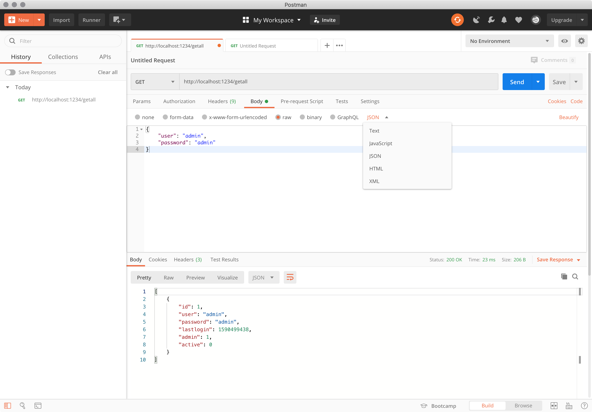
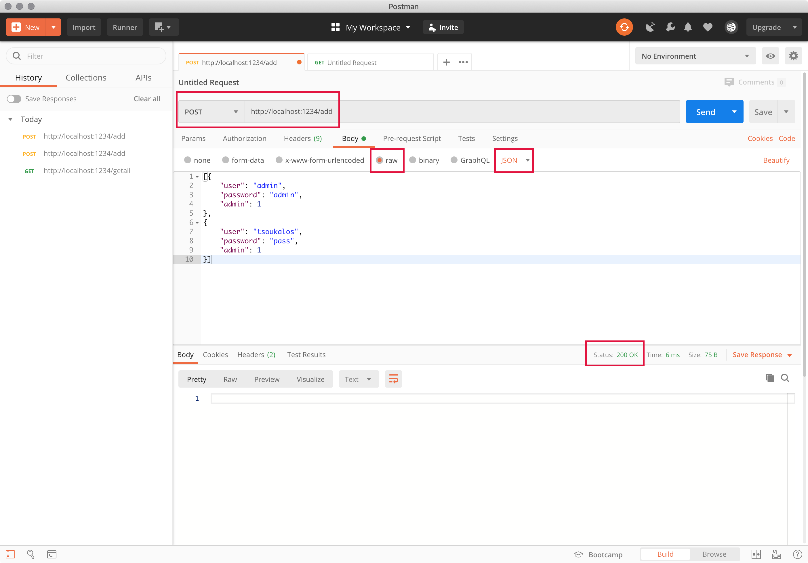
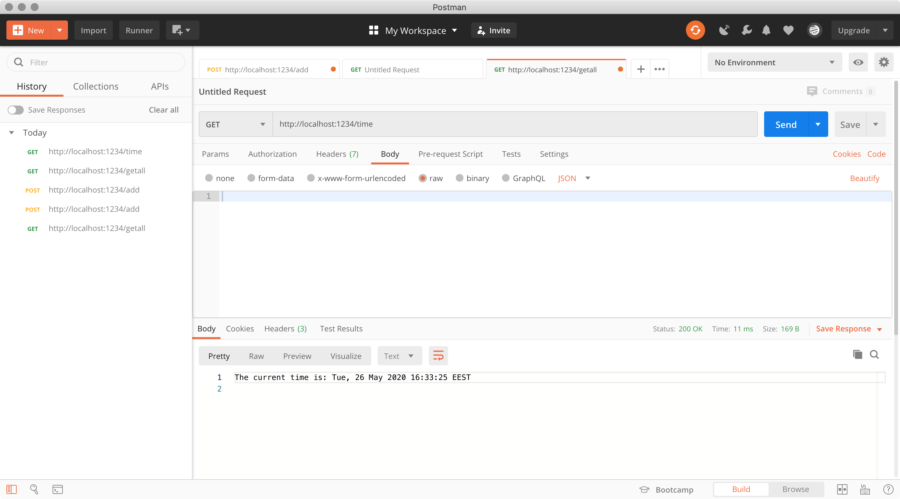
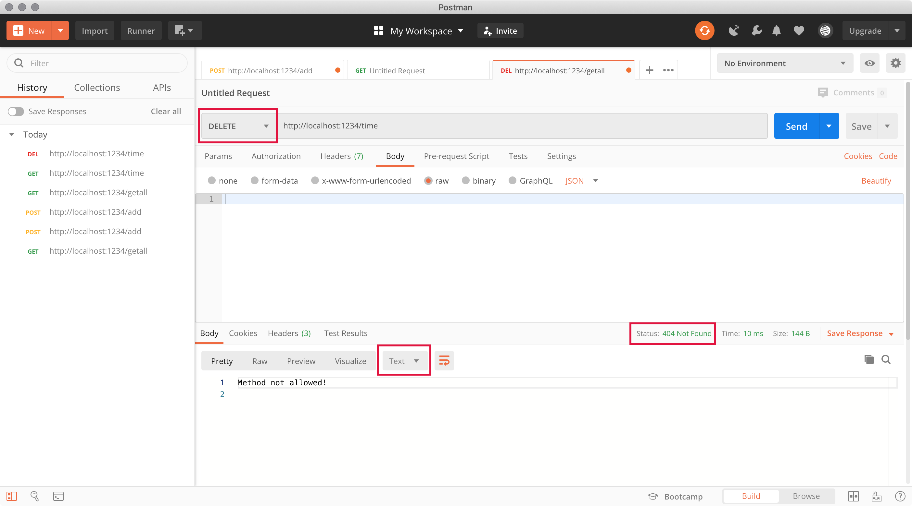
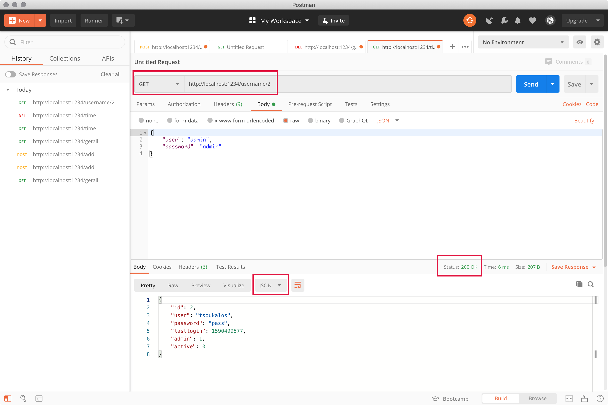
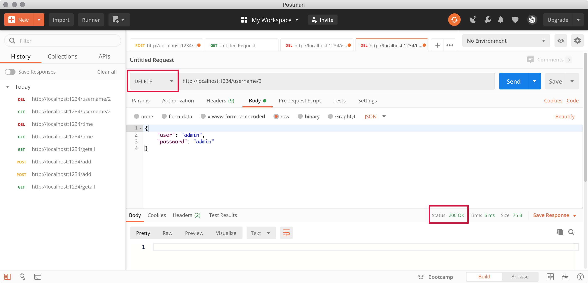

---
author:
  name: Mihalis Tsoukalos
  email: mihalistsoukalos@gmail.com
description: 'Programming a REST API client as a command line utility in Go'
keywords: ["UNIX", "REST API", "client", "Go", "Golang", "cobra"]
license: '[CC BY-ND 4.0](https://creativecommons.org/licenses/by-nd/4.0)'
published: 2020-05-27
modified_by:
  name: Linode
title: 'Learn how to develop a client for a RESTful server in Go'
contributor:
  name: Mihalis Tsoukalos
  link: https://www.mtsoukalos.eu/
external_resources:
  - '[Go Programming Language](https://golang.org/)'
  - '[Mastering Go, 2nd edition](https://www.packtpub.com/programming/mastering-go-second-edition)'
  - '[List of HTTP status codes](https://en.wikipedia.org/wiki/List_of_HTTP_status_codes)'
  - '[Postman](https://www.postman.com/)'
  - '[Go validator package](https://github.com/go-playground/validator)'
  - '[The cobra Go package](https://github.com/spf13/cobra)'
  - '[The viper Go package](https://github.com/spf13/viper)'
  - '[About the Cobra Generator](https://github.com/spf13/cobra/blob/master/cobra/README.md)'
---

## Introduction

In this guide you will learn how to implement in Go a client for the RESTful server that was developed in the previous guide. Additionally, you will learn how to use Postman for testing RESTful servers and use the Cobra Go package for developing command line utilities with commands and command line flags. The biggest advantage from having a command line utility is that you can create scripts and automate tasks – no graphical application can give you that opportunity.


This guide is written for a non-root user. Depending on your configuration, some commands might require the help of `sudo` in order to get property executed. If you are not familiar with the `sudo` command, see the [Users and Groups](/docs/tools-reference/linux-users-and-groups/) guide.


In this guide you will learn how to:

- Develop the structure of a command line application in Go using the Cobra Go package
- Create a client that can communicate with the desired RESTful server (developed in the previous guide)
- Use Postman as a client for testing RESTful servers
- Write better validation functions

## Before You Begin

To run the examples in this guide, your workstation or server will need to have Go installed, and the `go` CLI will need to be set in your terminal’s `PATH`. If you install Go using the Linux package manager that comes with your Linux distribution, you will most likely not need to worry about setting the `PATH` environment variable.


This guide was written with Go version 1.14.


### Developing the client utility

It is generally easier to begin your RESTful client by specifying the commands that will support. Then, you should decide on the parameters of each command, which depends on the respective server endpoint. Note that all these decisions are based on the endpoints of the REST API that will be used. After you have finished with your design, you can begin implementing each command individually. Last, have in mind that you can add as many commands as you want at any time you want – `cobra` will help you with that. However, it is generally considered a good practice to have a good idea of what you are going to develop before you begin writing actual Go code.

### The List of Supported Endpoints

As a quick reminder, the presented REST API client will support the following endpoints and HTTP request methods on the server side:

| Resource | `POST` | `GET`  | `PUT` | `DELETE` |
| --------- | ------ | ------ | ----- | -------- |
| `/getall` | NO | YES | NO | NO |
| `/logged` | NO | YES | NO | NO |
| `/time` | NO | YES | NO | NO |
| `/getid` | NO | YES | NO | NO |
| `update` | NO | NO | YES | NO |
| `/username/id` | NO | YES | NO | YES |
| `/` | YES | YES | YES | YES |
| `/add` | YES | NO | NO | NO |
| `/login` | YES | NO | NO | NO |
| `/logout` | YES | NO | NO | NO |

Each one of the endpoints will have **a separate command** in the implementation of the command line utility. The only exception to this rule will be the `/username/id` endpoint that supports two HTTP methods and therefore will have two commands. A different kind of exception is the `/` endpoint, which will not be supported by the client utility.

Note that it is the job of the server to deny serving a request when the HTTP method is wrong – however, the client should try to send correctly defined requests as often as possible.

### About Cobra

The [cobra](https://github.com/spf13/cobra) Go package can help you create professional command line utilities in Go. You should install the `cobra` package or update it to the latest version, by executing the following command:

    go get -u github.com/spf13/cobra/cobra

Among other dependencies, cobra will also install the [`viper` package](https://github.com/spf13/viper) that allows you to work with command line arguments and options and is a replacement for the `flag` package of the standard Go library.

### Creating the commands of the Utility

In this section we are going to create the commands of the utility. First, you will need to create the root directory of the utility by issuing the next command:

    ~/go/bin/cobra init --pkg-name github.com/mactsouk/client client


Using config file: /Users/mtsouk/.cobra.yaml
Your Cobra application is ready at
/Volumes/myData/lenses/rest-go/client


The contents of `~/.cobra.yaml`, which you should create before issuing `cobra init`, are as following:


author: Mihalis Tsoukalos <mihalistsoukalos@gmail.com>
license: none


If there is no `~/.cobra.yaml` file, the `cobra` command will still be successfully executed using its default values.

In the root directory of the Cobra project, there is a file named `main.go`. From now on, you can execute `go run main.go` on the root directory of the Cobra project in order to test your utility. However, Cobra will expect to find a package named `github.com/mactsouk/client`, which is the value of the `--pkg-name` parameter, which you will need to update and download using `go get -u github.com/mactsouk/client` each time you make changes to the source files found in the `cmd` directory.

If you try to execute `go run main.go` without having the `client` package on your machine, you will get the next error message:


main.go:7:8: cannot find package "github.com/mactsouk/client/cmd" in any of:
  /usr/local/Cellar/go/1.14.3/libexec/src/github.com/mactsouk/client/cmd (from $GOROOT)
  /Users/mtsouk/go/src/github.com/mactsouk/client/cmd (from $GOPATH)


If you execute `go get -u github.com/mactsouk/client` and rerun `go run main.go` everything will work.

You can continue using the `cobra` utility that resides in `~/go/bin` to create the basic code structure based on the commands that will be supported. This will save you from having to write a great amount of basic code related to the structure of the utility.

You should begin by executing the following commands inside the root directory of the utility (`client`):

    ~/go/bin/cobra add time
    ~/go/bin/cobra add getall
    ~/go/bin/cobra add getid
    ~/go/bin/cobra add update
    ~/go/bin/cobra add logged
    ~/go/bin/cobra add login
    ~/go/bin/cobra add logout
    ~/go/bin/cobra add delete
    ~/go/bin/cobra add add
    ~/go/bin/cobra add userinfo


Cobra requires that you use `camelCase` and not `snake_case` or `snake-case` as command names.


After executing the last command from the aforementioned list, you will have the following contents in the project directory, as seen by the output of the `tree(1)` command:

    tree


.
├── LICENSE
├── README.md
├── cmd
│   ├── add.go
│   ├── delete.go
│   ├── getall.go
│   ├── getid.go
│   ├── logged.go
│   ├── login.go
│   ├── logout.go
│   ├── root.go
│   ├── time.go
│   ├── update.go
│   └── userinfo.go
└── main.go

1 directory, 14 files


Each source file contains copyright data that you can delete. Additionally, each command has a description generated by the `cobra` binary that we will need to change to represent the actual functionality of the command. Last, note that we will need to include the `handlers` package that was developed in the previous guide because we want to share the structure definitions found there as we are going to use them in the client utility.

### Adding Command Line Flags

The important thing here is that the `username` and the `password` of the user that issues a command will be passed as command line options using `--username` and `--password`, respectively. These two options will also have shorthands named `-u` and `-p`, respectively. For the commands that need extra data, the user will have to pass a JSON record as a command line argument. If a command does not require the use of `username` and `password`, it will not matter whether you put them or not – this mainly applies to the `/time` endpoint and the `time` command.


Should you wish to do so, the best place to validate your input is inside the function that implements a command, which in the case of `cobra` resides in a separate source file - this saves you from having to find a way to execute commands such as `time` that do not require any username and password information. However, as such a process will be repeated many times, it is also good to create a function or method to validate your input before you begin communicating with the sever – the best place to put the implementation of such a function or method is `root.go` because it will automatically be available to the entire project. Our implementation does not need such validation functions. However, there exist some global variables defined in `root.go` that are associated to the **global** command line flags supported by the utility.


In this section, you will learn how to add support for global command line flags in the command line utility by editing the `./cmd/root.go` file. After these changes,the command line flags and their values will be available in all commands.

The final version of `./cmd/root.go` will be as follows:


/*
Copyright © 2020 Mihalis Tsoukalos <mihalistsoukalos@gmail.com>
*/

package cmd

import (
  "fmt"
  "os"

  "github.com/spf13/cobra"

  "github.com/mactsouk/handlers"
  homedir "github.com/mitchellh/go-homedir"
  "github.com/spf13/viper"
)

var cfgFile string

var UserData handlers.UserPass

var SERVER string
var PORT string
var USERNAME string
var PASSWORD string
var DATA string

// rootCmd represents the base command when called without any subcommands
var rootCmd = &cobra.Command{
  Use:   "client",
  Short: "A client for a RESTful server",
  Long:  `This utility is a client for a RESTful server`,
  // Uncomment the following line if your bare application
  // has an action associated with it:
  //	Run: func(cmd *cobra.Command, args []string) { },
}

// Execute adds all child commands to the root command and sets flags appropriately.
// This is called by main.main(). It only needs to happen once to the rootCmd.
func Execute() {
  if err := rootCmd.Execute(); err != nil {
    fmt.Println(err)
    os.Exit(1)
  }
}

func init() {
  cobra.OnInitialize(initConfig)

  rootCmd.PersistentFlags().StringVar(&cfgFile, "config", "", "config file (default is $HOME/.client.yaml)")
  rootCmd.PersistentFlags().StringVarP(&USERNAME, "username", "u", "", "Username issuing the command")
  rootCmd.PersistentFlags().StringVarP(&PASSWORD, "password", "p", "", "Password issuing the command")
  rootCmd.PersistentFlags().StringVarP(&DATA, "data", "d", "", "JSON record to be sent to the RESTful Server")
  rootCmd.PersistentFlags().StringVar(&SERVER, "server", "http://localhost", "RESTful server hostname")
  rootCmd.PersistentFlags().StringVar(&PORT, "port", ":1234", "Port of RESTful Server")

  // Cobra also supports local flags, which will only run
  // when this action is called directly.
  rootCmd.Flags().BoolP("toggle", "t", false, "Help message for toggle")
}

// initConfig reads in config file and ENV variables if set.
func initConfig() {
  if cfgFile != "" {
    // Use config file from the flag.
    viper.SetConfigFile(cfgFile)
  } else {
    // Find home directory.
    home, err := homedir.Dir()
    if err != nil {
      fmt.Println(err)
      os.Exit(1)
    }

    // Search config in home directory with name ".client" (without extension).
    viper.AddConfigPath(home)
    viper.SetConfigName(".client")
  }

  viper.AutomaticEnv() // read in environment variables that match

  // If a config file is found, read it in.
  if err := viper.ReadInConfig(); err == nil {
    fmt.Println("Using config file:", viper.ConfigFileUsed())
  }
}


So, you can define a new global flag using a version of `rootCmd.PersistentFlags()`, depending on the type of value you expect to get – this code goes into the `init()` function. For the `--username` flag, there is a call to `rootCmd.PersistentFlags().StringVarP()`. The first parameter of `rootCmd.PersistentFlags().StringVarP()` is the name of the global variable that will hold the value of the flag, which in this case is `USERNAME` and should already be defined in `root.go`.

## Implementing the Commands

In this section you will learn how the supported commands are implemented. The Go code of the client is divided in two logical parts. The first part is about creating a command line utility with the desired structure and support for the desired commands, whereas the second part is about implementing the desired functionality. Each supported endpoint has its own command, which is a rational way of developing the client utility of a RESTful server. Additionally, some commands will have their own *local* command line flags.

By default, the client utility will try to connect to `localhost` using port number `1234`. If you want to change the default behavior, you should use the `--server` and `--port` command line flags, respectively. The main reason for doing so is to save you from having to type long commands. Note that there is no shorthand for these two command line flags. On the other hand, the `--username` and `--password` flags, which are used very frequently, have the `-u` and `-p` shorthands, respectively.

### The time command

The `/time` command is for communicating with the `/time` endpoint that returns the current time on the server – it is the simplest command of all because there is no need for sending any credentials to the server. Its implementation can be found in the `./cmd/time.go` source file and is as follows:


/*
Copyright © 2020 Mihalis Tsoukalos <mihalistsoukalos@gmail.com>
*/

package cmd

import (
  "fmt"
  "io/ioutil"
  "net/http"
  "time"

  "github.com/spf13/cobra"
)

// timeCmd represents the time command
var timeCmd = &cobra.Command{
  Use:   "time",
  Short: "For the /time endpoint",
  Long:  `Visiting the /time endpoint with GET HTTP request`,
  Run:   TimeFunction,
}

// TimeFunction implements the functionality of the time command
func TimeFunction(cmd *cobra.Command, args []string) {
  req, err := http.NewRequest("GET", SERVER+PORT+"/time", nil)
  if err != nil {
    fmt.Println("Timefunction – Error in req: ", err)
    return
  }

  c := &http.Client{
    Timeout: 15 * time.Second,
  }

  resp, err := c.Do(req)
  if err != nil {
    fmt.Println(err)
    return
  }

  if resp == nil || (resp.StatusCode == http.StatusNotFound) {
    fmt.Println(resp)
    return
  }
  defer resp.Body.Close()

  data, _ := ioutil.ReadAll(resp.Body)
  fmt.Print(string(data))
}

func init() {
  rootCmd.AddCommand(timeCmd)
}


### The getall command

The `getall` command corresponds to the `/getall` endpoint of the RESTful server and has the following implementation:


/*
Copyright © 2020 Mihalis Tsoukalos <mihalistsoukalos@gmail.com>
*/

package cmd

import (
  "bytes"
  "fmt"
  "net/http"
  "time"

  "github.com/mactsouk/handlers"
  "github.com/spf13/cobra"
)

// getallCmd represents the getall command
var getallCmd = &cobra.Command{
  Use:   "getall",
  Short: "Returns a list of all users.",
  Long:  ``,
  Run:   GetAll,
}

func GetAll(cmd *cobra.Command, args []string) {
  userpass := handlers.UserPass{Username: USERNAME, Password: PASSWORD}

  // bytes.Buffer is both a Reader and a Writer
  buf := new(bytes.Buffer)
  err := userpass.ToJSON(buf)
  if err != nil {
    fmt.Println(err)
    return
  }

  req, err := http.NewRequest("GET", SERVER+PORT+"/getall", buf)
  if err != nil {
    fmt.Println("GetAll – Error in req: ", err)
    return
  }
  req.Header.Set("Content-Type", "application/json")

  c := &http.Client{
    Timeout: 15 * time.Second,
  }

  resp, err := c.Do(req)
  if err != nil {
    fmt.Println(err)
    return
  }

  if resp.StatusCode != http.StatusOK {
    fmt.Println(resp)
    return
  }
  defer resp.Body.Close()

  var users = []handlers.User{}
  handlers.SliceFromJSON(&users, resp.Body)
  data, err := handlers.PrettyJSON(users)
  if err != nil {
    fmt.Println(err)
    return
  }
  fmt.Print("Data: ", data)
}

func init() {
  rootCmd.AddCommand(getallCmd)
}


### The getid command

The `getid` command corresponds to the `/getid` endpoint of the RESTful server.


/*
Copyright © 2020 Mihalis Tsoukalos <mihalistsoukalos@gmail.com>
*/

package cmd

import (
  "bytes"
  "fmt"
  "io/ioutil"
  "net/http"
  "time"

  "github.com/mactsouk/handlers"
  "github.com/spf13/cobra"
)

// getidCmd represents the getid command
var getidCmd = &cobra.Command{
  Use:   "getid",
  Short: "Get the ID of a user given a handlers.UserPass structure.",
  Long:  ``,
  Run:   GetID,
}

func GetID(cmd *cobra.Command, args []string) {
  userpass := handlers.UserPass{Username: USERNAME, Password: PASSWORD}

  // bytes.Buffer is both a Reader and a Writer
  buf := new(bytes.Buffer)
  err := userpass.ToJSON(buf)
  if err != nil {
    fmt.Println(err)
    return
  }

  req, err := http.NewRequest("GET", SERVER+PORT+"/getid", buf)
  if err != nil {
    fmt.Println("GetID – Error in req: ", err)
    return
  }
  req.Header.Set("Content-Type", "application/json")

  c := &http.Client{
    Timeout: 15 * time.Second,
  }

  resp, err := c.Do(req)
  if err != nil {
    fmt.Println(err)
    return
  }

  if resp.StatusCode != http.StatusOK {
    fmt.Println("Full response:", resp)
    fmt.Println("Response code:", resp.StatusCode)
    return
  }
  data, err := ioutil.ReadAll(resp.Body)
  if err != nil {
    fmt.Println("GetID:", err)
    return
  }

  fmt.Print(string(data))
  defer resp.Body.Close()
}

func init() {
  rootCmd.AddCommand(getidCmd)
}


### The delete command

For the `delete` command we will need to define an additional command line flag that will be only available to the `delete` command and will be used by the client to get the User ID of the user that will be deleted. Local command line flags should be defined inside the source file that is used for the relevant command. In this case the `--id` local flag is defined using `deleteCmd.Flags()` – note that `deleteCmd` is the internal name of the `delete` command, hence the definition of the local flag.

This local flag can be seen in the help screen of the `delete` command:

    go run main.go delete --help


A brief description of your command

Usage:
  client delete [flags]

Flags:
  -h, --help     help for delete
      --id int   User ID (default -1)

Global Flags:
      --config string     config file (default is $HOME/.client.yaml)
  -d, --data string       JSON record to be sent to the RESTful Server
  -p, --password string   Password issuing the command
      --port string       Port of RESTful Server (default ":1234")
      --server string     RESTful server hostname (default "http://localhost")
  -u, --username string   Username issuing the command


The `delete` command corresponds to the `/username/<id>` endpoint and the `DELETE` HTTP method of the RESTful server. The implementation of the `delete` command is the following:


/*
Copyright © 2020 Mihalis Tsoukalos <mihalistsoukalos@gmail.com>
*/

package cmd

import (
  "bytes"
  "fmt"
  "net/http"
  "strconv"
  "time"

  "github.com/mactsouk/handlers"
  "github.com/spf13/cobra"
)

// deleteCmd represents the delete command
var deleteCmd = &cobra.Command{
  Use:   "delete",
  Short: "Deleting existing users from the system given the User ID.",
  Long:  ``,
  Run:   Delete,
}

func Delete(cmd *cobra.Command, args []string) {
  USERID, _ := cmd.Flags().GetInt("id")
  if USERID <= 0 {
    fmt.Println("User ID value should be greater than 0!", USERID)
    return
  }

  userpass := handlers.UserPass{Username: USERNAME, Password: PASSWORD}

  // bytes.Buffer is both a Reader and a Writer
  buf := new(bytes.Buffer)
  err := userpass.ToJSON(buf)
  if err != nil {
    fmt.Println(err)
    return
  }

  req, err := http.NewRequest("DELETE", SERVER+PORT+"/username/"+strconv.Itoa(USERID), buf)
  if err != nil {
    fmt.Println("GetAll – Error in req: ", err)
    return
  }
  req.Header.Set("Content-Type", "application/json")

  c := &http.Client{
    Timeout: 15 * time.Second,
  }

  resp, err := c.Do(req)
  if err != nil {
    fmt.Println(err)
    return
  }

  if resp.StatusCode != http.StatusOK {
    fmt.Println("Full response:", resp)
    fmt.Println("Response code:", resp.StatusCode)
    return
  }
  defer resp.Body.Close()
}

func init() {
  rootCmd.AddCommand(deleteCmd)
  deleteCmd.Flags().Int("id", -1, "User ID")
}


The local flag is defined in the `init()` function.

### The userinfo command

The `userinfo` command corresponds to the `/username/id` endpoint of the RESTful server and the `GET` HTTP method. Similarly to the `delete` command, the `userinfo` command will need to have an additional command line flag that will be only available to `userinfo` for the client utility to get the User ID that interests us. However, this time the local flag will be created using `userinfoCmd.Flags().Int` as the internal representation of the `userinfo` command is `userinfoCmd`.


/*
Copyright © 2020 Mihalis Tsoukalos <mihalistsoukalos@gmail.com>
*/

package cmd

import (
  "bytes"
  "fmt"
  "net/http"
  "strconv"
  "time"

  "github.com/mactsouk/handlers"
  "github.com/spf13/cobra"
)

// userinfoCmd represents the userinfo command
var userinfoCmd = &cobra.Command{
  Use:   "userinfo",
  Short: "This command returns the user information given a user ID.",
  Long:  ``,
  Run:   GetUserInfo,
}

func GetUserInfo(cmd *cobra.Command, args []string) {
  USERID, _ := cmd.Flags().GetInt("id")
  if USERID <= 0 {
    fmt.Println("User ID value should be greater than 0!", USERID)
    return
  }

  userpass := handlers.UserPass{Username: USERNAME, Password: PASSWORD}

  // bytes.Buffer is both a Reader and a Writer
  buf := new(bytes.Buffer)
  err := userpass.ToJSON(buf)
  if err != nil {
    fmt.Println(err)
    return
  }

  req, err := http.NewRequest("GET", SERVER+PORT+"/username/"+strconv.Itoa(USERID), buf)
  if err != nil {
    fmt.Println("GetUserInfo – Error in req: ", err)
    return
  }
  req.Header.Set("Content-Type", "application/json")

  c := &http.Client{
    Timeout: 15 * time.Second,
  }

  resp, err := c.Do(req)
  if err != nil {
    fmt.Println(err)
    return
  }

  if resp.StatusCode != http.StatusOK {
    fmt.Println("Full response:", resp)
    fmt.Println("Response code:", resp.StatusCode)
    return
  }

  var returnUser = handlers.User{}
  err = returnUser.FromJSON(resp.Body)
  if err != nil {
    fmt.Println("GetUserInfo:", err)
    return
  }

  t, err := handlers.PrettyJSON(returnUser)
  if err != nil {
    fmt.Println("PrettyJSON:", err)
    return
  }
  fmt.Println(t)
  defer resp.Body.Close()
}

func init() {
  rootCmd.AddCommand(userinfoCmd)
  userinfoCmd.Flags().Int("id", -1, "User ID")
}


### The login command

The `login` command corresponds to the `/login` endpoint of the RESTful server and is implemented as follows:


/*
Copyright © 2020 Mihalis Tsoukalos <mihalistsoukalos@gmail.com>
*/

package cmd

import (
  "bytes"
  "fmt"
  "net/http"
  "time"

  "github.com/mactsouk/handlers"
  "github.com/spf13/cobra"
)

// loginCmd represents the login command
var loginCmd = &cobra.Command{
  Use:   "login",
  Short: "Allows a user to log in into the system.",
  Long:  ``,
  Run:   Login,
}

func Login(cmd *cobra.Command, args []string) {
  userpass := handlers.UserPass{Username: USERNAME, Password: PASSWORD}

  // bytes.Buffer is both a Reader and a Writer
  buf := new(bytes.Buffer)
  err := userpass.ToJSON(buf)
  if err != nil {
    fmt.Println(err)
    return
  }

  req, err := http.NewRequest("POST", SERVER+PORT+"/login", buf)
  if err != nil {
    fmt.Println("Login – Error in req: ", err)
    return
  }
  req.Header.Set("Content-Type", "application/json")

  c := &http.Client{
    Timeout: 15 * time.Second,
  }

  resp, err := c.Do(req)
  if err != nil {
    fmt.Println(err)
    return
  }

  if resp.StatusCode != http.StatusOK {
    fmt.Println(resp)
    return
  }
  resp.Body.Close()
}

func init() {
  rootCmd.AddCommand(loginCmd)
}


### The logout command

The `logout` command corresponds to the `/logout` endpoint of the RESTful server.


/*
Copyright © 2020 Mihalis Tsoukalos <mihalistsoukalos@gmail.com>
*/

package cmd

import (
  "bytes"
  "fmt"
  "net/http"
  "time"

  "github.com/mactsouk/handlers"
  "github.com/spf13/cobra"
)

// logoutCmd represents the logout command
var logoutCmd = &cobra.Command{
  Use:   "logout",
  Short: "Allows a user to logout from the system.",
  Long:  ``,
  Run:   Logout,
}

func Logout(cmd *cobra.Command, args []string) {
  userpass := handlers.UserPass{Username: USERNAME, Password: PASSWORD}

  // bytes.Buffer is both a Reader and a Writer
  buf := new(bytes.Buffer)
  err := userpass.ToJSON(buf)
  if err != nil {
    fmt.Println(err)
    return
  }

  req, err := http.NewRequest("POST", SERVER+PORT+"/logout", buf)
  if err != nil {
    fmt.Println("Logout – Error in req: ", err)
    return
  }
  req.Header.Set("Content-Type", "application/json")

  c := &http.Client{
    Timeout: 15 * time.Second,
  }

  resp, err := c.Do(req)
  if err != nil {
    fmt.Println(err)
    return
  }

  if resp.StatusCode != http.StatusOK {
    fmt.Println(resp)
    return
  }
  resp.Body.Close()
}

func init() {
  rootCmd.AddCommand(logoutCmd)
}


### The update command

For the `update` command, the user that issues the command will give their credentials using `--username` and `--password` or their shorthands. The data for the new user that is going to be updated will be given in the command line as a JSON record using the global `--data` flag that also has the `-d` shorthand. We could have used a local flag for passing the JSON record to the utility but as this will be needed in the `add` command, we made it a global flag.

The `update` command corresponds to the `/update` endpoint of the RESTful server.


/*
Copyright © 2020 Mihalis Tsoukalos <mihalistsoukalos@gmail.com>
*/

package cmd

import (
  "bytes"
  "encoding/json"
  "fmt"
  "io/ioutil"
  "net/http"
  "time"

  "github.com/mactsouk/handlers"
  "github.com/spf13/cobra"
)

// updateCmd represents the update command
var updateCmd = &cobra.Command{
  Use:   "update",
  Short: "This command is for updating existing users.",
  Long:  ``,
  Run:   Update,
}

func Update(cmd *cobra.Command, args []string) {
  userpass := handlers.Input{Username: USERNAME, Password: PASSWORD, Admin: 0}

  if len(DATA) == 0 {
    fmt.Println("No user data:", DATA)
    return
  }

  // Convert load into handlers.Input Structure
  var newUserData handlers.Input
  temp := []byte(DATA)
  err := json.Unmarshal(temp, &newUserData)
  if err != nil {
    fmt.Println("Update – error umarshalling user input:", DATA)
    return
  }

  userSlice := []handlers.Input{}
  userSlice = append(userSlice, userpass)
  userSlice = append(userSlice, newUserData)

  // bytes.Buffer is both a Reader and a Writer
  buf := new(bytes.Buffer)
  err = handlers.SliceToJSON(userSlice, buf)
  if err != nil {
    fmt.Println(err)
    return
  }

  req, err := http.NewRequest("PUT", SERVER+PORT+"/update", buf)
  if err != nil {
    fmt.Println("GetID – Error in req: ", err)
    return
  }
  req.Header.Set("Content-Type", "application/json")

  c := &http.Client{
    Timeout: 15 * time.Second,
  }

  resp, err := c.Do(req)
  if err != nil {
    fmt.Println(err)
    return
  }

  if resp.StatusCode != http.StatusOK {
    fmt.Println("Full response:", resp)
    fmt.Println("Response code:", resp.StatusCode)
    return
  }
  data, err := ioutil.ReadAll(resp.Body)
  if err != nil {
    fmt.Println("GetID:", err)
    return
  }

  fmt.Print(string(data))
  defer resp.Body.Close()
}

func init() {
  rootCmd.AddCommand(updateCmd)
}


### The add command

For the `add` command, the user that issues the command will give their credentials using `--username` and `--password` or their shorthands. The data for the new user that is going to be created will be given in the command line as a JSON record using the `--data` flag that also has the `-d` shorthand. As we have discussed in the previous guide, there is no right and wrong method to pass the new user information - you could have used two more local command line flags instead of passing the JSON record as a command line argument.

The `add` command corresponds to the `/add` endpoint of the RESTful server and is implemented as follows:


/*
Copyright © 2020 Mihalis Tsoukalos <mihalistsoukalos@gmail.com>
*/

package cmd

import (
  "bytes"
  "encoding/json"
  "fmt"
  "io/ioutil"
  "net/http"
  "time"

  "github.com/mactsouk/handlers"
  "github.com/spf13/cobra"
)

// addCmd represents the add command
var addCmd = &cobra.Command{
  Use:   "add",
  Short: "Adding new users to the system.",
  Long:  `The input is in the handlers.Input format.`,
  Run:   Add,
}

func Add(cmd *cobra.Command, args []string) {
  userpass := handlers.Input{Username: USERNAME, Password: PASSWORD, Admin: 0}

  if len(DATA) == 0 {
    fmt.Println("No user data:", DATA)
    return
  }

  // Convert load into handlers.Input Structure
  var newUserData handlers.Input
  temp := []byte(DATA)
  err := json.Unmarshal(temp, &newUserData)
  if err != nil {
    fmt.Println("Add – error umarshalling user input:", DATA)
    return
  }

  userSlice := []handlers.Input{}
  userSlice = append(userSlice, userpass)
  userSlice = append(userSlice, newUserData)

  // bytes.Buffer is both a Reader and a Writer
  buf := new(bytes.Buffer)
  err = handlers.SliceToJSON(userSlice, buf)
  if err != nil {
    fmt.Println(err)
    return
  }

  req, err := http.NewRequest("POST", SERVER+PORT+"/add", buf)
  if err != nil {
    fmt.Println("GetID – Error in req: ", err)
    return
  }
  req.Header.Set("Content-Type", "application/json")

  c := &http.Client{
    Timeout: 15 * time.Second,
  }

  resp, err := c.Do(req)
  if err != nil {
    fmt.Println(err)
    return
  }

  if resp.StatusCode != http.StatusOK {
    fmt.Println("Full response:", resp)
    fmt.Println("Response code:", resp.StatusCode)
    return
  }
  data, err := ioutil.ReadAll(resp.Body)
  if err != nil {
    fmt.Println("GetID:", err)
    return
  }

  fmt.Print(string(data))
  defer resp.Body.Close()
}

func init() {
  rootCmd.AddCommand(addCmd)
}


### The logged command

The `logged` command corresponds to the `/logged` endpoint of the RESTful server and is implemented as follows:


/*
Copyright © 2020 Mihalis Tsoukalos <mihalistsoukalos@gmail.com>
*/

package cmd

import (
  "bytes"
  "fmt"
  "net/http"
  "time"

  "github.com/mactsouk/handlers"
  "github.com/spf13/cobra"
)

// loggedCmd represents the logged command
var loggedCmd = &cobra.Command{
  Use:   "logged",
  Short: "Returns the list of logged in users.",
  Long:  ``,
  Run:   LoggedUsers,
}

func LoggedUsers(cmd *cobra.Command, args []string) {
  userpass := handlers.UserPass{Username: USERNAME, Password: PASSWORD}

  // bytes.Buffer is both a Reader and a Writer
  buf := new(bytes.Buffer)
  err := userpass.ToJSON(buf)
  if err != nil {
    fmt.Println(err)
    return
  }

  req, err := http.NewRequest("GET", SERVER+PORT+"/logged", buf)
  if err != nil {
    fmt.Println("LoggedUsers – Error in req: ", err)
    return
  }
  req.Header.Set("Content-Type", "application/json")

  c := &http.Client{
    Timeout: 15 * time.Second,
  }

  resp, err := c.Do(req)
  if err != nil {
    fmt.Println(err)
    return
  }

  if resp.StatusCode != http.StatusOK {
    fmt.Println("Server response HTTP status code", resp.StatusCode)
    return
  }
  defer resp.Body.Close()

  var users = []handlers.User{}
  handlers.SliceFromJSON(&users, resp.Body)
  data, err := handlers.PrettyJSON(users)
  if err != nil {
    fmt.Println(err)
    return
  }
  fmt.Print("Data: ", data)
}

func init() {
  rootCmd.AddCommand(loggedCmd)
}


For the encoding of the input JSON records, we used the `bytes.Buffer` data type because it is both an `io.Reader` and an `io.Writer`. This happens because `handlers.ToJSON()` requires an `io.Writer` whereas `http.NewRequest()` needs to read its data from an `io.Reader`.

## Using the client

Provided that the RESTful server program is already running on `localhost` using port number `1234`, you are free to begin using the `client` utility to interact with the RESTful server. If you execute the utility without any command line arguments, you will get a nice help screen.

    go run main.go


This utility is a client for a RESTful server

Usage:
  client [command]

Available Commands:
  add         Adding new users to the system.
  delete      Deleting existing users from the system given the User ID.
  getall      Returns a list of all users.
  getid       Get the ID of a user given a handlers.UserPass structure.
  help        Help about any command
  logged      Returns the list of logged in users.
  login       Allows a user to log in into the system.
  logout      A brief description of your command
  time        For the /time endpoint
  update      This command is for updating existing users.
  userinfo    This command returns the user information given a user ID.

Flags:
      --config string     config file (default is $HOME/.client.yaml)
  -d, --data string       JSON record to be sent to the RESTful Server
  -h, --help              help for client
  -p, --password string   Password issuing the command
      --port string       Port of RESTful Server (default ":1234")
      --server string     RESTful server hostname (default "http://localhost")
  -t, --toggle            Help message for toggle
  -u, --username string   Username issuing the command

Use "client [command] --help" for more information about a command.


Note that if you want to create an executable binary, you should execute `go build`, which will create an executable file named `client` and that both the `-config` and `toggle` flags are introduced by Cobra.

Adding a new user with the tool is as simple as executing the next command:

    go run main.go --username admin --password admin add --data '{ "user": "mihalis", "password": "m", "admin": 0}'

The `add` command generates no output on success.

The utility can now display information about that user – as this is the first user that was added to the system, we know that the User ID will be `2`:

    go run main.go --username admin --password admin --id 2 userinfo


{
  "id": 2,
  "user": "mihalis",
  "password": "m",
  "lastlogin": 1590556788,
  "admin": 0,
  "active": 0
}


We can also see the list of users that reside in the database using the `getall` command:

    go run main.go --username admin --password admin getall


Data: [
  {
    "id": 1,
    "user": "admin",
    "password": "admin",
    "lastlogin": 1590556763,
    "admin": 1,
    "active": 0
  },
  {
    "id": 2,
    "user": "mihalis",
    "password": "m",
    "lastlogin": 1590556788,
    "admin": 0,
    "active": 0
  }
]


Logging in a user is as simple as executing the `login` command, which generates no output on success:

    go run main.go --username admin --password admin login

Deleting an existing user –with User ID `2`– can be done by executing the next command:

    go run main.go --username admin --password admin --id 2 delete

The debugging and informative output that will get from the RESTful server will be as follows:


2020/05/27 08:19:23 Writing to SQLite3: /tmp/users.db
2020/05/27 08:19:23 Emptying database table.
2020/05/27 08:19:23 Creating table from scratch.
2020/05/27 08:19:23 Populating /tmp/users.db
2020/05/27 08:19:23 Adding user: {-1 admin admin 1590556763 1 0}
2020/05/27 08:19:23 Listening to :1234
2020/05/27 08:19:48 Serving: /add from localhost:1234
2020/05/27 08:19:48 [{admin admin 0} {mihalis m 0}]
2020/05/27 08:19:48 Adding user: {-1 mihalis m 1590556788 0 0}
2020/05/27 08:20:43 Serving: /username/2 from localhost:1234
2020/05/27 08:20:43 Get User Data from SQLite3: 2
2020/05/27 08:20:43 Found user: {2 mihalis m 1590556788 0 0}
2020/05/27 08:22:02 Serving: /username/2 from localhost:1234
2020/05/27 08:22:02 Get User Data from SQLite3: 2
2020/05/27 08:22:02 Found user: {2 mihalis m 1590556788 0 0}
2020/05/27 08:24:17 Serving: /getall from localhost:1234
2020/05/27 08:24:17 Reading from SQLite3: /tmp/users.db
2020/05/27 08:24:17 All: [{1 admin admin 1590556763 1 0} {2 mihalis m 1590556788 0 0}]
2020/05/27 08:24:48 Serving: /login from localhost:1234
2020/05/27 08:24:48 Input user: {admin admin}
2020/05/27 08:24:48 Get User Data from SQLite3: admin
2020/05/27 08:24:48 Found user: {1 admin admin 1590556763 1 0}
2020/05/27 08:24:48 Logging in: {1 admin admin 1590556763 1 0}
2020/05/27 08:24:48 Updating user: {1 admin admin 1590557088 1 1}
2020/05/27 08:24:48 Affected: 1
2020/05/27 08:24:48 User updated: {1 admin admin 1590557088 1 1}
2020/05/27 08:25:40 Serving: /username/2 from localhost:1234
2020/05/27 08:25:40 Get User Data from SQLite3: 2
2020/05/27 08:25:40 Found user: {2 mihalis m 1590556788 0 0}
2020/05/27 08:25:40 About to delete: {2 mihalis m 1590556788 0 0}
2020/05/27 08:25:40 Deleting from SQLite3: 2
2020/05/27 08:25:40 User deleted: 2


### Testing the REST API using Postman

Another way of examining the behavior of a RESTful server is using Postman. Postman is a graphical application that can help you test RESTful services and also verify that your RESTful client works as expected. Although Postman is handy and easy to use, Postman is better at testing that it is at every day use because nothing can beat the speed of a command line tool!

We will visit the `/getall`, `/add`, `/time` and `/username/id` endpoints with Postman and display the generated output.


The key points when using Postman are specifying the HTTP request method and the format of the data from Postman UI.


#### Visiting `/getall`

You can see the `/getall` request sent by Postman as well as the response from the RESTful server in the following image.

As a `/getall` request returns JSON output, you can know whether it was successful or not by the generated output.

#### Visiting `/add`

You can see the RESTful server response for the `/add` endpoint in the following screenshot.

As the `/add/` endpoint does not return any output, you should look at the HTTP status code to make sure that the request was successful.

#### Visiting `/time`

You can see the RESTful server response for `/time` in Postman in the following image.

On the other hand, if you give the wrong HTTP request method when visiting `/time`, Postman will get the following response:

There are no surprises here – you get the server response you are expecting.

#### Visiting `/username/id` for Getting User Information

In order to get user information from `/username/id`, you should send a `GET` HTTP request.

You can see the RESTful server response as well as the data that was sent to the RESTful server in the following image.

#### Visiting `/username/id` for Deleting a user

In this subsection we are going to delete the user with User ID of 2.

You can see the RESTful server response in Postman in the following image.

### Validating JSON data

We will revisit the `validator` Go package for adding more tests and rules to the JSON records that we use. The main issue with these kind of changes is that we will need to change the definition of the Go structures that represent the relevant JSON records that might create incompatibilities. In this case, we are going to create a separate program to better illustrate the use of the `validator` package and its capabilities without disturbing the original code. As a result, `validate.go` will work on the `User` Go structure found in `data.go` in the `handlers` package using three variations of it. Each variation will have more restrictions and rules than the previous one.

These rules come handy in both the server side and client side because they allow you to check your data before you begin processing it, thus, saving you CPU time and network traffic.

The Go code of `validate.go` is the following:


package main

import (
  "encoding/json"
  "fmt"
  "os"

  "github.com/go-playground/validator"
)

type U1 struct {
  ID        int    `json:"id"`
  Username  string `json:"user" validate:"required"`
  Password  string `json:"password" validate:"required"`
  LastLogin int64  `json:"lastlogin"`
  Admin     int    `json:"admin"`
  Active    int    `json:"active"`
}

type U2 struct {
  ID        int    `json:"id" validate:"gte=1"`
  Username  string `json:"user" validate:"required"`
  Password  string `json:"password" validate:"required"`
  LastLogin int64  `json:"lastlogin"`
  Admin     int    `json:"admin" validate:"required"`
  Active    int    `json:"active"`
}

type U3 struct {
  ID        int    `json:"id" validate:"required,gte=1"`
  Username  string `json:"user" validate:"required,email"`
  Password  string `json:"password" validate:"required"`
  LastLogin int64  `json:"lastlogin" validate:"gte=1590550000,lte=1800000000"`
  Admin     int    `json:"admin" validate:"required"`
  Active    int    `json:"active"`
}

var validate *validator.Validate

func main() {
  arguments := os.Args
  if len(arguments) == 1 {
    fmt.Println("Need a JSON record as input!")
    return
  }
  input := arguments[1]
  buf := []byte(input)

  validate = validator.New()

  // U1
  var u1 U1

  err := json.Unmarshal(buf, &u1)
  if err != nil {
    fmt.Println("U1 Unmarshal:", err)
  }
  fmt.Println("U1:", u1)

  err = u1.Validate()
  if err != nil {
    fmt.Println("U1 - Validate:", err)
  }

  // U2
  var u2 U2
  err = json.Unmarshal(buf, &u2)
  if err != nil {
    fmt.Println("U1 Unmarshal:", err)
  }
  fmt.Println("U2:", u2)

  err = u2.Validate()
  if err != nil {
    fmt.Println("U2 - Validate:", err)
  }

  // U3
  var u3 U3
  err = json.Unmarshal(buf, &u3)
  if err != nil {
    fmt.Println("U3 Unmarshal:", err)
  }
  fmt.Println("U3:", u3)

  err = u3.Validate()
  if err != nil {
    fmt.Println("U3 - Validate:", err)
  }
}

// Validate method validates the data of UserPass
func (p *U1) Validate() error {
  validate := validator.New()
  return validate.Struct(p)
}

func (p *U2) Validate() error {
  validate := validator.New()
  return validate.Struct(p)
}

func (p *U3) Validate() error {
  validate := validator.New()
  validate.RegisterStructValidation(UserPasswordLength, U3{})
  return validate.Struct(p)
}

func UserPasswordLength(sl validator.StructLevel) {
  user := sl.Current().Interface().(U3)
  if len(user.Username) < 10 || len(user.Password) < 8 {
    sl.ReportError(user.Username, "user", "Username", "usernameOrPassword", "")
    sl.ReportError(user.Password, "password", "Password", "usernameOrPassword", "")
  }
}


What the program does is reading the input, which should be a JSON record, and trying to validate it against all three Go structures. For the `U3` structure, it is required that the username is an email address, which is a pretty common requirement. Additionally, in `U3` it is also required that when the `LastLogin` value is given, it should follow certain rules – note that `LastLogin` is an UNIX Epoch time value. Last, in `U3` it is also required that the length of the username should be greater than 10 characters, as it is an email address, and the length of the password should be greater than 8 characters – *this is implemented using a custom validator*.

Executing `validate.go` will reveal the capabilities of the `validator` package – feel free to include your own restrictions in your Go structures.

    go run validate.go '{"user": "mtsouk", "password":"admin14", "admin":1, "id":-1}'


U1: {-1 mtsouk admin14 0 1 0}
U2: {-1 mtsouk admin14 0 1 0}
U2 - Validate: Key: 'U2.ID' Error:Field validation for 'ID' failed on the 'gte' tag
U3: {-1 mtsouk admin14 0 1 0}
U3 - Validate: Key: 'U3.ID' Error:Field validation for 'ID' failed on the 'gte' tag
Key: 'U3.Username' Error:Field validation for 'Username' failed on the 'email' tag
Key: 'U3.LastLogin' Error:Field validation for 'LastLogin' failed on the 'gte' tag
Key: 'U3.user' Error:Field validation for 'user' failed on the 'usernameOrPassword' tag
Key: 'U3.password' Error:Field validation for 'password' failed on the 'usernameOrPassword' tag


The `U1` structure accepted the input whereas both `U2` and `U3` rejected it. However, as `U3` has more restrictions, it found more issues with the input.

If the JSON input has fewer flaws, the output will contain fewer error messages:

    go run validate.go '{"user": "mtsouk@somewhere.com", "password":"admin14123", "admin":1, "id":10}'


U1: {10 mtsouk@somewhere.com admin14123 0 1 0}
U2: {10 mtsouk@somewhere.com admin14123 0 1 0}
U3: {10 mtsouk@somewhere.com admin14123 0 1 0}
U3 - Validate: Key: 'U3.LastLogin' Error:Field validation for 'LastLogin' failed on the 'gte' tag


Although `U1` and `U2` were OK with the input, `U3` complained because there was no `LastLogin` value. Have in mind that although the `LastLogin` field is not a required field, the restrictions in its value, make it a required field!

The last example will contain correct JSON data as input, so all tests will pass:

    go run validate.go '{"user": "mtsouk@somewhere.com", "password":"admin14123", "admin":1, "id":10, "Lastlogin":1590557800}'


U1: {10 mtsouk@somewhere.com admin14123 1590557800 1 0}
U2: {10 mtsouk@somewhere.com admin14123 1590557800 1 0}
U3: {10 mtsouk@somewhere.com admin14123 1590557800 1 0}


Although all three Go structures contain the same data and the same fields, as far as Go is concerned, they are completely different data types.


The `validator` Go package can do many more things than the ones presented here – however, even relatively basic tests can save you from lots of trouble in the long run.


## Summary

In this guide we talked about creating a client utility in Go for a RESTful server. As it turned out, the implementation of the client utility is much simpler than that of the server for two main reasons. First, because clients are usually easier to implement than servers as the processing usually takes place on the server side and second, because of the use of the `cobra` package.

The last guide in this series of guides will discuss some advanced REST API features related to the RESTful server as well as some handy utilities and techniques that will make the job of the developer easier when creating RESTful services.
