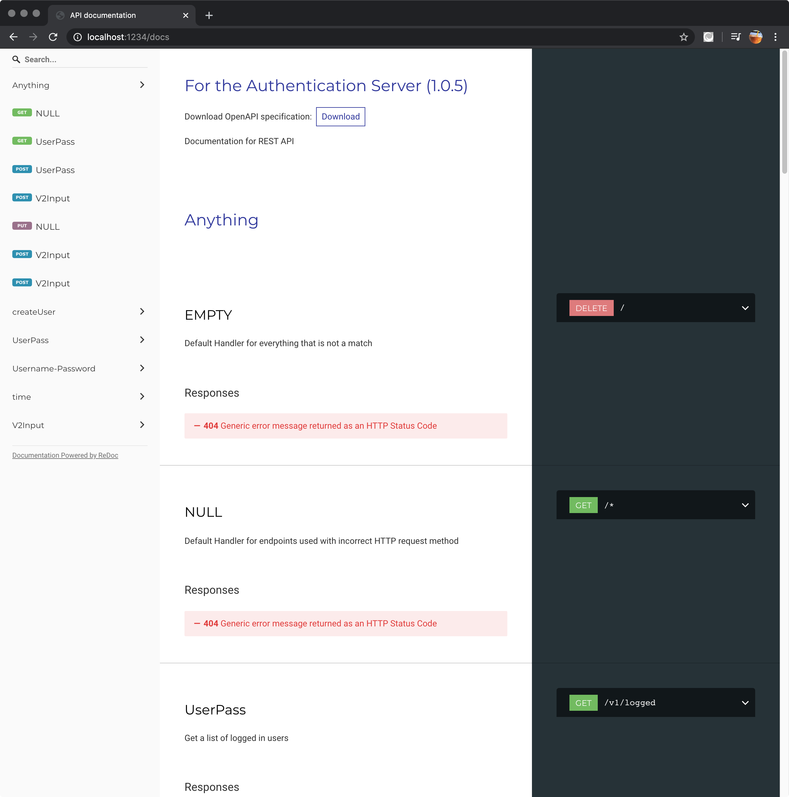

---
author:
  name: Mihalis Tsoukalos
  email: mihalistsoukalos@gmail.com
description: 'Advanced REST API features + REST API documentation'
keywords: ["UNIX", "shell", "REST API", "Go", "Golang", "RESTful", "Swagger", "OpenAPI"]
license: '[CC BY-ND 4.0](https://creativecommons.org/licenses/by-nd/4.0)'
published: 2020-06-10
modified_by:
  name: Linode
title: 'Learn how to implement advanced features on a RESTful server'
contributor:
  name: Mihalis Tsoukalos
  link: https://www.mtsoukalos.eu/
external_resources:
  - '[The Go Programming Language](https://golang.org/)'
  - '[Mastering Go, 2nd edition](https://www.packtpub.com/programming/mastering-go-second-edition)'
  - '[List of HTTP status codes](https://en.wikipedia.org/wiki/List_of_HTTP_status_codes)'
  - '[Hypertext Transfer Protocol (HTTP/1.1)](https://tools.ietf.org/html/rfc7231)'
  - '[Swagger](https://swagger.io/)'
  - '[Swagger Codegen](https://github.com/swagger-api/swagger-codegen)'
  - '[Go Swagger 2.0](https://goswagger.io/)'
  - '[The OpenAPI Specification](https://www.openapis.org/)'
  - '[The OpenAPI Specification Repository](https://github.com/OAI/OpenAPI-Specification)'
---

## Introduction

This guide will discuss some advanced topics related to REST APIs and RESTful services. As the purpose of the guide is not to develop another big Go program, the supported REST API will be relatively small, yet fully functional. Most companies have lots of microservices with many different APIs – in such cases documentation plays a key role because good documentation will solve lots of questions about the way a microservice works. This is where Swagger and *OpenAPI specification* come into play – you will learn more about both of them at the end of the guide.


This guide is written for a non-root user. Depending on your configuration, some commands might require the help of `sudo` in order to get property executed. If you are not familiar with the `sudo` command, see the [Users and Groups](/docs/tools-reference/linux-users-and-groups/) guide.


In this guide you will learn:

- How to upload and download binary files from a RESTful server
- How to serve files from your local file system
- How to use Middleware functions
- How to have versioning in your REST API
- How to use Swagger

## Before You Begin

To run the examples in this guide, your workstation or server will need to have Go installed, and the `go` CLI will need to be set in your terminal’s `PATH`. If you install Go using the Linux package manager that comes with your Linux distribution, you will most likely not need to worry about setting the `PATH` shell variable.


This guide was written with Go version 1.14.


## Using Middleware functions

The RESTful server developed for this guide will be using a Middleware function. *Middleware functions* are functions with a short amount of code that get a request, do something with it and pass it to another middleware or to the last handler function. Gorilla Mux allows you to attach one or more middleware functions to a Router using `Router.Use()`. If a match is found, the relevant middleware functions are executed in the order they were added to the Router (or subrouter).

In our example, the middleware function is used for writing data to system log files using `log.Printf()`. As this functionality will be needed for all connections and endpoints, using a middleware function makes perfect sense because it makes things much simpler. The presented example (`middleware.go`) uses two middleware functions to illustrate that they are being automatically invoked in the order they were added to the Router or subrouter.


package main

import (
  "log"
  "net/http"
  "os"
  "time"

  "github.com/gorilla/mux"
)

var PORT = ":1234"

func timeHandler(rw http.ResponseWriter, r *http.Request) {
}

func addHandler(rw http.ResponseWriter, r *http.Request) {
}

func middleWare(next http.Handler) http.Handler {
  return http.HandlerFunc(func(w http.ResponseWriter, r *http.Request) {
    log.Printf("Serving %s from %s", r.RequestURI, r.Host)
    next.ServeHTTP(w, r)
  })
}

func anotherMiddleWare(next http.Handler) http.Handler {
  return http.HandlerFunc(func(w http.ResponseWriter, r *http.Request) {
    if len(PORT) != 0 {
      log.Printf("Using port: %s", PORT)
    }
    next.ServeHTTP(w, r)
  })
}

func main() {
  arguments := os.Args
  if len(arguments) >= 2 {
    PORT = ":" + arguments[1]
  }
  mux := mux.NewRouter()

  putMux := mux.Methods(http.MethodPut).Subrouter()
  putMux.HandleFunc("/time", timeHandler)

  getMux := mux.Methods(http.MethodGet).Subrouter()
  getMux.HandleFunc("/add", addHandler)
  getMux.Use(anotherMiddleWare)

  mux.Use(middleWare)

  s := http.Server{
    Addr:         PORT,
    Handler:      mux,
    ErrorLog:     nil,
    ReadTimeout:  5 * time.Second,
    WriteTimeout: 5 * time.Second,
    IdleTimeout:  10 * time.Second,
  }

  log.Println("Listening to", PORT)
  err := s.ListenAndServe()
  if err != nil {
    log.Printf("Error starting server: %s\n", err)
    return
  }
}


According to the Go code of `middleware.go`, `middleWare()` is executed every time whereas `anotherMiddleWare()` is executed for the `getMux` subrouter only. As `middleWare()` was added to the main Router, it will always be executed **before** any subrouter middleware function.

Executing `middleware.go` and interacting with it will generate the following kind of output:

    go run middleware.go


2020/06/03 16:19:29 Listening to :1234
2020/06/03 16:19:32 Serving /time from localhost:1234
2020/06/03 16:19:38 Serving /add from localhost:1234
2020/06/03 16:19:38 Using port: :1234


## Supporting Binary File upload and download

It is not unusual to need to store binary files in a RESTful server and being able to download them afterwards. This section will illustrate how to implement such functionality.


Generally speaking, when learning a few feature or technique, it is good to try to create a simple code example that implements that feature or technique in order to better understand what is going on. After that, you can include the related code or technique in a real application.


In order to better illustrate the technique, we are going to create a separate code example, named `binary.go`, which contains the following code:


package main

import (
  "errors"
  "io"
  "log"
  "net/http"
  "os"
  "time"

  "github.com/gorilla/mux"
)

var PORT = ":1234"
var IMAGESPATH = "/tmp/files"

func uploadFile(rw http.ResponseWriter, r *http.Request) {
  filename, ok := mux.Vars(r)["filename"]
  if !ok {
    log.Println("filename value not set!")
    rw.WriteHeader(http.StatusNotFound)
    return
  }
  log.Println(filename)
  saveFile(IMAGESPATH+"/"+filename, rw, r)
}

func saveFile(path string, rw http.ResponseWriter, r *http.Request) {
  log.Println("Saving to", path)
  err := saveToFile(path, r.Body)
  if err != nil {
    log.Println(err)
    return
  }
}

func saveToFile(path string, contents io.Reader) error {
  _, err := os.Stat(path)
  if err == nil {
    err = os.Remove(path)
    if err != nil {
      log.Println("Error deleting", path)
      return err
    }
  } else if !os.IsNotExist(err) {
    log.Println("Unexpected error:", err)
    return err
  }

  // If everything is OK, create the file
  f, err := os.Create(path)
  if err != nil {
    log.Println(err)
    return err
  }
  defer f.Close()

  n, err := io.Copy(f, contents)
  if err != nil {
    return err
  }
  log.Println("Bytes written:", n)
  return nil
}

func createImageDirectory(d string) error {
  _, err := os.Stat(IMAGESPATH)
  if os.IsNotExist(err) {
    log.Println("Creating:", IMAGESPATH)
    err = os.MkdirAll(IMAGESPATH, 0755)
    if err != nil {
      log.Println(err)
      return err
    }
  } else if err != nil {
    log.Println(err)
    return err
  }

  fileInfo, err := os.Stat(IMAGESPATH)
  mode := fileInfo.Mode()
  if !mode.IsDir() {
    msg := IMAGESPATH + " is not a directory!"
    return errors.New(msg)
  }
  return nil
}

func main() {
  err := createImageDirectory(IMAGESPATH)
  if err != nil {
    log.Println(err)
    return
  }

  mux := mux.NewRouter()

  putMux := mux.Methods(http.MethodPut).Subrouter()
  putMux.HandleFunc("/files/{filename:[a-zA-Z0-9][a-zA-Z0-9\\.]*[a-zA-Z0-9]}", uploadFile)

  getMux := mux.Methods(http.MethodGet).Subrouter()
  getMux.Handle(
    "/files/{filename:[a-zA-Z0-9][a-zA-Z0-9\\.]*[a-zA-Z0-9]}",
    http.StripPrefix("/files/", http.FileServer(http.Dir(IMAGESPATH)))
  )

  s := http.Server{
    Addr:         PORT,
    Handler:      mux,
    ErrorLog:     nil,
    ReadTimeout:  5 * time.Second,
    WriteTimeout: 5 * time.Second,
    IdleTimeout:  10 * time.Second,
  }

  log.Println("Listening to", PORT)
  err = s.ListenAndServe()
  if err != nil {
    log.Printf("Error starting server: %s\n", err)
    return
  }
}


`binary.go` is a small yet functional RESTful server that only supports the uploading and downloading of binary files through the `/files/...` endpoint. There exist three interesting points in the presented code:

- First, the filenames that are going to be accepted should follow the given regular expression, which is `[a-zA-Z0-9][a-zA-Z0-9\\.]*[a-zA-Z0-9]`. This means that filenames should not begin with `.` or `..` in order to avoid visiting subdirectories and therefore compromising system security. Additionally, filenames should end with a letter or a number.
- Second, the `uploadFile()` function is responsible for the uploading of new files to the desired directory.
- Last, if the directory path stored in `IMAGESPATH` does not exist, the program will create it. However, if it already exists and is not a directory, the program will fail.

From a functionality perspective, the code in `binary.go` does two main things: first, it allows you to upload binary files and second, it allows you to download binary files that you have already uploaded. There exist three main ways to save the files you upload:

- On your local filesystem
- On a database management system that supports the storing of binary files
- On the Cloud using a Cloud provider

In our case, we are storing the files on the filesystem the server runs on. More specifically, we are storing uploaded files under `/tmp/files` as we are testing things. Note that on most UNIX systems, `/tmp` is automatically emptied after a system reboot. Additionally, as we will be serving files from the local filesystem, we will not need to write our own handler function for the download process as Go already offers one (`http.FileServer()`). However, nothing prohibits your from writing your own handler function for downloading binary files.

### Working with `binary.go`

In this subsection we are going to test the operation of `binary.go` using `curl`. First, we will need to start `binary.go` by executing `go run binary.go`. Then we will begin issuing `curl` commands to upload some files to the server.

    curl -X PUT localhost:1234/files/linode.png --data-binary @linode.png
    curl -X PUT localhost:1234/files/1.png --data-binary @linode.png
    curl -X PUT localhost:1234/files/paper.pdf --data-binary @read.pdf

Note that using the provided endpoint, you can define the filename of the file you want to save on the RESTful server. In the first case, the uploaded file will have the same filename on both ends. In the second case, the uploaded file (`linode.png`) will have a different file on the RESTful server end (`1.png`). In the last case, we are uploading a PDF file using a different filename than the original.

Then, we are going to use `curl` to download the `paper.pdf` file:

    curl -X GET localhost:1234/files/paper.pdf --output myPaper.pdf


  % Total    % Received % Xferd  Average Speed   Time    Time     Time  Current
                                 Dload  Upload   Total   Spent    Left  Speed
100  103k  100  103k    0     0  33.6M      0 --:--:-- --:--:-- --:--:-- 33.6M


If you use `curl` without `--output` for downloading an existing binary file, you will get the following error message:

    curl -X GET localhost:1234/files/paper.pdf


Warning: Binary output can mess up your terminal. Use "--output -" to tell
Warning: curl to output it to your terminal anyway, or consider "--output
Warning: <FILE>" to save to a file.


After that, we will download `linode.png`.

    curl -X GET localhost:1234/files/linode.png --output linode.png


  % Total    % Received % Xferd  Average Speed   Time    Time     Time  Current
                                 Dload  Upload   Total   Spent    Left  Speed
100 1528k  100 1528k    0     0   149M      0 --:--:-- --:--:-- --:--:--  149M


If the desired file cannot be found on the RESTful server, `curl` will return the following kind of output:

    curl -X GET localhost:1234/files/doesNotExist.png


404 page not found


The output of `binary.go` for the aforementioned interactions will be similar to the following:


2020/06/03 08:17:39 Listening to :1234
2020/06/03 08:19:21 linode.png
2020/06/03 08:19:21 Saving to /tmp/files/linode.png
2020/06/03 08:19:21 Bytes written: 1564850
2020/06/03 08:20:10 1.png
2020/06/03 08:20:10 Saving to /tmp/files/1.png
2020/06/03 08:20:10 Bytes written: 1564850
2020/06/03 08:23:31 paper.pdf
2020/06/03 08:23:31 Saving to /tmp/files/paper.pdf
2020/06/03 08:23:31 Bytes written: 105816


Now that we know how to work with files, we are going to add that functionality to the RESTful server that we are going to implement.

## Implementing the RESTful server

This version of the server is for illustrating the implementation of some advanced features and therefore it does not implement a full set of endpoints. For reasons of simplicity, all new handler functions will be included in a separate file named `v2.go` in the `https://github.com/mactsouk/handlers` repository. At this new version of the RESTful server supports REST API versioning, it makes perfect sense that the existing handler functions will be used for the initial version of the REST API whereas the handler functions of the newer version as well as any bug fixes will be implemented from scratch and be included in `v2.go`.

The features that the server will implement are the following:

- Allowing the user to define the path of the SQLite3 database file
- Correcting a bug found in the handler function of the `/getall` endpoint
- REST API versioning
- Use of Middleware functions
- Writing Go tests for the RESTful server

### The Supported REST API

This time the REST API will support versioning. This means that we will have two different versions of the REST API. There exist various approaches on how to implement REST API versioning including the following:

- Using a custom HTTP header (`version-used`) to define the desired version
- Using a different subdomain for each version (`v1.servername` and `v2.servername`)
- Using a combination of `Accept` and `Content-Type` headers - this method is based on *Content Negotiation*
- Using a different path for each version (`/v1` and `/v2` if the RESTful server supports two REST API versions)
- Using a query parameter to reference the desired version (`..../endpoint?version=v1` or `..../endpoint?v=1`)


There is no single answer on how to implement REST API versioning. Use what seems more natural to you and your users. What is really important is to be consistent and use the same approach everywhere.


Our approach will use `/v1/...` for supporting the endpoints of version 1 and `/v2/...` for supporting the endpoints of version 2. For reasons of simplicity, the REST API will only support 5 endpoints in its first version and 7 in the second version. Feel free to add more endpoints as an exercise.

Version 1 will support the following endpoints:

- `/v1/add`
- `/v1/login`
- `/v1/logout`
- `/v1/time`
- `/v1/getall`

Version 2 of the REST aPI will have support for the following endpoints:

- `/v2/add`
- `/v2/login`
- `/v2/logout`
- `/v2/time`
- `/v2/getall`
- `/v2/files/<filename>` with `GET` for downloading existing files
- `/v2/files/<filename>` with `PUT` for uploading new files to the server

Note that both the upload functionality and the download functionality can be executed without providing **user credentials**.

### The Implementation of the RESTful server

The Go code of the advanced RESTful server is the following:


package main

import (
  "log"
  "net/http"
  "os"
  "time"

  "github.com/gorilla/mux"
  "github.com/mactsouk/handlers"
)

var SQLFILE string = "/tmp/users.db"
var PORT string = ":1234"
var IMAGESPATH = "/tmp/files"

type notAllowedHandler struct{}

func (h notAllowedHandler) ServeHTTP(rw http.ResponseWriter, r *http.Request) {
  handlers.MethodNotAllowedHandler(rw, r)
}

func createDatabase() bool {
  _, err := os.Stat(SQLFILE)
  if os.IsNotExist(err) {
    if !handlers.CreateDatabase() {
      log.Println("Cannot create database:", SQLFILE)
      return false
    } else {
      // Update admin user password with a random string
      randomPass := handlers.RandomPassword(5)
      log.Println("Admin password is", randomPass, "PLEASE CHANGE IT!")
      temp := handlers.User{1, "admin", randomPass, 0, 1, 0}
      handlers.UpdateUser(temp)
    }
  }

  fileInfo, err := os.Stat(SQLFILE)
  mode := fileInfo.Mode()
  if !mode.IsRegular() {
    log.Println(SQLFILE + " is not a file!")
    return false
  }
  return true
}

func main() {
  arguments := os.Args
  if len(arguments) == 1 {
    log.Println("Usage: [SQLFILE] [IMAGESPATH] [PORT]")
    log.Println("Using default values!")
  } else if len(arguments) == 2 {
    SQLFILE = arguments[1]
  } else if len(arguments) == 3 {
    SQLFILE = arguments[1]
    IMAGESPATH = arguments[2]
  } else if len(arguments) == 4 {
    SQLFILE = arguments[1]
    IMAGESPATH = arguments[2]
    PORT = ":" + arguments[3]
  }

  handlers.SQLFILE = SQLFILE
  handlers.IMAGESPATH = IMAGESPATH

  if !createDatabase() {
    log.Println("Cannot create database!")
    return
  }

  err := handlers.CreateImageDirectory(IMAGESPATH)
  if err != nil {
    log.Println(err)
    return
  }

  mux := mux.NewRouter()
  s := http.Server{
    Addr:         PORT,
    Handler:      mux,
    ErrorLog:     nil,
    ReadTimeout:  5 * time.Second,
    WriteTimeout: 5 * time.Second,
    IdleTimeout:  10 * time.Second,
  }

  mux.NotFoundHandler = http.HandlerFunc(handlers.DefaultHandler)
  notAllowed := notAllowedHandler{}
  mux.MethodNotAllowedHandler = notAllowed

  putMux := mux.Methods(http.MethodPut).Subrouter()
  putMux.HandleFunc("/v2/files/{filename:[a-zA-Z0-9][a-zA-Z0-9\\.]*[a-zA-Z0-9]}",
    handlers.UploadFile)

  getMux := mux.Methods(http.MethodGet).Subrouter()
  getMux.Handle(
    "/v2/files/{filename:[a-zA-Z0-9][a-zA-Z0-9\\.]*[a-zA-Z0-9]}",
    http.StripPrefix("/v2/files/", http.FileServer(http.Dir(IMAGESPATH))))

  getMux.HandleFunc("/v1/time", handlers.TimeHandler)
  getMux.HandleFunc("/v1/getall", handlers.GetAllHandlerUpdated)
  getMux.HandleFunc("/v2/time", handlers.TimeHandler)
  getMux.HandleFunc("/v2/getall", handlers.GetAllHandlerV2)

  postMux := mux.Methods(http.MethodPost).Subrouter()
  postMux.HandleFunc("/v1/add", handlers.AddHandler)
  postMux.HandleFunc("/v1/login", handlers.LoginHandler)
  postMux.HandleFunc("/v1/logout", handlers.LogoutHandler)
  postMux.HandleFunc("/v2/add", handlers.AddHandlerV2)
  postMux.HandleFunc("/v2/login", handlers.LoginHandlerV2)
  postMux.HandleFunc("/v2/logout", handlers.LogoutHandlerV2)

  mux.Use(handlers.MiddleWare)

  log.Println("Listening to", PORT)
  err = s.ListenAndServe()
  if err != nil {
    log.Printf("Error starting server: %s\n", err)
    return
  }
}


This time, the path of the SQLite3 database file can be given as a command line argument to the program. Additionally, if the given SQLite3 database file already exists, it will not be initialized from scratch. The function that deals with that functionality is called `createDatabase()`:


func createDatabase() bool {
  _, err := os.Stat(SQLFILE)
  if os.IsNotExist(err) {
    if !handlers.CreateDatabase() {
      log.Println("Cannot create database:", SQLFILE)
      return false
    } else {
      // Update admin user password with a random string
      randomPass := handlers.RandomPassword(5)
      log.Println("Admin password is", randomPass, "PLEASE CHANGE IT!")
      temp := handlers.User{1, "admin", randomPass, 0, 1, 0}
      handlers.UpdateUser(temp)
    }
  }

  fileInfo, err := os.Stat(SQLFILE)
  mode := fileInfo.Mode()
  if !mode.IsRegular() {
    log.Println(SQLFILE + " is not a file!")
    return false
  }
  return true
}


Notice that `createDatabase()` checks whether the SQLite3 data file exists or not by using UNIX system calls. If it exists, it checks whether it is a regular file or not – if it is not a regular file (directory, symbolic link, etc.), the function will return `false` and the program will terminate. If it does not exist, it will call `handlers.CreateDatabase()` to create the database, create the `admin` user and assign a randomly generated password to the `admin` user. The password is printed on screen but you are free to disable that feature or assign your own password to the `admin` user.

Most of the new functionality of the server can be found in `v2.go` (from [https://github.com/mactsouk/handlers](https://github.com/mactsouk/handlers)), which contains the following Go code:


package handlers

import (
  "encoding/json"
  "errors"
  "io"
  "io/ioutil"
  "log"
  "math/rand"
  "net/http"
  "os"
  "time"

  "github.com/gorilla/mux"
)

type V2Input struct {
  Username string `json:"username"`
  Password string `json:"password"`
  U        User   `json:"load"`
}

var IMAGESPATH string

func AddHandlerV2(rw http.ResponseWriter, r *http.Request) {
  log.Println("Serving:", r.URL.Path, "from", r.Host)
  d, err := ioutil.ReadAll(r.Body)
  if err != nil {
    rw.WriteHeader(http.StatusBadRequest)
    log.Println(err)
    return
  }

  if len(d) == 0 {
    rw.WriteHeader(http.StatusBadRequest)
    log.Println("No input!")
    return
  }

  var load = V2Input{}
  err = json.Unmarshal(d, &load)
  if err != nil {
    log.Println(err)
    rw.WriteHeader(http.StatusBadRequest)
    return
  }

  log.Println(load)

  u := UserPass{load.Username, load.Password}
  if !IsUserAdmin(u) {
    log.Println("Command issued by non-admin user:", u.Username)
    rw.WriteHeader(http.StatusBadRequest)
    return
  }

  newUser := load.U
  result := AddUser(newUser)
  if !result {
    rw.WriteHeader(http.StatusBadRequest)
  }
}

func LoginHandlerV2(rw http.ResponseWriter, r *http.Request) {
  d, err := ioutil.ReadAll(r.Body)
  if err != nil {
    rw.WriteHeader(http.StatusBadRequest)
    log.Println(err)
    return
  }

  if len(d) == 0 {
    rw.WriteHeader(http.StatusBadRequest)
    log.Println("No input!")
    return
  }

  var load = V2Input{}
  err = json.Unmarshal(d, &load)
  if err != nil {
    log.Println(err)
    rw.WriteHeader(http.StatusBadRequest)
    return
  }

  var user = UserPass{load.Username, load.Password}
  if !IsUserValid(user) {
    log.Println("User", user.Username, "not valid!")
    rw.WriteHeader(http.StatusBadRequest)
    return
  }

  t := FindUserUsername(user.Username)
  log.Println("Logging in:", t)

  t.LastLogin = time.Now().Unix()
  t.Active = 1
  if UpdateUser(t) {
    log.Println("User updated:", t)
  } else {
    log.Println("Update failed:", t)
    rw.WriteHeader(http.StatusBadRequest)
  }
}

func LogoutHandlerV2(rw http.ResponseWriter, r *http.Request) {
  d, err := ioutil.ReadAll(r.Body)
  if err != nil {
    rw.WriteHeader(http.StatusBadRequest)
    log.Println(err)
    return
  }

  if len(d) == 0 {
    rw.WriteHeader(http.StatusBadRequest)
    log.Println("No input!")
    return
  }

  var load = V2Input{}
  err = json.Unmarshal(d, &load)
  if err != nil {
    log.Println(err)
    rw.WriteHeader(http.StatusBadRequest)
    return
  }

  var user = UserPass{load.Username, load.Password}
  err = json.Unmarshal(d, &user)
  if err != nil {
    log.Println(err)
    rw.WriteHeader(http.StatusBadRequest)
    return
  }

  if !IsUserValid(user) {
    log.Println("User", user.Username, "exists!")
    rw.WriteHeader(http.StatusBadRequest)
    return
  }

  t := FindUserUsername(user.Username)
  log.Println("Logging out:", t.Username)
  t.Active = 0
  if UpdateUser(t) {
    log.Println("User updated:", t)
  } else {
    log.Println("Update failed:", t)
    rw.WriteHeader(http.StatusBadRequest)
  }
}

func GetAllHandlerV2(rw http.ResponseWriter, r *http.Request) {
  d, err := ioutil.ReadAll(r.Body)
  if err != nil {
    rw.WriteHeader(http.StatusBadRequest)
    log.Println(err)
    return
  }

  if len(d) == 0 {
    rw.WriteHeader(http.StatusBadRequest)
    log.Println("No input!")
    return
  }

  var load = V2Input{}
  err = json.Unmarshal(d, &load)
  if err != nil {
    log.Println(err)
    rw.WriteHeader(http.StatusBadRequest)
    return
  }

  var user = UserPass{load.Username, load.Password}
  if !IsUserAdmin(user) {
    log.Println("User", user, "does not exist!")
    rw.WriteHeader(http.StatusBadRequest)
    return
  }

  err = SliceToJSON(ReturnAllUsers(), rw)
  if err != nil {
    log.Println(err)
    rw.WriteHeader(http.StatusBadRequest)
    return
  }
}

// GetAllHandlerUpdated is for `/v1/getall`.
// The older version had a bug as it was using `IsUserValid` instead of `IsUserAdmin`.
func GetAllHandlerUpdated(rw http.ResponseWriter, r *http.Request) {
  log.Println("Serving:", r.URL.Path, "from", r.Host)
  d, err := ioutil.ReadAll(r.Body)
  if err != nil {
    rw.WriteHeader(http.StatusBadRequest)
    log.Println(err)
    return
  }

  if len(d) == 0 {
    rw.WriteHeader(http.StatusBadRequest)
    log.Println("No input!")
    return
  }

  var user = UserPass{}
  err = json.Unmarshal(d, &user)
  if err != nil {
    log.Println(err)
    rw.WriteHeader(http.StatusBadRequest)
    return
  }

  if !IsUserAdmin(user) {
    log.Println("User", user, "is not Admin!")
    rw.WriteHeader(http.StatusForbidden)
    return
  }

  err = SliceToJSON(ReturnAllUsers(), rw)
  if err != nil {
    log.Println(err)
    rw.WriteHeader(http.StatusBadRequest)
    return
  }
}

func UploadFile(rw http.ResponseWriter, r *http.Request) {
  filename, ok := mux.Vars(r)["filename"]
  if !ok {
    log.Println("filename value not set!")
    rw.WriteHeader(http.StatusNotFound)
    return
  }
  log.Println(filename)
  saveFile(IMAGESPATH+"/"+filename, rw, r)
}

func saveFile(path string, rw http.ResponseWriter, r *http.Request) {
  log.Println("Saving to", path)
  err := saveToFile(path, r.Body)
  if err != nil {
    log.Println(err)
    return
  }
}

func saveToFile(path string, contents io.Reader) error {
  _, err := os.Stat(path)
  if err == nil {
    err = os.Remove(path)
    if err != nil {
      log.Println("Error deleting", path)
      return err
    }
  } else if !os.IsNotExist(err) {
    log.Println("Unexpected error:", err)
    return err
  }

  // If everything is OK, create the file
  f, err := os.Create(path)
  if err != nil {
    log.Println(err)
    return err
  }
  defer f.Close()

  n, err := io.Copy(f, contents)
  if err != nil {
    return err
  }
  log.Println("Bytes written:", n)
  return nil
}

func CreateImageDirectory(d string) error {
  _, err := os.Stat(d)
  if os.IsNotExist(err) {
    log.Println("Creating:", d)
    err = os.MkdirAll(d, 0755)
    if err != nil {
      log.Println(err)
      return err
    }
  } else if err != nil {
    log.Println(err)
    return err
  }

  fileInfo, err := os.Stat(d)
  mode := fileInfo.Mode()
  if !mode.IsDir() {
    msg := d + " is not a directory!"
    return errors.New(msg)
  }
  return nil
}

func MiddleWare(next http.Handler) http.Handler {
  return http.HandlerFunc(func(w http.ResponseWriter, r *http.Request) {
    log.Printf("Serving %s from %s using %s method", r.RequestURI, r.Host, r.Method)
    next.ServeHTTP(w, r)
  })
}

// Generating Random Strings with a Given length
func random(min, max int) int {
  return rand.Intn(max-min) + min
}

// RandomPassword generates random strings of given length
func RandomPassword(l int) string {
  Password := ""
  rand.Seed(time.Now().Unix())
  MIN := 0
  MAX := 94
  startChar := "!"
  i := 1
  for {
    myRand := random(MIN, MAX)
    newChar := string(startChar[0] + byte(myRand))
    Password += newChar
    if i == l {
      break
    }
    i++
  }
  return Password
}


`v2.go` contains all the handler functions for Version 2 of the REST API as well as the `GetAllHandlerUpdated()` handler function for the `/v1/getall` endpoint because the initial handler function contained a bug.

All handler functions in Version 2 are using the `handlers.V2Input` data structure, which is defined as follows:


type V2Input struct {
  Username string `json:"username"`
  Password string `json:"password"`
  U        User   `json:"load"`
}


This means that you only need to send a single JSON record (`V2Input`) when communicating with second version of the REST API, which is better than sending an array of JSON records. If you want to work with a specific user, you will put the user data in the `load` field.

Executing `server.go` will generate the following kind of output:

    go run server.go


2020/06/06 18:26:41 Usage: [SQLFILE] [IMAGESPATH] [PORT]
2020/06/06 18:26:41 Using default values!
2020/06/06 18:26:41 Writing to SQLite3: /tmp/users.db
2020/06/06 18:26:41 Emptying database table.
2020/06/06 18:26:41 Creating table from scratch.
2020/06/06 18:26:41 Populating /tmp/users.db
2020/06/06 18:26:41 Adding user: {-1 admin admin 1591457201 1 0}
2020/06/06 18:26:41 Admin password is TUNR0 PLEASE CHANGE IT!
2020/06/06 18:26:41 Updating user: {1 admin TUNR0 0 1 0}
2020/06/06 18:26:41 Affected: 1
2020/06/06 18:26:41 Listening to :1234


However, if the database file you want to use already exists, `server.go` will generate the next output:

    go run server.go


2020/06/06 18:27:40 Usage: [SQLFILE] [IMAGESPATH] [PORT]
2020/06/06 18:27:40 Using default values!
2020/06/06 18:27:40 Listening to :1234


### API Versioning

We all know that most of the times we need to update our services and create better or just different versions of them. In theses cases, *API Versioning* is here to help.As stated before, the biggest difference between the two versions is that the newest version will use *a single Go structure* named `V2Input` for getting user input – `V2Input` will contain the username and password of the user that issues the command and a field that holds a `User` structure. Additionally, both versions will share the same SQLite3 database.

The idea behind API Versioning is easy to understand: **you do not destroy older REST APIs**; instead, you create new versions of them. This means that all REST APIs will be supported and, therefore, **older clients will continue to work** with your service.

Although `/time` is supported in both versions, it will have two separate paths, `/v1/time` and `/v2/time` – both paths will be served by the same handler function – you do not have to create a separate handler function for a different API version if there is not a good reason for doing so.

### Implementing API Versioning

The idea behind the implementation of API Versioning is that when an endpoint belongs to the first version, it begins with `/v1`, followed by the actual endpoint whereas when an endpoint belongs to the second version, it starts with `v2`. This way you can support as many versions of your REST API as needed.

Apart from the handler functions for the two version that are different, with the exception of the `/time` endpoint, the way handlers of the same functionality interact with the database is the same, which means that database related functions will be shared among handlers.

The implementation of the API versioning in the Router can be seen in the example code that follows.


getMux.HandleFunc("/v1/time", handlers.TimeHandler)
getMux.HandleFunc("/v2/time", handlers.TimeHandler)

postMux.HandleFunc("/v1/logout", handlers.LogoutHandler)
postMux.HandleFunc("/v2/logout", handlers.LogoutHandlerV2)


Both `/v1/time` and `/v2/time` are served by `handlers.TimeHandler` whereas `/v1/logout` is server by `handlers.LogoutHandler` and `/v2/logout` is server by `handlers.LogoutHandlerV2`.

### Correcting bugs in the initial RESTful server

The handler function of the `/getall` endpoint does not check whether the user issuing the command has administrative privileges or not before querying the database. This is a security concern that needs to be corrected – in order to avoid making changes to `data.go` and `handlers.go`, the updated version of `/getall`, which will be called `/v1/getall` due to API versioning (as it belongs to the first version of the REST API), will be put in `v2.go` and it will be named `GetAllHandlerUpdated()`.


// GetAllHandlerUpdated is for `/v1/getall`.
// The older version had a bug as it was using `IsUserValid` instead of `IsUserAdmin`.
func GetAllHandlerUpdated(rw http.ResponseWriter, r *http.Request) {
  log.Println("Serving:", r.URL.Path, "from", r.Host)
  d, err := ioutil.ReadAll(r.Body)
  if err != nil {
    rw.WriteHeader(http.StatusBadRequest)
    log.Println(err)
    return
  }

  if len(d) == 0 {
    rw.WriteHeader(http.StatusBadRequest)
    log.Println("No input!")
    return
  }

  var user = UserPass{}
  err = json.Unmarshal(d, &user)
  if err != nil {
    log.Println(err)
    rw.WriteHeader(http.StatusBadRequest)
    return
  }

  if !IsUserAdmin(user) {
    log.Println("User", user, "is not Admin!")
    rw.WriteHeader(http.StatusForbidden)
    return
  }

  err = SliceToJSON(ReturnAllUsers(), rw)
  if err != nil {
    log.Println(err)
    rw.WriteHeader(http.StatusBadRequest)
    return
  }
}


Writing appropriate comments for `GetAllHandlerUpdated()` will clarify things about the use and purpose of `GetAllHandlerUpdated()`.

## Writing HTTP tests in Go

Go allows you to write tests for testing the HTTP handlers in a Go web application. The test code for `server.go` is called `server_test.go` and contains the following code:


package main

import (
  "bytes"
  "fmt"
  "net/http"
  "net/http/httptest"
  "strings"
  "testing"

  "github.com/mactsouk/handlers"
)

func TestTimeHanlderV1(t *testing.T) {
  req, err := http.NewRequest("GET", "/v1/time", nil)
  if err != nil {
    t.Fatal(err)
  }

  rr := httptest.NewRecorder()
  handler := http.HandlerFunc(handlers.TimeHandler)
  handler.ServeHTTP(rr, req)

  if status := rr.Code; status != http.StatusOK {
    t.Errorf("handler returned wrong status code: got %v want %v",
      status, http.StatusOK)
  }
}

func TestTimeHanlderV2(t *testing.T) {
  req, err := http.NewRequest("GET", "/v2/time", nil)
  if err != nil {
    t.Fatal(err)
  }
  rr := httptest.NewRecorder()
  handler := http.HandlerFunc(handlers.TimeHandler)
  handler.ServeHTTP(rr, req)

  if status := rr.Code; status != http.StatusOK {
    t.Errorf("handler returned wrong status code: got %v want %v",
      status, http.StatusOK)
  }
}

func TestNotFoundV1(t *testing.T) {
  req, err := http.NewRequest("GET", "/v1/doesNotExist", nil)
  if err != nil {
    t.Fatal(err)
  }

  rr := httptest.NewRecorder()
  handler := http.HandlerFunc(handlers.DefaultHandler)
  handler.ServeHTTP(rr, req)

  if status := rr.Code; status != http.StatusNotFound {
    t.Errorf("handler returned wrong status code: got %v want %v",
      status, http.StatusOK)
  }
}

func TestNotFoundV2(t *testing.T) {
  req, err := http.NewRequest("GET", "/v2/doesNotExist", nil)
  if err != nil {
    t.Fatal(err)
  }

  rr := httptest.NewRecorder()
  handler := http.HandlerFunc(handlers.DefaultHandler)
  handler.ServeHTTP(rr, req)

  if status := rr.Code; status != http.StatusNotFound {
    t.Errorf("handler returned wrong status code: got %v want %v",
      status, http.StatusOK)
  }
}

func TestMethodNotAllowedV1(t *testing.T) {
  req, err := http.NewRequest("DELETE", "/v1/time", nil)
  if err != nil {
    t.Fatal(err)
  }

  rr := httptest.NewRecorder()
  handler := http.HandlerFunc(handlers.MethodNotAllowedHandler)
  handler.ServeHTTP(rr, req)

  if status := rr.Code; status != http.StatusNotFound {
    t.Errorf("handler returned wrong status code: got %v want %v",
      status, http.StatusOK)
  }
}

func TestMethodNotAllowedV2(t *testing.T) {
  req, err := http.NewRequest("DELETE", "/v2/time", nil)
  if err != nil {
    t.Fatal(err)
  }

  rr := httptest.NewRecorder()
  handler := http.HandlerFunc(handlers.MethodNotAllowedHandler)
  handler.ServeHTTP(rr, req)

  if status := rr.Code; status != http.StatusNotFound {
    t.Errorf("handler returned wrong status code: got %v want %v",
      status, http.StatusOK)
  }
}

func TestGetallV1(t *testing.T) {
  UserPass := []byte(`{"user": "admin", "password": "1"}`)
  req, err := http.NewRequest("GET", "/v1/getall", bytes.NewBuffer(UserPass))
  if err != nil {
    t.Fatal(err)
  }
  req.Header.Set("Content-Type", "application/json")

  rr := httptest.NewRecorder()
  handler := http.HandlerFunc(handlers.GetAllHandlerUpdated)
  handler.ServeHTTP(rr, req)

  if status := rr.Code; status != http.StatusOK {
    t.Errorf("handler returned wrong status code: got %v want %v",
      status, http.StatusOK)
    return
  }

  expected := `[{"id":1,"user":"admin","password":"1","lastlogin":0,"admin":1,"active":0}]`
  serverResponse := rr.Body.String()
  result := strings.Split(serverResponse, "lastlogin")
  serverResponse = result[0] + `lastlogin":0,"admin":1,"active":0}]`
  fmt.Println("****", serverResponse)
  if serverResponse != expected {
    t.Errorf("handler returned unexpected body: got %v but wanted %v",
      rr.Body.String(), expected)
  }
}

func TestGetallV2(t *testing.T) {
  UserPass := []byte(`{"username": "admin", "password": "1", "load": {}}`)
  req, err := http.NewRequest("GET", "/v2/getall", bytes.NewBuffer(UserPass))
  if err != nil {
    t.Fatal(err)
  }
  req.Header.Set("Content-Type", "application/json")

  rr := httptest.NewRecorder()
  handler := http.HandlerFunc(handlers.GetAllHandlerV2)
  handler.ServeHTTP(rr, req)

  if status := rr.Code; status != http.StatusOK {
    t.Errorf("handler returned wrong status code: got %v want %v",
      status, http.StatusOK)
    return
  }

  expected := `[{"id":1,"user":"admin","password":"1","lastlogin":0,"admin":1,"active":0}]`
  serverResponse := rr.Body.String()
  result := strings.Split(serverResponse, "lastlogin")
  serverResponse = result[0] + `lastlogin":0,"admin":1,"active":0}]`

  if serverResponse != expected {
    t.Errorf("handler returned unexpected body: got %v but wanted %v",
      rr.Body.String(), expected)
  }
}

func TestLoginV1(t *testing.T) {
  UserPass := []byte(`{"user": "admin", "password": "1"}`)
  req, err := http.NewRequest("POST", "/v1/login", bytes.NewBuffer(UserPass))
  if err != nil {
    t.Fatal(err)
  }
  req.Header.Set("Content-Type", "application/json")

  rr := httptest.NewRecorder()
  handler := http.HandlerFunc(handlers.LoginHandler)
  handler.ServeHTTP(rr, req)

  if status := rr.Code; status != http.StatusOK {
    t.Errorf("handler returned wrong status code: got %v want %v",
      status, http.StatusOK)
    return
  }
}

func TestLoginV2(t *testing.T) {
  UserPass := []byte(`{"username": "admin", "password": "1", "load": {}}`)
  req, err := http.NewRequest("GET", "/v2/login", bytes.NewBuffer(UserPass))
  if err != nil {
    t.Fatal(err)
  }
  req.Header.Set("Content-Type", "application/json")

  rr := httptest.NewRecorder()
  handler := http.HandlerFunc(handlers.LoginHandlerV2)
  handler.ServeHTTP(rr, req)

  if status := rr.Code; status != http.StatusOK {
    t.Errorf("handler returned wrong status code: got %v want %v",
      status, http.StatusOK)
    return
  }
}

func TestLogoutV1(t *testing.T) {
  UserPass := []byte(`{"user": "admin", "password": "1"}`)
  req, err := http.NewRequest("POST", "/v1/logout", bytes.NewBuffer(UserPass))
  if err != nil {
    t.Fatal(err)
  }
  req.Header.Set("Content-Type", "application/json")

  rr := httptest.NewRecorder()
  handler := http.HandlerFunc(handlers.LogoutHandler)
  handler.ServeHTTP(rr, req)

  // Check the HTTP status code is what we expect.
  if status := rr.Code; status != http.StatusOK {
    t.Errorf("handler returned wrong status code: got %v want %v",
      status, http.StatusOK)
    return
  }
}

func TestLogoutV2(t *testing.T) {
  UserPass := []byte(`{"username": "admin", "password": "1", "load": {}}`)
  req, err := http.NewRequest("GET", "/v2/logout", bytes.NewBuffer(UserPass))
  if err != nil {
    t.Fatal(err)
  }
  req.Header.Set("Content-Type", "application/json")

  rr := httptest.NewRecorder()
  handler := http.HandlerFunc(handlers.LogoutHandlerV2)
  handler.ServeHTTP(rr, req)

  if status := rr.Code; status != http.StatusOK {
    t.Errorf("handler returned wrong status code: got %v want %v",
      status, http.StatusOK)
    return
  }
}

func TestAddV1(t *testing.T) {
  UserPass := []byte(`[{"user": "admin", "password": "1"}, {"user": "m", "password": "myPass"}]`)
  req, err := http.NewRequest("POST", "/v1/add", bytes.NewBuffer(UserPass))
  if err != nil {
    t.Fatal(err)
  }
  req.Header.Set("Content-Type", "application/json")

  rr := httptest.NewRecorder()
  handler := http.HandlerFunc(handlers.AddHandler)
  handler.ServeHTTP(rr, req)

  // Check the HTTP status code is what we expect.
  if status := rr.Code; status != http.StatusOK {
    t.Errorf("handler returned wrong status code: got %v want %v",
      status, http.StatusOK)
    return
  }
}

func TestAddV2(t *testing.T) {
  UserPass := []byte(`{"username": "admin", "password": "1", "load": {"id":1,"user":"mtsouk","password":"newPass","lastlogin":0,"admin":1,"active":0}}`)
  req, err := http.NewRequest("GET", "/v2/add", bytes.NewBuffer(UserPass))
  if err != nil {
    t.Fatal(err)
  }
  req.Header.Set("Content-Type", "application/json")

  rr := httptest.NewRecorder()
  handler := http.HandlerFunc(handlers.AddHandlerV2)
  handler.ServeHTTP(rr, req)

  if status := rr.Code; status != http.StatusOK {
    t.Errorf("handler returned wrong status code: got %v want %v",
      status, http.StatusOK)
    return
  }
}


Note that the `http.NewRequest()` function is used for defining the HTTP request method, the endpoint and for sending data to the endpoint when needed.

For the tests to work, the `admin` user should have the string `1` as password - please modify `server_test.go` in order to have the correct password for the `admin` user of your installation.

Executing the tests will generate the following output:

    go test server.go server_test.go -v


=== RUN   TestTimeHanlderV1
2020/06/06 18:36:54 Serving: /v1/time from 
--- PASS: TestTimeHanlderV1 (0.00s)
=== RUN   TestTimeHanlderV2
2020/06/06 18:36:54 Serving: /v2/time from 
--- PASS: TestTimeHanlderV2 (0.00s)
=== RUN   TestNotFoundV1
2020/06/06 18:36:54 Serving: /v1/doesNotExist from  with method GET
--- PASS: TestNotFoundV1 (0.00s)
=== RUN   TestNotFoundV2
2020/06/06 18:36:54 Serving: /v2/doesNotExist from  with method GET
--- PASS: TestNotFoundV2 (0.00s)
=== RUN   TestMethodNotAllowedV1
2020/06/06 18:36:54 Serving: /v1/time from  with method DELETE
--- PASS: TestMethodNotAllowedV1 (0.00s)
=== RUN   TestMethodNotAllowedV2
2020/06/06 18:36:54 Serving: /v2/time from  with method DELETE
--- PASS: TestMethodNotAllowedV2 (0.00s)
=== RUN   TestGetallV1
2020/06/06 18:36:54 Serving: /v1/getall from 
2020/06/06 18:36:54 Reading from SQLite3: /tmp/users.db
2020/06/06 18:36:54 All: [{1 admin 1 1591457797 1 0} {2 m myPass 1591457797 0 0} {3 mtsouk newPass 0 1 0}]
**** [{"id":1,"user":"admin","password":"1","lastlogin":0,"admin":1,"active":0}]
--- PASS: TestGetallV1 (0.00s)
=== RUN   TestGetallV2
2020/06/06 18:36:54 Reading from SQLite3: /tmp/users.db
2020/06/06 18:36:54 All: [{1 admin 1 1591457797 1 0} {2 m myPass 1591457797 0 0} {3 mtsouk newPass 0 1 0}]
--- PASS: TestGetallV2 (0.00s)
=== RUN   TestLoginV1
2020/06/06 18:36:54 Serving: /v1/login from 
2020/06/06 18:36:54 Input user: {admin 1}
2020/06/06 18:36:54 Get User Data from SQLite3: admin
2020/06/06 18:36:54 Found user: {1 admin 1 1591457797 1 0}
2020/06/06 18:36:54 Logging in: {1 admin 1 1591457797 1 0}
2020/06/06 18:36:54 Updating user: {1 admin 1 1591457814 1 1}
2020/06/06 18:36:54 Affected: 1
2020/06/06 18:36:54 User updated: {1 admin 1 1591457814 1 1}
--- PASS: TestLoginV1 (0.00s)
=== RUN   TestLoginV2
2020/06/06 18:36:54 Get User Data from SQLite3: admin
2020/06/06 18:36:54 Found user: {1 admin 1 1591457814 1 1}
2020/06/06 18:36:54 Logging in: {1 admin 1 1591457814 1 1}
2020/06/06 18:36:54 Updating user: {1 admin 1 1591457814 1 1}
2020/06/06 18:36:54 Affected: 1
2020/06/06 18:36:54 User updated: {1 admin 1 1591457814 1 1}
--- PASS: TestLoginV2 (0.00s)
=== RUN   TestLogoutV1
2020/06/06 18:36:54 Serving: /v1/logout from 
2020/06/06 18:36:54 Get User Data from SQLite3: admin
2020/06/06 18:36:54 Found user: {1 admin 1 1591457814 1 1}
2020/06/06 18:36:54 Logging out: admin
2020/06/06 18:36:54 Updating user: {1 admin 1 1591457814 1 0}
2020/06/06 18:36:54 Affected: 1
2020/06/06 18:36:54 User updated: {1 admin 1 1591457814 1 0}
--- PASS: TestLogoutV1 (0.00s)
=== RUN   TestLogoutV2
2020/06/06 18:36:54 Get User Data from SQLite3: admin
2020/06/06 18:36:54 Found user: {1 admin 1 1591457814 1 0}
2020/06/06 18:36:54 Logging out: admin
2020/06/06 18:36:54 Updating user: {1 admin 1 1591457814 1 0}
2020/06/06 18:36:54 Affected: 1
2020/06/06 18:36:54 User updated: {1 admin 1 1591457814 1 0}
--- PASS: TestLogoutV2 (0.00s)
=== RUN   TestAddV1
2020/06/06 18:36:54 Serving: /v1/add from 
2020/06/06 18:36:54 [{admin 1 0} {m myPass 0}]
2020/06/06 18:36:54 Adding user: {-1 m myPass 1591457814 0 0}
--- PASS: TestAddV1 (0.00s)
=== RUN   TestAddV2
2020/06/06 18:36:54 Serving: /v2/add from 
2020/06/06 18:36:54 {admin 1 {1 mtsouk newPass 0 1 0}}
2020/06/06 18:36:54 Adding user: {1 mtsouk newPass 0 1 0}
--- PASS: TestAddV2 (0.00s)
PASS
ok      command-line-arguments  0.269s


Depending on the results of your testing functions, you might need to correct the errors in your Go code. Currently, all tests were successful.

If you prefer to get less output from `go test`, you can execute the next command instead:

    go test server.go server_test.go


ok      command-line-arguments  0.246s


## Documenting a REST API

In this section we will discuss the documentation of a REST API. We will use the OpenAPI specification for documenting the REST API. Swagger will read the appropriate code annotations and create the OpenAPI file.


OpenAPI specification, which is also called Swagger Specification, is a specification for describing, producing, consuming, and visualizing RESTful web services.


As Swagger can communicate with Go really well, the extra content for creating the Documentation for the REST API will be put in the Go source files as Go comments. Swagger will then read these comments and generate the documentation! However, all comments should follow certain rules and comply to the supported grammar and conventions. You will see such comments in a while.

### About Swagger

Put simply, Swagger is a representation of your RESTful API. You can download Swagger by executing the next command:

    GO11MODULE=off go get -u github.com/go-swagger/go-swagger/cmd/swagger

If you want to learn more about the process and the involved Go packages, you can execute the next command instead:

    GO11MODULE=off go get -v -u github.com/go-swagger/go-swagger/cmd/swagger

The `swagger` binary can be found in `~/go/bin` as Swagger is written in Go! Executing it without any command line arguments will generate the following output:

    ~/go/bin/swagger


Please specify one command of: diff, expand, flatten, generate, init, mixin, serve, validate or version


You can also get help for each `swagger` command:

   ~/go/bin/swagger generate --help


Usage:
  swagger [OPTIONS] generate <command>

generate go code for the swagger spec file

Application Options:
  -q, --quiet                  silence logs
      --log-output=LOG-FILE    redirect logs to file

Help Options:
  -h, --help                   Show this help message

Available commands:
  client     generate all the files for a client library
  model      generate one or more models from the swagger spec
  operation  generate one or more server operations from the swagger spec
  server     generate all the files for a server application
  spec       generate a swagger spec document from a go application
  support    generate supporting files like the main function and the api builder


### Documenting the REST API

In order to be able to document a REST API using Swagger, you basically have two choices. First, writing the OpenAPI specification file on your own (*manually*) or adding annotations in the source code that will help Swagger generate the OpenAPI specification file for you (*automatically*).

In our case we will write documentation for the `handlers` Go package because this is where the REST API is defined and implemented. The new version of `handlers` will be saved in a different GitHub repository named `https://github.com/mactsouk/shandler`.


The Go code in all three files of the `shandler` package is the same as in the `https://github.com/mactsouk/handlers` repository. There are only two differences. The first difference is that `shandler` contains Swagger annotations for generating the OpenAPI specification file and the second difference is that for each response that you define in Swagger, you will need to create a separate Go structure to support it – these structures are **only being used for the documentation**. In our case, these structures are in `data.go` and are called `ErrorMessage`, `OK` and `BadRequest`. All this data goes in the `responses:` section of the generated OpenAPI specification file.


THe `handlers.go` file of the `shandler` package comes with the following contents:


// Package shandler For the Authentication Server
//
// Documentation for REST API
//
//	Schemes: http
//	BasePath: /
//	Version: 1.0.5
//
//	Consumes:
//	- application/json
//
//	Produces:
//	- application/json
//
// swagger:meta
package shandler

import (
  "encoding/json"
  "fmt"
  "io/ioutil"
  "log"
  "net/http"
  "strconv"
  "time"

  "github.com/gorilla/mux"
)

// @termsOfService http://swagger.io/terms/

// swagger:route DELETE / Anything EMPTY
// Default Handler for everything that is not a match
//
// responses:
//	404: ErrorMessage

// DefaultHandler is for handling everything
func DefaultHandler(rw http.ResponseWriter, r *http.Request) {
  rw.WriteHeader(http.StatusNotFound)
  Body := r.URL.Path + " is not supported. Thanks for visiting!\n"
  fmt.Fprintf(rw, "%s", Body)
}

// swagger:route GET /* NULL
// Default Handler for endpoints used with incorrect HTTP request method
//
// responses:
//	404: ErrorMessage

// MethodNotAllowedHandler is executed when the HTTP method is not supported
func MethodNotAllowedHandler(rw http.ResponseWriter, r *http.Request) {
  rw.WriteHeader(http.StatusNotFound)
  Body := "Method not allowed!\n"
  fmt.Fprintf(rw, "%s", Body)
}

// swagger:route GET /v1/time time NULL
// Return current time
//
// responses:
//	200: OK
//	400: BadRequest

// TimeHandler is for handling /v1/time
func TimeHandler(rw http.ResponseWriter, r *http.Request) {
  rw.WriteHeader(http.StatusOK)
  t := time.Now().Format(time.RFC1123)
  Body := "The current time is: " + t + "\n"
  fmt.Fprintf(rw, "%s", Body)
}

// swagger:route POST /v1/add createUser Input
// Create a new user
//
// responses:
//	200: OK
//  400: BadRequest

// AddHandler is for adding a new user /v1/add
func AddHandler(rw http.ResponseWriter, r *http.Request) {
  d, err := ioutil.ReadAll(r.Body)
  if err != nil {
    rw.WriteHeader(http.StatusBadRequest)
    log.Println(err)
    return
  }

  if len(d) == 0 {
    rw.WriteHeader(http.StatusBadRequest)
    log.Println("No input!")
    return
  }

  var users = []Input{}
  err = json.Unmarshal(d, &users)
  if err != nil {
    log.Println(err)
    rw.WriteHeader(http.StatusBadRequest)
    return
  }

  log.Println(users)

  u := UserPass{users[0].Username, users[0].Password}
  if !IsUserAdmin(u) {
    log.Println("Command issued by non-admin user:", u.Username)
    rw.WriteHeader(http.StatusBadRequest)
    return
  }

  newUser := User{-1, users[1].Username, users[1].Password, time.Now().Unix(), users[1].Admin, 0}
  result := AddUser(newUser)
  if !result {
    rw.WriteHeader(http.StatusBadRequest)
  }
}

// DeleteHandler is for deleting an existing user + DELETE
func DeleteHandler(rw http.ResponseWriter, r *http.Request) {
  id, ok := mux.Vars(r)["id"]
  if !ok {
    log.Println("ID value not set!")
    rw.WriteHeader(http.StatusNotFound)
    return
  }

  var user = UserPass{}
  err := user.FromJSON(r.Body)
  if err != nil {
    log.Println(err)
    rw.WriteHeader(http.StatusBadRequest)
    return
  }

  if !IsUserAdmin(user) {
    log.Println("User", user.Username, "is not admin!")
    rw.WriteHeader(http.StatusBadRequest)
    return
  }

  intID, err := strconv.Atoi(id)
  if err != nil {
    log.Println("id", err)
    return
  }

  t := FindUserID(intID)
  if t.Username != "" {
    log.Println("About to delete:", t)
    deleted := DeleteUser(intID)
    if deleted {
      log.Println("User deleted:", id)
      rw.WriteHeader(http.StatusOK)
      return
    } else {
      log.Println("Cannot delete user:", id)
      rw.WriteHeader(http.StatusNotFound)
    }
  }
  rw.WriteHeader(http.StatusNotFound)
}

// GetAllHandler is for getting all data from the user database
func GetAllHandler(rw http.ResponseWriter, r *http.Request) {
  d, err := ioutil.ReadAll(r.Body)
  if err != nil {
    rw.WriteHeader(http.StatusBadRequest)
    log.Println(err)
    return
  }

  if len(d) == 0 {
    rw.WriteHeader(http.StatusBadRequest)
    log.Println("No input!")
    return
  }

  var user = UserPass{}
  err = json.Unmarshal(d, &user)
  if err != nil {
    log.Println(err)
    rw.WriteHeader(http.StatusBadRequest)
    return
  }

  if !IsUserValid(user) {
    log.Println("User", user, "does not exist!")
    rw.WriteHeader(http.StatusBadRequest)
    return
  }

  err = SliceToJSON(ReturnAllUsers(), rw)
  if err != nil {
    log.Println(err)
    rw.WriteHeader(http.StatusBadRequest)
    return
  }
}

// swagger:route GET /v1/getid Username-Password UserPass
// Create a new user
//
// responses:
//	200: OK
//  400: BadRequest

// GetIDHandler returns the ID of an existing user
func GetIDHandler(rw http.ResponseWriter, r *http.Request) {
  d, err := ioutil.ReadAll(r.Body)
  if err != nil {
    rw.WriteHeader(http.StatusBadRequest)
    log.Println(err)
    return
  }

  if len(d) == 0 {
    rw.WriteHeader(http.StatusBadRequest)
    log.Println("No input!")
    return
  }

  var user = UserPass{}
  err = json.Unmarshal(d, &user)
  if err != nil {
    log.Println(err)
    rw.WriteHeader(http.StatusBadRequest)
    return
  }

  log.Println("Input user:", user)
  if !IsUserValid(user) {
    log.Println("User", user.Username, "not valid!")
    rw.WriteHeader(http.StatusBadRequest)
    return
  }

  t := FindUserUsername(user.Username)
  Body := "User " + user.Username + " has ID:"
  fmt.Fprintf(rw, "%s %d\n", Body, t.ID)
}

// GetUserDataHandler + GET returns the full record of a user
func GetUserDataHandler(rw http.ResponseWriter, r *http.Request) {
  id, ok := mux.Vars(r)["id"]
  if !ok {
    log.Println("ID value not set!")
    rw.WriteHeader(http.StatusBadRequest)
    return
  }

  intID, err := strconv.Atoi(id)
  if err != nil {
    log.Println("id", err)
    rw.WriteHeader(http.StatusBadRequest)
    return
  }

  t := FindUserID(intID)
  if t.Username != "" {
    err := t.ToJSON(rw)
    if err != nil {
      rw.WriteHeader(http.StatusBadRequest)
      log.Println(err)
      return
    }
  } else {
    log.Println("User not found:", id)
    rw.WriteHeader(http.StatusBadRequest)
    return
  }
}

// UpdateHandler is for updating the data of an existing user + PUT
func UpdateHandler(rw http.ResponseWriter, r *http.Request) {
  d, err := ioutil.ReadAll(r.Body)
  if err != nil {
    rw.WriteHeader(http.StatusBadRequest)
    log.Println(err)
    return
  }

  if len(d) == 0 {
    rw.WriteHeader(http.StatusBadRequest)
    log.Println("No input!")
    return
  }

  var users = []Input{}
  err = json.Unmarshal(d, &users)
  if err != nil {
    log.Println(err)
    rw.WriteHeader(http.StatusBadRequest)
    return
  }

  u := UserPass{users[0].Username, users[0].Password}
  if !IsUserAdmin(u) {
    log.Println("Command issued by non-admin user:", u.Username)
    rw.WriteHeader(http.StatusBadRequest)
    return
  }

  log.Println(users)
  t := FindUserUsername(users[1].Username)
  t.Username = users[1].Username
  t.Password = users[1].Password
  t.Admin = users[1].Admin

  if !UpdateUser(t) {
    log.Println("Update failed:", t)
    rw.WriteHeader(http.StatusBadRequest)
  }
}

// swagger:route POST /v1/login Username-Password UserPass
// Create a new user
//
// responses:
//	200: OK
//  400: BadRequest

// LoginHandler is for updating the LastLogin time of a user
// And changing the Active field to true
func LoginHandler(rw http.ResponseWriter, r *http.Request) {
  d, err := ioutil.ReadAll(r.Body)
  if err != nil {
    rw.WriteHeader(http.StatusBadRequest)
    log.Println(err)
    return
  }

  if len(d) == 0 {
    rw.WriteHeader(http.StatusBadRequest)
    log.Println("No input!")
    return
  }

  var user = UserPass{}
  err = json.Unmarshal(d, &user)
  if err != nil {
    log.Println(err)
    rw.WriteHeader(http.StatusBadRequest)
    return
  }

  log.Println("Input user:", user)

  if !IsUserValid(user) {
    log.Println("User", user.Username, "not valid!")
    rw.WriteHeader(http.StatusBadRequest)
    return
  }

  t := FindUserUsername(user.Username)
  log.Println("Logging in:", t)

  t.LastLogin = time.Now().Unix()
  t.Active = 1
  if UpdateUser(t) {
    log.Println("User updated:", t)
  } else {
    log.Println("Update failed:", t)
    rw.WriteHeader(http.StatusBadRequest)
  }
}

// swagger:route POST /v1/logout UserPass
// Create a new user
//
// responses:
//	200: OK
//  400: BadRequest

// LogoutHandler is for logging out a user
// And changing the Active field to false
func LogoutHandler(rw http.ResponseWriter, r *http.Request) {
  d, err := ioutil.ReadAll(r.Body)
  if err != nil {
    rw.WriteHeader(http.StatusBadRequest)
    log.Println(err)
    return
  }

  if len(d) == 0 {
    rw.WriteHeader(http.StatusBadRequest)
    log.Println("No input!")
    return
  }

  var user = UserPass{}
  err = json.Unmarshal(d, &user)
  if err != nil {
    log.Println(err)
    rw.WriteHeader(http.StatusBadRequest)
    return
  }

  if !IsUserValid(user) {
    log.Println("User", user.Username, "exists!")
    rw.WriteHeader(http.StatusBadRequest)
    return
  }

  t := FindUserUsername(user.Username)
  log.Println("Logging out:", t.Username)
  t.Active = 0
  if UpdateUser(t) {
    log.Println("User updated:", t)
  } else {
    log.Println("Update failed:", t)
    rw.WriteHeader(http.StatusBadRequest)
  }
}

// swagger:route GET /v1/logged UserPass
// Get a list of logged in users
//
// responses:
//	200: OK
//  400: BadRequest

// LoggedUsersHandler returns the list of currently logged in users
func LoggedUsersHandler(rw http.ResponseWriter, r *http.Request) {
  var user = UserPass{}
  err := user.FromJSON(r.Body)

  if err != nil {
    log.Println(err)
    rw.WriteHeader(http.StatusBadRequest)
    return
  }

  if !IsUserValid(user) {
    log.Println("User", user.Username, "exists!")
    rw.WriteHeader(http.StatusBadRequest)
    return
  }

  err = SliceToJSON(ReturnLoggedUsers(), rw)
  if err != nil {
    log.Println(err)
    rw.WriteHeader(http.StatusBadRequest)
    return
  }
}


Swagger uses keywords such as `swagger:meta` and `swagger:route`. The `swagger:meta` annotation flags are usually stored in a separate file named `doc.go` – we did not follow that convention here – and contain metadata about the API. On the other hand, `swagger:route` annotations link paths to methods.

Next is the updated version of `data.go`:


package shandler

import (
  "bytes"
  "database/sql"
  "encoding/json"
  "io"
  "log"
  "time"

  "github.com/go-playground/validator"
  _ "github.com/mattn/go-sqlite3"
)

// SQLFILE defines the path of the SQLite3 database
var SQLFILE = "/tmp/users.db"

// User defines the structure for a Full User Record
// swagger:model User
type User struct {
  // The ID for the User
  // in: body
  //
  // required: false
  // min: 1
  ID int `json:"id"`
  // The Username of the User
  // in: body
  //
  // required: true
  Username string `json:"user"`
  // The Password of the User
  //
  // required: true
  Password string `json:"password"`
  // The Last Login time of the User
  //
  // required: true
  // min: 0
  LastLogin int64 `json:"lastlogin"`
  // Is the User Admin or not
  //
  // required: true
  Admin int `json:"admin"`
  // Is the User Logged In or Not
  //
  // required: true
  Active int `json:"active"`
}

// Input defines the structure for the user issuing a command
// swagger:model Input
type Input struct {
  // The Username of the User
  // in: body
  //
  // required: true
  Username string `json:"user"`
  // The Password of the User
  // in: body
  //
  // required: true
  Password string `json:"password"`
  // Is the User Admin or not
  //
  // required: true
  Admin int `json:"admin"`
}

// UserPass defines the structure for the user issuing a command
// swagger:model UserPass
type UserPass struct {
  // The Username of the User
  //
  // required: true
  Username string `json:"user" validate:"required"`
  // The Password of the User
  //
  // required: true
  Password string `json:"password" validate:"required"`
}

// Generic error message returned as an HTTP Status Code
// swagger:response ErrorMessage
type ErrorMessage struct {
  // Description of the situation
  // in: body
  Body int
}

// Generic OK message returned as an HTTP Status Code
// swagger:response OK
type OK struct {
  // Description of the situation
  // in: body
  Body int
}

// Generic BadRequest message returned as an HTTP Status Code
// swagger:response BadRequest
type BadRequest struct {
  // Description of the situation
  // in: body
  Body int
}

const (
  empty = ""
  tab   = "\t"
)

// PrettyJSON is for pretty printing JSON records
func PrettyJSON(data interface{}) (string, error) {
  buffer := new(bytes.Buffer)
  encoder := json.NewEncoder(buffer)
  encoder.SetIndent(empty, tab)

  err := encoder.Encode(data)
  if err != nil {
    return empty, err
  }
  return buffer.String(), nil
}

// FromJSON decodes a serialized JSON record - User{}
func (p *User) FromJSON(r io.Reader) error {
  e := json.NewDecoder(r)
  return e.Decode(p)
}

// ToJSON serializes a JSON record
func (p *User) ToJSON(w io.Writer) error {
  e := json.NewEncoder(w)
  return e.Encode(p)
}

// FromJSON decodes a serialized JSON record - UserPass{}
func (p *UserPass) FromJSON(r io.Reader) error {
  e := json.NewDecoder(r)
  return e.Decode(p)
}

// ToJSON serializes a JSON record
func (p *UserPass) ToJSON(w io.Writer) error {
  e := json.NewEncoder(w)
  return e.Encode(p)
}

// SliceFromJSON decodes a serialized slice with JSON records
func SliceFromJSON(slice interface{}, r io.Reader) error {
  e := json.NewDecoder(r)
  return e.Decode(slice)
}

// SliceToJSON serializes a slice with JSON records
func SliceToJSON(slice interface{}, w io.Writer) error {
  e := json.NewEncoder(w)
  return e.Encode(slice)
}

// AddUser is for adding a new user to the database
func AddUser(u User) bool {
  log.Println("Adding user:", u)
  db, err := sql.Open("sqlite3", SQLFILE)
  if err != nil {
    log.Println(err)
    return false
  }
  defer db.Close()

  stmt, err := db.Prepare("INSERT INTO users(Username, Password, LastLogin, Admin, Active) values(?,?,?,?,?)")
  if err != nil {
    log.Println("Adduser:", err)
    return false
  }
  stmt.Exec(u.Username, u.Password, u.LastLogin, u.Admin, u.Active)
  return true
}

// UpdateUser allows you to update user name
func UpdateUser(u User) bool {
  log.Println("Updating user:", u)

  db, err := sql.Open("sqlite3", SQLFILE)
  if err != nil {
    log.Println(err)
    return false
  }
  defer db.Close()

  stmt, err := db.Prepare("UPDATE users SET Username=?, Password=?, LastLogin=?, Admin=?, Active =? WHERE ID = ?\n")
  if err != nil {
    log.Println("Statement failed:", err)
    return false
  }

  res, err := stmt.Exec(u.Username, u.Password, u.LastLogin, u.Admin, u.Active, u.ID)
  if err != nil {
    log.Println("Exec failed:", err)
    return false
  }

  affect, err := res.RowsAffected()
  log.Println("Affected:", affect)
  return true
}

// CreateDatabase initializes the SQLite3 database and adds the admin user
func CreateDatabase() bool {
  log.Println("Writing to SQLite3:", SQLFILE)
  db, err := sql.Open("sqlite3", SQLFILE)
  if err != nil {
    log.Println(err)
    return false
  }
  defer db.Close()

  log.Println("Emptying database table.")
  _, _ = db.Exec("DROP TABLE users")

  log.Println("Creating table from scratch.")
  _, err = db.Exec("CREATE TABLE users (ID integer NOT NULL PRIMARY KEY AUTOINCREMENT, Username TEXT, Password TEXT, Lastlogin integer, Admin integer, Active integer);")
  if err != nil {
    log.Println(err)
    return false
  }

  log.Println("Populating", SQLFILE)
  admin := User{-1, "admin", "admin", time.Now().Unix(), 1, 0}
  return AddUser(admin)
}

// DeleteUser is for deleting a user defined by ID
func DeleteUser(ID int) bool {
  log.Println("Deleting from SQLite3:", ID)
  db, err := sql.Open("sqlite3", SQLFILE)
  if err != nil {
    log.Println(err)
    return false
  }
  defer db.Close()

  stmt, _ := db.Prepare("DELETE FROM users WHERE ID = ?")
  if err != nil {
    log.Println("DeleteUser:", err)
    return false
  }
  stmt.Exec(ID)
  return true
}

// ReturnAllUsers is for returning all users from database
func ReturnAllUsers() []User {
  log.Println("Reading from SQLite3:", SQLFILE)
  db, err := sql.Open("sqlite3", SQLFILE)
  if err != nil {
    log.Println(err)
    return nil
  }
  defer db.Close()

  rows, err := db.Query("SELECT * FROM users \n")
  if err != nil {
    log.Println(err)
    return nil
  }

  all := []User{}
  var c1 int
  var c2, c3 string
  var c4 int64
  var c5, c6 int

  for rows.Next() {
    err = rows.Scan(&c1, &c2, &c3, &c4, &c5, &c6)
    temp := User{c1, c2, c3, c4, c5, c6}
    all = append(all, temp)
  }

  log.Println("All:", all)
  return all
}

// FindUserID is for returning a user record defined by ID
func FindUserID(ID int) User {
  log.Println("Get User Data from SQLite3:", ID)
  db, err := sql.Open("sqlite3", SQLFILE)
  if err != nil {
    log.Println(err)
    return User{}
  }
  defer db.Close()

  rows, err := db.Query("SELECT * FROM users where ID = $1 \n", ID)
  if err != nil {
    log.Println("Query:", err)
    return User{}
  }
  defer rows.Close()

  u := User{}
  var c1 int
  var c2, c3 string
  var c4 int64
  var c5, c6 int

  for rows.Next() {
    err = rows.Scan(&c1, &c2, &c3, &c4, &c5, &c6)
    if err != nil {
      log.Println(err)
      return User{}
    }
    u = User{c1, c2, c3, c4, c5, c6}
    log.Println("Found user:", u)
  }
  return u
}

// FindUserUsername is for returning a user record defined by username
func FindUserUsername(username string) User {
  log.Println("Get User Data from SQLite3:", username)
  db, err := sql.Open("sqlite3", SQLFILE)
  if err != nil {
    log.Println(err)
    return User{}
  }
  defer db.Close()

  rows, err := db.Query("SELECT * FROM users where Username = $1 \n", username)
  if err != nil {
    log.Println("FindUserUsername Query:", err)
    return User{}
  }
  defer rows.Close()

  u := User{}
  var c1 int
  var c2, c3 string
  var c4 int64
  var c5, c6 int

  for rows.Next() {
    err = rows.Scan(&c1, &c2, &c3, &c4, &c5, &c6)
    if err != nil {
      log.Println(err)
      return User{}
    }
    u = User{c1, c2, c3, c4, c5, c6}
    log.Println("Found user:", u)
  }
  return u
}

// ReturnLoggedUsers is for returning all logged in users
func ReturnLoggedUsers() []User {
  log.Println("Reading from SQLite3:", SQLFILE)
  db, err := sql.Open("sqlite3", SQLFILE)
  if err != nil {
    log.Println(err)
    return nil
  }
  defer db.Close()

  rows, err := db.Query("SELECT * FROM users WHERE Active = 1 \n")
  if err != nil {
    log.Println(err)
    return nil
  }

  all := []User{}
  var c1 int
  var c2, c3 string
  var c4 int64
  var c5, c6 int

  for rows.Next() {
    err = rows.Scan(&c1, &c2, &c3, &c4, &c5, &c6)
    if err != nil {
      log.Println(err)
      return []User{}
    }
    temp := User{c1, c2, c3, c4, c5, c6}
    log.Println("temp:", all)
    all = append(all, temp)
  }

  log.Println("Logged in:", all)
  return all
}

// IsUserAdmin determines whether a user is
// an administrator or not
func IsUserAdmin(u UserPass) bool {
  err := u.Validate()
  if err != nil {
    log.Println("IsUserAdmin - Validate:", err)
    return false
  }

  db, err := sql.Open("sqlite3", SQLFILE)
  if err != nil {
    log.Println(err)
    return false
  }
  defer db.Close()

  rows, err := db.Query("SELECT * FROM users WHERE Username = $1 \n", u.Username)
  if err != nil {
    log.Println(err)
    return false
  }

  temp := User{}
  var c1 int
  var c2, c3 string
  var c4 int64
  var c5, c6 int

  // If there exist multiple users with the same username,
  // we will get the FIRST ONE only.
  for rows.Next() {
    err = rows.Scan(&c1, &c2, &c3, &c4, &c5, &c6)
    if err != nil {
      log.Println(err)
      return false
    }
    temp = User{c1, c2, c3, c4, c5, c6}
  }

  if u.Username == temp.Username && u.Password == temp.Password && temp.Admin == 1 {
    return true
  }
  return false
}

func IsUserValid(u UserPass) bool {
  err := u.Validate()
  if err != nil {
    log.Println("IsUserValid - Validate:", err)
    return false
  }

  db, err := sql.Open("sqlite3", SQLFILE)
  if err != nil {
    log.Println(err)
    return false
  }
  defer db.Close()

  rows, err := db.Query("SELECT * FROM users WHERE Username = $1 \n", u.Username)
  if err != nil {
    log.Println(err)
    return false
  }

  temp := User{}
  var c1 int
  var c2, c3 string
  var c4 int64
  var c5, c6 int

  // If there exist multiple users with the same username,
  // we will get the FIRST ONE only.
  for rows.Next() {
    err = rows.Scan(&c1, &c2, &c3, &c4, &c5, &c6)
    if err != nil {
      log.Println(err)
      return false
    }
    temp = User{c1, c2, c3, c4, c5, c6}
  }

  if u.Username == temp.Username && u.Password == temp.Password {
    return true
  }
  return false
}

// Validate method validates the data of UserPass
func (p *UserPass) Validate() error {
  validate := validator.New()
  return validate.Struct(p)
}


In `data.go` we document the Go structures that are used for working with data in the REST API. Database related functions need not be documented as they are being used internally and they are not a part of the REST API.

Last is the updated `v2.go` file:


package shandler

import (
  "encoding/json"
  "errors"
  "io"
  "io/ioutil"
  "log"
  "math/rand"
  "net/http"
  "os"
  "time"

  "github.com/gorilla/mux"
)

// User defines the structure for the payload of V2 of the REST API
// swagger:model
type V2Input struct {
  // The Username of the user issuing the command
  //
  // required: true
  Username string `json:"username"`
  // The Password of the user issuing the command
  //
  // required: true
  Password string `json:"password"`
  // The User that the command will affect
  //
  // required: false
  U User `json:"load"`
}

// IMAGESPATH defines the path where binary files are stored
var IMAGESPATH string

// swagger:route POST /v2/add V2Input
// Create a new user
//
// responses:
//	200: OK
//  400: BadRequest

// AddHandlerV2 is for adding new users /v2/add
func AddHandlerV2(rw http.ResponseWriter, r *http.Request) {
  d, err := ioutil.ReadAll(r.Body)
  if err != nil {
    rw.WriteHeader(http.StatusBadRequest)
    log.Println(err)
    return
  }

  if len(d) == 0 {
    rw.WriteHeader(http.StatusBadRequest)
    log.Println("No input!")
    return
  }

  var load = V2Input{}
  err = json.Unmarshal(d, &load)
  if err != nil {
    log.Println(err)
    rw.WriteHeader(http.StatusBadRequest)
    return
  }

  log.Println(load)

  u := UserPass{load.Username, load.Password}
  if !IsUserAdmin(u) {
    log.Println("Command issued by non-admin user:", u.Username)
    rw.WriteHeader(http.StatusBadRequest)
    return
  }

  newUser := load.U
  result := AddUser(newUser)
  if !result {
    rw.WriteHeader(http.StatusBadRequest)
  }
}

// swagger:route POST /v2/login V2Input
// Create a new user
//
// responses:
//	200: OK
//  400: BadRequest

func LoginHandlerV2(rw http.ResponseWriter, r *http.Request) {
  d, err := ioutil.ReadAll(r.Body)
  if err != nil {
    rw.WriteHeader(http.StatusBadRequest)
    log.Println(err)
    return
  }

  if len(d) == 0 {
    rw.WriteHeader(http.StatusBadRequest)
    log.Println("No input!")
    return
  }

  var load = V2Input{}
  err = json.Unmarshal(d, &load)
  if err != nil {
    log.Println(err)
    rw.WriteHeader(http.StatusBadRequest)
    return
  }

  var user = UserPass{load.Username, load.Password}
  if !IsUserValid(user) {
    log.Println("User", user.Username, "not valid!")
    rw.WriteHeader(http.StatusBadRequest)
    return
  }

  t := FindUserUsername(user.Username)
  log.Println("Logging in:", t)

  t.LastLogin = time.Now().Unix()
  t.Active = 1
  if UpdateUser(t) {
    log.Println("User updated:", t)
  } else {
    log.Println("Update failed:", t)
    rw.WriteHeader(http.StatusBadRequest)
  }
}

// swagger:route POST /v2/logout V2Input
// Create a new user
//
// responses:
//	200: OK
//  400: BadRequest

func LogoutHandlerV2(rw http.ResponseWriter, r *http.Request) {
  d, err := ioutil.ReadAll(r.Body)
  if err != nil {
    rw.WriteHeader(http.StatusBadRequest)
    log.Println(err)
    return
  }

  if len(d) == 0 {
    rw.WriteHeader(http.StatusBadRequest)
    log.Println("No input!")
    return
  }

  var load = V2Input{}
  err = json.Unmarshal(d, &load)
  if err != nil {
    log.Println(err)
    rw.WriteHeader(http.StatusBadRequest)
    return
  }

  var user = UserPass{load.Username, load.Password}
  err = json.Unmarshal(d, &user)
  if err != nil {
    log.Println(err)
    rw.WriteHeader(http.StatusBadRequest)
    return
  }

  if !IsUserValid(user) {
    log.Println("User", user.Username, "exists!")
    rw.WriteHeader(http.StatusBadRequest)
    return
  }

  t := FindUserUsername(user.Username)
  log.Println("Logging out:", t.Username)
  t.Active = 0
  if UpdateUser(t) {
    log.Println("User updated:", t)
  } else {
    log.Println("Update failed:", t)
    rw.WriteHeader(http.StatusBadRequest)
  }
}

// swagger:route GET /v2/getall V2Input Users
// Get a list of all users
//
// responses:
//	200: User
//  400: BadRequest

func GetAllHandlerV2(rw http.ResponseWriter, r *http.Request) {
  d, err := ioutil.ReadAll(r.Body)
  if err != nil {
    rw.WriteHeader(http.StatusBadRequest)
    log.Println(err)
    return
  }

  if len(d) == 0 {
    rw.WriteHeader(http.StatusBadRequest)
    log.Println("No input!")
    return
  }

  var load = V2Input{}
  err = json.Unmarshal(d, &load)
  if err != nil {
    log.Println(err)
    rw.WriteHeader(http.StatusBadRequest)
    return
  }

  var user = UserPass{load.Username, load.Password}
  if !IsUserAdmin(user) {
    log.Println("User", user, "does not exist!")
    rw.WriteHeader(http.StatusBadRequest)
    return
  }

  err = SliceToJSON(ReturnAllUsers(), rw)
  if err != nil {
    log.Println(err)
    rw.WriteHeader(http.StatusBadRequest)
    return
  }
}

// swagger:route GET /v1/getall UserPass Users
// Get a list of all users
//
// responses:
//	200: User
//  400: BadRequest

// GetAllHandlerUpdated is for `/v1/getall`.
// The older version had a bug as it was using `IsUserValid` instead of `IsUserAdmin`.
func GetAllHandlerUpdated(rw http.ResponseWriter, r *http.Request) {
  d, err := ioutil.ReadAll(r.Body)
  if err != nil {
    rw.WriteHeader(http.StatusBadRequest)
    log.Println(err)
    return
  }

  if len(d) == 0 {
    rw.WriteHeader(http.StatusBadRequest)
    log.Println("No input!")
    return
  }

  var user = UserPass{}
  err = json.Unmarshal(d, &user)
  if err != nil {
    log.Println(err)
    rw.WriteHeader(http.StatusBadRequest)
    return
  }

  if !IsUserAdmin(user) {
    log.Println("User", user, "is not Admin!")
    rw.WriteHeader(http.StatusForbidden)
    return
  }

  err = SliceToJSON(ReturnAllUsers(), rw)
  if err != nil {
    log.Println(err)
    rw.WriteHeader(http.StatusBadRequest)
    return
  }
}

// swagger:route PUT /v2/files/{filename} NULL
// Upload a new file
//
// responses:
//	200: OK
//	404: BadRequest

// UploadFile is for uploading files to the server
func UploadFile(rw http.ResponseWriter, r *http.Request) {
  filename, ok := mux.Vars(r)["filename"]
  if !ok {
    log.Println("filename value not set!")
    rw.WriteHeader(http.StatusNotFound)
    return
  }
  log.Println(filename)
  saveFile(IMAGESPATH+"/"+filename, rw, r)
}

func saveFile(path string, rw http.ResponseWriter, r *http.Request) {
  log.Println("Saving to", path)
  err := saveToFile(path, r.Body)
  if err != nil {
    log.Println(err)
    return
  }
}

func saveToFile(path string, contents io.Reader) error {
  _, err := os.Stat(path)
  if err == nil {
    err = os.Remove(path)
    if err != nil {
      log.Println("Error deleting", path)
      return err
    }
  } else if !os.IsNotExist(err) {
    log.Println("Unexpected error:", err)
    return err
  }

  // If everything is OK, create the file
  f, err := os.Create(path)
  if err != nil {
    log.Println(err)
    return err
  }
  defer f.Close()

  n, err := io.Copy(f, contents)
  if err != nil {
    return err
  }
  log.Println("Bytes written:", n)
  return nil
}

func CreateImageDirectory(d string) error {
  _, err := os.Stat(d)
  if os.IsNotExist(err) {
    log.Println("Creating:", d)
    err = os.MkdirAll(d, 0755)
    if err != nil {
      log.Println(err)
      return err
    }
  } else if err != nil {
    log.Println(err)
    return err
  }

  fileInfo, err := os.Stat(d)
  mode := fileInfo.Mode()
  if !mode.IsDir() {
    msg := d + " is not a directory!"
    return errors.New(msg)
  }
  return nil
}

func MiddleWare(next http.Handler) http.Handler {
  return http.HandlerFunc(func(w http.ResponseWriter, r *http.Request) {
    log.Printf("Serving %s from %s using %s method", r.RequestURI, r.Host, r.Method)
    next.ServeHTTP(w, r)
  })
}

// Generating Random Strings with a Given length
func random(min, max int) int {
  return rand.Intn(max-min) + min
}

// RandomPassword generates random strings of given length
func RandomPassword(l int) string {
  Password := ""
  rand.Seed(time.Now().Unix())
  MIN := 0
  MAX := 94
  startChar := "!"
  i := 1
  for {
    myRand := random(MIN, MAX)
    newChar := string(startChar[0] + byte(myRand))
    Password += newChar
    if i == l {
      break
    }
    i++
  }
  return Password
}


After we are done with the annotations, we are ready to generate the OpenAPI specification file. Note that Swagger does not demand to document everything at once.

### Using Swagger

Once we have the annotations written, we can create the OpenAPI YAML file. We will need to execute the following Swagger command to generate the OpenAPI specification file:

    ~/go/bin/swagger generate spec --scan-models -o ./swagger.yaml

The previous command will generate the `swagger.yaml` file (OpenAPI) – for the purposes of this guide you will need to put that file in the same directory as the `server.go` or the executable binary of the RESTful server. The contents of `swagger.yaml` are the following:


basePath: /
consumes:
- application/json
definitions:
  Input:
    description: Input defines the structure for the user issuing a command
    properties:
      admin:
        description: Is the User Admin or not
        format: int64
        type: integer
        x-go-name: Admin
      password:
        description: |-
          The Password of the User
          in: body
        type: string
        x-go-name: Password
      user:
        description: |-
          The Username of the User
          in: body
        type: string
        x-go-name: Username
    required:
    - user
    - password
    - admin
    type: object
    x-go-package: _/Users/mtsouk/shandler
  User:
    description: User defines the structure for a Full User Record
    properties:
      active:
        description: Is the User Logged In or Not
        format: int64
        type: integer
        x-go-name: Active
      admin:
        description: Is the User Admin or not
        format: int64
        type: integer
        x-go-name: Admin
      id:
        description: |-
          The ID for the User
          in: body
        format: int64
        minimum: 1
        type: integer
        x-go-name: ID
      lastlogin:
        description: The Last Login time of the User
        format: int64
        minimum: 0
        type: integer
        x-go-name: LastLogin
      password:
        description: The Password of the User
        type: string
        x-go-name: Password
      user:
        description: |-
          The Username of the User
          in: body
        type: string
        x-go-name: Username
    required:
    - user
    - password
    - lastlogin
    - admin
    - active
    type: object
    x-go-package: _/Users/mtsouk/shandler
  UserPass:
    description: UserPass defines the structure for the user issuing a command
    properties:
      password:
        description: The Password of the User
        type: string
        x-go-name: Password
      user:
        description: The Username of the User
        type: string
        x-go-name: Username
    required:
    - user
    - password
    type: object
    x-go-package: _/Users/mtsouk/shandler
  V2Input:
    description: User defines the structure for the payload of V2 of the REST API
    properties:
      load:
        $ref: '#/definitions/User'
      password:
        description: The Password of the user issuing the command
        type: string
        x-go-name: Password
      username:
        description: The Username of the user issuing the command
        type: string
        x-go-name: Username
    required:
    - username
    - password
    type: object
    x-go-package: _/Users/mtsouk/shandler
info:
  description: Documentation for REST API
  title: For the Authentication Server
  version: 1.0.5
paths:
  /:
    delete:
      description: Default Handler for everything that is not a match
      operationId: EMPTY
      responses:
        "404":
          $ref: '#/responses/ErrorMessage'
      tags:
      - Anything
  /*:
    get:
      description: Default Handler for endpoints used with incorrect HTTP request method
      operationId: "NULL"
      responses:
        "404":
          $ref: '#/responses/ErrorMessage'
  /v1/add:
    post:
      description: Create a new user
      operationId: Input
      responses:
        "200":
          $ref: '#/responses/OK'
        "400":
          $ref: '#/responses/BadRequest'
      tags:
      - createUser
  /v1/getall:
    get:
      description: Get a list of all users
      operationId: Users
      responses:
        "200":
          description: User
          schema:
            $ref: '#/definitions/User'
        "400":
          $ref: '#/responses/BadRequest'
      tags:
      - UserPass
  /v1/getid:
    get:
      description: Create a new user
      operationId: UserPass
      responses:
        "200":
          $ref: '#/responses/OK'
        "400":
          $ref: '#/responses/BadRequest'
      tags:
      - Username-Password
  /v1/logged:
    get:
      description: Get a list of logged in users
      operationId: UserPass
      responses:
        "200":
          $ref: '#/responses/OK'
        "400":
          $ref: '#/responses/BadRequest'
  /v1/login:
    post:
      description: Create a new user
      operationId: UserPass
      responses:
        "200":
          $ref: '#/responses/OK'
        "400":
          $ref: '#/responses/BadRequest'
      tags:
      - Username-Password
  /v1/logout:
    post:
      description: Create a new user
      operationId: UserPass
      responses:
        "200":
          $ref: '#/responses/OK'
        "400":
          $ref: '#/responses/BadRequest'
  /v1/time:
    get:
      description: Return current time
      operationId: "NULL"
      responses:
        "200":
          $ref: '#/responses/OK'
        "400":
          $ref: '#/responses/BadRequest'
      tags:
      - time
  /v2/add:
    post:
      description: Create a new user
      operationId: V2Input
      responses:
        "200":
          $ref: '#/responses/OK'
        "400":
          $ref: '#/responses/BadRequest'
  /v2/files/{filename}:
    put:
      description: Upload a new file
      operationId: "NULL"
      responses:
        "200":
          $ref: '#/responses/OK'
        "404":
          $ref: '#/responses/BadRequest'
  /v2/getall:
    get:
      description: Get a list of all users
      operationId: Users
      responses:
        "200":
          description: User
          schema:
            $ref: '#/definitions/User'
        "400":
          $ref: '#/responses/BadRequest'
      tags:
      - V2Input
  /v2/login:
    post:
      description: Create a new user
      operationId: V2Input
      responses:
        "200":
          $ref: '#/responses/OK'
        "400":
          $ref: '#/responses/BadRequest'
  /v2/logout:
    post:
      description: Create a new user
      operationId: V2Input
      responses:
        "200":
          $ref: '#/responses/OK'
        "400":
          $ref: '#/responses/BadRequest'
produces:
- application/json
responses:
  BadRequest:
    description: Generic BadRequest message returned as an HTTP Status Code
  ErrorMessage:
    description: Generic error message returned as an HTTP Status Code
  OK:
    description: Generic OK message returned as an HTTP Status Code
schemes:
- http
swagger: "2.0"


However, **we are not done yet**. We will need to be able to serve that generated file using a web server – for that, we will need to add a handler to `server.go`. The related Go code will be the following:


// Swagger
  opts := middleware.RedocOpts{SpecURL: "/swagger.yaml"}
  sh := middleware.Redoc(opts, nil)
  getMux.Handle("/docs", sh)
  getMux.Handle("/swagger.yaml", http.FileServer(http.Dir("./")))


What you need is access to the `swagger.yaml` file (you can use your own filename here) and support for the `/docs` URI. After making these changes, you can execute `server.go` and be able to connect and see the generated REST API documentation. Note that we are using an external middleware for formatting and presenting `swagger.yaml`. You can find more about it at [https://github.com/go-openapi/runtime/](https://github.com/go-openapi/runtime/). If you want you can use [Swagger UI](https://swagger.io/tools/swagger-ui/) instead.

The look of the `/docs` URL will be as follows:

As there are a lot more to Swagger than what we have presented here, you will need to experiment with Swagger on your own – the documentation on [Go Swagger 2.0](https://goswagger.io/) will help you a lot!

## Summary

In this guide we talked about REST API versioning and documentation, Swagger, testing HTTP services in Go, middleware functions, transferring binary files and serving static files in Go. Once you master and begin using all these important features, your RESTful services will become more professional and production ready. The only way to write better microservices is to keep practicing!
