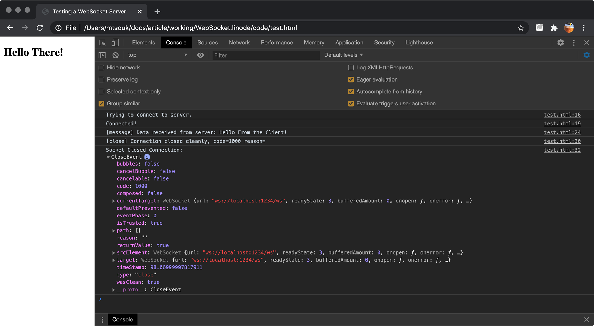

---
author:
  name: Mihalis Tsoukalos
  email: mihalistsoukalos@gmail.com
description: 'Creating WebSocket clients and servers in Go'
keywords: ["UNIX", "shell", "Go", "Golang", "WebSocket", "Gorilla", "HTTP"]
license: '[CC BY-ND 4.0](https://creativecommons.org/licenses/by-nd/4.0)'
published: 2020-07-08
modified_by:
  name: Linode
title: 'Learn how to develop WebSocket clients and servers in Go'
contributor:
  name: Mihalis Tsoukalos
  link: https://www.mtsoukalos.eu/
external_resources:
  - '[Go Programming Language](https://golang.org/)'
  - '[Mastering Go, 2nd edition](https://www.packtpub.com/programming/mastering-go-second-edition)'
  - '[The WebSocket Protocol](https://tools.ietf.org/rfc/rfc6455.txt)'
  - '[WebSocket](https://en.wikipedia.org/wiki/WebSocket)'
  - '[Gorilla Web Socket package](https://github.com/gorilla/websocket)'
  - '[Gorilla Web Socket documentation](https://www.gorillatoolkit.org/pkg/websocket)'
  - '[The websocket package](https://pkg.go.dev/golang.org/x/net/websocket)'
  - '[The `websocat` utility](https://github.com/vi/websocat)'
---

## Introduction

The subject of this guide is the WebSocket protocol and how to develop WebSocket clients and servers in Go.


This guide is written for a non-root user. Depending on your configuration, some commands might require the help of `sudo` in order to get property executed. If you are not familiar with the `sudo` command, see the [Users and Groups](/docs/tools-reference/linux-users-and-groups/) guide.


In this guide you will:

- Understand the advantages of the WebSocket protocol
- Learn how to create WebSocket clients in Go using two different Go packages
- Learn how to create WebSocket servers in Go
- Learn how to to use and test WebSocket clients and servers in Go
- Learn how to run a WebSocket server as a Docker image

## Before You Begin

To run the examples in this guide, your workstation or server will need to have Go installed, and the `go` CLI will need to be set in your terminal’s `PATH`. If you install Go using the Linux package manager that comes with your Linux distribution, you will most likely not need to worry about setting the `PATH` shell variable.


This guide was written with Go version 1.14.


As we are going to use the `gorilla/websocket` Go package, it would be good to download it on your local machine by executing the next command:

    go get -u github.com/gorilla/websocket

## The WebSocket Protocol

This section will briefly discuss the WebSocket protocol and tell you why it is important.

The WebSocket protocol is a computer communications protocol that provides *full-duplex* communication channels over a single TCP connection. The WebSocket Protocol is defined in [RFC 6455](https://tools.ietf.org/html/rfc6455) and uses `ws://` and `wss://` instead of `http://` and `https://`, respectively. Therefore, the client should begin a WebSocket connection by using a URL that begins with `ws://`.

The advantages of the WebSocket Protocol include the following:

- A WebSocket connection is a full-duplex, bidirectional communications channel.
- WebSocket connections are raw TCP-Sockets, which means that they do not have the overhead required for establishing an HTTP connection.
- WebSocket connections can also be used for sending HTTP data.
- WebSocket connections live until they are killed.
- WebSocket connections can be used for real-time web applications.
- Data can be sent from server to client at any time, without the client even requesting it.
- WebSockets are a part of the HTML5 specification, which means that they are supported by all modern Web browsers.

## Developing a WebSocket Server in Go

In this section we are going to develop a small yet fully functional WebSocket server in Go using [gorilla/websocket](https://github.com/gorilla/websocket) in order to be able to test the WebSocket clients that will be implemented later on. The server implements the *Echo service*, which means that it automatically returns its input back to the client.

Before showing the server implementation, it would be good for you to know that the `websocket.Upgrader` method of the `gorilla/websocket` package upgrades an HTTP server connection to the WebSocket protocol and allows you to define the parameters of the upgrade. After that, your HTTP connection is a WebSocket connection, which means that you will not be allowed to execute statements that work with the HTTP protocol.

### The WebSocket Server Implementation

The contents of `WSserver.go` are the following:


package main

import (
  "fmt"
  "log"
  "net/http"
  "os"
  "time"

  "github.com/gorilla/websocket"
)

var PORT = ":1234"

var upgrader = websocket.Upgrader{
  ReadBufferSize:  1024,
  WriteBufferSize: 1024,
  CheckOrigin: func(r *http.Request) bool {
		return true
	},
}

func rootHandler(w http.ResponseWriter, r *http.Request) {
  fmt.Fprintf(w, "Welcome!\n")
  fmt.Fprintf(w, "Please use /ws for WebSocket!")
}

func wsHandler(w http.ResponseWriter, r *http.Request) {
  log.Println("Connection from:", r.Host)

  ws, err := upgrader.Upgrade(w, r, nil)
  if err != nil {
    log.Println("upgrader.Upgrade:", err)
    return
  }
  defer ws.Close()

  for {
    mt, message, err := ws.ReadMessage()
    if err != nil {
      log.Println("From", r.Host, "read", err)
      break
    }
    log.Print("Received: ", string(message))
    err = ws.WriteMessage(mt, message)
    if err != nil {
      log.Println("WriteMessage:", err)
      break
    }
  }
}

func main() {
  arguments := os.Args
  if len(arguments) != 1 {
    PORT = ":" + arguments[1]
  }

  mux := http.NewServeMux()
  s := &http.Server{
    Addr:         PORT,
    Handler:      mux,
    IdleTimeout:  10 * time.Second,
    ReadTimeout:  time.Second,
    WriteTimeout: time.Second,
  }

  mux.Handle("/", http.HandlerFunc(rootHandler))
  mux.Handle("/ws", http.HandlerFunc(wsHandler))

  log.Println("Listening to TCP Port", PORT)
  err := s.ListenAndServe()
  if err != nil {
    log.Println(err)
    return
  }
}


Now that we have an implementation for the WebSocket server, it is time to explain its code in the next subsection.

### Explaining the Go Code

This subsection will discuss and explain the most important parts of `WSserver.go`, which are the following:

- A WebSocket server application calls the `Upgrader.Upgrade` method in order to get a WebSocket connection from an HTTP request handler. After a successful call to `Upgrader.Upgrade`, the server begins working with the WebSocket connection and the WebSocket client.
- The endpoint used for WebSocket can be anything you want - in this case it is `/ws`. Additionally, you can have multiple endpoints that work with WebSocket.
- The `for` loop in `wsHandler()` handles all incoming messages for `/ws` – you can use any technique you want.
- In the presented implementation, only the client is allowed to close an existing WebSocket connection unless there is a network issue or the server process is killed.
- Last, it is very important to remember that in a WebSocket connection you cannot use `fmt.Fprintf()` statements to send data to the WebSocket client - if you use any of these, or any other call that can implement the same functionality, the WebSocket connection will fail and you will not be able to send or receive any data. Therefore, the only way to send and receive data in a WebSocket connection implemented with `gorilla/websocket` is through `WriteMessage()` and `ReadMessage()` calls, respectively. Of course, you can always implement the desired functionality on your own but implementing this goes beyond the scope of this guide.


The server implementation is small yet fully functional. The single most important call is `Upgrader.Upgrade` because this is what upgrades an HTTP connection to a WebSocket connection.


### Using and Testing the WebSocket Server

In this subsection you will learn how to use the WebSocket server. First, you should start the WebSocket server as follows:

    go run WSserver.go

 This means that the WebSocket server will listen to the default port number, which is `1234`. The output of `WSserver.go` will verify that:


2020/07/06 18:55:36 Listening to TCP Port :1234


#### Using JavaScript

In order to test the functionality of the WebSocket server we are going to get help from some HTML and JavaScript code – this is not the only way to test a WebSocket server – you will see a different way in a while.

The HTML page with the JavaScript code that makes it to act as a WebSocket client is the following:


<!DOCTYPE html>
<meta charset="utf-8">

<html lang="en">
  <head>
    <meta charset="UTF-8" />
    <meta name="viewport" content="width=device-width, initial-scale=1.0" />
    <meta http-equiv="X-UA-Compatible" content="ie=edge" />
    <title>Testing a WebSocket Server</title>
  </head>
  <body>
    <h2>Hello There!</h2>

    
  </body>
</html>


The single most important JavaScript statement is `let ws = new WebSocket("ws://localhost:1234/ws")` because this is where you specify the WebSocket server, the port number and the endpoint you want to connect to. After that, the `onopen` event is used for making sure that the WebSocket connection is open whereas the `send()` method is used for sending messages to the WebSocket server. The `onmessage` event is triggered each time the WebSocket sends a new message - however, in our case the connection will be closed as soon as the first message from the server is received. Last, the `close()` JavaScript method is used for closing a WebSocket connection – in our case the `close()` call is included in the `onmessage` event. Calling `close()` will trigger the `onclose` event.

You can see the output of the JavaScript code by visiting the JavaScript console on your favorite web browser, which in this case is Google Chrome.

For the WebSocket interaction defined in `test.html`, the WebSocket server generated the following output:


2020/07/06 18:55:36 Listening to TCP Port :1234
2020/07/06 18:56:07 Connection from: localhost:1234
2020/07/06 18:56:07 Received: Hello From the Client!
2020/07/06 18:56:07 From localhost:1234 read websocket: close 1000 (normal): Work complete


#### Using `websocat` as a WebSocket client

`websocat` is a command line utility that can help you test WebSocket connections. As `websocat` is not installed by default, *you will need to install it* on your own. After a successful installation, you are free to use `websocat` to test the WebSocket server. However, `websocat` can also take the place of a WebSocket server in case you want to test your WebSocket clients. The command that you will need to execute in our case is the following:

    websocat ws://localhost:1234/ws


Hello there from websocat!
Hello there from websocat!
Bye!
Bye!


Should you wish a more verbose output from `websocat`, you can execute it with the `-v` flag:

    websocat -v ws://localhost:1234/ws


[INFO  websocat::lints] Auto-inserting the line mode
[INFO  websocat::sessionserve] Serving Line2Message(Stdio) to Message2Line(WsClient("ws://localhost:1234/ws")) with Options { websocket_text_mode: true, websocket_protocol: None, websocket_reply_protocol: None, udp_oneshot_mode: false, unidirectional: false, unidirectional_reverse: false, exit_on_eof: false, oneshot: false, unlink_unix_socket: false, exec_args: [], ws_c_uri: "ws://0.0.0.0/", linemode_strip_newlines: false, linemode_strict: false, origin: None, custom_headers: [], custom_reply_headers: [], websocket_version: None, websocket_dont_close: false, one_message: false, no_auto_linemode: false, buffer_size: 65536, broadcast_queue_len: 16, read_debt_handling: Warn, linemode_zero_terminated: false, restrict_uri: None, serve_static_files: [], exec_set_env: false, reuser_send_zero_msg_on_disconnect: false, process_zero_sighup: false, process_exit_sighup: false, socks_destination: None, auto_socks5: None, socks5_bind_script: None, tls_domain: None, tls_insecure: false, headers_to_env: [], max_parallel_conns: None, ws_ping_interval: None, ws_ping_timeout: None }
[INFO  websocat::stdio_peer] get_stdio_peer (async)
[INFO  websocat::stdio_peer] Setting stdin to nonblocking mode
[INFO  websocat::stdio_peer] Installing signal handler
[INFO  websocat::ws_client_peer] get_ws_client_peer
[INFO  websocat::ws_client_peer] Connected to ws
Hello!
Hello!
[INFO  websocat::sessionserve] Forward finished
[INFO  websocat::sessionserve] Forward shutdown finished
[INFO  websocat::sessionserve] Reverse finished
[INFO  websocat::sessionserve] Reverse shutdown finished
[INFO  websocat::sessionserve] Finished
[INFO  websocat::stdio_peer] Restoring blocking status for stdin
[INFO  websocat::stdio_peer] Restoring blocking status for stdin


For these two `websocat` interactions, the WebSocket server generated the following output:


2020/07/06 19:00:48 Connection from: localhost:1234
2020/07/06 19:00:58 Received: Hello there from websocat!
2020/07/06 19:01:02 Received: Bye!
2020/07/06 19:01:03 From localhost:1234 read websocket: close 1005 (no status)
2020/07/06 19:02:23 Received: Hello!
2020/07/06 19:02:23 From localhost:1234 read websocket: close 1005 (no status)


## Developing WebSocket clients in Go

In this section of the guide you will learn how to develop WebSocket clients using two different Go packages.

### Using `gorilla/websocket`

The subject of this section is the development of WebSocket clients using the functionality offered by `gorilla/websocket`.

#### The Go code of the Client

The present WebSocket client requires two command line arguments, which are the hostname of the WebSocket server with the port number and the endpoint. The Go code of `WSclient.go` is the following:


package main

import (
  "bufio"
  "fmt"
  "log"
  "net/url"
  "os"
  "os/signal"
  "syscall"
  "time"

  "github.com/gorilla/websocket"
)

var SERVER = "ws://localhost:1234/"
var PATH = ""
var TIMESWAIT = 0
var TIMESWAITMAX = 5
var in = bufio.NewReader(os.Stdin)

func getInput(input chan string) {
  result, err := in.ReadString('\n')
  if err != nil {
    log.Println(err)
    return
  }
  input <- result
}

func main() {
  arguments := os.Args
  if len(arguments) != 3 {
    fmt.Println("Need SERVER PATH!")
    return
  }

  SERVER = arguments[1]
  PATH = arguments[2]
  fmt.Println("Connecting to:", SERVER, "at", PATH)

  interrupt := make(chan os.Signal, 1)
  signal.Notify(interrupt, os.Interrupt)

  input := make(chan string, 1)
  go getInput(input)

  URL := url.URL{Scheme: "ws", Host: SERVER, Path: PATH}
  c, _, err := websocket.DefaultDialer.Dial(URL.String(), nil)
  if err != nil {
    log.Println("Error:", err)
    return
  }
  defer c.Close()

  done := make(chan struct{})
  go func() {
    defer close(done)
    for {
      _, message, err := c.ReadMessage()
      if err != nil {
        log.Println("ReadMessage() error:", err)
        return
      }
      log.Printf("Received: %s", message)
    }
  }()

  for {
    select {
    case <-time.After(4 * time.Second):
      log.Println("Please give me input!", TIMESWAIT)
      TIMESWAIT++
      if TIMESWAIT > TIMESWAITMAX {
        syscall.Kill(syscall.Getpid(), syscall.SIGINT)
      }
    case <-done:
      return
    case t := <-input:
      err := c.WriteMessage(websocket.TextMessage, []byte(t))
      if err != nil {
        log.Println("Write error:", err)
        return
      }
      TIMESWAIT = 0
      go getInput(input)
    case <-interrupt:
      log.Println("Caught interrupt signal - quitting!")
      err := c.WriteMessage(websocket.CloseMessage, websocket.FormatCloseMessage(websocket.CloseNormalClosure, ""))
      if err != nil {
        log.Println("Write close error:", err)
        return
      }
      select {
      case <-done:
      case <-time.After(2 * time.Second):
      }
      return
    }
  }
}


The implementation of the WebSocket client is much more complex and advanced that the implementation of the WebSocket server, hence the length of `WSclient.go`.

#### Explaining the Go Code of the Client

The utility uses 2 *Go channels* and can timeout when it takes too long for the user to give input. The Go code of the client is logically divided into three main parts.

- The first part is about the `getInput()` function, which is executed as a goroutine and gets user input that is transferred to the `main()` function via the `input` channel. Each time the program reads some user input, the old goroutine ends and a new `getInput()` goroutine begins in order to get new input.
- The second part is about handling UNIX interrupts with the help of the `interrupt` channel. When the appropriate signal is caught (`syscall.SIGINT`), the WebSocket connection with the server is closed with the help of the `websocket.CloseMessage` message.
- The third part is about the WebSocket protocol. The WebSocket connection begins with a call to `websocket.DefaultDialer.Dial()`. Everything that goes to the `input` channels is transferred to the WebSocket server using the `WriteMessage()` method. Another goroutine, which this time is implemented using an anonymous Go function, is responsible for reading data from the WebSocket connection using the `ReadMessage()` method.

The `for` loop at the end of the `main()` function is what orchestrates the program and deals with the channels, user input and UNIX interrupt handling.

Have in mind that the `syscall.Kill(syscall.Getpid(), syscall.SIGINT)` statement sends the interrupt signal to the program using Go code. According to the logic of `WSclient.go`, the interrupt signal will make the program to close the WebSocket connection with the server and terminate its execution.

#### Using the WebSocket client

In this section you will learn how to use the `WSclient.go` WebSocket client. The `WSclient.go` utility is executed using the following format:

    go run WSclient.go localhost:1234 /ws

First, you define the host and the port number of the server without using `ws://` and then you give the endpoint you want to connect to.

An interaction with the server that timeouts will look similar to the following:


Connecting to: localhost:1234 at /ws
1
2020/07/07 18:03:41 Received: 1
2
2020/07/07 18:03:41 Received: 2
3
2020/07/07 18:03:42 Received: 3
4
2020/07/07 18:03:42 Received: 4
2020/07/07 18:03:46 Please give me input! 0
2020/07/07 18:03:50 Please give me input! 1
2020/07/07 18:03:54 Please give me input! 2
2020/07/07 18:03:58 Please give me input! 3
2020/07/07 18:04:02 Please give me input! 4
2020/07/07 18:04:06 Please give me input! 5
2020/07/07 18:04:06 Caught interrupt signal - quitting!
2020/07/07 18:04:06 ReadMessage() error: websocket: close 1000 (normal)


The output generated by the WebSocket server for the aforementioned interaction will be the following:


2020/07/07 18:03:25 Listening to TCP Port :1234
2020/07/07 18:03:40 Connection from: localhost:1234
2020/07/07 18:03:41 Received: 1
2020/07/07 18:03:41 Received: 2
2020/07/07 18:03:42 Received: 3
2020/07/07 18:03:42 Received: 4
2020/07/07 18:04:06 From localhost:1234 read websocket: close 1000 (normal)


### Using `golang.org/x/net/websocket`

The `golang.org/x/net/websocket` package offers another way of developing WebSocket clients and servers. This section will showcase how to implement a WebSocket client with it. The presented command line utility will read user input, send it to the WebSocket server and read the response from the WebSocket server before automatically quitting.

As we are going to use the `golang.org/x/net/websocket` Go package in this subsection, it would be good to download it on your local machine by executing the next command:

    go get -u golang.org/x/net/websocket


According to its documentation, `golang.org/x/net/websocket` lacks some features and you are advised to use `https://godoc.org/github.com/gorilla/websocket` or `https://godoc.org/nhooyr.io/websocket` instead. However, it is good to know about it as it might become part of the standard Go library if it ever gets properly updated.


#### The Go code of the Client

The Go code of `xWSclient.go` is the following:


package main

import (
  "bufio"
  "fmt"
  "log"
  "os"

  "golang.org/x/net/websocket"
)

var SERVER = "ws://localhost:1234/"
var PATH = ""

func main() {
  arguments := os.Args
  if len(arguments) != 3 {
    fmt.Println("Need SERVER PATH!")
    return
  }

  SERVER = arguments[1]
  PATH = arguments[2]
  fmt.Println("Connecting to:", SERVER, "at", PATH)

  ws, err := websocket.Dial("ws://"+SERVER+PATH, "", "http://"+SERVER)
  if err != nil {
    log.Println(err)
    return
  }
  defer ws.Close()

  in := bufio.NewReader(os.Stdin)
  result, err := in.ReadString('\n')
  if err != nil {
    log.Println(err)
    return
  }

  fmt.Print("Sending: ", result)
  _, err = ws.Write([]byte(result))
  if err != nil {
    log.Println(err)
    return
  }
  var msg = make([]byte, 512)
  var n int

  n, err = ws.Read(msg)
  if err != nil {
    log.Println(err)
    return
  }
  fmt.Printf("Received: %s", msg[:n])
}


The length of `xWSclient.go` is small because it performs three main actions:

- First, it reads the required information about the WebSocket server and the desired endpoint in order to create the appropriate WebSocket connection.
- Second, it reads user input using `bufio.NewReader(os.Stdin)` and `ReadString()`.
- Third, it sends the user input to the WebSocket connection, waits for the WebSocket server response and automatically closes the WebSocket connection.

#### Explaining the Go Code of the Client

This subsection will discuss the Go implementation of the WebSocket client that uses `golang.org/x/net/websocket`.

The WebSocket connection begins by a successful call to `websocket.Dial()`. After that, the WebSocket client can send data to the server using the `Write()` method and read data from the WebSocket server using the `Read()` method. Knowing how to use these three calls wil allow you to connect and interact with any WebSocket server.

#### Using the WebSocket client

This subsection will show `xWSclient.go` in action. The utility is executed as follows:

    go run xWSclient.go localhost:1234 /ws


Connecting to: localhost:1234 at /ws
Hello from the WebSocket client!
Sending: Hello from the WebSocket client!
Received: Hello from the WebSocket client!


The output generated by the WebSocket server, which should be running before using the client, for the aforementioned interaction will be the following:


2020/07/06 22:25:39 Listening to TCP Port :1234
2020/07/06 22:25:55 Connection from: localhost:1234
2020/07/06 22:26:08 Received: Hello from the WebSocket client!
2020/07/06 22:26:08 From localhost:1234 read websocket: close 1000 (normal)


## Creating a Docker image

In this section you will learn how to put the WebSocket server in a *Docker image* and use that Docker image afterwards.

First, you will need to create a `Dockerfile` in the directory where the Go file for the server resides. The contents of the `Dockerfile` will allow you to create the Docker image in a while:


FROM golang
RUN mkdir /ws
ADD ./WSserver.go /ws/
WORKDIR /ws
RUN go get -d -v ./...
RUN go build -o server WSserver.go
CMD ["/ws/server"]


What you have now is a recipe for running `WSserver.go` in a Docker environment using the `golang` as base. The next step will be about creating the new Docker image, which requires the execution of the following command:

    docker build -t websocket-server .

Note that we have named the new Docker image as `websocket-server` – you can use any name you want. As said before, both `Dockerfile` and `WSserver.go` should reside on the same directory.

The generated output should be similar to the following:


Sending build context to Docker daemon  11.26kB
Step 1/7 : FROM golang
 ---> 00d970a31ef2
Step 2/7 : RUN mkdir /ws
 ---> Running in cf5b4a427477
Removing intermediate container cf5b4a427477
 ---> 3ff0aed63779
Step 3/7 : ADD ./WSserver.go /ws/
 ---> fb3ef62b7339
Step 4/7 : WORKDIR /ws
 ---> Running in e92744d0d2af
Removing intermediate container e92744d0d2af
 ---> 8c3ff23ed1b6
Step 5/7 : RUN go get -d -v ./...
 ---> Running in 051c1283a2e0
github.com/gorilla/websocket (download)
Removing intermediate container 051c1283a2e0
 ---> 64f7b18ba6c7
Step 6/7 : RUN go build -o server WSserver.go
 ---> Running in 388b680c5e37
Removing intermediate container 388b680c5e37
 ---> 562a689e16b4
Step 7/7 : CMD ["/ws/server"]
 ---> Running in 60b8a21fd41c
Removing intermediate container 60b8a21fd41c
 ---> a941617ef742
Successfully built a941617ef742
Successfully tagged websocket-server:latest


If you execute the `docker images` command, you should be able to see a Docker image named `websocket-server`.

The last step is about running the Docker image:

    docker run -it -p 8080:1234 websocket-server

In this particular example, the internal port number (`1234`), which belongs to the Docker container, is associated with port number `8080` on the local machine. You can now use `WSserver.go` as if it was running on port number `8080`! The output of the Docker image will be presented on your terminal.

You can choose any TCP port number you want as long as it is not already in use. Additionally, you can execute multiple Docker images provided that they do not use the same *external TCP port* at the same time.


A different way to execute the `websocket-server` Docker image is as `docker run -d -p 8080:1234 websocket-server`, which will put it in the background.


## Summary

In this guide we talked about developing WebSocket servers and clients. You can use and modify the presented Go code to match your needs and develop your own command line utilities and servers that work with the WebSocket protocol.
