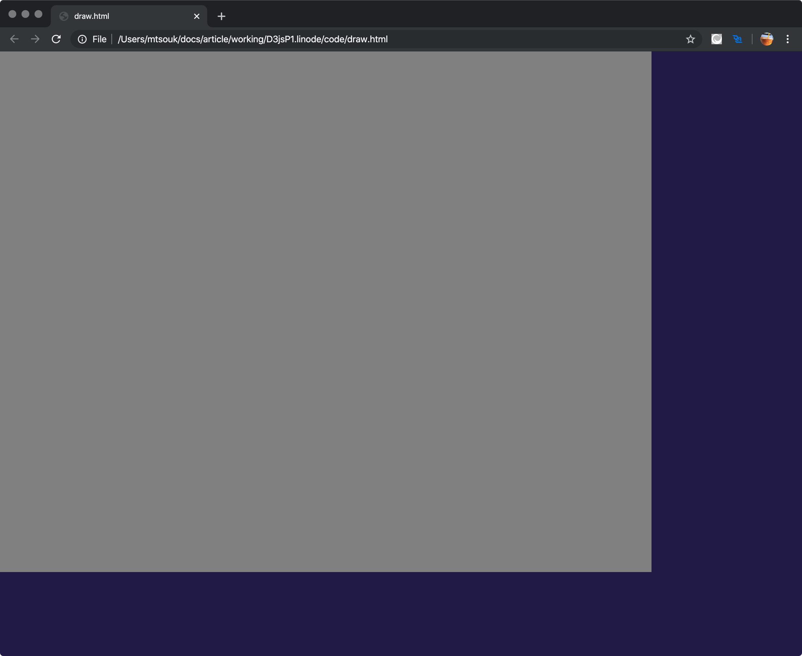
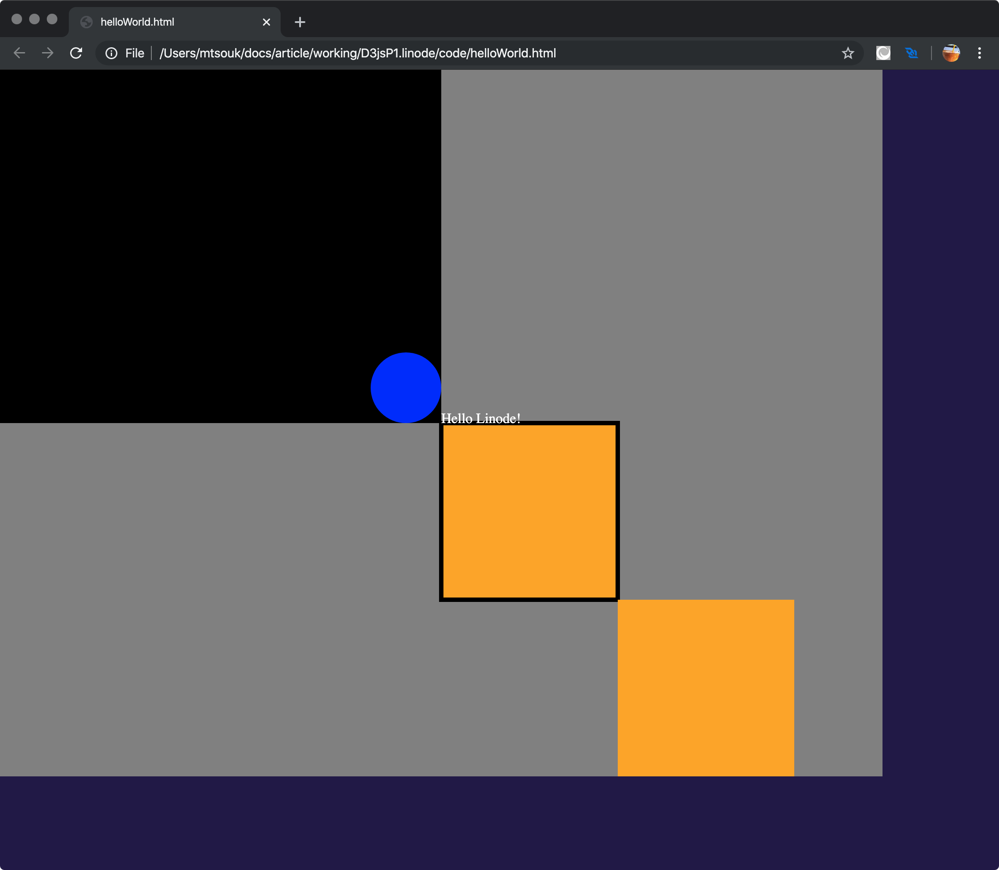
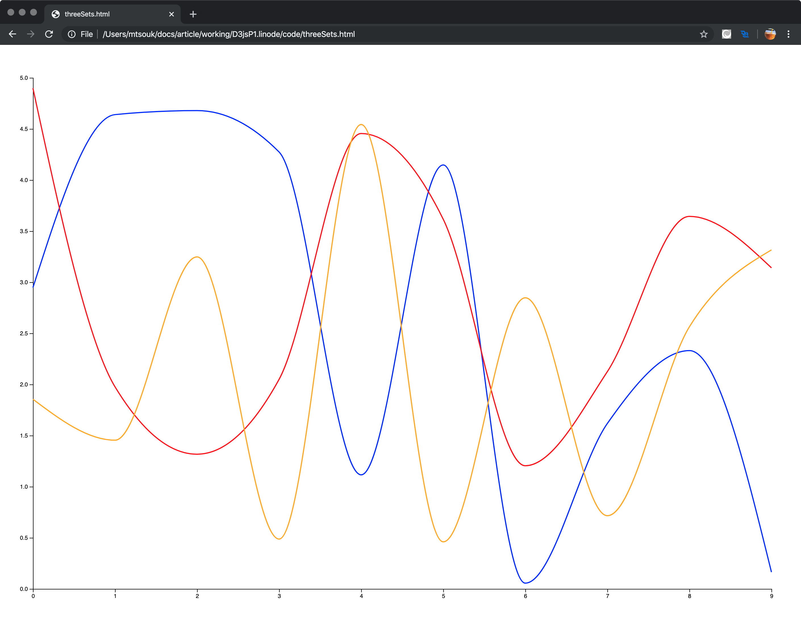
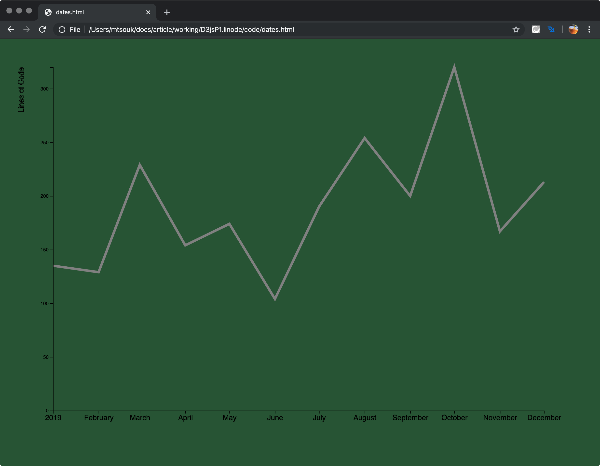

---
author:
  name: Mihalis Tsoukalos
  email: mihalistsoukalos@gmail.com
description: 'An introduction to the D3.js JavaScript library.'
keywords: ["D3.js", "Visualization", "JavaScript", "Programming"]
license: '[CC BY-ND 4.0](https://creativecommons.org/licenses/by-nd/4.0)'
published: 2019-12-13
modified_by:
  name: Linode
title: 'Plotting data sets with the D3.js JavaScript Library.'
contributor:
  name: Mihalis Tsoukalos
  link: https://www.mtsoukalos.eu/
external_resources:
  - '[D3.js](https://d3js.org/)'
  - '[D3.js examples](https://github.com/d3/d3/wiki/Gallery)'
---

## Introduction

This guide is an introduction to the powerful [D3.js](https://d3js.org/) JavaScript library that is used for Visualization. For reasons of simplicity all data will be included in the HTML file that contains the JavaScript code. However, D3.js can read data from text files that reside on your local machine or on the Internet.


Note that D3.js is a low level library, which means that you will need to write lots of code to do what you want. On the other hand, this gives you complete control over the generated output.


## In This Guide

This guide will introduce you to the D3.js JavaScript library –D3 stands for *Data Driven Documents*– that is used for creating visualizations. All you need to follow this guide is your favorite text editor, a web browser and Internet access.

### Installing D3.js

The D3.js library can be downloaded from the Internet by the HTML page that also displays your visualizations so there is no need to download it locally.

The following HTML file uses D3.js to draw a rectangle on your screen – this can also be used for making sure that you can successfully get D3.js from the Internet:


<!DOCTYPE html>
<meta charset="utf-8">

<body>

</body>
</html>


The first thing that you will need to do is load the D3.js library into the HTML page. As D3.js is written in JavaScript, you will need to embed the JavaScript code into `

</body>
</html>


The core structure and the logic of `helloWorld.html` are the same as in `draw.html`. However, this time there is more JavaScript code because we want to draw more shapes and print a text message. The attributes for creating a rectangle, which also allows you to create a square, are just `width` and `height` whereas the attributes for creating a circle are `cx`, `cy` and `r`, which are the coordinates of the center of the circle and the length of its radius. Additionally, the `x` and `y` attributes, which appear in almost all `append()` functions, move the active canvas position to the desired coordinates, which allows you to define the point where a shape or your text will be positioned.

The image that follows presents the generated output.

### Plotting in 2D

In this section we will begin to plot data from data sets. Note that if your code does not work as expected, you can use the `console.log()` JavaScript function to print debugging messages that will be shown in the JavaScript console of your web browser. Last, you should always have in mind how the D3.js coordinate system works because you will need to apply some transformations for the output to be in the way you want.

#### Plotting a single Data Set

In this section you will learn how to beautifully plot a single data set using a bar chart. As mentioned before, the data will be included in the HTML file for reasons of simplicity and is going to be in JSON format. Each JSON record contains a number, which is the number of lines of code and a string, which is the full name of the developer that committed these lines of code. The full JavaScript and HTML code of `singleSet.html` is the following:


<!DOCTYPE html>
<meta charset="utf-8">

<body>

</body>
</html>


Now let us explain the JavaScript code:

- D3.js has multiple versions. The used version is defined in `https://d3js.org/d3.v4.min.js` – in this case is version `v4`.
- The size of the canvas is 1000 pixels wide and 800 pixels tall.
- The JSON data is kept in the `dset` JavaScript variable and is passed to the plot using the `data()` method. If you put more JSON records in `dset`, the output will be updated automatically when you reload the HTML page.
- The `append()` method appends a new element with the specified name as the last child of each element in the current selection.
- The `attr()` method is used for adding attributes to an element. The first argument is the name of the attribute and the second parameter is its value.
- The `yScale = d3.scaleLinear().range ([height, 0]);` statement is used for telling D3 that the values for the y axis are between the value of the `height` variable and `0`. When dealing with dates and times, you will need to call `scaleTime()` instead.
- The `xScale.domain()` and `yScale.domain()` methods are used for getting the range of values for the x axis and the y axis, respectively. In this case, the x axis contains strings that are defined in the `name` field whereas the y axis contains the range of values for the `lines` field. Note that the range of values of the y axis as found in `dset` will be translated to values in the `[height, 0]` range, as defined in the `yScale` variable.
- The height of each bar corresponds to a value of the data set.
- The width of each bar –all bars have the same width– is calculated by the `scaleBand()` function.
- The width of each bar is defined by `.attr("width", xScale.bandwidth())`.
- The height of each bar is defined by `.attr("height", function(d) { return height - yScale(d.lines); })`.
- The color of each bar is defined using CSS (`.bar { fill: lightblue; }`).
- The `data()` method passes the data to D3.js.
- The `enter()` method creates the mapping between your data and the DOM. In our case, it creates a bar for each element in the data set.

The image that follows presents the generated output – if you have the time, you can change the contents of the `data` variable and see how the output changes.

Note that bar charts are very popular plots due to their simplicity.

#### Plotting Multiple Data Sets

In this section you will learn how to plot multiple data sets on the same plot. In this case, we are going to plot three different data sets.


<!DOCTYPE html>
<meta charset="utf-8">

<body>

</body>
</html>


Some things about the code:

- The version of D3.js that is used is `v5` (`https://d3js.org/d3.v5.min.js`).
- The data of the three data sets are stored in the `dset1`, `dset2` and `dset3` JavaScript variables and are **generated randomly**. This means that every time you load the HTML page, you will get a different output.
- The number of data in each data set is defined by the `totalPoints` variable.
- The generated random numbers are from `0` up to the value of the `max` variable, which is currently `5`.
- Each one of the three data sets is added to the output using a `svg.append("path")` block with a class of `line`. All these three blocks are the same apart from the argument to the `datum()` method.
- The displayed values in the y axis are from `0` to the value of the `max` variable (`domain([0, max])`) and are mapped to the height of the canvas using `range([height, 0])`.
- Both the x axis and the y axis are numeric values so `d3.scaleLinear()` is used in both `xScale` and `yScale`.
- The `d3.randomUniform(max)` function generates numbers randomly.
- The call for creating the x axis is `d3.axisBottom(xScale)`.
- The call for creating the y axis is `d3.axisLeft(yScale)`.
- The color of each line is defined with `.style("stroke", "YOUR COLOR NAME HERE")`.
- If you remove the `.line {fill: none; stroke: #ffab00; stroke-width: 2;}` CSS code, the output will not look pretty! The `fill: none;` part is really important.

The image that follows presents the generated output.

Note that line charts can be very handy when you have a large number of elements in a data set. Additionally, have in mind that when plotting multiple data sets, there might exist big differences between the maximum and minimum values of the data sets. As a result, you might need to [normalize](https://en.wikipedia.org/wiki/Normalization_(statistics)) the values of the data sets.

### Working with Times and Dates

If your data contains times and dates, you will have to find a way of plotting them, which is what this section will teach you. The difficulty with time series data is that you will have to decide which part of a date and time value are you going to use and how to convert a string that represents a date and/or time into a real date and time variable.


<!DOCTYPE html>
<meta charset="utf-8">

<body>

</body>


Some helpful things about the presented code:

- Each string with date and time is parsed using the definition of the `parseTime` variable.
- The `d3.timeParse("%b-%y")` statement describes the format that each string that is going to be converted into a date and time is expected to have. This is really important for the successful parsing of the data.
- Each element of `dset` is processed with a `dset.forEach()` loop. What this loop does in this case is replacing the current value of the `date` field, which is just a string, with a valid date and time variable. You can learn more about that [here](https://github.com/d3/d3-time-format).
- If you want, you can process multiple fields in `dset.forEach()` – this is not needed here.
- As the x axis contains date and time values, the `d3.scaleTime()` function is used when defining the `xScale` variable.

The image that follows presents the generated output.

## Summary

D3.js is a powerful low level JavaScript library that can create unique, customizable and impressive output. The bad thing with being low level is that you will need to write lots of JavaScript code even for relatively simple tasks. On the other hand, once you have produced the output you want, you can easily create similar plots by making small changes to the existing JavaScript code.
