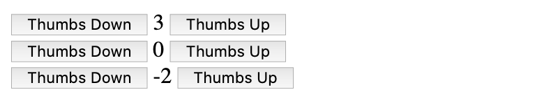
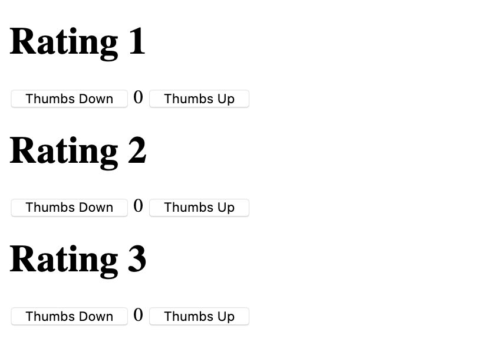

---
author:
  name: Linode Community
  email: docs@linode.com
description: VueJS is a javascript framework for building interfaces, it is very easy to adopt and can greatly help you in structuring your applications. One of the most important features of VueJS are components and in this guide you will learn about component essentials.
keywords: ['vue js','javascript']
license: '[CC BY-ND 4.0](https://creativecommons.org/licenses/by-nd/4.0)'
published: 2020-02-02
modified_by:
  name: Linode
title: How to build and use VueJS components
contributor:
  name: Pavel Petrov
  link: https://github.com/WebBamboo/
external_resources:
- '[VueJS](https://vuejs.org/)'
- '[Github Repository of the guide](https://github.com/WebBamboo/)'
audiences: ["beginner"]
languages: ["javascript"]
---

## In this guide:
The goal of this guide is explaining to users new to VueJS what are components and how to build and use them. Basic knowledge of Javascript and VueJS is important for following through with the tutorial. 

## The following topics will be covered:
 - What are VueJS components
 - How to create your first component
 - What is component template
 - What is component data
 - What are component props
 - What are slots
 - What are component events

You can download the files for this guide in this Git Repository

## What are VueJS components
In VueJS components are a way to create custom VueJS instances which can easily be reused in your code. In order to properly explain what VueJS components are we will build a very simple “rating-counter” component and I will explain each part.

## Creating your first component
As this would be a simple VueJS application the first thing we have to do is include the vuejs library in our document. The easiest way that is done is by going to the Installation Page at VueJs.org and copying the script tag specified under CDN. As we are in the development stage of application we will use the development version of the VueJS library.
```html
<script src="https://cdn.jsdelivr.net/npm/vue/dist/vue.js"></script>
<div id="app">
</div>
<script>
var app = new Vue({
  el: '#app'
})
</script>
```


What I’ve done here is including the VueJS library and initiated a barebones VueJS app related to the element with the id “app”. So far this does nothing at all, but we will use it for the skeleton of our example application.
The point of the component I’ll be developing is a simple reusable rating counter that will illustrate how VueJS components work. The example will be very simple and I’ll do my best to explain everything along the way. Now let's get our hands dirty! :)
```js
   Vue.component('rating-counter', {
       data() {
           return {
               count: 0
           }
       },
       template:   `<div>
                       <button v-on:click="count--">Thumbs Down</button>
                       {{ count }}
                       <button v-on:click="count++">Thumbs Down</button>
                   </div>`
   })
```
The code is very simple but I will go through each part. The first parameter of the Vue.component is the component’s name, in this case “rating-counter”. You will be referring to this component by its name, so if you want to render the component in the html you will use:
```html
<rating-counter></rating-counter>
```
The second argument is the component’s options. We only use two options, the data function and the template. 

## What is component data
The component’s data must be a function. This is because each instance of the component must have a separate and independent copy of the data object, otherwise each time we reuse a component it will inherit the data from the other instance of the component.

## What is a component template
The template contains the html this component will render. You’re probably aware that VueJS uses mustache tags to render strings. If you look at our example {{ count }} will render the count from the component data. What is interesting is that as VueJS is reactive, when you change your variable the view automatically updates it and you don’t have to do anything! Another thing you probably noticed in the template is the v-on:click attribute of the buttons. Similarly to jQuery`s .on(‘click’, func) using this you can attach a function to the on-click event of the element. This can either be pointed to a function, or in this case as the example is very simple just use Javascript operators - the increment(++) and decrement(--) - directly in the attribute itself.

We’ve built our first component YEY!
Now lets try it out:

```js
<div id="app">
   <rating-counter></rating-counter>
   <rating-counter></rating-counter>
   <rating-counter></rating-counter>
</div>
```
This will render three rating counters which work independently from one another!


Awesome. Let's say however that we need to pass arguments from the parent application to the component. The option for that is called “props”.

## What are component props 
Lets modify our component a little bit:
```js
Vue.component('rating-counter', {
       props: ['title'],
       data() {
           return {
               count: 0
           }
       },
       template:   `<div>
                       <h1>{{ title }}</h1>
                       <button v-on:click="count--">Thumbs Down</button>
                       {{ count }}
                       <button v-on:click="count++">Thumbs up</button>
                   </div>`
   })
```
Everything is the same but I’ve now added the props option and I access its values like a regular data parameter. You can see the reference to {{ title }} in the template. But how can you actually pass data to a prop? Just pass title as an attribute to your component’s opening tag and whatever you pass there would be accessible by your component.

```html
<div id="app">
   <rating-counter title=”Rating1”></rating-counter>
   <rating-counter title=”Rating2”></rating-counter>
   <rating-counter title=”Rating3”></rating-counter>
</div>
```
And voila:


Remember though unlike data, props are reactive, so if you pass parent data to the prop, changing the data from the component will cascade down the changes to the parent and all other components that reference it. I will expand a little on this one because it is a very important concept of components:
```html
<script src="https://cdn.jsdelivr.net/npm/vue/dist/vue.js"></script>

<div id="app">
   {{ parentTitle.title }}{{parentTitle.counter}}
   <rating-counter title="Rating1" v-bind:parent="parentTitle"></rating-counter>
   <rating-counter title="Rating2" v-bind:parent="parentTitle"></rating-counter>
   <rating-counter title="Rating3" v-bind:parent="parentTitle"></rating-counter>
</div>
<script>
   Vue.component('rating-counter', {
       props: ['title', 'parent'],
       data() {
           return {
               count: 0
           }
       },
       template:   `<div>
                       <h1>{{ title }}</h1>
                       <button v-on:click="count--;parent.counter--;">Thumbs Down</button>
                       {{ count }}
                       <button v-on:click="count++;parent.counter++;">Thumbs up</button>
                   </div>`
   })
  new Vue({
     el: '#app',
     data: {
         parentTitle: {
             title: "Counter is at: ",
             counter: 0
         }
     }
   })
</script>
```
In our component I’ve added another prop, called parent. This time however its value is assigned by v-bind:parent, that way you’re telling vuejs to bind the parent attribute of the component to whichever data property you supply, in this case the parentTitle object. When you run the code now you will see that each rating component affects the data attribute of the parent. 


## What are slots
Slots are another very clever way to pass data from parent to components in VueJS. Instead of using attributes as you did before you can pass data within the component <open> and </close> html tags. Let's take a look at the below example:
```html
<div id="app">
   {{ parentTitle.title }}{{parentTitle.counter}}
   <rating-counter v-bind:parent="parentTitle"><h1>Rating</h1></rating-counter>
   <rating-counter v-bind:parent="parentTitle"><h2>Rating</h2></rating-counter>
   <rating-counter v-bind:parent="parentTitle"><h3>Rating</h3></rating-counter>
</div>
<script>
   Vue.component('rating-counter', {
       props: ['parent'],
       data() {
           return {
               count: 0
           }
       },
       template:   `<div>
                       <slot></slot>
                       <button v-on:click="count--;parent.counter--;">Thumbs Down</button>
                       {{ count }}
                       <button v-on:click="count++;parent.counter++;">Thumbs up</button>
                   </div>`
   })
  new Vue({
     el: '#app',
     data: {
         parentTitle: {
             title: "Counter is at: ",
             counter: 0
         }
     }
   })
</script>
```

Notice how instead of passing the title prop with an argument we pass it within the component open and close tags: 
```html
<rating-counter v-bind:parent="parentTitle"><h1>Rating</h1></rating-counter>
```
The coolest thing about slots is that they support HTML, have access to the parent’s scope and even support nesting more components!
Slot scope: this is an important concept to grasp when working with slots. Even though the content you are passing from the parent is intended for the component, you are still within the context of the parent. For example trying to access the count data of the component like this would fail:
```html
<rating-counter v-bind:parent="parentTitle"><h1>{{ count }}</h1></rating-counter>
```

However as you are within the scope of the parent you can access parentTitle:
```html
<rating-counter v-bind:parent="parentTitle"><h1>{{ parentTitle.title }}</h1></rating-counter>
```

Slot nesting: This is probably the most important feature of slots the ability to use components within components. That is especially useful when creating structure for your apps! Lets modify our example again:
```html
<script src="https://cdn.jsdelivr.net/npm/vue/dist/vue.js"></script>

<div id="app">
   <rating-counter v-bind:parent="parentTitle"><rating-title></rating-title></rating-counter>
   <rating-counter v-bind:parent="parentTitle"><h2>Rating 2</h2></rating-counter>
   <rating-counter v-bind:parent="parentTitle"><h3>Rating 3</h3></rating-counter>
</div>
<script>
   Vue.component('rating-counter', {
       props: ['parent'],
       data() {
           return {
               count: 0
           }
       },
       template:   `<div>
                       <slot></slot>
                       <button v-on:click="count--;parent.counter--;">Thumbs Down</button>
                       {{ count }}
                       <button v-on:click="count++;parent.counter++;">Thumbs up</button>
                   </div>`
   })

   Vue.component('rating-title', {
       template:   `<div>
                       <slot><h1>Hello rating title</h1></slot>
                   </div>`
   })
    new Vue({
       el: '#app',
       data: {
           parentTitle: {
               title: "Counter is at: ",
               counter: 0
           }
       }
   })
</script>
```

You can see I created another component called “rating-title” to illustrate my point, I’ve added the <slot> into its template, but this time the slot is not empty. That is because you can specify default value of slots by adding it between the open and close slot tags: ```<slot><h1>Hello rating title</h1></slot>``` and you can see how I reference the new “rating-title” component in the rating counter slot: ```<rating-counter v-bind:parent="parentTitle"><rating-title></rating-title></rating-counter>```
To allow even more structure, you can use multiple slots in template by using slot naming. Lets overengineer our simple example a little bit to see how it works:
```html
<script src="https://cdn.jsdelivr.net/npm/vue/dist/vue.js"></script>

<div id="app">
   <rating-counter v-bind:parent="parentTitle">
       <template v-slot:title>
           <rating-title></rating-title>
       </template>
       <template v-slot:subtitle>
           <h2>Subtitle</h2>
       </template>
   </rating-counter>
</div>
<script>
   Vue.component('rating-counter', {
       props: ['parent'],
       data() {
           return {
               count: 0
           }
       },
       template:   `<div>
                       <slot name="title"></slot>
                       <slot name="subtitle"></slot>
                       <button v-on:click="count--;parent.counter--;">Thumbs Down</button>
                       {{ count }}
                       <button v-on:click="count++;parent.counter++;">Thumbs up</button>
                   </div>`
   })

   Vue.component('rating-title', {
       template:   `<div>
                       <slot><h1>Hello rating title</h1></slot>
                   </div>`
   })
    new Vue({
       el: '#app',
       data: {
           parentTitle: {
               title: "Counter is at: ",
               counter: 0
           }
       }
   })
</script>
```
You can see that within our rating counter component there are now two slots, but this time they have name attributes as well ```<slot name="title"></slot>``` and respectively ```<slot name="subtitle"></slot>```. This takes care of the creation of the named slots, simple right? But how do we use it? You can reference a named slot by using the ```<template v-slot:slotname>``` within your parent component:
```html
<rating-counter v-bind:parent="parentTitle">
       <template v-slot:title>
           <rating-title></rating-title>
       </template>
       <template v-slot:subtitle>
           <h2>Subtitle</h2>
       </template>
   </rating-counter>
```

## What are component events
Events in components are essential to component -> parent communication in VueJS. Whenever a component needs to communicate back to its parent this is the safe way of doing that. I've built a simplified example:
```html
<script src="https://cdn.jsdelivr.net/npm/vue/dist/vue.js"></script>

<div id="app">
    {{ parentTitle.title+" "+parentTitle.counter }}
    <rating-counter v-bind:parent="parentTitle" v-on:increment="parentTitle.counter++"></rating-counter>
</div>
<script>
    Vue.component('rating-counter', {
        props: ['parent'],
        data() {
            return {
                count: 0
            }
        },
        template:   `<div>
                        <br><button v-on:click="$emit('increment');">Event emitter</button>
                    </div>`,
        
    })

    new Vue({ 
        el: '#app',
        data: {
            parentTitle: {
                title: "Counter is at: ",
                counter: 0
            }
        }
    })
</script>
```
The example is similar to the previous examples, but I've only left what is essential to the events. In the ```v-on:click``` event of our component you can see that this time we're using ```$emit('increment')``` instead of changing variables manually. What this does is simply firing an empty 'increment' event, which our parents is subscribed to at:
```<rating-counter v-bind:parent="parentTitle" v-on:increment="parentTitle.counter++"></rating-counter>``` notice the 'v-on:increment' part, this is our event subscriber, it can call a method of the VueJS app or in this simple example just directly use the increment Javascript '++' operator to increase the counter.
But how about if you want to pass a parameter with the event? I've got you covered:
```html
<script src="https://cdn.jsdelivr.net/npm/vue/dist/vue.js"></script>

<div id="app">
    {{ parentTitle.title+" "+parentTitle.counter }}
    <rating-counter v-bind:parent="parentTitle" v-on:increment="parentTitle.counter+=$event"></rating-counter>
</div>
<script>
    Vue.component('rating-counter', {
        props: ['parent'],
        data() {
            return {
                count: 0
            }
        },
        template:   `<div>
                        <slot name="title"></slot>
                        <slot name="subtitle"></slot>
                        <br><button v-on:click="$emit('increment', 2);">Event emitter</button>
                    </div>`,
        
    })
    
    new Vue({ 
        el: '#app',
        data: {
            parentTitle: {
                title: "Counter is at: ",
                counter: 0
            }
        }
    })
</script>
```
The only change is the second parameter of the `$emit()` function, in this case 2, instead of simply incrementing now our parent event subscriber can take use of this argument in the following way: ```v-on:increment="parentTitle.counter+=$event"```