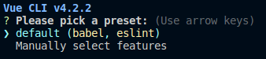
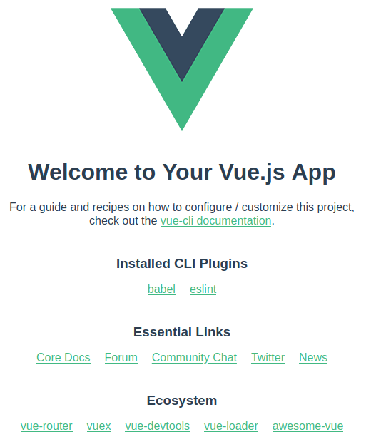
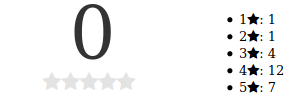
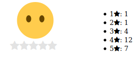
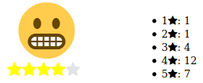
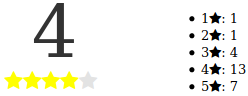

---
author:
  name: Linode Community
  email: docs@linode.com
description: 'VueJS components are a very powerful tool in the JavaScript developer`s toolbox, but as your project grows regular components can become hard to read and hard to follow. In this guide you will learn how to add more structure to your application and make your components more reusable and easy to read.'
keywords: ['vue js','javascript','vuejs','vuejs single file components', 'vuejs eventbus']
license: '[CC BY-ND 4.0](https://creativecommons.org/licenses/by-nd/4.0)'
published: 2020-02-25
modified_by:
  name: Linode
title: "How to create and use single file components in VueJS"
contributor:
  name: Pavel Petrov
  link: https://github.com/WebBamboo/
external_resources:
- '[VueJS](https://vuejs.org/)'
audiences: ["beginner"]
languages: ["javascript"]
---

## In this guide you will learn:

 - [What are single file components and why choose them over regular components](#what-are-single-file-components-and-why-choose-them-over-regular-components)
 - [Getting your environment ready](#getting-your-environment-ready)
 - [Building our first single-file-component](#building-our-first-single-file-component)
 - [Communication between components via an EventBus](communication-between-components-via-an-eventbus)

## What are single file components and why choose them over regular components

If you haven’t read our [Building and Using VueJS Components](/docs/development/javascript/how-to-build-and-use-vuejs-components/) already go take a look. We've covered regular components, they are very useful for small projects but once your project grows and you start needing more structure and flexibility there is a better option called Single file components. 

Single file components are quite similar to regular components but there are a few key differences which can make the single file component the better tool for your project. 

- Can be locally defined instead of globally as in the regular component
- Separating `<template>` allows for syntax highlighting unlike to string templates
- CSS support

They are contained in separate files with the .vue extension, which allows better structure of your application. Each vue file consists of three parts: template, script, style. 
Below you can see an example of a barebone component which we will examine part by part:

<template>
<h1>{{ greeting }}</h1>
</template>

<script>
export default {
    name: 'skeletoncomponent',
    data: function() {
        return {
            greeting: 'Hello'
        };
    },
    props: [],
    methods: {
    },
    created: function(){
    }
}
</script>

<style scoped>
p {
    font-size: 2em;
    text-align: center;
}
</style>


In the beginning of our skeleton component there is a `<template>` part where we specify the HTML template of our component. But we had the same thing in regular components, right? Not exactly. In regular components templates are merely strings, which can become increasingly confusing for complex components due to the fact there is no Syntax Highlighting within strings. The Symfony developers out there using VueJS had to change the delimeters from the mustache `{{ }}` to `[[ ]]` or something else, because Twig already uses mustache delimeters for its rendering methods. Even though this might be a fairly trivial task, using single file components eliminates that need entirely which is even better.

Secondly the script section of the component defines the component’s properties and business logic, similarly to how regular components do it with the difference that everything is within an [export statement](https://developer.mozilla.org/en-US/docs/Web/JavaScript/Reference/Statements/export).

The interesting part is the style section. Using regular components you had no way of adding component specific CSS, thus you had to define it globally. With single file components, however, you can. And that makes your components completely independent, you can now not only use them in your current project, but reuse them among other projects as well! And last but not least it supports preprocessors like SASS and Babel!

## Getting your environment ready

Before you continue make sure you have [NodeJS installed](/docs/development/nodejs/how-to-install-nodejs/), if you don’t head to their webpage and look for the installation instructions page.

Ready? Ok, let's continue.

One major drawback of single file components for beginners is that they require webpack or browsify to build, which lets be honest have a bit of a learning curve. So I will walk you through the easiest way I know of building your environment. It consists of one step only! 

Installing VueCLI:
```sh
sudo npm install -g @vue/cli
```
Once that step is complete you will have vue cli available globally (hence the -g flag). Now create your directory and have VueCLI build the project skeleton for you!
```sh
mkdir SingleFileComponents && vue create SingleFileComponents
```

It uses pretty sensible defaults so if you're a beginner you can just press enter and the VueCLI will build your first project and install the needed dependencies. If you haven’t done this berfore, it might take a while to fetch the needed dependencies.

Now lets test! 
```sh
cd SingleFileComponents && npm run serve
```
What “npm run serve” does is run the development server, but the cool thing is that while you make changes the dev server automatically rebuilds the project and injects the changes in the browser, so you don’t even have to refresh! Now, if everything is fine, you should be able to open http://localhost:8080 in your browser and you will see the VueJS welcome screen:


Let's look at the directory structure of the default application and go through each folder. 


The node_modules is pretty self explanatory, it is where all of the node dependencies reside. 
Next is the public folder, this is where your html files live. The most interesting folder is src, this is where most of the work would be done, 

Lets take a look at the index.html file first:

<!DOCTYPE html>
<html lang="en">
 <head>
   <meta charset="utf-8">
   <meta http-equiv="X-UA-Compatible" content="IE=edge">
   <meta name="viewport" content="width=device-width,initial-scale=1.0">
   <link rel="icon" href="<%= BASE_URL %>favicon.ico">
   <title><%= htmlWebpackPlugin.options.title %></title>
 </head>
 <body>
   <noscript>
     <strong>We're sorry but <%= htmlWebpackPlugin.options.title %> doesn't work properly without JavaScript enabled. Please enable it to continue.</strong>
   </noscript>
   <div id="app"></div>
   <!-- built files will be auto injected -->
 </body>
</html>



From top to bottom you will notice the weird ASP.NET-ish `<%= %>` syntax in the favicon link and the title. As the index will be processed by the html-webpack-plugin you can use the lodash template syntax to use variables. You can see more about the default values exposed by webpack here: https://github.com/jantimon/html-webpack-plugin#writing-your-own-templates

Going further you will notice the noscript tag, which is in place to warn users with disabled JS that the app will not work unless they enable it.

And finally the `<div id="app"></div>` is the container where our VueJS app will be bound, but wait how are the JS files included there are no script tags here? As the comment says build files are automatically injected by the build procedure, so don’t worry about those.

Now we will move to the src/main.js file:

import Vue from 'vue'
import App from './App.vue'

Vue.config.productionTip = false

new Vue({
 render: h => h(App),
}).$mount('#app')



Not much to discuss there - it imports VueJS, imports the App.vue component from the src folder and binds the App.vue component to the container with the id app. Now up to the interesting part App.vue:


<template>
 <div id="app">
   
   <HelloWorld msg="Welcome to Your Vue.js App"/>
 </div>
</template>

<script>
import HelloWorld from './components/HelloWorld.vue'

export default {
 name: 'App',
 components: {
   HelloWorld
 }
}
</script>

<style>
#app {
 font-family: Avenir, Helvetica, Arial, sans-serif;
 -webkit-font-smoothing: antialiased;
 -moz-osx-font-smoothing: grayscale;
 text-align: center;
 color: #2c3e50;
 margin-top: 60px;
}
</style>


This is a simple Single-File-Component relatively similar to the example we discussed above, but this example shows how to import and use components (namely the HelloWorld component) within the main component and this is a valuable architectural feature for reusable components within big projects.


## Building our first single-file-component
 
Now that we’ve discussed what is what, let's build our own component on top of that. We will again be building a Rating component but this time a little more sophisticated.
First things is first what our rating will do:
It will interactively change when user hovers over the stars
It will allow user to rate only once
It will keep score of votes
How it will look in protocode:
```html
<div id="app">
       <div class="inner">
           <div class="ratingContainer">
               <span class="bigRating"></span>
               <div class="rating-stars">
                   <star weight="1"></star>
                   <star weight="2"></star>
                   <star weight="3"></star>
                   <star weight="4"></star>
                   <star weight="5"></star>
               </div>
           </div>
           <sum></sum>
       </div>
   </div>
```

We’ll make each star a separate component, and will create a sum component which will hold the summary of the votes. We will also use localStorage to store the votes in the browser.

<template>
   <div id="app">
       <div class="inner">
           <div class="ratingContainer">
               <span class="bigRating" v-html="bigRating"></span>
               <div class="rating-stars">
                   <star
                       v-for="index in 5"
                       v-bind:key="index"
                       v-bind:weight="index"
                       v-bind:enabled="enabled"
                       v-bind:currentrating="currentRating"
                   ></star>
               </div>
           </div>
           <sum v-bind:ratings="ratings"></sum>
       </div>
   </div>
</template>

<script>
import star from './components/Star'
import sum from './components/Summary'

export default {
 name: 'App',
 components: {star, sum},
 data: function() {
       return {
           currentRating: 0,
           bigRating: '0',
           enabled: true,
           ratings: [
               {
                   weight: 1,
                   votes: 0
               },
               {
                   weight: 2,
                   votes: 0
               },
               {
                   weight: 3,
                   votes: 0
               },
               {
                   weight: 4,
                   votes: 0
               },
               {
                   weight: 5,
                   votes: 0
               }
           ]
       }
 },
 methods: {
 },
 created: function() {
     if(localStorage.ratings)
     {
         this.ratings = JSON.parse(localStorage.ratings);
     }
 }
}
</script>

<style>
@import url(https://fonts.googleapis.com/css?family=Roboto:100,300,400);
@import url(https://netdna.bootstrapcdn.com/font-awesome/3.2.1/css/font-awesome.css);
#app {
   width: 400px;
}
.ratingContainer {
   float: left;
   width: 45%;
   margin-right: 5%;
   text-align: center;
}
.summaryContainer {
   float: left;
   width: 50%;
   font-size: 13px;
}
.bigRating {
   color: #333333;
   font-size: 72px;
   font-weight: 100;
   line-height: 1em;
   padding-left: 0.1em;
}
.rating-stars .hover {
   color:yellow;
}
.rating-stars {
   font-size: 20px;
   color: #E3E3E3;
   margin-bottom: .5em;
}
.rating-stars .active {
   color: #737373;
}
</style>



This is the main component, for now it doesn’t have any functionality but we will build on that. 
`<template>`
In the template there are a few interesting points. As this is a 5 star rating we are rendering the star components with  v-for="index in 5" and assigning a weight to each star by v-bind:weight="index" simply said this is similar to the following for loop: for(let index=1;index<=5;index++). The summary component will only display data and won’t have any functions so we are just binding the relevant data as a prop to that component `<sum v-bind:ratings="ratings"></sum>`

`<script>`
We are importing the two Single File Components we will be using and declaring them in the components property. In the data we’ve declared a few properties of the component and I’ll walk through them one by one so you have an idea what the architecture would be like.
currentRating - As we hover over the stars we will use this variable as a storage so that for example if you hover over the star number 4, stars 1-3 also get highlighted. Not a particularly beautiful solution but we will improve on that further in the guide.
bigRating - this would be used to display the rating and some emoticons
Enabled - this would be used to disable the rating if the user rated once
Ratings - is simply a structure for the votes cast, we set the default value in the data and if there are any votes saved we overwrite it with the saved data so we imitate a persistence layer
In the created hook you can see how we fetch the saved cast votes:
```js
if(localStorage.ratings)
{
    this.ratings = JSON.parse(localStorage.ratings);
}
```
If there are saved ratings, we fetch them and turn them back to a JSON object so we can use them as a starting point the next time the page loads.

<template>
<span><i v-bind:class="getClass()"></i></span>
</template>

<script>

export default {
   name: 'star',
   data: function() {
       return {
           hover: false,
           active: false
       };
   },
   props: ['weight', 'enabled', 'currentrating'],
   methods: {
       getClass: function() {
           var baseClass = 'icon-star';

           return baseClass;
       }
   }
}
</script>

<style scoped>
p {
   font-size: 2em;
   text-align: center;
}
</style>

Nothing special here, it is pretty much a regular single-file-component.


<template>
   <div class="summaryContainer">
       <ul>
           <li v-for="rating in ratings" v-bind:key="rating.weight">{{ rating.weight }}<i class="icon-star"></i>: {{ rating.votes }}</li>
       </ul>
   </div>
</template>

<script>
export default {
   name: 'sum',
   data: function() {
       return {
           greeting: 'Hello'
       };
   },
   props: ['ratings'],
   methods: {
   },
   created: function(){
   }
}
</script>

<style scoped>
</style>

This component is pretty much function complete, it won’t do more than render some data. Now if you open your browser and head to http://127.0.0.1:8080 you will see something like the following:

Great! This will be our skeleton, now we will make it work. The idea is that when you hover over a star all previous stars light up(change color to yellow), when your mouse moves away everything lights down(returns to normal) and when you click on a star a vote is cast and you no longer can vote. So in total that would be 3 events: lightUp, lightDown and rate. The methods for those events will look like the following:


...
methods: {
     lightUp: function(weight) {
           this.currentRating = weight;
           //The following part is mostly for fun you can easily just set      
           //this.bigRating = weight; and be done with it
           if(weight <= 2)
           {
               this.bigRating = '&#128549;';//Emoji: 😥
           }
           if(weight > 2 && weight <= 4)
           {
               this.bigRating = '&#128556;';//Emoji: 😬
           }
           if(weight > 4)
           {
               this.bigRating = '&#128579;';//Emoji: 🙃
           }
     },
     lightDown: function() {
         //Reset on mouse away
         this.currentRating = 0;
           this.bigRating = '&#128566;';//Emoji: 😶
     },
     rate: function(weight) {
         this.currentRating = weight;
         //Finding the relecant rating and incrementing the cast votes
         let rating = this.ratings.find(obj => obj.weight == weight);
         rating.votes++;
         //Disabling from voting again
         this.enabled = false;
         this.bigRating = weight;

         //Saves the votes to the browser localStorage
         localStorage.setItem('ratings', JSON.stringify(this.ratings));
     }
 }


There is nothing interesting or complicated in the methods above, you can check the comments in the code for more information. But those methods by themselves are useless, we have to bind them to events emitted by the stars:
App.vue
```html
<template>
   <div id="app">
       <div class="inner">App
           <div class="ratingContainer">
               <span class="bigRating" v-html="bigRating"></span>
               <div class="rating-stars">
                   <star
                       v-for="index in 5"
                       v-bind:key="index"
                       v-bind:weight="index"
                       v-bind:currentrating="currentRating"
                       v-bind:enabled="enabled"
                       v-on:lightup="lightUp"
                       v-on:lightdown="lightDown"
                       v-on:rate="rate"
                   ></star>
               </div>
           </div>
           <sum v-bind:ratings="ratings"></sum>
       </div>
   </div>
</template>
```
The v-on directives in the star component bind the lightup, lightdown and rate events emitted from the component to the lightUp, LightDown and rate methods respectively. Now let's modify the Star component to emit the events

<template>
<span><i v-bind:class="getClass()" v-on:mouseover="lightUp()" v-on:mouseleave="lightDown()" v-on:click="rate()"></i></span>
</template>

<script>

export default {
   name: 'star',
   data: function() {
       return {
           hover: false
       };
   },
   props: ['weight', 'enabled', 'currentrating'],
   methods: {
       getClass: function() {
           var baseClass = 'icon-star';

           //Adds the hover class if you're hovering over the component or you are hovering over a star with greater weight
           if(this.hover || this.currentrating >= this.weight)
           {
               baseClass += ' hover'
           }
           return baseClass;
       },
       lightUp: function(){
           //Makes sure stars are not lighting up after vote is cast
           if(this.enabled)
           {
               //Emits the lightup event with the weight as a parameter
               this.$emit("lightup", this.weight);
               //Enables hover class
               this.hover = true;
           }
       },
       lightDown: function(){
           //Makes sure stars are not lighting up after vote is cast
           if(this.enabled)
           {
               //Emits the lightdown event
               this.$emit("lightdown", this.weight);
               //Removes hover class
               this.hover = false;
           }
       },
       rate: function(){
           //Makes sure you only vote if you haven't voted yet
           if(this.enabled)
           {
               //Emits the rate event with the weight as parameter
               this.$emit("rate", this.weight);
           }
           else
           {
               alert("Already voted");
           }
       }
   }
}
</script>

<style scoped>
p {
   font-size: 2em;
   text-align: center;
}
</style>

In the template you will notice we’ve added the v-on:mouseover, v-on:mouseleave and v-on:click event subscriber bound to the class lightUp, lightDown and rate methods. The methods themselves are very simple; they mostly check if the component is enabled and if yes emit the proper event. Now head to your browser and lo and behold. Your rating now works!



Now let's improve! Notice how clumsy all of the v-on directives chained one after the other look:
```html
<star
    v-for="index in 5"
    v-bind:key="index"
    v-bind:weight="index"
    v-bind:currentrating="currentRating"
    v-bind:enabled="enabled"
    v-on:lightup="lightUp"
    v-on:lightdown="lightDown"
    v-on:rate="rate"
></star>
```

Imagine having 10 of those on a single component, now imagine you have 10 components, that would be nearly impossible to follow, there surely have to be another way for communicating between components?! It is called an event bus.

## Communication between components via an EventBus
Fortunately VueJS natively supports a publish subscribe pattern called EventBus and you can easily implement it in your components to make things a bit more elegant.
Creating an EventBus is as simple as creating a new Vue instance. Let's open our main.js file and modify it as follows:


import Vue from 'vue'
import App from './App.vue'

Vue.config.productionTip = false

export const eventBus = new Vue();

new Vue({
 render: h => h(App),
}).$mount('#app')



Now in order to use the eventbus in your components you have to import it:
```js
import { eventBus } from './main'
```
And you are ready to subscribe and emit events:
```js
eventBus.$on('event', (parameter) => {
    //Do stuff
});

eventBus.$emit("event", parameter);
```
Think of it as a communication layer between your components! Now let's rebuild our example once again:

<template>
   <div id="app">
       <div class="inner">
           <div class="ratingContainer">
               <span class="bigRating" v-html="bigRating"></span>
               <div class="rating-stars">
                   <star v-for="index in 5"
                       v-bind:key="index"
                       v-bind:weight="index"
                       v-bind:enabled="enabled"
                   ></star>
               </div>
           </div>
           <sum v-bind:ratings="ratings"></sum>
       </div>
   </div>
</template>

<script>
import star from './components/Star'
import sum from './components/Summary'

import { eventBus } from './main'

export default {
 name: 'App',
 components: {star, sum},
 data: function() {
       return {
           bigRating: '0',
           enabled: true,
           ratings: [
               {
                   weight: 1,
                   votes: 0
               },
               {
                   weight: 2,
                   votes: 0
               },
               {
                   weight: 3,
                   votes: 0
               },
               {
                   weight: 4,
                   votes: 0
               },
               {
                   weight: 5,
                   votes: 0
               }
           ]
       }
 },
 created: function() {
     if(localStorage.ratings)
     {
         this.ratings = JSON.parse(localStorage.ratings);
     }
     eventBus.$on('rate', (weight) => {
         let rating = this.ratings.find(obj => obj.weight == weight);
         rating.votes++;
         this.enabled = false;
         this.bigRating = weight;
         localStorage.setItem('ratings', JSON.stringify(this.ratings));
     });
     eventBus.$on('lightUp', (weight) => {
         if(weight <= 2)
         {
             this.bigRating = '&#128549;';
         }
         if(weight > 2 && weight <= 4)
         {
             this.bigRating = '&#128556;';
         }
         if(weight > 4)
         {
             this.bigRating = '&#128579;';
         }
         //this.bigRating = weight;
     });
     eventBus.$on('lightDown', () => {
         this.bigRating = '&#128566;';
     });
 }
}
</script>

<style>
@import url(https://fonts.googleapis.com/css?family=Roboto:100,300,400);
@import url(https://netdna.bootstrapcdn.com/font-awesome/3.2.1/css/font-awesome.css);
#app {
   width: 400px;
}
.ratingContainer {
   float: left;
   width: 45%;
   margin-right: 5%;
   text-align: center;
}
.summaryContainer {
   float: left;
   width: 50%;
   font-size: 13px;
}
.bigRating {
   color: #333333;
   font-size: 72px;
   font-weight: 100;
   line-height: 1em;
   padding-left: 0.1em;
}
.rating-stars .hover {
   color:yellow;
}
.rating-stars {
   font-size: 20px;
   color: #E3E3E3;
   margin-bottom: .5em;
}
.rating-stars .active {
   color: #737373;
}
</style>



Notice how we removed the v-on directives from the star component and instead subscribe to the events in the created hook. The template looks much leaner now, and you can easily spot the subscribed events by simply having a look in the created hook. Also we will no longer need the currentrating data property because the star components will also subscribe to the event bus and receive it as a parameter.


<template>
<span><i v-bind:class="getClass()" v-on:mouseover="lightUp()" v-on:mouseleave="lightDown()" v-on:click="rate"></i></span>
</template>

<script>
import { eventBus } from '../main'

export default {
   name: 'star',
   data: function() {
       return {
           hover: false,
           active: false
       };
   },
   props: ['weight', 'enabled'],
   methods: {
       getClass: function() {
           var baseClass = 'icon-star';
           if(this.active)
           {
               baseClass += ' active'
           }

           if(this.hover)
           {
               baseClass += ' hover'
           }
           return baseClass;
       },
       lightUp: function(){
           if(this.enabled)
           {
               eventBus.$emit("lightUp", this.weight);
           }
       },
       lightDown: function(){
           if(this.enabled)
           {
               eventBus.$emit("lightDown", this.weight);
           }
       },
       rate: function(){
           if(this.enabled)
           {
               eventBus.$emit("rate", this.weight);
           }
           else
           {
               alert("Already voted");
           }
       }
   },
   created: function(){
       eventBus.$on("rate", (targetWeight) => {
           if(targetWeight >= this.weight)
           {
               this.active = true;
           }
       });
       eventBus.$on("lightUp", (targetWeight) => {
           if(targetWeight >= this.weight)
           {
               this.hover = true;
           }
       });
       eventBus.$on("lightDown", () => {
           this.hover = false;
       });
   }
}
</script>

<style scoped>
p {
   font-size: 2em;
   text-align: center;
}
</style>

We’ve modified the methods to emit the events in the eventBus directly, and also subscribe to the events, so that all star components are aware at which component the user is currently hovering over without the need of v-bind.
