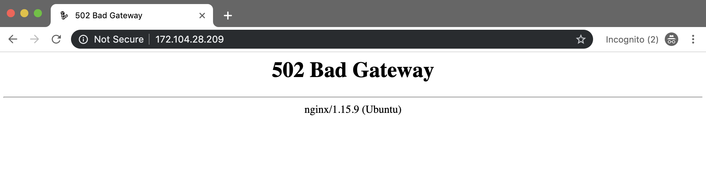
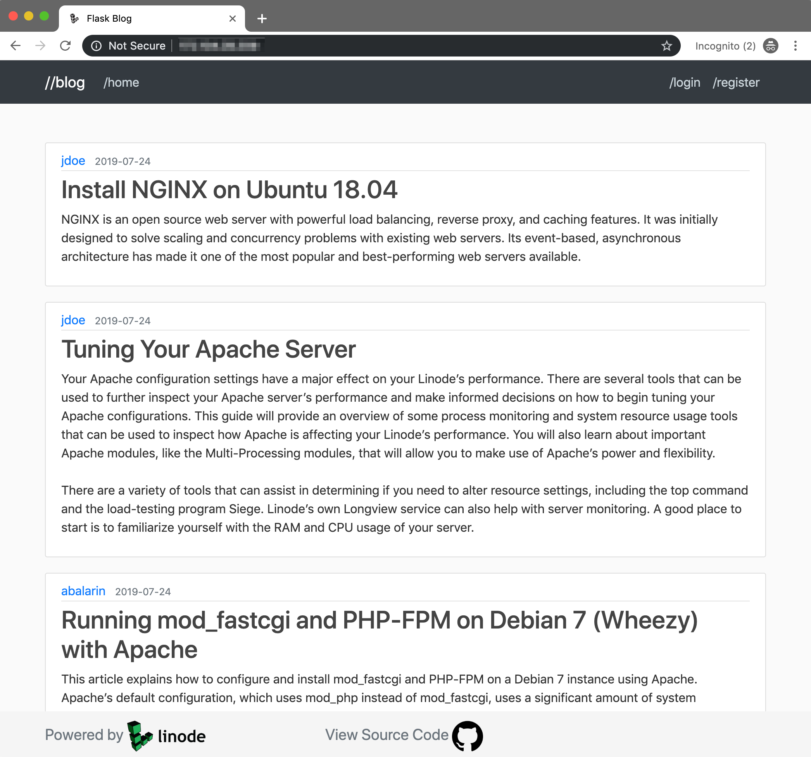

---
author:
  name: Austin Balarin
  email: abalarin@linode.com
description: 'This guide will walk you through the steps to deploy a Flask application to a production environment running on a Linode.'
keywords: ['python','flask','gunicorn','nginx', 'flask deployment', 'python flask']
license: '[CC BY-ND 4.0](https://creativecommons.org/licenses/by-nd/4.0)'
published: 2019-10-10
modified: 2019-10-10
modified_by:
  name: abalarin
title: "Deploy a Flask Application on Ubuntu"
contributor:
  name: Austin Balarin
  link: https://github.com/abalarin
external_resources:
- '[Python](https://www.python.org/)'
- '[Flask](https://flask.palletsprojects.com/en/1.0.x/)'
- '[NGINX](https://www.nginx.com/resources/wiki/)'
- '[Gunicorn](http://docs.gunicorn.org/en/stable/)'
---
Flask is a light-weight web framework for Python that includes several utilities and libraries you can use to create a web application. Once you have developed a Flask application in a local environment, you will need to prepare the application's production environment in order to run the application and serve it to your application's users via the internet.

This guide will walk you through the steps to deploy a Flask application to a production environment running on a Linode. Your production environment will use [NGINX](http://localhost:1313/docs/web-servers/nginx/nginx-installation-and-basic-setup/) as the web server and reverse proxy, [Gunicorn](https://gunicorn.org/) as the web server gateway interface (WSGI) application server, and [Supervisor](http://supervisord.org/) for monitoring and auto-reloading Gunicorn should it go down. This guide will not cover creating a Flask application or related Python concepts.

In this guide you will complete the following:

- [Copy an existing Flask application from a local development environment to a production environment](#copy-your-flask-app-to-your-linode)
- [Install and configure NGINX](#install-and-configure-nginx)
- [Configure your Flask application's production environment variables](#configure-flask)
- [Install and configure Gunicorn](#install-and-configure-gunicorn)
- [Install and configure Supervisor](#install-and-configure-supervisor)

    
This guide assumes you are familiar with the following concepts and skills:

* The [Python programming language](https://docs.python.org/3/tutorial/index.html)
* [Setting up a local virtual environment](https://docs.python-guide.org/dev/virtualenvs/) for Python programming
* [Creating applications using Flask](https://flask.palletsprojects.com/en/1.1.x/quickstart/#)
* Using a local and remote version control system, like [Git and GitHub](/docs/quick-answers/linux/how-to-use-git/).
    

## Before You Begin
1.  [Create a Flask Application](https://flask.palletsprojects.com/en/1.1.x/tutorial/) or use this [Example Blog Application](https://github.com/abalarin/Flask-on-Linode). Clone and run it on your local machine [using GitHub](/docs/quick-answers/linux/how-to-use-git/).

        git clone https://github.com/abalarin/Flask-on-Linode.git flask_app_project

    
  The [Example Flask Blog Application](https://github.com/abalarin/Flask-on-Linode) will be used throughout this guide. The application's root directory is `flask_app_project`.
    

1. If you're not using the example application, host your Flask application code on a remote version control system, like GitHub. This guide will use GitHub for all examples.

1. [Create a 1GB Linode](/docs/getting-started/#create-a-linode) to host your Flask web application. Depending on the size of your application and the amount of users you expect to visit it, you may consider a large [Linode plan](/docs/platform/how-to-choose-a-linode-plan/).

1.  Familiarize yourself with our [Getting Started](/docs/getting-started/) guide and complete the steps for [updating your system's software](/docs/getting-started/#install-software-updates), setting your Linode's [hostname](/docs/getting-started/#set-the-hostname) and [timezone](/docs/getting-started/#set-the-timezone).

1.  This guide will use `sudo` wherever possible. Complete the sections of our [Securing Your Server](/docs/security/securing-your-server/) to create a [limited user account](/docs/security/securing-your-server/#add-a-limited-user-account), [harden SSH access](/docs/security/securing-your-server/#harden-ssh-access) and [remove unnecessary network services](/docs/security/securing-your-server/#remove-unused-network-facing-services).

## Copy Your Flask App to Your Linode

After creating your Flask application in your local development environment, you are now ready to deploy it to a production environment. You will need to copy your local Flask application code to your Linode. You can accomplish this by either [cloning your GitHub project to your Linode](#clone-your-app-from-source-control) using Git or by using the [secure copy method](#secure-copy-your-app-from-a-local-machine) to directly transfer your application files to your Linode. This section will provide steps for both options.


This guide's examples will transfer your Flask application files to your Linode's `/home` directory. If you prefer, you can store your application files in a different directory, however, ensure you run the examples using your own app's directory location.


### Clone Your App From Source Control

1. Ensure your latest Flask application code is available in your project's remote repository.

1.  SSH into your Linode. Replace the example IP address with your Linode’s IP address:

        ssh user@192.0.2.0

1. Navigate to your Linode's home directory:

        cd /home

1. Clone your project from your remote version control system. If you are not using the example repository, [Example Flask Blog Application](https://github.com/abalarin/Flask-on-Linode), replace the example repo with your own:

        git clone https://github.com/abalarin/Flask-on-Linode.git flask_app_project

    
root@localhost:/home# git clone https://github.com/abalarin/Flask-on-Linode.git
Cloning into 'Flask-on-Linode'...
remote: Enumerating objects: 79, done.
remote: Counting objects: 100% (79/79), done.
remote: Compressing objects: 100% (57/57), done.
remote: Total 79 (delta 26), reused 66 (delta 16), pack-reused 0
Unpacking objects: 100% (79/79), done.
Checking connectivity... done.


### Secure Copy your App From a Local Machine

1.  From your local machine, secure copy (SCP) your project into your Linode's `/home` directory. Replace the example IP address with your Linode’s IP address and `flask_app` with the name of your project's root directory:

        scp -r flask_app_project/ user@192.0.2.0:/home

1. Once complete, navigate to your Linode and view the contents of your copied directory:

        ls flask_app_project

    You should see a similar output:

    
    flask_app  FlaskDeployment.md  README.md
    

    Now that your Linode contains your application files, you can move on to preparing your production environment.

## Prepare Your Production Environment
### Install and Configure NGINX
[NGINX](/docs/web-servers/nginx/nginx-installation-and-basic-setup/) is open-source software that can be used as a high-performance web server, reverse proxy, load-balancer, and more. In this section you will configure NGINX as a web server and reverse proxy for your Flask application. This means that NGINX will sit between your Flask application and external clients and forward all client requests to your running Flask application.

1. Install NGINX:

        sudo apt install nginx

2. Using your editor of choice, create an NGINX configuration file for your app with the example content and save it. This example uses the [nano](/docs/quick-answers/linux/use-nano-to-edit-files-in-linux/) text editor. Replace `flask_app` with your applications name and `192.0.2.0` with your Linode's IP or your fully qualified domain name (FQDN):

        sudo nano /etc/nginx/sites-enabled/flask_app

    
server {
    listen 80;
    server_name 192.0.2.0;

    location / {
        proxy_pass http://127.0.0.1:8000;
        proxy_set_header Host $host;
        proxy_set_header X-Forwarded-For $proxy_add_x_forwarded_for;
    }
}


3. Disable the NGINX's default configuration file by removing its symlink:

        sudo unlink /etc/nginx/sites-enabled/default

4. Reload your NGINX configuration file:

        sudo nginx -s reload

5. Navigate to your Linode's IP address in a web browser. You should see a similar NGINX Gateway error. This error appears because you have not set up the WSGI application server yet. You will set up your application server in the [Install and Configure Gunicorn](#install-and-configure-gunicorn) section of the guide.

    

### Install Python and Packages

To run your Flask application, you will need to install Python, Flask, pip3 and any other required package dependencies on your Linode.


This guide was created using Python 3.6.8


1. In your Linode's `/home` directory, install Python 3:

        sudo apt install python3

1. Install pip3, the standard package manager for Python:

        sudo apt install python3-pip

1. Navigate to your project's root directory:

        cd /home/flask_app_project

1. Install Flask packages and libraries using pip3. If you are using the [Example Flask Blog Application](https://github.com/abalarin/Flask-on-Linode.git), then the packages your application will need are listed in the [`/home/flask_app_project/flask_app/requirements.txt`](https://github.com/abalarin/Flask-on-Linode/blob/master/flask_app/requirements.txt) file. You can use pip to install all listed packages.

        pip3 install -r flask_app/requirements.txt

    While the packages and libraries are being installed, you will see a similar output:
    
root@localhost:/home/Flask-on-Linode# pip3 install -r flask_app/requirements.txt
Collecting flask-sqlalchemy (from -r flask_app/requirements.txt (line 1))
  Downloading https://files.pythonhosted.org/packages/08/ca/582442cad71504a1514a2f053006c8bb128844133d6076a4df17117545fa/Flask_SQLAlchemy-2.4.0-py2.py3-none-any.whl
Collecting sqlalchemy (from -r flask_app/requirements.txt (line 2))
  Downloading https://files.pythonhosted.org/packages/55/98/56b7155bab287cd0c78dee26258835db36e91f2efef41f125ed6f6f1f334/SQLAlchemy-1.3.6.tar.gz (5.9MB)
    100% |████████████████████████████████| 5.9MB 218kB/s
Collecting flask-security (from -r flask_app/requirements.txt (line 3))
  Downloading https://files.pythonhosted.org/packages/88/47/4908a5040120768ff4fb2465c7eeafeb9239c27d2919bd67c4ccc1b43e14/Flask_Security-3.0.0-py2.py3-none-any.whl (68kB)
    100% |████████████████████████████████| 71kB 8.7MB/s
Collecting flask-wtf (from -r flask_app/requirements.txt (line 4))
  Downloading https://files.pythonhosted.org/packages/60/3a/58c629472d10539ae5167dc7c1fecfa95dd7d0b7864623931e3776438a24/Flask_WTF-0.14.2-py2.py3-none-any.whl
...


    Now that your Linode has all required dependencies, you will configure Flask in the next section.

### Configure Flask
Depending on your Flask application's environment, there are different settings you may need to configure, like toggling the debug mode, setting the secret key, setting the database URI, etc. For more information on Flask's available configuration options see Flask's [configuration docs](https://flask.palletsprojects.com/en/1.1.x/config/#builtin-configuration-values).

In this section, you will create a JSON file to store your environment configurations and then load that configuration into your Flask app. The configuration created in this section is a basic example of some Flask environment variables you might include in your application.


You should keep sensitive configuration files **outside of source control**. If you source control your configuration file, which contains sensitive values, in a remote repository, then someone could access it and use that information to compromise your Linode or application. To keep your configuration file out of your Git repository, add it to your `.gitignore` file.


1.  Create a JSON configuration file with the text editor of your choice:

        sudo nano /etc/config.json

1. Store your application's environment variables in your JSON configuration file with the example content:

    
{
  "SECRET_KEY": "1A37BbcCJh67",
  "SQLALCHEMY_DATABASE_URI": "sqlite:///site.db"
}


    - The `SECRET_KEY` is used to keep client-side sessions secure using a session cookie that can only be modified if the secret key is known and used for signing. Replace the value included in the example with your own randomly generated value.

    - The `SQLALCHEMY_DATABASE_URI` defines the database URI that should be used for the application's connection to SQLite.

2.  Modify your Flask app's `__init__.py` file to import the newly created JSON configuration:

    
from flask import Flask
from flask_sqlalchemy import SQLAlchemy
from flask_login import LoginManager
import json
import urllib3

app = Flask(__name__)

with open('/etc/config.json') as config_file:
  config = json.load(config_file)

app.config['SECRET_KEY'] = config.get('SECRET_KEY')
app.config['SQLALCHEMY_DATABASE_URI'] = config.get('SQLALCHEMY_DATABASE_URI')
db = SQLAlchemy(app)

login_manager = LoginManager()
login_manager.init_app(app)

from flask_app import routes
    

### Install and Configure Gunicorn
[Gunicorn](https://gunicorn.org/), *Green Unicorn*, is a Python web server gateway interface (WSGI) HTTP Server for UNIX. It will be used to forward requests from your NGINX web server to your Flask application.

1. Install Gunicorn on your Linode:

        sudo apt install gunicorn3

2. Run Gunicorn from your application's root directory, `flask_app_project`. The command tells Gunicorn to look for the WSGI instance named **app** in the **flask_app** directory. In our example project, the WSGI instance named **app** is located in [`/home/Flask-on-Linode/flask_app/__init__.py`](https://github.com/abalarin/Flask-on-Linode/blob/master/flask_app/__init__.py).

        gunicorn3 --workers=3 flask_app:app

    
root@localhost:/home/Flask-on-Linode# gunicorn -w 3 flask_app:app
[2019-07-25 15:09:04 +0000] [32421] [INFO] Starting gunicorn 19.9.0
[2019-07-25 15:09:04 +0000] [32421] [INFO] Listening at: http://127.0.0.1:8000 (32421)
[2019-07-25 15:09:04 +0000] [32421] [INFO] Using worker: sync
[2019-07-25 15:09:04 +0000] [32424] [INFO] Booting worker with pid: 32424
[2019-07-25 15:09:04 +0000] [32425] [INFO] Booting worker with pid: 32425
[2019-07-25 15:09:04 +0000] [32426] [INFO] Booting worker with pid: 32426


    
You can specify the amount of workers you want Gunicorn to use with the `--workers` flag. A good rule of thumb to determine [worker](http://docs.gunicorn.org/en/stable/design.html#server-model) count is to double your system's CPU cores and add 1. For a Nanode with 1 CPU core you should use 3 workers.


1. After running Gunicorn, your Flask application should be live and available over the internet. Open a web browser and enter your Linode's IP address to access your application. If you used the example Flask blog application, you should see the following:

    

    Continue on to the next section to configure Supervisor to monitor and control your Flask app.

### Install and Configure Supervisor
[Supervisor](http://supervisord.org/) is a client/server system that allows its users to monitor and control a number of processes on UNIX-like operating systems. Supervisor can handle auto-reloading Gunicorn if it crashes or if your Linode is rebooted unexpectedly. In this section, you will install and configure Supervisor.

1. Open a new shell session and SSH into your Linode:

        ssh user@192.0.2.0

1. Install Supervisor:

        sudo apt install supervisor

2. Create a Supervisor script. Replace any instances of `flask_app` with the name of your application:

        sudo nano /etc/supervisor/conf.d/flask_app.conf

    
[program:flask_app]
directory=/home/flask_app_project
command=gunicorn3 -workers=3 flask_app:app
autostart=true
autorestart=true
stopasgroup=true
killasgroup=true
stderr_logfile=/var/log/flask_app/flask_app.err.log
stdout_logfile=/var/log/flask_app/flask_app.out.log


3. Create the log directories and files listed in the `flask_app.conf` file. Make sure to replace `flask_app` if it was modified in the Supervisor script above:

        sudo mkdir /var/log/flask_app
        sudo touch /var/log/flask_app/flask_app.out.log
        sudo touch /var/log/flask_app/flask_app.err.log

4. Reload Supervisor to apply your changes:

        sudo supervisorctl reload

    You should see a similar output:
    
Restarted supervisord
    

    
Your application should now be accessible again via your Linode's IP. If you are unable to access your application or receive a bad gateway error, Gunicorn is likely not running. Check your log files to further investigate the issue.

    cat /var/log/flaskapp/flaskapp.err.log
    cat /var/log/flaskapp/flaskapp.out.log
    

    Your Flask application is now deployed to your production environment and available to anyone for viewing. You can follow a similar workflow to deploy any Flask application to a Linode.
