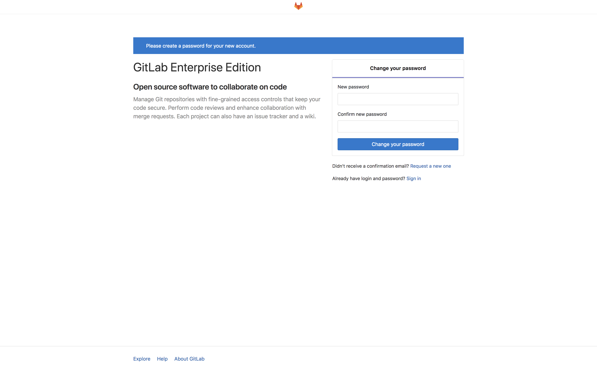

---
author:
  name: Linode Community
  email: docs@linode.com
description: 'Install GitLab on Ubuntu 18.04 with SSL'
keywords: ['git', 'gitlab', 'version control', 'ubuntu']
license: '[CC BY-ND 4.0](https://creativecommons.org/licenses/by-nd/4.0)'
published: 2019-01-04
modified: 2019-01-04
modified_by:
  name: Linode
title:  'Install GitLab on Ubuntu 18.04'
contributor:
  name: Linode
external_resources:
- '[GitLab''s Official Documentation](https://docs.gitlab.com/ee/README.html)'
- '[GitLab''s NGINX Configurations](https://docs.gitlab.com/omnibus/settings/nginx.html)'
audiences: ["intermediate"]
---

GitLab is a complete solution for all aspects of your software development life-cycle. At its core, GitLab serves as your centralized Git repository. It also features built-in tools that represent every task in your development workflow, from planning to testing to releasing. You can host your own GitLab instance on a Linode, instead of using third-party hosting. Self-hosting your software development with GitLab offers total control of your codebase while providing an easy to use interface for team members. GitLab is the most popular self-hosted Git repository, so you'll benefit from a robust set of integrated tools and an active community.

This guide will walk you through the steps to install GitLab on an 8GB Linode running Ubuntu 18.04. This installation can support up to 100 users.

## System Requirements

Before installing GitLab you should consider how many users will collaborate on your self-hosted instance, the size of the repositories you will store, and the recommended minimum system requirements. This criteria will will effect the needed storage, CPU, and memory. This guide will use an **8GB Linode plan** to fulfill GitLab's minimum system requirements. The suggested hardware is as follows:

- **Storage** The required storage depends on the size of the repositories you will store in GitLab. You should plan to have *at least* as much free space as all the repositories combined require.
- **CPU:** 2 cores is the recommended number and supports up to 500 users. While you can use 1 CPU core to support 100 users, the application may run slower because all workers and background jobs will run on the same core.
- **Memory:** 8 GB to support up to 100 users.

## Before You Begin

1.  Familiarize yourself with our [Getting Started](/docs/getting-started/) guide and complete the steps for setting your Linode's hostname and timezone.

1.  This guide will use `sudo` wherever possible. Complete the sections of our [Securing Your Server](/docs/security/securing-your-server/) to create a standard user account, harden SSH access and remove unnecessary network services.

1.  Add a domain zone, NS record, and A/AAA record for the domain you will use to access your GitLab installation. See the [DNS Manager](/docs/platform/manager/dns-manager-new-manager/#add-a-domain-zone) guide for details. If you will access your GitLab instance via your Linode’s IP address, you can skip this step.

1.  [Create an SSL Certificate](/docs/quick-answers/websites/secure-http-traffic-certbot/), if you will be using SSL encryption for your domain (this is recommended). Be sure to note the location that Certbot uses to store all generated keys and issued certificates.

1.  Update your system:

        sudo apt-get update && sudo apt-get upgrade

## Install GitLab

1. Install all required dependencies:

        sudo apt-get install -y curl openssh-server ca-certificates

1. Install Postfix to send email notifications:

        sudo apt-get install -y postfix

    When prompted, select *Internet Site* and press **Enter**. Use your server's external DNS for *mail name* and press **Enter**.

1. Add the GitLab package repository:

        curl https://packages.gitlab.com/install/repositories/gitlab/gitlab-ee/script.deb.sh | sudo bash

1. Install the GitLab package. Replace `gitlab.example.com` with the domain you will use to access your GitLab installation. The installation will automatically configure and start GitLab.

        sudo EXTERNAL_URL="http://gitlab.example.com" apt-get install gitlab-ee

1. In your browser of choice, navigate to the URL you provided in the previous step. You will be redirected to GitLab's password reset screen. You should provide a password for the GitLab administrator account.

      

1.  You will be redirected to the login screen. Enter `root` as the username and the password you just created to log in.

      

## Configure SSL Encryption


If you did not generate an SSL certificate using Certbot prior to the installation of GitLab, you may need to first stop GitLab and then generate the SSL certificate to bypass any errors related to Certbot's certificate challenge. To stop GitLab run the following command:

      sudo gitlab-ctl stop

Once you are done generating the certificate, restart GitLab with the following command:

      sudo gitlab-ctl start


1. Edit the `/etc/gitlab/gitlab.rb` to use HTTPS. This is done by modifying the value of `external_url` to use `https` instead of `http`:

      
## GitLab URL
##! URL on which GitLab will be reachable.
##! For more details on configuring external_url see:
##! https://docs.gitlab.com/omnibus/settings/configuration.html#configuring-the-external-url-for-gitlab
external_url 'https://gitlab.example.com'
      

1. Edit the `/etc/gitlab/gitlab.rb` file to point to the location of your SSL certificate and key. The path should be the location used by Certbot to store the certificates when they were initially created.

      
nginx['ssl_certificate'] = "/etc/letsencrypt/live/gitlab.example.com/fullchain.pem"
nginx['ssl_certificate_key'] = "/etc/letsencrypt/live/gitlab.example.com/privkey.pem"
      

1. Redirect all HTTP traffic to HTTPS:

      
nginx['redirect_http_to_https'] = true
      

1. Issue the following command to enable your new configurations:

        sudo gitlab-ctl reconfigure

1. Navigate to your GitLab instance domain and verify that you are directed to `https`.

  You are now ready to begin using GitLab as your remote version control system. Refer to [GitLab's official documentation](https://docs.gitlab.com/ee/README.html) for details on how to get started administering your GitLab instance.
