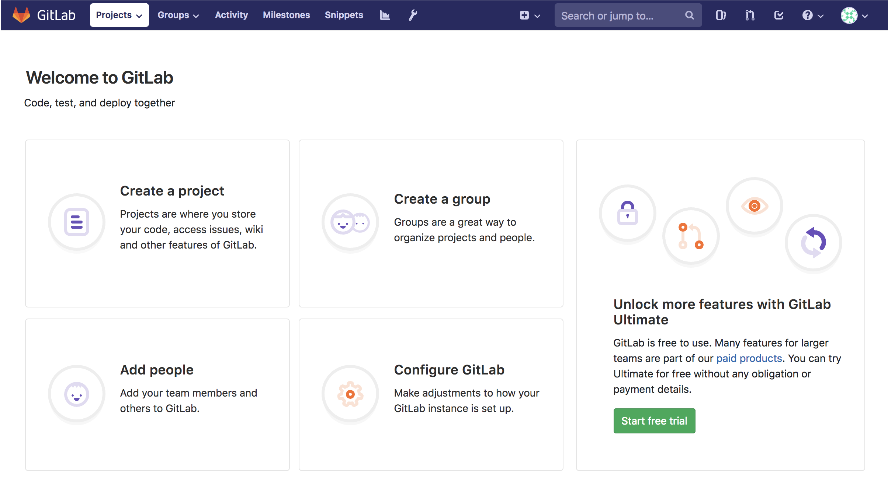

---
author:
  name: Linode Community
  email: docs@linode.com
description: 'How to install GitLab with Docker.'
keywords: ['gitlab', 'git', 'docker']
license: '[CC BY-ND 4.0](https://creativecommons.org/licenses/by-nd/4.0)'
published: 2019-01-04
modified: 2019-01-04
modified_by:
  name: Linode
title: "Install GitLab with Docker"
contributor:
  name: Linode
external_resources:
- '[GitLab CE Docker Image](https://hub.docker.com/r/gitlab/gitlab-ce)'
- '[GitLab Docker Documentation](https://docs.gitlab.com/omnibus/docker/)'
- '[GitLab SSL Configuration](https://docs.gitlab.com/omnibus/settings/ssl.html#lets-encrypt-integration)'
---

GitLab is a free git repository management application, like GitHub or Bitbucket, that you can run on your own Linode. This guide will show you how to install GitLab using the official GitLab Docker image.

## Before You Begin

### Choose An Appropriately Sized Linode
GitLab is a resource heavy application. To get the most of GitLab, we recommend a Linode with at least 8GB of memory, and at least 2 cores. For more information on system requirements, visit the [GitLab Hardware Requirements page](https://docs.gitlab.com/ce/install/requirements.html#hardware-requirements).

### Change Your Linode's Default SSH Port
Because your SSH connection to your Linode will interfere with GitLab's ability to listen on the SSH port, you'll want to change your Linode's default SSH port and connect to that port instead. This can be accomplished by editing your Linode's `/etc/ssh/sshd_config` file and changing the `Port` assignment. In the example below changes the port from 22 to port 26:


...
Port 26
...


Restart the SSH service for the changes to take place:

    systemctl restart sshd

Restart your SSH session by connecting to your Linode at the new port. You can do this by supplying the `-p` flag.

    ssh root@9203.0.113.0 -p 26

### Update Your DNS Records
Update your DNS records to point to your GitLab server. While this step is optional, (you can always access GitLab via your server's IP address), it is necessary to have a domain name in order to use GitLab's built in SSL support, which uses Let's Encrypt to issue certificates. As it takes some time for DNS records to propagate through the internet, it's suggested that you do this before you set up GitLab. You can test to see if your DNS changes have propagated with the `dig` command. Once they have, you can move forward with the installation.

### Install Docker
You must have Docker installed on your Linode to continue.



## Install the GitLab CE Image

Once Docker is installed, you need to download the latest [GitLab Community Edition Docker image](https://hub.docker.com/r/gitlab/gitlab-ce) from DockerHub. This image contains everything GitLab needs in order to run: PostgreSQL, Nginx, Redis, etc. To download the image, run the following `pull` command:

    sudo docker pull gitlab/gitlab-ce:latest

It may take a few minutes to download the image. When the download is complete, you can view a list of all installed Docker images with the `images` command:

    sudo docker images

## Configure and Run GitLab

1.  In order to configure and run the GitLab container, you need to provide a few options at runtime.

    Consider the following command, a version of which you will use to start the GitLab container:

        sudo docker run --detach \
          --hostname gitlab.example.com \
          --publish 443:443 --publish 80:80 --publish 22:22 \
          --name gitlab-linode \
          --restart always \
          --volume /srv/gitlab/config:/etc/gitlab \
          --volume /srv/gitlab/logs:/var/log/gitlab \
          --volume /srv/gitlab/data:/var/opt/gitlab \
          --env GITLAB_OMNIBUS_CONFIG="external_url 'https://gitlab.example.com/';" \
          gitlab/gitlab-ce:latest

    -  The first option is `--detach`. This option runs Docker as a background process, as opposed to running it in the foreground.

    -  The `--hostname` flag defines the container's internal hostname.

    -  The `--publish` option tells the container to publish ports, or ranges of ports, to the host. Because GitLab accepts connections on the HTTP (80), HTTPS (443), and SSH (22) ports, this option is declared three times. If you wanted to access GitLab from a non-standard port on your host, you would provide the host port first, and the container port second after the semi-colon. For instance if you wanted to access GitLab SSH on port 3333, you would write `--publish 3333:22`.

    -  The `--name` option allows you to apply a label to your container, for use when referencing the container within a Docker network.

    -  The `--restart` option specifies a restart policy for the container. Here it is set to  `always`, meaning that the container, if exited, will automatically be restarted.

    -  The `--volume` option defines the host mounted volumes the container uses to store persistent data. These three volumes store application data, log files, and configuration files. The value to the left of the the semi-colon is the local location, and the value to the right is the container location.

    -  Optionally, the `--env` option supplies the global variable `GITLAB_OMNIBUS_CONFIG`, which can hold a series of values, separated by a colon, that correspond to [GitLab Omnibus configuration settings](https://docs.gitlab.com/omnibus/settings/configuration.html). In this case, an external URL is supplied. Some additional settings might include SMTP configuration values so that GitLab can send activity emails.

        
As of GitLab 10.7, if you provide an external URL with a HTTPS protocol, GitLab will automatically set up SSL certificates using Let's Encrypt, and all traffic will be forwarded to HTTPS. For more information about this functionality, read the [GitLab SSL Documentation](https://docs.gitlab.com/omnibus/settings/ssl.html#primary-gitlab-instance)


    Alternatively, you can edit the GitLab configuration file directly. For more instructions on how to do that, visit the [Configure GitLab documentation](https://docs.gitlab.com/omnibus/docker/#configure-gitlab).

1.  Once you've supplied all the command options with appropriate values for your GitLab installation, it's time to run the above command and start the GitLab container.

    The container may take a few moments to start.

     After it starts, you'll be given a container ID, like the following:

    
1093d89f9a0af8e4c79e0352e57721b09050d07c86c37d601145a856f3ed1502


    It will take an additional few minutes to be able to access GitLab in your browser after the container starts. You can find out more information about the startup process by monitoring the logs:

        sudo docker logs -f gitlab-linode

    
You may initially be presented with a 502 error while GitLab configures itself.


1.  Once GitLab is up and running, the first time you access the site it will prompt you to enter an administrative password. After you've entered the administrative password you will be able to log in using this password as the `root` user.

## Managing the GitLab Container

To view all of your running containers, you can issue the the `ps` command:

    sudo docker ps

To stop the GitLab container, issue the `stop` command by supplying the container ID you procured with the `ps` command, or supply the container name:

    sudo docker stop gitlab-linode

To start a stopped container, issue the `start` command by supplying the container ID or container name:

    sudo docker start gitlab-linode

Once the container has stopped, you can remove the container using the `rm` command, again supplying the container ID or container name:

    sudo docker container rm gitlab-linode

## Creating the First Project

Each repository in GitLab has it's own Project section. This Project includes a repository for your files, an issues tracker, a section for merge requests, a wiki, as well as continuous integration and continuous delivery (CI/CD) pipelines and other features as well.

To create your first repository, click **Create a project**.

You will be taken to the New Project page. Fill out the Project name and if you'd like, alter the project slug. Once you're done, click **Create project**.

Once your Project has been created, you'll be provided with an empty project repository, and if you didn't have GitLab create a README.md file, instructions on how to start using your repository from the command line.

For instance, you can clone the project locally and start adding files to the git repository. From your computer, issue the the following commands to clone your repository, create a README markdown file, add that file to the repository, commit that file, and push the README up to your repository on GitLab.

    git clone https://gitlab.example.com/testuser/example-project.git
    cd example-project
    touch README.md
    git add README.md
    git commit -m "add README"
    git push -u origin master

## Upgrading GitLab

To upgrade GitLab to the newest version, you must stop and remove the container, pull the newest image, and then recreate the container. The steps are as follows. Remember to provide your own hostname, name, and external URL.

    sudo docker stop gitlab-linode
    sudo docker rm gitlab-linode
    sudo docker pull gitlab/gitlab-ce:latest

    sudo docker run --detach \
      --hostname gitlab.example.com \
      --publish 443:443 --publish 80:80 --publish 22:22 \
      --name gitlab-linode \
      --restart always \
      --volume /srv/gitlab/config:/etc/gitlab \
      --volume /srv/gitlab/logs:/var/log/gitlab \
      --volume /srv/gitlab/data:/var/opt/gitlab \
      --env GITLAB_OMNIBUS_CONFIG="external_url 'https://gitlab.example.com/';" \
      gitlab/gitlab-ce:latest

## Next Steps

GitLab offers many features that are worth taking the time to understand and utilize. Here are a few next steps to take after you've completed this guide:

-  Upload an SSH key to your GitLab account so that you can transfer files over SSH.
-  Explore CI/CD pipelines to streamline your development practices.
-  Using your `root` GitLab account, explore the Admin settings to customize the functionality of GitLab.