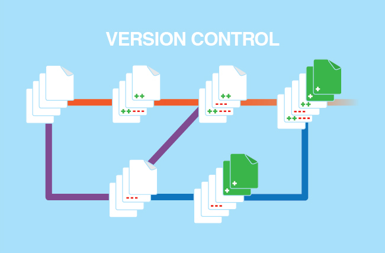
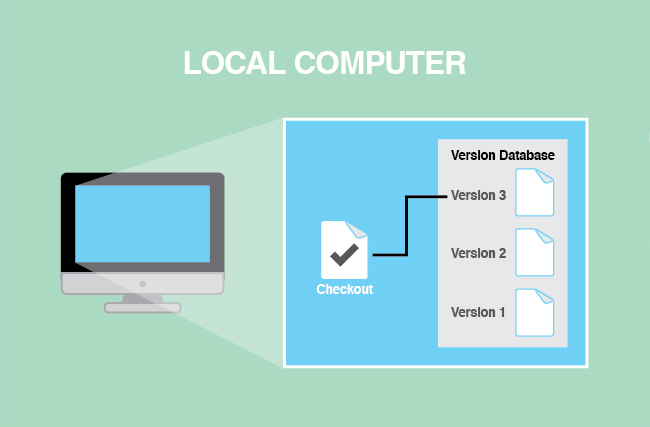
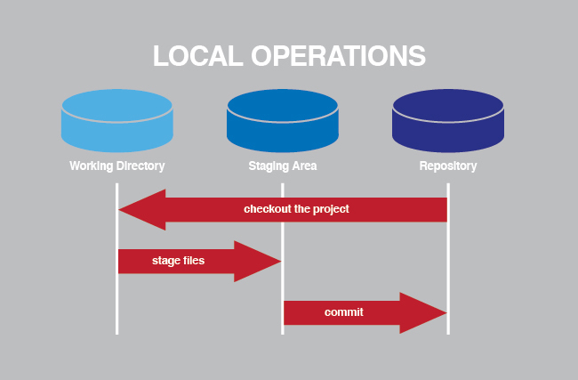
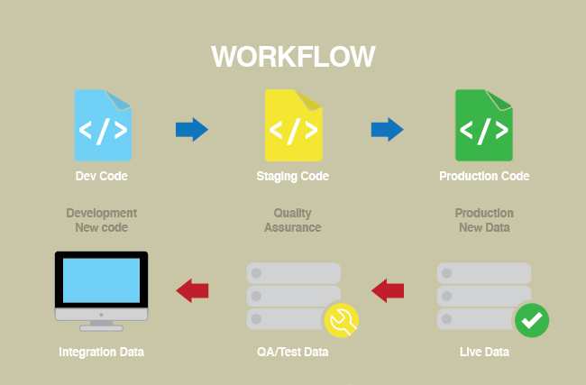

---
author:
  name: Linode
  email: docs@linode.com
description: Our guide to getting starting with version control
keywords: ["version control", "introduction to version control", "git", "introduction to git"]
license: '[CC BY-ND 4.0](https://creativecommons.org/licenses/by-nd/4.0)'
aliases: ['intro-version-control/','applications/development/introduction-to-version-control/']
modified: 2013-09-18
modified_by:
  name: Linode
published: 2013-09-18
title: Introduction to Version Control
external_resources:
 - '[Version Control Systems](/docs/development/version-control/)'
audiences: ["foundational"]
---

In the [Hosting a Website](/docs/websites/hosting-a-website/) guide, you learned how to host your website by installing and configuring a web server, database, and PHP. Now it's time to implement version control to protect your data and handle code updates smoothly. By the time you reach the end of this guide, you'll know how to use many of the version control methods and tools used by large organizations.

## Getting Started

A *version control* system is a special application that stores and manages every revision of your files and code. Many developers and organizations use version control to collaborate on source code, manage releases, and roll back to previous versions when bugs are discovered.

Setting up a version control system is easy. The hard part is learning to use it, and then incorporate it in your daily workflow. This section introduces version control and explains how you can apply it to your own projects. We'll walk you through all of the steps, from evaluating the different version control systems to creating and using a repository.

### Why Use Version Control?

If you host a website or web-based application on your Linode, your users rely on your content to be available. You also need to keep your content updated and patched. However, changing your content can result in unforeseen bugs, which in turn can result in downtime. You need a way to protect your code and files through changes, to test updates before they go live, and to roll back to a working version if something goes wrong.

Version control (also referred to as *revision control* or *source control*) is a file storage system that tracks every change made to a file and allows you to reverse or roll back those changes. For example, if you were editing a file on your personal computer and decided to delete a section of code, you could use version control to restore that section of code in the future - even weeks or months from now.

Version control is also a great tool for individuals who need to work on the same files at the same time. With version control, they can *check out* the repository and then *commit* the changes when they're finished. If two individuals have modified the same file, the version control system can usually *merge* the changes, unless there's a *conflict*, in which case the user will need to manually combine the changes or favor one change over the other.

Version control also makes it easy to track changes. You can see who committed code, and why. And if you start working on a new version of your website or application, you can *branch* a copy of your code to a separate area. (The branch can later be modified back into the *truck*.) In short, version control is cheap insurance against human errors and unforeseeable disasters. You should be using it!

### Evaluating Version Control Systems

There are several types of open source version control systems available. Each system has its own advantages and disadvantages, so you should do some research before making your selection. Here are three of the most popular:

-   **Git:** Designed and developed by Linus Torvalds for Linux kernel development, Git provides strong support for non-linear and distributed development. It's probably the most popular distributed revision control and source code management system. See the [Git documentation website](http://git-scm.com/) for more information. You can also read our guide to [Git Source Control Management](/docs/development/version-control/how-to-install-git-on-linux-mac-and-windows/).
-   **Subversion:** When it emerged in 2000, Subversion operated like [CVS](http://cvs.nongnu.org/) and added some of the features that were missing from CVS. It was the undisputed king of version control systems until Git emerged in 2005, and it's still very popular. It's now maintained by the Apache Software Foundation. You can read our guide to [Managing Source Code Versions with Subversion](/docs/development/version-control/manage-source-code-versions-with-subversion/).
-   **Mercurial:** This is another popular version control system that resembles Git. It doesn't enjoy quite as much popularity and community support as Git, but it's still a very capable and accessible system. You can read our guide [Managing Distributed Version Control with Mercurial](/docs/development/version-control/manage-distributed-version-control-with-mercurial/).

We'll use Git as an example in this guide. But don't let our decision influence you - there are plenty of other version control systems out there. Feel free to investigate other options if Git, Subversion, or Mercurial don't meet your needs for automating server builds and managing configurations.

### Example Version Control Workflow

This is the process most developers use to create, stage, and commit files to a Git repository. It could be different than the process you're currently using, but it's important to learn Git's workflow and at least *try* using it, even if it seems a bit weird at first. Here's how it works:

1.  Create or modify files in your working directory. Once you're satisfied with your changes, use the `git add` command to move the modified files to the staging area.
2.  Snapshots of the new and modified files are added to the staging area. Now you can preview the files.
3.  When you're ready to commit the files to the repository, use the `git commit` command. The files in the staging area are permanently stored in your Git directory.

An illustrated overview of this process is shown below.

For an added layer of protection, you can store your files in *both* a local and a remote Git repository. This is ideal for developers who modify files on their local desktop computers and then need to transfer them to a server. Such a setup is beyond the scope of this guide, but the official Git website provides [some excellent instructions on this topic](http://git-scm.com/book/ch2-5.html).

## Installing Git

You can install Git on your desktop computer, your Linode, or both. Getting started with Git is easy. All you have to do is install Git on your Linode, create a repository, and make an initial commit. Here's how:

1.  Open a terminal window and [log in to your Linode via SSH](/docs/getting-started/#connect-to-your-linode-via-ssh).
2.  Install Git on your Linode by entering the following commands, one by one:

        sudo apt-get update
        sudo apt-get install git

3.  Set your username and email address by entering the following commands, one by one. Replace the example name and email address with your own. Git uses this information when you commit changes.

        git config --global user.name "Jane Smith"
        git config --global user.email jsmith@example.com

4.  Now that Git is installed on your Linode, you'll need to create the repository. Go to your project's directory, and then enter the following command:

        git init

5.  The repository (a `.git` subdirectory) has been created, but nothing has been added to it yet. To start tracking all of the files in your project's directory, enter the following command:

        git add *

6.  The files are now being tracked, so you can make the initial commit. Enter the following command:

        git commit -m 'initial project version'

Congratulations! You've successfully created a Git repository, specified which files should be tracked, and made an initial commit. Next let's look at a version control workflow to get a sense of how you could use Git in a real-life scenario.

## Environments

Now it's time to use what you've learned about version control and server builds to create different *environments* for your code. Environments are self-contained sandboxes that can be stored on different computers or the same system. You can create separate environments to store files in different stages of development and production. In this section, you'll learn how to modify files in a development environment, preview the changes in a staging environment, and then deploy all of the changes to a production environment. It's an effective way to make changes and test them *before* implementing them on a public-facing website.

### Setting Up

To get started, you'll need to decide which environments you want to create and then set them up. We recommend creating three different environments, which should be suitable for most individual developers and small organizations. Larger companies will likely want and need several other environments, depending on the established teams and processes. Ideally, the environments you create should correspond to your workflow. For example, if your organization has a dedicated quality control department, you'll probably want to create an additional environment specifically for that department.

We recommend creating the following environments:

-   **Development:** Use this environment to create new files and modify existing ones. Nobody except you can see the changes, so you can do whatever you want in here.
-   **Staging:** After you've finished making the changes, you'll move the files to this environment to preview the changes in a private area. The changes are still hidden from the public at this point, but you can test the website to make sure you didn't break anything.
-   **Production:** If the changes look good, you can push the modified files to the production website. Now all of the changes are visible to the public.

Put some thought into where you want the files for each environment to reside. For example, if you're a developer working alone, you may want to keep the development environment on your personal desktop computer and the staging and production environments on your Linode. You can also keep all of the environments on a single system.

Ideally, you'll use a version control system to create and maintain separate repositories for each environment. That way, you'll be able to issue commands to push the files from one environment's repository to another. And since different environments will use different data, you should also create different databases for each environment. You can copy the data in the production database down to the staging and development environments.

### Perfecting Your Workflow

As with using a version control system, it takes some time and effort to get used to environments. For example, if you're used to modifying the files in your production environment — a risky practice that is definitely not recommended – it may be challenging to learn to use a version control system to deploy modified files from the development environment to your staging and production environments. Stick with it! The rewards are worth it.
