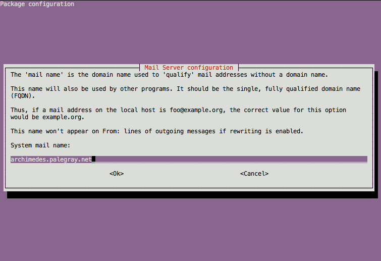
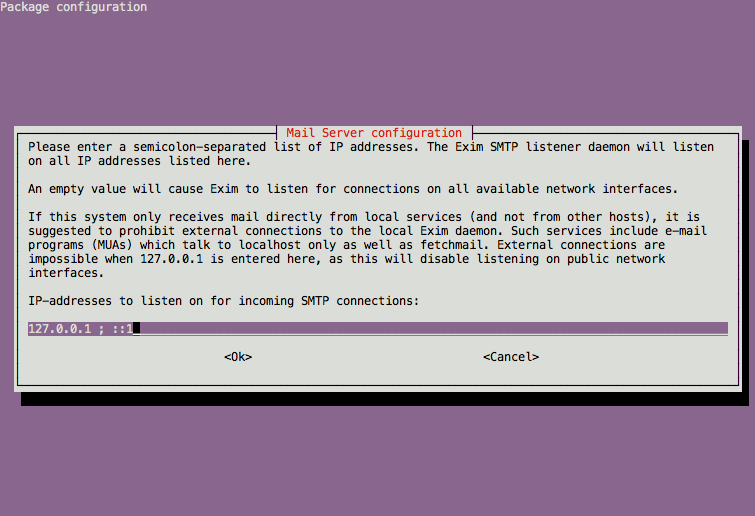
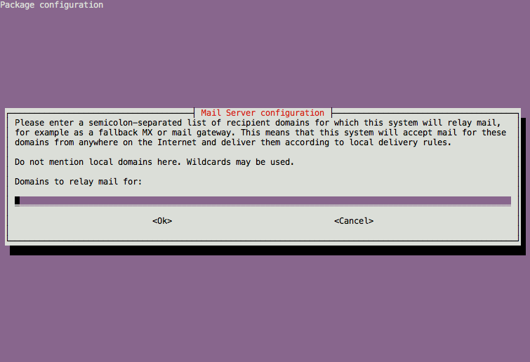
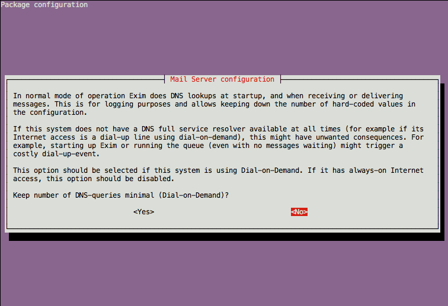
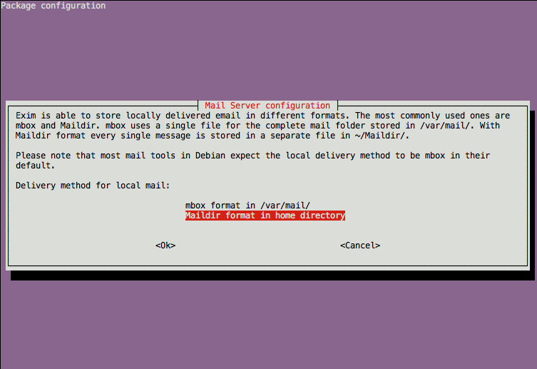
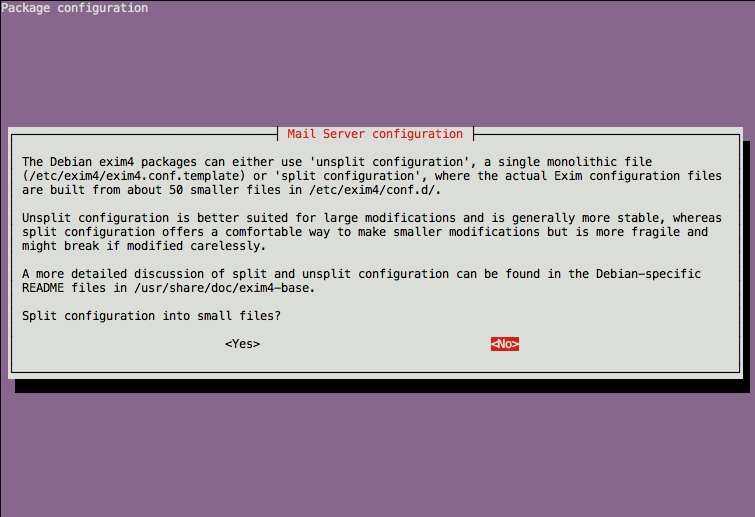

Many Linux server applications need to send email. Cron jobs use mail services to deliver reports on jobs that have run, web applications require mail support for user registration functions, and other applications may need to send alerts via SMTP. This guide will help you install and configure the lightweight Exim MTA (Mail Transfer Agent) on your Ubuntu 12.04 LTS (Precise Pangolin) Linode.

You'll gain the ability to send mail from `localhost` through either a traditional "sendmail" style interface or via port 25 locally. As this guide is not intended to provide a full send/receive mail solution, please refer to our other [email guides](/docs/email/) for ways to implement such configurations.

We assume that you've already followed the steps outlined in our [getting started](/docs/getting-started/) guide. If you are new to Linux server administration, you may be interested in our [introduction to Linux concepts guide](/docs/tools-reference/introduction-to-linux-concepts/), [beginner's guide](/docs/platform/billing-and-support/linode-beginners-guide/) and [administration basics guide](/docs/tools-reference/linux-system-administration-basics/). Make sure you're logged into your Linode as "root" via SSH before proceeding.

## Set the Hostname

Before you begin installing and configuring the components described in this guide, please make sure you've followed our instructions for [setting your hostname](/docs/getting-started/#setting-the-hostname). Issue the following commands to make sure it is set properly:

    hostname
    hostname -f

## Install Required Packages

Make sure you have the "universe" repositories enabled. Your `/etc/apt/sources.list` file should resemble this:


## main & restricted repositories
deb http://us.archive.ubuntu.com/ubuntu/ precise main restricted
deb-src http://us.archive.ubuntu.com/ubuntu/ precise main restricted

deb http://security.ubuntu.com/ubuntu precise-security main restricted
deb-src http://security.ubuntu.com/ubuntu precise-security main restricted

## universe repositories
deb http://us.archive.ubuntu.com/ubuntu/ precise universe
deb-src http://us.archive.ubuntu.com/ubuntu/ precise universe
deb http://us.archive.ubuntu.com/ubuntu/ precise-updates universe
deb-src http://us.archive.ubuntu.com/ubuntu/ precise-updates universe

deb http://security.ubuntu.com/ubuntu precise-security universe
deb-src http://security.ubuntu.com/ubuntu precise-security universe



Issue the following commands to update your package repositories, upgrade your system, and install Exim:

    apt-get update
    apt-get upgrade
    apt-get install exim4-daemon-light mailutils

## Configure Exim for Local Mail Service

Now you're ready to configure Exim for local mail service. Here's how:

1.  Enter the following command to start Exim configuration:

        dpkg-reconfigure exim4-config

2.  You'll be presented with a welcome screen, followed by a screen asking what type mail delivery you'd like to support. Select the option for **internet site**, and then select **Ok** to continue.

    

3.  Enter your system's FQDN (fully qualified domain name) in the **mail name** configuration screen.

    

4.  Enter `127.0.0.1 ; ::1` when asked which IP address to listen on for SMTP connections.

    

5.  Make sure you list your FQDN, hostname, and localhost entries when you're asked which destinations mail should be accepted for.

    

6.  Leave the relay domains and relay machines fields blank.

    

7.  Select **No** when asked whether to keep DNS queries to a minimum.

    

8.  You may select either **mbox** or **Maildir** when asked about the delivery method used for incoming mail. While many utilities use mbox format, Maildir format can make handling individual locally delivered mail messages easier, and is widely supporting by a range of applications.

    

9. Accept the default **non-split** option for your mail configuration file. Enter at least one external email address (choose one that you check frequently) in addition to `root` when asked to specify postmaster mail recipients.

    

## Test Your Mail Configuration

Issue the following command to send a test email, substituting an external email address for `someone@somedomain.com`.

    echo "This is a test." | mail -s Testing someone@somedomain.com

Congratulations! You've configured Exim to send email from your Linode.
