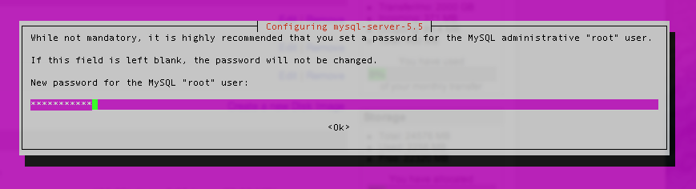

---
author:
  name: Linode
  email: docs@linode.com
description: 'Setting up a mail server with Postfix, Dovecot, and MySQL.'
keywords: ["email", " mail", " server", " postfix", " dovecot", " mysql", " debian", " ubuntu", " dovecot 2"]
license: '[CC BY-ND 4.0](https://creativecommons.org/licenses/by-nd/4.0)'
modified: 2015-04-29
modified_by:
  name: Phil Zona
published: 2013-05-13
title: 'Email with Postfix, Dovecot, and MySQL'
---

In this guide, you'll learn how to set up a secure virtual user mail server with Postfix, Dovecot, and MySQL on Debian or Ubuntu. We'll explain how to create new user mailboxes and send or receive email to and from configured domains.

For a different Linux distribution or different mail server, review our [email tutorials](/docs/email/).

## Before You Begin

1.  Set up the Linode as specified in the [Getting Started](/docs/getting-started/) and [Securing Your Server](/docs/security/securing-your-server/) guides.

1.  Ensure that the iptables [firewall](/docs/security/securing-your-server/#configure-a-firewall) is not blocking any of the standard mail ports (`25`, `465`, `587`, `110`, `995`, `143`, and `993`). If using a different form of firewall, confirm that it is not blocking any of the needed ports either.

1. Review the concepts in the [Running a Mail Server](/docs/email/running-a-mail-server/) guide.

## Configure DNS

When ready to update the DNS and to start sending mail to the server, edit the domain's MX record so that it points to the Linode's domain or IP address, similar to the example below:

    example.com A 10 12.34.56.78
    example.com MX 10 example.com
    mail.example.com MX 10 example.com

Ensure that the MX record is changed for all domains and subdomains that might receive email. If setting up a brand new domain, these steps can be performed prior to configuring the mail server. When using Linode's [DNS Manager](/docs/networking/dns/dns-manager-overview/), create an MX record that points to the desired domain or subdomain, and then create an A record for that domain or subdomain, which points to the correct IP address.

## Update Hosts File

Verify that the `hosts` file contains a line for the Linode's public IP address and is associated with the **Fully Qualified Domain Name** (FQDN). In the example below, 192.0.2.0 is the public IP address, hostname is the local hostname, and hostname.example.com is the FQDN.


127.0.0.1 localhost.localdomain localhost
192.0.2.0 hostname.example.com hostname



## Install SSL Certificate

You will need to install a SSL certificate on your mail server prior to completing the [Dovecot](#dovecot) configuration steps.  The SSL certificate will authenticate the identity of the mail server to users and encrypt the transmitted data between the user's mail client and the mail server.  To install a SSL certificate, use the [Certbot documentation](https://certbot.eff.org/).

Make a note of the certificate and key locations on the Linode. You will need the path to each during the [Dovecot](#Dovecot) configuration steps.

## Install Packages

The next steps are to install the required packages on the Linode.

1.  Log in to your Linode via SSH. Replace `192.0.2.0` with your IP address:

        ssh username@192.0.2.0

2.  Install the required packages:

        sudo apt-get install postfix postfix-mysql dovecot-core dovecot-imapd dovecot-pop3d dovecot-lmtpd dovecot-mysql mysql-server

    Follow the prompt to type in a secure MySQL password and to select the type of mail server you wish to configure. Select **Internet Site**. The *System Mail Name* should be the FQDN.

    

    

    

### Versions

This guide was created using the following package versions:

* Postfix 3.1.0
* Dovecot 2.2.22
* MySQL 14.14

## MySQL

The mail server's virtual users and passwords are stored in a MySQL database. Dovecot and Postfix require this data. Follow the steps below to create the database tables for virtual users, domains and aliases:

1.  Create a new database:

        mysqladmin -u root -p create mailserver

2.  Enter the MySQL root password after the prompt.

3.  Log in to MySQL:

        mysql -u root -p mailserver

4.  Create the MySQL user and grant the new user permissions over the database. Replace `mailuserpass` with a secure password:

        GRANT SELECT ON mailserver.* TO 'mailuser'@'127.0.0.1' IDENTIFIED BY 'mailuserpass';

5.  Flush the MySQL privileges to apply the change:

        FLUSH PRIVILEGES;

6.  Create a table for the domains that will receive mail on the Linode:

        CREATE TABLE `virtual_domains` (
          `id` int(11) NOT NULL auto_increment,
          `name` varchar(50) NOT NULL,
          PRIMARY KEY (`id`)
        ) ENGINE=InnoDB DEFAULT CHARSET=utf8;

7.  Create a table for all of the email addresses and passwords:

        CREATE TABLE `virtual_users` (
          `id` int(11) NOT NULL auto_increment,
          `domain_id` int(11) NOT NULL,
          `password` varchar(106) NOT NULL,
          `email` varchar(100) NOT NULL,
          PRIMARY KEY (`id`),
          UNIQUE KEY `email` (`email`),
          FOREIGN KEY (domain_id) REFERENCES virtual_domains(id) ON DELETE CASCADE
        ) ENGINE=InnoDB DEFAULT CHARSET=utf8;

8.  Create a table for the email aliases:

        CREATE TABLE `virtual_aliases` (
          `id` int(11) NOT NULL auto_increment,
          `domain_id` int(11) NOT NULL,
          `source` varchar(100) NOT NULL,
          `destination` varchar(100) NOT NULL,
          PRIMARY KEY (`id`),
          FOREIGN KEY (domain_id) REFERENCES virtual_domains(id) ON DELETE CASCADE
        ) ENGINE=InnoDB DEFAULT CHARSET=utf8;

### Adding Data

Now that the database and tables have been created, add some data to MySQL.

1.  Add the domains to the `virtual_domains` table. Replace the values for `example.com` and `hostname` with your own settings.

        INSERT INTO 'mailserver'.'virtual_domains'
          ('id' ,'name')
        VALUES
          ('1', 'example.com'),
          ('2', 'hostname.example.com'),
          ('3', 'hostname'),
          ('4', 'localhost.example.com');

    
Note which `id` corresponds to which domain, the `id` value is necessary for the next two steps.


1.  Add email addresses to the `virtual_users` table. The `domain_id` value references the `virtual_domain` table's `id` value. Replace the email address values with the addresses that you wish to configure on the mailserver. Replace the `password` values with strong passwords.

        INSERT INTO `mailserver`.`virtual_users`
          (`id`, `domain_id`, `password` , `email`)
        VALUES
          ('1', '1', ENCRYPT('password', CONCAT('$6$', SUBSTRING(SHA(RAND()), -16))), 'email1@example.com'),
          ('2', '1', ENCRYPT('password', CONCAT('$6$', SUBSTRING(SHA(RAND()), -16))), 'email2@example.com');

1.  An email alias will forward all email from one email address to another. To set up an email alias, add it to the `virtual_aliases` table.

        INSERT INTO `mailserver`.`virtual_aliases`
          (`id`, `domain_id`, `source`, `destination`)
        VALUES
          ('1', '1', 'alias@example.com', 'email1@example.com');

### Testing

In the previous section, data was added to the MySQL `mailserver` database. The steps below will test that the data has been stored and can be retrieved.

1. Log in to MySQL:

        mysql -u root -p mailserver

1.  Check the contents of the `virtual_domains` table:

        SELECT * FROM mailserver.virtual_domains;

1.  Verify that you see the following output:

        +----+-----------------------+
        | id | name                  |
        +----+-----------------------+
        |  1 | example.com           |
        |  2 | hostname.example.com  |
        |  3 | hostname              |
        |  4 | localhost.example.com |
        +----+-----------------------+
        4 rows in set (0.00 sec)

1.  Check the `virtual_users` table:

        SELECT * FROM mailserver.virtual_users;

1.  Verify the following output, the hashed passwords are longer than they appear below:

        +----+-----------+-------------------------------------+--------------------+
        | id | domain_id | password                            | email              |
        +----+-----------+-------------------------------------+--------------------+
        |  1 |         1 | $6$574ef443973a5529c20616ab7c6828f7 | email1@example.com |
        |  2 |         1 | $6$030fa94bcfc6554023a9aad90a8c9ca1 | email2@example.com |
        +----+-----------+-------------------------------------+--------------------+
        2 rows in set (0.01 sec)

1.  Check the `virtual_aliases` table:

        SELECT * FROM mailserver.virtual_aliases;

1.  Verify the following output:

        +----+-----------+-------------------+--------------------+
        | id | domain_id | source            | destination        |
        +----+-----------+-------------------+--------------------+
        |  1 |         1 | alias@example.com | email1@example.com |
        +----+-----------+-------------------+--------------------+
        1 row in set (0.00 sec)

1.  If everything outputs as expected, you can exit MySQL:

        exit

## Postfix

Postfix is a *Mail Transfer Agent* (MTA) that relays mail between the Linode and the internet. It is highly configurable allowing for great flexibility. This guide maintains many of Posfix's default configuration values.

### Configuration File Settings

The `main.cf` file is the primary configuration file used by Postfix.

1.  Make a copy of the default Postfix configuration file in case you need to revert to the default configuration:

        sudo cp /etc/postfix/main.cf /etc/postfix/main.cf.orig

1.  Edit the `/etc/postfix/main.cf` file to match the example configurations. Replace occurrences of `example.com` with your domain name.

    
# See /usr/share/postfix/main.cf.dist for a commented, more complete version

# Debian specific:  Specifying a file name will cause the first
# line of that file to be used as the name.  The Debian default
# is /etc/mailname.
#myorigin = /etc/mailname

smtpd_banner = $myhostname ESMTP $mail_name (Ubuntu)
biff = no

# appending .domain is the MUA's job.
append_dot_mydomain = no

# Uncomment the next line to generate "delayed mail" warnings
#delay_warning_time = 4h

readme_directory = no

# TLS parameters
smtpd_tls_cert_file=/etc/letsencrypt/live/example.com/fullchain.pem
smtpd_tls_key_file=/etc/letsencrypt/live/example.com/privkey.pem
smtpd_use_tls=yes
smtpd_tls_auth_only = yes
smtp_tls_security_level = may
smtpd_tls_security_level = may

# See /usr/share/doc/postfix/TLS_README.gz in the postfix-doc package for
# information on enabling SSL in the smtp client.
smtpd_relay_restrictions = permit_mynetworks permit_sasl_authenticated defer_unauth_destination
myhostname = example.com
alias_maps = hash:/etc/aliases
alias_database = hash:/etc/aliases
mydomain = example.com
myorigin = $mydomain
mydestination = $myhostname localhost.$mydomain
relayhost =
mynetworks = 127.0.0.0/8 [::ffff:127.0.0.0]/104 [::1]/128
mailbox_size_limit = 0
recipient_delimiter = +
inet_interfaces = all
inet_protocols = all

# Handing off local delivery to Dovecot's LMTP, and telling it where to store mail
virtual_transport = lmtp:unix:private/dovecot-lmtp

# Virtual domains, users, and aliases
virtual_mailbox_domains = mysql:/etc/postfix/mysql-virtual-mailbox-domains.cf
virtual_mailbox_maps = mysql:/etc/postfix/mysql-virtual-mailbox-maps.cf
virtual_alias_maps = mysql:/etc/postfix/mysql-virtual-alias-maps.cf,
        mysql:/etc/postfix/mysql-virtual-email2email.cf



1.  The `main.cf` file declares the location of `virtual_mailbox_domains`, `virtual_mailbox_maps`, and `virtual_alias_maps` files. These files contain the connection information for the MySQL lookup tables created in the [MySQL](#MySQL) section of this guide. Postfix will use this data to identify all domains, corresponding mailboxes, and valid users.

    Create the file for `virtual_mailbox_domains`. Replace the value for `password` with your database user's password.  If you used a different name for your database `user` and `dbname` replace those with your own values.

    
user = mailuser
password = mailuserpass
hosts = 127.0.0.1
dbname = mailserver
query = SELECT 1 FROM virtual_domains WHERE name='%s'



1.  Create the `/etc/postfix/mysql-virtual-mailbox-maps.cf` file, and enter the following values. Make sure you use the database user's password and make any other changes as needed.

    
user = mailuser
password = mailuserpass
hosts = 127.0.0.1
dbname = mailserver
query = SELECT 1 FROM virtual_users WHERE email='%s'



1.  Create the `/etc/postfix/mysql-virtual-alias-maps.cf` file and enter the following values. Make sure you use the database user's password and make any other changes as needed.

    
user = mailuser
password = mailuserpass
hosts = 127.0.0.1
dbname = mailserver
query = SELECT destination FROM virtual_aliases WHERE source='%s'



1.  Create the `/etc/postfix/mysql-virtual-email2email.cf` file and enter the following values. Make sure you use the database user's password and make any other changes as needed.

    
user = mailuser
password = mailuserpass
hosts = 127.0.0.1
dbname = mailserver
query = SELECT email FROM virtual_users WHERE email='%s'



1.  Restart Postfix:

        sudo systemctl restart Postfix

1.  The  `postmap`  command  creates or queries Postfix's lookup tables, or updates an existing one. Enter the following command to ensure that Postfix can query the `virtual_domains` table. Replace `example.com` with the first `name` value. The command should return `1` if it is successful.

        sudo postmap -q example.com mysql:/etc/postfix/mysql-virtual-mailbox-domains.cf

1.  Test Postfix to verify that it can retrieve the first email address from the MySQL table `virtual_users`. Replace `email1@example.com` with the first email address added to the table. You should receive `1` as the output:

        sudo postmap -q email1@example.com mysql:/etc/postfix/mysql-virtual-mailbox-maps.cf

1. Test Postfix to verify that it can query the `virtual_aliases` table. Replace `alias@example.com` with the first `source` value created in the table. The command should return the `destination` value for the row:

        sudo postmap -q alias@example.com mysql:/etc/postfix/mysql-virtual-alias-maps.cf

### Master Program Settings

Postfix's master program starts and monitors all of Postfix's processes. The configuration file `master.cf` lists all programs and information on how they should be started.

1. Make a copy of the `/etc/postfix/master.cf` file:

        sudo cp /etc/postfix/master.cf /etc/postfix/master.cf.orig

1. Edit `/etc/postfix/master.cf` to contain the values in the excerpt example. Take note of the values for lines `10`, `12` and `22`.  The rest of the file can remain unchanged.:

    
#
# Postfix master process configuration file.  For details on the format
# of the file, see the master(5) manual page (command: "man 5 master" or
# on-line: http://www.postfix.org/master.5.html).
#
# Do not forget to execute "postfix reload" after editing this file.
#
# ==========================================================================
# service type  private unpriv  chroot  wakeup  maxproc command + args
#               (yes)   (yes)   (yes)    (never) (100)
# ==========================================================================
smtp      inet  n       -       n       -       -       smtpd
#smtp      inet  n       -       -       -       1       postscreen
#smtpd     pass  -       -       -       -       -       smtpd
#dnsblog   unix  -       -       -       -       0       dnsblog
#tlsproxy  unix  -       -       -       -       0       tlsproxy
submission inet n       -       -       -       -       smtpd
  -o syslog_name=postfix/submission
  -o smtpd_tls_security_level=encrypt
  -o smtpd_sasl_auth_enable=yes
  -o smtpd_reject_unlisted_recipient=no
  -o smtpd_client_restrictions=permit_sasl_authenticated,reject
  -o milter_macro_daemon_name=ORIGINATING
smtps     inet  n       -       -       -       -       smtpd
  -o syslog_name=postfix/smtps
  -o smtpd_tls_wrappermode=yes
  -o smtpd_sasl_auth_enable=yes
  -o smtpd_client_restrictions=permit_sasl_authenticated,reject
  -o milter_macro_daemon_name=ORIGINATING
  ...



1. Change the permissions on the `/etc/postfix` directory to restrict permissions to allow only its owner and the corresponding group:

        sudo chmod -R o-rwx /etc/postfix

1. Restart Postfix:

        sudo systemct restart postfix

## Dovecot

Dovecot is the Mail Deliver Agent (MDA) which is passed messages from Postfix and delivers them to a virtual mailbox. In this section, configure Dovecot to force users to use SSL when they connect so that their passwords are never sent to the server in plain text.

1.  Copy all of the configuration files so you can easily revert back to them if needed:

        sudo cp /etc/dovecot/dovecot.conf /etc/dovecot/dovecot.conf.orig
        sudo cp /etc/dovecot/conf.d/10-mail.conf /etc/dovecot/conf.d/10-mail.conf.orig
        sudo cp /etc/dovecot/conf.d/10-auth.conf /etc/dovecot/conf.d/10-auth.conf.orig
        sudo cp /etc/dovecot/dovecot-sql.conf.ext /etc/dovecot/dovecot-sql.conf.ext.orig
        sudo cp /etc/dovecot/conf.d/10-master.conf /etc/dovecot/conf.d/10-master.conf.orig
        sudo cp /etc/dovecot/conf.d/10-ssl.conf /etc/dovecot/conf.d/10-ssl.conf.orig

1.  Edit `/etc/dovecot/dovecot.conf` file. Add `protocols = imap pop3 lmtp` to the `# Enable installed protocols` section of the file.

    
## Dovecot configuration file
...
# Enable installed protocols
!include_try /usr/share/dovecot/protocols.d/*.protocol
protocols = imap pop3 lmtp
...
postmaster_address=postmaster at docteamdemosite.club



1.  Edit the `/etc/dovecot/conf.d/10-mail.conf` file. This file controls how Dovecot interacts with the server's file system to store and retrieve messages.

    Modify the following variables within the configuration file:

    
mail_location = maildir:/var/mail/vhosts/%d/%n
...
mail_privileged_group = mail



1.  Create the `/var/mail/vhosts/` directory and a subdirectory for your domain. Replace `example.com` with your domain name:

        sudo mkdir -p /var/mail/vhosts/example.com

    This directory will serve as storage for mail sent to your domain.

1. Create the `vmail` group with id `5000`.  Add a new user `vmail` to the `vmail` group.  This system user will read mail from the server.

        sudo groupadd -g 5000 vmail
        sudo useradd -g vmail -u 5000 vmail -d /var/mail

1.  Change the owner of the `/var/mail/` folder and its contents to belong to `vmail`:

        sudo chown -R vmail:vmail /var/mail

1. Edit the user authentication file, located in `/etc/dovecot/conf.d/10-auth.conf`. Uncomment the following variables and replace with the file excerpt's example values:

    
disable_plaintext_auth = yes
...
auth_mechanisms = plain login
...
!include auth-system.conf.ext
...
!include auth-sql.conf.ext
...



    
For reference, [view](/docs/assets/1238-dovecot_10-auth.conf.txt) a complete `10-auth.conf` file.


1. Edit the `auth-sql.conf.ext` file with authentication and storage information. Ensure your file contains the following lines and that they are uncommented:

    
...
passdb {
  driver = sql
  args = /etc/dovecot/dovecot-sql.conf.ext
}
...
userdb {
  driver = static
  args = uid=vmail gid=vmail home=/var/mail/vhosts/%d/%n
       }
...



1. Update the `/etc/dovecot/dovecot-sql.conf.ext` file with you MySQL connection information.  Uncomment the following variables and replace the values with the excerpt example.  Enusre you replace `dbname`, `user` and `password` with your own MySQL database values.

    
...
driver = mysql
...
connect = host=127.0.0.1 dbname=mailserver user=mailuser password=mailuserpass
...
default_pass_scheme = SHA512-CRYPT
...
password_query = SELECT email as user, password FROM virtual_users WHERE email='%u';
...


    
The `password_query` variable uses email addresses listed in the `virtual_users` table as the username credential for an email account.

To use an alias as the username, add the alias as the `source` and `destination` email address to the `virtual_aliases` table. Change the `/etc/dovecot/dovecot-sql.conf.ext` file's `password_query` value to `password_query = SELECT email as user, password FROM virtual_users WHERE email=(SELECT destination FROM virtual_aliases WHERE source = '%u');`


    
For reference, [view](/docs/assets/1284-dovecot__dovecot-sql.conf.ext.txt) a complete `dovecot-sql.conf.ext`file.


1. Change the owner and group of the `/etc/dovecot/` directory to `vmail` and `dovecot`:

        sudo chown -R vmail:dovecot /etc/dovecot

1. Change the permissions on the `/etc/dovecot/` to be recursively read write and execute for the owner of the directory:

        sudo chmod -R o-rwx /etc/dovecot

1. Edit the service settings file `/etc/dovecot/conf.d/10-master.conf`:

    
When editing the file, be careful you don't remove any opening or closing curly braces. If there's a syntax error, Dovecot will crash silently. You can check `/var/log/upstart/dovecot.log` to debug the error.

[Here](/docs/assets/1240-dovecot_10-master.conf.txt) is an example of a complete `10-master.conf` file.


1. Disable unencrypted IMAP and POP3 by setting the protocols' ports to `0`. Ensure that the `port` and `ssl` variables are uncommented:

    
...
service imap-login {
  inet_listener imap {
    port = 0
  }
  inet_listener imaps {
    port = 993
    ssl = yes
  }
  ...
}
...
service pop3-login {
  inet_listener pop3 {
    port = 0
  }
  inet_listener pop3s {
    port = 995
    ssl = yes
  }
}
...


    Find the `service lmtp` section of the file and use the configuration shown below:

    
...
service lmtp {
  unix_listener /var/spool/postfix/private/dovecot-lmtp {
    #mode = 0666i
    mode = 0600
    user = postfix
    group = postfix
  }
...
}


    Locate `service auth` and configure it as shown below:

    
...
service auth {
  ...
  unix_listener /var/spool/postfix/private/auth {
    mode = 0666
    user = postfix
    group = postfix
  }

  unix_listener auth-userdb {
    mode = 0600
    user = vmail
  }
...
  user = dovecot
}
...



    In the `service auth-worker` section, uncomment the `user` line and set it to `vmail`:

    
...
service auth-worker {
  ...
  user = vmail
}



    Save the changes to the `/etc/dovecot/conf.d/10-master.conf` file.

1. Edit `/etc/dovecot/conf.d/10-ssl.conf` file to require SSL and to add the location of your domain's SSL certificate and key.  Replace `example.com` with your domain:

    
...
# SSL/TLS support: yes, no, required. <doc/wiki/SSL.txt>
ssl = required
...
ssl_cert = </etc/letsencrypt/live/example.com/fullchain.pem
ssl_key = </etc/letsencrypt/live/example.com/privkey.pem



1. Restart Dovecot to enable all configurations:

        sudo systemctl restart Dovecot

## Test Email

1.  Set up a test account in an email client to ensure that everything is working. Many clients detect server settings automatically. However, manual configuration requires the following parameters:

    -   the full email address, including the `@example.com` part, is the username.
    -   the password should be the one you added to the MySQL table for this email address.
    -   The incoming and outgoing server names must be a domain that resolves to the Linode.
    -   Both the incoming and outgoing servers require authentication and SSL encryption.
    -   You should use Port 993 for secure IMAP, Port 995 for secure POP3, and Port 587 with SSL for SMTP.

2.  Try sending an email to this account from an outside email account and then reply to it. Check the mail log file in */var/log/mail.log* for the following output (the first block is for an incoming message, and the second block for an outgoing message):

    
Mar 22 18:18:15 host postfix/smtpd[22574]: connect from mail1.linode.com[96.126.108.55]
Mar 22 18:18:15 host postfix/smtpd[22574]: 2BD192839B: client=mail1.linode.com[96.126.108.55]
Mar 22 18:18:15 host postfix/cleanup[22583]: 2BD192839B: message-id=<D4887A5E-DEAC-45CE-BDDF-3C89DEA84236@example.com>
Mar 22 18:18:15 host postfix/qmgr[15878]: 2BD192839B: from=<support@linode.com>, size=1156, nrcpt=1 (queue active)
Mar 22 18:18:15 host postfix/smtpd[22574]: disconnect from mail1.linode.com[96.126.108.55]
Mar 22 18:18:15 host dovecot: lmtp(22587): Connect from local
Mar 22 18:18:15 host dovecot: lmtp(22587, email1@example.com): 5GjrDafYTFE7WAAABf1gKA: msgid=<D4887A5E-DEAC-45CE-BDDF-3C89DEA84236@linode.com>: saved mail to INBOX
Mar 22 18:18:15 host dovecot: lmtp(22587): Disconnect from local: Client quit (in reset)
Mar 22 18:18:15 host postfix/lmtp[22586]: 2BD192839B: to=<email1@example.com>, relay=host.example.com[private/dovecot-lmtp], delay=0.09, delays=0.03/0.02/0.03/0.01, dsn=2.0.0, status=sent (250 2.0.0 <email1@example.com> 5GjrDafYTFE7WAAABf1gKA Saved)
Mar 22 18:18:15 host postfix/qmgr[15878]: 2BD192839B: removed



    
Mar 22 18:20:29 host postfix/smtpd[22590]: connect from 173-161-199-49-Philadelphia.hfc.comcastbusiness.net[173.161.199.49]
Mar 22 18:20:29 host dovecot: auth-worker: mysql(127.0.0.1): Connected to database mailserver
Mar 22 18:20:29 host postfix/smtpd[22590]: AA10A2839B: client=173-161-199-49-Philadelphia.hfc.comcastbusiness.net[173.161.199.49], sasl_method=PLAIN, sasl_username=email1@example.com
Mar 22 18:20:29 host postfix/cleanup[22599]: AA10A2839B: message-id=<FB6213FA-6F13-49A8-A5DD-F324A4FCF9E9@example.com>
Mar 22 18:20:29 host postfix/qmgr[15878]: AA10A2839B: from=<email1@example.com>, size=920, nrcpt=1 (queue active)
Mar 22 18:20:29 host postfix/smtp[22601]: AA10A2839B: to=<support@linode.com>, relay=mail1.linode.com[96.126.108.55]:25, delay=0.14, delays=0.08/0.01/0.05/0.01, dsn=2.0.0, status=sent (250 2.0.0 Ok: queued as C4232266C9)
Mar 22 18:20:29 host postfix/qmgr[15878]: AA10A2839B: removed



You now have a functioning mail server that can securely send and receive email. If things are not working smoothly, try consulting the [Troubleshooting Problems with Postfix, Dovecot, and MySQL](/docs/email/postfix/troubleshooting-problems-with-postfix-dovecot-and-mysql/) guide. At this point, consider adding spam and virus filtering and a webmail client. If DNS records have not been created for the mail server yet, do so now. Once the DNS records have propagated, email will be delivered via the new mail server.


If errors are encountered in the /var/log/syslog stating "Invalid settings: postmaster_address setting not given", you may need to append the following line to the /etc/dovecot/dovecot.conf file, replacing domain with the domain name.

postmaster_address=postmaster at DOMAIN


## Adding New Domains, Email Addresses, and Aliases

Although the mail server is up and running, eventually you'll probably need to add new domains, email addresses, and aliases for the users. To do this, simply add a new line to the appropriate MySQL table. These instructions are for command-line MySQL, but you can also use [phpMyAdmin](http://www.phpmyadmin.net/) to add new entries to the tables.

### Domains

1.  To add a new domain, open a terminal window and [log in to the Linode via SSH](/docs/getting-started/#connect-to-your-linode-via-ssh).

2.  Log in to the MySQL server with an appropriately privileged user. For this example, use the `root` user:

        mysql -u root -p mailserver

3.  Enter the root MySQL password when prompted.
4.  Always view the contents of the table before adding new entries. Enter the following command to view the current contents of any table, replacing `virtual_domains` with the table:

        SELECT * FROM mailserver.virtual_domains;

5.  The output should resemble the following:

        +----+-----------------------+
        | id | name                  |
        +----+-----------------------+
        |  1 | example.com           |
        |  2 | hostname.example.com  |
        |  3 | hostname              |
        |  4 | localhost.example.com |
        +----+-----------------------+

6.  To add another domain, enter the following command, replacing `newdomain.com` with the domain name:

        INSERT INTO `mailserver`.`virtual_domains`
          (`name`)
        VALUES
          ('newdomain.com');

7.  Verify that the new domain has been added. The output should display the new domain name.

        SELECT * FROM mailserver.virtual_domains;

8.  Exit MySQL:

        quit

You have successfully added the new domain to the Postfix and Dovecot setup.

### Email Addresses

1.  To add a new email address, enter the following command in MySQL, replacing `newpassword` with the user's password, and `email3@newdomain.com` with the user's email address:

        INSERT INTO `mailserver`.`virtual_users`
          (`domain_id`, `password` , `email`)
        VALUES
          ('5', ENCRYPT('newpassword', CONCAT('$6$', SUBSTRING(SHA(RAND()), -16))) , 'email3@newdomain.com');

    
Be sure to use the correct number for the `domain_id`. In this case, we are using `5`, because we want to make an email address for `newdomain.com`, and `newdomain.com` has an `id` of `5` in the `virtual_domains` table.


2.  Verify that the new email address has been added.  The new email address should be displayed in the output.

        SELECT * FROM mailserver.virtual_users;

3.  Exit MySQL:

        quit

You have successfully added the new email address to the Postfix and Dovecot setup.

### Aliases

1.  To add a new alias, enter the following command in MySQL, replacing `alias@newdomain.com` with the address from which you want to forward email, and `myemail@gmail.com` with the address that you want to forward the mail to. The `alias@newdomain.com` needs to be an email address that already exists on the server.

        INSERT INTO `mailserver`.`virtual_aliases`
          (`domain_id`, `source`, `destination`)
        VALUES
          ('5', 'alias@newdomain.com', 'myemail@gmail.com');

    
Ensure that the correct number is entered for the `domain_id` value. Use the `id` of the domain for this email address. For an explanation of `id` us, see the email users section above.


    You can also add a "catch-all" alias which will forward all emails sent to a domain which do not have matching aliases or users by specifying `@newdomain.com` as the source of the alias.

        INSERT INTO `mailserver`.`virtual_aliases`
          (`domain_id`, `source`, `destination`)
        VALUES
          ('5', '@newdomain.com', 'myemail@gmail.com');

2.  Verify that the new alias has been added. The new alias will be displayed in the output.

        SELECT * FROM mailserver.virtual_aliases;

3.  Exit MySQL:

        quit

You have now successfully added the new alias to the Postfix and Dovecot setup.

