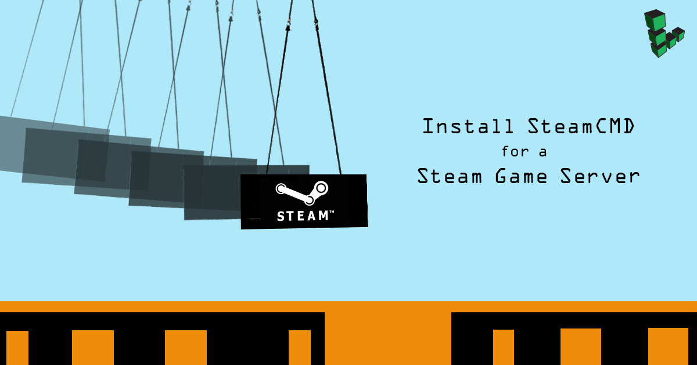

---
author:
  name: Linode
  email: docs@linode.com
description: 'Install SteamCMD, a command-line version of the Steam client, which works with games that use SteamPipe. Installing SteamCMD is a prerequisite before hosting a Steam title on your own game server.'
keywords: ["steam", "steamcmd", "steam cmd", "games", "game server", "steam server", "steampipe"]
license: '[CC BY-ND 4.0](https://creativecommons.org/licenses/by-nd/4.0)'
modified_by:
  name: Linode
published: 2016-02-15
title: 'Install SteamCMD for a Steam Game Server'
external_resources:
 - '[Valve Developer Community: SteamCMD](https://developer.valvesoftware.com/wiki/SteamCMD)'
 - '[Dedicated Steam Servers for Linux](https://developer.valvesoftware.com/wiki/Dedicated_Servers_List#Linux_Dedicated_Servers)'
 - '[Steam Support: Required Ports for Steam](https://support.steampowered.com/kb_article.php)'
aliases: ['applications/game-servers/install-steamcmd-for-a-steam-game-server/']
dedicated_cpu_link: true
---

SteamCMD is a command-line version of the Steam client which works with games that use [SteamPipe](https://developer.valvesoftware.com/wiki/SteamPipe). If you intend to host a Steam title on your own game server, installing SteamCMD is a prerequisite.

This guide is intended to get you quickly up and running with SteamCMD on your Linode. See Valve's [SteamCMD wiki page](https://developer.valvesoftware.com/wiki/SteamCMD) for more information and advanced setups.


This guide is written for a non-root user. Commands that require elevated privileges are prefixed with `sudo`. If you’re not familiar with the `sudo` command, you can check our [Users and Groups](/docs/tools-reference/linux-users-and-groups/) guide.


## Before You Begin

1.  Familiarize yourself with our [Getting Started](/docs/getting-started/) guide and complete the steps for setting your Linode's hostname and timezone.

1.  Update Your Operating System:

    **CentOS**

        sudo yum update

    **Debian, Ubuntu**

        sudo apt update && sudo apt upgrade

1.  [Install the `screen` utility](/docs/networking/ssh/using-gnu-screen-to-manage-persistent-terminal-sessions/#installing-gnu-screen), which will be used later when running SteamCMD. For more information about how screen works, review the rest of our [Using GNU Screen to Manage Persistent Terminal Sessions](/docs/networking/ssh/using-gnu-screen-to-manage-persistent-terminal-sessions/) guide.

## Secure Your Game Server

Game servers and clients are an especially ripe target for attack. Use our [Securing Your Server](/docs/security/securing-your-server/) guide to:

1.  [Add a limited Linux user](/docs/security/securing-your-server/#add-a-limited-user-account) to your server. Make the username `steam` to coincide with the rest of [Linode's Steam guides](/docs/applications/game-servers/), as well as Valve's official documentation. Be sure to give the `steam` user `sudo` privileges.

1.  [Harden SSH access](/docs/security/securing-your-server/#harden-ssh-access).

1.  [Remove unused network-facing services](/docs/security/securing-your-server/#remove-unused-network-facing-services).

1.  If you are using [**iptables**](/docs/security/firewalls/control-network-traffic-with-iptables/) (which is set in Linode's Ubuntu and Debian images by default), follow the [Configure your Firewall Using IPTables](#configure-your-firewall-using-iptables) section.

1.  If instead you are using [**firewalld**](/docs/security/firewalls/introduction-to-firewalld-on-centos/) (as in Linode's CentOS 7 and Fedora images), follow the [Configure your Firewall Using FirewallD](#configure-your-firewall-using-firewalld) section.

### Configure your Firewall Using IPTables

1.  Create two files named `v4` and `v6` in your home directory to record your IPv4 and IPv6 firewall rules:

    
*filter

# Allow all loopback (lo0) traffic and reject traffic
# to localhost that does not originate from lo0.
-A INPUT -i lo -j ACCEPT
-A INPUT ! -i lo -s 127.0.0.0/8 -j REJECT

# Allow ping.
-A INPUT -p icmp -m state --state NEW --icmp-type 8 -j ACCEPT

# Allow SSH connections.
-A INPUT -p tcp -m state --state NEW --dport 22 -j ACCEPT

# Allow the Steam client.
-A INPUT -p udp -m udp --dport 27000:27030 -j ACCEPT
-A INPUT -p udp -m udp --dport 4380 -j ACCEPT

# Allow inbound traffic from established connections.
# This includes ICMP error returns.
-A INPUT -m state --state ESTABLISHED,RELATED -j ACCEPT

# Log what was incoming but denied (optional but useful).
-A INPUT -m limit --limit 3/min -j LOG --log-prefix "iptables_INPUT_denied: " --log-level 7
-A FORWARD -m limit --limit 3/min -j LOG --log-prefix "iptables_FORWARD_denied: " --log-level 7

# Reject all other inbound.
-A INPUT -j REJECT
-A FORWARD -j REJECT

COMMIT


    
*filter

# Allow all loopback (lo0) traffic and reject traffic
# to localhost that does not originate from lo0.
-A INPUT -i lo -j ACCEPT
-A INPUT ! -i lo -s ::1/128 -j REJECT

# Allow ICMP.
-A INPUT -p icmpv6 -j ACCEPT

# Allow inbound traffic from established connections.
-A INPUT -m state --state ESTABLISHED -j ACCEPT

# Reject all other inbound.
-A INPUT -j REJECT
-A FORWARD -j REJECT

COMMIT


    
Some Steam games require a few additional rules which can be found in our [Steam game guides](/docs/applications/game-servers/). Steam can also use multiple port ranges for various purposes, but they should only be allowed if your game(s) make use of those services. See [this](https://support.steampowered.com/kb_article.php?ref=8571-GLVN-8711) Steam Support page for more information.

Steam currently supports multiplayer play over IPv4 only, so a Steam server only needs basic IPv6 firewall rules, shown below.


1.  Import the rulesets into your firewall to activate them:

        sudo iptables-restore < ~/v4
        sudo ip6tables-restore < ~/v6

1.  [Install iptables-persistent](/docs/security/firewalls/control-network-traffic-with-iptables/#install-iptables-persistent). If you don't install this software, your firewall rules will not persist through reboots of your Linode.

1.  If iptables-persistent was already installed, reconfigure the package so that it recognizes your new rulesets:

        sudo dpkg-reconfigure iptables-persistent

1.  Confirm that your firewall rules are active:

        sudo iptables -vL

    The output should look similar to:

        Chain INPUT (policy ACCEPT 0 packets, 0 bytes)
        pkts bytes target     prot opt in     out     source               destination
            0     0 ACCEPT     all  --  lo     any     anywhere             anywhere
            0     0 REJECT     all  --  !lo    any     localhost/8          anywhere             reject-with icmp-port-unreachable
            0     0 ACCEPT     icmp --  any    any     anywhere             anywhere             state NEW icmp echo-request
            0     0 ACCEPT     tcp  --  any    any     anywhere             anywhere             state NEW tcp dpt:ssh
            0     0 ACCEPT     udp  --  any    any     anywhere             anywhere             udp dpts:27000:27030
            0     0 ACCEPT     udp  --  any    any     anywhere             anywhere             udp dpt:4380
            0     0 ACCEPT     all  --  any    any     anywhere             anywhere             state RELATED,ESTABLISHED
            0     0 LOG        all  --  any    any     anywhere             anywhere             limit: avg 3/min burst 5 LOG level debug prefix "iptables_INPUT_denied: "
            0     0 REJECT     all  --  any    any     anywhere             anywhere             reject-with icmp-port-unreachable

        Chain FORWARD (policy ACCEPT 0 packets, 0 bytes)
        pkts bytes target     prot opt in     out     source               destination
            0     0 LOG        all  --  any    any     anywhere             anywhere             limit: avg 3/min burst 5 LOG level debug prefix "iptables_FORWARD_denied: "
            0     0 REJECT     all  --  any    any     anywhere             anywhere             reject-with icmp-port-unreachable

        Chain OUTPUT (policy ACCEPT 60 packets, 8304 bytes)
        pkts bytes target     prot opt in     out     source               destination

1.  If you ever import new rules into your firewall in the future, be sure to reconfigure iptables-persistent again afterward:

        sudo dpkg-reconfigure iptables-persistent

### Configure your Firewall Using FirewallD

1.  Set up your ruleset:

        sudo firewall-cmd --zone="public" --add-service=ssh --permanent
        sudo firewall-cmd --zone="public" --add-forward-port=port=27000-27030:proto=udp:toport=1025-65355 --permanent
        sudo firewall-cmd --zone="public" --add-forward-port=port=4380:proto=udp:toport=1025-65355 --permanent
        sudo firewall-cmd --reload

1.  Switch on firewalld and verify your ruleset:

        sudo systemctl start firewalld
        sudo systemctl enable firewalld
        sudo firewall-cmd --zone="public" --list-all

## Install SteamCMD

SteamCMD can be installed via your distribution's [package manager](#from-package-repositories-recommended), or through a [manual method](#install-manually).

### From Package Repositories (Recommended)

Installing via the package manager allows you to more easily download updates and security patches, so we strongly recommend using this method if your distribution includes the SteamCMD package. The package is available for Ubuntu and Debian deployments.

-   **Ubuntu**

    1.  Install the package:

            sudo apt-get install steamcmd

    1.  Create a symlink to the `steamcmd` executable in a convenient place, such as your home directory:

            cd ~
            ln -s /usr/games/steamcmd steamcmd

-   **Debian**

    1.  Add the `non-free` area to the repositories in your sources list, because the `steamcmd` package is only available from this area. To do so, edit your `/etc/apt/sources.list` file and include `non-free` at the end of each `deb` and `deb-src` line, as in this snippet:

        
deb http://mirrors.linode.com/debian stretch main non-free
deb-src http://mirrors.linode.com/debian stretch main non-free
...


    1.  Add the i386 architecture, update your package list, and install `steamcmd`:

            sudo dpkg --add-architecture i386
            sudo apt update
            sudo apt-get install steamcmd

    1.  Create a symlink to the `steamcmd` executable in a convenient place, such as your home directory:

            cd ~
            ln -s /usr/games/steamcmd steamcmd

### Install Manually

If your package manager does not include the `steamcmd` package, install it manually:

1.  Newly created Linodes use 64-bit Linux operating systems. Since Steam is compiled for i386, install the appropriate libraries. For CentOS, also install `wget`.

    -   **CentOS 7, Fedora**

            sudo yum install glibc.i686 libstdc++.i686 wget

    -   **Debian, Ubuntu**

            sudo apt-get install lib32gcc1

    
Running `dpkg --add-architecture i386` is not necessary at this point. Our Steam game guides add [multiarch support](https://wiki.debian.org/Multiarch/HOWTO) only when a game requires it.


1.  Create the directory for SteamCMD and change to it:

        mkdir ~/Steam && cd ~/Steam

1.  Download the SteamCMD tarball:

        wget https://steamcdn-a.akamaihd.net/client/installer/steamcmd_linux.tar.gz

1.  Extract the installation and runtime files:

        tar -xvzf steamcmd_linux.tar.gz


When running a Steam game, you may encounter the following error:

    /home/steam/.steam/sdk32/libsteam.so: cannot open shared object file: No such file or directory

The game server will still operate despite this error, and it should be something fixed in a later release of SteamCMD. The temporary fix is to create the directory and symlink to `libsteam.so`.

    mkdir -p ~/.steam/sdk32/
    ln -s ~/Steam/linux32/steamclient.so ~/.steam/sdk32/steamclient.so



## Run SteamCMD

1.  Run the executable in a screen session:

    If you have installed SteamCMD from repositories:

        screen ~/.steam/steamcmd

    If you have installed SteamCMD manually:

        screen ~/Steam/steamcmd.sh

    That will return an output similar to below and leave you at the `Steam>` prompt:

        Redirecting stderr to '/home/steam/Steam/logs/stderr.txt'
        [  0%] Checking for available updates...
        [----] Downloading update (0 of 7,013 KB)...
        [  0%] Downloading update (1,300 of 7,013 KB)...
        [ 18%] Downloading update (3,412 of 7,013 KB)...
        [ 48%] Downloading update (5,131 of 7,013 KB)...
        [ 73%] Downloading update (6,397 of 7,013 KB)...
        [ 91%] Downloading update (7,013 of 7,013 KB)...
        [100%] Download complete.
        [----] Installing update...
        [----] Extracting package...
                . . .
        [----] Cleaning up...
        [----] Update complete, launching Steam...
        Redirecting stderr to '/home/steam/Steam/logs/stderr.txt'
        [  0%] Checking for available updates...
        [----] Verifying installation...
        Steam Console Client (c) Valve Corporation
        -- type 'quit' to exit --
        Loading Steam API...OK.

        Steam>

1.  Most Steam game servers allow anonymous logins. You can verify this for your title with Valve's list of [dedicated Linux servers](https://developer.valvesoftware.com/wiki/Dedicated_Servers_List#Linux_Dedicated_Servers).

    To log in anonymously:

        login anonymous

    To log in with your Steam username:

        login example_user

    
Some versions of the Steam CLI do **not** obfuscate passwords. If you're signing in with your Steam account, be aware of your local screen's security.


## Exit SteamCMD

### Detach from the Screen Session

To exit the screen session which contains the Steam process *without* disrupting the Steam process, enter **Control+A** followed by **Control+D** on your keyboard. You can later return to the screen session by entering:

    screen -r

For more information on managing your screen sessions, review our [Using GNU Screen to Manage Persistent Terminal Sessions](/docs/networking/ssh/using-gnu-screen-to-manage-persistent-terminal-sessions/) guide.

### Stop SteamCMD

To stop the Steam process and remove your screen session, enter `quit` at the `Steam>` command prompt, or enter **Control+C** on your keyboard.

## Next Steps

You're ready to install your first Steam game server. From here, certain games may need a few more i386 libraries or firewall rules, and most will need their configuration settings to be modified. The game server should allow easy administrative access with as little interruption to players as possible. Its software should frequently be updated, and players' progress should be saved when the server is properly shut down.

Our [game server guides](/docs/applications/game-servers/) cover these requirements for specific games and contain various Steam tutorials which will pick you up exactly where this page leaves off.
