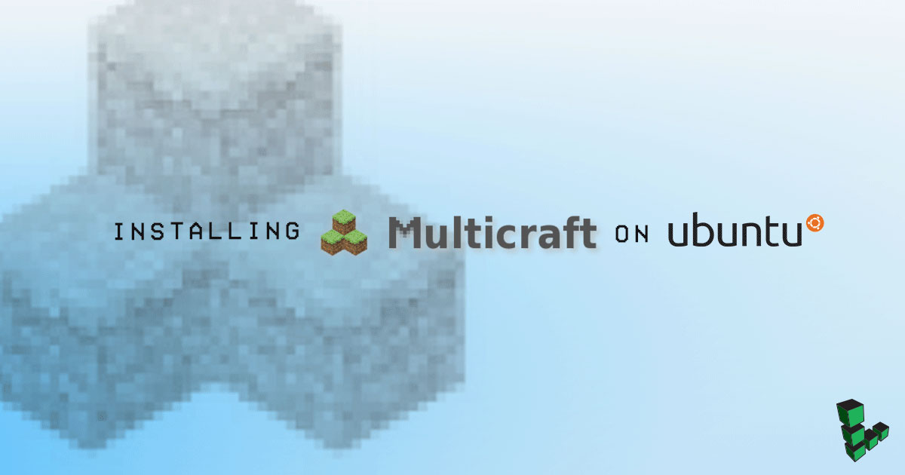
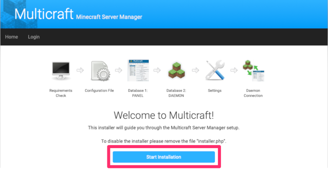
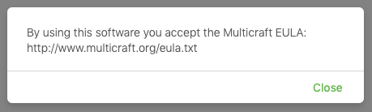

---
author:
  name: Alex Fornuto
  email: afornuto@linode.com
description: 'Installation of MultiCraft on a Linode running Debian or Ubuntu'
keywords: ["minecraft", "ubuntu", "multicraft"]
license: '[CC BY-ND 4.0](https://creativecommons.org/licenses/by-nd/4.0)'
external_resources:
 - '[Multicraft Documentation](http://www.multicraft.org/site/userguide?view=index)'
 - '[Minecraft.net](https://minecraft.net/)'
modified: 2015-02-04
modified_by:
  name: Alex Fornuto
published: 2015-02-04
title: 'Installing Multicraft on Ubuntu'
aliases: ['applications/game-servers/multicraft-on-ubuntu/']
dedicated_cpu_link: true
---

[Multicraft](http://www.multicraft.org/) is a control panel for single or multiple Minecraft servers, with free and paid versions available. This guide will help you install Multicraft on a Linode running Ubuntu 18.04 LTS.


The steps required in this guide require root privileges. Be sure to run the steps below as `root` or with the **sudo** prefix. For more information on privileges see our [Users and Groups](/docs/tools-reference/linux-users-and-groups/) guide.


## Prerequisites

Multicraft for Linux depends on several software packages in order to run.

1.  Update your system:

        apt-get update && sudo apt-get upgrade

1.  Install Apache2 and SQLite:

        apt-get install apache2 sqlite

1.  Install PHP, SQLite, and related packages:

        apt-get install php7.2 php7.2-sqlite php7.2-gd

1.  Install Java:

        apt-get install openjdk-8-jdk

1.  In Apache's configuration file, under the `<Directory /var/www/>` section, change the `AllowOverride` value to `all`.

    
<Directory /var/www/>
        Options Indexes FollowSymLinks
        AllowOverride All
        Require all granted
</Directory>



4.  Reload the Apache configuration:

        service apache2 reload

## Installing Multicraft

1.  Download the Multicraft installer:

        wget --content-disposition http://www.multicraft.org/download/index?arch=linux64

2.  Expand the installer:

        tar -xzf multicraft*.tar.gz

3.  Move to the `multicraft` directory:

        cd multicraft/

4.  Execute the `setup.sh` script:

        ./setup.sh

5.  This will launch an interactive script that will prompt you to configure several options. If you've purchased a license for Multicraft, enter it when prompted. If you're unsure of which options to choose, you can press `return` to select the default option, with a couple of exceptions:

    * Unless you're configuring a custom Apache virtual host for Multicraft, specify the location for the PHP frontend to `/var/www/html/multicraft`:

          Location of the PHP frontend: [/var/www/multicraft] /var/www/html/multicraft

    * Because of the insecure nature of FTP, we strongly recommend that you **not** enable the builtin FTP server when prompted:

          Enable builtin FTP server? [y]/n n

    Once this script finishes, you are ready to begin configuring your Multicraft install.

## Configuring the Control Panel

1.  In your local web browser, navigate to `http://12.34.56.78/multicraft/install.php`, replacing `12.34.56.78` with your Linode's IP address or domain name. Click on `Start Installation`:

    

2.  Multicraft will check your requirements. If you completed the steps above without issue, your page should reflect the results show below:

    

    Click `Continue`.

3.  Multicraft will attempt to copy the default `config.php` file into place. If successful, click `Continue`:

    

4.  On the next page, click on `Initialize Database`.

    

5.  Afterwards, click `Continue`:

    

6.  The next page will attempt to connect to the panel database. You should see the message `Connection successful`. You can now click on the `Login` button and sign in with the username and password `admin`.

    

7.  After logging in you will be directed back to the previous page, where you can now click on `Continue`. The next page will allow you to configure your basic settings. When done, click `Save`.

8.  On the daemon configuration page, you will find a start command to initiate the Multicraft Daemon. Copy the command into your terminal:

        /home/minecraft/multicraft/bin/multicraft -v start
        Multicraft 2.3.1 - Minecraft Server Manager Daemon
        Loading configuration from /home/minecraft/multicraft/multicraft.conf
        Starting daemon

9.  Back in your browser, click on `Refresh`. You should see the daemon in the detected daemons list. Click `Continue`:

    

10.  Your configuration of the Multicraft control panel is now complete. As per the instructions on the page, delete the `install.php` file from your terminal:

        rm /var/www/html/multicraft/install.php

## Install Minecraft

1.  Navigate to the directory where Multicraft stores `jar` files. If you used the default options, it will be `/home/minecraft/multicraft/jar/`:

        cd /home/minecraft/multicraft/jar/

1.  Download the latest version of the Minecraft server (1.14.2 at the time of this publication) from the Minecraft [Download](https://minecraft.net/download) page:

        wget https://launcher.mojang.com/v1/objects/808be3869e2ca6b62378f9f4b33c946621620019/server.jar

1.  In your local web browser, navigate to `http://12.34.56.78/multicraft/`, replacing `12.34.56.78` with your Linode's IP address or domain name. Click on `Servers`.

1.  At this time you must accept the Multicraft EULA. A pop-up window will appear. By clicking Close you are indicating your agreement to the EULA here: `http://www.multicraft.org/eula.txt`. Click Close.

       

1.  Click `Create Server`. Fill in the options as you see fit, but be sure to add `server.jar` (or your downloaded version) in the `JAR File` field:

    

    You can now successfully start and manage your Minecraft server through Multicraft! For instructions on connecting to your Minecraft server, click [here](/docs/game-servers/how-to-set-up-minecraft-server-on-ubuntu-or-debian/#connect-to-your-minecraft-server).
