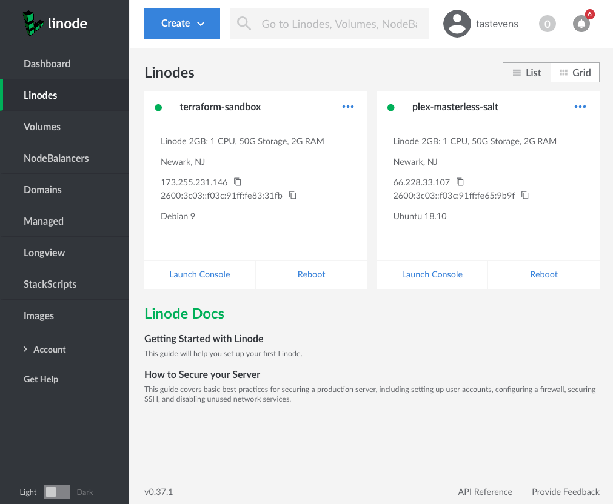
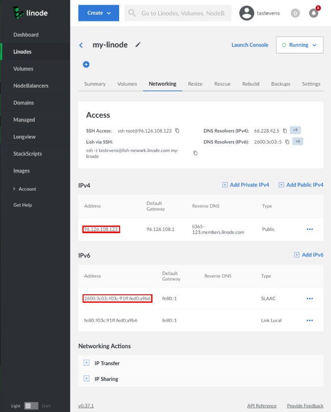
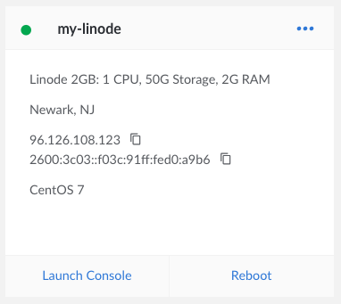
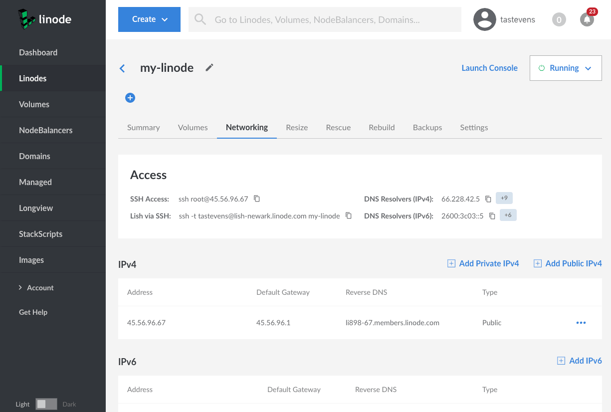

---
author:
  name: Linode
  email: docs@linode.com
keywords: ["getting started", "intro", "basics", "first steps"]
description: 'This guide will help you set up your first Linode.'
og_description: "Learn how to create an account, boot your first Linode, and connect via SSH with our Getting Started guide."
license: '[CC BY-ND 4.0](https://creativecommons.org/licenses/by-nd/4.0)'
modified: 2018-11-05
modified_by:
  name: Linode
published: 2018-11-05
title: Getting Started with Linode
show_on_frontpage: false
title_short: "Getting Started"
type: "guide"
weight: 10
icon: "book"
show_on_rss_feed: false
hiddenguide: true
---

## Welcome to Linode!

Thank you for choosing Linode as your cloud hosting provider! This guide will help you sign up for an account, set up a Linux distribution, boot your Linode, and perform some basic system administration tasks.

If you've already created an account and booted your Linode, skip ahead to [Connect to Your Linode via SSH](#connect-to-your-linode-via-ssh).

<!-- removing the video for now to test if gifs are more helpful

<iframe src="//fast.wistia.net/embed/iframe/35724r19mr?videoFoam=true" allowtransparency="true" frameborder="0" scrolling="no" class="wistia_embed" name="wistia_embed" allowfullscreen mozallowfullscreen webkitallowfullscreen oallowfullscreen msallowfullscreen width="100%" height="100%"></iframe>

-->

## Sign Up

If you haven't already signed up for a Linode account, start here.

1.  Create a new account at the [Sign Up page](https://manager.linode.com/signup).
2.  Sign in and enter your billing and account information. Most accounts are activated instantly, but some require manual review prior to activation. If your account is not immediately activated, you will receive an email with additional instructions.

## Log In to the Linode Manager

The [Linode Manager](https://cloud.linode.com) is a web-based control panel that allows you to manage your Linode virtual servers and services. Log in with the username and password you created when you signed up. After you've created your first Linode, you can use the Linode Manager to:

* Boot and shut down your virtual server,
* Access monitoring statistics,
* Update your [billing and account information](/docs/platform/manager/accounts-and-passwords/),
* Request support and perform other administrative tasks.

## Create a Linode

1.  At the top of the page, click **Create** and select *Linode*.

1.  Select the Image you would like to use. You can choose a standard Linux image from the list, or you can select a previously created image from the 'My Images' tab.

1.  Select the Region, or data center, where you would like your Linode to reside.

    If you're not sure which data center to select, use our [speed test](http://www.linode.com/speedtest) to determine which location provides the best performance for your target audience. You can also generate [MTR reports](/docs/networking/diagnostics/diagnosing-network-issues-with-mtr/) for each of the data centers to determine which of our facilities provides the best latency from your particular location.

1.  Create a label for your Linode.

1.  Create a strong password for your Linode. You will use this password to SSH into your Linode.

1.  Click **Create**. You will be directed back to the *Linodes* page where you can watch the status of your Linode as it boots up.


Use a [StackScript](http://www.linode.com/stackscripts) to quickly deploy software platforms and system configuration options to your Linux distribution. Some of the most popular StackScripts do things like install the Apache web server, configure a firewall, and set up the WordPress content management system.


## Connect to Your Linode via SSH

Communicating with your Linode is usually done using the secure shell (SSH) protocol. SSH encrypts all of the data transferred between the SSH client application on your computer and the Linode, including passwords and other sensitive information. There are SSH clients available for every operating system.

### SSH Overview

-   **Linux:** You can use a terminal window, regardless of desktop environment or window manager.
-   **Mac:** The *Terminal* application comes pre-installed with OS X and can be launched from *Applications* > *Utilities*.<!--- You could also use the free [iTerm 2 application](http://www.iterm2.com/). For a walk-through of connecting to your Linode for the first time **with OS X** (which also directly applies to Linux), see the following video: --->

  <!---  <iframe width="560" height="315" src="https://www.youtube.com/embed/VVs9Ed-HkjE" frameborder="0" allowfullscreen></iframe> -->

-   **Windows:** There is no native SSH client, but you can use a free, open source application called [PuTTY](/docs/networking/ssh/ssh-connections-using-putty-on-windows/). <!--- For a walkthrough of connecting to your Linode in Windows using PuTTY, see the following video: --->

<!---    <iframe width="560" height="315" src="https://www.youtube.com/embed/eEsCD7n17mk" frameborder="0" allowfullscreen></iframe> --->

### Find your Linode's IP Address

Your Linode has a unique **IP address** that identifies it to other devices and users on the internet.

Find your Linode's IP address from the [Linode Manager](https://cloud.linode.com).

1.  Click the **Linodes** link in the left hand navigation.

1.  Find your Linode, and click on it's name.

1.  Your IPv4 and IPv6 addresses appear under the IPv4 and IPv6 sections.

    

You can also quickly reference your Linode's IP address from the **Linodes** page:

### Log In

Once you have the IP address and an SSH client, you can log in via SSH. The following instructions are written for Linux and Mac OS X. If you're using PuTTY as your SSH client in Windows, follow [these instructions](/docs/networking/ssh/ssh-connections-using-putty-on-windows/).

1.  Enter the following into your terminal window or application. Replace the example IP address with your Linode's IP address:

        ssh root@198.51.100.4

2.  If this is the first time connecting to your Linode, you'll see the authenticity warning below. This is because your SSH client has never encountered the server's key fingerprint before. Type `yes` and press **Enter** to continue connecting.

    
The authenticity of host '198.51.100.4 (198.51.100.4)' can't be established.
RSA key fingerprint is 11:eb:57:f3:a5:c3:e0:77:47:c4:15:3a:3c:df:6c:d2.
Are you sure you want to continue connecting (yes/no)?


    After you enter `yes`, the client confirms the addition:

    
Warning: Permanently added '198.51.100.4' (RSA) to the list of known hosts.


3.  The login prompt appears for you to enter the password you created for the `root` user above.

    
root@198.51.100.4's password:


4.  The SSH client initiates the connection. When the connection is completed the following prompt appears:

    
root@li123-456:~#


    
If you recently rebuilt an existing Linode, you might receive an error message when you try to
reconnect via SSH. SSH clients try to match the remote host with the known keys on your desktop computer, so when you rebuild your Linode, the remote host key changes.

To reconnect via SSH, revoke the key for that IP address.

For Linux and Mac OS X:

    ssh-keygen -R 198.51.100.4

For Windows, PuTTY users must remove the old host IP addresses manually. PuTTY's known hosts are in the registry entry:

    HKEY_CURRENT_USER\Software\SimonTatham\PuTTY\SshHostKeys


## Install Software Updates

The first thing you should do after connecting to your Linode is update the Linux distribution's software. This applies the latest security patches and bug fixes to help protect your Linode against unauthorized access.

Installing software updates should be performed regularly.

### Ubuntu / Debian

    apt-get update && apt-get upgrade


Ubuntu may prompt you when the Grub package is updated. If prompted, select `keep the local version currently installed`.


### CentOS

    yum update

### Fedora

    dnf upgrade

### Arch Linux

    pacman -Syu

### Gentoo

    emaint sync -a

After running a sync, it may end with a message that you should upgrade Portage using a `--oneshot` emerge command. If so, run the Portage update. Then update the rest of the system:

    emerge --uDN @world

### Slackware

    slackpkg update
    slackpkg upgrade-all

## Set the Hostname

A hostname is used to identify your device in an easy-to-remember format. The hostname is stored in the `/etc/hostname` file. Your system's hostname should be something unique. Some people name their servers after planets, philosophers, or animals. Note that the hostname has no relationship to websites or email services hosted on it, aside from providing a name for the system itself. Your hostname should *not* be "www" or anything too generic. If you want to assign your system a fully qualified domain name, see our guide on using your system's [hosts file](/docs/networking/dns/using-your-systems-hosts-file/).

Once you're done, you can verify by running the command `hostname`.

### Arch / CentOS 7 / Debian 8 / Fedora / Ubuntu 16.04 and above

Replace `example_hostname` with one of your choice.

    hostnamectl set-hostname example_hostname

### Debian 7 / Slackware / Ubuntu 14.04

Replace `example_hostname` with one of your choice.

    echo "example_hostname" > /etc/hostname
    hostname -F /etc/hostname

### CentOS 6

Replace `hostname` with one of your choice.

    echo "HOSTNAME=example_hostname" >> /etc/sysconfig/network
    hostname "hostname"

### Gentoo

Enter the following commands to set the hostname, replacing `example_hostname` with the hostname of your choice:

    echo "HOSTNAME=\"example_hostname\"" > /etc/conf.d/hostname
    /etc/init.d/hostname restart

### Update /etc/hosts

The `hosts` file, located at `/etc/hosts`, creates static associations between IP addresses and hostnames, with higher priority than DNS. Open this file in a text editor and add a line for your Linode's public IP address. You can associate this address with your Linode's **Fully Qualified Domain Name** (FQDN) if you have one, and with the local hostname you set in the steps above. In the example below, `203.0.113.10` is the public IP address, `hostname` is the local hostname, and `hostname.example.com` is the FQDN.

  
127.0.0.1 localhost.localdomain localhost
203.0.113.10 hostname.example.com hostname


If you have IPv6 enabled on your Linode, you may also want to add an entry for your IPv6 address:

  
127.0.0.1 localhost.localdomain localhost
203.0.113.10 hostname.example.com hostname
2600:3c01::a123:b456:c789:d012 hostname.example.com hostname


The value you assign as your system's FQDN should have an "A" record in DNS pointing to your Linode's IPv4 address. For Linodes with IPv6 enabled, you should also set up an "AAAA" record in DNS pointing to your Linode's IPv6 address. For more information on configuring DNS, see [Adding DNS Records](/docs/websites/hosting-a-website/#add-dns-records).

For more information about the `hosts` file and how to configure it, see [Using your System's hosts File](/docs/networking/dns/using-your-systems-hosts-file/)

## Set the Timezone

By default, your Linode will be set to UTC time. You may want to change this to the timezone you live in, or where a majority of your users live, to make log file timestamps more sensible.

### Debian / Ubuntu

    dpkg-reconfigure tzdata

### Arch Linux / CentOS 7 / Fedora

1.  View a list of available time zones:

        timedatectl list-timezones

2.  Use the `Up`, `Down`, `Page Up` and `Page Down` keys to navigate. Find the time zone you want. Remember it, write it down, or copy it as a mouse selection. Then press **q** to exit the list.

3.  Set the time zone:

        timedatectl set-timezone 'America/New_York'

### Gentoo

1.  View a list of available time zones:

        ls /usr/share/zoneinfo

2.  Write the selected time zone to the `/etc/timezone` file:

        echo "EST" > /etc/timezone

3.  Configure the `sys-libs/timezone-data` package, which will set `/etc/localtime` appropriately:

        emerge --config sys-libs/timezone-data

### Check the Time

View the current date and time according to your server.

    date

  
Thu Feb 16 12:17:52 EST 2018


## Next Steps

Now that you have an up-to-date Linode, secure your server and your Linode Manager from unauthorized access. Read the [Securing Your Server](/docs/security/securing-your-server/) guide and the [Linode Manager Security Controls](/docs/security/linode-manager-security-controls/) guide to get you going. Make sure you follow Linode system status and maintenance updates by visiting the [Linode Status page](https://status.linode.com/) and by [subscribing to Linode status updates](/docs/platform/linode-status-page/).
