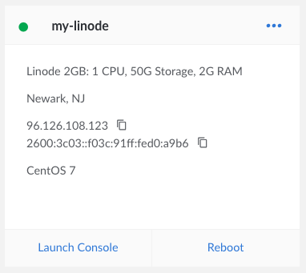
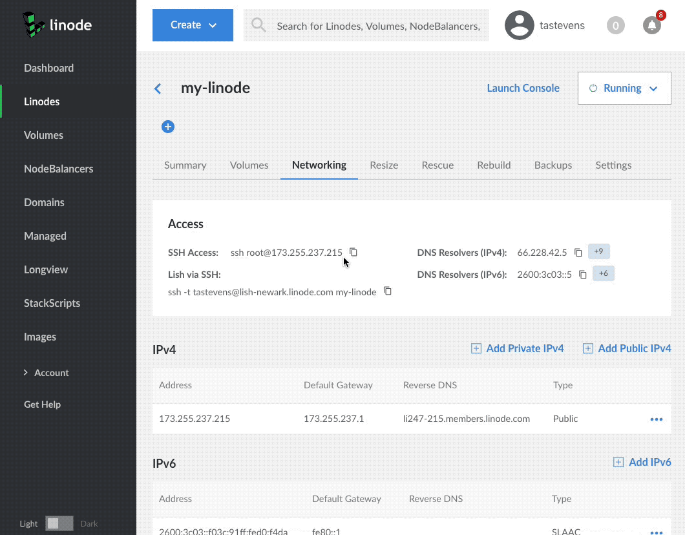

---
author:
  name: Linode
  email: docs@linode.com
keywords: ["getting started", "intro", "basics", "first steps"]
description: 'This guide will help you set up your first Linode.'
og_description: "Learn how to create an account, boot your first Linode, and connect via SSH with our Getting Started guide."
license: '[CC BY-ND 4.0](https://creativecommons.org/licenses/by-nd/4.0)'
aliases: ['getting-started-new-manager/']
modified: 2019-03-08
modified_by:
  name: Linode
published: 2018-11-05
title: Getting Started with Linode
show_on_frontpage: true
title_short: "Getting Started"
type: "guide"
weight: 10
icon: "book"
show_on_rss_feed: false
classic_manager_link: getting-started-classic-manager/
---

## Welcome to Linode!

Thank you for choosing Linode as your cloud hosting provider! This guide will help you sign up for an account and access Linode's [Cloud Manager](https://cloud.linode.com), a browser-based control panel which allows you to manage your Linode virtual servers and services.

From there you'll set up a Linux distribution, boot your Linode, and perform some basic system administration tasks. If you've already created an account and booted your Linode, skip ahead to [connecting to your Linode](#connect-to-your-linode-via-ssh) using SSH.

<!-- removing the video for now to test if gifs are more helpful

<iframe src="//fast.wistia.net/embed/iframe/35724r19mr?videoFoam=true" allowtransparency="true" frameborder="0" scrolling="no" class="wistia_embed" name="wistia_embed" allowfullscreen mozallowfullscreen webkitallowfullscreen oallowfullscreen msallowfullscreen width="100%" height="100%"></iframe>

-->

## Sign Up

If you haven't already signed up for a Linode account, start here.

1.  Create a new account at the [Sign Up page](https://login.linode.com/signup).

1.  Sign in and enter your billing and account information. Most accounts are activated instantly, but some require manual review prior to activation. If your account is not immediately activated, you will receive an email with additional instructions.

## Create a Linode

1.  Log in to the [Cloud Manager](https://cloud.linode.com) with the username and password you created when signing up.

1.  At the top of the page, click **Create** and select **Linode**.

1.  Select the [Distribution](/docs/quick-answers/linux/choosing-a-distribution/), [One Click App](/docs/platform/one-click/how-to-use-one-click-apps-at-linode/), or [Image](/docs/platform/disk-images/linode-images/) you would like to use.

    
Use a [StackScript](http://www.linode.com/stackscripts) to quickly deploy software platforms and system configuration options to your Linux distribution. Some of the most popular StackScripts do things like install a LAMP stack, VPN, or WordPress. You can read more about Stackscripts and how they work in our [Automating Deployments with Stackscripts Guide.](/docs/platform/stackscripts/)


1.  Choose the region where you would like your Linode to reside. If you're not sure which to select, see our [How to Choose a Data Center](/docs/platform/how-to-choose-a-data-center) guide. You can also generate [MTR reports](/docs/networking/diagnostics/diagnosing-network-issues-with-mtr/) for a deeper look at the route path between you and a data center in each specific region.

1. Select a Linode plan.

1.  Give your Linode a label. This is a name to help you easily identify it within the Cloud Manager's Dashboard. If desired, assign a tag to the Linode in the **Add Tags** field.

1. Create a root password for your Linode in the **Root Password** field. This password must be provided when you log in to your Linode via SSH. It must be at least 6 characters long and contain characters from two of the following categories:

    - lowercase and uppercase case letters
    - numbers
    - punctuation characters

1.  Click **Create**. You will be directed back to the *Linodes* page which will report the status of your Linode as it boots up. You can now use the Cloud Manager to:

    * Boot and shut down your Linode
    * Access monitoring statistics
    * Update your [billing](/docs/platform/billing-and-support/billing-and-payments-new-manager/) and [account](/docs/platform/manager/accounts-and-passwords-new-manager/) information
    * Add additional Linode services, like [Block Storage](/docs/platform/block-storage/how-to-use-block-storage-with-your-linode-new-manager/)
    * Open a [support](/docs/platform/billing-and-support/support-new-manager/) ticket and perform other administrative tasks

1.  Be sure to bookmark the [Linode Status page](https://status.linode.com/) or [subscribe](/docs/platform/linode-status-page/) to our system status updates by email.

## Connect to Your Linode via SSH

Communicating with your Linode is usually done using the secure shell (SSH) protocol. SSH encrypts all of the data transferred between the client application on your computer and the Linode, including passwords and other sensitive information. There are SSH clients available for every operating system.

* **Linux:** You can use a terminal window, regardless of desktop environment or window manager.
* **macOS:** *Terminal.app* comes pre-installed and can be launched from Spotlight or Launchpad.<!--- You could also use the free [iTerm 2 application](http://www.iterm2.com/). For a walk-through of connecting to your Linode for the first time **with OS X** (which also directly applies to Linux), see the following video: --->

  <!---  <iframe width="560" height="315" src="https://www.youtube.com/embed/VVs9Ed-HkjE" frameborder="0" allowfullscreen></iframe> -->

* **Windows:** There is no native SSH client but you can use a free and open source application called [PuTTY](/docs/networking/ssh/ssh-connections-using-putty-on-windows/). <!--- For a walkthrough of connecting to your Linode in Windows using PuTTY, see the following video: --->

<!---    <iframe width="560" height="315" src="https://www.youtube.com/embed/eEsCD7n17mk" frameborder="0" allowfullscreen></iframe> --->

### Find your Linode's IP Address

Your Linode has a unique IP address that identifies it to other devices and users on the internet.

1.  Click the **Linodes** menu item in the [Cloud Manager's](https://cloud.linode.com/) left hand navigation.

1.  Find your Linode, click on it's name and navigate to *Networking*.

1.  Your IPv4 and IPv6 addresses appear under the *IPv4* and *IPv6* sections.

    

    You can also quickly reference your Linode's IP addresses from the **Linodes** page:

    

### Log in Using SSH

Once you have the IP address and an SSH client, you can log in via SSH. The following instructions are written for Linux and macOS. If you're using PuTTY on Windows, follow [these instructions](/docs/networking/ssh/ssh-connections-using-putty-on-windows/).

1.  Enter the following into your terminal window or application. Replace the example IP address with your Linode's IP address:

        ssh root@198.51.100.4

1.  If this is the first time connecting to your Linode, you'll see the authenticity warning below. This is because your SSH client has never encountered the server's key fingerprint before. Type `yes` and press **Enter** to continue connecting.

    
The authenticity of host '198.51.100.4 (198.51.100.4)' can't be established.
RSA key fingerprint is 11:eb:57:f3:a5:c3:e0:77:47:c4:15:3a:3c:df:6c:d2.
Are you sure you want to continue connecting (yes/no)?


    After you enter `yes`, the client confirms the addition:

    
Warning: Permanently added '198.51.100.4' (RSA) to the list of known hosts.


1.  The login prompt appears for you to enter the password you created for the `root` user above.

    
root@198.51.100.4's password:


1.  The SSH client initiates the connection and then the following prompt appears:

    
root@li123-456:~#


    
If you recently rebuilt an existing Linode, you might receive an error message when you try to
reconnect via SSH. SSH clients try to match the remote host with the known keys on your desktop computer, so when you rebuild your Linode, the remote host key changes.

To reconnect via SSH, revoke the key for that IP address.

For Linux and macOS:

    ssh-keygen -R 198.51.100.4

For Windows, PuTTY users must remove the old host IP addresses manually. PuTTY's known hosts are in the registry entry:

    HKEY_CURRENT_USER\Software\SimonTatham\PuTTY\SshHostKeys


## Install Software Updates

The first thing you should do after connecting to your Linode is update the Linux distribution's packages. This applies the latest security patches and bug fixes to help protect your Linode against unauthorized access. Installing software updates should be performed regularly.

### Arch Linux

    pacman -Syu

### CentOS

    yum update

### Debian / Ubuntu

    apt-get update && apt-get upgrade


You may be prompted to make a menu selection when the Grub package is updated on Ubuntu. If prompted, select `keep the local version currently installed`.


### Fedora

    dnf upgrade

### Gentoo

    emaint sync -a

After running a sync, it may end with a message that you should upgrade Portage using a `--oneshot` emerge command. If so, run the Portage update. Then update the rest of the system:

    emerge -uDU --keep-going --with-bdeps=y @world

### OpenSUSE

    zypper update

### Slackware

    slackpkg update
    slackpkg upgrade-all

## Set the Hostname

A hostname is used to identify your Linode using an easy-to-remember name. Your Linode's hostname doesn't necessarily associate with websites or email services hosted on the system, but see our guide on using the [hosts file](/docs/networking/dns/using-your-systems-hosts-file/) if you want to assign your Linode a fully qualified domain name.

 Your hostname should be something unique, and should not be *www* or anything too generic. Some people name their servers after planets, philosophers, or animals. After you've made the change below, you'll need to log out and back in again to see the terminal prompt change from `localhost` to your new hostname. The command `hostname` should also show it correctly.

### Arch / CentOS 7 / Debian 8 / Fedora / Ubuntu 16.04 and above

Replace `example_hostname` with one of your choice.

    hostnamectl set-hostname example_hostname

### CentOS 6

Replace `hostname` with one of your choice.

    echo "HOSTNAME=example_hostname" >> /etc/sysconfig/network
    hostname "hostname"

### Debian 7 / Slackware / Ubuntu 14.04

Replace `example_hostname` with one of your choice.

    echo "example_hostname" > /etc/hostname
    hostname -F /etc/hostname

### Gentoo

Enter the following commands to set the hostname, replacing `example_hostname` with the hostname of your choice:

    echo "HOSTNAME=\"example_hostname\"" > /etc/conf.d/hostname
    /etc/init.d/hostname restart

### OpenSUSE

Replace `example-hostname` with one of your choice.

    hostname example-hostname

### Update Your System's hosts File

The `hosts` file creates static associations between IP addresses and hostnames or domains which the system prioritizes before DNS for name resolution. Open this file in a text editor and add a line for your Linode's public IP address. You can associate this address with your Linode's **Fully Qualified Domain Name** (FQDN) if you have one, and with the local hostname you set in the steps above. In the example below, `203.0.113.10` is the public IP address, `hostname` is the local hostname, and `hostname.example.com` is the FQDN.

  
127.0.0.1 localhost.localdomain localhost
203.0.113.10 hostname.example.com hostname


Add an entry for your Linode's IPv6 address. Applications requiring IPv6 will not work without this entry:

  
127.0.0.1 localhost.localdomain localhost
203.0.113.10 hostname.example.com hostname
2600:3c01::a123:b456:c789:d012 hostname.example.com hostname


The value you assign as your system's FQDN should have an "A" record in DNS pointing to your Linode's IPv4 address. For IPv6, you should also set up a DNS "AAAA" record pointing to your Linode's IPv6 address.

See our guide to [Adding DNS Records](/docs/websites/hosting-a-website/#add-dns-records) for more information on configuring DNS. For more information about the `hosts` file, see [Using your System's hosts File](/docs/networking/dns/using-your-systems-hosts-file/)

## Set the Timezone

All new Linodes will be set to UTC time by default. However, you may prefer your Linode use the time zone which you live in so log file timestamps are relative to your local time.

### Arch Linux / CentOS 7 / Fedora

1.  View all available time zones:

        timedatectl list-timezones

1.  Use the `Up`, `Down`, `Page Up` and `Page Down` keys to navigate. Copy the time zone you want as a mouse selection. Then press **q** to exit the list.

1.  Set the time zone (for example, `America/New_York`):

        timedatectl set-timezone 'America/New_York'

### Debian / Ubuntu

1.  Though newer versions of Debian and Ubuntu use systemd with `timedatectl`, the recommended method to change timezones for these distributions is to use `tzdata`. It can be called using `dpkg`:

        dpkg-reconfigure tzdata

1.  Arrow up or down to the continent of your choice and press **Enter**. Then do the same for the region.

### Gentoo

1.  View a list of available time zones:

        ls /usr/share/zoneinfo

1.  Write the selected time zone to `/etc/timezone` (for example, EST for Eastern Standard Time):

        echo "EST" > /etc/timezone

1.  Configure the `sys-libs/timezone-data` package, which will set `/etc/localtime` appropriately:

        emerge --config sys-libs/timezone-data

### OpenSUSE

1. View a list of available time zones:

        yast2 timezone

1.  Arrow up or down to the *Region* of your choice and press **Enter**.

1. Press **Option+Z** (on a macOS) or **ALT+Z** (on Windows/Linux) to select the *Time Zone*.

1. Use arrow up or down to move through the list of time zones. Press **Enter** to make your selection.

1. Press **F10** when done.

### Slackware

1.  Call the `timeconfig` tool in a terminal:

        timeconfig

1.  Select `NO Hardware clock is set to local time`.
1.  Select a timezone.

### Check the Time

Use the `date` command to view the current date and time according to your server.


root@localhost:~# date
Thu Feb 16 12:17:52 EST 2018


## Next Steps

Now that you've learned the basics of using the Cloud Manager and working with your Linode, secure it and your Linode account from unauthorized access. See the following guides to begin:

* [Securing Your Server](/docs/security/securing-your-server/)
* [Linode Manager Security Controls](/docs/security/linode-manager-security-controls-new-manager/)
