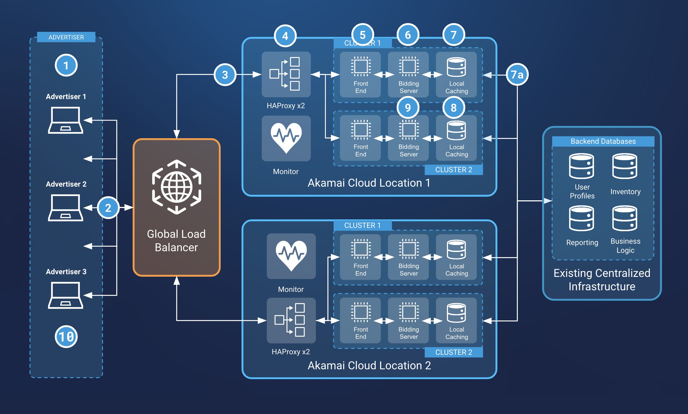

Advertisers (and ad agencies) utilize demand-side platforms (DSPs) to engage in programmatic ad-buying. DSPs enable advertisers to configure their ad campaigns and place bids for ad inventory (ad space on a publisher’s website). As the volume of bids from advertisers and ad inventory from publishers increases, so does the complexity for processing bids and matching them to the available inventory.

DSPs require performant and scalable cloud infrastructure to handle processing ad campaigns and submitting bids. In addition, latency within this infrastructure needs to be decreased at every step. Lower latency enables the ad to quickly load alongside the publisher's web page.

This guide covers a DSP solution that decentralizes key infrastructure components, including the frontend servers and real-time bidding (RTB) servers. Moving this infrastructure closer to users, coupled with adding a robust caching system for ad inventory and user profiles, addresses the main challenges for ad serving, including low latency requirements and reduced egress fees.

## Overcoming Challenges

Like almost any specialized production workload, a distributed demand-side platform requires unique infrastructure considerations. Listed below are several challenges, each of which can be mitigated or minimized through thoughtfully designed architecture.

### Latency Sensitivity

*Identify sources of high latency and minimize the latency impact of those components.*

Ad serving requires significantly lower latency compared with many other systems. An ad needs to be selected for - and displayed to - the end-user as quickly as possible. Even small increases to latency can have large negative impacts to customer SLAs and end-user conversion rates. In many cases, a centralized ad serving infrastructure is the primary cause of high latency, though you should identify any other components in your existing system that may also be contributing to high latency.

The distributed nature of this solution brings key components closer to the end-user, reducing latency compared to more traditional, centralized systems. In addition, failover is provided for each region and occurs quickly to reduce downtime and minimize impact to latency.

### Cost sensitivity (low profit margins)

*Identify significant sources of infrastructure costs and determine ways to reduce those costs.*

Due to the relatively small profit margins in the ad serving space, cloud infrastructure costs directly impact profitability. Reducing cloud costs plays a critical role in infrastructure planning.

One major source of infrastructure costs is egress fees. By hosting a distributed ad serving system on Akamai’s Cloud Computing platform, egress costs can be eliminated or significantly reduced compared to hyperscalers. The solution in this guide led to a 40% reduction in costs for one profiled customer.

Another cause of increased cloud costs and egress fees is a high amount of traffic. Decentralizing some components but not others can increase cross-region traffic when the distributed infrastructure is communicating with the centralized infrastructure. To limit egress fees associated with this traffic, a caching system should be implemented on the distributed systems. Using this method, local instances sync critical data (like ad inventory and bids) to reduce network traffic to the centralized cloud. Also, because of Akamai’s global network and relationship with other hyperscalers, egress costs when transferring data stored centrally on another hyperscaler is also eliminated or reduced.

### Integration and Migration Effort

*Consider the amount of effort that infrastructure changes will create and design an architecture that reduces the effort wherever possible.*

When re-architecting an application, the amount of effort in designing and integrating the new systems --- as well as migrating to another provider --- can pose significant challenges. The solution in this guide requires moving only a part of the ad serving workflow to the Akamai platform, which means that many centralized components do not need to be migrated. The ad inventory system of record remains unchanged, as do other key databases. The amount of effort is greatly reduced compared to other possible solutions.

## Infrastructure Design Diagram

The diagram below showcases the infrastructure components that enable a multi-region DSP on Akamai cloud computing, while retaining existing centralized data systems. This includes components for routing requests to the region closest to the end-user (the advertisers and ad agencies), load balancing requests between multiple backend systems, caching a copy of any centralized data, and monitoring infrastructure for downtime.

1.  The clients (advertisers) interact with the DSP in order to configure campaigns and bid on inventory.

1.  The advertiser submits a bid for their ad to be displayed to an end-user. This takes the form of an HTTPS API request.

1.  The request is routed to one of multiple compute regions (data centers). Since this is a distributed application, the request is routed through an intelligent DNS-based load balancing solution, such as Akamai [Global Traffic Manager (GTM)](https://www.akamai.com/products/global-traffic-management). The global load balancer determines which region can best serve the client's request. This takes into account location, performance, and availability. A load balancing solution like this is an ideal way to reduce latency (improves ad display speed) and increase resilience (one failure doesn’t affect all the capacity).

1.  Local load balancers, such as a Compute Instance running HAProxy, route the request to one of several backend clusters. Multiple clusters are often used within a single region for redundancy and scaling. Orchestration platforms, such as [LKE](https://www.linode.com/products/kubernetes/), can be used to manage cluster infrastructure and operation.

1.  The frontend API gateway starts processing the request. These systems operate in front of the bidding servers to reduce egress and bid processing costs. These frontend servers are typically capable of applying business logic for communicating with ad-exchanges as well as bidding servers and any other microservices on the cluster.

1.  The frontend gateway sends the bid request to the bidding servers. During this bidding process, the bid is matched with local ad inventory and compared against other advertisers using the DSP’s platform.

1.  When processing the bid, a local caching server is queried. This cache includes data from any centralized infrastructure, such as databases for ad inventory, user profiles, and more. This eliminates the delay associated with querying the centralized system of record on every single request.

    1.  The local cache is updated periodically. Data within the cache is refreshed to ensure the most up-to-date information is used.

1.  Information from the local cache is sent back to the bidding servers.

1.  The bid is processed by the bidding server. Here, it is determined if the bid is accepted (and will be delivered to ad exchanges or publishers) or rejected.

1.  The DSP notifies the advertiser of the results of the bid by updating the web interface.

## Systems and Components

-   **Global load balancer.** Akamai [Global Traffic Manager (GTM)](https://www.akamai.com/products/global-traffic-management) can be used to route incoming requests to the region closest to the end-user.

-   **Local load balancer.** Within each region, a load balancer is used to balance traffic between multiple backend clusters. This load balancer should be redundant and should gracefully failover to a secondary load balancer to prevent downtime. Possible load balancing solutions include [NodeBalancers](https://www.linode.com/products/nodebalancers/), NGINX, and HAProxy.

-   **DSP ad serving cluster.** The ad serving clusters run on a container orchestration platform like [LKE](https://www.linode.com/products/kubernetes/) and are composed of multiple [Compute Instances](https://www.linode.com/products/dedicated-cpu/), with each running one or more of the specified components listed below. Multiple clusters should be used within each region to maintain redundancy and enable high-availability.

    - **Frontend API Gateway.** This gateway proxies all API requests for other ad-related APIs hosted on the cluster. Possible API gateways include Kong, NGINX, Tyk, and Gravitee.

    - **Real-time bidding server.** Hosts all logic that determines which bids are accepted or rejected. It is accessible by an API and requests will only come from the API gateway in that cluster.

    - **Caching system.** Each cluster should include a local cache of any critical centralized ad-related databases, such as ad inventory and possibly user profiles. Possible local caching systems include Redis, Apache Ignite, Memcached, and Couchbase.

-   **Monitoring system.** To monitor the state of the load balancers and clusters in that region, a monitoring and/or logging system should be configured. Possible monitoring solutions include Prometheus, Grafana, and ThousandEyes.