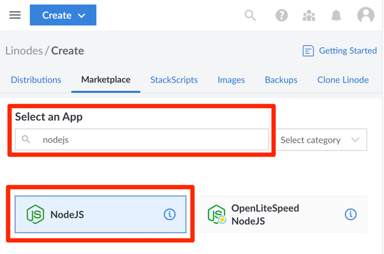
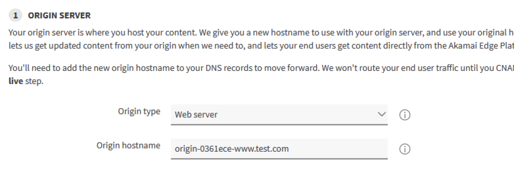
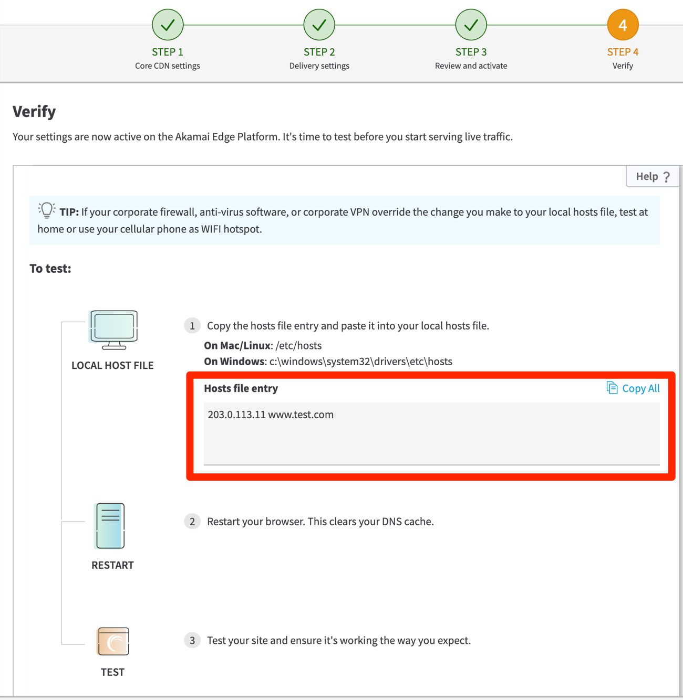
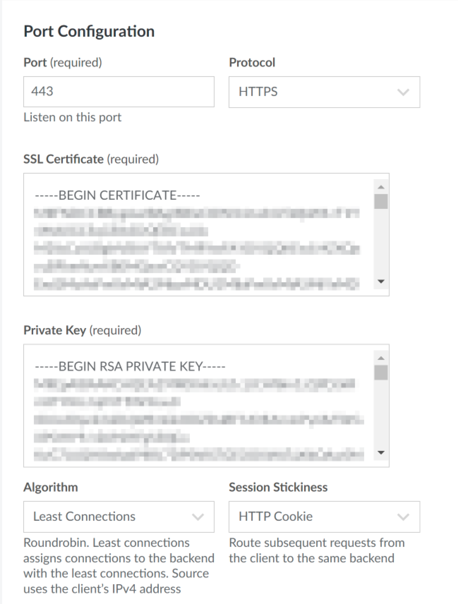
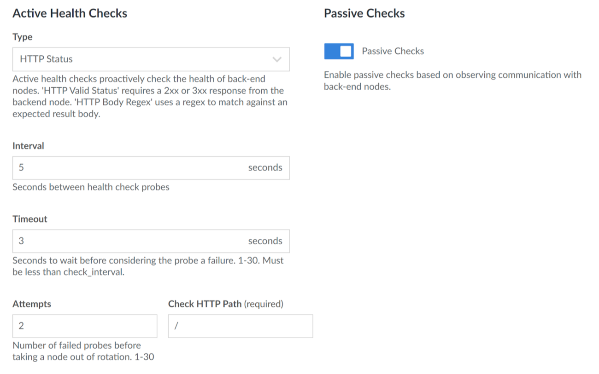
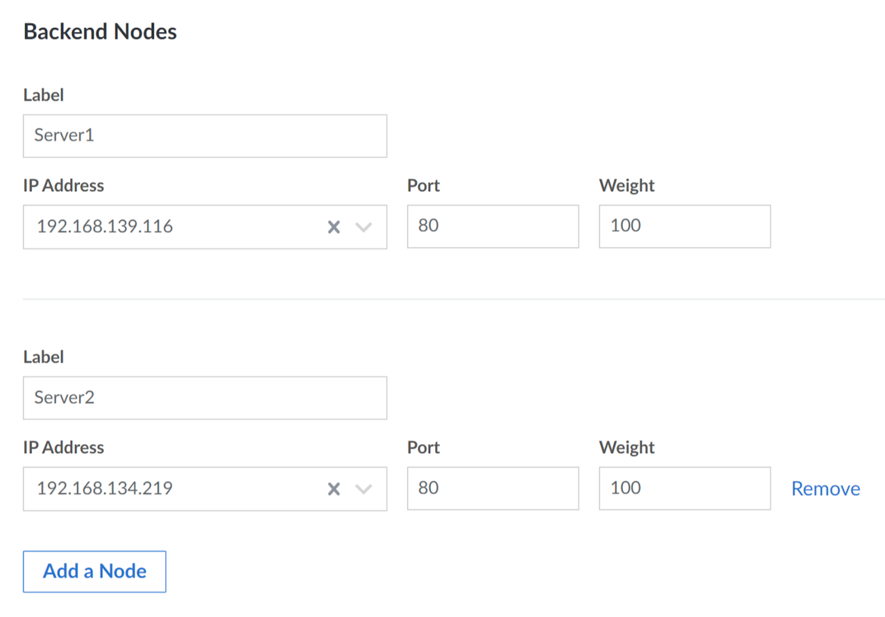
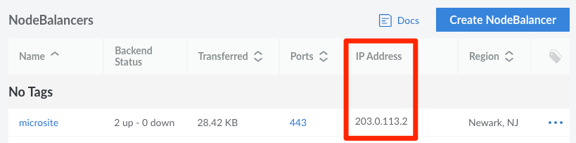
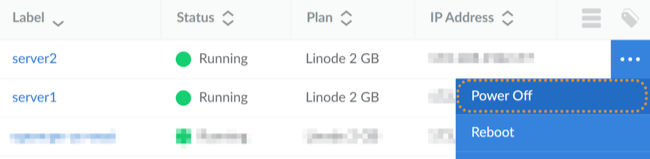

This use case combines Linode's and Akamai's capabilities to create a complete end-to-end solution for a simple microsite. To build this application we'll use Linode origin servers and an Akamai delivery product.

Akamai cloud computing based on Linode provides you with these benefits when creating a microsite:

* Simple and well-documented UI, CLI, and API provisioning capabilities.
* A clear pricing model that lets you estimate the cost for your compute needs.
* The simplicity of Linode combined with the scale of the Akamai CDN.

## Architecture Overview

## Prerequisites

This use case is for existing Akamai customers that want to learn how to use cloud computing based on Linode when building applications.

### Linode Account

Before you start, make sure you have access to a [Linode Cloud Manager account](https://login.linode.com/login), either through your existing account or via a trial login. You can also [sign up for a new account](https://login.linode.com/signup).


Talk to your account representative or simply try the free credit available at the top of this guide.


If you're new to Linode, watch this video to help you get started.



### Entitlement for Ion

You also need access to an **Akamai account** with entitlement for [Ion](https://techdocs.akamai.com/ion/docs).


To see if you already have entitlement for Ion, log in to ​Akamai Control Center​, go to **> ACCOUNT ADMIN > Contracts**. Click a Contract ID and search for Ion in the list of products.


## Create a Linode

Create a Linode Compute instance to act as an origin server that will store content, messages, and other data for your microsite in the cloud.


To avoid an unexpected bill make sure to delete this Linode Compute Instance once you've completed this use case.


1.  Log in to the [Linode Cloud Manager](https://login.linode.com/login) and select the **Marketplace** link from the left navigation menu. This displays the Linode Create page with the Marketplace tab pre-selected.

    You can read [An Overview of the Linode Cloud Manager](/docs/guides/an-overview-of-the-linode-cloud-manager/) to learn more about features and services available in Linode’s Cloud Manager.

1.  Use the **Select an App** field to search for the Node.js Marketplace App and select it.

    

1.  Enter required information under the **NodeJS Setup** section. For more information and instructions refer to [Guides - Deploying Node.js through the Linode Marketplace](/docs/products/tools/marketplace/guides/nodejs/).

    
This guide involves configuring DNS settings and SSL certificates for your domain. These steps can be automated during the Marketplace App installation process by providing a Linode [API Token](/docs/products/tools/api/get-started/#create-an-api-token) during setup.

During installation, the API Token is used to generate a domain zone and records using Linode [DNS Manager](/docs/products/networking/dns-manager/). The Node.js Marketplace App then utilizes [certbot](https://certbot.eff.org/) to generate SSL certificates for your domain and subdomain.

If you plan to utilize Linode DNS Manager, we recommend taking steps now familiarize yourself with our [DNS Manager](/docs/products/networking/dns-manager/) guide.
    

1.  Select "Ubuntu 20.04 LTS" in the **Select an Image** section.

1.  Select a region.

1.  Select the **Shared CPU Linode 2GB** Linode Plan.

1.  Enter a root password.

1.  Select any SSH keys for root access. For more information, refer to the [Cloud Manager guide: Manage SSH Keys](/docs/products/platform/accounts/guides/manage-ssh-keys/).

1.  Select **Private IP** under **Add-ons**.

1.  Click the **Create Linode** button at the bottom of the page.

1.  [Verify Marketplace App installation](/docs/products/tools/marketplace/get-started/#verify-installation) before continuing with this guide. It may take several minutes for installation to complete.

    
You can also create a Linode Compute instance using these options:

* Create a new Linux machine and install and set up a custom web server. For more information and instructions, refer to [Creating a Compute Instance](/docs/products/compute/compute-instances/guides/create/).

* Select your preferred web server from Linode Marketplace to get a fully configured web server. For more information and instructions, refer to [Marketplace Apps - Get Started](/docs/products/tools/marketplace/get-started/).

* To learn how to manually get an SSL certificate for your web server, refer to the [Enabling HTTPS Using Certbot with NGINX](/docs/guides/enabling-https-using-certbot-with-nginx-on-ubuntu) guide.


    
The steps in this example reference the Linode and Akamai user interfaces. You can also perform these tasks using [Terraform](/docs/guides/how-to-build-your-infrastructure-using-terraform-and-linode/), the management [API](/docs/products/tools/api/get-started/), or [CLI](/docs/products/tools/cli/get-started/).


## Create an Ion Property

Set up a delivery property to determine how your microsite will be delivered to requesting clients. We'll use ​the Akamai​ setup wizard to do this.

### Begin the Ion Setup Wizard

1.  Start the setup wizard by following the instructions in [Create a new guided Ion property](https://techdocs.akamai.com/ion/docs/create-a-new-guided-ion-property).

1.  Enter the FQDN of your Linode origin server as the **Hostname**. In this guide, we use the example domain `www.test.com`.

1.  In the **Origin Server** section select **Web server** as the Origin hostname and accept the suggested value for the Origin hostname.

    

### Configure the Origin Hostname for your Linode

1.  Add the origin hostname to your origin server domain's DNS settings.

    For example, if your Linode IP address is `203.0.113.1` and the suggested origin hostname is `origin-0361ece-www.test.com`, your Linode DNS Manager domain zone needs to have an A record with the following values according to your choice of primary domain:

    | Primary Domain                | Record Type | Hostname           | IP Address  |
    | ----------------------------- | ------------| ------------------ | ----------- |
    | `test.com`                    | A/AAAA      | `origin-0361ece-www` | 203.0.113.1 |

1.  Verify your new origin hostname DNS configuration. For instructions, see the [Use dig to Perform Manual DNS Queries](/docs/guides/use-dig-to-perform-manual-dns-queries/) guide.

1.  Update your web server to include the origin hostname.

    For example, if you are using NGINX, add the full hostname to the `server_name` entry as below:

    
server {
    server_name  origin-0361ece-www.test.com test.com www.test.com;
...
    

    Then reload NGINX.

        systemctl reload nginx

1.  Next, update your origin certificate to include the Origin hostname and reload your web server.

    If using the Node.js Marketplace App, access your origin server via [LISH](/docs/products/compute/compute-instances/guides/lish/) or [SSH](/docs/guides/connect-to-server-over-ssh/) connection, replacing the example hostnames with your own:

        certbot --expand -d www.test.com -d origin-0361ece-www.test.com

    Select `1: No redirect` when prompted to complete SSL certificate configuration, then reload your NGINX server:

        systemctl reload nginx

    While you are connected, rename the Linode's system hostname to help identify it later:

        hostnamectl set-hostname server1

### Complete the Ion Setup Wizard

1.  In the Ion setup wizard **ORIGIN SERVER** window, select **Validate**.

1.  Continue to the **EDGE CERTIFICATE** configuration in the Ion setup wizard.

1.  Select **Standard TLS** and add the following TXT record to the FQDN domain zone as guided.

    If using Linode DNS Manager, create a TXT record in a domain zone for the Linode's full hostname. Refer to the following example settings:

    | Primary Domain  | Record Type  | Hostname        | Value                  |
    | --------------- | ------------ | --------------- | ---------------------- |
    | `www.test.com`  | TXT          | `_acme-challenge` | **Enter Record Value** |

    
Ensure that there no extra empty spaces when entering the Record Value.
    

1.  Verify your domain validation DNS record, then click the **Validate** button.

1.  Continue through the Ion setup wizard by selecting default values for remaining prompts.

1.  When you reach the **Review and activate** step, click **Activate** to enable your Ion configuration and Edge certificates.

    This process takes several minutes to complete. Wait for the **Next** button to appear, then click it to continue.

1.  Once your Ion configuration is activated, your Ion property should now include an Edge hostname such as `www.test.com.edgesuite.net`. Follow the instructions under the **Verify** section of the Ion setup wizard to test connectivity directly to your Edge hostname's IP address by updating your local hosts file. If the IP address for your Edge hostname does not appear before your domain under **Hosts file entry** as shown in the screen capture below, refresh the page until it does.

    

1.  After you complete the test, remove the line you added to your local hosts file and click **Next**.

    
You can also test with staging IP addresses for your Edge hostname. For example, if your edge hostname is `www.test.com.edgesuite.net`, its staging hostname is `www.test.com.edgesuite-staging.net`.

Run the `nslookup` or `dig` commands on the staging hostname as shown below.

    dig www.test.com.edgesuite-staging.net +short

    nslookup www.test.com.edgesuite-staging.net

As a result, you will see two staging IP addresses. Add either of them to your local hosts file along with your domain and perform the same **Verify** section browser test.


1.  Replace existing DNS A/AAAA records with an alias to direct your Ion property hostname to your new Edge hostname.

    If using Linode DNS Manager, you must first **remove all A/AAAA records and primary domain zones** for your Ion property hostname, then create a CNAME record according to the following example values:

    | Primary Domain   | Record Type | Hostname        | Value                  |
    | ---------------- | ------------| --------------- | ---------------------- |
    | `test.com`       | CNAME       | `www`             | `www.test.com.edgesuite.net` |

1.  Verify your DNS configuration changes, then click **Check CNAME** in the Ion setup wizard. Once your CNAME record is confirmed, requests to your domain should now route through Akamai's Edge CDN.

## Set Up High Availability

[High availability](/docs/guides/introduction-to-high-availability/) is a term used to describe server setups that eliminate single points of failure. The following sections provide instructions for setting up multiple backend servers behind a [NodeBalancer](/docs/products/networking/nodebalancers/get-started/), then redirecting traffic from your Ion property to the NodeBalancer by adjusting DNS settings.


NodeBalancers communicate with backend nodes through their private IPv4 addresses via HTTP.

**Before you start, ensure your origin server supports HTTP port 80.**

If you created your Linodes using Node.js from the Marketplace Apps, you can watch this [interactive guide](https://training.akamai.com/labs/static/scorm/BOA_NGINX/story.html) for more information.


### Create Multiple Origin Servers

This section involves cloning your Linode origin server to provide high availability through redundancy.


Clustering files or databases is not in the scope of this use case. You can, however, refer to the [Host a Website with High Availability](/docs/guides/host-a-website-with-high-availability/) guide if you want to learn more.

If you want to use a solution such as [GlusterFS](https://www.gluster.org/), instead of cloning the origin server you need to follow the instructions in [Create a Linode](#create-a-linode) to create two or more new Linode Compute Instances.


1.  Log in to the [Linode Cloud Manager](https://login.linode.com/login).

1.  Use the Linode cloning feature to create another Linode origin server in the same region.

    For instructions, refer to [Cloning a Linode](/docs/products/compute/compute-instances/guides/clone-instance/).

1.  Under **Select Linode to Clone From**, click the Linode you created for the web server in [Create a Linode](#create-a-linode).

1.  Select the same Linode Plan option you previously selected and click **Create Linode**.

1.  [Add a Private IPv4 Address](/docs/products/compute/compute-instances/guides/manage-ip-addresses/#adding-an-ip-address) to the cloned Linode.

1.  Select **Power On** for the cloned Linode after creation is complete.

1.  Ensure that the web server is running on your cloned Linode.

    If using the Node.js Marketplace App, [LISH](/docs/products/compute/compute-instances/guides/lish/) or [SSH](/docs/guides/connect-to-server-over-ssh/) into the cloned Linode and start the Node.js server as a background process:

        node /opt/nodejs/hello.js &

    You can also rename the cloned Linode hostname to help identify it later:

        hostnamectl set-hostname server2

### Set Up Network Load Balancing

Linode NodeBalancers distribute user requests between compute instances to improve capacity, performance, and availability. For more information, refer to the [Getting Started with NodeBalancers](/docs/products/networking/nodebalancers/get-started/) guide.


Before you start, make sure that each of your origin servers has a private IPv4 address. For more information and instructions on how to add private IPv4 addresses to your origin servers, refer to the [Managing IP addresses](/docs/products/compute/compute-instances/guides/manage-ip-addresses/#adding-an-ip-address) guide.


1.  Log in to the [Linode Cloud Manager](https://login.linode.com/login).

1.  Navigate to the NodeBalancer page and click **Create NodeBalancer**.

1.  Select the same region you selected for your backend Linode instances.

1.  In the **Port Configuration** section, change **Port** from `80` to `443`.

1.  Change the **Protocol** from `HTTP` to `HTTPS`.

1.  In the **SSL Certificate** section, paste the PEM-formatted contents of your web server SSL certificate.

    
If using the Node.js Marketplace App, certificate files are located in the `/etc/letsencrypt/live/domain/` directory on your origin servers. Use the contents `fullchain.pem` and `privkey.pem` when configuring your NodeBalancer.

Otherwise, to learn how to get an SSL certificate, refer to the [Enabling HTTPS Using Certbot with NGINX](/docs/guides/enabling-https-using-certbot-with-nginx-on-ubuntu) guide.
    

1.  In the **Private Key** section, paste the PEM-formatted contents of your webserver private key. Your private key cannot have a passphrase.

1.  Select "Least Connection" for the **Algorithm** setting and "HTTP Cookie" for the **Session Stickiness** setting.

    

    
To enable [Forward Secrecy](https://en.wikipedia.org/wiki/Forward_secrecy) for SSL/TLS connections, follow the instructions in the [NodeBalancer SSL Configuration](/docs/products/networking/nodebalancers/guides/ssl-termination/#diffie-hellman-parameters) guide.

If using the Node.js Marketplace app, Diffie-Hellman parameters are located on the Linode origin server in the `/etc/letsencrypt/ssl-dhparams.pem` file by default.
    

1.  In the **Active Health Checks** section, select the "HTTP Status" for the **Type** setting and enter a forward slash (`/`) as the **Check HTTP Path**.

    

    
Make sure all the origin servers listen to HTTP, not HTTPS, otherwise the HTTP Status option will not work.
    

1.  In the **Backend Nodes** section, select the **Enter IP Address** dropdown menu and select private IP address for the first web server.

1.  Enter a label. For example, `Server1`.

1.  Enter the HTTP port number of the web server under the **Port** section.

    

1.  Click **Add a Node**, and add the second web server.

1.  Review the configuration, and click the **Create NodeBalancer** button.

1.  Make note of the IP Address of the NodeBalancer.

    

1.  Redirect your Ion origin hostname DNS A record to point to your NodeBalancer IP address.

    If using Linode DNS Manager, the following settings apply for the example `www.test.com` domain and NodeBalancer IP address of `203.0.113.2` according to the choice of primary domain:

    | Primary Domain                | Record Type | Hostname           | IP Address  |
    | ----------------------------- | ------------| ------------------ | ----------- |
    | `test.com`                    | A/AAAA      | `origin-0361ece-www` | 203.0.113.2 |

    
For more information on configuration options, see the [TLS/SSL Termination on NodeBalancers](/docs/products/networking/nodebalancers/guides/ssl-termination/) guide.


## Test Your Origin

Complete these steps to test your Linode origin servers.

### Create Test Pages

You can use a dynamic or static page to test your Linode origin servers.

1.  To test using dynamic pages, create a page for each of your origin servers. It should show a unique characteristic of the origin servers, such as the server IP address or hostname.

    For example, if you used Node.js Marketplace App to create your Linode, you can edit the `/opt/nodejs/hello.js` file for each backend Linode and restart Node.js:

    
const http = require('http');

const hostname = 'localhost';
const port = 3000;

const os = require('os');

//Add the following line:
const servername = os.hostname();

const server = http.createServer((req, res) => {
  res.statusCode = 200;
  res.setHeader('Content-Type', 'text/html');

//Update the following line as shown below:
  res.end('Hello World @'+servername);
});

server.listen(port, hostname, () => {
  console.log();
});
    

1.  To test using a static page, create a unique html page for each of your Linode origin servers. The pages can simply include text to help you identify each of the origin servers. For example, `server1` and `server2`.

    
<!DOCTYPE html>
<html>

<head>
   <title>server1</title>
</head>

<body>
   Welcome to server1!
</body>

</html>
    

    
<!DOCTYPE html>
<html>

<head>
   <title>server2</title>
</head>

<body>
   Welcome to server2!
</body>

</html>
    

### Test Session Stickiness

1.  Open the test page URL using a web browser that supports HTTP cookies. For example, if you have the Node.js test page above and your origin hostname is `origin-0361ece-www.test.com`, your test page URL is `https://origin-0361ece-www.test.com/`.

1.  Reload the page a few times. You should receive all responses from the same origin server.

1.  Open a new browser window in private/incognito mode or delete your web browser cookies and test again.

1.  Repeat step 2, until you see a new response coming from a different origin server.

### Test Failover

1.  To test failover, shut down one of your origin servers by selecting **Power Off** for the desired Linode.

    

1.  Repeat the steps in [Test Session Stickiness](#test-session-stickiness). You should only get a response from active origin servers.

For more information on testing options, refer to the [Ion documentation](https://techdocs.akamai.com/ion/docs/test-your-ion-property).

## Learn More

You can also view the instructions for this use case in the [Akamai techdocs](https://techdocs.akamai.com/get-started-cloud-computing/docs).

To participate in a series of interactive modules that will guide you through the steps to get started with Akamai cloud computing based on Linode, go to the [Build on Akamai training](https://training.akamai.com/learn/catalog/view/56). You can use your Akamai Control Center login credentials to access the site.