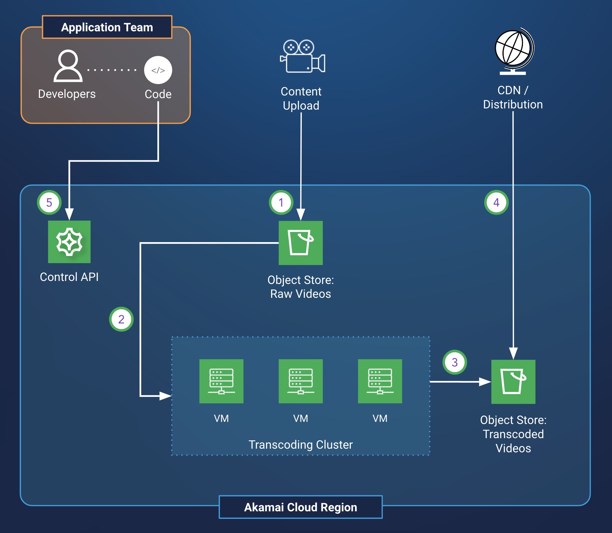

Video on demand (VOD) streaming services rely on transcoding of video streams to efficiently distribute content. The video is transcoded to formats that are suited to the network and device constraints where they are viewed. Video transcoding is a compute-intensive process, so maximizing the number of video streams that can be transcoded on available hardware is a primary consideration. This transcoding efficiency can vary between the compute offerings of different infrastructure providers. Evaluations of transcoding performance should be performed when selecting a cloud infrastructure platform.

As well, many streaming services are latency-sensitive, and the geographic location of the transcoding service affects the latency of the stream. Choosing a location closer to the stream’s viewers reduces latency, so being able to run the service in compute regions that are near your audience is important.

This guide covers a transcoding architecture that supports an over-the-top (OTT) media platform. The architecture has been implemented and proven by a profiled Akamai customer. This profiled customer delivers live TV channels, on-demand content, and catch-up TV services to viewers across the globe. This implementation allowed for significantly reduced egress costs while retaining competitive transcoding performance when compared to transcoding solutions from hyperscaler cloud platforms.

## Video on Demand Transcoding Workflow

At a high level, video is handled by a transcoding service with the following workflow:

1. Video content is ingested into the transcoding service from an intermediary storage location (often an object storage bucket).
1. The video transcoding service transcodes the stream into desired video formats.
1. A content delivery network accepts the transcoded video and distributes it to platform audiences.

## Overcoming Challenges

### Cost sensitivity

*Identify significant sources of infrastructure costs and determine ways to reduce those costs.*

Because video transcoding is a compute-intensive process, compute resources are a primary source of infrastructure cost for streaming services. It’s important to select compute hardware that is performant for the software that is run by the transcoding service. It’s also important to test example transcoding workflows on competing cloud infrastructure platforms and measure the transcoding efficiency of each. This can be done by selecting cost-comparable compute instances between platforms. Transcoding tests are run on each comparable instance and the number of parallel streams that can be achieved for each is measured.

After a video stream is transcoded by the transcoding service, it needs to be distributed by a content delivery network. This can also be a significant source of cost when there are egress fees between the transcoding service platform and the content delivery network. By selecting Akamai compute offerings for the transcoding service and using Akamai’s CDN, the egress fees for that traffic can be reduced by 100%.

### Latency sensitivity

*Identify sources of high latency and minimize the latency impact of those components.*

Low latency is important for video streaming services. To enable low latency, transcoding services should be located near their audiences. By working with a cloud infrastructure platform that offers a wide selection of regions in different geographies, you can ensure the proximity of your transcoding service as your business expands into new areas. Akamai’s global footprint of compute regions supports expansion into new audiences.

## Video on Demand Transcoding Design Diagram

This solution creates a video transcoding service on the Akamai cloud computing platform. The cloud transcoding service is composed of multiple compute instances working in parallel to handle the transcoding load. Object storage locations store content uploaded to the transcoding service and videos that have been transcoded. Transcoded video streams are distributed by the Akamai CDN to audiences.

1. Raw live or on-demand videos are uploaded to an object storage location that houses incoming videos that must be processed.
1. This location is monitored by the transcoding cluster for any new uploads.
1. Uploaded video streams are transcoded by virtual machines in the transcoding cluster into desired output formats. These transcoded video streams are uploaded to object storage.
1. A content delivery network distributes the video to viewers' devices, using the object storage location from the previous step as the content origin.
1. An infrastructure automation API allows the transcoding cluster infrastructure to be managed by application developers. Updates to the cluster's hardware and software can be deployed with these APIs.

### Systems and Components

- **Content upload storage**. An object storage location that stores content uploads that require transcoding.
- **Video transcoding cluster**. A cluster of compute instances transcodes the uploaded videos into the desired formats.
- **Transcoding output storage/distribution origin**. An object storage location that stores transcoded videos.
- **Content delivery network**. Used to cache, distribute, and control access to video library.
- **Control API**. An API used by an application team to manage and maintain the video transcoding service infrastructure.