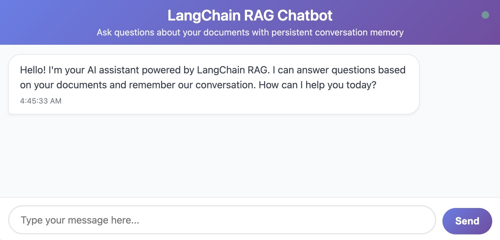

This guide demonstrates deploying a Python-based RAG chatbot to Linode Kubernetes Engine. The chatbot uses retrieval-augmented generation to ground its responses in your documents, LangChain to build the RAG pipeline and query the LLM, LangGraph to maintain conversation history in PostgreSQL, and FastAPI to expose a REST API for chat interactions. This architecture separates application logic from state storage, making it well-suited for containerized deployments.

Deploying to Kubernetes unlocks production capabilities essential for reliable applications. LKE distributes your chatbot across multiple pods for high availability, automatically replaces failed instances, performs rolling updates without downtime, and scales horizontally under load. This guide covers containerizing your application, creating Kubernetes manifests for secrets and configuration, and deploying to a managed cluster.

The [Using LangChain and LangGraph to Build a RAG-Powered Chatbot](/docs/guides/using-langchain-langgraph-build-rag-powered-chatbot/) guide explains the workflow of the application in more detail and provides a walkthrough of relevant code that leverages the LangChain, LangGraph, and FastAPI frameworks.

If you prefer a simpler deployment, the [Deploy a RAG-Powered Chatbot with LangChain on an Akamai Compute Instance](/docs/guides/deploy-rag-powered-chatbot-langchain-akamai-compute-instance) guide shows how to run the chatbot on a single compute instance.

## Systems and Components

This diagram describes which systems and components are present in the chatbot deployment on LKE:


- **LKE Cluster**: A [Linode Kubernetes Engine](https://www.linode.com/products/kubernetes/) cluster in Akamai Cloud.

- **Nodes**: Akamai compute instances that form the worker machines in your LKE cluster. Nodes provide the CPU, memory, and storage resources that run your chatbot application pods. Kubernetes schedules pods across available nodes and can automatically move pods between nodes for load balancing and fault tolerance.

- **Pods**: Containerized instances of your Python chatbot application running inside the LKE cluster. Each pod contains a single container built from a Docker image, which this guide shows how to build and push to a container repository. Multiple pod replicas are created for high availability, and Kubernetes automatically distributes them across nodes.

- **Python Application**: Your chatbot application, built with LangChain, LangGraph, and FastAPI.

- **Source Documents**: Akamai Object Storage, an S3-compatible object storage is used to store source documents that form the chatbot's knowledge base.

- **OpenAI API**: External LLM service providing both the embedding model (text-embedding-3-small) for document vectorization and the chat model (gpt-4o-mini) for generating responses.

- **Vector Embeddings**: [Akamai's Managed Database](https://www.akamai.com/products/databases) running PostgreSQL with the pgvector extension enabled. Used for storing document embeddings and performing vector similarity searches whenever a user queries your chatbot's knowledge base.

- **Conversation State**: Akamai's Managed Database running PostgreSQL. Used by LangGraph to persist conversation history across chatbot sessions.

### Understanding Stateless Pod Design

Kubernetes pods are ephemeral—they can be killed and recreated at any time due to node failures, scaling operations, or rolling updates. This means pods must be stateless: they can't store important data locally.

Your chatbot is stateful in that it remembers conversations, but the pods themselves are stateless because all state lives in external PostgreSQL databases:

* **Conversation state** uses the PostgreSQL state database with [LangGraph checkpointing](https://docs.langchain.com/oss/python/langgraph/persistence).
* **Vector embeddings** are stored in the PostgreSQL vector database, with the help of [pgvector](https://github.com/pgvector/pgvector).
* **No local file storage**, as all documents are stored in a Linode Object Storage bucket.
* **Configuration** is set via environment variables.

This design means you can destroy any pod without losing data. A replacement pod connects to the same databases and picks up where the previous one left off.

## Before You Begin

1. [Sign up for an Akamai Cloud Manager account](https://techdocs.akamai.com/cloud-computing/docs/getting-started#sign-up-for-an-account) if you do not already have one.

1. [Sign up for an OpenAI account](https://auth.openai.com/create-account) if you do not already have one.

    OpenAI charges per token used. For all development and testing of this application, expect total charges to be less than $10.

1. [Sign up for a Docker account](https://app.docker.com/signup), if you do not already have one.

## Environment Setup

### Set Up an LKE Cluster

1. Follow the [Create a cluster](https://techdocs.akamai.com/cloud-computing/docs/create-a-cluster) guide to create a new LKE cluster. Use these values for the LKE cluster creation form:

    - **Cluster Label**: Suggested name for this guide is `langchain-chatbot-cluster`

    - **Region**: Choose a region for the instance that's geographically close to you

    - **Akamai App Platform**: Select **No**

    - **HA Control Plane**: Select **No**, which is appropriate for testing/development

    - **Plan**: Dedicated 4GB is recommended

    - **Add Node Pools**: Choose a type with at least 4GB RAM. Configure the node pool to use at least three nodes.

    Akamai provisions the nodes, installs Kubernetes, and configures networking. Cluster creation may take several minutes.

1. Follow the [Install kubectl](https://techdocs.akamai.com/cloud-computing/docs/manage-a-cluster-with-kubectl#install-kubectl) guide to install kubectl on your workstation.

1. Follow the [Connect to a cluster with kubectl](https://techdocs.akamai.com/cloud-computing/docs/manage-a-cluster-with-kubectl#connect-to-a-cluster-with-kubectl) guide, including the [Access and download your kubeconfig](https://techdocs.akamai.com/cloud-computing/docs/manage-a-cluster-with-kubectl#access-and-download-your-kubeconfig) section, to verify the connection to your cluster.

### Set Up the Code Repository, Object Storage, Databases, and OpenAI API Key

Follow these sections from the [Deploy a RAG-Powered Chatbot with LangChain on an Akamai Compute Instance](/docs/guides/deploy-rag-powered-chatbot-langchain-akamai-compute-instance) guide:


Wherever an instruction says to run a command on an Akamai compute instance, run that command locally on your workstation instead.


1. [Clone the Chatbot Codebase](/docs/guides/deploy-rag-powered-chatbot-langchain-akamai-compute-instance/#clone-the-chatbot-codebase)

1. [Start a Python Virtual Environment](/docs/guides/deploy-rag-powered-chatbot-langchain-akamai-compute-instance/#start-a-python-virtual-environment)

1. [Copy the .env.example Template](/docs/guides/deploy-rag-powered-chatbot-langchain-akamai-compute-instance/#copy-the-envexample-template)

1. [Install Python Dependencies](/docs/guides/deploy-rag-powered-chatbot-langchain-akamai-compute-instance/#install-python-dependencies)

1. [Create an OpenAI API Key](/docs/guides/deploy-rag-powered-chatbot-langchain-akamai-compute-instance/#create-an-openai-api-key)

1. [Provision Managed PostgreSQL Databases](/docs/guides/deploy-rag-powered-chatbot-langchain-akamai-compute-instance/#provision-managed-postgresql-databases)

   - When selecting a region for your databases, use the same region as your LKE cluster.

   - When configuring network access for the database, add your workstation's IP address to the allowed list of IPs.

1. [Set Up Linode Object Storage](/docs/guides/deploy-rag-powered-chatbot-langchain-akamai-compute-instance/#set-up-linode-object-storage)

   - When selecting a region for your object storage bucket, use the same region as your LKE cluster.

1. [Upload Documents to the Object Storage Bucket](/docs/guides/deploy-rag-powered-chatbot-langchain-akamai-compute-instance/#upload-documents-to-the-object-storage-bucket)

### Verify Database Access from LKE

Your Kubernetes nodes need network access to your managed PostgreSQL databases. [Akamai Cloud documentation](https://techdocs.akamai.com/cloud-computing/docs/aiven-manage-database#lke-and-database-clusters-connectivity) provides this note:

*Each Managed Database cluster in your account automatically updates its ACL every 10 minutes to include the IP address (IPv4 and IPv6) from all LKE nodes in your account, ensuring that newly created, recycled, or auto-scaled nodes can connect to your databases without requiring manual IP access list changes.*

1. In the Akamai Cloud Manager, take note of the IP addresses for each of the nodes in your Kubernetes cluster. Then, navigate to the two managed databases for your application to verify in network access controls that those IP addresses are included in the allowlist.

1. Test database connectivity from a temporary pod:

    ```command
    kubectl run -it \
    --rm debug \
    --image=postgres:18 \
    --restart=Never -- \
    psql 
    ```

    For the `PSQL_CONNECTION_STRING_URI` placeholder, insert a string with this format, where the [connection details correspond to your database in the Cloud Manager](https://techdocs.akamai.com/cloud-computing/docs/aiven-postgresql#view-connection-details):

    ```
    "host= port= user= password= dbname="
    ```

    The output should resemble:

    ```output
    psql (18.0 (Debian 18.0-1.pgdg13+3))
    SSL connection (protocol: TLSv1.3, cipher: TLS_AES_256_GCM_SHA384, compression: off, ALPN: postgresql)
    Type "help" for help.

    defaultdb=>
    ```

1. Enter `\q` to quit the PostgreSQL session.

Your cluster can now reach your databases.

### Index Documents with LangChain

Follow the [Index Documents with LangChain](/docs/guides/deploy-rag-powered-chatbot-langchain-akamai-compute-instance/#index-documents-with-langchain) section of the [RAG Chatbot LangChain Compute Instance](/docs/guides/deploy-rag-powered-chatbot-langchain-akamai-compute-instance) guide to initialize your vector database and generate the vector embeddings of your documents.

## Containerize your Chatbot Application

The cloned GitHub repository for your chatbot has two files that are used to create a Docker image for your app:

- The [`.dockerignore` file](https://github.com/linode/docs-cloud-projects/blob/rag-pipeline-chatbot-langchain/.dockerignore) excludes unnecessary files from your Docker image.

- The [`Dockerfile`](https://github.com/linode/docs-cloud-projects/blob/rag-pipeline-chatbot-langchain/Dockerfile) builds your image by including the chatbot application code and running it with the `uvicorn` command:

    ```file {title="project/Dockerfile" lang="dockerfile"}
    FROM python:3.11-slim

    # Set working directory
    WORKDIR /app

    # Copy requirements first for layer caching
    COPY requirements.txt .

    # Install dependencies
    RUN pip install --no-cache-dir -r requirements.txt

    # Copy application code
    COPY app/ ./app/

    # Create non-root user for security
    RUN useradd -m appuser && chown -R appuser:appuser /app

    # Switch to non-root user
    USER appuser

    # Expose application port
    EXPOSE 8000

    # Run the application
    CMD ["uvicorn", "app.main:app", "--host", "0.0.0.0", "--port", "8000"]
    ```

    This Dockerfile follows container best practices:

    * **Slim base image**: Uses [python:3.11-slim](https://hub.docker.com/layers/library/python/3.11-slim) to minimize image size
    * **Layer caching**: Copies requirements.txt first so dependency installation is cached
    * **Non-root user**: Creates and switches to `appuser` for security
    * **Single process**: Runs uvicorn directly, removing the need for a shell script wrapper


### Audit your Configuration

Before proceeding, review the environment variables in your `.env` file. The following variables are later used in Kubernetes Secrets and ConfigMaps, with names remaining the same.

* `OPENAI_API_KEY`
* `VECTOR_DB_URL`
* `STATE_DB_URL`
* `LINODE_OBJECT_STORAGE_ACCESS_KEY`
* `LINODE_OBJECT_STORAGE_SECRET_KEY`
* `LINODE_OBJECT_STORAGE_ENDPOINT`
* `LINODE_OBJECT_STORAGE_BUCKET`

Ensure that access control for the two managed databases allows for connections from your workstations's IP address. Instructions in this section test your containerized application from your local machine, and this requires connecting to the database.

### Build your Chatbot Docker Image Locally

Because the Dockerfile already exists, you can immediately build the image and tag it with a version number:

```command
docker build -t langchain-chatbot:1.0.0 ./
```

The output should resemble:

```output
[+] Building 198.8s (11/11) FINISHED                                                                                                                                                                                                                                  docker:default
 => [internal] load build definition from Dockerfile                   0.0s
 => => transferring dockerfile: 551B                                   0.0s
 => [internal] load metadata for docker.io/library/python:3.11-slim    0.2s
 => [internal] load .dockerignore                                      0.0s
 => => transferring context: 311B                                      0.0s
 => [1/6] FROM docker.io/library/python:3.11-slim@sha256:ff8533f48e12b705fc20d339fde2ec61d0b234dd9366bab3bc84d7b70a45c8c0                                       57.0s …  => [internal] load build context                                      0.0s
 => => transferring context: 1.94kB                                    0.0s
 => [2/6] WORKDIR /app                                                 0.3s
 => [3/6] COPY requirements.txt .                                      0.0s
 => [4/6] RUN pip install --no-cache-dir -r requirements.txt         139.2s
 => [5/6] COPY app/ ./app/                                             0.0s
 => [6/6] RUN useradd -m appuser && chown -R appuser:appuser /app      0.3s
 => exporting to image                                                 1.7s
 => => exporting layers                                                1.7s
 => => writing image sha256:1a935d437430d4c378d81b881c81e28391bcaca452e2bfde229340aa57fa9220 0.0s
 => => naming to docker.io/library/langchain-chatbot:1.0.0
```

### Test your Chatbot Container Locally

Before pushing to a registry, verify your container works.

1. Run this command and replace the variable values with the corresponding values from your `.env` file:

    ```command
    docker run --rm \
    -e OPENAI_API_KEY= \
    -e VECTOR_DB_URL= \
    -e STATE_DB_URL= \
    -e LINODE_OBJECT_STORAGE_ACCESS_KEY= \
    -e LINODE_OBJECT_STORAGE_SECRET_KEY= \
    -e LINODE_OBJECT_STORAGE_ENDPOINT= \
    -e LINODE_OBJECT_STORAGE_BUCKET= \
    -e APP_HOST=0.0.0.0 \
    -e APP_PORT=8000 \
    -e LOG_LEVEL=INFO \
    -p 8000:8000 \
    langchain-chatbot:1.0.0
    ```

    The output should resemble:

    ```output
    INFO:     Started server process [1]
    INFO:     Waiting for application startup.
    2025-10-18 15:08:58,440 - app.main - INFO - Starting LangChain RAG Chatbot application
    2025-10-18 15:08:58,440 - app.main - INFO - Initializing RAG pipeline...
    2025-10-18 15:08:59,902 - app.core.rag - INFO - Vector store initialized successfully
    2025-10-18 15:08:59,905 - app.core.rag - INFO - RAG chain created successfully
    2025-10-18 15:08:59,905 - app.main - INFO - RAG pipeline initialized successfully
    2025-10-18 15:08:59,905 - app.main - INFO - Initializing conversation memory...
    2025-10-18 15:08:59,906 - app.core.memory - INFO - Attempting to initialize PostgreSQL checkpointer...
    2025-10-18 15:09:00,243 - app.core.memory - INFO - Calling checkpointer.setup()...
    2025-10-18 15:09:00,517 - app.core.memory - INFO - PostgreSQL checkpointer schema set up successfully
    2025-10-18 15:09:00,517 - app.core.memory - INFO - PostgreSQL checkpointer initialized successfully
    2025-10-18 15:09:00,518 - app.core.memory - INFO - Conversation graph created successfully
    2025-10-18 15:09:00,519 - app.main - INFO - Conversation memory initialized successfully
    2025-10-18 15:09:00,519 - app.main - INFO - Application startup completed successfully
    INFO:     Application startup complete.
    INFO:     Uvicorn running on http://0.0.0.0:8000 (Press CTRL+C to quit)
    ```

1. You can test your container with a curl request to the health check endpoint:

    ```command
    curl localhost:8000/api/health | jq
    ```

    The output should resemble:

    ```output
    {
        "status": "healthy",
        "vector_db": "connected",
        "state_db": "connected",
        "openai_api": "available",
        "timestamp": "2025-10-11T12:11:08.285338"
    }
    ```

1. Stop the container with `ctrl-C`. Your container is ready for deployment.

### Push to a Container Registry

You need a container registry so Kubernetes can pull your image. This guide uses [Docker Hub](https://hub.docker.com/).

1. Log into Docker Hub and [create a repository](https://docs.docker.com/docker-hub/repos/create/) named `langchain-chatbot`.

    For simplicity, this guide uses a public repository. If you create a private repository instead, you'll need to configure image pull secrets in Kubernetes.

1. Log in to your Docker account from the command line on your local machine.

    ```command
    docker login
    ```

    You'll be prompted to open your browser to complete the authentication flow.

1. Tag your image and push it to Docker Hub. Replace `` with your username:

    ```command
    docker tag langchain-chatbot:1.0.0 \
      /langchain-chatbot:1.0.0
    docker push /langchain-chatbot:1.0.0
    ```

    The output should resemble:

    ```output
    The push refers to repository [docker.io/[DOCKER_HUB_USERNAME]/langchain-chatbot]
    7f99e52b7e54: Pushed
    240b4a608545: Pushed
    9dda7ddeb4e1: Pushed
    fb91e312c4de: Pushed
    ad3453264194: Pushed
    b2738b04de4b: Mounted from library/python
    dba5cbed1e08: Mounted from library/python
    c9cf0647c388: Mounted from library/python
    1d46119d249f: Mounted from library/python
    1.0.0: digest: sha256:cd3cf4aece1ebb1dcf301446132c586f61011641da94aef69e5a7209aefdbb8b size: 2204
    ```

## Creating Kubernetes Manifests

This section describes how to create four manifests that tell Kubernetes how to run your application:

- A [Secret](https://kubernetes.io/docs/concepts/configuration/secret/): Stores sensitive data like API keys and database connection strings

- A [ConfigMap](https://kubernetes.io/docs/concepts/configuration/configmap/): Stores non-sensitive configuration like model names and settings

- A [Deployment](https://kubernetes.io/docs/concepts/workloads/controllers/deployment/): Defines your application pods, replicas, and container specifications

- A [Service](https://kubernetes.io/docs/concepts/services-networking/service/): Exposes your application to the internet via a LoadBalancer

Before proceeding, create a directory called `manifests` under your cloned Github chatbot repository:

```command
mkdir manifests
```

### Create a Secret for Sensitive Data

Kubernetes Secrets store sensitive information like API keys and database passwords. Create a file named `secret.yaml` inside the `manifests/` directory with this file snippet. Replace the placeholder secret values with the corresponding values in your `.env` file:

```file {title="manifests/secret.yaml", lang="yaml"}
apiVersion: v1
kind: Secret
metadata:
  name: chatbot-secrets
type: Opaque
stringData:
  openai-api-key: 
  vector-db-url: 
  state-db-url: 
  linode-object-storage-access-key: 
  linode-object-storage-secret-key: 
```

Although you provide the values in plain text, Kubernetes automatically base64-encodes them when storing. Note that this encoding is for storage format, not security. Anyone with cluster access can retrieve and decode these values.


Never commit `secret.yaml` with real values to version control. Add it to `.gitignore` or use a template file with placeholder values.

The [`.gitignore` in the example chatbot repository](https://github.com/linode/docs-cloud-projects/blob/rag-pipeline-chatbot-langchain/.gitignore#L112-L115) is set to ignore `manifests/secret.yaml`


### Create a ConfigMap for Non-Sensitive Configuration

Create `configmap.yaml` inside the `manifests/` directory for non-sensitive settings with this file snippet. Replace the placeholder configuration values with the corresponding values in your `.env` file:

```file {title="manifests/configmap.yaml", lang="yaml"}
apiVersion: v1
kind: ConfigMap
metadata:
  name: chatbot-config
data:
  APP_PORT: "8000"
  LLM_MODEL: "gpt-4o-mini"
  EMBEDDING_MODEL: "text-embedding-3-small"
  LINODE_OBJECT_STORAGE_ENDPOINT: 
  LINODE_OBJECT_STORAGE_BUCKET: 
```

ConfigMaps separate configuration from code, making it easy to change settings without rebuilding containers.

### Create a Deployment Manifest

The Deployment defines how Kubernetes runs your application. Create `deployment.yaml` inside the `manifests/` directory with this file snippet. Replace  with your username on line 17.

```file {title="manifests/deployment.yaml", lang="yaml"}
apiVersion: apps/v1
kind: Deployment
metadata:
  name: chatbot-deployment
spec:
  replicas: 3
  selector:
    matchLabels:
      app: chatbot
  template:
    metadata:
      labels:
        app: chatbot
    spec:
      containers:
      - name: chatbot
        image: /langchain-chatbot:1.0.0
        ports:
        - containerPort: 8000
        env:
        - name: OPENAI_API_KEY
          valueFrom:
            secretKeyRef:
              name: chatbot-secrets
              key: openai-api-key
        - name: VECTOR_DB_URL
          valueFrom:
            secretKeyRef:
              name: chatbot-secrets
              key: vector-db-url
        - name: STATE_DB_URL
          valueFrom:
            secretKeyRef:
              name: chatbot-secrets
              key: state-db-url
        - name: LINODE_OBJECT_STORAGE_ACCESS_KEY
          valueFrom:
            secretKeyRef:
              name: chatbot-secrets
              key: linode-object-storage-access-key
        - name: LINODE_OBJECT_STORAGE_SECRET_KEY
          valueFrom:
            secretKeyRef:
              name: chatbot-secrets
              key: linode-object-storage-secret-key
        - name: APP_PORT
          valueFrom:
            configMapKeyRef:
              name: chatbot-config
              key: APP_PORT
        - name: LLM_MODEL
          valueFrom:
            configMapKeyRef:
              name: chatbot-config
              key: LLM_MODEL
        - name: EMBEDDING_MODEL
          valueFrom:
            configMapKeyRef:
              name: chatbot-config
              key: EMBEDDING_MODEL
        - name: LINODE_OBJECT_STORAGE_ENDPOINT
          valueFrom:
            configMapKeyRef:
              name: chatbot-config
              key: LINODE_OBJECT_STORAGE_ENDPOINT
        - name: LINODE_OBJECT_STORAGE_BUCKET
          valueFrom:
            configMapKeyRef:
              name: chatbot-config
              key: LINODE_OBJECT_STORAGE_BUCKET
        resources:
          requests:
            memory: "512Mi"
            cpu: "250m"
          limits:
            memory: "1Gi"
            cpu: "500m"
        livenessProbe:
          httpGet:
            path: /api/health
            port: 8000
          initialDelaySeconds: 30
          periodSeconds: 10
        readinessProbe:
          httpGet:
            path: /api/health
            port: 8000
          initialDelaySeconds: 5
          periodSeconds: 5
```

Note the following key configurations:

* `replicas: 3`: Runs three copies of your application for high availability
* `resources`: Requests guarantee minimum resources; limits cap maximum usage
* `livenessProbe`: Kubernetes restarts the pod if health checks fail
* `readinessProbe`: Pod doesn't receive traffic until it's ready
* `env`: Environment variables populated from Secret and ConfigMap

### Create a Service Manifest

The Service exposes your application to the internet. Create `service.yaml` inside the `manifests/` directory from this file snippet:

```file {title="manifests/service.yaml", lang="yaml"}
apiVersion: v1
kind: Service
metadata:
  name: chatbot-service
spec:
  type: LoadBalancer
  selector:
    app: chatbot
  ports:
  - protocol: TCP
    port: 80
    targetPort: 8000
```

Setting `type: LoadBalancer` tells LKE to provision a NodeBalancer that distributes traffic across your pods. The `selector` matches pods with the label `app: chatbot` from your Deployment.

## Deploy to LKE

With your manifests ready, you'll apply them to your cluster. Each manifest builds on the previous one, so the sequence matters.

### Apply Manifests

Deploy your resources in dependency order.

```command
kubectl apply -f manifests/secret.yaml
kubectl apply -f manifests/configmap.yaml
kubectl apply -f manifests/deployment.yaml
kubectl apply -f manifests/service.yaml
```

The output should resemble:

```output
secret/chatbot-secrets created configmap/chatbot-config created deployment.apps/chatbot-deployment created service/chatbot-service created
```

Kubernetes now creates your pods and provisions a LoadBalancer.

### Monitor Deployment Progress

1. Watch your pods start:

    ```command
    kubectl get pods -w
    ```

    The above command will watch the pods progress from ContainerCreating to Running states.

    ```output
    NAME                                  READY   STATUS    RESTARTS   AGE
    chatbot-deployment-598f6cbd78-2n8js   1/1     Running   0          3m31s
    chatbot-deployment-598f6cbd78-jj4nz   1/1     Running   0          3m31s
    chatbot-deployment-598f6cbd78-p9nnz   1/1     Running   0          3m31s
    ```

1. Check detailed pod status, using a specific pod name:

    ```command
    kubectl describe pod chatbot-deployment-598f6cbd78-2n8js
    ```

    ```output
    Name:             chatbot-deployment-598f6cbd78-2n8js
    Namespace:        default
    Priority:         0
    Service Account:  default
    Node:             lke525573-759963-5b4330b90000/192.168.144.171 Status:           Running
    … Containers:
    chatbot:
        Container ID:   containerd://1b0e7cca693b8196fa64e5594e34c5d70d83209cf5e4b82fb9138f518419c9cb
        Image:          [DOCKER-HUB-USERNAME]/langchain-chatbot:1.0.0
        Image ID:       docker.io/[DOCKER-HUB-USERNAME]/langchain-chatbot@sha256:cd3cf4aece1ebb1dcf301446132c586f61011641da94aef69e5a7209aefdbb8b
        Port:           8000/TCP
        Host Port:      0/TCP
        State:          Running
        Ready:          True
        Restart Count:  0
        Limits:
        cpu:     500m
        memory:  1Gi
        Requests:
        cpu:      250m
        memory:   512Mi
        Liveness:   http-get http://:8000/api/health delay=30s timeout=1s period=10s #success=1 #failure=3
        Readiness:  http-get http://:8000/api/health delay=5s timeout=1s period=5s #success=1 #failure=3
        Environment:
        OPENAI_API_KEY:                    <set to the key 'openai-api-key' in secret 'chatbot-secrets'>                     Optional: false
        VECTOR_DB_URL:                     <set to the key 'vector-db-url' in secret 'chatbot-secrets'>                      Optional: false …
    Conditions:
    Type                        Status
    PodReadyToStartContainers   True
    Initialized                 True
    Ready                       True
    ContainersReady             True
    PodScheduled                True
    …
    ```

1. View application logs:

    ```command
    kubectl logs -l app=chatbot --tail=10
    ```

    ```output
    INFO:     172.234.232.183:43246 - "GET /api/health HTTP/1.1" 200 OK
    2025-10-18 15:50:26,836 - app.api.health - INFO - Performing health check
    2025-10-18 15:50:28,186 - httpx - INFO - HTTP Request: POST https://api.openai.com/v1/embeddings "HTTP/1.1 200 OK"
    2025-10-18 15:50:28,187 - app.api.health - INFO - Health check completed: healthy
    INFO:     172.234.232.183:43262 - "GET /api/health HTTP/1.1" 200 OK
    2025-10-18 15:50:31,838 - app.api.health - INFO - Performing health check
    2025-10-18 15:50:32,029 - httpx - INFO - HTTP Request: POST https://api.openai.com/v1/embeddings "HTTP/1.1 200 OK"
    2025-10-18 15:50:32,029 - app.api.health - INFO - Health check completed: healthy
    INFO:     172.234.232.183:43274 - "GET /api/health HTTP/1.1" 200 OK
    2025-10-18 15:50:34,002 - app.api.health - INFO - Performing health check
    INFO:     172.234.253.68:49118 - "GET /api/health HTTP/1.1" 200 OK
    2025-10-18 15:50:25,059 - app.api.health - INFO - Performing health check
    2025-10-18 15:50:25,255 - httpx - INFO - HTTP Request: POST https://api.openai.com/v1/embeddings "HTTP/1.1 200 OK"
    2025-10-18 15:50:25,256 - app.api.health - INFO - Health check completed: healthy
    INFO:     172.234.253.68:49128 - "GET /api/health HTTP/1.1" 200 OK
    2025-10-18 15:50:30,059 - app.api.health - INFO - Performing health check
    2025-10-18 15:50:30,245 - httpx - INFO - HTTP Request: POST https://api.openai.com/v1/embeddings "HTTP/1.1 200 OK"
    2025-10-18 15:50:30,246 - app.api.health - INFO - Health check completed: healthy
    INFO:     172.234.253.68:49136 - "GET /api/health HTTP/1.1" 200 OK
    2025-10-18 15:50:34,003 - app.api.health - INFO - Performing health check
    INFO:     172.234.232.4:38044 - "GET /api/health HTTP/1.1" 200 OK
    2025-10-18 15:50:28,758 - app.api.health - INFO - Performing health check
    2025-10-18 15:50:29,030 - httpx - INFO - HTTP Request: POST https://api.openai.com/v1/embeddings "HTTP/1.1 200 OK"
    2025-10-18 15:50:29,031 - app.api.health - INFO - Health check completed: healthy
    INFO:     172.234.232.4:44836 - "GET /api/health HTTP/1.1" 200 OK
    2025-10-18 15:50:33,758 - app.api.health - INFO - Performing health check
    2025-10-18 15:50:33,948 - httpx - INFO - HTTP Request: POST https://api.openai.com/v1/embeddings "HTTP/1.1 200 OK"
    2025-10-18 15:50:33,949 - app.api.health - INFO - Health check completed: healthy
    INFO:     172.234.232.4:44844 - "GET /api/health HTTP/1.1" 200 OK
    2025-10-18 15:50:34,094 - app.api.health - INFO - Performing health check
    ```

### Get External IP Address

Check your Service for the external IP:

```command
kubectl get service chatbot-service
```

```output
NAME             TYPE         CLUSTER-IP    EXTERNAL-IP    PORT(S)      AGE
chatbot-service  LoadBalancer 10.128.98.175 172.238.59.197 80:31116/TCP 4m
```

The LoadBalancer may take 1-2 minutes to provision. If the IP address is not yet available, rerun the command after a few minutes.

LKE has provisioned a NodeBalancer that routes traffic to your pods.

### Verify Deployment

Test the health endpoint using the external IP:

```command
curl http://172.238.59.197/api/health | jq
```

The output should resemble:

```output
{
  "status": "healthy",
  "vector_db": "connected",
  "state_db": "connected",
  "openai_api": "available",
  "timestamp": "2025-10-18T15:55:09.914247"
}
```

## Test the Chatbot

1. Navigate to the external IP address of the LoadBalancer in your browser to access the chatbot:

    

1. Start by testing **RAG retrieval**. Ask questions that your documents can answer, and verify that the responses use that information.

    

1. Then, test **conversation memory** by asking follow-up questions that require previous context.

    

## Testing Your Kubernetes Deployment

Your chatbot is running on Kubernetes, but you need to verify it works correctly in this distributed environment.

### Test End-to-End Functionality with the LoadBalancer

Your chatbot is distributed across multiple pods, which means any request from any pod should properly route through the LoadBalancer to any available pod. Conversation state should persist, regardless of which pod handles each request. Since all state lives in your external PostgreSQL database, any pod can pick up the conversation seamlessly—this is stateless design in action.

Check how requests distribute across pods:

1. In a terminal window, run the following command to follow specific log messages and show the name of the pod that processed each one:

    ```command
    kubectl logs \
    -l app=chatbot \
    --follow \
    --prefix=true \
    | grep "Processing chat message"
    ```

1. In the browser window, send several requests to the chatbot. The log messages may look like this:

    ```output
    [pod/chatbot-deployment-598f6cbd78-2n8js/chatbot] 2025-10-18 16:00:49,820 - app.api.chat - INFO - Processing chat message: Who is Huck?...
    [pod/chatbot-deployment-598f6cbd78-2n8js/chatbot] 2025-10-18 16:00:59,339 - app.api.chat - INFO - Processing chat message: Who is Tom?...
    [pod/chatbot-deployment-598f6cbd78-2n8js/chatbot] 2025-10-18 16:01:26,643 - app.api.chat - INFO - Processing chat message: Where does Huck live?...
    [pod/chatbot-deployment-598f6cbd78-jj4nz/chatbot] 2025-10-18 16:02:16,633 - app.api.chat - INFO - Processing chat message: Where does Tom live?...
    [pod/chatbot-deployment-598f6cbd78-2n8js/chatbot] 2025-10-18 16:02:39,514 - app.api.chat - INFO - Processing chat message: Describe their friendship....
    [pod/chatbot-deployment-598f6cbd78-jj4nz/chatbot] 2025-10-18 16:03:01,706 - app.api.chat - INFO - Processing chat message: What questions have I asked so far in this convers...
    [pod/chatbot-deployment-598f6cbd78-p9nnz/chatbot] 2025-10-18 16:03:18,521 - app.api.chat - INFO - Processing chat message: Do the two of them have any other friends?...
    ```

Notice how different requests are being distributed across your pods by the LoadBalancer.

### Test Kubernetes Self-Healing by Deleting a Pod

1. Manually force a pod deletion, using a specific pod name:

    ```command
    kubectl delete pod chatbot-deployment-598f6cbd78-2n8js
    ```

1. Immediately check the status of your pods.

    ```command
    kubectl get pods
    ```

    ```output
    NAME                                  READY   STATUS    RESTARTS   AGE
    chatbot-deployment-598f6cbd78-dxbdw   0/1     Running   0          4s
    chatbot-deployment-598f6cbd78-jj4nz   1/1     Running   0          1h
    chatbot-deployment-598f6cbd78-p9nnz   1/1     Running   0          1h
    ```

The Deployment controller automatically creates a replacement. Your Service continues working because the other two pods handle traffic during the replacement.


## Production Considerations

When deploying to production, keep in mind the following key considerations:

### Managing Secrets Securely

Never commit `secret.yaml` with real values to version control. Consider external secret management tools like HashiCorp Vault. Rotate secrets periodically and use Kubernetes RBAC to restrict access.

### Updating your Chatbot

When you make code changes, build a new image with an incremented version. Update `deployment.yaml` with a new image tag.

Kubernetes performs a rolling update; it creates new pods with the updated image, waits for them to pass readiness checks, then terminates old pods. This provides zero-downtime deployment.

### Scaling your Chatbot

Scale manually by changing the replica count. This changes the number of pods (application instances), not the number of nodes (compute instances). Your three nodes can run many more than three pods, and Kubernetes distributes them based on available resources.

```command
kubectl scale deployment chatbot-deployment --replicas=8
```

```output
deployment.apps/chatbot-deployment scaled
```

Now, when you run kubectl get pods, you will see:

```output {title="Pod count matches updated replica count"}
NAME                                  READY   STATUS    RESTARTS   AGE
chatbot-deployment-598f6cbd78-dxbdw   1/1     Running   0          9m52s
chatbot-deployment-598f6cbd78-fnqf9   1/1     Running   0          62s
chatbot-deployment-598f6cbd78-jj4nz   1/1     Running   0          1h
chatbot-deployment-598f6cbd78-lbj4m   1/1     Running   0          62s
chatbot-deployment-598f6cbd78-nb4mj   1/1     Running   0          62s
chatbot-deployment-598f6cbd78-p9nnz   1/1     Running   0          1h
chatbot-deployment-598f6cbd78-r2nh6   1/1     Running   0          62s
chatbot-deployment-598f6cbd78-v98hf   1/1     Running   0          62s
```

For automatic scaling based on CPU usage, create a [HorizontalPodAutoscaler](https://kubernetes.io/docs/tasks/run-application/horizontal-pod-autoscale/).

### Monitoring and Logging

To check resource usage across nodes and pods, install the [Kubernetes Metric Server](https://github.com/kubernetes-sigs/metrics-server).

```command
kubectl apply -f https://github.com/kubernetes-sigs/metrics-server/releases/latest/download/components.yaml
```

Then, after a few minutes, you can run commands to show usage.

```command
kubectl top nodes
```

```output
NAME                            CPU(cores)   CPU(%)   MEMORY(bytes)   MEMORY(%)
lke525573-759963-28d8bdfe0000   116m         5%       1950Mi          50%
lke525573-759963-2db7d3ab0000   105m         5%       2002Mi          52%
lke525573-759963-5b4330b90000   72m          3%       1547Mi          40%
```

```command
kubectl top pods
```

```output
NAME                                  CPU(cores)   MEMORY(bytes)    chatbot-deployment-598f6cbd78-dxbdw   9m           201Mi            chatbot-deployment-598f6cbd78-fnqf9   9m           195Mi            chatbot-deployment-598f6cbd78-jj4nz   10m          526Mi            chatbot-deployment-598f6cbd78-lbj4m   7m           194Mi            chatbot-deployment-598f6cbd78-nb4mj   9m           195Mi            chatbot-deployment-598f6cbd78-p9nnz   9m           535Mi            chatbot-deployment-598f6cbd78-r2nh6   7m           198Mi            chatbot-deployment-598f6cbd78-v98hf   7m           195Mi
```

For production log management, consider log aggregation tools like the ELK stack (Elasticsearch, Logstash, Kibana) or Grafana Loki. These centralize logs from all pods and provide search and visualization.

### Cost Management

Calculate your monthly costs with the [Akamai Cloud Computing Calculator](https://www.linode.com/pricing/cloud-cost-calculator/). These were the resources provisioned by default in this guide:

- LKE cluster with 3 nodes and one NodeBalancer
- Two managed databases
- One object storage bucket

Optimize costs by:

- Right-sizing your node pool (use smaller nodes if resource limits are low)
- Reducing replicas if traffic is low
- Using the cluster autoscaler to scale nodes down during off-peak hours

## Conclusion

You've deployed your LangChain chatbot to Kubernetes with multiple replicas, secrets management, and production-ready infrastructure.

## Troubleshooting

If you encounter issues with **pods not starting** (for example: `ImagePullBackOff` status), then:

* Verify your image name and tag match what you pushed to Docker Hub.
* Check that the image is publicly accessible or that you've configured image pull [secrets with your Docker Hub credentials](https://kubernetes.io/docs/tasks/configure-pod-container/pull-image-private-registry/).
* Try pulling the image locally with docker pull to confirm it exists.

If **pods are crashing immediately** (for example, `CrashLoopBackOff` status), then perform the following debugging steps:

* Check the logs with kubectl logs ``.
* Common causes include missing environment variables, incorrect database connection strings, or application code errors.
* Verify your Secret and ConfigMap are applied correctly.

If you encounter **database connection issues**, run the following checks:

* Confirm both database connection strings in your Secret are correct.
* Check that your LKE node IPs are in the allowed IP list for both managed databases.
* Test direct connectivity with a debug pod running psql.

When you create a Kubernetes Service with `type: LoadBalancer` on LKE, it automatically [provisions an Akamai NodeBalancer](https://techdocs.akamai.com/cloud-computing/docs/get-started-with-load-balancing-on-an-lke-cluster) behind the scenes—you can see it in Akamai Cloud Manager under NodeBalancers. When checking Service status with kubectl, if the **LoadBalancer is stuck in pending state**, then:

* Note that provisioning typically takes 1-2 minutes.
* If it's stuck longer, check the Akamai Cloud Manager for the NodeBalancer status.
* Verify your LKE cluster has proper permissions and there are no account limits preventing LoadBalancer creation.

If you encounter **health probe failures**, then:

* Verify your health check endpoint (in the case of this guide, /api/health) works by testing it directly with [kubectl port-forward](https://kubernetes.io/docs/reference/kubectl/generated/kubectl_port-forward/) and curl.
* Check initialDelaySeconds in your probe configuration—your application might need more time to start.
* Review pod logs for startup errors.

If you encounter **uneven load distribution**, run the following checks:

* Verify your Service selector matches the pod labels in your Deployment.
* Check that all pods are ready with kubectl get pods.
* Some pods might be failing readiness checks, removing them from the load balancer rotation.

If your overall application encounters **resource exhaustion**, then:

* Check resource usage with kubectl top pods and kubectl top nodes.
* If pods are hitting their limits, then increase the values in your Deployment.
* If nodes are full, then scale up your node pool or use larger nodes.
* Consider implementing the HorizontalPodAutoscaler to handle traffic spikes automatically.
