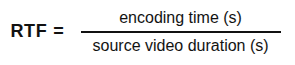
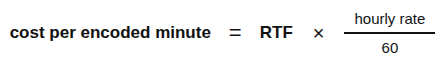

When your video encoding approach switches from a software encoder to a hardware accelerator, or when you simply move from one cloud provider to another, the question isn't just "is it faster?" Your new solution may be faster, but at what cost, and with what quality tradeoff? And what does this mean at the scale you actually operate? These are questions that help inform key business decisions. Knowing your raw encoding speed is just the tip of the iceberg.

This guide walks through a systematic framework for benchmarking a video encoding pipeline, covering five metric categories:

1.  Speed
1.  Quality
1.  Resource utilization
1.  Output characteristics
1.  Cost

These metrics apply to any combination of hardware accelerators and software encoders — NVIDIA NVENC, Intel Quick Sync (QSV), Apple VideoToolbox, NETINT Quadra VPU, `libx264`, and others. The worked example in this guide compares NETINT Quadra VPU hardware encoding with CPU software encoding (`libx264`), but the methodology is the same regardless of what's on each side.

Structure your benchmarks to fit a realistic business decision: two separate instances, each priced and provisioned as you would deploy them in production. This guide, for example, compares:

-   The CPU path running on an Akamai G6 Dedicated 16 GB instance with 8 CPUs. ($0.216/hr)
-   The VPU path running on an Akamai Accelerated Linode with a NETINT Quadra T1U VPU, 16 GB of RAM, 1 VPU, and 8 vCPU cores ($0.42/hr).

A separate guide, [Migrating Your Video Content Pipeline to Akamai](#), covers deploying the pipeline itself. This guide assumes the pipeline (in both CPU and VPU flavors) is running and focuses solely on measuring it.

## What You're Actually Trying to Learn

Before you get started, it helps to be precise about what question you're answering.

A benchmark that tells you which encoder is faster is *different* from one that tells you which path is cheaper per encoded minute at production scale.

Different questions lead to different metrics, and different metrics determine what you do with the results. Below are some of the questions worth answering for any encoder comparison:

-   **Speed**:
    -   How fast does each encoder process content?
    -   Does speed scale proportionally as resolution drops, or does the hardware have a floor below which it doesn't get faster?
-   **Quality**:
    -   At the same target bitrate, how faithfully does each encoder reproduce the source?
    -   Is the difference perceptible, or just measurable?
-   **Resource consumption**:
    -   What does the encoding cost in CPU, memory, and accelerator load?
    -   Can other workloads run concurrently on the same machine?
-   **Output characteristics**:
    -   Does the encoder hit its target bitrate? Overshoot drives up storage and egress costs; undershoot wastes quality budget and can disrupt ABR ladder assumptions.
-   **Cost efficiency**:
    -   Given the hourly rate of the instance each path actually runs on, what does it cost to encode one minute of content?

## The Test Setup

| Parameter | Akamai Cloud CPU instance | Akamai Cloud VPU instance |
| :---- | :---- | :---- |
| Instance | G6 Dedicated 16 GB `g6-dedicated-8` | NETINT Quadra T1U x1 Small `g1-accelerated-netint-vpu-t1u1-s` |
| Hourly rate | $0.216/hr | $0.42/hr |
| vCPUs | 8 | 8 |
| RAM | 16 GB | 16 GB |
| Encoder | `libx264` | `h264_ni_quadra_enc` |

The two instances are matched on CPU cores and RAM. The only meaningful differences are the NETINT Quadra VPU on the accelerated instance and the $0.204/hr premium it entails.

All results come from a benchmark run against a [30-second, 1920×1080, H.264 source file](https://github.com/bower-media-samples/big-buck-bunny-1080p-30s). The source is a compressed streaming file with moderate motion and no rapid scene cuts. Results will differ for high-motion content (sports, action) or high-texture content (film grain, concerts). The pipeline encoded a four-rung ABR ladder to H.264 output:

-   1080p at 5 Mbps
-   720p at 3 Mbps
-   480p at 1.5 Mbps
-   360p at 800 kbps

Each profile ran one warmup iteration followed by three measured iterations. The warmup primes OS filesystem caches and allows the VPU driver to complete its initialization sequence; its results are excluded from reported averages. Quality metrics ran in a separate post-encode pass outside the timing loop, so their overhead doesn't affect speed numbers.

The code used to run these benchmarks is available in this [GitHub repository](https://github.com/alvinslee/linode-encoding-pipeline-benchmarking). Clone this repository on the machine(s) you want to benchmark, and upload a source video file to use for the benchmark tests. Then:

```command {title="Run benchmark for a CPU setup"}
python cli.py benchmark video.mp4  \
  --modes cpu \
  --hourly-rate 0.216 \
  --instance-label "G6 Dedicated 16GB with 8 CPU" \
  --export cpu_results.json
```

```command {title="Run benchmark for a VPU setup"}
python cli.py benchmark video.mp4 \
  --modes vpu \
  --hourly-rate 0.42 \
  --instance-label "NETINT Quadra T1U x1 Small" \
  --export vpu_results.json
```

```command {title="Compare two benchmarking results files, generating a report in Markdown"}
python cli.py compare \
  cpu_results.json \
  vpu_results.json \
  --output comparison.md
```

Excerpts from the resulting `comparison.md` file based on this example test setup will be covered throughout the rest of this guide.

## Speed and Throughput

Speed is measured three ways, each answering a slightly different question.

**Encoding FPS** is the raw frames-per-second figure FFmpeg reports during encoding. This is the most direct measure of encoder throughput and the number most commonly cited in hardware datasheets.

However, FPS is source-dependent. A 30 FPS video has 30 frames for every second of playback, whereas a 60 FPS video has 60\. Therefore, an encoder running at 600 FPS tears through a 30 FPS source at 20× real time, but that same 600 FPS only gets you 10× real time on a 60 FPS source—each second of content contains twice as many frames to process. The raw FPS number looks identical, but the actual throughput is half.

**Wall-clock encoding time** is the elapsed time from the launch of FFmpeg to its exit. For batch pipelines, this is a direct operational metric that answers questions such as "How long will tonight's upload queue take?"

**Real-Time Factor (RTF)** normalises both against the source clip's duration:



An RTF of 0.25 means the encoder finished in one-quarter of the video's playback time, whereas an RTF of 4.0 means it took four times as long as the video runs.

RTF is the most portable speed metric because it's stable across different source frame rates and clip lengths, and it feeds directly into cost calculations. RTF below 1.0 is required for live encoding and for single-instance batch pipelines that must process content faster than it arrives.


FFmpeg reports encoding FPS in its `stderr` progress output. Parse the `fps=N` field to get the sustained encode speed once the pipeline is warm (the last reported value). Wrap the FFmpeg subprocess call with `time.time()` before and after to get wall-clock time. RTF is then `wall_clock_time / source_duration`, where source duration comes from an `ffprobe` call on the input file.


### Analyzing the results

In the example benchmarks run for this guide, the resulting `comparison.md` file showed the following:

#### CPU (Linode G6 Dedicated 16 GB) using `libx264`

| Profile | Avg FPS | Avg Encode Time | RTF |
| ----- | ----- | ----- | ----- |
| 1080p | 47.3 | 15.3s | 0.509 (2.0×) |
| 720p | 81.3 | 8.9s | 0.297 (3.4×) |
| 480p | 140.3 | 5.2s | 0.173 (5.8×) |
| 360p | 195.3 | 3.7s | 0.125 (8.0×) |

#### VPU (Linode NETINT Quadra T1U x1 Small) using `h264_ni_quadra_enc`

| Profile | Avg FPS | Avg Encode Time | RTF |
| ----- | ----- | ----- | ----- |
| 1080p | 192.7 | 3.8s | 0.126 (7.9×) |
| 720p | 321.3 | 2.3s | 0.076 (13.1×) |
| 480p | 318.3 | 2.3s | 0.077 (13.0×) |
| 360p | 333 | 2.2s | 0.074 (13.6×) |

#### CPU vs VPU Speedup (RTF Comparison)

| Profile | CPU RTF | VPU RTF | Speedup |
| ----- | ----- | ----- | ----- |
| 1080p | 0.509 | 0.126 | 4.0× |
| 720p | 0.297 | 0.076 | 3.9× |
| 480p | 0.173 | 0.077 | 2.2× |
| 360p | 0.125 | 0.074 | 1.7× |

The VPU is consistently faster across every profile, but the gap narrows at lower resolutions. At 1080p and 720p, the speedup is around 4x. At 480p, it's 2.2x; at 360p, it's 1.7x. The Quadra VPU is optimized for the computationally expensive end of the task: high-resolution, high-bitrate work. As resolution drops, the CPU closes the gap because the per-frame workload is lighter.

VPU speed also barely changes at 720p or lower. The 720p, 480p, and 360p profiles all have similar FPS (in the low 300s) and RTF (around 0.075). This suggests the VPU hits a throughput floor at lower resolutions, likely driven by I/O and pipeline orchestration overhead rather than raw encoding computation. This is worth watching for in any accelerator benchmark: **identify where the device stops getting meaningfully faster as the workload decreases**.

## Quality Metrics

Quality metrics answer a different question: at a given target bitrate, how closely does the encoder reproduce the original?

1.  **Generate a reference**. Scale the original source down to the output rendition's resolution using a software filter. There is no compression here, just a clean resize.
1.  **Compare**. Measure the encoder's compressed output against that reference at the same resolution.

Any difference between the two is a compression artifact. Because the reference was not compressed, it's the closest possible version of the source at that resolution. This comparison isolates exactly how well the encoder preserved quality, apart from resolution reduction.

For `libx264`, the quality pass is straightforward. It's deterministic and produces bit-for-bit identical output across runs for fixed inputs and settings, so measuring quality once per profile is sufficient. Hardware encoders are not guaranteed to be deterministic: internal parallelism and driver state can produce slightly different outputs across runs.

The quality scores in the example benchmark were stable across the three measured VPU iterations. However, for a rigorous hardware encoder quality assessment, checking variance across multiple iterations is advisable.

**Peak signal-to-noise ratio (PSNR)** measures pixel-level fidelity in decibels. It's the most widely reported quality metric and is useful for comparing encoders on the same content. However, it weights every pixel equally regardless of where the eye focuses, so it can diverge from perceived quality. Higher is better; scores in the 40–50 dB range are generally considered excellent and transparent to viewers.

**Structural similarity index (SSIM)** models perceived quality more closely than PSNR by comparing luminance, contrast, and local structure between frames rather than raw pixel differences. Scores range from 0.0 to 1.0. Scores above 0.95 are generally considered excellent. SSIM is a more meaningful quality predictor than PSNR for most streaming content.

**Extended Perceptually-Weighted PSNR (XPSNR)** extends PSNR with both spatial and temporal perceptual masking. It weights distortion errors based on local spatial complexity (because the eye is less sensitive to errors in high-texture areas) and temporal activity. This penalizes errors less in regions of high inter-frame change. For mixed-content video with varying motion and texture, XPSNR gives a more complete picture than PSNR or SSIM alone.

**Video Multimethod Assessment Fusion (VMAF)**, [developed by Netflix](https://netflixtechblog.com/vmaf-the-journey-continues-44b51ee9ed12), is the de facto industry standard for encoder quality comparison at streaming media companies. It uses a machine learning model trained on human perception studies and produces a single score on a 0–100 scale. Scores above 93 are considered broadcast-quality; scores above 97 are virtually transparent.


All three metrics are computed via FFmpeg `filter_complex` passes run on the encoded output file after timing is complete. The source is scaled to the output rendition's resolution before comparison.

-   **PSNR/SSIM**: Available in any standard FFmpeg build via the `psnr` and `ssim` filters.
-   **XPSNR**: Requires FFmpeg 7.0+. Verify with `ffmpeg -filters | grep xpsnr` before relying on it.
-   **VMAF**: Requires a build with `libvmaf` support. Invoke with `-lavfi "[ref][distorted]libvmaf=log_path=vmaf.json"`. Verify availability with `ffmpeg -filters | grep vmaf`.


Quality passes should run separately from timing. Running them inside the timing loop adds overhead, inflating the encode time measurements.

### Analyzing the results

VMAF was not captured in the example benchmark run. Consider re-running with VMAF enabled for additional production decision inputs.

#### CPU (Linode G6 Dedicated 16 GB) using `libx264`

| Profile | PSNR | SSIM | XPSNR |
| :---- | :---- | :---- | :---- |
| 1080p | 43.82 dB | 0.9892 | 43.00 dB |
| 720p | 44.09 dB | 0.9894 | 41.94 dB |
| 480p | 43.21 dB | 0.9872 | 40.48 dB |
| 360p | 42.10 dB | 0.9840 | 39.17 dB |

#### VPU (Linode NETINT Quadra T1U x1 Small) using `h264_ni_quadra_enc`

| Profile | PSNR | SSIM | XPSNR |
| :---- | :---- | :---- | :---- |
| 1080p | 43.36 dB | 0.9862 | 40.98 dB |
| 720p | 42.47 dB | 0.9831 | 39.32 dB |
| 480p | 41.78 dB | 0.9805 | 38.20 dB |
| 360p | 41.45 dB | 0.9791 | 37.56 dB |

#### Quality delta (VPU − CPU)

| Profile | ΔPSNR | ΔSSIM | ΔXPSNR |
| :---- | :---- | :---- | :---- |
| 1080p | −0.46 dB | −0.003 | −2.02 dB |
| 720p | −1.62 dB | −0.006 | −2.62 dB |
| 480p | −1.43 dB | −0.007 | −2.28 dB |
| 360p | −0.65 dB | −0.005 | −1.61 dB |

Both encoders land in the 40-44 dB PSNR range, which implies excellent quality across the board. The CPU encoder scores higher across all profiles on all three metrics.

The PSNR and SSIM gaps are modest, with the largest PSNR delta at 1.62 dB for the 720p profile. This is unlikely to be visible under normal viewing conditions.

The XPSNR gaps are wider: 1.6-2.6 dB across profiles, with 720p again the largest. Because XPSNR weights errors in proportion to local texture and motion activity, the larger gap suggests the VPU's quality loss is concentrated in areas where the eye is more likely to notice it.

VMAF scores would give a more definitive answer, but the XPSNR results for this example are a signal worth paying attention to.

## Resource Utilization

Resource metrics capture the encoding costs on the host machine—CPU, memory, and hardware-accelerator load. A background monitor samples the system state once per second during encoding (not during quality passes) and reports averages and peaks across the encode window.


-   **CPU utilization**: Read from `/proc/stat` between consecutive 1-second samples, using the same methodology as `top` and `htop`.
-   **Memory**: Read from `/proc/meminfo` as `MemTotal − MemAvailable`.
-   **Hardware accelerator load**: Percentage of the accelerator's encode capacity in use. This is vendor-specific. For the NETINT Quadra, use `ni_rsrc_mon`. For NVIDIA GPUs, use `nvidia-smi`. For Intel Quick Sync, use `intel_gpu_top`. For AMD, use `radeontop`.


### Analyzing the results

#### CPU (Linode G6 Dedicated 16 GB)

| Profile | CPU Avg | CPU Peak | Mem Avg | Mem Peak |
| ----- | ----- | ----- | ----- | ----- |
| 1080p | 85.8% | 98.9% | 1,330 MB | 1,403 MB |
| 720p | 86.1% | 98.8% | 990 MB | 1,049 MB |
| 480p | 78.6% | 98.8% | 813 MB | 859 MB |
| 360p | 82.6% | 97.9% | 792 MB | 852 MB |

#### VPU (Linode NETINT Quadra T1U x1 Small)

| Profile | CPU Avg | CPU Peak | Mem Avg | Mem Peak | VPU Enc Avg | VPU Enc Peak |
| ----- | ----- | ----- | ----- | ----- | ----- | ----- |
| 1080p | 14.9% | 17.4% | 660 MB | 702 MB | 11.1% | 17.0% |
| 720p | 29.8% | 40.8% | 651 MB | 676 MB | 4.9% | 12.0% |
| 480p | 33.2% | 45.1% | 650 MB | 683 MB | 5.7% | 11.0% |
| 360p | 29.4% | 42.0% | 666 MB | 693 MB | 5.2% | 11.0% |

On the CPU instance, `libx264` drives the processor hard—85.8% average at 1080p, peaking near 99%. At lower resolutions, the encoding finishes faster and average utilisation drops, but peaks remain high. This machine is committed to encoding while it's running.

The VPU instance tells a different story. The host CPU stays at 15-33% average, likely orchestrating data movement rather than doing encoding work. The VPU encoder load (5-11% average) shows the hardware accelerator is far from saturated on a single stream. Does this headroom translate to multiple concurrent encode jobs? That depends on other factors—such as memory bandwidth, PCIe bus capacity, and driver queuing—any of which could become bottlenecks before load percentages saturate. You should validate multi-stream scaling with a concurrent benchmark before committing to a packing density.

The example numbers also show a pattern which may be counterintuitive: The CPU utilization on an accelerated Linode is higher at lower resolutions (29–33% at 720p/480p vs. 15% at 1080p), even as total encode time decreases. This is likely because the VPU finishes frames faster at lower resolutions, but host-side I/O orchestration doesn't scale down proportionally; the CPU spends a larger fraction of a shorter encode window on overhead.

Memory usage on the VPU instance is also roughly half that of the CPU instance at 1080p (660 MB vs. 1,330 MB). `libx264` at medium preset maintains a multi-frame lookahead buffer and multiple reference frames in system RAM. At 1080p, these likely account for the majority of that gap. The VPU, on the other hand, offloads equivalent buffers to on-device memory.

## Output Characteristics

Speed and quality measure the encoder's behavior during the encoding. Output characteristics measure what is actually produced.

**Bitrate deviation** compares the actual output bitrate to the target, using a signed convention: positive values indicate overshoot, negative values indicate undershoot. These are not equivalent problems. Overshoot inflates storage and CDN egress costs. Undershoot wastes quality budget and can widen the gap between ladder rungs, affecting ABR player switching behavior.

**Size ratio** is the output file size divided by source file size — a measure of storage and egress efficiency.

### Analyzing the results

#### CPU (Linode G6 Dedicated 16 GB) using `libx264`

| Profile | Target | Actual | Deviation | File Size |
| ----- | ----- | ----- | ----- | ----- |
| 1080p | 5 Mbps | 5,580 kbps | \+11.6% | 20.0 MB |
| 720p | 3 Mbps | 3,378 kbps | \+12.6% | 12.1 MB |
| 480p | 1.5 Mbps | 1,736 kbps | \+15.7% | 6.2 MB |
| 360p | 800 kbps | 975 kbps | \+21.9% | 3.5 MB |

#### VPU (Linode NETINT Quadra T1U x1 Small) using `h264_ni_quadra_enc`

| Profile | Target | Actual | Deviation | File Size |
| ----- | ----- | ----- | ----- | ----- |
| 1080p | 5 Mbps | 4,368 kbps | −12.6% | 15.6 MB |
| 720p | 3 Mbps | 1,943 kbps | −35.2% | 7.0 MB |
| 480p | 1.5 Mbps | 1,084 kbps | −27.7% | 3.9 MB |
| 360p | 800 kbps | 726 kbps | −9.3% | 2.6 MB |

Both encoders were run in single-pass mode, targeting each rung's bitrate directly. For `libx264`, that's single-pass ABR, which is the equivalent of single-pass rate control for the VPU. Both used a 2-second keyframe interval (48 frames at 24 fps). For ABR streaming over HLS or DASH, this should align with your segment duration to achieve byte-accurate boundaries and clean player switching.

The two encoders diverge in opposite directions. The CPU encoder consistently overshoots by 12-22%, which is expected behaviour for single-pass ABR on short clips. Two-pass VBR encoding with `libx264` typically brings bitrate accuracy within ±5%, but this is at the cost of roughly doubling the encode time. Hardware encoders generally don't support true two-pass encoding in the same sense, so this tradeoff is worth considering when bitrate accuracy is a primary decision input.

The VPU undershoots at three of four profiles. The 720p gap is the most significant at −35.2%: the output came in at 1,943 kbps against a 3 Mbps target. The quality result at 720p (42.47 dB PSNR) is still in the excellent range, suggesting the encoder found an efficient representation of the content at that resolution. However, a 35% undershoot changes the bitrate gap between the 720p and 1080p rungs from the designed 2 Mbps to roughly 2.4 Mbps, which can affect ABR player switching depending on your player and packaging configuration.

Don't assume a hardware encoder hits targets as precisely as a tuned software encoder. Check each rung of your ladder individually.

## Cost Efficiency

Cost per encoded minute is where the benchmark becomes a business decision.



Because each path is priced against the instance it would actually run on ($0.216/hr for the G6 Dedicated CPU instance vs. $0.42/hr for the VPU instance), this comparison reflects real operational costs rather than a theoretical exercise.

| Mode | Profile | RTF | Cost/Encoded Min | Cost/Encoded Hour |
| ----- | ----- | ----- | ----- | ----- |
| CPU | 1080p | 0.509 | $0.00183 | $0.1099 |
| CPU | 720p | 0.297 | $0.00107 | $0.0642 |
| CPU | 480p | 0.173 | $0.00062 | $0.0374 |
| CPU | 360p | 0.125 | $0.00045 | $0.0270 |
| VPU | 1080p | 0.126 | $0.00088 | $0.0529 |
| VPU | 720p | 0.076 | $0.00053 | $0.0319 |
| VPU | 480p | 0.077 | $0.00054 | $0.0323 |
| VPU | 360p | 0.074 | $0.00052 | $0.0311 |

**Cost comparison: CPU vs. VPU**

| Profile | CPU Cost/Min | VPU Cost/Min | VPU savings |
| ----- | ----- | ----- | ----- |
| 1080p | $0.00183 | $0.00088 | 52% |
| 720p | $0.00107 | $0.00053 | 50% |
| 480p | $0.00062 | $0.00054 | 13% |
| 360p | $0.00045 | $0.00052 | −15% |

At 1080p, the VPU path costs about half as much per encoded minute as the CPU path, despite the instance costing nearly twice as much per hour. The VPU's speed advantage at high resolutions is large enough to offset the hourly premium.

Cost savings change significantly at lower resolutions. Surprisingly, it flips entirely at 360p, where the CPU instance is actually cheaper per encoded minute, $0.00045 vs. $0.00052. The G6's CPU has closed the speed gap enough at that resolution that the $0.204/hr instance premium is no longer justified on encode cost alone. The crossover point sits somewhere between 480p and 360p for this workload.

The practical implication of these numbers depends on your output profile. For 1080p-heavy pipelines (such as long-form VOD, film, TV), the VPU instance is meaningfully cheaper to operate. For pipelines dominated by lower-resolution output, the CPU instance is the least expensive option. A mixed workload that spans the full ABR ladder falls somewhere in between. In this case, weight the cost-per-encoded-minute figures by your actual output distribution to get a realistic number for your situation.

## Interpreting Results in Context

A benchmark run gives you numbers. Consider these principles for turning those numbers into decisions:

-   **The cost crossover occurs at the resolution where the VPU speed advantage equals the instance premium.** At 1080p and 720p, cost efficiency clearly favors the VPU. At 360p, the opposite is true. Find where your workload sits on that curve.
-   **Don't treat quality as binary.** A 1 dB PSNR difference at 43 dB means something different from a 1 dB difference at 32 dB. At high absolute quality levels, small deltas are often imperceptible. Set a minimum acceptable floor for your content type, check whether both encoders clear it, then stop optimizing for quality above that threshold. If available, VMAF scores anchor that floor to perceptual reality more reliably than PSNR alone.
-   **Bitrate deviation direction matters.** Overshoot and undershoot have different operational consequences. Treat them separately when evaluating encoder fitness, and check each ladder rung individually rather than averaging across profiles. The VPU's 720p undershoot is the number most likely to affect real ABR player behavior.
-   **Don't over-index on single-stream utilisation numbers.** Low CPU and VPU load during a single encode is promising, but it doesn't guarantee the same efficiency holds when you run multiple streams in parallel. Run a multi-stream test before sizing your packing density.
-   **Benchmark with your actual content.** A 30-second compressed H.264 clip is a useful starting point. However, content type, motion complexity, scene cut frequency, and source quality all affect relative encoder performance.

## Next Steps

If your benchmark results meet performance and quality requirements, document the configuration. Include the following:

-   Encoder settings
-   Rate control mode
-   Instance type
-   Group of Pictures (GOP) structure
-   Source format

Establish these numbers as your baseline. Plan for 2-3x headroom above the current workload before the next instance sizing decision. Set up monitoring against these baselines so regressions surface before they reach production.

If the results don't meet your requirements, consider making the following modifications:

-   **Rate control mode:** `libx264` in two-pass VBR mode significantly improves bitrate accuracy over single-pass ABR. For the NETINT Quadra, consult the [NETINT Quadra documentation](https://docs.netint.com/vpu/quadra/) for hardware-specific rate control options, including the Encoder Quality Application Note and the Integration Programming Guide.
-   **Encoder preset parameters:** NETINT exposes quality/speed tradeoff parameters. Tuning these can shift the quality/speed balance.
-   **Hardware decode:** Enabling `h264_ni_quadra_dec` for H.264 source files reduces host CPU overhead and changes the resource utilization profile. This was not used in the example benchmark run for this guide.
-   **VMAF:** Add VMAF to your quality pass before treating these results as a production decision input.
-   **Multi-stream packing:** The VPU's low single-stream utilization suggests headroom for concurrent jobs. Measure actual multi-stream throughput before assuming linear scaling.
-   **Workload mix:** If your pipeline spans a range of resolutions, weight the cost-per-encoded-minute figures by your actual output profile distribution before drawing conclusions about the total cost of ownership.

## Additional Resources

-   [Benchmarking VPUs and GPUs for Media Workloads](https://www.akamai.com/blog/developers/benchmarking-vpus-and-gpus-for-media-workloads)
-   Akamai:
    -   [Accelerated Compute specifications](https://www.akamai.com/products/accelerated-compute)
-   NETINT:
    -   [Quadra T1U Documentation](https://docs.netint.com/vpu/quadra/)