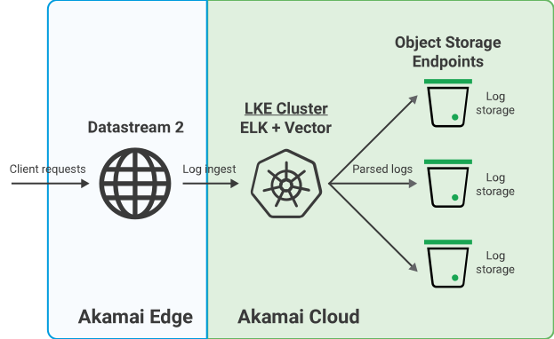
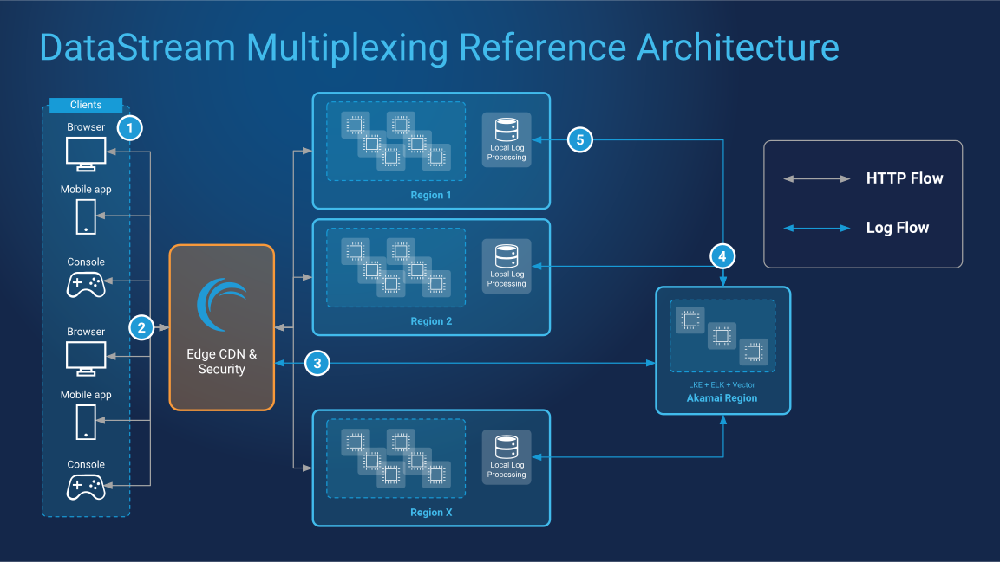

Having real-time visibility into log data can help determine how applications are managed and infrastructure is scaled. Obtaining logs from numerous sources (CDN, security, server-side, and more) is pivotal to identifying and resolving end-user issues. However, this can result in a complex infrastructure setup with varying levels of visibility needs and high egress costs due to large volumes of data.

One way to achieve an efficient, predictable, and cost-effective observability workflow is to implement a cloud-based multiplexing solution to ingest and parse log data before it’s sent to the relevant DevOps team. Combined with Akamai’s [DataStream](https://techdocs.akamai.com/datastream2/docs/welcome-datastream2) edge-based log reporting, multiplexing can help manage how and where logs are transmitted, improve data security, and reduce overall cost.

This guide outlines the business challenges of observability workflows, integration and migration need-to-knows, and illustrates a working multiplexing reference architecture using [Linode Kubernetes Engine (LKE)](/docs/products/compute/kubernetes/) running [Elastic Stack (ELK)](https://www.elastic.co/elastic-stack/) and [Vector](https://vector.dev/).

## DataStream and Multiplexing Workflow

Below are the high-level steps on how to use multiplexing with DataStream in an observability workflow.

1.  Edge servers running DataStream receive client requests.

1.  DataStream outputs log data as a single stream to an LKE cluster running a multiplexing software solution comprised of an ELK stack and Vector.

1.  ELK and Vector ingest log data. Logs are analyzed, parsed, and output to user-defined object storage endpoints.

1.  Regional Object Storage buckets are used to store parsed log data.

## Overcoming Challenges

### Managing Observability Needs Across Teams

*Use multiplexing to send log data to only those who need it.*

Many organizations, particularly large ones, require specific log data to be sent to specific teams across many geographic regions. But not every team in every region needs (or should have) every piece of data to achieve their required level of visibility. Sorting through unfiltered, unparsed log data is not only time consuming and error prone, but it is also an unnecessary security risk.

Introducing a multiplexing approach to an observability workflow ensures the relevant DevOps teams are getting the data they need - and only that data. This not only increases data security, but it can improve efficiency and reduce overall log storage costs.

### Large Data Volumes

*Reduce costs by avoiding the transmission of unnecessary data.*

Log data is essential to an effective observability workflow. But logs are vast, numerous, and continuous; large streams of logging data need to go somewhere, and if not properly parsed prior to arriving at their destination, can result in unnecessary storage and egress costs.

Multiplexing can help reduce these costs by sorting data ahead of time and directing parsed logs to specified destinations using data “identifiers” like log-specific metadata. Not only do logs get sent to the proper teams, but overall log storage is reduced by ensuring unneeded data doesn’t get sent in the first place.

### Maintaining Observability With Distributed Architecture

*Ensure varying log types are distributed wherever they are needed.*

Distributed architecture is a standard for high availability, high volume applications. With distributed architecture comes multiple regions, multiple VPCs, multiple microservices, and the logs that come with each component. In addition to large volumes of data, this can result in complex monitoring and visibility needs that may vary from region to region.

Coupling cloud-based multiplexing with DataStream edge logging allows you to control exactly how CDN, security, server-side, and other logs are processed and distributed across multi-region infrastructure.

### Integration and Migration Effort

The multiplexing solution in this guide does not require the migration of any application-critical software or data. This solution exists as a location-agnostic, cloud-based pipeline between your edge delivery infrastructure and log storage endpoints (i.e. Amazon S3-compatible buckets, Google Cloud Storage, etc.).

Using the following example, you can reduce your overall egress costs by pointing your cloud multiplexing architecture to Akamai’s Object Storage rather than a third-party object storage solution.

## DataStream With Multiplexing Design Diagram

The below diagram uses a single-region, scalable LKE cluster running ELK and Vector to ingest and parse a single stream of logs from DataStream. The parsed logs are then sent to regional log processing infrastructure made up of Object Storage buckets where they are processed and stored:

1.  **The request is made.** An end-user submits an application request.

1.  **Edge servers receive the request.** The request is received by Akamai’s edge infrastructure running DataStream. If not cached already on the edge, HTTP data for the end-user request is directed to a regional SaaS cluster running the application for the user-requested information.

    
    HTTP data transmission does not affect, and is unrelated to, the log-parsing, cloud-based multiplexing solution.
    

1.  **Logs are sent to cloud infrastructure for multiplexing.** DataStream captures and transmits log information based on the end-user request. Rather than sending unsorted logs to regional log processing infrastructure, logs are sent in a single stream to a single-region LKE cluster on Akamai Cloud.

1.  **Logs are parsed and distributed.** The LKE cluster running a multiplexing solution of ELK and Vector ingests, processes, sorts, and transmits parsed logs to regional, local log processing infrastructure.

1.  **Regional buckets receive and store parsed logs.** Local log processing infrastructure consisting of object storage buckets and software ingest and store the parsed logs based on data identifiers given during the parsing process. These buckets are located in the same regions as SaaS clusters running the application queried by the end-user.

### Systems and Components

-   **Edge CDN & Security:** Akamai’s edge infrastructure that receives and routes end-user requests and data.

-   **DataStream:** Akamai’s edge-native log reporting service, and one of the edge solutions used in this scenario. DataStream provides visibility into traffic delivery by capturing performance and security logs and then streaming that data to user-defined destinations.

-   **SaaS Clusters:** Clusters of nodes across multiple regions running application backends.

-   **Local Log Processing:** Object storage buckets and software used to ingest log data output by the LKE cluster running the log multiplexing solution. Located in the same regions as the application’s SaaS clusters.
    - Possible regional processing software options include a local ELK stack or TrafficPeak.

-   **LKE:** Linode Kubernetes Engine is Akamai Cloud Computing’s managed Kubernetes platform. Kubernetes clusters are quickly and efficiently deployed via the Cloud Manager, Linode CLI, or Linode API.

-   **ELK:** A software stack comprised of Elasticsearch, Kibana, and Logstash. The ELK stack reliably and securely takes data from any source, in any format, and then searches, analyzes, and visualizes that data.

-   **Vector:** Data parsing software used to collect, transform, and route input/output data, including logging information.