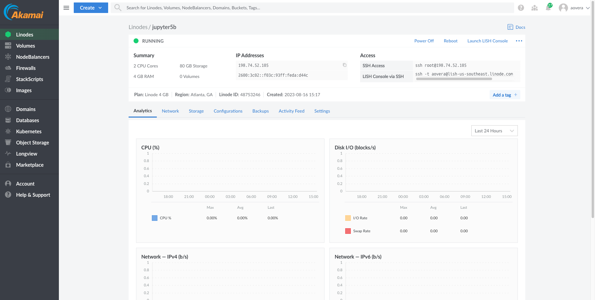
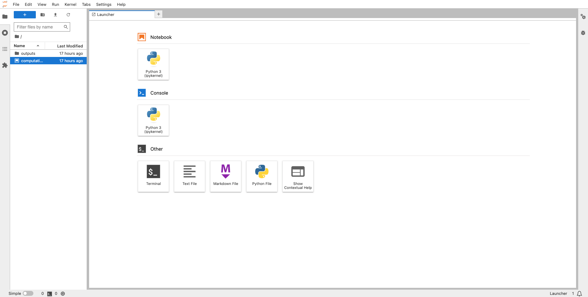
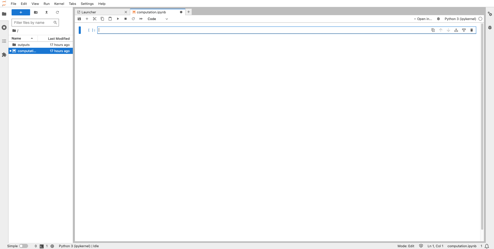
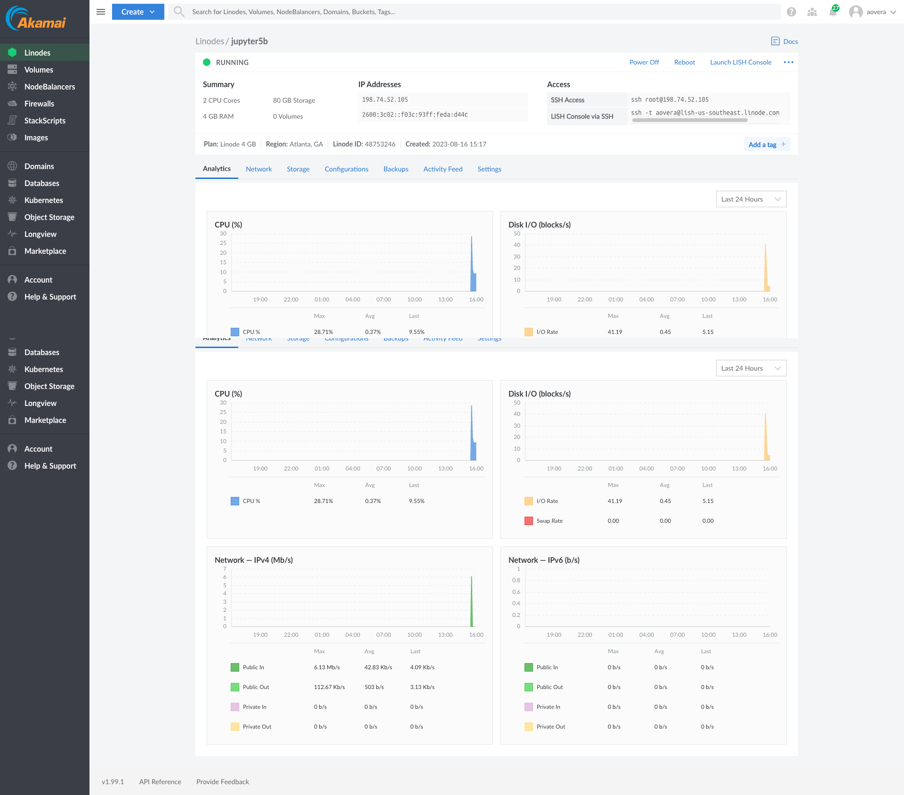

This article leverages Linode cloud infrastructure and app marketplace to cloud host a containerized Jupyter and MySQL application. The Linode app marketplace helps with cloud hosting and serves as an online store where the application can be accessed, interacted with, and purchased. With Linode, you can deploy in seconds, with simple app creation procedures, customization features, and deployment management service. The Linode Marketplace enables you to deploy a containerized Jupyter and MySQL application on a Linode compute instance without the hassle of the command line.

Before deploying to Linode, you need to get your image into the remote server. This can be achieved either by building the image on the remote machine or by using a fully built image on the remote server. The latter reduces unnecessary complexity, especially if you deploy images on a public repository like Docker Hub.

Docker Hub serves as a community of repositories where Docker users create, test, manage, store, and share container images. It's free to create public repositories on Docker Hub.

## Before You Begin

1.  If you have not already done so, create a Linode account. See our [Getting Started with Linode](/docs/products/platform/get-started/) guide.

1.  This guide requires a desktop with at least 4 GB of memory and approximately 10 GB of free space. The commands in this guide are written for Ubuntu 22.04 LTS, but should generally work for other Linux distributions and operating systems.

1.  Docker is needed to follow this tutorial. The easiest way to install Docker is via the Docker Desktop package. Download the appropriate package for your operating system and follow the installation guide [here](https://docs.docker.com/engine/install/) to ensure that Docker is installed.

1.  To better understand Jupyter/Docker workflows, read the rest of the articles in this series:

    -   [How to Set Up Jupyter with Docker](/docs/guides/jupyter-docker-setup-guide/)
    -   [Managing Jupyter Data in Docker Images and Containers](/docs/guides/manage-jupyter-data-docker/)
    -   [Advanced Jupyter Data Persistence with MySQL and Docker](/docs/guides/persist-jupyter-data-mysql-docker/)

1.  Follow the instructions in our previous guide on Jupyter/Docker workflows, [Simplify Multi-Container Orchestration with Docker Compose](/docs/guides/multi-container-orchestration-docker-compose/) to set up the required examples.

## Configure Docker Hub

1.  [Sign up on Docker Hub](https://hub.docker.com/signup) if you don't already have an account.

1.  Log in to your Docker Hub account and click on the **Repositories** navigation bar to create a new repository using a repository name and an optional description. You should see a UI similar to:

    

1.  Open Docker Desktop, sign in with your Docker Hub account credentials, and follow the instructions to configure it.

1.  Create a connection between Docker Hub and the local machine. Open a terminal and log in to Docker:

    ```command {title="Local Machine Terminal"}
    docker login
    ```

    When prompted, enter the passphrase you created during the previous step.

## Jupyter Container

1.  View the images created by Docker compose files:

    ```command {title="Local Machine Terminal"}
    docker images
    ```

    ```output
    REPOSITORY        TAG       IMAGE ID       CREATED        SIZE
    jupyter-jupyter   latest    1d4520408d5e   17 hours ago   2.78GB
    mysql             latest    99afc808f15b   5 days ago     577MB
    ```

    ```command {title="Local Machine Terminal"}
    docker images --no-trunc
    ```

    ```output
    REPOSITORY        TAG       IMAGE ID                                                                  CREATED        SIZE
    jupyter-jupyter   latest    sha256:1d4520408d5ee6b660e62334cdfc143afcc1ef3c0113fc301e17b5f4737d111e   17 hours ago   2.78GB
    mysql             latest    sha256:99afc808f15be15cd1d9890394123034a79d1f3204d5b417d8558990cdf30167   5 days ago     577MB
    ```

1.  Upon successful login, before we push our image to the created repository, we have to rename our image to the standard format following `YOUR_DOCKER_HUB_USERNAME/REPOSITORY_NAME`. We rename our docker image as follows:

    ```command {title="Local Machine Terminal"}
    docker tag jupyter-jupyter YOUR_DOCKER_HUB_USERNAME/project_jupyter
    ```

1.  Lastly, we push the image to Docker Hub as follows:

    ```command {title="Local Machine Terminal"}
    docker push YOUR_DOCKER_HUB_USERNAME/project_jupyter
    ```

    ```output
    Using default tag: latest
    The push refers to repository [docker.io/adamovera/project_jupyter]
    86cc485e8ab4: Preparing
    86cc485e8ab4: Pushed
    81a7947c61f0: Pushed
    b4a7610f96cf: Pushed
    18c5dbb7b6ec: Pushed
    4288ed68a459: Mounted from jupyter/minimal-notebook
    d5f052751091: Mounted from jupyter/minimal-notebook
    64f041501ddf: Mounted from jupyter/minimal-notebook
    43f5993bcd33: Mounted from jupyter/minimal-notebook
    5f70bf18a086: Mounted from jupyter/minimal-notebook
    dd6b3fb91d62: Mounted from jupyter/minimal-notebook
    83338621985a: Mounted from jupyter/minimal-notebook
    f0e8adcfef2b: Mounted from jupyter/minimal-notebook
    7923ea5e006f: Mounted from jupyter/minimal-notebook
    087be8ae3919: Mounted from jupyter/minimal-notebook
    7a53c9972478: Mounted from jupyter/minimal-notebook
    1fe6bbba51b8: Mounted from jupyter/minimal-notebook
    fdc54c98378c: Mounted from jupyter/minimal-notebook
    804579901ce2: Mounted from jupyter/minimal-notebook
    d4625bff453e: Mounted from jupyter/minimal-notebook
    2b8f6f87a0c2: Mounted from jupyter/minimal-notebook
    1b86de443de6: Mounted from jupyter/minimal-notebook
    010986acc545: Mounted from jupyter/minimal-notebook
    59c56aee1fb4: Mounted from jupyter/minimal-notebook
    latest: digest: sha256:39fc8614f566b5a5ef174cb8c6245f67ac70df0539b4c28845e40490bf9c70ca size: 6164
    ```

    Once completed, your Docker Hub repository should look like this:

    

1.  To pull this image from Docker Hub, use the `docker pull` command using the syntax `docker pull YOUR_DOCKER_HUB_USERNAME/REPOSITORY_NAME:` as follows:

    ```command {title="Local Machine Terminal"}
    docker pull YOUR_DOCKER_HUB_USERNAME/project_jupyter
    ```

    ```output
    Using default tag: latest
    latest: Pulling from adamovera/project_jupyter
    Digest: sha256:39fc8614f566b5a5ef174cb8c6245f67ac70df0539b4c28845e40490bf9c70ca
    Status: Image is up to date for adamovera/project_jupyter:latest
    docker.io/adamovera/project_jupyter:latest

    What's Next?
      View summary of image vulnerabilities and recommendations → docker scout quickview adamovera/project_jupyter
    ```

1.  With the image successfully pulled, test the application using the `docker run` command following the syntax `docker run YOUR_DOCKER_HUB_USERNAME/REPOSITORY_NAME` as follows:

    ```command {title="Local Machine Terminal"}
    docker run YOUR_DOCKER_HUB_USERNAME/project_jupyter
    ```

    ```output
    Entered start.sh with args: jupyter lab
    Executing the command: jupyter lab
    [I 2023-08-16 14:58:15.472 ServerApp] Package jupyterlab took 0.0000s to import
    [I 2023-08-16 14:58:15.513 ServerApp] Package jupyter_lsp took 0.0406s to import
    [W 2023-08-16 14:58:15.514 ServerApp] A `_jupyter_server_extension_points` function was not found in jupyter_lsp. Instead, a `_jupyter_server_extension_paths` function was found and will be used for now. This function name will be deprecated in future releases of Jupyter Server.
    [I 2023-08-16 14:58:15.536 ServerApp] Package jupyter_server_terminals took 0.0222s to import
    [I 2023-08-16 14:58:15.543 ServerApp] Package nbclassic took 0.0059s to import
    [W 2023-08-16 14:58:15.552 ServerApp] A `_jupyter_server_extension_points` function was not found in nbclassic. Instead, a `_jupyter_server_extension_paths` function was found and will be used for now. This function name will be deprecated in future releases of Jupyter Server.
    [I 2023-08-16 14:58:15.553 ServerApp] Package notebook took 0.0000s to import
    [I 2023-08-16 14:58:15.558 ServerApp] Package notebook_shim took 0.0000s to import
    [W 2023-08-16 14:58:15.559 ServerApp] A `_jupyter_server_extension_points` function was not found in notebook_shim. Instead, a `_jupyter_server_extension_paths` function was found and will be used for now. This function name will be deprecated in future releases of Jupyter Server.
    [I 2023-08-16 14:58:15.561 ServerApp] jupyter_lsp | extension was successfully linked.
    [I 2023-08-16 14:58:15.569 ServerApp] jupyter_server_terminals | extension was successfully linked.
    [I 2023-08-16 14:58:15.581 ServerApp] jupyterlab | extension was successfully linked.
    [I 2023-08-16 14:58:15.586 ServerApp] nbclassic | extension was successfully linked.
    [I 2023-08-16 14:58:15.591 ServerApp] notebook | extension was successfully linked.
    [I 2023-08-16 14:58:15.596 ServerApp] Writing Jupyter server cookie secret to /home/jovyan/.local/share/jupyter/runtime/jupyter_cookie_secret
    [I 2023-08-16 14:58:16.325 ServerApp] notebook_shim | extension was successfully linked.
    [I 2023-08-16 14:58:16.363 ServerApp] notebook_shim | extension was successfully loaded.
    [I 2023-08-16 14:58:16.374 ServerApp] jupyter_lsp | extension was successfully loaded.
    [I 2023-08-16 14:58:16.377 ServerApp] jupyter_server_terminals | extension was successfully loaded.
    [I 2023-08-16 14:58:16.381 LabApp] JupyterLab extension loaded from /opt/conda/lib/python3.11/site-packages/jupyterlab
    [I 2023-08-16 14:58:16.381 LabApp] JupyterLab application directory is /opt/conda/share/jupyter/lab
    [I 2023-08-16 14:58:16.383 LabApp] Extension Manager is 'pypi'.
    [I 2023-08-16 14:58:16.387 ServerApp] jupyterlab | extension was successfully loaded.
    [I 2023-08-16 14:58:16.403 ServerApp] nbclassic | extension was successfully loaded.
    [I 2023-08-16 14:58:16.407 ServerApp] notebook | extension was successfully loaded.
    [I 2023-08-16 14:58:16.408 ServerApp] Serving notebooks from local directory: /work
    [I 2023-08-16 14:58:16.408 ServerApp] Jupyter Server 2.7.0 is running at:
    [I 2023-08-16 14:58:16.408 ServerApp] http://973739bb0b44:8888/lab?token=cbd51d375ef8bef4483f309cedd93d55242fd0b268ac0374
    [I 2023-08-16 14:58:16.408 ServerApp]     http://127.0.0.1:8888/lab?token=cbd51d375ef8bef4483f309cedd93d55242fd0b268ac0374
    [I 2023-08-16 14:58:16.408 ServerApp] Use Control-C to stop this server and shut down all kernels (twice to skip confirmation).
    [C 2023-08-16 14:58:16.413 ServerApp]

        To access the server, open this file in a browser:
            file:///home/jovyan/.local/share/jupyter/runtime/jpserver-7-open.html
        Or copy and paste one of these URLs:
            http://973739bb0b44:8888/lab?token=cbd51d375ef8bef4483f309cedd93d55242fd0b268ac0374
            http://127.0.0.1:8888/lab?token=cbd51d375ef8bef4483f309cedd93d55242fd0b268ac0374
    [I 2023-08-16 14:58:19.106 ServerApp] Skipped non-installed server(s): bash-language-server, dockerfile-language-server-nodejs, javascript-typescript-langserver, jedi-language-server, julia-language-server, pyright, python-language-server, python-lsp-server, r-languageserver, sql-language-server, texlab, typescript-language-server, unified-language-server, vscode-css-languageserver-bin, vscode-html-languageserver-bin, vscode-json-languageserver-bin, yaml-language-server
    ```

## MySQL Container

Utilize the official image available on Docker Hub for the MySQL database container.

Use the following procedures to get started with Linode's Marketplace and deploy the jupyter workflow:

1.  If you have not already done so, [create a Linode account](https://login.linode.com/signup?promo=docs1000822).

1.  Log in to the [Linode Cloud Manager](https://cloud.linode.com/) and select the **Marketplace** link from the left navigation menu. This should display the Linode **Create** page with the **Marketplace** tab preselected.

1.  Under the **Select App** section, select **Docker**.

1.  From the **Docker** selection, there are advanced optional configurations, including limited users, custom domain, resources to download (e.g. the URL of a hosted Dockerfile or Docker compose file), and docker commands to be run during the application creation process. Ignore these configurations.

1.  Select the `Debian` operating system release `11` as the base image.

1.  Use [Linode Speed Tests](https://www.linode.com/speed-test/) to find the best region for your current location (e.g. `Atlanta, United States`).

1.  Select the **Linode Plan** that suits your workload. **Shared CPU** plans should be fine for this exercise.

1.  Provide a root password, which is required to deploy the docker image.

1.  Click the **Create Linode** button to create a Linode compute instance with Docker installed and ready-to-use upon completion. The Linode compute instance dashboard should look similar to:

    

1.  Launch the **LISH(Linode Shell)** console to access the Docker compute instance with the login as `root` and the root password you provided during setup.

1.  In the LISH shell, create a `jupyter-mysql-net` network for the containers:

    ```command {title="LISH Console"}
    docker network create jupyter-mysql-net
    ```

1.  First, pull and run the official MySQL image on Docker Hub:

    ```command {title="LISH Console"}
    docker run -d --name mysql-db --network jupyter-mysql-net -e MYSQL_ROOT_PASSWORD=my-secret-pw mysql
    ```

    ```output
    root@139-144-16-32:~# docker run -d --name mysql-db --network jupyter-mysql-net -e MYSQL_ROOT_PASSWORD=my-secret-pw mysql
    Unable to find image 'mysql:latest' locally
    latest: Pulling from library/mysql
    b193354265ba: Pull complete
    14a15c0bb358: Pull complete
    02da291ad1e4: Pull complete
    9a89a1d664ee: Pull complete
    a24ae6513051: Pull complete
    b85424247193: Pull complete
    9a240a3b3d51: Pull complete
    8bf57120f71f: Pull complete
    c64090e82a0b: Pull complete
    af7c7515d542: Pull complete
    Digest: sha256:c0455ac041844b5e65cd08571387fa5b50ab2a6179557fd938298cab13acf0dd
    Status: Downloaded newer image for mysql:latest
    079c9469f94030e62799555f9c72294448d832b957b15ca64f9555697175795b
    [  454.460600] br-2e31c2b8dd2c: port 1(veth4bce5b5) entered blocking state
    [  454.462036] br-2e31c2b8dd2c: port 1(veth4bce5b5) entered disabled state
    [  454.463384] device veth4bce5b5 entered promiscuous mode
    [  457.439108] eth0: renamed from vetha8438f4
    [  457.462403] IPv6: ADDRCONF(NETDEV_CHANGE): veth4bce5b5: link becomes ready
    [  457.464098] br-2e31c2b8dd2c: port 1(veth4bce5b5) entered blocking state
    [  457.465522] br-2e31c2b8dd2c: port 1(veth4bce5b5) entered forwarding state
    [  457.467039] IPv6: ADDRCONF(NETDEV_CHANGE): br-2e31c2b8dd2c: link becomes ready
    ```

1.  Now pull and run the custom jupyter image you previously deployed to Docker Hub:

    ```command {title="LISH Console"}
    docker run -d -it -p 8888:8888 --name custom-jupyter-container --network jupyter-mysql-net YOUR_DOCKER_HUB_USERNAME/project_jupyter
    ```

    ```output
    Unable to find image 'adamovera/project_jupyter:latest' locally
    latest: Pulling from adamovera/project_jupyter
    3153aa388d02: Pulling fs layer
    f0529c19060e: Pull complete
    1c2b1042b031: Pull complete
    4f4fb700ef54: Pull complete
    12ca74889a70: Pull complete
    9bba9ef29470: Pull complete
    43fdba304339: Pull complete
    47b41348c4c8: Pull complete
    27cef9c9a351: Pull complete
    24dbc6cc7db0: Pull complete
    0bf51fbb6ac4: Pull complete
    10b6711c90bf: Pull complete
    59b8f0e3ebac: Pull complete
    d9d97b84f7e6: Pull complete
    ec03b0ceb729: Pull complete
    66c5cd0f13fe: Pull complete
    c97d42be65dc: Pull complete
    50f93a1d6512: Pull complete
    547f6883c3bc: Pull complete
    912c4aa4f910: Pull complete
    7a6cca0c964c: Pull complete
    0e71f3dff7cb: Pull complete
    463a577b2ffe: Pull complete
    f7147e147308: Pull complete
    Digest: sha256:39fc8614f566b5a5ef174cb8c6245f67ac70df0539b4c28845e40490bf9c70ca
    Status: Downloaded newer image for adamovera/project_jupyter:latest
    41f991d7e160d6a09b44fc994fdc2a6ee07481519cd60146f845178d04599f94
    ```

1.  Upon successful deployment, use `docker logs` to retrieve the Jupyter UI token URL by logging the Jupyter container:

    ```command{title="LISH Console"}
    docker logs custom-jupyter-container
    ```

    ```output
    Entered start.sh with args: jupyter lab
    Executing the command: jupyter lab
    [I 2023-08-16 15:25:43.354 ServerApp] Package jupyterlab took 0.0000s to import
    [I 2023-08-16 15:25:43.372 ServerApp] Package jupyter_lsp took 0.0172s to import
    [W 2023-08-16 15:25:43.373 ServerApp] A `_jupyter_server_extension_points` function was not found in jupyter_lsp. Instead, a `_jupyter_server_extension_paths` function was found and will be used for now. This function name will be deprecated in future releases of Jupyter Server.
    [I 2023-08-16 15:25:43.381 ServerApp] Package jupyter_server_terminals took 0.0075s to import
    [I 2023-08-16 15:25:43.384 ServerApp] Package nbclassic took 0.0027s to import
    [W 2023-08-16 15:25:43.386 ServerApp] A `_jupyter_server_extension_points` function was not found in nbclassic. Instead, a `_jupyter_server_extension_paths` function was found and will be used for now. This function name will be deprecated in future releases of Jupyter Server.
    [I 2023-08-16 15:25:43.387 ServerApp] Package notebook took 0.0000s to import
    [I 2023-08-16 15:25:43.390 ServerApp] Package notebook_shim took 0.0000s to import
    [W 2023-08-16 15:25:43.390 ServerApp] A `_jupyter_server_extension_points` function was not found in notebook_shim. Instead, a `_jupyter_server_extension_paths` function was found and will be used for now. This function name will be deprecated in future releases of Jupyter Server.
    [I 2023-08-16 15:25:43.391 ServerApp] jupyter_lsp | extension was successfully linked.
    [I 2023-08-16 15:25:43.397 ServerApp] jupyter_server_terminals | extension was successfully linked.
    [I 2023-08-16 15:25:43.403 ServerApp] jupyterlab | extension was successfully linked.
    [I 2023-08-16 15:25:43.408 ServerApp] nbclassic | extension was successfully linked.
    [I 2023-08-16 15:25:43.416 ServerApp] notebook | extension was successfully linked.
    [I 2023-08-16 15:25:43.418 ServerApp] Writing Jupyter server cookie secret to /home/jovyan/.local/share/jupyter/runtime/jupyter_cookie_secret
    [I 2023-08-16 15:25:43.743 ServerApp] notebook_shim | extension was successfully linked.
    [I 2023-08-16 15:25:43.768 ServerApp] notebook_shim | extension was successfully loaded.
    [I 2023-08-16 15:25:43.772 ServerApp] jupyter_lsp | extension was successfully loaded.
    [I 2023-08-16 15:25:43.775 ServerApp] jupyter_server_terminals | extension was successfully loaded.
    [I 2023-08-16 15:25:43.778 LabApp] JupyterLab extension loaded from /opt/conda/lib/python3.11/site-packages/jupyterlab
    [I 2023-08-16 15:25:43.778 LabApp] JupyterLab application directory is /opt/conda/share/jupyter/lab
    [I 2023-08-16 15:25:43.779 LabApp] Extension Manager is 'pypi'.
    [I 2023-08-16 15:25:43.783 ServerApp] jupyterlab | extension was successfully loaded.

      _   _          _      _
     | | | |_ __  __| |__ _| |_ ___
     | |_| | '_ \/ _` / _` |  _/ -_)
      \___/| .__/\__,_\__,_|\__\___|
           |_|

    Read the migration plan to Notebook 7 to learn about the new features and the actions to take if you are using extensions.

    https://jupyter-notebook.readthedocs.io/en/latest/migrate_to_notebook7.html

    Please note that updating to Notebook 7 might break some of your extensions.

    [I 2023-08-16 15:25:43.789 ServerApp] nbclassic | extension was successfully loaded.
    [I 2023-08-16 15:25:43.793 ServerApp] notebook | extension was successfully loaded.
    [I 2023-08-16 15:25:43.795 ServerApp] Serving notebooks from local directory: /work
    [I 2023-08-16 15:25:43.795 ServerApp] Jupyter Server 2.7.0 is running at:
    [I 2023-08-16 15:25:43.795 ServerApp] http://41f991d7e160:8888/lab?token=f5a93b339e182a23bc7680586fb291549c78f1fb9fc78324
    [I 2023-08-16 15:25:43.795 ServerApp]     http://127.0.0.1:8888/lab?token=f5a93b339e182a23bc7680586fb291549c78f1fb9fc78324
    [I 2023-08-16 15:25:43.795 ServerApp] Use Control-C to stop this server and shut down all kernels (twice to skip confirmation).
    [C 2023-08-16 15:25:43.800 ServerApp]

        To access the server, open this file in a browser:
            file:///home/jovyan/.local/share/jupyter/runtime/jpserver-8-open.html
        Or copy and paste one of these URLs:
            http://41f991d7e160:8888/lab?token=f5a93b339e182a23bc7680586fb291549c78f1fb9fc78324
            http://127.0.0.1:8888/lab?token=f5a93b339e182a23bc7680586fb291549c78f1fb9fc78324
    [I 2023-08-16 15:25:44.715 ServerApp] Skipped non-installed server(s): bash-language-server, dockerfile-language-server-nodejs, javascript-typescript-langserver, jedi-language-server, julia-language-server, pyright, python-language-server, python-lsp-server, r-languageserver, sql-language-server, texlab, typescript-language-server, unified-language-server, vscode-css-languageserver-bin, vscode-html-languageserver-bin, vscode-json-languageserver-bin, yaml-language-server
    ```

1.  To view the Jupyter UI, open the `http://127.0.0.1:8888/lab?token=XXXX` link in a Web browser, but replace `127.0.0.1` with the Linode's IP address following the syntax `http://LINODE_IP_ADDRESS:8888/lab?token=XXXX`:

    

1.  Double-click on the `computation.ipynb` notebook in the left pane to open it:

    

1.  Test the containerized database hosted on Linode by persisting data to it. Paste the following code into the `computation.ipynb` notebook then press the play button to run it:

    ```file {title="computation.ipynb" lang="python"}
    import pandas as pd

    # data url in ArcGIS Hub
    data_url = "https://opendata.arcgis.com/api/v3/datasets/aaf4274109f34ffd93ac71267c5b276e_0/downloads/data?format=csv&spatialRefId=4326&where=1%3D1"
    data = pd.read_csv(data_url, index_col=0, nrows=1000)
    data.to_csv("outputs/Motorized-Foot-Scooter-Trips-2018.csv", index=False)

    # import neccessary libraries
    import mysql.connector
    from mysql.connector import Error
    import os

    # Reading enviroment variables
    mysql_user = os.getenv('MYSQL_USER')
    mysql_password = os.getenv('MYSQL_PASSWORD')

    # Creating MYSQL connection
    try:
        mydb_connection = mysql.connector.connect(
        host="mysql-db",
        user=mysql_user,
        password=mysql_password)
        # Check connection
        if mydb_connection.is_connected():
            print("connection successfully")
            mycursor = mydb_connection.cursor()
            # Create database
            database_name = "scooter_trips"
            mycursor.execute(f"CREATE DATABASE {database_name}")

    except Error:
        print("Error while connecting to MySQL", Error)
    ```

    This command successfully connects to the containerized database hosted on Linode and creates a database named `scooter_trips` in it:

    ```output
    connection successfully
    ```

1.  Next, write the downloaded geospatial data to a table in the `scooter_trips` database:

    ```file {title="computation.ipynb" lang="python"}
    try:
        mydb_connection = mysql.connector.connect(
        host="mysql-db",
        user=mysql_user,
        password=mysql_password,
        database="scooter_trips") # Added the created database to the connection

        # Check connection
        if mydb_connection.is_connected():
            print("connection successfully")
            mycursor = mydb_connection.cursor()
            mycursor.execute("SELECT database();")
            record = mycursor.fetchone()
            print("You're connected to database: ", record)
            table_name = "Motorized_Foot_Scooter_Trips_2018"
            mycursor.execute(f"CREATE TABLE {table_name} (TripID VARCHAR(255), TripDuration VARCHAR(255), TripDistance VARCHAR(255), StartTime VARCHAR(255), EndTime VARCHAR(255), StartCenterlineID VARCHAR(255), StartCenterlineType VARCHAR(255), EndCenterlineID VARCHAR(255), EndCenterlineType VARCHAR(255))")
            print(f"{table_name} table created")
            for index, row in data.iterrows():
                sql = f"INSERT INTO scooter_trips.{table_name} (TripID, TripDuration, TripDistance, StartTime, EndTime, StartCenterlineID, EndCenterlineID) VALUES (%s,%s,%s,%s,%s,%s,%s)"
                mycursor.execute(sql, list(row))
                # the connection is not auto committed by default, so we must commit to save our changes
                mydb_connection.commit()
    except Error:
        print("Error while connecting to MySQL", Error)
    ```

    This command successfully persists data to the containerized database:

    ```output
    connection successfully
    You're connected to database:  ('scooter_trips',)
    Motorized_Foot_Scooter_Trips_2018 table created
    ```

1.  You can now query data from the database:

    ```file {title="computation.ipynb", lang="python"}
    try:
        mydb_connection = mysql.connector.connect(
        host="mysql-db",
        user=mysql_user,
        password=mysql_password,
        database="scooter_trips") # Added the created database to the connection

        # Check connection
        if mydb_connection.is_connected():
            print("connection successfully")
            mycursor = mydb_connection.cursor()
            mycursor.execute("SELECT * FROM Motorized_Foot_Scooter_Trips_2018 limit 5")
            myresult = mycursor.fetchall()
            for x in myresult:
                print(x)
    except Error:
        print("Error while connecting to MySQL", Error)
    ```

    ```output
    connection successfully
    ('154744', '256', '1108', '2018/07/10 12:00:00+00', '2018/07/10 12:00:00+00', '16914', '16914')
    ('154745', '185', '519', '2018/07/10 12:00:00+00', '2018/07/10 12:00:00+00', '17104', '17872')
    ('154742', '177', '496', '2018/07/10 12:30:00+00', '2018/07/10 12:30:00+00', '17117', '17865')
    ('154743', '344', '929', '2018/07/10 12:30:00+00', '2018/07/10 12:30:00+00', '16632', '17117')
    ('154741', '176', '588', '2018/07/10 12:59:59+00', '2018/07/10 12:59:59+00', '21654', '17250')
    ```

Everything works as it should, fully containerized and cloud-hosted on Linode. You can observe the application's resources utilization, work load, network traffic, and configuration from the Linode compute instance's dashboard:



## Conclusion

This tutorial covers deploying a functioning Jupyter and MySQL application, containerized with Docker, to the cloud with the Linode app marketplace. However, the lessons learned here can be applied to any application. Knowing how to deploy images to Docker Hub and then re-deploy them to a cloud server can open many doors.

This concludes our series on Jupyter/Docker workflows. The rest of the series teaches you numerous ways to create a Jupyter instance, store its data, and containerize it. Find those links above in the [Before You Begin](/docs/guides/deploy-jupyter-docker-linode/#before-you-begin) section to learn more.