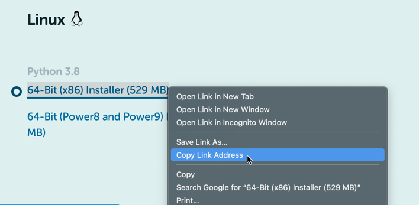

## Install Anaconda on Ubuntu

Installing Anaconda on your Linode (or other Linux system) via the CLI may look daunting, but don't let it scare you. It is possible to get it fully installed without using a graphical environment.

After following all of the steps in ["Before You Begin"](#before-you-begin), you will want to download the most recent version of the Anaconda installer (as of the writing of this guide, that was 2020.11).

1.  Connect to your Linode by SSH (or Lish) and log in with your username and password.

2.  Ensure you are in the *Bash* shell by entering `bash`.

3.  If you don't have a Downloads directory already, create one by entering `mkdir Downloads`.

4.  Switch to your new Downloads directory by entering `cd Downloads`.

5.  In your browser, go to [Anaconda Individual Edition downloads](https://www.anaconda.com/products/individual#Downloads) and copy the link of the "64-Bit (x86) Installer" (don't download it).

6.  At the command prompt of your terminal, type `wget` and a space, then paste the download link from the browser. It should look like `wget https://repo.anaconda.com/archive/Anaconda3-2020.11-Linux-x86_64.sh` (the "Anaconda3-2020.11" portion will change as new versions are released).

4.  Press Enter (or Return) and let it run (the file is somewhat large and takes a little while to download fully).

5.  Once the download is complete and you're back at the command prompt, enter `bash ~/Downloads/Anaconda3-2020.11-Linux-x86_64.sh` (remember, the "Anaconda3-2020.11" portion will change as new versions are released).

6.  Scroll through the license agreement and agree to it by entering `Yes`.

7.  The installer will prompt you to press Enter (or Return) to accept the default install location (which will be a directory named "anaconda3" in your home directory). We recommend accepting the default install location. The installer will run for a few minutes.

8.  After running for a few minutes, the installer will prompt you "to initialize Anaconda3 by running `conda init`." We recommend entering `yes` (if you enter `no`, conda will not modify your shell scripts).

9.  The installer is done when you see this output:
    
Thank you for installing Anaconda!


10. For the installation to take effect, enter `source ~/.bashrc`.

11. To verify the installation, enter `conda info`. The output should look something like this:
    
     active environment : base
    active env location : /home/example_user/anaconda3
            shell level : 1
       user config file : /home/example_user/.condarc
 populated config files :
          conda version : 4.10.1
    conda-build version : 3.20.5
         python version : 3.8.5.final.0
       virtual packages : __linux=5.4.0=0
                          __glibc=2.31=0
                          __unix=0=0
                          __archspec=1=x86_64
       base environment : /home/example_user/anaconda3  (writable)
      conda av data dir : /home/example_user/anaconda3/etc/conda
  conda av metadata url : https://repo.anaconda.com/pkgs/main
           channel URLs : https://repo.anaconda.com/pkgs/main/linux-64
                          https://repo.anaconda.com/pkgs/main/noarch
                          https://repo.anaconda.com/pkgs/r/linux-64
                          https://repo.anaconda.com/pkgs/r/noarch
          package cache : /home/example_user/anaconda3/pkgs
                          /home/example_user/.conda/pkgs
       envs directories : /home/example_user/anaconda3/envs
                          /home/example_user/.conda/envs
               platform : linux-64
             user-agent : conda/4.10.1 requests/2.25.1 CPython/3.8.5 Linux/5.4.0-72-generic ubuntu/20.04.2 glibc/2.31
                UID:GID : 1000:1000
             netrc file : None
           offline mode : False


12. Lastly, remove the installer file by typing `rm`, a space, `Anaconda`, and then pressing Tab. You should then see a command that looks like `rm Anaconda3-2020.11-Linux-x86_64.sh`
    
If it reads `rm anaconda3/`, erase that command immediately  (it will delete everything you just installed!) and ensure you are in your Downloads directory before going further.


## Update Anaconda on Ubuntu

Much like updating Ubuntu, there are two steps in updating Anaconda. After logging into your Linode via SSH or opening the terminal application on another system:

1.  Update the conda utility by entering `conda update conda`.

2.  Once that's finished, update Anaconda by entering `conda update anaconda`.

## Further Reading

-   Anaconda has an extensive knowledge base for Anaconda Individual Edition (and other versions) [here](https://docs.anaconda.com/anaconda/).

-   Especially important for CLI users is getting to know the conda utility. The conda project has a "20-minute guide to getting started with conda" available [here](https://conda.io/projects/conda/en/latest/user-guide/getting-started.html).