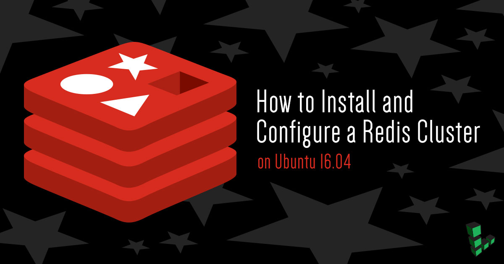
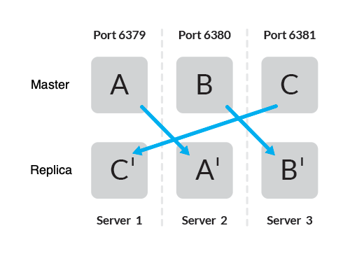
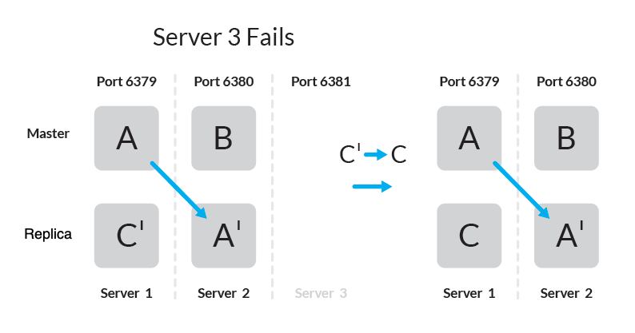

Redis is a NoSQL database used for large-scale storage that allows for fast reads and writes of its data store. Redis clusters are a popular tool for caches, queues, and more because of their potential for scalability and speed. This guide aims to create a cluster using three Linodes to demonstrate sharding. Afterward, a cluster replica is promoted to a master, which provides insurance in the event of a failure.

Redis as an in-memory store allows for extremely fast operations such as counting, caching, queuing, and more. A cluster setup increases the reliability of Redis by reducing the points of failure.

Prior to starting, we recommend familiarizing yourself with the following:

* [Firewall settings using iptables or ufw](/docs/guides/configure-firewall-with-ufw/)
* [Getting Started with VLANs](/docs/products/networking/vlans/get-started/)
* [Master-Replicas Replication](/docs/guides/how-to-install-a-redis-server-on-ubuntu-or-debian8/)

### Redis Sentinel or Redis Cluster?

Some wonder if a Redis cluster or Redis Sentinel makes more sense for their environment.

Redis Sentinel allows for failover when a master node fails by automatically promoting one of its replica nodes. However, Sentinel only uses a single master node to handle all data traffic at all times. Effectively, Sentinel is a Redis server backup. If you have a small environment, Sentinel might make more sense for you. See Redis's [documentation for more information](https://redis.io/topics/sentinel).

A Redis cluster can provide the same backup protection as Sentinel, but it differs by distributing data traffic across all of its nodes. This allows for an environment with high traffic to better deal with the demands of that traffic, as opposed to pushing it all through the master node.

## Install Redis on Each Linode

Depending on your version of Linux, it may be possible to install Redis through a package manager. Only Redis 3.0 and above supports clustering. The steps below are for installing the latest stable branch of Redis.

1.  Ensure your system is upgraded, then install the dependencies:

        sudo apt-get update && sudo apt-get upgrade
        sudo apt install make gcc libc6-dev tcl

    
Alternatively, you can install the "build-essential" meta-package to load the dependencies for Redis:

        sudo apt install build-essential tcl


2.  From the documentation, download the current stable branch, then extract:

        wget http://download.redis.io/redis-stable.tar.gz
        tar xvzf redis-stable.tar.gz
        cd redis-stable
        sudo make install

3.  Ensure the installation is successful by running:

        make test

    If the installation is successful, the console will output:

    >\o/ All tests passed without errors!

4.  Repeat installation for each server that will be part of the cluster.

## Configure Redis Masters and Replicas

This guide manually connects each of the masters and replicas across three Linodes. Consider using [tmux](/docs/guides/persistent-terminal-sessions-with-tmux/) for the management of multiple terminal windows.

This guide uses a minimum of six nodes with the following topology:



This setup uses three Linodes running two instances of Redis server per Linode: one master node and one replica node. First, you must ensure that each host is independent. You can then consider adding nodes if there is a need to maintain uptime requirements.

1.  SSH into **Server 1**. Navigate to `redis-stable/` then copy `redis.conf`. Configuration files in this guide are named consistent with the figure above:

        cp redis.conf a_master.conf
        cp redis.conf c_replica.conf

2.  In `a_master.conf`, add the following lines to the end of the file, replacing `192.0.2.1` with the IP address of your Linode.

    
bind 127.0.0.1 192.0.2.1
protected-mode no
port 6379
pidfile /var/run/redis_6379.pid
cluster-enabled yes
cluster-config-file nodes-6379.conf
cluster-node-timeout 15000


    
Without taking additional precautions, your Redis nodes may be exposed to the public internet via their respective public IP addresses. This means your nodes may be vulnerable to automated attacks. For more information, see [Redis Security](https://redis.io/topics/security).

To protect your Redis cluster from outside threats, consider utilizing [Cloud Firewalls](/docs/products/networking/cloud-firewall/) or [VLANs](/docs/products/networking/vlans/) to limit access to your cluster Linodes.

When using VLANs, replace `192.0.2.1` with the respective Linode's IPAM address in each configuration file.


3.  In `c_replica.conf`, the configuration is similar except for an update of the port number. `redis-cli` will be used later to configure this into a replica for the appropriate master.

    
bind 127.0.0.1 192.0.2.1
protected-mode no
port 6381
pidfile /var/run/redis_6381.pid
cluster-enabled yes
cluster-config-file nodes-6381.conf
cluster-node-timeout 15000


4.  Repeat this process across the remaining two Linodes, taking care to specify the port numbers for all master-replica pairs.  The ports in this guide range from 6379 to 6381.

    | Server | Master | Master Filename | Replica | Replica Filename |
    |:-------|:-------|:----------------|:--------|:-----------------|
    |    1   |  6379  |  a_master.conf  | 6381    | c_replica.conf   |
    |    2   |  6380  |  b_master.conf  | 6379    | a_replica.conf   |
    |    3   |  6381  |  c_master.conf  | 6380    | b_replica.conf   |

    
Each node in the Redis cluster requires that the defined port the port plus 10000 are open. For example, **Server 1** must have TCP ports 6379 and 16379 open for the master node, and TCP ports 6381 and 16381 open for the replica node. Ensure iptables or ufw is configured properly for each server.


## Connect Redis Master and Replicas

Master-replica replication can be achieved across three nodes by running two instances of a Redis server on each node.

1.  SSH into **Server 1** and start the two Redis instances, preferably in separate `tmux` or using another method that allows the instances to persist after you disconnect from the Linode.

        redis-server ~/redis-stable/a_master.conf
        redis-server ~/redis-stable/c_replica.conf

2.  Substitute `a_master.conf` and `c_replica.conf` with the appropriate configuration files for the remaining two servers. All the nodes should be starting in cluster mode.

    
.               _._
           _.-``__ ''-._
      _.-``    `.  `_.  ''-._           Redis 6.2.3 (00000000/0) 64 bit
  .-`` .-```.  ```\/    _.,_ ''-._
 (    '      ,       .-`  | `,    )     Running in cluster mode
 |`-._`-...-` __...-.``-._|'` _.-'|     Port: 6379
 |    `-._   `._    /     _.-'    |     PID: 26533
  `-._    `-._  `-./  _.-'    _.-'
 |`-._`-._    `-.__.-'    _.-'_.-'|
 |    `-._`-._        _.-'_.-'    |           https://redis.io
  `-._    `-._`-.__.-'_.-'    _.-'
 |`-._`-._    `-.__.-'    _.-'_.-'|
 |    `-._`-._        _.-'_.-'    |
  `-._    `-._`-.__.-'_.-'    _.-'
      `-._    `-.__.-'    _.-'
          `-._        _.-'
              `-.__.-'



## Create a Redis Cluster Using redis-cli

At this point, each Linode hosts two independent master nodes. The Redis installation comes with a `redis-cli` tool to set up and manage your cluster.

1.  SSH into **Server 1**, then create a Redis cluster consisting of your three master nodes with the following command:

    
If utilizing a [VLAN](/docs/products/networking/vlans/get-started/), use each Linode's IPAM address.


        redis-cli --cluster create \
          $SERVER_1_IP_ADDRESS:6379 \
          $SERVER_2_IP_ADDRESS:6380 \
          $SERVER_3_IP_ADDRESS:6381

2.  Accept the configuration with three masters. Successful set up of the cluster will return the following message:

        >>>Creating cluster
        >>>Performing hash slots allocation on 3 nodes...
        Can I set the above configuration? (type 'yes' to accept): yes
        >>> Nodes configuration updated
        >>> Assign a different config epoch to each node
        >>> Sending CLUSTER MEET messages to join the cluster
        Waiting for the cluster to join.
        [OK] All nodes agree about slots configuration.
        >>> Check for open slots...
        >>> Check slots coverage...
        [OK] All 16384 slots covered.

3.  See all the current nodes connected to the cluster by using the `redis-cli` tool. The `-c` flag specifies the connection to the cluster.

        redis-cli cluster nodes

    This returns a list of nodes currently in the cluster identified by their ID and replicas, if any exist.

## Add Redis Cluster Replicas

The `redis-cli` tool can also be used to add new nodes to the cluster. Using `redis-cli`, you can manually attach the remaining replica nodes to their respective master nodes.

1.  Add replica node "C" on **Server 1** to the cluster and connect it to master node "C" on **Server 3** with the following command, using the ID of master node "c" from the `redis-cli cluster nodes` command:

        redis-cli --cluster add-node \
          $SERVER_1_IP_ADDRESS:6381 \
          $SERVER_3_IP_ADDRESS:6381 \
          --cluster-slave \
          --cluster-master-id $MASTER_ID_C

    The resulting output should be:

        >>> Adding node $SERVER_1_IP_ADDRESS:6381 to cluster $SERVER_3_IP_ADDRESS:6381
        >>> Performing Cluster Check (using node $SERVER_3_IP_ADDRESS:6381)
        M: $MASTER_ID_C $SERVER_3_IP_ADDRESS:6381
           slots:10923-16383 (5461 slots) master
        M: $MASTER_ID_A $SERVER_1_IP_ADDRESS:6379
           slots:0-5460 (5461 slots) master
        M: $MASTER_ID_B $SERVER_2_IP_ADDRESS:6380
           slots:5461-10922 (5462 slots) master
        [OK] All nodes agree about slots configuration.
        >>> Check for open slots...
        >>> Check slots coverage...
        [OK] All 16384 slots covered.
        >>> Send CLUSTER MEET to node $SERVER_1_IP_ADDRESS:6381 to make it join the cluster.
        Waiting for the cluster to join

        >>> Configure node as replica of $SERVER_3_IP_ADDRESS:6381.

2.  Repeat for the remaining two nodes.

        redis-cli --cluster add-node \
          $SERVER_2_IP_ADDRESS:6379 \
          $SERVER_1_IP_ADDRESS:6379 \
          --cluster-slave \
          --cluster-master-id $MASTER_ID_A

        redis-cli --cluster add-node \
          $SERVER_3_IP_ADDRESS:6380 \
          $SERVER_2_IP_ADDRESS:6380 \
          --cluster-slave \
          --cluster-master-id $MASTER_ID_B

## Add Key-Value Pairs and Sharding

The command line interface offers a way to `SET` and `GET` keys, in addition to returning information about the cluster. On your local computer, you can connect to any of the master nodes and explore some properties of a Redis cluster.

1.  Repeat the installation of Redis on your local computer if needed. Check the firewall settings to allow communicating with the master nodes.

        redis-cli -c -h $SERVER_1_IP_ADDRESS -p 6379

2.  Use the `CLUSTER INFO` command to see information about the state of the cluster such as size, hash slots, and failures, if any.

        $SERVER_1_IP_ADDRESS:6379>CLUSTER INFO
        cluster_state:ok
        cluster_slots_assigned:16384
        cluster_slots_ok:16384
        cluster_slots_pfail:0
        cluster_slots_fail:0
        cluster_known_nodes:6
        cluster_size:3
        cluster_current_epoch:6
        cluster_my_epoch:1
        cluster_stats_messages_ping_sent:8375
        cluster_stats_messages_pong_sent:9028
        cluster_stats_messages_meet_sent:1
        cluster_stats_messages_sent:17404
        cluster_stats_messages_ping_received:9022
        cluster_stats_messages_pong_received:8376
        cluster_stats_messages_meet_received:6
        cluster_stats_messages_received:17404

3.  To check master-replica replication, `INFO replication` returns information about the replica.

        $SERVER_1_IP_ADDRESS:6379>INFO replication
        role:master
        connected_slaves:1
        slave0:ip=$SERVER_1_IP_ADDRESS,port=6381,state=online,offset=213355,lag=1
        master_replid:cd2e27cba094f2e7ed38b0313dcd6a979ab29b7a
        master_replid2:0000000000000000000000000000000000000000
        master_repl_offset:213355
        second_repl_offset:-1
        repl_backlog_active:1
        repl_backlog_size:1048576
        repl_backlog_first_byte_offset:197313
        repl_backlog_histlen:16043

4.  To demonstrate sharding, you can set a few examples of key-value pairs. Setting a key will redirect the value to a hash slot among the three master nodes.

        $SERVER_1_IP_ADDRESS:6379> SET John Adams
        -> Redirected to slot [6852] located at $SERVER_2_IP_ADDRESS:6380
        OK
        $SERVER_2_IP_ADDRESS:6380> SET James Madison
        -> Redirected to slot [2237] located at $SERVER_1_IP_ADDRESS:6379
        OK
        $SERVER_1_IP_ADDRESS:6379> SET Andrew Jackson
        -> Redirected to slot [15768] located at $SERVER_3_IP_ADDRESS:6381
        OK
        $SERVER_3_IP_ADDRESS:6381> GET John
        -> Redirected to slot [6852] located at $SERVER_2_IP_ADDRESS:6380
        "Adams"
        $SERVER_2_IP_ADDRESS:6380>

## Promote a Redis Replica to Master

Based on the current topology, the cluster will remain online if one of the Linodes fails. At that point, you can expect a replica to promote into a master with the data replicated.



1.  Add a key value pair.

        $SERVER_1_IP_ADDRESS:6379> SET foo bar
        -> Redirected to slot [12182] located at $SERVER_3_IP_ADDRESS:6381
        OK
        $SERVER_3_IP_ADDRESS:6381> GET foo
        "bar"

    The key `foo` is added to a master on **Server 3** and replicated to a replica on **Server 1**.

2.  In the event **Server 3** is down, the replica on **Server 1** will become a master and the cluster will remain online.

        $SERVER_1_IP_ADDRESS:6379> CLUSTER NODES
        $REPLICA_ID_B $SERVER_3_IP_ADDRESS:6380@16380 slave,fail $MASTER_ID_B 1502722149010 1502722147000 6 connected
        $REPLICA_ID_B $SERVER_2_IP_ADDRESS:6379@16379 slave $MASTER_ID_A 0 1502722242000 5 connected
        $REPLICA_ID_C_PROMOTED $SERVER_1_IP_ADDRESS:6381@16381 master - 0 1502722241651 7 connected 10923-16383
        $MASTER_ID_B $SERVER_2_IP_ADDRESS:6380@16380 master - 0 1502722242654 2 connected 5461-10922
        $MASTER_ID_C $SERVER_3_IP_ADDRESS:6381@16381 master,fail - 1502722149010 1502722145402 3 connected
        $MASTER_ID_A $SERVER_1_IP_ADDRESS:6379@16379 myself,master - 0 1502722241000 1 connected 0-5460

3.  A key that was previously located in a hash slot on **Server 3**, the key value pair is now stored on **Server 1**.

        $SERVER_1_IP_ADDRESS:6379> GET foo
        -> Redirected to slot [12182] located at $SERVER_1_IP_ADDRESS:6381
        "bar"

Remember to ensure [firewall settings are adequate for all Redis instances](http://antirez.com/news/96). There is supplemental functionality, such as adding additional nodes, creating multiple replicas, or resharding, which are beyond the scope of this document. For more guidance, consult the official Redis documentation for how to implement these features.
